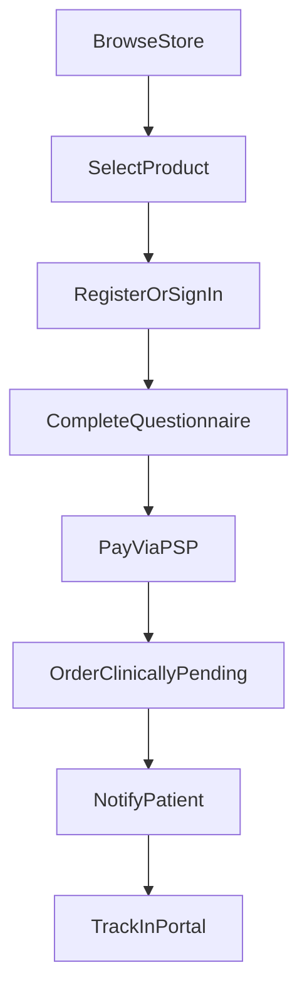
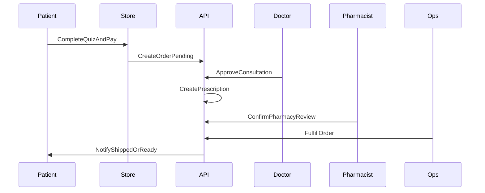
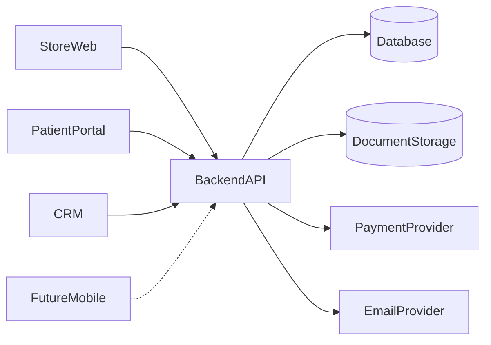
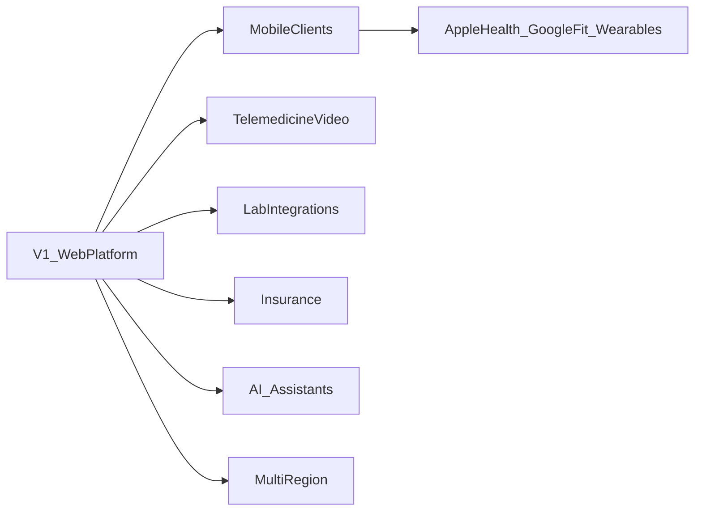

# 00 — Product Requirements Document

| Field | Value |
| --- | --- |
| Document | Product Requirements Document (PRD) |
| Product | Clinexa |
| Version | 1.0 |
| Status | Draft for review |
| Primary market | United States |
| Audience | Product, Architecture, Engineering, QA, DevOps, Design, Operations |
| Related docs | [01 — Project overview](01-project-overview.md) through [24 — Future features](24-future-features.md) |

This document is the **single source of truth** for Clinexa planning. All subsequent documents in this repository (architecture, database, APIs, CRM, Store, Patient Portal, Mobile, security, delivery) must derive scope, terminology, and business rules from this PRD. Where a later document adds detail, it must remain consistent with the decisions recorded here.

---

## Table of contents

1. [Executive Summary](#1-executive-summary)
2. [Problem Statement](#2-problem-statement)
3. [Product Vision](#3-product-vision)
4. [Goals](#4-goals)
5. [Stakeholders](#5-stakeholders)
6. [User Personas](#6-user-personas)
7. [Applications](#7-applications)
8. [Core Features](#8-core-features)
9. [Primary User Journeys](#9-primary-user-journeys)
10. [Functional Scope](#10-functional-scope)
11. [Out of Scope](#11-out-of-scope)
12. [Non-Functional Requirements](#12-non-functional-requirements)
13. [Business Rules](#13-business-rules)
14. [High-Level Architecture](#14-high-level-architecture)
15. [Risks](#15-risks)
16. [Assumptions](#16-assumptions)
17. [Constraints](#17-constraints)
18. [Success Criteria](#18-success-criteria)
19. [Future Vision](#19-future-vision)

---

## 1. Executive Summary

### 1.1 What Clinexa is

Clinexa is a modern digital healthcare platform that enables patients in the United States to discover healthcare treatments online, complete medical questionnaires, purchase treatment plans, manage subscriptions, and securely access their healthcare information.

The platform also provides healthcare professionals and internal operations teams with a CRM to manage consultations, prescriptions, patients, inventory, content, orders, and business operations.

Clinexa consists of five surfaces:

| Surface | Role in V1 |
| --- | --- |
| Store Web Application | Public commerce and treatment discovery |
| Patient Portal | Authenticated patient self-service |
| CRM | Clinical and operational control plane |
| Backend API | Shared application and domain services |
| Future Mobile Application | Native client planned after V1 web platform |

### 1.2 Why it exists

Patients increasingly expect healthcare to be as accessible as other digital services, yet most online care experiences are either fragmented (separate tools for intake, payment, messaging, and refill) or locked to a single clinical category. Clinics and digital operators need a unified system that enforces clinical gates (questionnaires, doctor review, prescriptions) while remaining configurable as the catalog grows.

Clinexa exists to provide a **catalog-agnostic** care-commerce platform: products, questionnaires, treatment plans, subscriptions, and consultation workflows are configurable through the CRM without requiring application code changes for each new category.

### 1.3 Business vision

Build a reusable healthcare platform that supports configurable treatment catalogs and clinical workflows, demonstrated in Version 1 with a small starter catalog (Weight Management, Hair Loss, Men's Health, Skincare) while remaining architecturally open to additional categories.

### 1.4 Long-term vision

Evolve from a production-ready web MVP into an enterprise healthcare platform with mobile clients, advanced care delivery (telemedicine, labs, insurance), patient engagement (wearables, health platform integrations), and intelligent assistance (AI, OCR), while preserving the same configurable core and HIPAA-aware data handling patterns.

### 1.5 Compliance posture (explicit)

Version 1 targets **United States healthcare workflows** and applies **HIPAA-aware** architectural considerations (PHI minimization, access control, auditability, encryption in transit and at rest patterns). This repository and the initial product build are a **portfolio / demonstration** effort intended to show enterprise architecture quality. They are **not** a claim of regulatory certification, Covered Entity status, or a production BAA program.

---

## 2. Problem Statement

### 2.1 Problems patients face

| Problem | Impact |
| --- | --- |
| Limited convenient access to routine treatments | Patients delay care or abandon treatment due to clinic wait times and logistics |
| Opaque online care journeys | Unclear when a clinician is involved, what happens after checkout, or how refills work |
| Fragmented follow-up | Orders, prescriptions, documents, and support live in different channels |
| Weak continuity for ongoing therapies | Subscriptions and renewals are hard to manage without a patient portal |
| Trust and privacy concerns | Patients hesitate to share health information without clear security and access boundaries |

### 2.2 Problems healthcare providers and operators face

| Problem | Impact |
| --- | --- |
| Disconnected tools | Consultations, prescriptions, inventory, content, and orders are managed in separate systems |
| Non-scalable intake | Manual questionnaire and chart review processes do not scale with order volume |
| Catalog rigidity | Adding a new treatment category often requires engineering releases |
| Weak operational visibility | Incomplete views of order lifecycle, inventory risk, and consultation backlog |
| Inconsistent permissions | Support and clinical staff share credentials or over-broad access to patient data |
| Content and commerce split | Marketing/content teams cannot safely manage educational content alongside clinical operations |

### 2.3 Why Clinexa should exist

Clinexa unifies discovery, clinical intake, commerce, subscription management, and care operations behind one Backend API and clear application boundaries:

- Patients get a coherent journey from Store discovery through Portal self-service.
- Doctors and pharmacists get structured review and prescription workflows.
- Operations, support, marketing, and content teams work in a role-scoped CRM.
- The platform remains **catalog-agnostic**, so new categories and questionnaires can be added through configuration rather than custom builds.

Without a platform designed this way, teams either overfit to one clinical vertical or assemble brittle point solutions that cannot enforce consistent clinical and privacy rules.

---

## 3. Product Vision

### 3.1 Future vision

Clinexa becomes the operating system for digital treatment programs: a configurable catalog and clinical workflow engine powering Store, Patient Portal, CRM, and future Mobile clients—extendable into telemedicine, labs, insurance, and intelligent assistance without rewriting the core care-commerce loop.

### 3.2 Business objectives

| Objective | Description |
| --- | --- |
| Convert discovery into care | Move patients from education and product discovery into questionnaire-completed, clinically governed purchases |
| Scale clinical throughput | Enable doctors and pharmacists to review cases, issue prescriptions, and resolve exceptions efficiently |
| Retain patients on therapy | Support subscriptions, renewals, portal access, and notifications that keep patients engaged |
| Operate the business | Provide inventory, content, coupons, support, analytics, and reporting in one CRM |
| Remain reusable | Prove that new categories can launch via CRM configuration without code changes |

### 3.3 Value proposition

| Audience | Value |
| --- | --- |
| Patients | Convenient, transparent access to treatments with secure self-service after purchase |
| Clinicians | Structured questionnaires, consultation queues, and prescription workflows |
| Operators | End-to-end visibility from order to fulfillment with role-based access |
| Product / engineering | One platform model that supports many treatment categories |

### 3.4 Competitive positioning

| Pattern in market | Clinexa position |
| --- | --- |
| Single-category telehealth brands | Category-agnostic platform with a demo catalog, not a one-vertical brand lock-in |
| Generic e-commerce with after-the-fact medical review | Clinical gates are first-class: questionnaires and doctor approval before prescription products proceed |
| EHR-centric clinic software | Care-commerce oriented: Store + Portal + CRM optimized for digital treatment programs |
| Point tools (forms + payments + tickets) | Unified domain model and shared Backend API across all surfaces |

Differentiation rests on **configurability + clinical governance + full care-commerce loop**, not on exclusive clinical IP for a single condition.

---

## 4. Goals

### 4.1 Business goals

- Launch a credible US-market digital healthcare MVP covering Store, Patient Portal, CRM, and Backend API.
- Demonstrate configurable catalog and questionnaire-driven clinical intake for at least four demo categories.
- Enable paid orders, subscriptions, and basic refund handling through a third-party payment provider.
- Give operations a single CRM for patients, consultations, prescriptions, inventory, content, and orders.
- Establish documentation and architecture that can scale into enterprise delivery planning.

### 4.2 Technical goals

- Provide a single Backend API consumed by Store, Patient Portal, CRM, and (later) Mobile.
- Enforce authentication, authorization, patient data isolation, and audit-friendly logging for PHI-adjacent actions.
- Model products, questionnaires, treatment plans, subscriptions, and consultation workflows as configurable entities.
- Meet non-functional targets for performance, availability, observability, and maintainability defined in Section 12.
- Prefer open-source technologies and free-tier-friendly deployment for development and demonstration environments.

### 4.3 User goals

| User group | Primary goals |
| --- | --- |
| Patients | Discover treatments, complete intake, purchase safely, manage subscriptions, access documents |
| Doctors | Review questionnaires and cases, approve or decline prescriptions, document clinical decisions |
| Pharmacists | Validate prescriptions and support fulfillment readiness |
| Support / Operations | Resolve tickets, manage orders and inventory exceptions, assist patients |
| Marketing / Content | Publish blogs and CMS content, manage coupons and SEO-oriented pages |
| Administrators | Configure roles, catalog, workflows, and platform settings |

### 4.4 Success metrics

| Metric | MVP target intent | Enterprise target intent |
| --- | --- | --- |
| Questionnaire completion rate | Majority of started Rx-eligible checkouts complete intake | Continuously optimized by category |
| Doctor review turnaround | Defined SLA (e.g., within one business day for demo ops) | Measured and alerted by queue depth |
| Order-to-fulfillment cycle time | Trackable end-to-end in CRM | Optimized with inventory and pharmacy workflows |
| Subscription renewal success | Automated renewals with failure recovery notifications | Churn analysis and retention programs |
| Portal login success / support deflection | Patients can self-serve orders, Rx status, documents | Reduced ticket volume per active patient |
| Configuration velocity | New demo product/questionnaire addable via CRM without deploy | Category launches become an ops process |
| Security / access incidents | Zero cross-patient data exposure in testing and demo | Continuous audit and access reviews |
| Platform availability | Meet V1 availability target in Section 12 | Multi-environment SLOs with on-call practice |

Detailed instrumentation belongs in later analytics and monitoring designs; this PRD defines **what must be measurable**.

---

## 5. Stakeholders

| Stakeholder | Interest in Clinexa | Primary surfaces |
| --- | --- | --- |
| Patients | Access treatments, manage care artifacts, protect privacy | Store, Patient Portal, (future Mobile) |
| Doctors | Safe, efficient clinical review and prescribing | CRM |
| Pharmacists | Prescription validity and dispensing readiness | CRM |
| Support Team | Resolve patient issues, refunds, account access | CRM, notifications |
| Operations | Order lifecycle, inventory, fulfillment coordination | CRM |
| Marketing | Acquisition, campaigns, coupons, conversion | Store, CRM (coupons/content), analytics |
| Content Team | Educational articles, CMS pages, SEO content | CRM / CMS, Store |
| Administrators | Configuration, roles, platform integrity | CRM |
| Engineering | Build and evolve the platform safely | All (via Backend API and tooling) |
| QA | Verify functional, clinical-gate, and security behavior | All surfaces |

---

## 6. User Personas

Role-permission matrices are summarized here and expanded in [08 — Role permissions](08-role-permissions.md).

### 6.1 Patient

| Dimension | Description |
| --- | --- |
| Goals | Find appropriate treatments, complete intake quickly, purchase and renew, view orders/prescriptions/documents |
| Responsibilities | Provide accurate health information; manage account credentials; keep payment and shipping details current |
| Pain points | Long clinic waits; unclear online processes; difficulty tracking refills and documents |
| Permissions | Access only own profile, orders, questionnaires, prescriptions, documents, appointments, subscriptions, and support tickets |

### 6.2 Doctor

| Dimension | Description |
| --- | --- |
| Goals | Review cases thoroughly, make approve/decline decisions, document rationale, maintain clinical quality |
| Responsibilities | Evaluate questionnaires and patient history; issue or withhold prescriptions; escalate unsafe cases |
| Pain points | Incomplete intake data; noisy queues; tools that bury clinical context under commerce data |
| Permissions | View assigned/available consultation cases; create/update clinical notes; approve/decline prescriptions within role scope; no unrelated marketing or system-admin functions |

### 6.3 Pharmacist

| Dimension | Description |
| --- | --- |
| Goals | Confirm prescription completeness and support safe fulfillment |
| Responsibilities | Review approved prescriptions; flag issues; coordinate with operations on dispensing status |
| Pain points | Missing prescription details; inventory mismatches; unclear order state |
| Permissions | View prescriptions and related order/fulfillment data; update pharmacy review status; no unilateral clinical approval replacing doctor workflow |

### 6.4 Support Team

| Dimension | Description |
| --- | --- |
| Goals | Resolve patient issues quickly with minimal clinical risk |
| Responsibilities | Handle account access, order questions, refund requests, and ticket triage |
| Pain points | Insufficient order visibility; unclear refund rules; over-broad or under-broad data access |
| Permissions | View patient-facing account/order/ticket data needed for support; initiate refund workflows per policy; no prescription approval; PHI access limited to ticket context |

### 6.5 Operations

| Dimension | Description |
| --- | --- |
| Goals | Keep orders moving; maintain inventory accuracy; coordinate fulfillment |
| Responsibilities | Manage order states, inventory levels, shipping/fulfillment updates, operational exceptions |
| Pain points | Blind spots between payment, clinical approval, and shipment; stockouts |
| Permissions | Orders, inventory, fulfillment fields, operational reports; no unrestricted clinical note editing unless dual-roled |

### 6.6 Marketing

| Dimension | Description |
| --- | --- |
| Goals | Drive qualified traffic and conversion without compromising clinical trust |
| Responsibilities | Campaigns, coupons, promotional strategy, conversion analytics interpretation |
| Pain points | Slow coupon/content changes; poor SEO tooling; lack of funnel metrics |
| Permissions | Coupons, marketing analytics views, selected CMS fields; no access to clinical notes or full PHI charts |

### 6.7 Content Team

| Dimension | Description |
| --- | --- |
| Goals | Publish accurate educational and SEO content aligned with treatments |
| Responsibilities | Blogs, CMS pages, content scheduling, basic SEO metadata |
| Pain points | Engineering dependency for every content change; inconsistent product education |
| Permissions | CMS and blog content management; no order, prescription, or clinical queue access |

### 6.8 Administrator

| Dimension | Description |
| --- | --- |
| Goals | Configure the platform safely; manage users and roles; maintain catalog/workflow integrity |
| Responsibilities | User/role administration; product/questionnaire/workflow configuration; system settings |
| Pain points | Dangerous misconfiguration; unclear audit trails |
| Permissions | Broad configuration access with audit logging; still subject to break-glass and segregation-of-duties practices for production-like environments |

### 6.9 Engineering

| Dimension | Description |
| --- | --- |
| Goals | Deliver reliable, secure, maintainable platform capabilities |
| Responsibilities | Implement Backend API and clients; observability; security controls; performance |
| Pain points | Ambiguous requirements; compliance uncertainty; free-tier resource limits |
| Permissions | Environment and deployment access per DevOps policy; not a substitute for least-privilege CRM roles in production demos |

### 6.10 QA

| Dimension | Description |
| --- | --- |
| Goals | Prove clinical gates, RBAC, and critical journeys work before release |
| Responsibilities | Test plans, regression, security-sensitive scenario validation, defect reporting |
| Pain points | Incomplete acceptance criteria; hard-to-reproduce clinical workflows |
| Permissions | Test environment access; synthetic patient data preferred over real PHI |

---

## 7. Applications

### 7.1 Summary

| Application | Primary users | V1 status |
| --- | --- | --- |
| Store Web Application | Guests, patients | In scope |
| Patient Portal | Authenticated patients | In scope |
| CRM | Clinical and internal staff | In scope |
| Backend API | All clients | In scope |
| Future Mobile Application | Patients (later clinicians if needed) | Out of V1 functional delivery; architected for later |

### 7.2 Store Web Application

| Aspect | Description |
| --- | --- |
| Purpose | Public-facing discovery and commerce entry point |
| Responsibilities | Product/category browsing, SEO pages, blogs/CMS rendering, questionnaire entry for purchase flows, cart/checkout, auth entry points, coupons, reviews display |
| Users | Guests and registered patients |
| Major features | Catalog, search, SEO, questionnaires (purchase-path), checkout, payments initiation, content, reviews, coupon apply |

### 7.3 Patient Portal

| Aspect | Description |
| --- | --- |
| Purpose | Secure self-service for ongoing care and account management |
| Responsibilities | Profile, orders, subscriptions, prescriptions status, documents, appointments, support tickets, notifications preferences |
| Users | Authenticated patients only |
| Major features | Dashboard, order history, subscription management, document download/view, appointment booking/view, password/account security, support |

### 7.4 CRM

| Aspect | Description |
| --- | --- |
| Purpose | Clinical and business operations control plane |
| Responsibilities | Patient records (staff view), consultation queues, prescriptions, inventory, CMS/blogs, orders/fulfillment, coupons, support, analytics/reports, platform configuration (products, questionnaires, treatment plans, subscriptions, consultation workflows), user/role admin |
| Users | Doctors, pharmacists, support, operations, marketing, content, administrators |
| Major features | Configurable catalog and clinical workflows; consultation review; Rx workflow; inventory; CMS; ops dashboards |

### 7.5 Backend API

| Aspect | Description |
| --- | --- |
| Purpose | Shared system of record and business logic layer |
| Responsibilities | Authentication/authorization, domain services, persistence orchestration, payment provider integration, notifications triggers, audit logging, search indexing hooks, report data |
| Users | Not end-user facing; consumed by Store, Portal, CRM, future Mobile |
| Major features | Versioned HTTP APIs, RBAC enforcement, clinical-gate enforcement, webhook receivers (payments), health/admin endpoints as designed later |

### 7.6 Future Mobile Application

| Aspect | Description |
| --- | --- |
| Purpose | Native patient experience for discovery and self-service |
| Responsibilities | Mirror high-value Portal/Store journeys on iOS/Android using the same Backend API |
| Users | Patients (V1 planning assumption) |
| Major features | Deferred to [19 — Mobile app](19-mobile-app.md); must not require a separate clinical domain model |

---

## 8. Core Features

Features describe **capabilities and ownership**, not implementation. Technical design belongs in later architecture, API, and domain documents.

### 8.1 Feature map

| Feature | Primary surfaces | Configurable via CRM (V1 intent) |
| --- | --- | --- |
| Products | Store, CRM, API | Yes |
| Authentication | Store, Portal, CRM, API | Policy settings; identity flows in API |
| Medical Questionnaires | Store, Portal, CRM, API | Yes |
| Orders | Store, Portal, CRM, API | Status model fixed; catalog-driven line items |
| Subscriptions | Portal, CRM, API, Store | Yes (plans and intervals) |
| Appointments | Portal, CRM, API | Yes (basic types/slots configuration) |
| Prescriptions | Portal, CRM, API | Workflow configurable; clinical approval required |
| Documents | Portal, CRM, API | Templates/types configurable where applicable |
| Blogs | Store, CRM | Yes |
| CMS | Store, CRM | Yes |
| CRM (ops suite) | CRM | N/A (is the control plane) |
| Notifications | All via API | Templates/triggers configurable over time |
| Payments | Store, Portal, API | Provider-backed; product prices configurable |
| Analytics | CRM | Dashboards evolve; events defined platform-wide |
| Reports | CRM | Operational and clinical-ops reports |
| Inventory | CRM, API | Yes |
| Search | Store, CRM | Indexed fields configurable with catalog |
| SEO | Store, CRM | Metadata on products/content |
| Reviews | Store, Portal, CRM | Moderation in CRM |
| Coupons | Store, CRM | Yes |
| Support | Portal, CRM | Ticket workflows |

### 8.2 Products

- Catalog-agnostic product model: categories, products, variants/SKUs, pricing, Rx-eligibility flags, media, and SEO fields.
- V1 demonstration catalog includes **Weight Management**, **Hair Loss**, **Men's Health**, and **Skincare**.
- New categories and products are addable through CRM configuration without code changes.
- Products may require a medical questionnaire before checkout completion when marked prescription-eligible.

### 8.3 Authentication

- Email/password authentication for patients and staff (staff may use the same identity system with role separation).
- Session or token-based access for web clients via Backend API.
- Password reset flow.
- Role-based authorization enforced server-side.
- Account lockout / basic abuse protections as specified in security design.

### 8.4 Medical Questionnaires

- Configurable questionnaire definitions (questions, types, branching rules as supported in V1 design).
- Bound to products, treatment plans, or consultation workflows.
- Required before purchase of prescription-eligible products.
- Responses stored as patient clinical intake artifacts visible to authorized clinicians.
- Patients can review submission status in Portal; clinicians review in CRM.

### 8.5 Orders

- Create orders from Store checkout after intake and payment authorization/capture rules succeed.
- Order contains line items, amounts, discounts, tax/shipping fields as modeled, patient identity, and clinical prerequisites status.
- Lifecycle states visible in Portal (patient) and CRM (staff).
- Orders block progression to fulfillment for Rx products until prescription approval rules are satisfied.

### 8.6 Subscriptions

- Configurable subscription plans (interval, products/treatment plans, pricing).
- Patient can view, cancel, or manage subscription settings in Portal per business rules.
- Renewal attempts automatic; failures notify patient and surface in CRM.
- Renewals for Rx-eligible therapies may require clinical reassessment rules defined in configuration (V1 supports hooks for reassessment; exact cadence configurable).

### 8.7 Appointments

- Basic appointment booking and viewing in Patient Portal.
- Staff scheduling/visibility in CRM.
- Configurable appointment types for consultation workflows.
- V1 does not include live video telemedicine (see Out of Scope).

### 8.8 Prescriptions

- Created/updated only through clinical workflow after doctor review.
- Linked to patient, questionnaire, and order/treatment context.
- Pharmacist review supported for fulfillment readiness.
- Patients see status-appropriate prescription information in Portal, not unconstrained clinical edit access.

### 8.9 Documents

- Store and present patient documents (e.g., receipts, prescription PDFs, education artifacts) with access control.
- Staff can upload/attach documents in CRM where permitted.
- Download/view audited for PHI-sensitive artifacts.

### 8.10 Blogs

- Educational and SEO content associated with treatments/categories.
- Authored and published via CRM/CMS tools.
- Rendered on Store.

### 8.11 CMS

- Manage Store pages, banners, FAQs, and content blocks without code deploys.
- Role-limited to Content/Admin (and Marketing where granted).

### 8.12 CRM

- Unified staff application for consultations, prescriptions, patients, inventory, content, orders, coupons, support, analytics, reports, and configuration.
- Enforces RBAC so clinical, support, and marketing duties remain separated.

### 8.13 Notifications

- Email notifications for account, order, prescription status, subscription renewal, appointment, and support events.
- Extensible to additional channels post-V1.
- Prefer templated, event-driven notifications triggered by Backend API domain events.

### 8.14 Payments

- Third-party payment service provider (PSP) for authorization, capture, refunds, and saved payment methods as supported.
- Platform does not store raw card PAN data; tokenization via PSP.
- Payment outcomes drive order and subscription state transitions.

### 8.15 Analytics

- Funnel and operational analytics for Store conversion, questionnaire completion, consult queue, and subscription health.
- Marketing-safe dashboards exclude unnecessary PHI.

### 8.16 Reports

- Operational reports: orders, inventory, refunds, consultation throughput.
- Export capabilities as defined in later reporting design (V1: core tabular reports in CRM).

### 8.17 Inventory

- Track stock levels for fulfillable SKUs.
- Decrement/reserve according to order lifecycle rules.
- Alert operations on low stock.
- Prevent oversell according to configured policy.

### 8.18 Search

- Store product/content search.
- CRM search for patients, orders, and catalog entities with authorization filtering.

### 8.19 SEO

- Indexable Store category/product/content pages.
- Editable metadata (title, description, canonical/slug fields) via CRM.
- Performance and semantic HTML expectations under NFRs.

### 8.20 Reviews

- Patients can submit product/treatment reviews after eligible purchases.
- Moderation workflow in CRM before public display (or configurable auto-publish with moderation queue—V1 default: moderate before publish).

### 8.21 Coupons

- Configurable percentage or fixed discounts, validity windows, usage limits, and applicable catalog scope.
- Applied at Store checkout; validated server-side.

### 8.22 Support

- Patient-submitted tickets from Portal.
- Staff triage and resolution in CRM.
- Link tickets to patient and order context when available.

---

## 9. Primary User Journeys

Detailed step scripts and edge cases belong in [07 — User journeys](07-user-journeys.md). This section defines the journeys that Version 1 must support.

### 9.1 Journey index

| Journey | Primary actor | Surfaces |
| --- | --- | --- |
| Guest Purchase | Guest → Patient | Store, API, CRM (downstream) |
| Returning Patient | Patient | Store, Portal |
| Doctor Review | Doctor | CRM |
| Prescription Workflow | Doctor, Pharmacist, Patient | CRM, Portal |
| Subscription Renewal | System, Patient, Support | API, Portal, CRM |
| Order Fulfillment | Operations, Pharmacist | CRM |
| Appointment Booking | Patient, Staff | Portal, CRM |
| Password Reset | Patient or Staff | Store/Portal/CRM entry, API |
| Refund Flow | Patient, Support, Operations | Portal, CRM, API/PSP |

### 9.2 Guest Purchase (Rx-eligible example)

1. Guest browses Store catalog and selects a prescription-eligible product.
2. Guest starts checkout and is prompted to register or sign in.
3. Patient completes the configured medical questionnaire.
4. Patient applies optional coupon and submits payment via PSP.
5. Order is created in a clinically pending state until doctor review completes.
6. Patient receives confirmation notification and can track status in Portal.

### 9.3 Returning Patient

1. Patient signs in.
2. Patient reorders or manages an existing subscription/treatment from Store or Portal.
3. If clinical reassessment is required by configuration, patient completes an updated questionnaire.
4. Payment and order rules apply as with new purchases.
5. Portal shows updated order and prescription statuses.

### 9.4 Doctor Review

1. Doctor opens consultation queue in CRM.
2. Doctor reviews questionnaire responses, patient history available in platform, and order context.
3. Doctor approves, declines, or requests additional information per workflow configuration.
4. Decision is recorded with timestamp and actor identity for auditability.
5. Downstream prescription and order states update; patient is notified of outcome.

### 9.5 Prescription Workflow

1. Upon clinical approval, prescription record is created/updated.
2. Pharmacist reviews prescription for fulfillment readiness.
3. Operations proceeds with fulfillment only when prescription and inventory rules allow.
4. Patient views prescription status and related documents in Portal.

### 9.6 Subscription Renewal

1. System identifies upcoming renewal based on plan interval.
2. System attempts payment via saved PSP method.
3. On success, renewal order is created and clinical reassessment rules evaluated.
4. On failure, patient is notified and subscription enters past-due/grace handling per rules.
5. Support can assist via CRM; patient can update payment method in Portal.

### 9.7 Order Fulfillment

1. Operations sees orders ready for fulfillment (payment captured and clinical gates cleared).
2. Inventory is reserved/decremented.
3. Shipping or dispensing status updates are recorded.
4. Patient receives shipment/fulfillment notification and Portal status update.

### 9.8 Appointment Booking

1. Patient selects an available appointment type/slot in Portal.
2. Backend validates configuration and conflicts.
3. Appointment is confirmed; notifications sent to patient and relevant staff.
4. Staff can view/manage appointments in CRM.
5. V1 appointments are scheduling artifacts only (no integrated video visit).

### 9.9 Password Reset

1. User requests reset from sign-in surface.
2. API issues time-limited reset token via email.
3. User sets a new password meeting policy.
4. Active sessions are invalidated per security design.
5. User signs in with new credentials.

### 9.10 Refund Flow

1. Patient requests refund via Support ticket or eligible Portal action.
2. Support verifies order state, fulfillment state, and refund policy rules.
3. If approved, refund is initiated through PSP; order/payment states update.
4. Inventory restock rules apply when applicable.
5. Patient receives refund confirmation notification.

---

## 10. Functional Scope

Version 1 includes the following.

### 10.1 Applications in V1

- Store Web Application
- Patient Portal
- CRM
- Backend API
- Shared database / persistence design (documented and implemented in application repos)

### 10.2 Capability scope

| Area | V1 includes |
| --- | --- |
| Catalog | Configurable categories/products; demo data for Weight Management, Hair Loss, Men's Health, Skincare |
| Clinical intake | Configurable medical questionnaires; required for Rx-eligible products |
| Auth | Register, sign-in, sign-out, password reset, RBAC |
| Commerce | Cart/checkout, coupons, orders, basic reviews with moderation |
| Subscriptions | Configurable plans, renewals, patient cancel/manage |
| Clinical ops | Doctor review queue, prescriptions, pharmacist review step |
| Appointments | Basic booking and staff visibility |
| Content | CMS pages and blogs with SEO metadata |
| Documents | Patient document access and staff attachment where permitted |
| Inventory | Stock tracking and low-stock visibility |
| Payments | PSP-integrated pay, renew, refund |
| Notifications | Email event notifications for core journeys |
| Support | Ticketing between Portal and CRM |
| Analytics/Reports | Core operational and funnel reporting in CRM |
| Search/SEO | Store search and editable SEO fields |
| Configuration | CRM configuration for products, questionnaires, treatment plans, subscriptions, consultation workflows without code changes for new categories |
| Security posture | HIPAA-aware controls as product requirements (not certification) |

### 10.3 Documentation scope in this repository

This planning repository delivers requirements and design documentation only. Application source code lives in other repositories. This PRD is the root requirements artifact for all numbered docs `01`–`24`.

---

## 11. Out of Scope

Intentionally excluded from Version 1:

| Exclusion | Rationale |
| --- | --- |
| Native iOS/Android mobile apps | Deferred to Future Mobile; API should remain mobile-ready |
| Live video telemedicine / in-app video consultation | Appointments are scheduling-only in V1 |
| AI clinical assistant / automated diagnosis | Future Vision; clinical decisions remain human-in-the-loop |
| Lab ordering and results integrations | Future Vision |
| Insurance eligibility, claims, and billing | Future Vision; V1 is patient-pay via PSP |
| Wearables, Apple Health, Google Fit | Future Vision |
| OCR for document intake | Future Vision |
| Multi-region active-active deployment | V1 is single-region |
| Multi-country clinical licensing workflows | US primary market only |
| Formal HIPAA certification, HITRUST, SOC 2 Type II as delivery gates | Portfolio HIPAA-aware architecture; certification programs are post-MVP enterprise initiatives |
| EHR replacement / full ambulatory EHR charting | Clinexa is care-commerce + clinical ops for digital treatment programs |
| Controlled-substance prescribing program depth (e.g., EPCS-specific productization) | Not a V1 product claim; architecture should not preclude later hardening |
| Marketplace of third-party clinics | Single-platform operator model in V1 |
| Real-time chat with clinicians | Notifications + tickets + consult workflow suffice for V1 |
| Multi-language / internationalization | US English V1 |

If a future document proposes an out-of-scope item for near-term delivery, it must explicitly revise this PRD first.

---

## 12. Non-Functional Requirements

Quantitative targets below are **V1 engineering targets** for a production-like demonstration. They guide architecture and testing; environment-specific SLOs may be refined in [04 — Non-functional requirements](04-non-functional-requirements.md) and [23 — Deployment](23-deployment.md).

### 12.1 Performance

| Requirement | V1 target |
| --- | --- |
| Store p95 page/API interaction for browse/search | Under 500 ms server processing for common read APIs under nominal load; end-to-end UX feels responsive on broadband |
| Portal authenticated reads (orders, subscriptions) | p95 under 700 ms server processing under nominal load |
| CRM queue list and case open | p95 under 1 s server processing under nominal staff concurrency |
| Questionnaire save/submit | Reliable under 1 s server processing for typical payloads |

### 12.2 Scalability

- Horizontal scalability path for API and web fronts.
- Catalog growth (categories, products, questionnaires) must not require redesign of core schemas.
- Consultation queue must support pagination and filtering as volume grows.
- Background jobs for renewals, notifications, and report generation must be isolatable from request/response path.

### 12.3 Availability

| Environment intent | Target |
| --- | --- |
| V1 demonstration / staging-like production | 99.5% monthly availability excluding planned maintenance |
| Critical payment/webhook processing | At-least-once handling with idempotency keys |

### 12.4 Accessibility

- Store and Patient Portal aim for **WCAG 2.2 Level AA** alignment for core journeys (browse, intake, checkout, portal self-service).
- CRM prioritizes usability and keyboard access for dense operational screens; AA alignment is a goal for primary clinical workflows.

### 12.5 SEO

- Store category, product, and blog pages are server-renderable or otherwise indexable.
- Metadata, slugs, and canonical fields are editable without code changes.
- Avoid cloaking or doorway-page tactics; content must be clinically responsible and transparent.

### 12.6 Security

| Control | Requirement |
| --- | --- |
| Transport | TLS for all client-API traffic |
| Data at rest | Encryption at rest for databases and document storage in deployed environments that support it |
| AuthN/AuthZ | Authenticated sessions/tokens; server-side RBAC on every PHI-adjacent operation |
| Patient isolation | No cross-patient reads/writes under normal authorization paths |
| PHI minimization | Collect and display only data needed for the journey; marketing analytics avoid clinical free text |
| Secrets | No secrets in source control; environment-based configuration |
| Audit | Record actor, action, timestamp, and object identifiers for clinical and admin-sensitive events |
| Payment data | PSP tokenization; no raw PAN storage |
| Dependency hygiene | Regular vulnerability scanning in CI as delivery matures |

### 12.7 Maintainability

- Clear module boundaries between Store, Portal, CRM clients and Backend API.
- Configuration-driven catalog/clinical definitions to reduce code churn.
- Documented APIs and coding guidelines in later delivery docs.
- Prefer open-source libraries with active maintenance.

### 12.8 Logging

- Structured application logs with correlation IDs across API requests.
- Logs must avoid writing sensitive questionnaire answers, secrets, or full PAN/PII where not required; use redaction patterns.
- Clinical audit events are distinct from debug logs when feasible.

### 12.9 Monitoring

- Health checks for API and critical dependencies.
- Metrics for request latency, error rates, queue depth, payment failures, renewal failures.
- Alerting hooks for elevated 5xx rates and webhook processing failures.

### 12.10 Reliability

- Idempotent payment webhook handling.
- Retry with backoff for transient external calls (email, PSP) where safe.
- Graceful degradation: Store browse may continue if non-critical services (e.g., reviews) fail; checkout must fail safe rather than create unpaid inconsistent orders.

---

## 13. Business Rules

### 13.1 Medical questionnaires

- Any product flagged as **prescription-eligible** requires a completed, valid questionnaire before order placement can finalize.
- Questionnaire definitions are versioned; responses reference the version answered.
- Clinicians review the responses associated with the consultation/order context.

### 13.2 Prescriptions and clinical approval

- Prescriptions require **doctor approval** through the consultation workflow.
- Payment alone does not authorize dispensing of prescription-eligible products.
- Declined consultations transition related orders/subscriptions according to configured cancellation/refund rules.
- Pharmacist review is required before fulfillment completion for prescription products in V1.

### 13.3 Patient data isolation

- Patients can access only their own records (profile, questionnaires, orders, prescriptions, documents, appointments, tickets, subscriptions).
- Staff access is role-scoped and must be attributable (no shared anonymous clinical accounts in production-like environments).

### 13.4 Role-based permissions

- Every privileged CRM action checks RBAC server-side.
- Marketing/Content roles must not receive default access to clinical notes or full questionnaire answer sets.
- Administrators can configure roles but configuration changes are audited.

### 13.5 Subscription renewal rules

- Renewals charge the default payment method on schedule.
- Failed renewals enter a grace/past-due path with patient notification.
- Cancellation stops future renewals; already-created orders follow order rules.
- If reassessment is configured for a plan, renewal fulfillment of Rx products remains gated on clinical requirements.

### 13.6 Order lifecycle

Canonical V1 states (names may be normalized in database design, but semantics remain):

| State | Meaning |
| --- | --- |
| `draft` | Cart/checkout not finalized |
| `payment_pending` | Awaiting PSP confirmation |
| `awaiting_clinical_review` | Paid/authorized; doctor review required |
| `clinical_approved` | Doctor approved; Rx workflow proceeding |
| `clinical_declined` | Doctor declined; refund/cancel path |
| `awaiting_fulfillment` | Cleared for operations/pharmacy fulfillment |
| `fulfilled` | Shipped/dispensed/complete |
| `cancelled` | Cancelled before fulfillment |
| `refunded` | Payment refunded (full or recorded as refunded order outcome) |

Non-Rx products may skip clinical states and move from payment success to awaiting fulfillment.

### 13.7 Refund policy assumptions

These are **product rules for the platform**, not legal advice:

- Refunds are initiated by Support/Operations (or automated rules) only when order state and policy checks allow.
- If an order is clinically declined before fulfillment, the default V1 behavior is to refund eligible captured amounts.
- After fulfillment, refunds are manual and exceptional, requiring staff approval and reason codes.
- Coupon-adjusted orders refund the amount actually captured, subject to PSP capabilities.
- Inventory restock occurs when refunds are tied to unfulfilled or returned stock per operations rules.

---

## 14. High-Level Architecture

### 14.1 Communication model

All interactive surfaces communicate with the **Backend API**. The API owns business rules, authorization, and persistence orchestration against the **Database** (and document/object storage as designed later). Store, Patient Portal, and CRM are clients. The Future Mobile app is an additional client of the same API.

### 14.2 Responsibility split

| Component | Owns | Does not own |
| --- | --- | --- |
| Store | UX for discovery, content, checkout entry | Clinical approval, inventory truth |
| Patient Portal | UX for authenticated self-service | Staff workflows, catalog configuration |
| CRM | Staff UX, configuration, clinical/ops workflows | Public SEO storefront rendering |
| Backend API | Domain logic, RBAC, integrations, audits | Pixel-level UI |
| Database | Durable state | Business rule interpretation without API |
| Future Mobile | Native UX | Separate clinical backend |

### 14.3 Configuration-driven core

Products, questionnaires, treatment plans, subscriptions, and consultation workflows are data/configuration in the platform. Adding a new category (for example, Migraine Care) should be achievable by administrators through CRM configuration and content—not by forking the codebase.

### 14.4 Stack posture at PRD level

This PRD remains **stack-agnostic**. Technology choices, schemas, and API contracts are decided in [05 — System architecture](05-system-architecture.md), [10 — Database design](10-database-design.md), and [11 — API design](11-api-design.md), subject to constraints in Section 17.

---

## 15. Risks

| Risk type | Risk | Impact | Mitigation |
| --- | --- | --- | --- |
| Security | Cross-patient data exposure or over-broad CRM roles | Severe trust failure; demo credibility loss | Server-side RBAC, automated authorization tests, audit logs, least privilege |
| Security | PHI in logs, analytics, or error trackers | Privacy incident | Redaction standards, PHI minimization, separate audit vs debug channels |
| Business | Clinical review bottleneck delays orders | Poor conversion and support load | Queue UX, SLAs, notifications, clear pending states in Portal |
| Business | Catalog configuration errors publish unsafe products | Clinical/process failure | Validation rules, versioning, publish workflows, admin audit |
| Technical | PSP webhook duplication or loss | Incorrect order/payment state | Idempotency keys, reconciliation reports |
| Technical | Over-complex configurability delays MVP | Missed delivery | Ship opinionated V1 config model; extend branching sophistication later |
| Scalability | Consultation and notification spikes | Latency and failed renewals | Background workers, pagination, rate-aware email sending |
| Scalability | Free-tier resource limits | Outages during demos | Capacity notes, graceful degradation, environment sizing guidance |
| Business | Misreading portfolio HIPAA-aware posture as certification | Legal/compliance misunderstanding | Explicit posture in this PRD and security docs |
| Operational | Inventory drift vs fulfillment | Oversell/undersell | Explicit reserve/decrement rules and ops reports |

---

## 16. Assumptions

1. Primary market for V1 is the **United States**; default locale is **en-US**.
2. V1 is a **portfolio / demonstration** platform with HIPAA-aware design patterns, not a certified Covered Entity implementation.
3. The platform is **catalog-agnostic**; demo categories are illustrative seed data.
4. New categories, products, questionnaires, treatment plans, subscriptions, and consultation workflows can be added through **CRM configuration** without code changes for ordinary catalog expansion.
5. Patients pay directly via a **third-party PSP**; insurance is out of scope for V1.
6. Doctors are licensed users operating in a demo/ops capacity defined by the operator; multi-state licensing automation is out of scope.
7. Email is the primary notification channel for V1.
8. Store, Portal, and CRM are **web applications** in V1; Mobile follows later on the same API.
9. A single Backend API is the system of record interface for all clients.
10. Document and media files may use object storage separate from the primary database.
11. Clinical decisions are made by human clinicians; the system enforces gates and records decisions.
12. V1 deployments are **single-region**.
13. Planning documentation in this repository precedes or parallels implementation in separate code repositories.
14. Refund and clinical decline financial behaviors follow Section 13.7 unless product leadership revises this PRD.
15. Reviews are moderated before public display by default.
16. Non-Rx products may be sold without doctor prescription workflow while still supporting optional questionnaires if configured.
17. Engineering will prefer **open-source** components and **free-tier-friendly** services for development and demo environments where practical.
18. Future numbered docs refine detail but do not silently contradict this PRD.

---

## 17. Constraints

### 17.1 Technology constraints

- Clients must use the shared Backend API; do not embed divergent business rules in UI-only logic.
- Prefer open-source frameworks and datastores with strong ecosystems.
- Avoid vendor lock-in that prevents portfolio demonstration or future migration, especially for core domain data.
- Stack selection must support RBAC, audit logging, encrypted transport, and background job processing.

### 17.2 Budget constraints

- Initial development and demonstration environments should be achievable on **low or free-tier** cloud/SaaS quotas where possible.
- Paid third-party services (PSP, email) should have sandbox/test modes for development.

### 17.3 Free-tier development

- Designs must acknowledge free-tier limits (compute hours, DB size, email send caps, serverless quotas).
- Critical demos should degrade gracefully rather than hard-fail the entire Store when a non-critical add-on is throttled.

### 17.4 Open-source preference

- Default to open-source libraries and tools unless a managed service is necessary for payments, email delivery, or similar commodity capabilities.
- Justify proprietary services in architecture docs when chosen.

### 17.5 Repository constraints

- This repository contains **planning documentation only** unless explicitly directed otherwise.
- No implementation code, exploit PoCs, or runtime secrets belong here.

### 17.6 Product constraints

- US-first workflows and copy.
- Catalog configurability is mandatory; hard-coding V1 categories into irreversible architecture is not allowed.
- Human clinician approval remains required for prescriptions in V1.

---

## 18. Success Criteria

### 18.1 Successful MVP

Version 1 is successful when all of the following are true:

| Criterion | Evidence |
| --- | --- |
| End-to-end Rx purchase works | Guest can register, complete questionnaire, pay, and see pending clinical status |
| Clinical gate works | Doctor can approve/decline; prescription cannot skip approval |
| Pharmacist + fulfillment path works | Approved Rx orders can be pharmacy-reviewed and fulfilled with inventory updates |
| Portal self-service works | Patient can view orders, subscription, documents, and open support tickets |
| Configuration works | Admin can add a new product/questionnaire/category via CRM without code change |
| Demo catalog present | Weight Management, Hair Loss, Men's Health, and Skincare are purchasable demos |
| Non-Rx path works | At least one non-Rx product can checkout without clinical approval states |
| Auth and isolation verified | Password reset works; automated tests prevent cross-patient access |
| Payments and refunds work in sandbox | Capture, renewal failure handling, and staff-initiated refund succeed in test mode |
| Observability baseline | Health checks, structured logs, and core error metrics exist |
| Documentation alignment | Implementation matches this PRD; deviations update this document first |

### 18.2 Successful enterprise platform

Clinexa is successful as an enterprise platform when:

| Criterion | Evidence |
| --- | --- |
| Multi-category velocity | New treatment programs launch primarily through configuration and content operations |
| Operational excellence | Consultation SLAs, fulfillment cycle times, and renewal success are continuously measured and improved |
| Security maturity | Formal security program path (policies, BAAs, penetration testing, compliance evidence) can be pursued without rewriting core architecture |
| Multi-client parity | Mobile and additional clients reuse the same API and domain rules |
| Extensibility | Telemedicine, labs, insurance, and AI features integrate as modules on the existing core |
| Reliability at scale | Published SLOs met under real load with proven incident response |
| Organizational adoption | Clinical, ops, support, and marketing teams run daily work in CRM without shadow spreadsheets |

---

## 19. Future Vision

Items below are **explicitly post-V1**. They must not block MVP delivery. Detailed sequencing belongs in [09 — Feature roadmap](09-feature-roadmap.md) and [24 — Future features](24-future-features.md).

| Theme | Future capability | Notes |
| --- | --- | --- |
| AI | AI assistant for patient navigation and draft support summaries | Human clinician remains accountable for clinical decisions |
| Telemedicine | Asynchronous and synchronous telemedicine workflows | Builds on consultation model |
| Video consultation | Integrated video visits | Extends appointments beyond scheduling |
| Lab integrations | Order labs and ingest results | Requires partner integrations and result UX |
| Insurance | Eligibility checks and claims-oriented billing | Major payments domain expansion |
| Wearables | Device-derived adherence and vitals signals | Privacy and consent critical |
| Apple Health | HealthKit import/export patterns | Mobile-first dependency |
| Google Fit | Fitness/health platform integration | Mobile-first dependency |
| OCR | Extract data from uploaded documents | Accelerate intake; requires validation UX |
| AI Assistant | Care guidance, FAQ, ops copilots | Separate patient vs staff assistants |
| Multi-region deployment | Active multi-region availability and data residency controls | Beyond V1 single-region |

---

## Document control

| Item | Value |
| --- | --- |
| Owner | Product + Architecture (Clinexa planning) |
| Change rule | Material scope changes update this PRD before downstream docs |
| Implementation rule | Downstream docs and code repositories derive from this file |
| Next expected docs | [01 — Project overview](01-project-overview.md), [02 — Business requirements](02-business-requirements.md), [03 — Functional requirements](03-functional-requirements.md) |

---

## Revision History

| Version | Date | Author | Changes |
|----------|------|--------|----------|
| 1.0 | YYYY-MM-DD | Abhishek Singh Sengar | Initial PRD |

---

*End of Product Requirements Document.*
