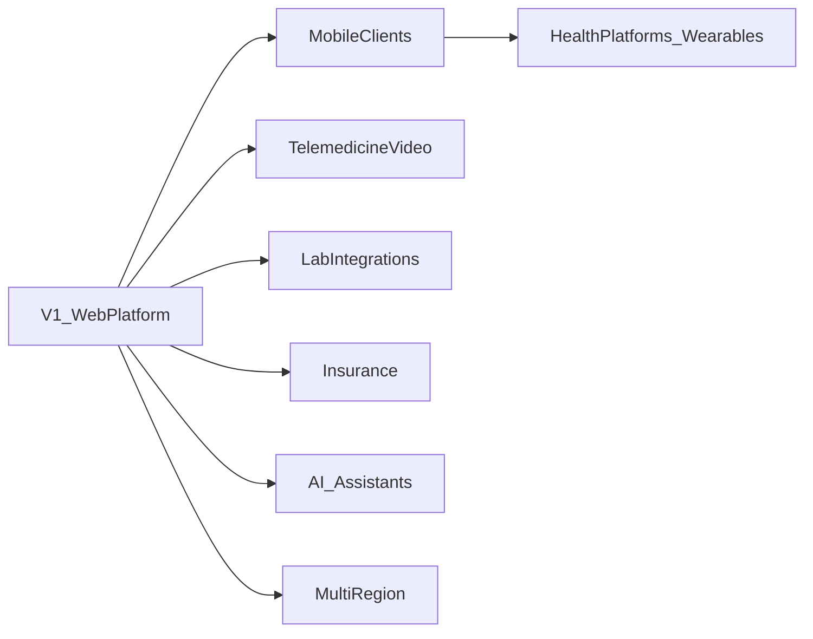
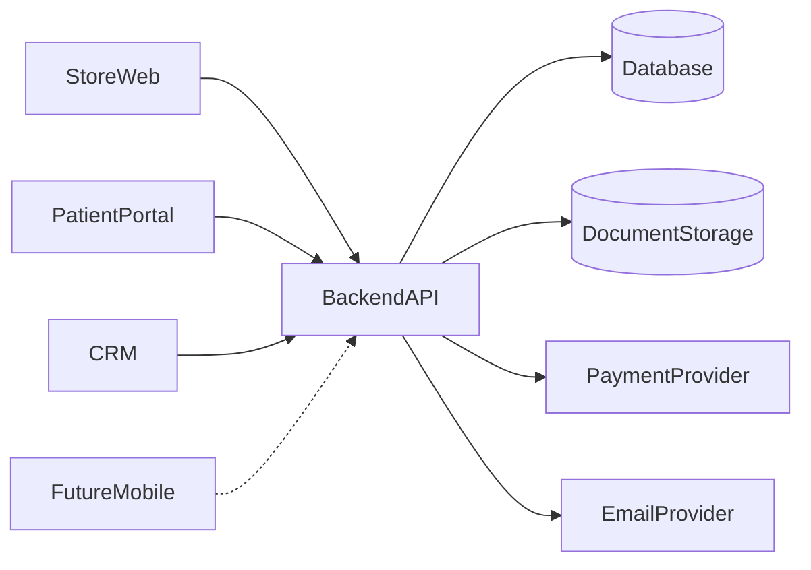
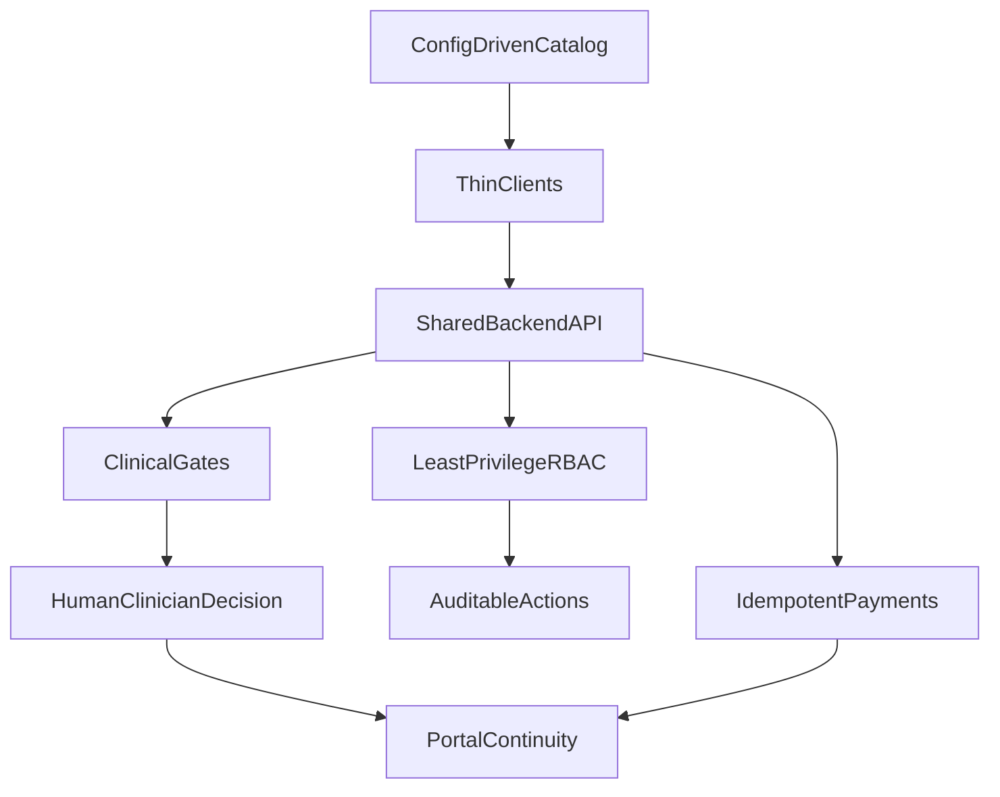

# 01 — Project Overview

| Field | Value |
| --- | --- |
| Document | Project Overview |
| Product | Clinexa |
| Version | 1.0 |
| Status | Draft for review |
| Primary market | United States |
| Audience | Product, Architecture, Engineering, QA, DevOps, Design, Operations |
| Source of truth | [00 — Product Requirements Document](00-product-requirements-document.md) |
| Related docs | [02 — Business requirements](02-business-requirements.md), [05 — System architecture](05-system-architecture.md), [06 — User personas](06-user-personas.md) |

This document is the **project orientation charter** for Clinexa. It explains what the product is, why it exists, how the major pieces fit together, and which design principles guide later planning. Requirements detail, feature inventories, journey scripts, and business rules live in the [PRD](00-product-requirements-document.md); this overview expands that foundation with narrative context and design rationale rather than repeating it.

---

## Table of contents

1. [Product Overview](#1-product-overview)
2. [Vision](#2-vision)
3. [Mission](#3-mission)
4. [Product Scope](#4-product-scope)
5. [High-Level Architecture](#5-high-level-architecture)
6. [Major Applications](#6-major-applications)
7. [Target Audience](#7-target-audience)
8. [Business Objectives](#8-business-objectives)
9. [Technology Overview](#9-technology-overview)
10. [Design Philosophy](#10-design-philosophy)

---

## 1. Product Overview

### 1.1 What Clinexa is

Clinexa is a **care-commerce platform**: it unifies treatment discovery, clinical intake, payment, clinician review, fulfillment readiness, and ongoing patient self-service behind one shared Backend API and clear application boundaries.

Patients in the United States can discover treatments online, complete medical questionnaires, purchase treatment plans, manage subscriptions, and securely access their healthcare information. Healthcare professionals and internal teams use a CRM to manage consultations, prescriptions, patients, inventory, content, orders, and day-to-day operations.

The defining product idea is **catalog-agnostic configurability**. Products, questionnaires, treatment plans, subscriptions, and consultation workflows are platform data—not hard-coded verticals—so new categories can launch through CRM configuration rather than custom application forks.

### 1.2 The care-commerce loop

Version 1 is designed around a continuous loop, not isolated tools:

Payment alone never authorizes dispensing of prescription-eligible products. Clinical gates are first-class platform behavior. Journey step detail belongs in the [PRD](00-product-requirements-document.md#9-primary-user-journeys) and later in [07 — User journeys](07-user-journeys.md).

### 1.3 Platform surfaces

| Surface | Role | V1 status |
| --- | --- | --- |
| Store Web Application | Public discovery, content, and commerce entry | In scope |
| Patient Portal | Authenticated patient self-service | In scope |
| CRM | Clinical and operational control plane | In scope |
| Backend API | Shared domain logic, authorization, integrations | In scope |
| Future Mobile Application | Native patient client on the same API | Architected for later; not V1 delivery |

### 1.4 Positioning

Clinexa is not a single-condition telehealth brand, a generic storefront with medical review bolted on, a full ambulatory EHR, or a bundle of disconnected forms/payments/tickets. Differentiation rests on **configurability + clinical governance + a complete care-commerce loop**. Competitive pattern detail is recorded in [PRD §3.4](00-product-requirements-document.md#34-competitive-positioning).

### 1.5 Compliance posture

V1 targets United States healthcare workflows and applies **HIPAA-aware** architectural considerations (PHI minimization, access control, auditability, encryption in transit and at rest patterns). This planning repository and the initial build are a **portfolio / demonstration** effort intended to show enterprise architecture quality. They are **not** a claim of regulatory certification, Covered Entity status, or a production BAA program. Security depth belongs in [13 — Security](13-security.md).

---

## 2. Vision

### 2.1 Near-term vision

Ship a credible, production-ready **web MVP** that demonstrates:

- A configurable treatment catalog and questionnaire-driven clinical intake
- Paid orders and subscriptions via a third-party payment provider
- Doctor and pharmacist workflows that enforce clinical gates before fulfillment
- Patient continuity through a secure Patient Portal
- A single CRM for catalog configuration, clinical ops, content, and business operations

The V1 demonstration catalog (Weight Management, Hair Loss, Men's Health, Skincare) is **seed data**, not the product identity. Architecture and data models must remain open to additional categories without redesign.

### 2.2 Long-term vision

Clinexa becomes the **operating system for digital treatment programs**: a configurable catalog and clinical workflow engine powering Store, Patient Portal, CRM, and Mobile—extendable into telemedicine, labs, insurance, wearables, and intelligent assistance **without rewriting** the core care-commerce loop.

Sequencing of post-V1 work belongs in [09 — Feature roadmap](09-feature-roadmap.md) and [24 — Future features](24-future-features.md). Future themes must not block MVP delivery.

### 2.3 Design decision: platform over vertical brand

**Decision:** Build a reusable platform demonstrated with a small starter catalog, rather than optimizing irreversible architecture for one clinical vertical.

**Rationale:** Single-category brands scale marketing, not software. A catalog-agnostic core lets the same platform prove multi-category velocity and remain credible as an enterprise foundation.

---

## 3. Mission

### 3.1 Mission statement

**Make digital treatment programs operable end-to-end**—from education and discovery through clinically governed purchase, fulfillment, and ongoing self-service—on one configurable platform that protects patient data boundaries and keeps human clinicians accountable for prescribing decisions.

### 3.2 Mission pillars

| Pillar | Intent |
| --- | --- |
| Patient access | Convenient, transparent journeys from discovery to secure self-service |
| Clinical throughput | Structured intake and review so doctors and pharmacists can decide efficiently and safely |
| Therapy retention | Subscriptions, renewals, portal access, and notifications that sustain ongoing care |
| Operational control | One CRM for orders, inventory, content, support, and configuration |
| Reusability | New categories and workflows launch primarily through configuration, not code forks |

These pillars align with the value proposition in [PRD §3.3](00-product-requirements-document.md#33-value-proposition). Detailed stakeholder interests are in [PRD §5](00-product-requirements-document.md#5-stakeholders).

---

## 4. Product Scope

### 4.1 What Version 1 includes

| Area | V1 summary |
| --- | --- |
| Applications | Store, Patient Portal, CRM, Backend API |
| Catalog | Configurable categories/products; demo seed for four categories |
| Clinical intake | Configurable medical questionnaires; required for Rx-eligible products |
| Auth | Register, sign-in, sign-out, password reset, server-side RBAC |
| Commerce | Checkout, coupons, orders, moderated reviews |
| Subscriptions | Configurable plans, renewals, patient manage/cancel |
| Clinical ops | Doctor review queue, prescriptions, pharmacist review step |
| Appointments | Basic booking and staff visibility (scheduling only) |
| Content | CMS pages and blogs with editable SEO metadata |
| Documents | Patient access and staff attachment where permitted |
| Inventory | Stock tracking and low-stock visibility |
| Payments | PSP pay, renew, refund (no raw PAN storage) |
| Notifications | Email events for core journeys |
| Support | Ticketing between Portal and CRM |
| Analytics / reports | Core funnel and operational reporting in CRM |
| Security posture | HIPAA-aware product requirements (not certification) |

Capability and feature ownership detail is in [PRD §8](00-product-requirements-document.md#8-core-features) and [PRD §10](00-product-requirements-document.md#10-functional-scope). Functional requirement expansion belongs in [03 — Functional requirements](03-functional-requirements.md).

### 4.2 What Version 1 excludes

Intentionally out of V1 (non-exhaustive; full rationale in [PRD §11](00-product-requirements-document.md#11-out-of-scope)):

- Native mobile apps (API remains mobile-ready)
- Live video telemedicine
- AI clinical diagnosis / automated prescribing
- Lab ordering and results integrations
- Insurance eligibility and claims
- Wearables and consumer health platform sync
- OCR intake, multi-region active-active, multi-country licensing
- Formal HIPAA / HITRUST / SOC 2 certification as delivery gates
- Full ambulatory EHR replacement
- Marketplace of third-party clinics; real-time clinician chat; i18n beyond en-US

If a later document proposes near-term delivery of an excluded item, the PRD must be revised first.

### 4.3 Documentation scope

This repository holds **planning and architecture documentation only**. Application source code lives in other repositories. Numbered docs `01`–`24` refine the PRD; they must not silently contradict it.

### 4.4 Design decision: seed catalog vs product identity

**Decision:** Treat Weight Management, Hair Loss, Men's Health, and Skincare as demonstration data.

**Rationale:** Hard-coding those categories into irreversible schemas or UI would contradict the catalog-agnostic mission. Configuration velocity is itself a V1 success criterion ([PRD §18](00-product-requirements-document.md#18-success-criteria)).

---

## 5. High-Level Architecture

### 5.1 Communication model

All interactive surfaces are clients of a single **Backend API**. The API owns business rules, authorization, audit-friendly logging, and persistence orchestration against the primary database and document/object storage. External commodity services handle payments and email delivery.

Component topology above matches [PRD §14](00-product-requirements-document.md#14-high-level-architecture). Detailed system design belongs in [05 — System architecture](05-system-architecture.md).

### 5.2 Responsibility split

| Component | Owns | Does not own |
| --- | --- | --- |
| Store | Discovery, content rendering, checkout entry UX | Clinical approval, inventory truth |
| Patient Portal | Authenticated self-service UX | Staff workflows, catalog configuration |
| CRM | Staff UX, configuration, clinical/ops workflows | Public SEO storefront rendering |
| Backend API | Domain logic, RBAC, integrations, audits | Pixel-level UI |
| Database | Durable state | Business rule interpretation without the API |
| Future Mobile | Native UX | A separate clinical backend |

### 5.3 Configuration-driven core

Products, questionnaires, treatment plans, subscriptions, and consultation workflows are **data/configuration**. Adding a category such as Migraine Care should be achievable by administrators through CRM configuration and content—not by forking the codebase.

### 5.4 Design decisions

| Decision | Rationale |
| --- | --- |
| Single Backend API for all clients | One place to enforce clinical gates, RBAC, and payment/order consistency; Mobile can attach later without a second domain model |
| Business rules server-side | UI-only enforcement cannot protect PHI isolation or Rx gates |
| Clients remain thin on domain authority | Store/Portal/CRM optimize UX for their audiences; truth stays in the API |
| PSP for card data | Avoid storing raw PAN; tokenize and react to provider outcomes/webhooks |
| Email as V1 notification channel | Sufficient for core journeys; channel expansion is post-V1 |

Order lifecycle semantics and clinical business rules remain in [PRD §13](00-product-requirements-document.md#13-business-rules); persistence and API contracts in [10 — Database design](10-database-design.md) and [11 — API design](11-api-design.md).

---

## 6. Major Applications

### 6.1 Summary

| Application | Primary users | Planning depth |
| --- | --- | --- |
| Store Web Application | Guests, patients | [16 — Store architecture](16-store-architecture.md) |
| Patient Portal | Authenticated patients | [17 — Patient portal](17-patient-portal.md) |
| CRM | Clinical and internal staff | [18 — CRM](18-crm.md) |
| Backend API | All clients (non-end-user) | [05 — System architecture](05-system-architecture.md), [11 — API design](11-api-design.md) |
| Future Mobile Application | Patients (later) | [19 — Mobile app](19-mobile-app.md) |

### 6.2 Store Web Application

Public-facing entry point for discovery and commerce. Guests browse categories and content; registered patients complete purchase-path questionnaires, apply coupons, and initiate payment. The Store starts the care-commerce loop but does not own clinical approval or inventory truth.

### 6.3 Patient Portal

Secure self-service after purchase and during ongoing therapy: profile, orders, subscriptions, prescription status, documents, appointments, support tickets, and notification preferences. Portal access is patient-scoped only—no staff workflows and no catalog configuration.

### 6.4 CRM

Clinical and business operations control plane. Doctors review consultations; pharmacists confirm fulfillment readiness; operations manage orders and inventory; marketing and content manage coupons and CMS; administrators configure catalog, questionnaires, treatment plans, subscriptions, consultation workflows, users, and roles. RBAC keeps clinical, support, and marketing duties separated ([08 — Role permissions](08-role-permissions.md)).

### 6.5 Backend API

System of record interface: authentication/authorization, domain services, persistence orchestration, PSP and email integrations, webhook receivers, audit logging, and search/report data hooks. Not end-user facing; consumed by Store, Portal, CRM, and future Mobile.

### 6.6 Future Mobile Application

Native patient experience planned after the V1 web platform. Must reuse the same Backend API and domain rules; it must not introduce a parallel clinical model. V1 still designs the API to remain mobile-ready.

### 6.7 Design decision: four apps, one domain

**Decision:** Separate Store, Portal, and CRM clients instead of one mega-app.

**Rationale:** Public SEO/commerce, authenticated patient self-service, and dense staff operations have incompatible UX, caching, and access patterns. Separation clarifies threat boundaries while the shared API preserves a single domain.

---

## 7. Target Audience

### 7.1 External audience

| Audience | Goals at overview level | Primary surfaces |
| --- | --- | --- |
| Guests | Discover treatments and educational content | Store |
| Patients | Complete intake, purchase, renew, self-serve artifacts | Store, Patient Portal, (future Mobile) |

### 7.2 Internal audience

| Audience | Goals at overview level | Primary surfaces |
| --- | --- | --- |
| Doctors | Review cases; approve or decline prescriptions with documented rationale | CRM |
| Pharmacists | Confirm prescription completeness for fulfillment readiness | CRM |
| Support | Resolve account, order, and refund issues with least-privilege PHI access | CRM |
| Operations | Move orders; maintain inventory; coordinate fulfillment | CRM |
| Marketing | Drive conversion via campaigns, coupons, and funnel insight | Store, CRM |
| Content Team | Publish educational and SEO content without engineering deploys | CRM → Store |
| Administrators | Configure roles, catalog, workflows, and platform settings safely | CRM |

### 7.3 Delivery stakeholders

| Audience | Interest |
| --- | --- |
| Engineering | Build and evolve the platform safely across all surfaces via the Backend API |
| QA | Verify clinical gates, RBAC, and critical journeys before release |
| Product / Design | Keep journeys coherent and configurable without over-fitting one vertical |

Persona depth and pain points belong in [06 — User personas](06-user-personas.md). Permission matrices belong in [08 — Role permissions](08-role-permissions.md).

---

## 8. Business Objectives

### 8.1 Outcome objectives

| Objective | Outcome |
| --- | --- |
| Convert discovery into care | Patients move from education and catalog browsing into questionnaire-completed, clinically governed purchases |
| Scale clinical throughput | Doctors and pharmacists review cases, issue or withhold prescriptions, and resolve exceptions efficiently |
| Retain patients on therapy | Subscriptions, renewals, portal access, and notifications keep patients engaged after first purchase |
| Operate the business | Inventory, content, coupons, support, analytics, and reporting run in one CRM |
| Remain reusable | New categories can launch via CRM configuration without application code changes |

### 8.2 Success framing

- **Successful MVP:** End-to-end Rx and non-Rx paths work; clinical gates cannot be skipped; Portal self-service works; admin configuration works; auth isolation holds; payments/refunds work in sandbox. Evidence criteria are in [PRD §18.1](00-product-requirements-document.md#181-successful-mvp).
- **Successful enterprise platform:** Multi-category velocity, operational excellence, security program maturity, multi-client parity, modular extensibility, and organizational adoption without shadow spreadsheets. See [PRD §18.2](00-product-requirements-document.md#182-successful-enterprise-platform).

Measurable targets, constraints, and business requirements expansion belong in [02 — Business requirements](02-business-requirements.md). Metric intent (what must be measurable) is introduced in [PRD §4.4](00-product-requirements-document.md#44-success-metrics).

### 8.3 Design decision: portfolio MVP with enterprise posture

**Decision:** Optimize V1 for a demonstrable, architecture-credible MVP on practical budgets, while refusing shortcuts that would force a rewrite for enterprise hardening later (especially RBAC, auditability, and catalog configurability).

**Rationale:** Portfolio credibility depends on proving the hard platform properties early—not on claiming production compliance prematurely.

---

## 9. Technology Overview

### 9.1 Stack posture

This overview remains **stack-agnostic**, consistent with [PRD §14.4](00-product-requirements-document.md#144-stack-posture-at-prd-level). Concrete framework, datastore, and hosting choices are decided in [05 — System architecture](05-system-architecture.md), [10 — Database design](10-database-design.md), [11 — API design](11-api-design.md), and [23 — Deployment](23-deployment.md).

### 9.2 Architectural constraints

| Constraint | Implication |
| --- | --- |
| Shared Backend API | Clients must not embed divergent clinical or payment business rules |
| Server-side RBAC | Every PHI-adjacent and privileged CRM action is authorized in the API |
| Auditability | Clinical and admin-sensitive actions record actor, action, timestamp, and object identifiers |
| Background processing | Renewals, notifications, and report generation must be isolatable from request/response latency |
| Horizontal scale path | API and web fronts should scale out as queue and traffic grow |
| Single-region V1 | Multi-region active-active is post-V1 |

### 9.3 Preference constraints

| Preference | Guidance |
| --- | --- |
| Open source first | Prefer maintained open-source frameworks and datastores for core domain software |
| Free-tier-friendly demos | Development and demonstration environments should fit low/free quotas where practical |
| Avoid unnecessary lock-in | Core domain data must remain migratable; justify proprietary services in architecture docs |
| Managed commodity OK | Payments and transactional email may use managed providers with sandbox modes |

### 9.4 Integration boundaries

| Concern | Approach |
| --- | --- |
| Card payments | Third-party PSP; tokenization; idempotent webhook handling |
| Notifications | Event-driven email from domain events in V1 |
| Documents / media | Object storage separate from primary transactional database as designed later |
| Identity | Email/password for patients and staff with role separation; session/token access via API ([12 — Authentication flow](12-authentication-flow.md)) |

### 9.5 Quality attributes (pointers)

Performance, availability, accessibility, SEO, logging, and monitoring targets are specified in [PRD §12](00-product-requirements-document.md#12-non-functional-requirements) and will be expanded in [04 — Non-functional requirements](04-non-functional-requirements.md). This overview does not redefine those numbers.

### 9.6 Design decision: postpone stack selection to architecture docs

**Decision:** Keep `01` and the PRD free of framework lock-in.

**Rationale:** Orientation and requirements should survive stack debates. Choosing React vs alternatives, or a specific cloud, belongs where deployment and engineering trade-offs are analyzed—not in the charter.

---

## 10. Design Philosophy

The principles below guide every subsequent planning document. When a design proposal conflicts with these principles, it should justify an explicit PRD revision.

### 10.1 Principles

| # | Principle | Meaning in practice |
| --- | --- | --- |
| 1 | Configuration over hard-coding | Catalog, questionnaires, treatment plans, subscriptions, and consultation workflows are configurable entities |
| 2 | Clinical gates are first-class | For Rx-eligible products, questionnaire completion and doctor approval precede dispensing; payment is not clinical authorization |
| 3 | One domain, many clients | Store, Portal, CRM, and future Mobile share one Backend API and one rule set |
| 4 | Least privilege by default | Patients see only their own records; staff roles are narrow; marketing/content do not receive clinical charts by default |
| 5 | Human clinician accountability | The system enforces gates and records decisions; it does not automate diagnosis or prescribe in V1 |
| 6 | Care-commerce continuity | Discovery, intake, commerce, clinical ops, fulfillment, and self-service are one loop—not disconnected tools |
| 7 | Separation of staff duties | CRM supports clinical, pharmacy, support, ops, marketing, and content work without collapsing them into shared god-roles |
| 8 | Fail safe on money and clinical state | Prefer failed-safe checkout over inconsistent unpaid orders; payment webhooks are idempotent; order states make clinical pending visible |
| 9 | HIPAA-aware without overclaim | Design for PHI minimization, encryption patterns, audit, and isolation—without asserting certification the portfolio has not earned |
| 10 | Portable and demo-friendly | Prefer open components and environments that can be demonstrated under free-tier constraints with graceful degradation |

### 10.2 How principles interact

### 10.3 Anti-patterns to avoid

| Anti-pattern | Why it conflicts |
| --- | --- |
| Hard-coding V1 demo categories into irreversible schema or UI | Breaks reusability and configuration velocity |
| Approving Rx fulfillment from payment success alone | Skips clinical governance |
| Embedding divergent business rules in Store/Portal/CRM clients | Creates inconsistent clinical and payment behavior |
| Shared anonymous staff accounts in production-like demos | Destroys auditability and least privilege |
| Treating portfolio HIPAA-aware design as certified compliance | Misrepresents legal/compliance posture |
| Blocking MVP on telemedicine, insurance, AI, or multi-region | Conflates future vision with V1 delivery |

### 10.4 Design decision: opinionated V1 configurability

**Decision:** Ship an opinionated but real configuration model in V1 (products, questionnaires, plans, workflows), and defer extreme branching sophistication if it threatens MVP delivery.

**Rationale:** The PRD already identifies over-complex configurability as a delivery risk. The philosophy is “configuration-first,” not “infinite CMS for clinical logic on day one.”

---

## Related reading

| Topic | Document |
| --- | --- |
| Requirements contract | [00 — Product Requirements Document](00-product-requirements-document.md) |
| Business goals and constraints | [02 — Business requirements](02-business-requirements.md) |
| What the system must do | [03 — Functional requirements](03-functional-requirements.md) |
| Quality attributes | [04 — Non-functional requirements](04-non-functional-requirements.md) |
| System structure | [05 — System architecture](05-system-architecture.md) |
| Personas | [06 — User personas](06-user-personas.md) |
| Roles and authorization | [08 — Role permissions](08-role-permissions.md) |
| Store / Portal / CRM / Mobile | [16](16-store-architecture.md), [17](17-patient-portal.md), [18](18-crm.md), [19](19-mobile-app.md) |

---

## Document control

| Item | Value |
| --- | --- |
| Owner | Product + Architecture (Clinexa planning) |
| Change rule | Material scope or principle changes should align with the PRD first |
| Implementation rule | Downstream docs and code repositories derive from the PRD; this overview orients readers |

---

## Revision History

| Version | Date | Author | Changes |
| --- | --- | --- | --- |
| 1.0 | 2026-07-23 | Abhishek Singh Sengar | Initial project overview |

---

*End of Project Overview.*
