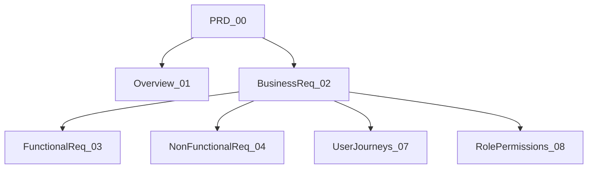
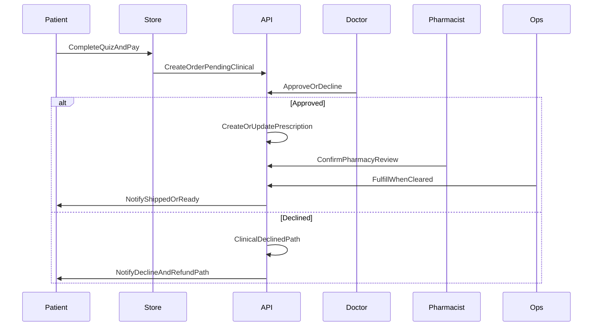
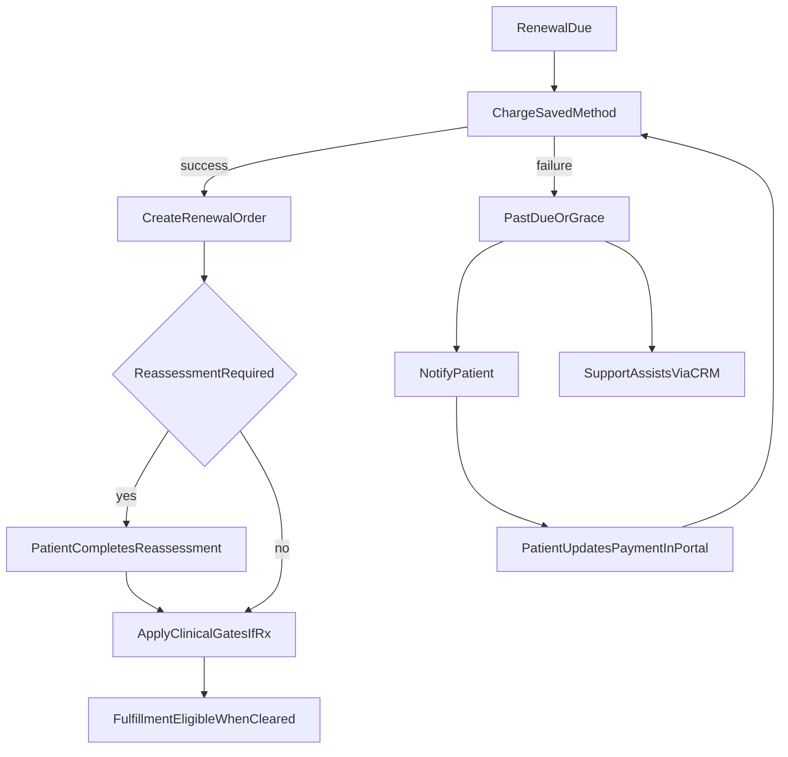
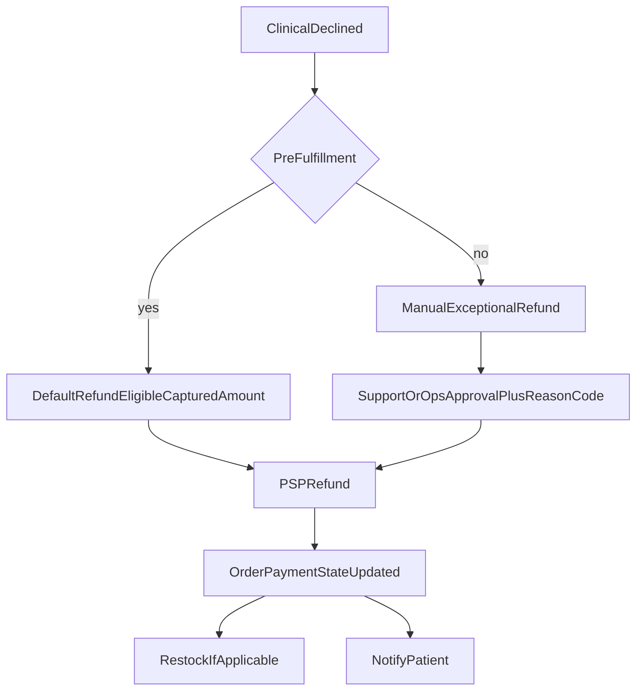
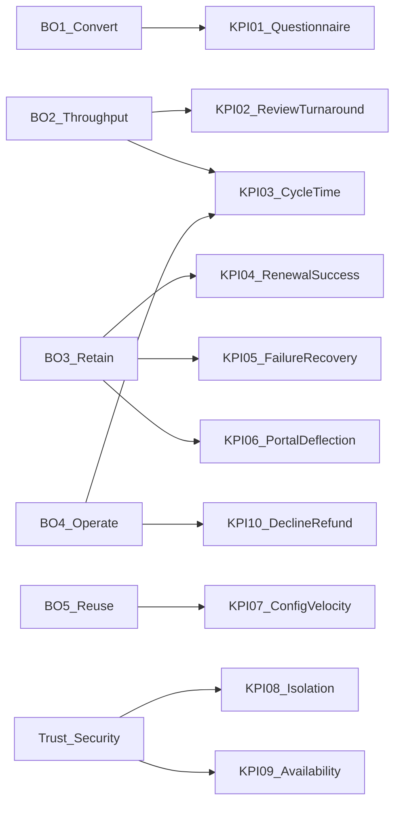

# 02 — Business Requirements

| Field | Value |
| --- | --- |
| Document | Business Requirements |
| Product | Clinexa |
| Version | 1.0 |
| Status | Draft for review |
| Primary market | United States |
| Audience | Product, Architecture, Engineering, QA, Operations, Clinical Ops, Support, Marketing |
| Source of truth | [00 — Product Requirements Document](00-product-requirements-document.md) |
| Related docs | [01 — Project overview](01-project-overview.md), [03 — Functional requirements](03-functional-requirements.md), [04 — Non-functional requirements](04-non-functional-requirements.md) |

This document is the **business requirements charter** for Clinexa. It expands the [PRD](00-product-requirements-document.md) into operable stakeholder accountability, process semantics, acceptance evidence, priorities, constraints, operational rules, and measurable KPIs. It does not redefine product vision, feature inventories, or technical design—those remain in the PRD and downstream numbered docs.

---

## Table of contents

1. [Purpose and Scope](#1-purpose-and-scope)
2. [Stakeholders](#2-stakeholders)
3. [Business Processes](#3-business-processes)
4. [Operational Rules](#4-operational-rules)
5. [Acceptance Criteria](#5-acceptance-criteria)
6. [Priority Matrix](#6-priority-matrix)
7. [Business Constraints](#7-business-constraints)
8. [KPIs](#8-kpis)
9. [Design Decisions](#9-design-decisions)

---

## 1. Purpose and Scope

### 1.1 What this document owns

| Concern | Owned here | Owned elsewhere |
| --- | --- | --- |
| Stakeholder outcomes and RACI | Yes | Persona narratives → [06](06-user-personas.md) |
| Business process handoffs and gates | Yes | Journey step scripts → [07](07-user-journeys.md) |
| Operational product policies | Yes | Authoritative rule list → [PRD §13](00-product-requirements-document.md#13-business-rules) |
| Business acceptance evidence | Yes | Functional how-to → [03](03-functional-requirements.md); test plans → [22](22-testing-strategy.md) |
| V1 MoSCoW prioritization | Yes | Roadmap sequencing → [09](09-feature-roadmap.md) |
| Measurable KPI definitions | Yes | Metric instrumentation → analytics/monitoring designs later |
| Quality attribute targets | No | [PRD §12](00-product-requirements-document.md#12-non-functional-requirements), [04](04-non-functional-requirements.md) |
| Role permission matrices | No | [08](08-role-permissions.md) |

### 1.2 Relationship to other foundation docs

- The [PRD](00-product-requirements-document.md) is the requirements contract.
- [01 — Project overview](01-project-overview.md) orients readers on vision, scope, and design philosophy.
- This BRD makes business outcomes **testable, owned, and prioritized** for V1 delivery.

### 1.3 Business objectives (reference)

The five outcome objectives from the PRD drive every section below. Full narrative context is in [PRD §3.2](00-product-requirements-document.md#32-business-objectives) and [01 §8](01-project-overview.md#8-business-objectives).

| ID | Objective | BRD focus |
| --- | --- | --- |
| BO-1 | Convert discovery into care | Purchase, intake, and clinical-pending processes |
| BO-2 | Scale clinical throughput | Doctor/pharmacist queues, SLAs, review rules |
| BO-3 | Retain patients on therapy | Subscriptions, renewals, portal self-service |
| BO-4 | Operate the business | Fulfillment, inventory, support, content, reports |
| BO-5 | Remain reusable | Catalog/questionnaire configuration without code |

---

## 2. Stakeholders

Stakeholder interests at list level are defined in [PRD §5](00-product-requirements-document.md#5-stakeholders). This section expands them into **business outcomes**, escalation interest, and process accountability. Persona pain points and permission detail belong in [06](06-user-personas.md) and [08](08-role-permissions.md).

### 2.1 Stakeholder register

| Stakeholder | Business outcome they need | Primary surfaces | Escalation interest |
| --- | --- | --- | --- |
| Patients | Transparent, clinically governed purchase and secure self-service afterward | Store, Patient Portal | Privacy breach; stuck clinical pending; failed renewal |
| Doctors | Safe, attributable approve/decline decisions with complete intake context | CRM | Incomplete questionnaires; queue backlog beyond SLA |
| Pharmacists | Prescription completeness before dispensing readiness | CRM | Missing Rx detail; inventory mismatch blocking fulfillment |
| Support Team | Fast resolution of account, order, and refund issues with least-privilege PHI | CRM, notifications | Unclear refund policy; over/under data access |
| Operations | Predictable order movement from clearance to fulfillment with accurate stock | CRM | Blind spots between payment, clinical gate, and shipment |
| Marketing | Qualified conversion via coupons and funnel insight without clinical chart access | Store, CRM (coupons/analytics) | Funnel breakage; coupon misconfiguration |
| Content Team | Publish educational/SEO content without engineering deploys | CRM → Store | Content blocked behind releases |
| Administrators | Safe configuration of catalog, workflows, users, and roles with auditability | CRM | Unsafe catalog publish; role misconfiguration |
| Engineering | Single domain API enforceable for clinical gates, payments, and RBAC | All (via Backend API) | Divergent client-side business rules |
| QA | Verifiable clinical-gate, isolation, and journey acceptance before release | All surfaces (test envs) | Ambiguous acceptance criteria |

### 2.2 Duty-separation expectations (business view)

| Boundary | Business expectation |
| --- | --- |
| Patient vs staff | Patients never access other patients’ records; staff access is role-scoped and attributable |
| Clinical vs marketing/content | Marketing/Content do not receive default access to clinical notes or full questionnaire answers |
| Doctor vs pharmacist | Pharmacists confirm fulfillment readiness; they do not replace doctor clinical approval |
| Support vs prescribing | Support initiates refunds per policy; Support never approves prescriptions |
| Admin vs break-glass | Broad configuration access remains audited; production-like demos avoid shared anonymous clinical accounts |

### 2.3 RACI by core process

Legend: **R** = Responsible (does the work), **A** = Accountable (owns outcome), **C** = Consulted, **I** = Informed.

Clinical and payment gates are enforced by the Backend API for all processes; the table shows **human/system business accountability**.

| Process | Patient | Doctor | Pharmacist | Support | Ops | Marketing | Content | Admin | System/API |
| --- | --- | --- | --- | --- | --- | --- | --- | --- | --- |
| Guest / new purchase | R | I | — | I | I | C | — | — | A (gates, order create) |
| Doctor review | I | R/A | C | — | I | — | — | — | A (state + audit) |
| Prescription + pharmacy review | I | R (approve) | R/A (pharmacy ready) | — | C | — | — | — | A (Rx record) |
| Order fulfillment | I | — | C | — | R/A | — | — | — | A (inventory rules) |
| Subscription renewal | C | C (if reassessment) | C | C | I | — | — | — | R/A (charge + grace) |
| Refund flow | R (request) | I (if clinical decline) | — | R/A (policy) | C | — | — | — | A (PSP + state) |
| Catalog configuration | — | C | C | — | C | C | C | R/A | A (validation) |
| Content publish | I | — | — | — | — | C | R/A | C | A (publish rules) |

### 2.4 Design decision: RACI emphasizes gates over UI ownership

**Decision:** Treat the Backend API as Accountable for clinical and payment gate integrity on every process, even when a CRM role is Responsible for the human decision.

**Rationale:** UI-only enforcement cannot protect PHI isolation or Rx dispensing rules. Staff RACI describes who acts; system accountability describes what must never be skipped.

---

## 3. Business Processes

Primary journeys that V1 must support are indexed in [PRD §9](00-product-requirements-document.md#9-primary-user-journeys). This section defines **process semantics**—triggers, handoffs, gates, and failure paths. Detailed step scripts belong in [07 — User journeys](07-user-journeys.md).

### 3.1 Process catalog

| ID | Process | Trigger | Primary actors | Business objective |
| --- | --- | --- | --- | --- |
| BP-01 | Guest / Rx purchase | Guest selects Rx-eligible product | Patient, System | BO-1 |
| BP-02 | Returning patient reorder / manage | Authenticated patient reorders or manages therapy | Patient, System | BO-1, BO-3 |
| BP-03 | Doctor review | Order enters clinical review queue | Doctor, System | BO-2 |
| BP-04 | Prescription + pharmacy readiness | Clinical approval creates/updates Rx | Doctor, Pharmacist, System | BO-2 |
| BP-05 | Order fulfillment | Payment + clinical gates cleared | Ops, Pharmacist, System | BO-4 |
| BP-06 | Subscription renewal | Plan interval due | System, Patient, Support | BO-3 |
| BP-07 | Appointment booking | Patient selects type/slot | Patient, Staff | BO-3, BO-4 |
| BP-08 | Password reset | User requests reset | Patient or Staff, System | Trust / access |
| BP-09 | Refund | Patient request or clinical decline path | Support, Ops, System | BO-4 |
| BP-10 | Catalog configuration | Admin publishes category/product/questionnaire | Admin | BO-5 |
| BP-11 | Content publish | Content publishes CMS/blog | Content, Marketing | BO-1, BO-4 |

### 3.2 Care-commerce value stream

### 3.3 BP-01 — Guest / Rx purchase

| Dimension | Definition |
| --- | --- |
| Trigger | Guest selects a prescription-eligible product and starts checkout |
| Inputs | Catalog selection, registration/sign-in, completed questionnaire, optional coupon, PSP payment |
| Gates | Auth before finalize; valid questionnaire for Rx-eligible; successful payment authorization/capture rules |
| Happy path outcome | Order in clinically pending state; patient notified; Portal status visible |
| Failure paths | Incomplete questionnaire blocks finalize; payment failure leaves no inconsistent unpaid order; coupon invalidation fails closed |
| Notifications | Order confirmation / pending clinical review |

Non-Rx purchases follow the same commerce path but skip clinical review states (see OR-07).

### 3.4 BP-03 / BP-04 / BP-05 — Clinical review to fulfillment (swimlane)

| Handoff | From → To | Exit criteria |
| --- | --- | --- |
| Intake complete | Patient → Clinical queue | Questionnaire version recorded; payment success; state `awaiting_clinical_review` |
| Clinical decision | Doctor → Rx or decline path | Approve/decline/request-info recorded with actor + timestamp |
| Pharmacy ready | Pharmacist → Ops | Pharmacy review confirms fulfillment readiness |
| Fulfillment | Ops → Patient | Inventory rules applied; shipping/dispensing status recorded |

### 3.5 BP-06 — Subscription renewal and grace

| Dimension | Definition |
| --- | --- |
| Trigger | Subscription interval reaches renewal window |
| System duties | Attempt charge; create renewal order on success; evaluate reassessment config; enter grace/past-due on failure |
| Patient duties | Update payment method; complete reassessment when configured |
| Support duties | Assist on failed renewals without bypassing clinical gates |
| Gate | Rx renewal fulfillment remains clinically gated when reassessment/plan rules require it |

### 3.6 BP-09 — Clinical decline and refund path

Refund policy product rules are expanded in [§4.9](#49-or-09--or-10--refund-tiers); legal interpretation is out of scope for this charter.

### 3.7 BP-10 / BP-11 — Configuration and content (operator processes)

| Process | Business meaning | Done when |
| --- | --- | --- |
| Catalog configuration | Admin adds/updates categories, products, questionnaires, plans, or consultation workflows via CRM | New demo-class catalog item is purchasable/usable **without** an application code deploy |
| Content publish | Content publishes educational/SEO pages and blogs | Store renders published content with editable metadata; no clinical chart access required |

These processes prove **BO-5 (Remain reusable)** and reduce engineering dependency for ordinary catalog and content expansion.

### 3.8 Supporting processes (summary)

| Process | Business note |
| --- | --- |
| BP-02 Returning patient | May require reassessment questionnaire per configuration before reorder/renew fulfillment |
| BP-07 Appointments | Scheduling artifacts only in V1; no integrated video visit |
| BP-08 Password reset | Time-limited email token; sessions invalidated per security design |

---

## 4. Operational Rules

Authoritative short-form business rules live in [PRD §13](00-product-requirements-document.md#13-business-rules). This section expands them into **operational policies** (OR-xx) with rationale, exceptions, and audit expectations.

> **Disclaimer:** These are platform product policies for Clinexa planning and demonstration—not legal, medical, or compliance advice.

### 4.1 Rule index

| ID | Theme | Related PRD |
| --- | --- | --- |
| OR-01 | Rx questionnaire required before finalize | §13.1 |
| OR-02 | Questionnaire versioning | §13.1 |
| OR-03 | Payment is not dispensing authority | §13.2 |
| OR-04 | Doctor approval required for prescriptions | §13.2 |
| OR-05 | Pharmacist review before Rx fulfillment completion | §13.2 |
| OR-06 | Patient isolation and attributable staff access | §13.3, §13.4 |
| OR-07 | Marketing/Content PHI boundary | §13.4 |
| OR-08 | Order lifecycle semantics | §13.6 |
| OR-09 | Non-Rx clinical-state skip | §13.6 |
| OR-10 | Subscription charge, grace, cancel, reassessment | §13.5 |
| OR-11 | Refund tiers | §13.7 |
| OR-12 | Inventory reserve/decrement and oversell | §8.17, §15 |
| OR-13 | Review moderation before publish | §8.20, §16.15 |
| OR-14 | Configuration publish safety | §14.3, §15 |

### 4.2 OR-01 / OR-02 — Clinical intake

| Rule | Policy |
| --- | --- |
| OR-01 | Any product flagged prescription-eligible requires a completed, valid questionnaire before order placement can finalize. |
| OR-02 | Questionnaire definitions are versioned; each response references the version answered; clinicians review responses in consultation/order context. |

**Rationale:** Intake without version traceability undermines clinical accountability and auditability.

**Exception:** Non-Rx products may omit questionnaires unless optionally configured (OR-09).

**Audit:** Record questionnaire definition version, submission timestamp, patient identity, and linked order/consultation identifiers.

### 4.3 OR-03 / OR-04 / OR-05 — Clinical gates

| Rule | Policy |
| --- | --- |
| OR-03 | Payment success alone never authorizes dispensing of prescription-eligible products. |
| OR-04 | Prescriptions are created/updated only through doctor approval in the consultation workflow. |
| OR-05 | Pharmacist review is required before fulfillment completion for prescription products in V1. |

**Rationale:** Clinical governance is a first-class platform property—not an after-the-fact commerce addon.

**Exception:** None for Rx-eligible V1 paths. Declined consultations follow cancellation/refund rules (OR-11).

**Audit:** Actor, action, timestamp, and object identifiers for approve/decline, Rx create/update, and pharmacy review.

### 4.4 OR-06 / OR-07 — Access and duty separation

| Rule | Policy |
| --- | --- |
| OR-06 | Patients access only their own records. Staff access is role-scoped and attributable; shared anonymous clinical accounts are prohibited in production-like environments. |
| OR-07 | Marketing and Content roles must not receive default access to clinical notes or full questionnaire answer sets. |

**Rationale:** Least privilege protects trust and demo credibility; over-broad CRM access is an explicit PRD business risk.

**Exception:** Dual-roled users may hold additional permissions only via explicit role assignment, still audited.

### 4.5 OR-08 / OR-09 — Order lifecycle

Canonical V1 semantics (physical schema names may normalize in [10 — Database design](10-database-design.md)):

| State | Business meaning |
| --- | --- |
| `draft` | Checkout not finalized |
| `payment_pending` | Awaiting PSP confirmation |
| `awaiting_clinical_review` | Paid/authorized; doctor review required |
| `clinical_approved` | Doctor approved; Rx workflow proceeding |
| `clinical_declined` | Doctor declined; refund/cancel path |
| `awaiting_fulfillment` | Cleared for operations/pharmacy fulfillment |
| `fulfilled` | Shipped/dispensed/complete |
| `cancelled` | Cancelled before fulfillment |
| `refunded` | Payment refunded (full or recorded refund outcome) |

| Rule | Policy |
| --- | --- |
| OR-08 | Staff and patients must see lifecycle states that make clinical pending and decline visible; fulfillment must not proceed until clearance rules pass. |
| OR-09 | Non-Rx products may skip clinical states and move from payment success to awaiting fulfillment. |

**Rationale:** Opaque “processing” states drive support load and erode patient trust.

### 4.6 OR-10 — Subscriptions

| Situation | Policy |
| --- | --- |
| Scheduled renewal | Charge default saved PSP method on plan interval |
| Charge failure | Enter grace/past-due; notify patient; surface in CRM |
| Cancellation | Stop future renewals; already-created orders follow order rules |
| Reassessment configured | Rx renewal fulfillment remains gated on clinical requirements |

**Rationale:** Retention depends on automated renewal with recoverable failure—not silent charge failure or clinical bypass.

### 4.7 OR-11 — Refund tiers

| Tier | When | Policy |
| --- | --- | --- |
| Clinical decline (pre-fulfillment) | Doctor declines before fulfillment | Default V1: refund eligible captured amounts |
| Post-fulfillment | After shipment/dispense | Manual, exceptional; staff approval + reason codes |
| Coupon-adjusted | Any refund of discounted order | Refund amount actually captured, subject to PSP capabilities |
| Inventory | Refund tied to unfulfilled/returned stock | Restock per operations rules |

**Rationale:** Predictable decline refunds reduce support friction; post-fulfillment exceptions preserve inventory and abuse controls.

### 4.8 OR-12 — Inventory

| Rule | Policy |
| --- | --- |
| OR-12 | Reserve/decrement stock according to order lifecycle; alert on low stock; prevent oversell per configured policy. |

**Rationale:** Inventory drift is an explicit operational risk (oversell/undersell) in the PRD.

### 4.9 OR-13 / OR-14 — Trust and configuration safety

| Rule | Policy |
| --- | --- |
| OR-13 | Patient reviews are moderated before public display by default in V1. |
| OR-14 | Catalog/questionnaire/workflow publishes require validation and audit; unsafe or incomplete clinical configuration must not silently go live. |

**Rationale:** Catalog configuration errors that publish unsafe products are a named business risk; content trust affects conversion quality.

### 4.10 Design decision: policies over legal claims

**Decision:** State refund and clinical rules as **product policies** with explicit non-legal disclaimer.

**Rationale:** Matches PRD §13.7 posture and prevents this planning repo from implying regulatory or Covered Entity status.

---

## 5. Acceptance Criteria

MVP success evidence is summarized in [PRD §18.1](00-product-requirements-document.md#181-successful-mvp). This section expands that evidence into **business acceptance criteria** (AC-BR-xxx). Functional implementation detail belongs in [03](03-functional-requirements.md); verification methods in [22](22-testing-strategy.md).

### 5.1 How to read AC-BR items

Each criterion is met when the **Evidence** column can be demonstrated in a sandbox/demo environment without bypassing operational rules in §4.

### 5.2 AC-BR suite

| ID | Criterion | Evidence (business-verifiable) | Maps to |
| --- | --- | --- | --- |
| AC-BR-01 | End-to-end Rx purchase | Guest registers, completes questionnaire, pays, and sees clinically pending status in Portal | PRD §18.1 |
| AC-BR-02 | Clinical gate non-bypass | Doctor can approve or decline; no path creates a dispensable Rx without doctor approval; payment alone does not clear fulfillment for Rx | OR-03, OR-04 |
| AC-BR-03 | Pharmacy + fulfillment | Approved Rx orders can be pharmacy-reviewed and fulfilled with inventory updates recorded | OR-05, OR-12 |
| AC-BR-04 | Portal self-service | Patient views orders, subscription, documents, and opens a support ticket scoped to self | OR-06 |
| AC-BR-05 | Configuration without deploy | Admin adds a new product/questionnaire/category via CRM and it becomes usable without application code change | BO-5, BP-10 |
| AC-BR-06 | Demo catalog present | Weight Management, Hair Loss, Men's Health, and Skincare are purchasable demonstration categories | PRD §8.2 |
| AC-BR-07 | Non-Rx path | At least one non-Rx product checkouts without clinical approval states | OR-09 |
| AC-BR-08 | Auth and isolation | Password reset works; automated checks prevent cross-patient access under normal authorization | OR-06 |
| AC-BR-09 | Payments and refunds (sandbox) | Capture, renewal failure handling with patient notification, and staff-initiated refund succeed in PSP test mode | OR-10, OR-11 |
| AC-BR-10 | Clinical decline refund path | Declining a pre-fulfillment Rx order triggers the default eligible-captured refund behavior | OR-11 |
| AC-BR-11 | Subscription grace path | Failed renewal enters past-due/grace, notifies patient, and does not silently fulfill Rx without gates | OR-10 |
| AC-BR-12 | Review moderation | Submitted reviews are not publicly visible until moderated (V1 default) | OR-13 |
| AC-BR-13 | Marketing PHI boundary | Marketing/Content role cannot open full clinical questionnaire answers or clinical notes by default | OR-07 |
| AC-BR-14 | Observability baseline | Health checks, structured logs, and core error metrics exist so ops can detect payment/webhook and API failures | PRD §18.1 |
| AC-BR-15 | Documentation alignment | Implementation matches the PRD; material deviations update the PRD before claiming acceptance | PRD document control |

### 5.3 Enterprise acceptance (north star, not V1 gate)

Enterprise platform success criteria in [PRD §18.2](00-product-requirements-document.md#182-successful-enterprise-platform) are **directional**. They inform KPI enterprise columns in §8 but are not V1 exit gates.

| Theme | Business signal |
| --- | --- |
| Multi-category velocity | New programs launch primarily via configuration and content ops |
| Operational excellence | Consultation SLAs, fulfillment cycle times, renewal success continuously measured |
| Security maturity | Formal compliance program path possible without core rewrite |
| Organizational adoption | Clinical, ops, support, and marketing run daily work in CRM without shadow spreadsheets |

### 5.4 Design decision: business ACs before UI scripts

**Decision:** Write acceptance as outcome + evidence, not pixel-level UI steps.

**Rationale:** UI will evolve; clinical gates, isolation, and configuration velocity must not.

---

## 6. Priority Matrix

### 6.1 Prioritization method

**Decision:** Use **MoSCoW** for V1 business capabilities.

**Rationale:** The PRD already separates in-scope, out-of-scope, and future vision. MoSCoW makes that separation delivery-actionable without a separate weighted scoring model.

### 6.2 MoSCoW matrix (V1)

| Priority | Capability | Objectives served | Notes |
| --- | --- | --- | --- |
| Must | Store + Portal + CRM + shared Backend API care-commerce loop | BO-1–BO-5 | Core V1 surfaces |
| Must | Configurable catalog + medical questionnaires | BO-1, BO-5 | Rx questionnaire gate |
| Must | Doctor review + prescription + pharmacist review | BO-2 | Clinical governance |
| Must | PSP pay, renew, refund (no raw PAN storage) | BO-1, BO-3, BO-4 | Sandbox-proven |
| Must | Patient data isolation + server-side RBAC | Trust | Zero cross-patient exposure target |
| Must | Order lifecycle with clinical pending visibility | BO-1, BO-2, BO-4 | OR-08 |
| Must | Subscription manage/cancel + renewal failure notification | BO-3 | OR-10 |
| Must | Inventory tracking with oversell policy | BO-4 | OR-12 |
| Must | Email notifications for core journey events | BO-1, BO-3 | V1 channel |
| Must | Support ticketing Portal ↔ CRM | BO-4 | |
| Should | Basic appointment booking (scheduling only) | BO-3, BO-4 | No video |
| Should | Coupons with server-side validation | BO-1 | |
| Should | Moderated product reviews | BO-1 | OR-13 |
| Should | CMS/blogs with editable SEO metadata | BO-1, BO-4 | |
| Should | Core funnel and operational reports in CRM | BO-2, BO-4 | |
| Could | Advanced questionnaire branching sophistication | BO-5 | Defer if it threatens MVP |
| Could | Richer analytics dashboards beyond core reports | BO-4 | Evolve post-MVP |
| Won’t (V1) | Native mobile apps | — | API remains mobile-ready |
| Won’t (V1) | Live video telemedicine | — | Appointments scheduling-only |
| Won’t (V1) | Insurance eligibility/claims | — | Patient-pay via PSP |
| Won’t (V1) | Labs, wearables, OCR, AI diagnosis/prescribing | — | Human clinician accountable |
| Won’t (V1) | Multi-region active-active; multi-country licensing | — | US / single-region |
| Won’t (V1) | Formal HIPAA/HITRUST/SOC 2 certification as delivery gates | — | HIPAA-aware posture only |
| Won’t (V1) | Full ambulatory EHR; clinic marketplace; clinician real-time chat; i18n | — | See [PRD §11](00-product-requirements-document.md#11-out-of-scope) |

### 6.3 Objective coverage check

| Objective | Must-level coverage |
| --- | --- |
| BO-1 Convert | Store checkout, questionnaires, clinical pending, coupons (Should) |
| BO-2 Throughput | Doctor/pharmacist workflows, queue visibility, reports (Should) |
| BO-3 Retain | Subscriptions, Portal, email notifications, appointments (Should) |
| BO-4 Operate | Fulfillment, inventory, support, CMS (Should), reports (Should) |
| BO-5 Reuse | CRM configuration of catalog/questionnaires/plans/workflows |

Post-V1 sequencing belongs in [09 — Feature roadmap](09-feature-roadmap.md) and [24 — Future features](24-future-features.md). Won’t items must not block MVP delivery.

---

## 7. Business Constraints

Technical and budget constraints are listed in [PRD §17](00-product-requirements-document.md#17-constraints). This section frames them as **business commitments and limits** on what V1 may promise.

### 7.1 Market and operating model

| Constraint | Business implication |
| --- | --- |
| United States primary market; en-US default | Copy, workflows, and demo ops assume US English; no i18n commitment in V1 |
| Patient-pay via third-party PSP | No insurance eligibility or claims in V1 revenue model |
| Single-platform operator model | No third-party clinic marketplace in V1 |
| Web-first V1 | Mobile is future client of the same API—not a parallel clinical system |

### 7.2 Compliance posture constraint

| Constraint | Business implication |
| --- | --- |
| HIPAA-**aware** architecture (PHI minimization, access control, auditability, encryption patterns) | Design and acceptance may claim awareness and controls |
| Not certification, Covered Entity status, or production BAA program | Marketing, demos, and docs must not imply formal HIPAA/HITRUST/SOC 2 certification as V1 delivery outcomes |

This constraint is intentional portfolio posture; see [PRD §1.5](00-product-requirements-document.md#15-compliance-posture-explicit) and [13 — Security](13-security.md).

### 7.3 Product and clinical constraints

| Constraint | Business implication |
| --- | --- |
| Human clinician approval required for prescriptions | No automated diagnosis or prescribing in V1 |
| Catalog configurability mandatory | Hard-coding demo categories (Weight Management, Hair Loss, Men's Health, Skincare) into irreversible architecture is forbidden |
| Seed catalog ≠ product identity | Success includes configuration velocity, not only the four demo categories |
| Appointments are scheduling-only | Do not sell or demo integrated video visits as V1 |

### 7.4 Delivery and repository constraints

| Constraint | Business implication |
| --- | --- |
| Free-tier-friendly development/demo environments | Prefer graceful degradation of non-critical add-ons over hard Store failure when quotas throttle |
| Open-source preference for core domain software | Managed PSP/email allowed as commodity; justify proprietary lock-in in architecture docs |
| Planning repository is documentation only | No implementation code or secrets in this repo |
| Shared Backend API ownership of business rules | Clients must not embed divergent clinical or payment logic |

### 7.5 Out-of-scope as commitment boundaries

Exclusions in [PRD §11](00-product-requirements-document.md#11-out-of-scope) are **business constraints on V1 promises**. If a later document proposes near-term delivery of an excluded item, the PRD must be revised first.

### 7.6 Assumptions that bound these requirements

Business requirements inherit PRD assumptions ([PRD §16](00-product-requirements-document.md#16-assumptions)), including: catalog-agnostic seed data; email as primary V1 notification channel; single-region deployment; moderated reviews by default; refund behaviors per §13.7 unless leadership revises the PRD.

---

## 8. KPIs

[PRD §4.4](00-product-requirements-document.md#44-success-metrics) defines **what must be measurable**. This section defines KPI formulas, owners, cadences, and MVP vs enterprise intent. Instrumentation detail belongs in later analytics and monitoring designs; availability numeric targets are refined in [04 — Non-functional requirements](04-non-functional-requirements.md).

### 8.1 KPI register

| ID | KPI | Definition | MVP target intent | Enterprise target intent | Owner | Cadence |
| --- | --- | --- | --- | --- | --- | --- |
| KPI-01 | Questionnaire completion rate | Completed valid Rx questionnaires ÷ started Rx-eligible checkouts | Majority of started Rx checkouts complete intake | Continuously optimized by category | Product + Marketing | Per demo cycle; weekly when live ops |
| KPI-02 | Doctor review turnaround | Time from `awaiting_clinical_review` to clinical decision | Within **one business day** for demo ops | Measured and alerted by queue depth | Clinical Ops (Doctors) | Daily queue review |
| KPI-03 | Order-to-fulfillment cycle time | Time from payment success to `fulfilled` (Rx includes clinical + pharmacy clearance) | Trackable end-to-end in CRM | Optimized with inventory and pharmacy workflows | Operations | Per order; weekly summary |
| KPI-04 | Subscription renewal success | Successful auto-renew charges ÷ renewal attempts | Automated renewals with failure recovery notifications | Churn analysis and retention programs | Operations + Support | Per renewal batch |
| KPI-05 | Renewal failure recovery | Share of failed renewals that receive patient notification and enter grace/past-due correctly | 100% of failed attempts notified in sandbox/demo | Monitored with alerting | System + Support | Per failure event |
| KPI-06 | Portal support deflection | Active patients successfully self-serving orders/Rx status/documents vs tickets per active patient | Patients can self-serve core artifacts | Reduced ticket volume per active patient | Support | Weekly |
| KPI-07 | Configuration velocity | New demo product or questionnaire addable via CRM without application deploy | Proven at least once in MVP acceptance (AC-BR-05) | Category launches become an ops process | Admin + Product | Per catalog change |
| KPI-08 | Cross-patient access incidents | Count of unauthorized cross-patient reads/writes in test/demo | **Zero** | Continuous audit and access reviews | Security + QA | Per release + continuous tests |
| KPI-09 | Platform availability | Uptime of demo/staging-like production excluding planned maintenance | Meet V1 target (**99.5%** monthly intent per PRD §12.3) | Multi-environment SLOs with on-call practice | Engineering / DevOps | Monthly |
| KPI-10 | Clinical decline refund correctness | Pre-fulfillment clinical declines that follow default eligible refund path | 100% in sandbox acceptance | Continuous reconciliation | Support + Ops | Per decline event |

### 8.2 KPI to objective map

### 8.3 Measurement notes

- MVP targets are **demonstration and acceptance intents**, not production SLA contracts with customers.
- Enterprise columns describe the operating maturity the architecture must not preclude.
- Marketing-safe analytics must avoid unnecessary PHI (align with OR-07 and PRD analytics posture).

### 8.4 Design decision: one-business-day review SLA for MVP

**Decision:** Use **one business day** as the default MVP doctor review turnaround target for demo operations.

**Rationale:** The PRD cites this as the example SLA. It is concrete enough for acceptance and KPI ownership without inventing enterprise on-call SLOs prematurely.

---

## 9. Design Decisions

| # | Decision | Rationale |
| --- | --- | --- |
| 1 | This BRD owns operable business detail; the PRD remains the requirements contract | Prevents duplicate competing “sources of truth” while enabling owners, ACs, and KPIs |
| 2 | MoSCoW for V1 prioritization | Maps cleanly to PRD in/out/future without a custom scoring framework |
| 3 | Operational rules are product policies, not legal advice | Preserves portfolio compliance honesty |
| 4 | Backend API remains Accountable for clinical/payment gates in RACI | UI cannot be the enforcement boundary |
| 5 | Demo review SLA defaults to one business day | Concrete MVP KPI until enterprise SLOs exist |
| 6 | Operator processes (catalog config, content publish) are first-class in the process catalog | Configuration velocity is a V1 success criterion, not a nice-to-have |

---

## Related reading

| Topic | Document |
| --- | --- |
| Requirements contract | [00 — Product Requirements Document](00-product-requirements-document.md) |
| Orientation charter | [01 — Project overview](01-project-overview.md) |
| Functional requirements | [03 — Functional requirements](03-functional-requirements.md) |
| Quality attributes | [04 — Non-functional requirements](04-non-functional-requirements.md) |
| Personas | [06 — User personas](06-user-personas.md) |
| Journey scripts | [07 — User journeys](07-user-journeys.md) |
| Roles and authorization | [08 — Role permissions](08-role-permissions.md) |
| Roadmap / future | [09](09-feature-roadmap.md), [24](24-future-features.md) |
| Payments / notifications / security | [15](15-payment-flow.md), [14](14-notifications.md), [13](13-security.md) |

---

## Document control

| Item | Value |
| --- | --- |
| Owner | Product + Operations (Clinexa planning) |
| Change rule | Material business rule, scope, or KPI changes should align with the PRD first |
| Implementation rule | Downstream functional, journey, and role docs derive acceptance and process semantics from this BRD and the PRD |

---

## Revision History

| Version | Date | Author | Changes |
| --- | --- | --- | --- |
| 1.0 | 2026-07-23 | Abhishek Singh Sengar | Initial business requirements |

---

*End of Business Requirements.*
