# 03 — Functional Requirements

| Field | Value |
| --- | --- |
| Document | Functional Requirements Specification (FRS) |
| Product | Clinexa |
| Version | 1.1 |
| Status | Draft for review |
| Primary market | United States |
| Audience | Backend, Frontend, Mobile, QA, Product, Architecture, Operations |
| Source of truth | [00 — Product Requirements Document](00-product-requirements-document.md) |
| Related docs | [01 — Project overview](01-project-overview.md), [02 — Business requirements](02-business-requirements.md), [04 — Non-functional requirements](04-non-functional-requirements.md) |

This document is the **Functional Requirements Specification (FRS)** for Clinexa Version 1. It expands the [PRD](00-product-requirements-document.md) into implementable system behavior for developers and QA. It does not redefine product vision or business policy—those remain in the PRD and [02 — Business requirements](02-business-requirements.md). Downstream docs (APIs, database, journeys, roles, tests) must remain traceable to the `FR-*`, `US-*`, and `AC-*` IDs defined here.

> **Prescriptions note:** Prescriptions are not a standalone top-level module. Prescription behavior is specified inside Questionnaires (intake), Orders (clinical states), CRM (doctor approval and pharmacist review), Patient Portal (status-appropriate view), Documents (Rx artifacts), and Notifications.

---

## Table of contents

1. [Introduction](#1-introduction)
2. [Functional Modules](#2-functional-modules)
3. [User Stories Index](#3-user-stories-index)
4. [Acceptance Criteria Index](#4-acceptance-criteria-index)
5. [Functional Dependencies](#5-functional-dependencies)
6. [State Diagrams](#6-state-diagrams)
7. [Error Handling](#7-error-handling)
8. [Assumptions](#8-assumptions)
9. [Constraints](#9-constraints)
10. [Traceability Matrix](#10-traceability-matrix)
11. [CRUD Responsibility Matrix](#11-crud-responsibility-matrix)
12. [Domain Events](#12-domain-events)
13. [Sequence Diagrams](#13-sequence-diagrams)
14. [State Machine Summary](#14-state-machine-summary)
15. [Glossary](#15-glossary)

---

## 1. Introduction

### 1.1 Purpose

Specify **what the system shall do** for every V1 functional module so that:

- Backend developers can implement domain services and clinical/payment gates.
- Frontend and mobile developers can build Store, Patient Portal, and CRM clients against shared behavior.
- QA can derive test cases from Given/When/Then acceptance criteria.
- Product and architects can trace each FR to business requirements (`BO-*`, `BP-*`, `OR-*`, `AC-BR-*`).

### 1.2 Scope

#### In scope (V1)

| Area | Functional coverage in this FRS |
| --- | --- |
| Applications | Store Web, Patient Portal, CRM, Backend API behavior (client-agnostic) |
| Catalog | Categories, products, SEO metadata, CRM configuration without code deploy |
| Clinical intake | Versioned questionnaires; required for Rx-eligible products |
| Auth | Register, sign-in, sign-out, password reset, server-side RBAC |
| Commerce | Cart, checkout, coupons, orders, moderated reviews |
| Clinical ops | Doctor review, prescriptions, pharmacist review (via CRM + Orders) |
| Subscriptions | Plans, renewals, grace/past-due, cancel/manage, reassessment hooks |
| Appointments | Scheduling-only booking and staff visibility |
| Content | CMS pages, blogs, Store search/SEO rendering |
| Operations | Inventory, fulfillment readiness, support tickets, reports, analytics |
| Payments | PSP pay, renew, refund (no raw PAN storage) |
| Notifications | Email events for core journeys |
| Admin / settings | Users/roles, catalog/workflow publish, operator settings |

#### Out of scope (V1)

Aligned with [PRD §11](00-product-requirements-document.md#11-out-of-scope): native mobile delivery, live video telemedicine, AI diagnosis/prescribing, labs, insurance, wearables/health sync, OCR, multi-region active-active, multi-country licensing, formal HIPAA/HITRUST/SOC 2 certification gates, full ambulatory EHR, clinic marketplace, real-time clinician chat, i18n beyond en-US.

This FRS does **not** specify tech stack, schemas, or API contracts (see docs 05, 10, 11).

### 1.3 Audience

| Audience | How they use this FRS |
| --- | --- |
| Backend developers | Domain rules, gates, state transitions, validations |
| Frontend developers | Store/Portal UX behavior and client-visible states |
| Mobile developers (later) | Same Backend API behavior; no parallel clinical model |
| QA engineers | AC-* as test-case seeds; error-handling tables as negative paths |
| Product managers | Scope clarity and MoSCoW alignment with BRD §6 |
| Architects | Module boundaries and dependency graph |

### 1.4 Definitions

| Term | Definition |
| --- | --- |
| Care-commerce | End-to-end loop: discover → intake → pay → clinical review → Rx → fulfill → portal self-service |
| Clinical gate | Server-enforced prerequisite (questionnaire and/or doctor approval) before Rx fulfillment |
| Rx-eligible product | Catalog product flagged as requiring prescription workflow |
| PSP | Third-party payment service provider; tokenizes cards; platform never stores raw PAN |
| PHI-adjacent | Data or actions involving patient health/account artifacts requiring isolation and audit |
| Questionnaire version | Immutable definition revision; responses reference the version answered |
| Catalog-agnostic | Categories/products/plans/workflows are configuration, not hard-coded verticals |
| Grace / past-due | Subscription state after failed renewal charge pending recovery |
| HIPAA-aware | Design patterns for minimization, access control, audit, encryption—not certification |
| Backend API | System of record interface owning business rules for all clients |

### 1.5 ID conventions

| Prefix | Meaning | Example |
| --- | --- | --- |
| `FR-<MOD>-###` | Functional requirement | `FR-ORD-012` |
| `US-<MOD>-###` | User story | `US-AUTH-003` |
| `AC-<MOD>-###` | Acceptance criterion | `AC-PAY-004` |

Module codes: `STO`, `AUTH`, `PRD`, `CAT`, `BLG`, `CMS`, `SRCH`, `CART`, `CHK`, `PAY`, `QST`, `ORD`, `SUB`, `APT`, `PRT`, `CRM`, `NTF`, `DOC`, `INV`, `REV`, `CPN`, `SUP`, `ANL`, `RPT`, `ADM`, `SET`.

### 1.6 References

| Doc | Role |
| --- | --- |
| [00 — PRD](00-product-requirements-document.md) | Requirements contract (source of truth) |
| [01 — Project overview](01-project-overview.md) | Vision, surfaces, design philosophy |
| [02 — Business requirements](02-business-requirements.md) | `BP-*`, `OR-*`, `AC-BR-*`, MoSCoW, KPIs |
| [04](04-non-functional-requirements.md)–[24](24-future-features.md) | Downstream expansion (not yet authoritative for this FRS draft) |

---

## 2. Functional Modules

Each module below is specified for implementation and test design. Prescriptions are embedded where noted.

### 2.1 Store (`STO`)

| Field | Value |
| --- | --- |
| Module code | `STO` |
| V1 priority | Must |
| Primary surfaces | See Actors / Dependencies |
| PRD anchors | Core features and journeys in [00](00-product-requirements-document.md) |
| BRD anchors | Related `BP-*` / `OR-*` / `AC-BR-*` in [02](02-business-requirements.md) |

#### Purpose

Provide the public-facing discovery and commerce entry point: category/product browsing, SEO pages, blogs/CMS rendering, auth entry points, questionnaire entry for purchase flows, cart/checkout initiation, coupon apply, and reviews display. The Store does **not** own clinical approval or inventory truth.

#### Actors

| Actor | Role |
| --- | --- |
| Guest | Browse, search, read content, start purchase |
| Patient | Authenticated purchase-path continuation |
| Content/Marketing (indirect) | Content published via CRM appears on Store |
| Backend API | Enforces catalog visibility, auth, and commerce rules |

#### Preconditions

- Published catalog and content exist.
- Store client can reach Backend API.
- SEO metadata configured for indexable pages where applicable.

#### Postconditions

- Guest can discover treatments and educational content.
- Purchase path can begin (cart/checkout/questionnaire/auth as required).
- No clinical approval or inventory mutation occurs solely from Store UI actions.

#### Main Workflow

1. Guest opens Store home/category/product/content pages.
2. System renders only **published** catalog and content with SEO fields.
3. Guest searches or browses to a product.
4. Guest adds to cart or starts checkout.
5. If guest is unauthenticated at finalize points, system prompts register/sign-in.
6. For Rx-eligible products, system routes into questionnaire completion before order finalize (see QST, CHK).
7. Guest/patient may apply a coupon (validated server-side at checkout).
8. Payment is initiated via Payments; order lifecycle continues in ORD.

#### Alternative Flows

| Flow | Behavior |
| --- | --- |
| Content-only visit | Guest reads blogs/CMS without cart |
| Non-Rx purchase | Skips clinical review states after payment (OR-09) |
| Auth mid-flow | Cart preserved across register/sign-in per session rules |
| Search miss | Empty results; no error that exposes internal catalog IDs |
| Unpublished product | Not visible/purchasable on Store |

#### Business Rules

- Store is a thin client: business rules enforced by Backend API.
- Only published products/categories/content are public.
- Reviews display only moderated/approved reviews (OR-13).
- Demo seed categories (Weight Management, Hair Loss, Men's Health, Skincare) are data, not hard-coded architecture.

#### Validations

- Slugs/routes resolve to published entities only.
- Media and SEO fields render when present; missing optional fields degrade gracefully.
- Coupon codes validated only via server at checkout (not trusted from Store alone).

#### Edge Cases

- Non-critical service failure (e.g., reviews) must not block browse (PRD reliability).
- Concurrent catalog unpublish during browse: subsequent add-to-cart fails closed.
- Guest with stale cart referencing unpublished SKU: line removed/blocked with clear message.

#### Dependencies

Authentication, Products, Categories, Blogs, CMS, Search, Cart, Checkout, Coupons, Reviews, Questionnaires, Payments, Notifications.

#### Functional Requirements

| ID | Requirement | Priority |
| --- | --- | --- |
| FR-STO-001 | System shall render published categories, products, and content pages for guests and patients. | Must |
| FR-STO-002 | System shall expose editable SEO metadata (title, description, slug/canonical) on Store category, product, and blog pages. | Must |
| FR-STO-003 | System shall provide auth entry points (register/sign-in/password reset) without granting staff CRM access. | Must |
| FR-STO-004 | System shall initiate purchase path into Cart/Checkout and Questionnaire gates for Rx-eligible products. | Must |
| FR-STO-005 | System shall display only moderated public reviews. | Should |
| FR-STO-006 | System shall not treat payment success as clinical approval in any Store-visible messaging. | Must |

#### User Stories

- **US-STO-001:** As a guest, I want to browse treatment categories and products, so that I can discover care options.
- **US-STO-002:** As a guest, I want to read educational blog/CMS content, so that I understand treatments before purchase.
- **US-STO-003:** As a patient, I want to start checkout from a product page, so that I can purchase a treatment plan.

#### Acceptance Criteria

**AC-STO-001** (FR-STO-001)

- **Given** a category is published with products
- **When** a guest opens the category page
- **Then** only published products appear and page is indexable per SEO fields

**AC-STO-002** (FR-STO-004/AC-BR-01)

- **Given** an Rx-eligible product is selected
- **When** the guest proceeds toward checkout
- **Then** the system requires auth and a completed valid questionnaire before order finalize

**AC-STO-003** (FR-STO-005)

- **Given** a review is submitted but not moderated
- **When** a guest views the product page
- **Then** the unmoderated review is not publicly visible

#### Future Enhancements

- Native mobile Store client (same API).
- Personalization and advanced merchandising.
- Multi-language Storefront (post en-US).

### 2.2 Authentication (`AUTH`)

| Field | Value |
| --- | --- |
| Module code | `AUTH` |
| V1 priority | Must |
| Primary surfaces | See Actors / Dependencies |
| PRD anchors | Core features and journeys in [00](00-product-requirements-document.md) |
| BRD anchors | Related `BP-*` / `OR-*` / `AC-BR-*` in [02](02-business-requirements.md) |

#### Purpose

Authenticate patients and staff via email/password, issue session/token access for web clients, support password reset, and enforce server-side RBAC and patient data isolation. Staff use the same identity system with role separation.

#### Actors

| Actor | Role |
| --- | --- |
| Guest | Registers as patient |
| Patient | Signs in/out; resets password; accesses Portal/Store authenticated routes |
| Staff (Doctor, Pharmacist, Support, Ops, Marketing, Content, Admin) | Signs in to CRM with role-scoped permissions |
| System | Issues/validates tokens; lockout/abuse protections; session invalidation |

#### Preconditions

- Identity store available.
- Email provider available for reset tokens.
- Password policy configured.

#### Postconditions

- Authenticated principal has a valid session/token and role claims.
- Password reset invalidates sessions per security design.
- Unauthorized cross-patient access is denied.

#### Main Workflow

1. User registers (patient) or is provisioned (staff) with email/password.
2. User signs in; API authenticates and returns session/token.
3. Subsequent requests carry credentials; API authorizes by role and resource ownership.
4. User signs out; credentials invalidated.
5. Password reset: request → time-limited email token → set new password → invalidate active sessions → sign in.

#### Alternative Flows

| Flow | Behavior |
| --- | --- |
| Invalid credentials | Fail closed; no account enumeration beyond policy |
| Lockout | Temporary lock after repeated failures (security design) |
| Expired reset token | Reject; allow new reset request |
| Staff without role | Deny CRM privileged actions |
| Patient token on CRM route | Deny |

#### Business Rules

- OR-06: patients access only own records; staff attributable and role-scoped.
- Server-side RBAC on every PHI-adjacent and privileged CRM action.
- Shared anonymous clinical accounts prohibited in production-like environments.
- Marketing/Content default deny on clinical notes/full questionnaire answers (OR-07).

#### Validations

- Email format and uniqueness on register.
- Password meets policy.
- Reset token single-use and time-limited.
- Session/token expiry enforced.

#### Edge Cases

- Concurrent password reset and active sessions.
- Stolen token reuse after rotation.
- Role change mid-session: subsequent authorization uses current roles.

#### Dependencies

Patient Portal, CRM, Store (auth entry), Notifications (reset/security emails), Administration (user/role provisioning).

#### Functional Requirements

| ID | Requirement | Priority |
| --- | --- | --- |
| FR-AUTH-001 | System shall support patient registration with email/password. | Must |
| FR-AUTH-002 | System shall authenticate patients and staff and issue session/token credentials via Backend API. | Must |
| FR-AUTH-003 | System shall support password reset via time-limited email token and invalidate sessions per security design. | Must |
| FR-AUTH-004 | System shall enforce server-side RBAC for all privileged and PHI-adjacent operations. | Must |
| FR-AUTH-005 | System shall enforce patient data isolation (no cross-patient read/write under normal authorization). | Must |
| FR-AUTH-006 | System shall provide basic account lockout / abuse protections. | Must |

#### User Stories

- **US-AUTH-001:** As a guest, I want to register with email and password, so that I can purchase and use the Portal.
- **US-AUTH-002:** As a patient, I want to reset my password securely, so that I can regain access without support.
- **US-AUTH-003:** As a doctor, I want to sign in to the CRM with my role, so that I only see clinical tools I am permitted to use.
- **US-AUTH-004:** As a patient, I want assurance that other patients cannot see my records, so that my privacy is protected.

#### Acceptance Criteria

**AC-AUTH-001** (FR-AUTH-003/AC-BR-08)

- **Given** a registered user requests password reset
- **When** they submit a valid new password via the emailed token
- **Then** password updates, prior sessions are invalidated, and they can sign in with the new password

**AC-AUTH-002** (FR-AUTH-005/AC-BR-08)

- **Given** patient A is authenticated
- **When** patient A requests patient B's orders
- **Then** the API denies access

**AC-AUTH-003** (FR-AUTH-004)

- **Given** a marketing user is signed in
- **When** they attempt to open full clinical questionnaire answers
- **Then** access is denied by default (OR-07)

#### Future Enhancements

- SSO/SAML for enterprise staff.
- MFA/step-up for clinical actions.
- Passkeys / social login (if product revises PRD).

### 2.3 Products (`PRD`)

| Field | Value |
| --- | --- |
| Module code | `PRD` |
| V1 priority | Must |
| Primary surfaces | See Actors / Dependencies |
| PRD anchors | Core features and journeys in [00](00-product-requirements-document.md) |
| BRD anchors | Related `BP-*` / `OR-*` / `AC-BR-*` in [02](02-business-requirements.md) |

#### Purpose

Provide a catalog-agnostic product model (categories association, variants/SKUs, pricing, Rx-eligibility flags, media, SEO fields) configurable via CRM without application code changes for ordinary catalog expansion.

#### Actors

| Actor | Role |
| --- | --- |
| Administrator | Create/update/publish products |
| Content/Marketing (limited) | SEO/content fields where granted |
| Guest/Patient | View published products on Store |
| System | Enforce Rx flags in checkout/clinical gates |

#### Preconditions

- Categories exist for association.
- Admin authenticated with catalog permissions.

#### Postconditions

- Product configuration persisted and versioned/published per rules.
- Published products purchasable on Store when inventory/policy allows.
- Rx-eligible flag drives questionnaire and clinical states.

#### Main Workflow

1. Admin creates product with SKU/variant, price, media, SEO, Rx-eligibility.
2. System validates required fields and publish safety (OR-14).
3. Admin publishes product.
4. Store lists product under category.
5. Checkout/orders reference product identity and Rx flag.

#### Alternative Flows

| Flow | Behavior |
| --- | --- |
| Draft product | Not Store-visible |
| Unpublish | Removed from Store; in-flight carts blocked on that SKU |
| Price change | New checkouts use current price; historical orders retain captured amounts |
| Optional questionnaire on non-Rx | Allowed if configured |

#### Business Rules

- Catalog-agnostic: no irreversible hard-coding of demo categories.
- Rx-eligible products require questionnaire before finalize (OR-01).
- Publish requires validation/audit (OR-14).

#### Validations

- SKU uniqueness within configured scope.
- Price non-negative; currency per US V1 assumptions.
- Rx flag boolean required.
- SEO slug unique among published Store entities as designed.

#### Edge Cases

- Product deleted/archived with historical order references retained.
- Variant out of stock while parent published.
- Partial media failure: product still browsable if core fields valid.

#### Dependencies

Categories, Inventory, Questionnaires, Cart, Checkout, Orders, Search, SEO via Store, Administration, CRM.

#### Functional Requirements

| ID | Requirement | Priority |
| --- | --- | --- |
| FR-PRD-001 | System shall model products with variants/SKUs, pricing, media, SEO fields, and Rx-eligibility flag. | Must |
| FR-PRD-002 | System shall allow administrators to add/update/publish products via CRM without application code deploy. | Must |
| FR-PRD-003 | System shall expose only published products on Store. | Must |
| FR-PRD-004 | System shall use Rx-eligibility to enforce clinical intake and order clinical states. | Must |
| FR-PRD-005 | System shall support the V1 demo catalog seed (Weight Management, Hair Loss, Men's Health, Skincare) as data. | Must |

#### User Stories

- **US-PRD-001:** As an administrator, I want to add a new product in CRM without a deploy, so that we can expand the catalog quickly.
- **US-PRD-002:** As a patient, I want to see clear product details and whether a questionnaire is required, so that I understand the purchase path.

#### Acceptance Criteria

**AC-PRD-001** (FR-PRD-002/AC-BR-05)

- **Given** an admin is authenticated
- **When** they create and publish a new product with questionnaire binding as needed
- **Then** the product is purchasable on Store without application code change

**AC-PRD-002** (FR-PRD-004)

- **Given** a product is Rx-eligible
- **When** a patient attempts to finalize checkout without a valid questionnaire
- **Then** finalize is blocked

**AC-PRD-003** (FR-PRD-005/AC-BR-06)

- **Given** demo seed is loaded
- **When** a guest browses Store
- **Then** the four demo categories are present and purchasable

#### Future Enhancements

- Complex product bundles and clinical protocols.
- Multi-currency.
- External PIM sync.

### 2.4 Categories (`CAT`)

| Field | Value |
| --- | --- |
| Module code | `CAT` |
| V1 priority | Must |
| Primary surfaces | See Actors / Dependencies |
| PRD anchors | Core features and journeys in [00](00-product-requirements-document.md) |
| BRD anchors | Related `BP-*` / `OR-*` / `AC-BR-*` in [02](02-business-requirements.md) |

#### Purpose

Organize products into configurable categories for Store navigation, SEO landing pages, and CRM catalog management. Demo categories are seed data only.

#### Actors

| Actor | Role |
| --- | --- |
| Administrator | Create/update/publish categories |
| Content | SEO/copy where granted |
| Guest/Patient | Browse category pages |

#### Preconditions

- Admin with catalog permissions.
- Backend API available.

#### Postconditions

- Published categories visible on Store with associated published products.
- Unpublished categories hidden.

#### Main Workflow

1. Admin creates category (name, slug, SEO, description).
2. Admin associates products.
3. Admin publishes category.
4. Store renders category listing and detail.
5. Search/SEO index category page.

#### Alternative Flows

| Flow | Behavior |
| --- | --- |
| Empty category | Page may render with no products |
| Unpublish category | Hidden; products may remain in other categories |
| Reorder/nav | Configuration-driven navigation update |

#### Business Rules

- OR-14 publish safety and audit.
- Seed ≠ identity: architecture remains open to new categories (BO-5).

#### Validations

- Unique slug among categories.
- Required display name.
- Publish blocked if critical SEO/slug invalid.

#### Edge Cases

- Product in multiple categories.
- Category published with only draft products (empty public list).

#### Dependencies

Products, Store, Search, CMS/SEO, Administration, CRM.

#### Functional Requirements

| ID | Requirement | Priority |
| --- | --- | --- |
| FR-CAT-001 | System shall support configurable categories with SEO metadata. | Must |
| FR-CAT-002 | System shall allow category create/update/publish via CRM without code deploy. | Must |
| FR-CAT-003 | System shall render published category pages on Store. | Must |
| FR-CAT-004 | System shall treat V1 demo categories as seed data, not hard-coded product identity. | Must |

#### User Stories

- **US-CAT-001:** As an administrator, I want to create a new treatment category in CRM, so that we can launch programs without engineering releases.
- **US-CAT-002:** As a guest, I want to browse by category, so that I can find relevant treatments.

#### Acceptance Criteria

**AC-CAT-001** (FR-CAT-002/AC-BR-05)

- **Given** admin creates and publishes a new category
- **When** a guest opens Store navigation
- **Then** the new category appears without a code deploy

**AC-CAT-002** (FR-CAT-003)

- **Given** a category is unpublished
- **When** a guest requests its public URL
- **Then** the category is not shown as a live catalog page

#### Future Enhancements

- Nested category trees with faceted navigation.
- Personalized category merchandising.

### 2.5 Blogs (`BLG`)

| Field | Value |
| --- | --- |
| Module code | `BLG` |
| V1 priority | Should |
| Primary surfaces | See Actors / Dependencies |
| PRD anchors | Core features and journeys in [00](00-product-requirements-document.md) |
| BRD anchors | Related `BP-*` / `OR-*` / `AC-BR-*` in [02](02-business-requirements.md) |

#### Purpose

Author, publish, and render educational/SEO blog content associated with treatments/categories on the Store.

#### Actors

| Actor | Role |
| --- | --- |
| Content Team | Create/edit/publish posts |
| Marketing | Campaign alignment where granted |
| Guest/Patient | Read published posts |
| Admin | Oversight / publish rights |

#### Preconditions

- Content role authenticated.
- Optional category/treatment association targets exist.

#### Postconditions

- Published posts appear on Store with SEO metadata.
- Drafts are not public.

#### Main Workflow

1. Content creates draft (title, body, slug, SEO, associations).
2. Content publishes.
3. Store renders post and listing.
4. Search indexes published post fields.

#### Alternative Flows

| Flow | Behavior |
| --- | --- |
| Schedule publish | If supported in V1 design, becomes public at schedule; else manual publish |
| Unpublish | Removed from Store |
| Clinical claim review | Process/policy outside automated diagnosis |

#### Business Rules

- Content roles must not receive default clinical chart access (OR-07).
- Clinically responsible, transparent content (PRD SEO).

#### Validations

- Unique slug; required title/body for publish.
- SEO fields validated for length/format as configured.

#### Edge Cases

- Broken association to unpublished category: post may still render with degraded links.
- Concurrent edit: last-write or lock per design.

#### Dependencies

CMS, Store, Search, CRM, Administration, Notifications (optional publish alerts—not required).

#### Functional Requirements

| ID | Requirement | Priority |
| --- | --- | --- |
| FR-BLG-001 | System shall allow Content/Admin to create, update, and publish blog posts via CRM. | Should |
| FR-BLG-002 | System shall render published blog posts on Store with SEO metadata. | Should |
| FR-BLG-003 | System shall keep draft posts non-public. | Should |
| FR-BLG-004 | System shall allow association of posts to categories/treatments without granting clinical PHI access to Content. | Should |

#### User Stories

- **US-BLG-001:** As a content editor, I want to publish an educational article without a deploy, so that SEO and education stay current.
- **US-BLG-002:** As a guest, I want to read treatment education, so that I can make informed decisions.

#### Acceptance Criteria

**AC-BLG-001** (FR-BLG-001)

- **Given** content user publishes a post
- **When** a guest opens the post URL
- **Then** the post renders with configured SEO fields

**AC-BLG-002** (FR-BLG-003)

- **Given** a post is draft
- **When** a guest requests its URL
- **Then** the post is not publicly available

#### Future Enhancements

- Content experimentation/A-B.
- AI drafting assistants (human accountable).

### 2.6 CMS (`CMS`)

| Field | Value |
| --- | --- |
| Module code | `CMS` |
| V1 priority | Should |
| Primary surfaces | See Actors / Dependencies |
| PRD anchors | Core features and journeys in [00](00-product-requirements-document.md) |
| BRD anchors | Related `BP-*` / `OR-*` / `AC-BR-*` in [02](02-business-requirements.md) |

#### Purpose

Manage Store pages, banners, FAQs, and content blocks without code deploys, limited to Content/Admin (and Marketing where granted).

#### Actors

| Actor | Role |
| --- | --- |
| Content Team | Manage pages/blocks |
| Marketing | Selected fields where granted |
| Admin | Full CMS configuration |
| Guest | Consume published CMS content on Store |

#### Preconditions

- Authenticated Content/Admin.
- Store rendering pipeline available.

#### Postconditions

- Published CMS entities appear on Store.
- Unpublished/draft hidden.

#### Main Workflow

1. Staff create/edit page or content block.
2. Validate and publish.
3. Store renders blocks on target pages.
4. Audit records publish actions.

#### Alternative Flows

| Flow | Behavior |
| --- | --- |
| Revert/unpublish | Prior public content removed or replaced |
| Partial page failure | Core Store browse continues if non-critical blocks fail |

#### Business Rules

- Role-limited CMS access.
- No clinical queue/PHI via CMS tools.
- OR-14 style publish safety for customer-facing content where applicable.

#### Validations

- Required fields per content type.
- Slug uniqueness for pages.
- Sanitize/reject unsafe embeds per security design.

#### Edge Cases

- Missing banner asset: page loads without banner.
- Conflicting publish of same slug: rejected.

#### Dependencies

Store, Blogs, Search/SEO, CRM, Administration, Authentication.

#### Functional Requirements

| ID | Requirement | Priority |
| --- | --- | --- |
| FR-CMS-001 | System shall allow Content/Admin to manage Store pages, banners, FAQs, and content blocks without code deploys. | Should |
| FR-CMS-002 | System shall render only published CMS content on Store. | Should |
| FR-CMS-003 | System shall restrict CMS management to authorized roles. | Must |

#### User Stories

- **US-CMS-001:** As a content editor, I want to update FAQ and landing blocks without engineering, so that Store content stays accurate.
- **US-CMS-002:** As an administrator, I want CMS permissions limited, so that clinical staff duties stay separated.

#### Acceptance Criteria

**AC-CMS-001** (FR-CMS-001)

- **Given** content publishes an FAQ block
- **When** a guest opens the FAQ page
- **Then** the new content is visible

**AC-CMS-002** (FR-CMS-003)

- **Given** a support user without CMS grant is signed in
- **When** they attempt to edit a Store page
- **Then** access is denied

#### Future Enhancements

- Full visual page builder.
- Multi-brand CMS tenants.

### 2.7 Search (`SRCH`)

| Field | Value |
| --- | --- |
| Module code | `SRCH` |
| V1 priority | Must |
| Primary surfaces | See Actors / Dependencies |
| PRD anchors | Core features and journeys in [00](00-product-requirements-document.md) |
| BRD anchors | Related `BP-*` / `OR-*` / `AC-BR-*` in [02](02-business-requirements.md) |

#### Purpose

Provide Store product/content search and CRM search for patients, orders, and catalog entities with authorization filtering.

#### Actors

| Actor | Role |
| --- | --- |
| Guest/Patient | Store search |
| Staff | CRM search within RBAC |
| System | Index published/authorized fields |

#### Preconditions

- Search index/query capability available.
- For CRM search: authenticated staff with role.

#### Postconditions

- Store returns relevant published results.
- CRM returns only authorized entities; no cross-patient leakage.

#### Main Workflow

1. User enters query.
2. API applies surface-specific filters (published for Store; RBAC for CRM).
3. Results returned with pagination.
4. User opens a result entity.

#### Alternative Flows

| Flow | Behavior |
| --- | --- |
| Empty query | Prompt or empty set; no full dump of PHI |
| No matches | Empty results |
| Unauthorized CRM hit | Excluded from results, not error-detailed |

#### Business Rules

- Store search limited to public catalog/content.
- CRM search authorization filtering mandatory (OR-06).
- Marketing-safe: do not expose clinical free text in Store search.

#### Validations

- Query length limits.
- Pagination bounds.
- Reject injection/control characters per API design.

#### Edge Cases

- Index lag after publish: eventual consistency with acceptable delay; critical demos may require reindex hook.
- Patient search by Support limited to ticket/order context fields.

#### Dependencies

Store, Products, Categories, Blogs, CMS, CRM, Orders, Authentication, Administration.

#### Functional Requirements

| ID | Requirement | Priority |
| --- | --- | --- |
| FR-SRCH-001 | System shall provide Store search over published products and content. | Must |
| FR-SRCH-002 | System shall provide CRM search for patients, orders, and catalog entities with RBAC filtering. | Must |
| FR-SRCH-003 | System shall not return other patients' PHI in any patient-facing search. | Must |

#### User Stories

- **US-SRCH-001:** As a guest, I want to search treatments, so that I can find products quickly.
- **US-SRCH-002:** As a support agent, I want to search orders by patient context I am allowed to see, so that I can resolve tickets.

#### Acceptance Criteria

**AC-SRCH-001** (FR-SRCH-001)

- **Given** published products exist matching 'hair'
- **When** a guest searches 'hair'
- **Then** matching published products/content are returned

**AC-SRCH-002** (FR-SRCH-002/003)

- **Given** two patients exist
- **When** support searches within policy
- **Then** results never include unauthorized patient clinical charts

#### Future Enhancements

- Typo tolerance / semantic search.
- Storefront merchandising boost rules.

### 2.8 Cart (`CART`)

| Field | Value |
| --- | --- |
| Module code | `CART` |
| V1 priority | Must |
| Primary surfaces | See Actors / Dependencies |
| PRD anchors | Core features and journeys in [00](00-product-requirements-document.md) |
| BRD anchors | Related `BP-*` / `OR-*` / `AC-BR-*` in [02](02-business-requirements.md) |

#### Purpose

Maintain guest/patient cart line items, quantities, and staged coupon codes prior to checkout finalize, including Rx-aware messaging that clinical gates apply later.

#### Actors

| Actor | Role |
| --- | --- |
| Guest | Manage cart pre-auth |
| Patient | Manage cart authenticated |
| System | Validate SKUs, prices, publish state |

#### Preconditions

- Published purchasable SKUs exist.
- Session or account cart identity available.

#### Postconditions

- Cart reflects valid line items and provisional totals.
- Invalid SKUs removed or blocked.
- Cart ready for Checkout.

#### Main Workflow

1. User adds product/variant to cart.
2. System validates publish state and basic availability policy.
3. User updates quantity/removes lines.
4. Optional coupon code staged (final validation at checkout).
5. User proceeds to checkout.

#### Alternative Flows

| Flow | Behavior |
| --- | --- |
| Merge guest→patient cart on sign-in | Combine per policy; resolve conflicts |
| Rx line added | Cart allowed; questionnaire enforced at checkout |
| Price change while in cart | Reprice on checkout validate |

#### Business Rules

- Cart is not an order; draft until checkout finalize.
- Coupon authenticity never trusted client-side alone.
- Inventory hard-block may occur at checkout/reserve per OR-12.

#### Validations

- Quantity > 0 integer.
- SKU must be published.
- Max line/quantity limits as configured.

#### Edge Cases

- SKU unpublished after add.
- Duplicate variant lines coalesce or reject per design.
- Empty cart checkout blocked.

#### Dependencies

Store, Products, Coupons, Checkout, Inventory, Authentication.

#### Functional Requirements

| ID | Requirement | Priority |
| --- | --- | --- |
| FR-CART-001 | System shall allow guests and patients to add, update, and remove cart line items. | Must |
| FR-CART-002 | System shall validate cart lines against published catalog state. | Must |
| FR-CART-003 | System shall allow staging a coupon code for checkout validation. | Should |
| FR-CART-004 | System shall preserve or merge cart across authentication per defined policy. | Must |

#### User Stories

- **US-CART-001:** As a guest, I want to add treatments to my cart, so that I can review them before checkout.
- **US-CART-002:** As a patient, I want my cart retained after sign-in, so that I do not lose my selection.

#### Acceptance Criteria

**AC-CART-001** (FR-CART-001)

- **Given** a published product exists
- **When** a guest adds it to cart
- **Then** the cart shows the line with quantity and price

**AC-CART-002** (FR-CART-002)

- **Given** a cart line's product is unpublished
- **When** the user proceeds to checkout validation
- **Then** the invalid line is blocked or removed with a clear message

#### Future Enhancements

- Saved carts / wishlists.
- Multi-address cart splitting.

### 2.9 Checkout (`CHK`)

| Field | Value |
| --- | --- |
| Module code | `CHK` |
| V1 priority | Must |
| Primary surfaces | See Actors / Dependencies |
| PRD anchors | Core features and journeys in [00](00-product-requirements-document.md) |
| BRD anchors | Related `BP-*` / `OR-*` / `AC-BR-*` in [02](02-business-requirements.md) |

#### Purpose

Finalize purchase intent into a paid order: enforce authentication, questionnaire completion for Rx-eligible lines, coupon validation, totals calculation, and payment initiation—failing safe so unpaid inconsistent orders are not created.

#### Actors

| Actor | Role |
| --- | --- |
| Patient | Completes checkout |
| Guest | Must register/sign in before finalize |
| System/API | Gates, totals, order create, payment handoff |

#### Preconditions

- Cart has one or more valid lines.
- Patient authenticated before finalize.
- For Rx-eligible lines: completed valid questionnaire for required bindings (OR-01).
- PSP available (sandbox/test acceptable).

#### Postconditions

- On payment success path: order created in correct lifecycle state (clinical pending for Rx; awaiting fulfillment for non-Rx).
- On payment failure: no inconsistent unpaid fulfilled/clinical order.
- Patient notified; Portal can show status.

#### Main Workflow

1. Patient opens checkout from cart.
2. System requires authentication.
3. System validates cart lines, prices, coupon, inventory policy.
4. If Rx-eligible, system verifies questionnaire completion for the bound definition/version.
5. Patient submits payment via PSP.
6. On success, API creates order (`payment_pending` → success state per webhook/confirm).
7. Rx orders enter `awaiting_clinical_review`; non-Rx skip to `awaiting_fulfillment` (OR-09).
8. Confirmation notification sent.

#### Alternative Flows

| Flow | Behavior |
| --- | --- |
| Incomplete questionnaire | Block finalize |
| Invalid coupon | Fail closed; allow remove/retry |
| Payment decline | Remain without paid order; cart may persist |
| Webhook delay | `payment_pending` until confirmed; idempotent handling |
| Mixed Rx/non-Rx cart | V1 policy: enforce Rx gates for Rx lines; order clinical state follows Rx presence |

#### Business Rules

- BP-01 guest/Rx purchase semantics.
- Fail safe on money: prefer failed checkout over inconsistent unpaid orders.
- Payment is not dispensing authority (OR-03).

#### Validations

- Auth session valid.
- Address/shipping fields as modeled required.
- Totals = sum(lines) − discounts + tax/shipping fields as modeled.
- Coupon server-side revalidation at submit.

#### Edge Cases

- Session expiry mid-checkout.
- Duplicate submit (idempotency key).
- Stock depletion between validate and pay.

#### Dependencies

Authentication, Cart, Products, Questionnaires, Coupons, Payments, Orders, Inventory, Notifications, Store.

#### Functional Requirements

| ID | Requirement | Priority |
| --- | --- | --- |
| FR-CHK-001 | System shall require authentication before checkout finalize. | Must |
| FR-CHK-002 | System shall block finalize of Rx-eligible purchases without a completed valid questionnaire. | Must |
| FR-CHK-003 | System shall revalidate coupons, prices, and catalog publish state at submit. | Must |
| FR-CHK-004 | System shall create orders only after payment authorization/capture rules succeed, failing safe otherwise. | Must |
| FR-CHK-005 | System shall place Rx orders into awaiting clinical review and non-Rx orders into awaiting fulfillment after payment success. | Must |

#### User Stories

- **US-CHK-001:** As a patient, I want a clear checkout that tells me when a questionnaire is required, so that I can complete intake before paying.
- **US-CHK-002:** As a patient, I want failed payments not to create a false 'order placed' state, so that I trust the system.

#### Acceptance Criteria

**AC-CHK-001** (FR-CHK-002/AC-BR-01)

- **Given** an Rx-eligible cart and authenticated patient without completed questionnaire
- **When** they attempt finalize
- **Then** checkout is blocked until questionnaire is completed

**AC-CHK-002** (FR-CHK-004)

- **Given** payment is declined by PSP
- **When** checkout submit completes the failure path
- **Then** no paid clinical/fulfillment order exists

**AC-CHK-003** (FR-CHK-005/AC-BR-07)

- **Given** a non-Rx product checkout pays successfully
- **When** order is created
- **Then** order skips clinical approval states and is awaiting fulfillment

#### Future Enhancements

- Multi-step checkout with insurance (out of V1).
- Guest checkout without account (if PRD revised).

### 2.10 Payments (`PAY`)

| Field | Value |
| --- | --- |
| Module code | `PAY` |
| V1 priority | Must |
| Primary surfaces | See Actors / Dependencies |
| PRD anchors | Core features and journeys in [00](00-product-requirements-document.md) |
| BRD anchors | Related `BP-*` / `OR-*` / `AC-BR-*` in [02](02-business-requirements.md) |

#### Purpose

Integrate a third-party PSP for authorization, capture, refunds, and saved payment methods. Platform never stores raw card PAN; payment outcomes drive order and subscription state transitions with idempotent webhooks.

#### Actors

| Actor | Role |
| --- | --- |
| Patient | Pays; updates saved methods in Portal |
| Support/Ops | Initiate refunds per policy |
| System | PSP calls, webhooks, state updates |
| PSP | Tokenize, charge, refund |

#### Preconditions

- PSP configured (sandbox for demo).
- Order or subscription renewal context exists for charge.
- For refunds: policy checks pass (OR-11).

#### Postconditions

- Payment result recorded; order/subscription states updated.
- Refunds update payment/order outcome.
- No raw PAN in Clinexa storage.

#### Main Workflow

1. Client requests payment intent/session via API.
2. Patient completes PSP flow (tokenized).
3. PSP confirms; webhook/API confirm with idempotency key.
4. API transitions order/subscription accordingly.
5. Refunds: staff initiates → policy check → PSP refund → state + notify.

#### Alternative Flows

| Flow | Behavior |
| --- | --- |
| Duplicate webhook | Idempotent no-op |
| Partial capture/refund | Record amount actually captured/refunded |
| Renewal charge failure | Subscription grace/past-due (OR-10) |
| Clinical decline refund | Default eligible captured refund pre-fulfillment (OR-11) |

#### Business Rules

- OR-03 payment ≠ dispensing authority.
- OR-11 refund tiers.
- At-least-once webhook handling with idempotency (PRD NFR).

#### Validations

- Amounts positive and match order totals within tolerance rules.
- Currency USD V1.
- Refund cannot exceed captured amount.

#### Edge Cases

- Webhook arrives before client confirm.
- PSP outage: fail safe; retry safe calls with backoff.
- Charge succeeds but order create fails: reconciliation path/report.

#### Dependencies

Checkout, Orders, Subscriptions, Support, Notifications, Patient Portal, CRM, Reports.

#### Functional Requirements

| ID | Requirement | Priority |
| --- | --- | --- |
| FR-PAY-001 | System shall process payments via PSP tokenization without storing raw PAN. | Must |
| FR-PAY-002 | System shall handle payment webhooks idempotently and update order/subscription states. | Must |
| FR-PAY-003 | System shall support staff-initiated refunds per OR-11 policy tiers. | Must |
| FR-PAY-004 | System shall charge saved payment methods for subscription renewals. | Must |
| FR-PAY-005 | System shall notify patients of payment and refund outcomes for core events. | Must |

#### User Stories

- **US-PAY-001:** As a patient, I want to pay securely without sharing card numbers with Clinexa storage, so that my payment data is protected.
- **US-PAY-002:** As support, I want to issue a policy-compliant refund, so that clinical declines and eligible cases are resolved.
- **US-PAY-003:** As a patient, I want failed renewal charges to notify me, so that I can update my payment method.

#### Acceptance Criteria

**AC-PAY-001** (FR-PAY-001/AC-BR-09)

- **Given** a patient checks out in sandbox
- **When** payment succeeds
- **Then** order payment state updates and no raw PAN is stored

**AC-PAY-002** (FR-PAY-002)

- **Given** the same successful webhook is delivered twice
- **When** API processes both
- **Then** order state changes once

**AC-PAY-003** (FR-PAY-003/AC-BR-10)

- **Given** an Rx order is clinically declined pre-fulfillment
- **When** default refund path runs
- **Then** eligible captured amount is refunded and patient notified

#### Future Enhancements

- Insurance billing.
- Alternative payment methods beyond PSP cards.
- Automated dispute management.

### 2.11 Questionnaires (`QST`)

| Field | Value |
| --- | --- |
| Module code | `QST` |
| V1 priority | Must |
| Primary surfaces | See Actors / Dependencies |
| PRD anchors | Core features and journeys in [00](00-product-requirements-document.md) |
| BRD anchors | Related `BP-*` / `OR-*` / `AC-BR-*` in [02](02-business-requirements.md) |

#### Purpose

Provide configurable, versioned medical questionnaires bound to products, treatment plans, or consultation workflows; require completion before Rx-eligible order finalize; store responses as clinical intake artifacts for authorized clinicians.

#### Actors

| Actor | Role |
| --- | --- |
| Patient | Complete questionnaire |
| Administrator | Configure definitions/bindings |
| Doctor | Review responses in consult context |
| System | Version lock responses; gate checkout |

#### Preconditions

- Questionnaire definition published and bound.
- Patient authenticated for submission tied to purchase/reassessment.
- For checkout gate: Rx-eligible product in path.

#### Postconditions

- Response stored referencing definition version.
- Checkout gate satisfied when valid complete.
- Clinicians can view in consultation/order context.
- Patients see submission status in Portal (not unconstrained clinical edit of clinician decisions).

#### Main Workflow

1. Admin configures questions/types/branching (V1-supported) and publishes a version.
2. Patient starts questionnaire for product/plan/workflow.
3. Patient answers; system may save progress.
4. Patient submits; system validates required answers and locks version reference.
5. Checkout/renewal gate checks completion.
6. Doctor reviews responses during consultation.

#### Alternative Flows

| Flow | Behavior |
| --- | --- |
| Save draft | In-progress allowed until submit |
| Definition updated mid-draft | Patient completes against started version or must restart per policy |
| Optional non-Rx questionnaire | Enforced only if configured |
| Reassessment | Required when subscription/plan config says so |
| Request more info | Doctor requests; patient completes additional intake per workflow |

#### Business Rules

- OR-01 Rx questionnaire required before finalize.
- OR-02 versioning: responses reference version answered.
- OR-07 Marketing/Content no default full answer access.
- Human clinician reviews; no automated diagnosis.

#### Validations

- Required questions answered.
- Answer types match definition.
- Binding exists for Rx product path.
- Submit rejected if incomplete.

#### Edge Cases

- Branching path skips irrelevant required questions.
- Very large payloads within NFR targets.
- Patient views status without exposing clinician-only notes.

#### Dependencies

Products, Checkout, Orders, Subscriptions, CRM, Patient Portal, Documents (optional exports), Authentication, Administration.

#### Functional Requirements

| ID | Requirement | Priority |
| --- | --- | --- |
| FR-QST-001 | System shall support configurable questionnaire definitions with versioning. | Must |
| FR-QST-002 | System shall bind questionnaires to products, treatment plans, or consultation workflows. | Must |
| FR-QST-003 | System shall require a completed valid questionnaire before Rx-eligible order finalize. | Must |
| FR-QST-004 | System shall store responses as patient clinical intake artifacts referencing definition version. | Must |
| FR-QST-005 | System shall expose responses to authorized clinicians in consult/order context and status to the owning patient. | Must |
| FR-QST-006 | System shall support V1 branching rules as designed without blocking MVP on extreme sophistication. | Could |

#### User Stories

- **US-QST-001:** As a patient, I want to complete a medical questionnaire during purchase, so that a clinician can review my case.
- **US-QST-002:** As a doctor, I want to see the exact questionnaire version and answers, so that I can make an attributable decision.
- **US-QST-003:** As an administrator, I want to configure questionnaires in CRM without a deploy, so that new categories can launch quickly.

#### Acceptance Criteria

**AC-QST-001** (FR-QST-003/AC-BR-01)

- **Given** Rx checkout without completed questionnaire
- **When** patient attempts pay/finalize
- **Then** system blocks finalize

**AC-QST-002** (FR-QST-004)

- **Given** patient submits questionnaire
- **When** response is stored
- **Then** record references definition version and patient identity

**AC-QST-003** (FR-QST-005/AC-BR-13)

- **Given** marketing user attempts to open full answers
- **When** request is authorized
- **Then** access denied by default

#### Future Enhancements

- Advanced clinical branching DSLs.
- OCR-assisted intake.
- AI draft summaries for clinicians (human accountable).

### 2.12 Orders (`ORD`)

| Field | Value |
| --- | --- |
| Module code | `ORD` |
| V1 priority | Must |
| Primary surfaces | See Actors / Dependencies |
| PRD anchors | Core features and journeys in [00](00-product-requirements-document.md) |
| BRD anchors | Related `BP-*` / `OR-*` / `AC-BR-*` in [02](02-business-requirements.md) |

#### Purpose

Create and manage orders through the canonical V1 lifecycle, including clinical pending states for Rx products, Portal/CRM visibility, fulfillment clearance, cancellation, and refund outcomes. Embeds prescription gating semantics with CRM clinical workflow.

#### Actors

| Actor | Role |
| --- | --- |
| Patient | View own orders |
| Doctor | Drive clinical approve/decline affecting order state |
| Pharmacist | Pharmacy review before Rx fulfillment completion |
| Operations | Fulfillment updates |
| Support | Refund/cancel assistance per policy |
| System | State machine enforcement |

#### Preconditions

- Checkout/payment success (or renewal order create).
- Patient identity associated.
- Clinical prerequisites tracked for Rx.

#### Postconditions

- Order in a canonical state visible to patient and authorized staff.
- Fulfillment cannot complete for Rx without clinical + pharmacy rules.
- Notifications fired on key transitions.

#### Main Workflow

1. Order created from successful payment path.
2. Rx: `awaiting_clinical_review` → doctor decision → `clinical_approved` or `clinical_declined`.
3. On approve: prescription created/updated; pharmacist review; then `awaiting_fulfillment`.
4. Ops fulfills with inventory rules → `fulfilled`.
5. Decline/cancel/refund paths per OR-11.
6. Non-Rx: payment success → `awaiting_fulfillment` → `fulfilled`.

#### Alternative Flows

| Flow | Behavior |
| --- | --- |
| Request more info | Remains clinically pending until resolved per workflow |
| Cancel before fulfillment | `cancelled`; refund rules apply |
| Post-fulfillment refund | Manual exceptional + reason codes |
| Renewal order | Same gates if Rx/reassessment requires |

#### Business Rules

Canonical states (PRD §13.6 / OR-08):

| State | Meaning |
| --- | --- |
| `draft` | Checkout not finalized |
| `payment_pending` | Awaiting PSP confirmation |
| `awaiting_clinical_review` | Paid/authorized; doctor review required |
| `clinical_approved` | Doctor approved; Rx workflow proceeding |
| `clinical_declined` | Doctor declined; refund/cancel path |
| `awaiting_fulfillment` | Cleared for ops/pharmacy fulfillment |
| `fulfilled` | Shipped/dispensed/complete |
| `cancelled` | Cancelled before fulfillment |
| `refunded` | Payment refunded outcome |

- OR-03/04/05 clinical gates.
- OR-09 non-Rx skip clinical states.

#### Validations

- Illegal transitions rejected.
- Patient can only read own orders.
- Staff actions RBAC-checked and audited for clinical transitions.

#### Edge Cases

- Partial line fulfillment (V1: prefer whole-order clarity unless designed).
- Inventory short after clinical approval.
- Duplicate fulfillment commands idempotent.

#### Dependencies

Checkout, Payments, Questionnaires, CRM (Rx), Inventory, Notifications, Patient Portal, Support, Documents, Subscriptions, Reports.

#### Functional Requirements

| ID | Requirement | Priority |
| --- | --- | --- |
| FR-ORD-001 | System shall create orders with line items, amounts, discounts, patient identity, and clinical prerequisite status. | Must |
| FR-ORD-002 | System shall enforce the canonical V1 order lifecycle states and legal transitions. | Must |
| FR-ORD-003 | System shall block Rx fulfillment until doctor approval and pharmacist review requirements are satisfied. | Must |
| FR-ORD-004 | System shall allow non-Rx orders to skip clinical states after payment success. | Must |
| FR-ORD-005 | System shall expose order status to the owning patient in Portal and to authorized staff in CRM. | Must |
| FR-ORD-006 | System shall support cancel and refund outcomes per OR-11. | Must |

#### User Stories

- **US-ORD-001:** As a patient, I want to see clinically pending vs shipped status, so that I understand what happens after payment.
- **US-ORD-002:** As an operations user, I want to fulfill only cleared orders, so that we do not ship without clinical gates.
- **US-ORD-003:** As a doctor, I want my decline to stop fulfillment and trigger the refund path, so that unsafe cases are not dispensed.

#### Acceptance Criteria

**AC-ORD-001** (FR-ORD-002/003/AC-BR-02)

- **Given** an Rx order is paid
- **When** ops attempts fulfill before doctor approval
- **Then** fulfillment is rejected

**AC-ORD-002** (FR-ORD-003/AC-BR-03)

- **Given** order is clinically approved and pharmacy-reviewed with stock
- **When** ops fulfills
- **Then** order becomes fulfilled and inventory updates

**AC-ORD-003** (FR-ORD-004/AC-BR-07)

- **Given** non-Rx order pays
- **When** system transitions
- **Then** no awaiting_clinical_review state is required

#### Future Enhancements

- Split shipments and multi-warehouse.
- External pharmacy network routing.

### 2.13 Subscriptions (`SUB`)

| Field | Value |
| --- | --- |
| Module code | `SUB` |
| V1 priority | Must |
| Primary surfaces | See Actors / Dependencies |
| PRD anchors | Core features and journeys in [00](00-product-requirements-document.md) |
| BRD anchors | Related `BP-*` / `OR-*` / `AC-BR-*` in [02](02-business-requirements.md) |

#### Purpose

Manage configurable subscription plans (interval, products/treatment plans, pricing), patient manage/cancel, automatic renewals, grace/past-due on failure, and clinical reassessment hooks for Rx therapies.

#### Actors

| Actor | Role |
| --- | --- |
| Patient | View, manage, cancel; update payment method |
| System | Renewal charges; grace handling |
| Support | Assist failed renewals without bypassing gates |
| Admin | Configure plans |
| Doctor | Reassessment review when required |

#### Preconditions

- Plan configured and published.
- Patient has payment method for renewals.
- For Rx reassessment: questionnaire/clinical rules configured.

#### Postconditions

- Active subscription renews on interval or enters grace on failure.
- Cancellation stops future renewals; existing orders follow order rules.
- Rx renewal fulfillment remains clinically gated when configured.

#### Main Workflow

1. Patient purchases subscription-capable plan (via checkout).
2. System schedules renewals on interval.
3. On due: charge saved method.
4. Success → renewal order → reassessment evaluation → clinical gates if needed.
5. Failure → past-due/grace → notify patient → surface in CRM.
6. Patient updates payment and retries; or cancels.

#### Alternative Flows

| Flow | Behavior |
| --- | --- |
| Cancel | No future renewals |
| Reassessment required | Patient completes questionnaire; Rx fulfillment gated |
| Plan price change | Applies to future renewals per policy |
| Charge success but clinical decline | Order decline/refund path |

#### Business Rules

- OR-10 subscription charge, grace, cancel, reassessment.
- AC-BR-11 grace path with notification.
- Payment failure must not silently fulfill Rx.

#### Validations

- Interval required.
- Cancel allowed per business rules.
- Renewal amount matches plan at charge time.

#### Edge Cases

- Payment method expired.
- Multiple failures → extended past-due messaging.
- Cancel during in-flight renewal order: order continues under order rules.

#### Dependencies

Payments, Orders, Questionnaires, Products, Patient Portal, CRM, Notifications, Support, Administration.

#### Functional Requirements

| ID | Requirement | Priority |
| --- | --- | --- |
| FR-SUB-001 | System shall support configurable subscription plans (interval, products/plans, pricing). | Must |
| FR-SUB-002 | System shall automatically attempt renewal charges on schedule using saved PSP methods. | Must |
| FR-SUB-003 | System shall enter grace/past-due and notify the patient on renewal failure. | Must |
| FR-SUB-004 | System shall allow patients to view, manage, and cancel subscriptions in Portal per rules. | Must |
| FR-SUB-005 | System shall enforce clinical reassessment hooks so Rx renewal fulfillment remains gated when configured. | Must |

#### User Stories

- **US-SUB-001:** As a patient, I want to cancel my subscription in the Portal, so that I am not renewed unintentionally.
- **US-SUB-002:** As a patient, I want renewal failure notifications, so that I can update my payment method.
- **US-SUB-003:** As support, I want to see past-due subscriptions in CRM, so that I can help patients recover.

#### Acceptance Criteria

**AC-SUB-001** (FR-SUB-003/AC-BR-11)

- **Given** renewal charge fails
- **When** system processes failure
- **Then** subscription enters grace/past-due and patient is notified

**AC-SUB-002** (FR-SUB-004)

- **Given** patient has an active subscription
- **When** they cancel in Portal
- **Then** future renewals stop

**AC-SUB-003** (FR-SUB-005)

- **Given** plan requires reassessment
- **When** renewal order is created for Rx therapy
- **Then** fulfillment remains blocked until clinical requirements are met

#### Future Enhancements

- Retention offers and pause.
- Usage-based billing.
- Churn analytics programs (enterprise).

### 2.14 Appointments (`APT`)

| Field | Value |
| --- | --- |
| Module code | `APT` |
| V1 priority | Should |
| Primary surfaces | See Actors / Dependencies |
| PRD anchors | Core features and journeys in [00](00-product-requirements-document.md) |
| BRD anchors | Related `BP-*` / `OR-*` / `AC-BR-*` in [02](02-business-requirements.md) |

#### Purpose

Provide basic appointment booking and viewing in Patient Portal and staff visibility in CRM. Configurable appointment types for consultation workflows. V1 is scheduling-only—no integrated video telemedicine.

#### Actors

| Actor | Role |
| --- | --- |
| Patient | Book/view/cancel own appointments |
| Staff | View/manage appointments in CRM |
| Admin | Configure types/slots |
| System | Conflict validation; notifications |

#### Preconditions

- Appointment types/slots configured.
- Patient authenticated.
- Slot available.

#### Postconditions

- Appointment confirmed and visible to patient and relevant staff.
- Notifications sent.
- No video session is created.

#### Main Workflow

1. Patient selects type and available slot in Portal.
2. API validates configuration and conflicts.
3. Appointment confirmed.
4. Notifications to patient and relevant staff.
5. Staff view/manage in CRM.
6. Completion/cancel/no-show recorded as scheduling outcomes.

#### Alternative Flows

| Flow | Behavior |
| --- | --- |
| Conflict | Reject double-book per policy |
| Cancel by patient | Slot freed if rules allow |
| Staff reschedule | Patient notified |
| Video attempt | Not available in V1 |

#### Business Rules

- Scheduling artifacts only (PRD out of scope: live video).
- Patient isolation on appointment records.

#### Validations

- Slot in future (or per policy).
- Type must be active.
- Patient owns the appointment.

#### Edge Cases

- Timezone display en-US operator timezone policy.
- Slot deleted after booking: notify and reschedule path.

#### Dependencies

Patient Portal, CRM, Notifications, Authentication, Administration, Settings.

#### Functional Requirements

| ID | Requirement | Priority |
| --- | --- | --- |
| FR-APT-001 | System shall allow patients to book and view appointments for configured types/slots. | Should |
| FR-APT-002 | System shall allow authorized staff to view/manage appointments in CRM. | Should |
| FR-APT-003 | System shall validate conflicts and configuration before confirm. | Should |
| FR-APT-004 | System shall not provide integrated video visits in V1. | Must |

#### User Stories

- **US-APT-001:** As a patient, I want to book an appointment slot, so that I can schedule a consultation.
- **US-APT-002:** As staff, I want to see upcoming appointments in CRM, so that I can prepare operationally.

#### Acceptance Criteria

**AC-APT-001** (FR-APT-001)

- **Given** an open slot exists
- **When** patient books it
- **Then** appointment is confirmed and visible in Portal

**AC-APT-002** (FR-APT-003)

- **Given** slot is already booked
- **When** another patient tries the same slot
- **Then** booking is rejected

#### Future Enhancements

- Integrated video telemedicine.
- External calendar sync.
- Multi-provider sophisticated scheduling.

### 2.15 Patient Portal (`PRT`)

| Field | Value |
| --- | --- |
| Module code | `PRT` |
| V1 priority | Must |
| Primary surfaces | See Actors / Dependencies |
| PRD anchors | Core features and journeys in [00](00-product-requirements-document.md) |
| BRD anchors | Related `BP-*` / `OR-*` / `AC-BR-*` in [02](02-business-requirements.md) |

#### Purpose

Provide secure authenticated self-service: dashboard, profile, orders, subscription management, prescription status (status-appropriate), documents, appointments, support tickets, and notification preferences. Patients access only their own data.

#### Actors

| Actor | Role |
| --- | --- |
| Patient | Sole end-user of Portal |
| System | Isolation and data aggregation from domain modules |

#### Preconditions

- Patient authenticated.
- Orders/subscriptions/documents may or may not exist yet.

#### Postconditions

- Patient can self-serve core artifacts.
- No staff workflows or catalog configuration in Portal.
- No cross-patient data.

#### Main Workflow

1. Patient signs in.
2. Dashboard shows summary of orders, Rx status, subscriptions, appointments, tickets.
3. Patient opens detail views / downloads documents.
4. Patient manages subscription and payment method.
5. Patient opens support ticket.
6. Patient updates profile/security/notification preferences.

#### Alternative Flows

| Flow | Behavior |
| --- | --- |
| New patient empty state | Clear CTAs to Store |
| Clinically pending order | Status visible and accurate |
| Declined Rx | Status + refund path messaging |
| Unauthorized deep link | Denied |

#### Business Rules

- OR-06 patient isolation.
- Prescription information is status-appropriate—not unconstrained clinical edit.
- Support tickets scoped to self.

#### Validations

- Auth required for all Portal routes.
- Resource IDs must belong to patient.

#### Edge Cases

- Document download audit for PHI-sensitive artifacts.
- Stale client cache after status change: refresh shows server truth.

#### Dependencies

Authentication, Orders, Subscriptions, Documents, Appointments, Support, Notifications, Payments, Questionnaires (status), Store (entry).

#### Functional Requirements

| ID | Requirement | Priority |
| --- | --- | --- |
| FR-PRT-001 | System shall provide an authenticated Patient Portal for self-service of profile, orders, subscriptions, Rx status, documents, appointments, and tickets. | Must |
| FR-PRT-002 | System shall enforce that patients can access only their own records. | Must |
| FR-PRT-003 | System shall show clinically pending and decline states clearly for orders/Rx status. | Must |
| FR-PRT-004 | System shall allow subscription manage/cancel and payment method update. | Must |
| FR-PRT-005 | System shall allow patients to open support tickets from Portal. | Must |
| FR-PRT-006 | System shall not expose staff CRM workflows or catalog configuration in Portal. | Must |

#### User Stories

- **US-PRT-001:** As a patient, I want to track my order and prescription status, so that I know what happens after checkout.
- **US-PRT-002:** As a patient, I want to download my documents, so that I have receipts and care artifacts.
- **US-PRT-003:** As a patient, I want to open a support ticket, so that I can get help without calling blindly.

#### Acceptance Criteria

**AC-PRT-001** (FR-PRT-001/AC-BR-04)

- **Given** patient has orders and a subscription
- **When** they open Portal
- **Then** they can view orders, subscription, documents, and open a ticket

**AC-PRT-002** (FR-PRT-002)

- **Given** patient A is signed in
- **When** they request patient B document
- **Then** access is denied

**AC-PRT-003** (FR-PRT-003)

- **Given** order is awaiting clinical review
- **When** patient views order
- **Then** status communicates clinical pending (not generic opaque processing only)

#### Future Enhancements

- Native mobile Portal parity.
- Wearables dashboards.
- Real-time clinician chat.

### 2.16 CRM (`CRM`)

| Field | Value |
| --- | --- |
| Module code | `CRM` |
| V1 priority | Must |
| Primary surfaces | See Actors / Dependencies |
| PRD anchors | Core features and journeys in [00](00-product-requirements-document.md) |
| BRD anchors | Related `BP-*` / `OR-*` / `AC-BR-*` in [02](02-business-requirements.md) |

#### Purpose

Provide the clinical and business operations control plane: patient staff view, consultation queues, prescription workflow (doctor approve/decline, pharmacist review), inventory, CMS/blogs, orders/fulfillment, coupons, support, analytics/reports, and configuration of products, questionnaires, treatment plans, subscriptions, and consultation workflows—with RBAC separation of duties.

#### Actors

| Actor | Role |
| --- | --- |
| Doctor | Consultation review; approve/decline; clinical notes |
| Pharmacist | Pharmacy review for fulfillment readiness |
| Support | Tickets, refunds initiation, account/order assistance |
| Operations | Orders, inventory, fulfillment |
| Marketing | Coupons, marketing-safe analytics |
| Content | CMS/blogs |
| Administrator | Users/roles, catalog/workflow configuration |

#### Preconditions

- Staff authenticated with assigned roles.
- Domain data exists for queues/orders as applicable.

#### Postconditions

- Clinical decisions audited with actor/timestamp.
- Rx created/updated only via doctor approval path.
- Pharmacy review recorded before Rx fulfillment completion.
- Marketing/Content cannot open full clinical charts by default.

#### Main Workflow

**Doctor review (BP-03):**
1. Doctor opens consultation queue.
2. Reviews questionnaire, patient history available in platform, order context.
3. Approves, declines, or requests additional information.
4. Decision audited; order/Rx states update; patient notified.

**Prescription + pharmacy (BP-04):**
1. On approve, prescription record created/updated linked to patient, questionnaire, order/treatment.
2. Pharmacist reviews completeness for fulfillment readiness.
3. Ops fulfills only when cleared (BP-05).

**Ops / support / content / admin:** manage orders, inventory, tickets, coupons, CMS, catalog configuration per RBAC.

#### Alternative Flows

| Flow | Behavior |
| --- | --- |
| Decline | clinical_declined + refund path |
| Request info | Patient completes additional intake; queue updates |
| Support refund | Policy checks; no Rx approve permission |
| Config publish unsafe | Blocked by validation (OR-14) |
| Pharmacist alone | Cannot replace doctor approval |

#### Business Rules

- OR-03/04/05 clinical gates.
- OR-06/07 access and duty separation.
- KPI-02 review turnaround target: within one business day for demo ops.
- Backend API accountable for gate integrity.

#### Validations

- Queue filters/pagination.
- Approve/decline requires reason/rationale fields as configured.
- Role checks on every privileged action.

#### Edge Cases

- High queue depth: pagination/filter still usable.
- Dual-roled users: permissions union still audited.
- Concurrent doctor decisions: one winning decision + audit.

#### Dependencies

Authentication, Orders, Questionnaires, Payments, Inventory, Documents, Notifications, Support, Coupons, CMS, Blogs, Products, Categories, Subscriptions, Appointments, Analytics, Reports, Administration, Settings, Search.

#### Functional Requirements

| ID | Requirement | Priority |
| --- | --- | --- |
| FR-CRM-001 | System shall provide role-scoped CRM access for clinical and operational staff. | Must |
| FR-CRM-002 | System shall provide a doctor consultation queue to approve, decline, or request information with audit trail. | Must |
| FR-CRM-003 | System shall create/update prescriptions only after doctor approval. | Must |
| FR-CRM-004 | System shall require pharmacist review before Rx fulfillment completion in V1. | Must |
| FR-CRM-005 | System shall support ops order/inventory/fulfillment management within RBAC. | Must |
| FR-CRM-006 | System shall deny Marketing/Content default access to clinical notes and full questionnaire answers. | Must |
| FR-CRM-007 | System shall support CRM configuration of catalog, questionnaires, plans, and consultation workflows without code deploy for ordinary expansion. | Must |

#### User Stories

- **US-CRM-001:** As a doctor, I want a consultation queue with intake context, so that I can approve or decline safely.
- **US-CRM-002:** As a pharmacist, I want to confirm prescription readiness, so that fulfillment is safe.
- **US-CRM-003:** As an administrator, I want to publish a new questionnaire binding without a deploy, so that configuration velocity is real.
- **US-CRM-004:** As a marketing user, I want coupon and funnel tools without clinical chart access, so that duties stay separated.

#### Acceptance Criteria

**AC-CRM-001** (FR-CRM-002/003/AC-BR-02)

- **Given** an order is awaiting clinical review
- **When** doctor approves
- **Then** prescription is created/updated and order progresses; no Rx existed from payment alone

**AC-CRM-002** (FR-CRM-004/AC-BR-03)

- **Given** Rx approved but not pharmacy-reviewed
- **When** ops attempts complete fulfillment
- **Then** system blocks until pharmacy review

**AC-CRM-003** (FR-CRM-006/AC-BR-13)

- **Given** marketing role signed in
- **When** opens full questionnaire answers
- **Then** access denied by default

**AC-CRM-004** (FR-CRM-007/AC-BR-05)

- **Given** admin publishes new product+questionnaire
- **When** patient uses Store path
- **Then** usable without application code change

#### Future Enhancements

- Telemedicine visit integration in CRM.
- AI draft support summaries.
- Multi-clinic marketplace.

### 2.17 Notifications (`NTF`)

| Field | Value |
| --- | --- |
| Module code | `NTF` |
| V1 priority | Must |
| Primary surfaces | See Actors / Dependencies |
| PRD anchors | Core features and journeys in [00](00-product-requirements-document.md) |
| BRD anchors | Related `BP-*` / `OR-*` / `AC-BR-*` in [02](02-business-requirements.md) |

#### Purpose

Send event-driven email notifications for account, order, prescription status, subscription renewal, appointment, and support events. Extensible to more channels post-V1.

#### Actors

| Actor | Role |
| --- | --- |
| System | Trigger on domain events |
| Patient/Staff | Recipients |
| Admin | Template/trigger configuration over time |
| Email provider | Delivery |

#### Preconditions

- Email provider configured.
- Recipient email verified/available.
- Domain event occurred.

#### Postconditions

- Notification attempt recorded.
- Patient/staff informed of event.
- Failures retried with backoff where safe; do not block core order create unnecessarily.

#### Main Workflow

1. Domain event occurs (e.g., order created, clinical decision, renewal failure).
2. API enqueues templated email.
3. Provider sends message.
4. Delivery result logged (without leaking PHI into debug logs).

#### Alternative Flows

| Flow | Behavior |
| --- | --- |
| Provider throttle | Retry/backoff; graceful degradation |
| Preference opt-out | Honor non-mandatory prefs; security/receipt emails may remain required |
| Staff notify | Appointment/ops emails to relevant staff |

#### Business Rules

- Email is V1 primary channel.
- Prefer templated event-driven notifications.
- PHI minimization in email body content.

#### Validations

- Valid recipient address.
- Template exists for event type.
- Idempotent send keys where duplicate events possible.

#### Edge Cases

- Bounce/complaint handling basic.
- Duplicate events should not spam excessively (dedupe window).

#### Dependencies

Orders, Payments, Subscriptions, Appointments, Support, Authentication, CRM, Patient Portal, Settings.

#### Functional Requirements

| ID | Requirement | Priority |
| --- | --- | --- |
| FR-NTF-001 | System shall send email notifications for core account, order, Rx status, subscription, appointment, and support events. | Must |
| FR-NTF-002 | System shall trigger notifications from Backend API domain events using templates. | Must |
| FR-NTF-003 | System shall retry transient email failures with backoff where safe. | Must |
| FR-NTF-004 | System shall allow patients to manage non-mandatory notification preferences in Portal. | Should |

#### User Stories

- **US-NTF-001:** As a patient, I want email confirmation when my order is clinically pending or shipped, so that I stay informed.
- **US-NTF-002:** As a patient, I want an email when renewal fails, so that I can update payment details.

#### Acceptance Criteria

**AC-NTF-001** (FR-NTF-001)

- **Given** order enters awaiting clinical review
- **When** notification pipeline runs
- **Then** patient receives confirmation/pending clinical email

**AC-NTF-002** (FR-NTF-001/AC-BR-11)

- **Given** subscription renewal fails
- **When** system handles failure
- **Then** patient receives failure notification

#### Future Enhancements

- SMS/push channels.
- In-app notification center.
- Rich preference centers by event category.

### 2.18 Documents (`DOC`)

| Field | Value |
| --- | --- |
| Module code | `DOC` |
| V1 priority | Must |
| Primary surfaces | See Actors / Dependencies |
| PRD anchors | Core features and journeys in [00](00-product-requirements-document.md) |
| BRD anchors | Related `BP-*` / `OR-*` / `AC-BR-*` in [02](02-business-requirements.md) |

#### Purpose

Store and present patient documents (receipts, prescription PDFs, education artifacts) with access control; allow staff upload/attach in CRM where permitted; audit downloads of PHI-sensitive artifacts.

#### Actors

| Actor | Role |
| --- | --- |
| Patient | View/download own documents |
| Staff (role-scoped) | Upload/attach; view when permitted |
| System | Storage, ACL, audit |

#### Preconditions

- Document storage available.
- Authenticated principal.
- Document linked to patient/order/Rx context as applicable.

#### Postconditions

- Authorized users can retrieve documents.
- Unauthorized requests denied.
- Sensitive downloads audited.

#### Main Workflow

1. System or staff generates/uploads document.
2. Metadata linked to patient and related entities.
3. Patient lists documents in Portal.
4. Download/view checks ACL and records audit for sensitive types.
5. Staff attach additional docs in CRM when permitted.

#### Alternative Flows

| Flow | Behavior |
| --- | --- |
| Missing file | Error; no leak of other patients' names |
| Rx PDF before approve | Not available as approved Rx artifact |
| Education artifact | May be less restricted but still patient-scoped if assigned |

#### Business Rules

- Patient isolation.
- Audit actor/action/timestamp/object for PHI-sensitive downloads.
- Marketing/Content no default clinical document access.

#### Validations

- Allowed content types/size limits.
- Ownership checks on every read.

#### Edge Cases

- Virus/malware scanning as security design matures.
- Expired signed URLs reissued for owners only.

#### Dependencies

Orders, CRM (Rx), Patient Portal, Notifications (optional links), Authentication, Administration.

#### Functional Requirements

| ID | Requirement | Priority |
| --- | --- | --- |
| FR-DOC-001 | System shall store patient documents with access control and patient scoping. | Must |
| FR-DOC-002 | System shall allow patients to view/download their own documents in Portal. | Must |
| FR-DOC-003 | System shall allow authorized staff to upload/attach documents in CRM. | Must |
| FR-DOC-004 | System shall audit downloads/views of PHI-sensitive documents. | Must |

#### User Stories

- **US-DOC-001:** As a patient, I want to download my receipt and prescription documents, so that I have my care records.
- **US-DOC-002:** As a clinician/ops user, I want to attach documents to a patient case, so that context is complete.

#### Acceptance Criteria

**AC-DOC-001** (FR-DOC-002/AC-BR-04)

- **Given** patient has a receipt document
- **When** they download it from Portal
- **Then** download succeeds and is audited if sensitive

**AC-DOC-002** (FR-DOC-001)

- **Given** patient A tries patient B document ID
- **When** request authorized
- **Then** access denied

#### Future Enhancements

- OCR intake.
- e-sign workflows.
- External EHR document exchange.

### 2.19 Inventory (`INV`)

| Field | Value |
| --- | --- |
| Module code | `INV` |
| V1 priority | Must |
| Primary surfaces | See Actors / Dependencies |
| PRD anchors | Core features and journeys in [00](00-product-requirements-document.md) |
| BRD anchors | Related `BP-*` / `OR-*` / `AC-BR-*` in [02](02-business-requirements.md) |

#### Purpose

Track stock for fulfillable SKUs; reserve/decrement per order lifecycle; alert on low stock; prevent oversell per configured policy.

#### Actors

| Actor | Role |
| --- | --- |
| Operations | Adjust stock; fulfill |
| System | Reserve/decrement; oversell checks |
| Admin | Configure thresholds/policy |
| Pharmacist | Coordinate on mismatches |

#### Preconditions

- SKUs marked fulfillable.
- Stock levels initialized.
- Order reaching inventory-affecting state.

#### Postconditions

- Stock levels accurate per rules.
- Oversell prevented per policy.
- Low-stock visible to ops.

#### Main Workflow

1. Ops sets/adjusts on-hand quantity.
2. On clearance toward fulfillment, system reserves/decrements per lifecycle rules.
3. Fulfillment completion finalizes decrement if reserved earlier.
4. Cancel/refund restock when applicable.
5. Low-stock alerts surface in CRM.

#### Alternative Flows

| Flow | Behavior |
| --- | --- |
| Insufficient stock at fulfill | Block fulfillment; notify ops |
| Clinical decline restock | Restock if reserved |
| Manual adjustment | Audited |

#### Business Rules

- OR-12 reserve/decrement, low stock, oversell policy.
- Inventory truth not owned by Store UI.

#### Validations

- Quantity never negative under prevent-oversell policy.
- Adjustments require authorized role.

#### Edge Cases

- Concurrent fulfill race: transactional reservation wins/loses safely.
- Non-tracked digital SKU: inventory rules may no-op.

#### Dependencies

Products, Orders, CRM, Payments (refund restock), Reports, Settings, Notifications (ops alerts).

#### Functional Requirements

| ID | Requirement | Priority |
| --- | --- | --- |
| FR-INV-001 | System shall track stock levels for fulfillable SKUs. | Must |
| FR-INV-002 | System shall reserve/decrement inventory according to order lifecycle rules. | Must |
| FR-INV-003 | System shall prevent oversell according to configured policy. | Must |
| FR-INV-004 | System shall alert operations on low stock. | Must |
| FR-INV-005 | System shall restock when refunds/cancels apply to unfulfilled or returned stock per rules. | Must |

#### User Stories

- **US-INV-001:** As operations, I want low-stock visibility, so that I can replenish before oversell.
- **US-INV-002:** As operations, I want fulfillment blocked when stock is insufficient, so that we do not promise unshippable orders.

#### Acceptance Criteria

**AC-INV-001** (FR-INV-003)

- **Given** SKU stock is 0 under prevent-oversell
- **When** ops attempts fulfill
- **Then** fulfillment is blocked

**AC-INV-002** (FR-INV-002/AC-BR-03)

- **Given** order fulfills with stock available
- **When** fulfillment completes
- **Then** inventory decrements recorded

#### Future Enhancements

- Multi-warehouse and transfers.
- Supplier PO automation.

### 2.20 Reviews (`REV`)

| Field | Value |
| --- | --- |
| Module code | `REV` |
| V1 priority | Should |
| Primary surfaces | See Actors / Dependencies |
| PRD anchors | Core features and journeys in [00](00-product-requirements-document.md) |
| BRD anchors | Related `BP-*` / `OR-*` / `AC-BR-*` in [02](02-business-requirements.md) |

#### Purpose

Allow patients to submit product/treatment reviews after eligible purchases; moderate in CRM before public display (V1 default).

#### Actors

| Actor | Role |
| --- | --- |
| Patient | Submit review after eligible purchase |
| Staff (Content/Support/Admin as granted) | Moderate approve/reject |
| Guest | Read approved reviews on Store |

#### Preconditions

- Patient authenticated.
- Eligible completed purchase for product/treatment.
- Moderation queue available.

#### Postconditions

- Submitted review stored as pending.
- Public Store shows only approved reviews.
- Rejected reviews not public.

#### Main Workflow

1. Patient submits rating/text for eligible product.
2. Review enters moderation queue (pending).
3. Staff approves or rejects.
4. On approve, Store displays review.

#### Alternative Flows

| Flow | Behavior |
| --- | --- |
| Ineligible patient | Submit rejected |
| Auto-publish config | Not V1 default; if enabled later, still allow moderation queue |
| Edit after submit | Policy: limited or new submission |

#### Business Rules

- OR-13 moderate before publish by default.
- AC-BR-12.

#### Validations

- Rating bounds.
- Text length limits.
- Eligibility check against purchase history.

#### Edge Cases

- Abuse/spam: rate limits.
- PHI in review text: moderation can reject.

#### Dependencies

Store, Products, Orders, Patient Portal, CRM, Authentication.

#### Functional Requirements

| ID | Requirement | Priority |
| --- | --- | --- |
| FR-REV-001 | System shall allow eligible patients to submit product/treatment reviews. | Should |
| FR-REV-002 | System shall hold reviews pending until moderation approval before public display (V1 default). | Should |
| FR-REV-003 | System shall provide CRM moderation approve/reject actions. | Should |

#### User Stories

- **US-REV-001:** As a patient, I want to review a treatment I purchased, so that I can share my experience.
- **US-REV-002:** As a content/ops moderator, I want to approve reviews before they go public, so that Store trust is protected.

#### Acceptance Criteria

**AC-REV-001** (FR-REV-002/AC-BR-12)

- **Given** patient submits a review
- **When** guest views product page before moderation
- **Then** review is not publicly visible

**AC-REV-002** (FR-REV-003)

- **Given** moderator approves review
- **When** guest views product page
- **Then** review is visible

#### Future Enhancements

- Verified photo reviews.
- Syndicated review SEO rich snippets enhancements.

### 2.21 Coupons (`CPN`)

| Field | Value |
| --- | --- |
| Module code | `CPN` |
| V1 priority | Should |
| Primary surfaces | See Actors / Dependencies |
| PRD anchors | Core features and journeys in [00](00-product-requirements-document.md) |
| BRD anchors | Related `BP-*` / `OR-*` / `AC-BR-*` in [02](02-business-requirements.md) |

#### Purpose

Configure percentage or fixed discounts with validity windows, usage limits, and catalog scope; apply at Store checkout with server-side validation.

#### Actors

| Actor | Role |
| --- | --- |
| Marketing/Admin | Create/configure coupons |
| Patient | Apply at checkout |
| System | Validate and compute discount |

#### Preconditions

- Coupon configured and active.
- Checkout in progress.
- Cart lines in scope.

#### Postconditions

- Valid coupon reduces payable amount.
- Invalid coupon rejected.
- Usage limits incremented on successful paid order.

#### Main Workflow

1. Marketing creates coupon (type, value, window, limits, scope).
2. Patient enters code at checkout.
3. API validates all constraints.
4. Totals update.
5. On paid order, redemption recorded.

#### Alternative Flows

| Flow | Behavior |
| --- | --- |
| Expired/not started | Reject |
| Limit reached | Reject |
| Out of scope SKU | Reject or partial per policy (V1: reject if any inapplicable if configured strict) |
| Refund of coupon order | Refund amount actually captured |

#### Business Rules

- Server-side validation mandatory.
- OR-11 coupon-adjusted refunds = captured amount.

#### Validations

- Code unique.
- Percentage 0–100 or fixed ≥ 0.
- Window end ≥ start.

#### Edge Cases

- Concurrent redemptions hitting limit: transactional enforce.
- Stacking multiple coupons: V1 single coupon unless configured otherwise.

#### Dependencies

Checkout, Cart, Orders, Payments, CRM, Marketing analytics, Administration.

#### Functional Requirements

| ID | Requirement | Priority |
| --- | --- | --- |
| FR-CPN-001 | System shall support configurable percent/fixed coupons with windows, limits, and catalog scope. | Should |
| FR-CPN-002 | System shall validate coupons server-side at checkout. | Should |
| FR-CPN-003 | System shall record redemptions on successful payment. | Should |

#### User Stories

- **US-CPN-001:** As marketing, I want to create a time-boxed coupon, so that I can run campaigns without engineering.
- **US-CPN-002:** As a patient, I want to apply a coupon at checkout, so that I receive a valid discount.

#### Acceptance Criteria

**AC-CPN-001** (FR-CPN-002)

- **Given** coupon is expired
- **When** patient applies it at checkout
- **Then** system rejects the coupon

**AC-CPN-002** (FR-CPN-001)

- **Given** valid in-scope coupon applied
- **When** totals computed
- **Then** discount matches configuration

#### Future Enhancements

- Referral coupons.
- Personalized offers engine.

### 2.22 Support (`SUP`)

| Field | Value |
| --- | --- |
| Module code | `SUP` |
| V1 priority | Must |
| Primary surfaces | See Actors / Dependencies |
| PRD anchors | Core features and journeys in [00](00-product-requirements-document.md) |
| BRD anchors | Related `BP-*` / `OR-*` / `AC-BR-*` in [02](02-business-requirements.md) |

#### Purpose

Enable patient-submitted tickets from Portal and staff triage/resolution in CRM, linking tickets to patient and order context when available—without granting prescription approval rights to Support.

#### Actors

| Actor | Role |
| --- | --- |
| Patient | Create/view tickets |
| Support | Triage, respond, resolve; initiate refunds per policy |
| Ops | Consulted on fulfillment exceptions |
| System | Notifications; ACL |

#### Preconditions

- Patient authenticated for Portal tickets.
- Support role for CRM triage.

#### Postconditions

- Ticket exists with status history.
- Linked patient/order context when provided.
- Patient notified on key updates.

#### Main Workflow

1. Patient opens ticket (category, description, optional order link).
2. Support sees queue in CRM.
3. Support responds/triages; may start refund workflow if eligible.
4. Ticket resolved; patient notified.

#### Alternative Flows

| Flow | Behavior |
| --- | --- |
| Refund request | Follow OR-11; Support never approves Rx |
| Account access issues | May involve password reset guidance |
| Clinical question | Escalate to clinical roles; Support does not prescribe |

#### Business Rules

- Support initiates refunds per policy; never approves prescriptions.
- PHI access limited to ticket context (least privilege).

#### Validations

- Ticket requires subject/body.
- Patient can only see own tickets.

#### Edge Cases

- Spam tickets: rate limit.
- Linked order belonging to another patient: reject link.

#### Dependencies

Patient Portal, CRM, Orders, Payments, Notifications, Authentication.

#### Functional Requirements

| ID | Requirement | Priority |
| --- | --- | --- |
| FR-SUP-001 | System shall allow patients to create and view their support tickets in Portal. | Must |
| FR-SUP-002 | System shall allow Support to triage and resolve tickets in CRM. | Must |
| FR-SUP-003 | System shall allow linking tickets to patient and order context when authorized. | Must |
| FR-SUP-004 | System shall prevent Support from approving prescriptions. | Must |
| FR-SUP-005 | System shall allow Support to initiate refunds only when policy checks allow. | Must |

#### User Stories

- **US-SUP-001:** As a patient, I want to open a support ticket about my order, so that I can get help in one place.
- **US-SUP-002:** As support, I want order context on a ticket, so that I can resolve issues quickly without clinical overreach.

#### Acceptance Criteria

**AC-SUP-001** (FR-SUP-001/AC-BR-04)

- **Given** authenticated patient
- **When** creates a ticket
- **Then** ticket appears in Portal and CRM support queue

**AC-SUP-002** (FR-SUP-004)

- **Given** support user
- **When** attempts prescription approve action
- **Then** denied

#### Future Enhancements

- Real-time chat.
- Omnichannel (phone/SMS) integrations.
- SLA bots.

### 2.23 Analytics (`ANL`)

| Field | Value |
| --- | --- |
| Module code | `ANL` |
| V1 priority | Should |
| Primary surfaces | See Actors / Dependencies |
| PRD anchors | Core features and journeys in [00](00-product-requirements-document.md) |
| BRD anchors | Related `BP-*` / `OR-*` / `AC-BR-*` in [02](02-business-requirements.md) |

#### Purpose

Provide funnel and operational analytics for Store conversion, questionnaire completion, consult queue, and subscription health. Marketing-safe dashboards exclude unnecessary PHI.

#### Actors

| Actor | Role |
| --- | --- |
| Marketing | Funnel views without clinical charts |
| Operations/Clinical Ops | Queue and fulfillment health |
| Admin/Product | Configuration velocity signals |
| System | Event aggregation |

#### Preconditions

- Events emitted from domain actions.
- Authorized staff role for dashboard.

#### Postconditions

- Dashboards show aggregated metrics aligned to KPI intents.
- No unnecessary PHI in marketing views.

#### Main Workflow

1. Domain events recorded (checkout start, questionnaire complete, clinical decision, renewal success/fail).
2. Aggregations computed for CRM dashboards.
3. Role-scoped views rendered.

#### Alternative Flows

| Flow | Behavior |
| --- | --- |
| Sparse demo data | Show empty states honestly |
| Marketing user | No clinical free-text drill-down |

#### Business Rules

- Align to KPI-01..KPI-10 intents in BRD §8.
- OR-07 marketing PHI boundary.
- AC-BR-14 observability baseline related but distinct from product analytics.

#### Validations

- Date range bounds.
- Role authorization on dashboards.

#### Edge Cases

- Eventual consistency of aggregates.
- Timezone en-US reporting convention.

#### Dependencies

Store, Questionnaires, Orders, Subscriptions, CRM, Reports, Authentication.

#### Functional Requirements

| ID | Requirement | Priority |
| --- | --- | --- |
| FR-ANL-001 | System shall provide core funnel and operational analytics in CRM. | Should |
| FR-ANL-002 | System shall exclude unnecessary PHI from marketing-safe analytics views. | Must |
| FR-ANL-003 | System shall support metrics for questionnaire completion, consult queue, and subscription health. | Should |

#### User Stories

- **US-ANL-001:** As marketing, I want conversion funnel metrics without clinical charts, so that I can optimize acquisition safely.
- **US-ANL-002:** As clinical ops, I want queue depth visibility, so that I can manage review turnaround.

#### Acceptance Criteria

**AC-ANL-001** (FR-ANL-002/AC-BR-13)

- **Given** marketing opens analytics
- **When** views available dashboards
- **Then** full questionnaire answer text is not exposed

**AC-ANL-002** (FR-ANL-003)

- **Given** renewals and questionnaire events exist
- **When** ops opens health views
- **Then** renewal success/failure and completion signals are visible at aggregate level

#### Future Enhancements

- Product analytics warehouse.
- Cohort retention suites.
- Experimentation platform.

### 2.24 Reports (`RPT`)

| Field | Value |
| --- | --- |
| Module code | `RPT` |
| V1 priority | Should |
| Primary surfaces | See Actors / Dependencies |
| PRD anchors | Core features and journeys in [00](00-product-requirements-document.md) |
| BRD anchors | Related `BP-*` / `OR-*` / `AC-BR-*` in [02](02-business-requirements.md) |

#### Purpose

Provide operational tabular reports in CRM for orders, inventory, refunds, and consultation throughput, with export capabilities as defined for V1 core reports.

#### Actors

| Actor | Role |
| --- | --- |
| Operations | Order/inventory/refund reports |
| Clinical Ops | Consultation throughput |
| Support | Refund reports |
| Admin | Access governance |

#### Preconditions

- Staff authorized for report type.
- Data available for selected range.

#### Postconditions

- Report rendered/exported with role-appropriate columns.
- PHI minimized to need-to-know columns.

#### Main Workflow

1. Staff selects report type and filters.
2. API queries aggregates/rows with RBAC.
3. Tabular results shown; optional export.
4. Access audited for sensitive reports.

#### Alternative Flows

| Flow | Behavior |
| --- | --- |
| Large export | Async generation if needed |
| Unauthorized report | Denied |
| Empty range | Empty table |

#### Business Rules

- V1 core tabular reports in CRM.
- Background generation isolatable from request path (PRD scalability).

#### Validations

- Date range required/bounded.
- Export size limits.

#### Edge Cases

- Mid-export permission revoke: fail closed.
- Free-tier timeout: partial guidance/error.

#### Dependencies

Orders, Inventory, Payments, CRM, Analytics, Authentication.

#### Functional Requirements

| ID | Requirement | Priority |
| --- | --- | --- |
| FR-RPT-001 | System shall provide core CRM tabular reports for orders, inventory, refunds, and consultation throughput. | Should |
| FR-RPT-002 | System shall enforce RBAC on report access and minimize PHI columns. | Must |
| FR-RPT-003 | System shall support export of core reports as designed for V1. | Should |

#### User Stories

- **US-RPT-001:** As operations, I want an orders and inventory report, so that I can run fulfillment planning.
- **US-RPT-002:** As clinical ops, I want consultation throughput reporting, so that I can track review performance.

#### Acceptance Criteria

**AC-RPT-001** (FR-RPT-001)

- **Given** fulfilled and pending orders exist
- **When** ops runs orders report
- **Then** rows reflect order states including clinical pending

**AC-RPT-002** (FR-RPT-002)

- **Given** marketing role
- **When** requests clinical notes export report
- **Then** denied or unavailable by default

#### Future Enhancements

- Scheduled emailed reports.
- Regulatory compliance packs.

### 2.25 Administration (`ADM`)

| Field | Value |
| --- | --- |
| Module code | `ADM` |
| V1 priority | Must |
| Primary surfaces | See Actors / Dependencies |
| PRD anchors | Core features and journeys in [00](00-product-requirements-document.md) |
| BRD anchors | Related `BP-*` / `OR-*` / `AC-BR-*` in [02](02-business-requirements.md) |

#### Purpose

Enable administrators to manage users/roles, catalog and clinical configuration publish, and platform integrity with audit logging—without replacing least-privilege practices.

#### Actors

| Actor | Role |
| --- | --- |
| Administrator | Primary actor |
| Engineering (env) | Not a substitute for CRM admin roles in demos |
| System | Audit configuration changes |

#### Preconditions

- Admin authenticated.
- Target users/entities exist or are being created.

#### Postconditions

- Role assignments effective on subsequent authorization.
- Catalog/questionnaire/workflow publishes validated and audited.
- Unsafe incomplete clinical configuration does not silently go live (OR-14).

#### Main Workflow

1. Admin creates/updates staff users and assigns roles.
2. Admin configures products, categories, questionnaires, treatment plans, subscriptions, consultation workflows.
3. Admin publishes with validation.
4. Audit log records actor, action, timestamp, object IDs.
5. Admin adjusts settings (see SET).

#### Alternative Flows

| Flow | Behavior |
| --- | --- |
| Remove last admin | Prevented or break-glass controlled |
| Publish invalid Rx product without questionnaire binding | Blocked |
| Role widen to marketing clinical | Not default; explicit + audited |

#### Business Rules

- OR-14 configuration publish safety.
- BO-5 / AC-BR-05 configuration without deploy.
- Audited admin-sensitive events.

#### Validations

- Unique user emails.
- Role identifiers valid.
- Publish prechecks for Rx bindings.

#### Edge Cases

- Accidental mass role grant: require confirmations where designed.
- Concurrent publishes of same entity.

#### Dependencies

Authentication, Products, Categories, Questionnaires, Subscriptions, CRM, Settings, Coupons, CMS, Blogs, Inventory thresholds.

#### Functional Requirements

| ID | Requirement | Priority |
| --- | --- | --- |
| FR-ADM-001 | System shall allow administrators to manage users and role assignments with audit logging. | Must |
| FR-ADM-002 | System shall allow administrators to configure and publish catalog and clinical workflow entities without code deploy for ordinary expansion. | Must |
| FR-ADM-003 | System shall validate clinical configuration before publish and block unsafe incomplete Rx setups. | Must |
| FR-ADM-004 | System shall audit admin-sensitive configuration and permission changes. | Must |

#### User Stories

- **US-ADM-001:** As an administrator, I want to assign least-privilege roles, so that staff only see what they need.
- **US-ADM-002:** As an administrator, I want publish validation on questionnaires and Rx products, so that unsafe catalog changes do not go live.

#### Acceptance Criteria

**AC-ADM-001** (FR-ADM-002/AC-BR-05)

- **Given** admin publishes new category/product/questionnaire
- **When** Store purchase path uses them
- **Then** no application code deploy required

**AC-ADM-002** (FR-ADM-003)

- **Given** Rx product lacks required questionnaire binding
- **When** admin attempts publish
- **Then** publish is blocked

#### Future Enhancements

- Break-glass elevated access workflows.
- Environment promotion of config packs.

### 2.26 Settings (`SET`)

| Field | Value |
| --- | --- |
| Module code | `SET` |
| V1 priority | Must |
| Primary surfaces | See Actors / Dependencies |
| PRD anchors | Core features and journeys in [00](00-product-requirements-document.md) |
| BRD anchors | Related `BP-*` / `OR-*` / `AC-BR-*` in [02](02-business-requirements.md) |

#### Purpose

Provide operator-facing platform settings that control behavioral policies such as oversell prevention mode, review moderation mode, notification template/trigger hooks, and demo SLA display intents—without requiring code changes for ordinary policy toggles.

#### Actors

| Actor | Role |
| --- | --- |
| Administrator | Change settings |
| System | Enforce settings in domain modules |

#### Preconditions

- Admin authenticated.
- Settings schema available.

#### Postconditions

- New setting values apply to subsequent domain operations.
- Changes audited.

#### Main Workflow

1. Admin opens platform settings in CRM.
2. Updates policy toggles/values (oversell policy, moderation mode, email template bindings, review SLA intent display).
3. Saves; system validates.
4. Dependent modules read settings at runtime.

#### Alternative Flows

| Flow | Behavior |
| --- | --- |
| Invalid combination | Reject save |
| Disable email provider | Core journeys degrade with visible ops warning; security emails may fail closed |
| Switch moderation to auto-publish | Not V1 default; if allowed, still keep queue capability |

#### Business Rules

- Settings are configuration, not client-side business rule forks.
- V1 defaults: moderate reviews before publish; prevent oversell per OR-12; email channel on.

#### Validations

- Enum/boolean constraints.
- Template IDs must exist when referenced.

#### Edge Cases

- Setting change mid-checkout: checkout revalidates critical policies at submit.
- Free-tier email cap: settings cannot invent new channels in V1.

#### Dependencies

Administration, Inventory, Reviews, Notifications, Appointments, CRM, Orders.

#### Functional Requirements

| ID | Requirement | Priority |
| --- | --- | --- |
| FR-SET-001 | System shall provide admin-configurable platform settings for oversell policy, review moderation mode, and notification template/trigger hooks. | Must |
| FR-SET-002 | System shall apply settings server-side to domain behavior. | Must |
| FR-SET-003 | System shall audit settings changes. | Must |
| FR-SET-004 | System shall default review moderation to moderate-before-publish in V1. | Should |

#### User Stories

- **US-SET-001:** As an administrator, I want to configure oversell prevention, so that operations policy is explicit.
- **US-SET-002:** As an administrator, I want notification templates configurable over time, so that messaging can evolve without deploys.

#### Acceptance Criteria

**AC-SET-001** (FR-SET-001/002)

- **Given** admin enables prevent-oversell
- **When** fulfillment attempted at zero stock
- **Then** fulfillment blocked

**AC-SET-002** (FR-SET-004)

- **Given** default settings
- **When** patient submits review
- **Then** review is not public until moderated

#### Future Enhancements

- Per-category policy packs.
- Multi-environment settings promotion UI.

---

## 3. User Stories Index

| ID | Module | Story (summary) |
| --- | --- | --- |
| US-STO-001..003 | Store | Browse, content, start checkout |
| US-AUTH-001..004 | Authentication | Register, reset, staff sign-in, isolation |
| US-PRD-001..002 | Products | CRM add product; patient clarity |
| US-CAT-001..002 | Categories | Create category; browse |
| US-BLG-001..002 | Blogs | Publish; read |
| US-CMS-001..002 | CMS | Update blocks; limit permissions |
| US-SRCH-001..002 | Search | Store search; CRM authorized search |
| US-CART-001..002 | Cart | Add lines; retain after sign-in |
| US-CHK-001..002 | Checkout | Questionnaire clarity; fail-safe pay |
| US-PAY-001..003 | Payments | Tokenized pay; refunds; renewal notify |
| US-QST-001..003 | Questionnaires | Complete; clinician review; configure |
| US-ORD-001..003 | Orders | Status clarity; fulfill cleared; decline stops ship |
| US-SUB-001..003 | Subscriptions | Cancel; failure notify; CRM past-due |
| US-APT-001..002 | Appointments | Book; staff visibility |
| US-PRT-001..003 | Patient Portal | Track status; documents; tickets |
| US-CRM-001..004 | CRM | Queue; pharmacy; config; marketing boundary |
| US-NTF-001..002 | Notifications | Order emails; renewal failure |
| US-DOC-001..002 | Documents | Download; staff attach |
| US-INV-001..002 | Inventory | Low stock; block oversell |
| US-REV-001..002 | Reviews | Submit; moderate |
| US-CPN-001..002 | Coupons | Configure; apply |
| US-SUP-001..002 | Support | Open ticket; context without Rx approve |
| US-ANL-001..002 | Analytics | Funnel; queue health |
| US-RPT-001..002 | Reports | Orders/inventory; consult throughput |
| US-ADM-001..002 | Administration | Roles; publish validation |
| US-SET-001..002 | Settings | Oversell; notification templates |

Full story text lives in each module section (§2).

---

## 4. Acceptance Criteria Index

| Module | AC IDs | Maps to business evidence (examples) |
| --- | --- | --- |
| Store | AC-STO-001..003 | AC-BR-01, AC-BR-12 |
| Authentication | AC-AUTH-001..003 | AC-BR-08, AC-BR-13 |
| Products | AC-PRD-001..003 | AC-BR-05, AC-BR-06 |
| Categories | AC-CAT-001..002 | AC-BR-05 |
| Blogs | AC-BLG-001..002 | BP-11 |
| CMS | AC-CMS-001..002 | BP-11 |
| Search | AC-SRCH-001..002 | OR-06 |
| Cart | AC-CART-001..002 | BP-01 |
| Checkout | AC-CHK-001..003 | AC-BR-01, AC-BR-07 |
| Payments | AC-PAY-001..003 | AC-BR-09, AC-BR-10 |
| Questionnaires | AC-QST-001..003 | AC-BR-01, AC-BR-13, OR-01/02 |
| Orders | AC-ORD-001..003 | AC-BR-02, AC-BR-03, AC-BR-07 |
| Subscriptions | AC-SUB-001..003 | AC-BR-11, OR-10 |
| Appointments | AC-APT-001..002 | BP-07 |
| Patient Portal | AC-PRT-001..003 | AC-BR-04 |
| CRM | AC-CRM-001..004 | AC-BR-02, AC-BR-03, AC-BR-05, AC-BR-13 |
| Notifications | AC-NTF-001..002 | AC-BR-11 |
| Documents | AC-DOC-001..002 | AC-BR-04 |
| Inventory | AC-INV-001..002 | AC-BR-03, OR-12 |
| Reviews | AC-REV-001..002 | AC-BR-12 |
| Coupons | AC-CPN-001..002 | Should MoSCoW |
| Support | AC-SUP-001..002 | AC-BR-04 |
| Analytics | AC-ANL-001..002 | AC-BR-13 |
| Reports | AC-RPT-001..002 | BO-4 |
| Administration | AC-ADM-001..002 | AC-BR-05 |
| Settings | AC-SET-001..002 | OR-12, OR-13 |

---

## 5. Functional Dependencies

### 5.1 Dependency matrix (selected)

| Module | Depends on |
| --- | --- |
| Store | Products, Categories, CMS, Blogs, Search, Auth, Cart, Reviews |
| Cart | Products, Auth (for merge), Coupons (staged) |
| Checkout | Auth, Cart, Products, Questionnaires, Coupons, Payments, Inventory policy |
| Payments | Orders/Subscriptions context, Notifications, Support (refunds) |
| Questionnaires | Products/Plans bindings, Auth, Orders/Checkout gates, CRM review |
| Orders | Checkout, Payments, Questionnaires, CRM (Rx), Inventory, Notifications |
| Subscriptions | Payments, Orders, Questionnaires (reassessment), Portal, Notifications |
| CRM | Auth/RBAC, Orders, Questionnaires, Inventory, Support, CMS, Admin config |
| Patient Portal | Auth, Orders, Subscriptions, Documents, Appointments, Support, Payments |
| Fulfillment (CRM+INV+ORD) | Orders clinical clearance, Pharmacist review, Inventory |
| Renewals | Subscriptions, Payments, Questionnaires (optional), Orders |

### 5.2 Dependency graph

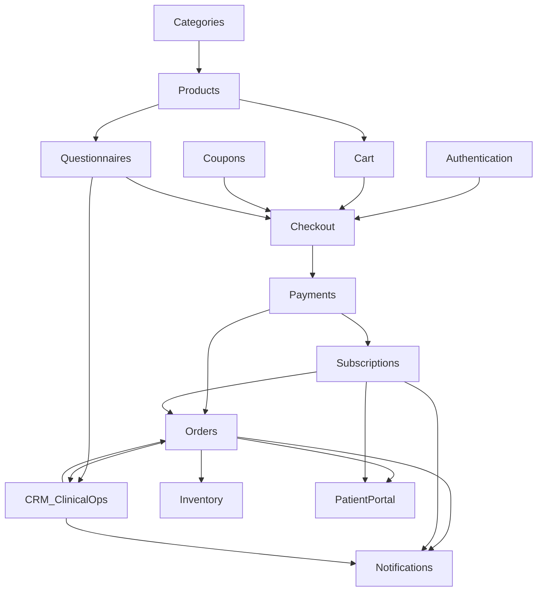

### 5.3 Critical path example — Rx purchase to fulfill

Checkout depends on Authentication, Cart, Product (Rx flag), Questionnaires, Payments, Coupons (optional), Inventory policy. After pay, Orders enter clinical review. CRM doctor approval creates prescription; pharmacist review; Inventory + Ops fulfill; Notifications and Portal reflect status.

---

## 6. State Diagrams

### 6.1 Order Lifecycle

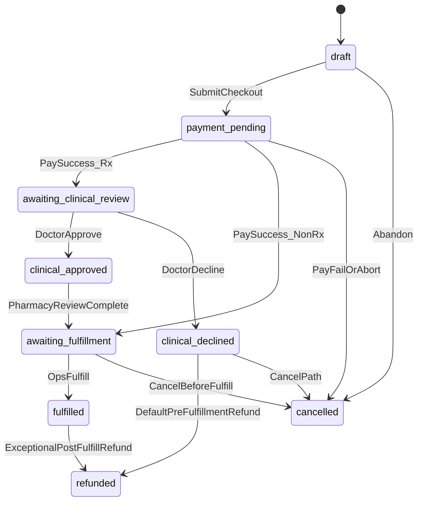

### 6.2 Subscription Lifecycle

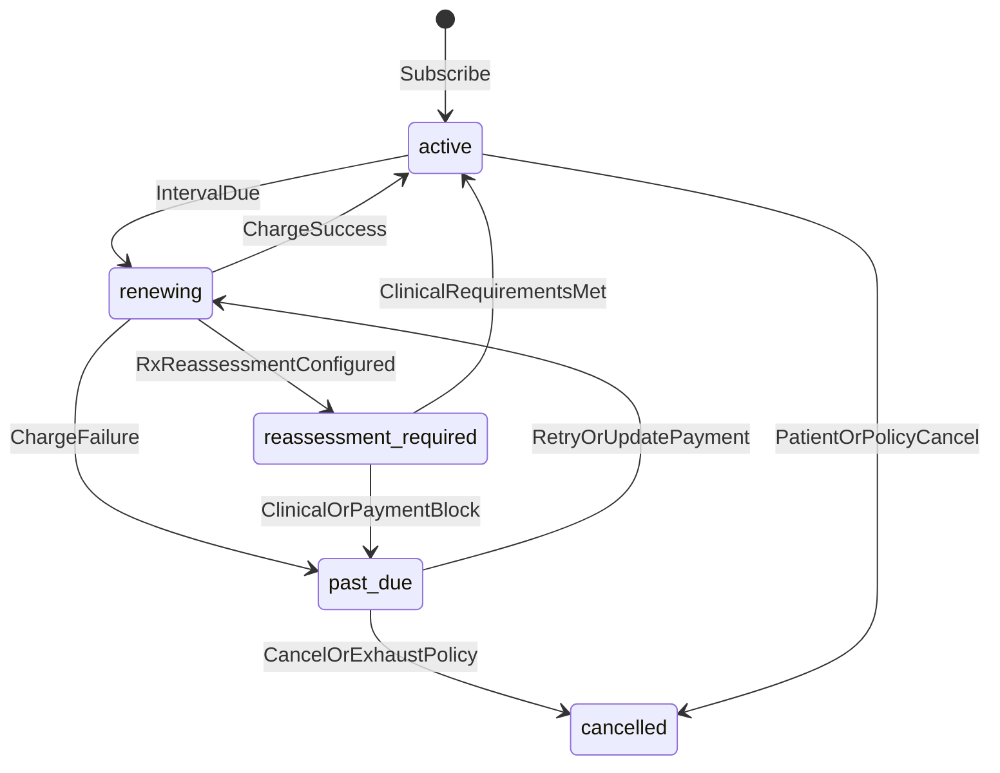

### 6.3 Appointment Lifecycle

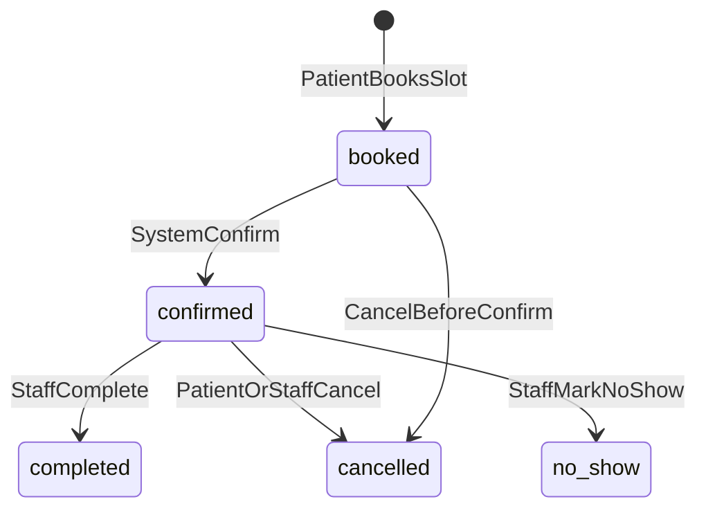

Note: V1 appointments are scheduling artifacts only—no video session states.

### 6.4 Questionnaire Flow

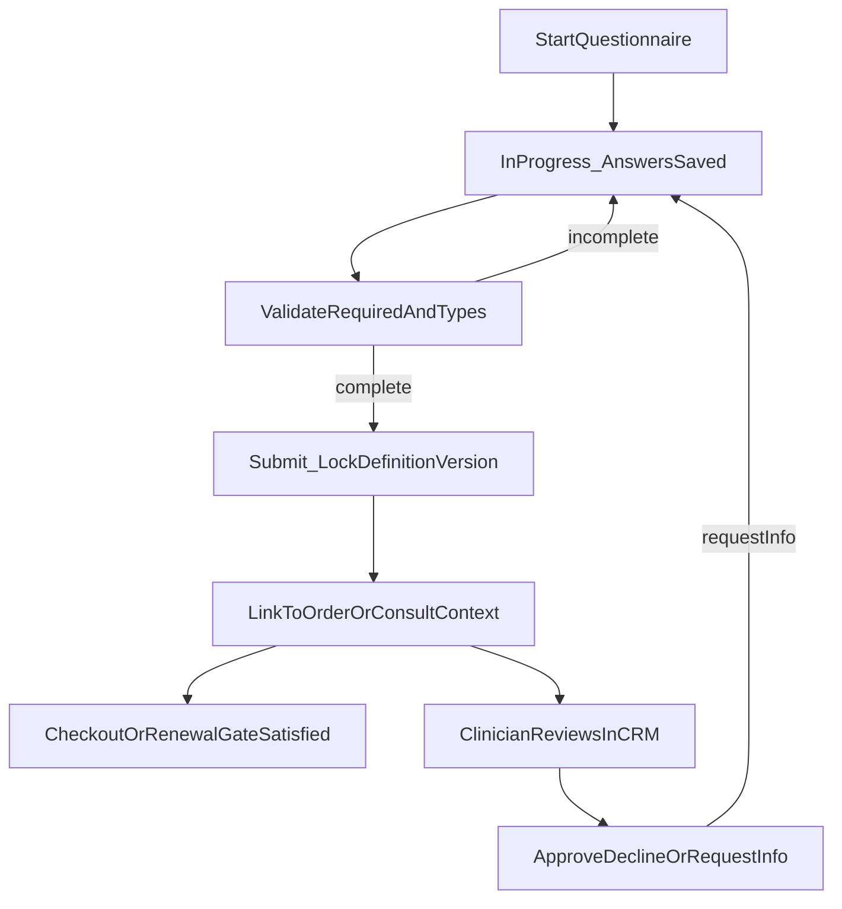

---

## 7. Error Handling

| Scenario | Trigger | System behavior | User-visible outcome | Related FRs |
| --- | --- | --- | --- | --- |
| Validation failures | Missing/invalid fields, incomplete questionnaire, invalid coupon | Reject request; no partial illegal state commit | Clear field/gate errors; checkout blocked | FR-CHK-*, FR-QST-*, FR-CPN-*, FR-AUTH-* |
| Payment failures | PSP decline, timeout, fraud reject | Fail safe; no paid fulfillment/clinical order | Payment failed message; cart may persist | FR-PAY-001/002, FR-CHK-004 |
| Expired sessions | Token/session expired mid-flow | Deny authorized actions; require re-auth | Sign-in prompt; preserve safe cart where possible | FR-AUTH-002, FR-CART-004, FR-CHK-001 |
| Inventory unavailable | Reserve/fulfill at zero under prevent-oversell | Block fulfillment / checkout per policy timing | Out-of-stock or cannot fulfill message | FR-INV-003, FR-ORD-*, FR-SET-001 |
| Doctor rejection | Clinical decline pre-fulfillment | Order `clinical_declined`; default refund eligible captured amount; notify | Decline + refund messaging in Portal/email | FR-CRM-002, FR-ORD-006, FR-PAY-003, FR-NTF-001 |
| Refunds | Support/ops or auto decline path | Policy tier checks; PSP refund; state `refunded`; restock if applicable | Refund confirmation | FR-PAY-003, FR-SUP-005, FR-INV-005 |
| Subscription failures | Renewal charge fail | Enter grace/past-due; notify; surface CRM; do not bypass Rx gates | Failure email; Portal update payment CTA | FR-SUB-003/005, FR-PAY-004, FR-NTF-001 |
| Unauthorized access | Cross-patient or RBAC miss | Deny; audit sensitive attempts as designed | Generic forbidden; no PHI leak | FR-AUTH-004/005, FR-PRT-002, FR-CRM-006 |
| Duplicate webhooks | PSP retry | Idempotent apply | No duplicate orders/charges side effects | FR-PAY-002 |
| Email provider failure | Transient send error | Retry/backoff; do not corrupt order state | Eventual email; ops metrics | FR-NTF-003, AC-BR-14 |

---

## 8. Assumptions

Inherited from [PRD §16](00-product-requirements-document.md#16-assumptions) and [BRD §7.6](02-business-requirements.md#76-assumptions-that-bound-these-requirements); restated for functional design:

1. Primary market is United States; default locale en-US.
2. V1 is a portfolio/demonstration platform with HIPAA-aware patterns—not certified Covered Entity implementation.
3. Platform is catalog-agnostic; demo categories are seed data.
4. Ordinary catalog/questionnaire/plan/workflow expansion is CRM-configurable without code changes.
5. Patients pay via third-party PSP; insurance out of scope.
6. Email is the primary V1 notification channel.
7. Store, Portal, and CRM are web applications in V1; Mobile follows on the same API.
8. Single Backend API is the system of record interface for all clients.
9. Clinical decisions are made by human clinicians; system enforces gates and records decisions.
10. V1 deployments are single-region.
11. Reviews are moderated before public display by default.
12. Non-Rx products may skip doctor prescription workflow; optional questionnaires allowed if configured.
13. Refund and clinical decline financial behaviors follow OR-11 / PRD §13.7 unless PRD revised.
14. Document/media may use object storage separate from primary DB.

---

## 9. Constraints

Inherited from [PRD §17](00-product-requirements-document.md#17-constraints) and [BRD §7](02-business-requirements.md#7-business-constraints):

| Constraint | Functional implication |
| --- | --- |
| Shared Backend API owns business rules | Clients must not embed divergent clinical/payment logic |
| Server-side RBAC | Every PHI-adjacent and privileged CRM action authorized in API |
| Human clinician approval for Rx | No automated diagnosis/prescribing FRs in V1 |
| Catalog configurability mandatory | Demo categories must not be hard-coded into irreversible behavior |
| Patient-pay via PSP | No insurance eligibility/claims functions in V1 |
| Appointments scheduling-only | No video visit functions in V1 |
| HIPAA-aware not certification | Docs/demos must not claim HIPAA/HITRUST/SOC 2 certification as V1 delivery |
| Open-source / free-tier friendly preference | Graceful degradation when non-critical add-ons throttle |
| Planning repo documentation only | This FRS contains no implementation code |
| US English V1 | No i18n functional scope |

---

## 10. Traceability Matrix

Maps functional modules / key FR groups to business objectives, processes, operational rules, and business acceptance criteria from [02](02-business-requirements.md).

| Module / FR group | BO | BP | OR | AC-BR |
| --- | --- | --- | --- | --- |
| STO Store | BO-1 | BP-01, BP-11 | OR-13, OR-14 | AC-BR-01, AC-BR-06, AC-BR-12 |
| AUTH Authentication | Trust | BP-08 | OR-06, OR-07 | AC-BR-08, AC-BR-13 |
| PRD Products | BO-1, BO-5 | BP-10 | OR-01, OR-14 | AC-BR-05, AC-BR-06 |
| CAT Categories | BO-5 | BP-10 | OR-14 | AC-BR-05, AC-BR-06 |
| BLG Blogs | BO-1, BO-4 | BP-11 | OR-07 | — |
| CMS CMS | BO-1, BO-4 | BP-11 | OR-07 | — |
| SRCH Search | BO-1, BO-4 | — | OR-06 | AC-BR-08 |
| CART Cart | BO-1 | BP-01 | — | AC-BR-01 |
| CHK Checkout | BO-1 | BP-01, BP-02 | OR-01, OR-09 | AC-BR-01, AC-BR-07 |
| PAY Payments | BO-1, BO-3, BO-4 | BP-01, BP-06, BP-09 | OR-03, OR-10, OR-11 | AC-BR-09, AC-BR-10, AC-BR-11 |
| QST Questionnaires | BO-1, BO-2, BO-5 | BP-01, BP-02, BP-10 | OR-01, OR-02, OR-07 | AC-BR-01, AC-BR-13 |
| ORD Orders | BO-1, BO-2, BO-4 | BP-01, BP-03–05, BP-09 | OR-03–05, OR-08, OR-09, OR-11 | AC-BR-01–03, AC-BR-07, AC-BR-10 |
| SUB Subscriptions | BO-3 | BP-06 | OR-10 | AC-BR-09, AC-BR-11 |
| APT Appointments | BO-3, BO-4 | BP-07 | — | — |
| PRT Patient Portal | BO-3, BO-4 | BP-02 | OR-06 | AC-BR-04 |
| CRM CRM / Rx workflow | BO-2, BO-4, BO-5 | BP-03–05, BP-10 | OR-03–07, OR-14 | AC-BR-02, AC-BR-03, AC-BR-05, AC-BR-13 |
| NTF Notifications | BO-1, BO-3 | BP-01, BP-06–09 | OR-10, OR-11 | AC-BR-09, AC-BR-11 |
| DOC Documents | BO-3 | BP-04 | OR-06 | AC-BR-04 |
| INV Inventory | BO-4 | BP-05, BP-09 | OR-12 | AC-BR-03 |
| REV Reviews | BO-1 | — | OR-13 | AC-BR-12 |
| CPN Coupons | BO-1 | BP-01 | OR-11 | — |
| SUP Support | BO-4 | BP-09 | OR-06, OR-11 | AC-BR-04, AC-BR-09 |
| ANL Analytics | BO-2, BO-4 | — | OR-07 | AC-BR-13, AC-BR-14 |
| RPT Reports | BO-2, BO-4 | BP-05 | OR-06 | — |
| ADM Administration | BO-5 | BP-10 | OR-14 | AC-BR-05 |
| SET Settings | BO-4, BO-5 | — | OR-12, OR-13 | AC-BR-12 |

### 10.1 Business Requirement → Functional Requirement Mapping

This detailed matrix maps existing business IDs from [02 — Business requirements](02-business-requirements.md) to concrete `FR-*` IDs defined in §2. No new business IDs are invented.

#### Business objectives (`BO-*`)

| Business Requirement | Functional Requirements |
| --- | --- |
| BO-1 Convert discovery into care | FR-STO-001, FR-STO-002, FR-STO-004, FR-PRD-003, FR-PRD-004, FR-CAT-003, FR-SRCH-001, FR-CART-001, FR-CHK-001, FR-CHK-002, FR-CHK-004, FR-CHK-005, FR-QST-003, FR-ORD-001, FR-CPN-001, FR-CPN-002, FR-REV-001, FR-BLG-002, FR-CMS-002 |
| BO-2 Scale clinical throughput | FR-QST-004, FR-QST-005, FR-CRM-001, FR-CRM-002, FR-CRM-003, FR-CRM-004, FR-ORD-002, FR-ORD-003, FR-ANL-003, FR-RPT-001 |
| BO-3 Retain patients on therapy | FR-SUB-001, FR-SUB-002, FR-SUB-003, FR-SUB-004, FR-SUB-005, FR-PRT-001, FR-PRT-003, FR-PRT-004, FR-APT-001, FR-NTF-001, FR-DOC-002, FR-PAY-004 |
| BO-4 Operate the business | FR-CRM-005, FR-INV-001, FR-INV-002, FR-INV-003, FR-INV-004, FR-SUP-001, FR-SUP-002, FR-SUP-005, FR-PAY-003, FR-RPT-001, FR-RPT-003, FR-ANL-001, FR-CMS-001, FR-BLG-001, FR-SET-001 |
| BO-5 Remain reusable | FR-PRD-002, FR-CAT-002, FR-CAT-004, FR-QST-001, FR-QST-002, FR-CRM-007, FR-ADM-002, FR-ADM-003, FR-SUB-001 |

#### Business processes (`BP-*`)

| Business Requirement | Functional Requirements |
| --- | --- |
| BP-01 Guest / Rx purchase | FR-STO-004, FR-AUTH-001, FR-CART-001, FR-CHK-001, FR-CHK-002, FR-CHK-004, FR-CHK-005, FR-QST-003, FR-PAY-001, FR-ORD-001, FR-NTF-001 |
| BP-02 Returning patient reorder / manage | FR-PRT-001, FR-PRT-004, FR-SUB-004, FR-QST-003, FR-CHK-002, FR-ORD-005 |
| BP-03 Doctor review | FR-CRM-002, FR-QST-005, FR-ORD-002, FR-ORD-003, FR-NTF-001 |
| BP-04 Prescription + pharmacy readiness | FR-CRM-003, FR-CRM-004, FR-ORD-003, FR-DOC-001, FR-DOC-003 |
| BP-05 Order fulfillment | FR-CRM-005, FR-ORD-002, FR-INV-002, FR-INV-003, FR-NTF-001 |
| BP-06 Subscription renewal | FR-SUB-002, FR-SUB-003, FR-SUB-005, FR-PAY-002, FR-PAY-004, FR-ORD-001, FR-NTF-001 |
| BP-07 Appointment booking | FR-APT-001, FR-APT-002, FR-APT-003, FR-APT-004, FR-NTF-001 |
| BP-08 Password reset | FR-AUTH-003, FR-AUTH-006, FR-NTF-001 |
| BP-09 Refund | FR-PAY-003, FR-ORD-006, FR-SUP-005, FR-INV-005, FR-NTF-001 |
| BP-10 Catalog configuration | FR-PRD-002, FR-CAT-002, FR-QST-001, FR-ADM-002, FR-ADM-003, FR-CRM-007 |
| BP-11 Content publish | FR-BLG-001, FR-BLG-002, FR-CMS-001, FR-CMS-002, FR-CMS-003 |

#### Operational rules (`OR-*`)

| Business Requirement | Functional Requirements |
| --- | --- |
| OR-01 Rx questionnaire required before finalize | FR-QST-003, FR-CHK-002, FR-PRD-004 |
| OR-02 Questionnaire versioning | FR-QST-001, FR-QST-004 |
| OR-03 Payment is not dispensing authority | FR-STO-006, FR-ORD-003, FR-CRM-003, FR-PAY-002 |
| OR-04 Doctor approval required for prescriptions | FR-CRM-002, FR-CRM-003, FR-ORD-003 |
| OR-05 Pharmacist review before Rx fulfillment | FR-CRM-004, FR-ORD-003 |
| OR-06 Patient isolation and attributable staff access | FR-AUTH-004, FR-AUTH-005, FR-PRT-002, FR-SRCH-003, FR-DOC-001, FR-SUP-001 |
| OR-07 Marketing/Content PHI boundary | FR-CRM-006, FR-ANL-002, FR-BLG-004, FR-AUTH-004 |
| OR-08 Order lifecycle semantics | FR-ORD-002, FR-ORD-005, FR-PRT-003 |
| OR-09 Non-Rx clinical-state skip | FR-ORD-004, FR-CHK-005 |
| OR-10 Subscription charge, grace, cancel, reassessment | FR-SUB-002, FR-SUB-003, FR-SUB-004, FR-SUB-005, FR-PAY-004 |
| OR-11 Refund tiers | FR-PAY-003, FR-ORD-006, FR-SUP-005, FR-INV-005 |
| OR-12 Inventory reserve/decrement and oversell | FR-INV-001, FR-INV-002, FR-INV-003, FR-INV-004, FR-SET-001 |
| OR-13 Review moderation before publish | FR-REV-002, FR-REV-003, FR-STO-005, FR-SET-004 |
| OR-14 Configuration publish safety | FR-ADM-003, FR-ADM-004, FR-PRD-002, FR-CAT-002, FR-QST-001 |

#### Business acceptance criteria (`AC-BR-*`)

| Business Requirement | Functional Requirements |
| --- | --- |
| AC-BR-01 End-to-end Rx purchase | FR-AUTH-001, FR-QST-003, FR-CHK-002, FR-CHK-004, FR-ORD-001, FR-ORD-005, FR-PRT-003, FR-NTF-001 |
| AC-BR-02 Clinical gate non-bypass | FR-CRM-002, FR-CRM-003, FR-ORD-003, FR-STO-006 |
| AC-BR-03 Pharmacy + fulfillment | FR-CRM-004, FR-ORD-002, FR-INV-002, FR-CRM-005 |
| AC-BR-04 Portal self-service | FR-PRT-001, FR-PRT-002, FR-PRT-005, FR-DOC-002, FR-SUP-001 |
| AC-BR-05 Configuration without deploy | FR-ADM-002, FR-PRD-002, FR-CAT-002, FR-QST-001, FR-CRM-007 |
| AC-BR-06 Demo catalog present | FR-PRD-005, FR-CAT-004, FR-STO-001 |
| AC-BR-07 Non-Rx path | FR-ORD-004, FR-CHK-005 |
| AC-BR-08 Auth and isolation | FR-AUTH-003, FR-AUTH-004, FR-AUTH-005, FR-PRT-002 |
| AC-BR-09 Payments and refunds (sandbox) | FR-PAY-001, FR-PAY-002, FR-PAY-003, FR-SUB-003, FR-NTF-001 |
| AC-BR-10 Clinical decline refund path | FR-CRM-002, FR-PAY-003, FR-ORD-006 |
| AC-BR-11 Subscription grace path | FR-SUB-003, FR-SUB-005, FR-NTF-001, FR-PAY-004 |
| AC-BR-12 Review moderation | FR-REV-002, FR-REV-003, FR-SET-004 |
| AC-BR-13 Marketing PHI boundary | FR-CRM-006, FR-ANL-002, FR-QST-005 |
| AC-BR-14 Observability baseline | FR-NTF-003, FR-PAY-002, FR-ANL-001 |
| AC-BR-15 Documentation alignment | (process control — no additional FR; governed by Document control) |

---

## 11. CRUD Responsibility Matrix

Role abbreviations: **Pat** = Patient, **Doc** = Doctor, **Pharm** = Pharmacist, **Sup** = Support, **Ops** = Operations, **Mkt** = Marketing, **Cnt** = Content, **Adm** = Administrator, **Sys** = System/API, **Gst** = Guest.

> **Legend:** Role listed owns the operation under RBAC. `—` = not applicable / not permitted in V1. Soft-delete or archive may substitute hard delete where audit retention requires it.

| Entity | Create | Read | Update | Delete |
| --- | --- | --- | --- | --- |
| Users (staff accounts) | Adm | Adm | Adm | Adm (deactivate preferred) |
| Patients (accounts/profiles) | Gst/Pat (register); Sys | Pat (self); Doc/Pharm/Sup/Ops (RBAC); Adm | Pat (self profile); Sup (limited assist); Adm | Adm (deactivate preferred); Sys |
| Products | Adm | Gst/Pat (published); staff per RBAC | Adm | Adm (unpublish/archive preferred) |
| Categories | Adm | Gst/Pat (published); staff per RBAC | Adm | Adm (unpublish/archive preferred) |
| Orders | Sys (from checkout/renewal) | Pat (own); Doc/Pharm/Sup/Ops (RBAC) | Doc/Pharm/Ops/Sys (state transitions); Sup (policy-limited) | — (cancel/refund states; no hard delete of paid clinical orders) |
| Subscriptions | Sys (from paid plan purchase) | Pat (own); Sup/Ops (RBAC) | Pat (manage/cancel); Sys (renew/grace); Sup (assist) | — (cancel stops renewals; retain history) |
| Appointments | Pat; staff (CRM assist) | Pat (own); staff (RBAC) | Pat (cancel/reschedule per rules); staff | Soft-cancel; Adm/Sys retention policy |
| Questionnaires (definitions) | Adm | Doc (active defs); Adm; Pat (assigned form only) | Adm (new version) | Adm (archive versions; retain answered refs) |
| Questionnaire responses | Pat; Sys | Pat (own status); Doc (consult context); Pharm (limited as permitted) | Pat (in-progress only); Sys (lock on submit) | — (immutable after submit; version retained) |
| Prescriptions | Sys (on Doc approve via CRM) | Pat (status-appropriate); Doc; Pharm; Ops (fulfillment context) | Doc (clinical update path); Pharm (review status); Sys | — (no patient delete; clinical retention) |
| Documents | Sys; Doc/Ops/Sup (upload where permitted) | Pat (own); authorized staff | Metadata by authorized staff; Sys | Adm/Sys per retention; audit retained |
| Blogs | Cnt; Adm | Gst/Pat (published); Cnt/Adm | Cnt; Adm | Cnt/Adm (unpublish/archive preferred) |
| Coupons | Mkt; Adm | Mkt/Adm; Sys (validate); Pat (apply code only) | Mkt; Adm | Mkt/Adm (deactivate preferred) |
| Support Tickets | Pat | Pat (own); Sup; Ops (consulted) | Sup (triage/resolve); Pat (comment per rules) | — (close/resolve; retain history) |
| Roles | Adm | Adm; Sys (authZ) | Adm | Adm (with safeguards) |
| Permissions | Adm (via role config) | Adm; Sys | Adm | Adm (with audit) |

Cross-reference: duty separation OR-06/OR-07; Support never approves prescriptions (FR-SUP-004); Marketing/Content no default clinical chart access (FR-CRM-006).

---

## 12. Domain Events

Domain events are emitted by the Backend API when meaningful business state changes occur. They drive notifications, analytics, order/subscription transitions, and CRM queue updates. Event names below are logical; physical payload schemas belong in later API design.

| Event | Purpose | Producer | Consumers | Business impact |
| --- | --- | --- | --- | --- |
| User Registered | Record new patient (or provisioned staff) identity | Authentication | Notifications, Analytics, CRM (staff provision) | Enables authenticated purchase and Portal access (BP-01, FR-AUTH-001) |
| Email Verified | Confirm mailbox ownership when verification is part of the identity flow | Authentication | AuthZ session upgrade, Notifications | Reduces account-takeover risk on registration path |
| Password Reset Requested | Start time-limited reset | Authentication | Notifications (email token) | Account recovery without Support (BP-08, FR-AUTH-003) |
| Password Changed | Complete credential rotation | Authentication | Session invalidation, Notifications, Audit | Forces re-auth; protects account (FR-AUTH-003) |
| Product Published | Make catalog SKU Store-visible | Administration / Products | Store, Search index, Analytics | Configuration velocity without deploy (BP-10, FR-PRD-002) |
| Product Updated | Apply price/media/Rx-flag/SEO changes | Administration / Products | Store, Checkout revalidation, Search | Keeps commerce truth current (FR-PRD-001) |
| Category Published | Expose category landing/nav | Administration / Categories | Store, Search, SEO | New program navigation without code (FR-CAT-002) |
| Cart Created | Establish guest/patient cart | Cart | Analytics (funnel) | Starts conversion funnel (FR-CART-001) |
| Checkout Started | Enter checkout from cart | Checkout | Analytics, Questionnaires gate | Marks intent to pay (FR-CHK-001) |
| Checkout Completed | Checkout submit accepted into payment path | Checkout | Payments, Orders | Transitions toward paid order (FR-CHK-004) |
| Payment Authorized | PSP authorization/capture success | Payments | Orders, Subscriptions, Notifications, Inventory policy | Creates/advances paid order; does **not** clear Rx fulfillment (OR-03) |
| Payment Failed | PSP decline/timeout/fail-safe abort | Payments | Checkout, Notifications, Analytics | No inconsistent unpaid fulfillment order (FR-CHK-004) |
| Payment Refunded | Refund captured amount (auto or staff) | Payments | Orders, Inventory (restock), Notifications, Reports | Completes OR-11 refund tiers (BP-09) |
| Order Created | Persist order after payment success rules | Orders | Portal, CRM queue, Notifications, Analytics | Patient sees clinical pending or awaiting fulfillment (FR-ORD-001) |
| Order Cancelled | Cancel before fulfillment | Orders / Support / Sys | Inventory restock, Notifications, Reports | Stops shipment; may trigger refund path (FR-ORD-006) |
| Order Fulfilled | Ship/dispense complete | Operations / Orders | Inventory finalize, Notifications, Portal, Reviews eligibility | Completes care-commerce loop (BP-05) |
| Questionnaire Submitted | Lock versioned intake responses | Questionnaires | Checkout gate, CRM consult queue, Analytics | Satisfies OR-01/OR-02; enables doctor review (FR-QST-003/004) |
| Doctor Approved Consultation | Clinical approve decision audited | CRM | Prescriptions, Orders, Notifications, Portal | Unlocks Rx path; never skipped by payment (AC-BR-02) |
| Doctor Declined Consultation | Clinical decline decision audited | CRM | Orders, Payments (default refund), Notifications | Stops dispensing; refunds eligible captured amount (AC-BR-10) |
| Prescription Created | Create Rx after doctor approval | CRM / Orders | Pharmacist review, Documents, Portal status, Notifications | Prescription cannot precede approval (FR-CRM-003) |
| Prescription Updated | Amend Rx or pharmacy-review status | CRM (Doctor/Pharmacist) | Orders fulfillment gate, Documents, Portal | Pharmacy readiness before fulfill (FR-CRM-004) |
| Subscription Created | Activate plan after purchase | Subscriptions | Payments (saved method), Portal, Notifications | Starts retention loop (BO-3, FR-SUB-001) |
| Subscription Renewed | Successful renewal charge + renewal order | Subscriptions / Payments | Orders, Questionnaires (reassessment), Notifications | Continues therapy billing (FR-SUB-002) |
| Subscription Cancelled | Stop future renewals | Patient Portal / Subscriptions | Payments scheduler, Notifications, CRM | Patient control; existing orders follow order rules (FR-SUB-004) |
| Appointment Booked | Confirm scheduling artifact | Appointments | Notifications, CRM staff views | Scheduling-only continuity (BP-07, FR-APT-001) |
| Appointment Cancelled | Free/cancel slot | Appointments | Notifications, CRM | Operational schedule accuracy (FR-APT-002) |
| Document Uploaded | Attach/generate patient document | Documents / CRM / Sys | Portal, Audit, Notifications (optional) | Self-service artifacts + staff context (FR-DOC-001/003) |
| Support Ticket Created | Open patient support case | Support / Portal | CRM Support queue, Notifications | Support deflection and resolution (FR-SUP-001) |
| Notification Sent | Email dispatch attempt result recorded | Notifications | Analytics/ops metrics, Audit (non-PHI) | Closes communication loop for core journeys (FR-NTF-001/002) |

---

## 13. Sequence Diagrams

### 13.1 Patient Purchase Flow (Rx-eligible)

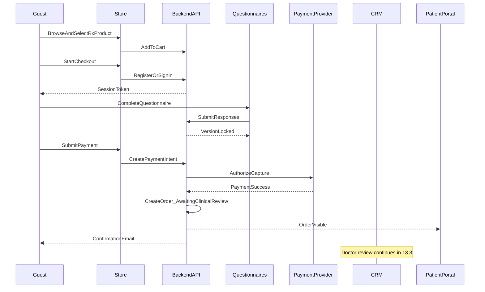

### 13.2 Checkout Flow

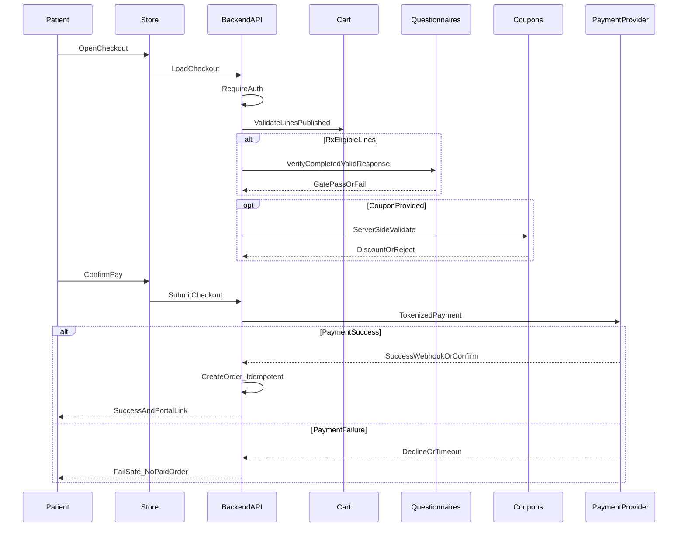

### 13.3 Doctor Review Flow

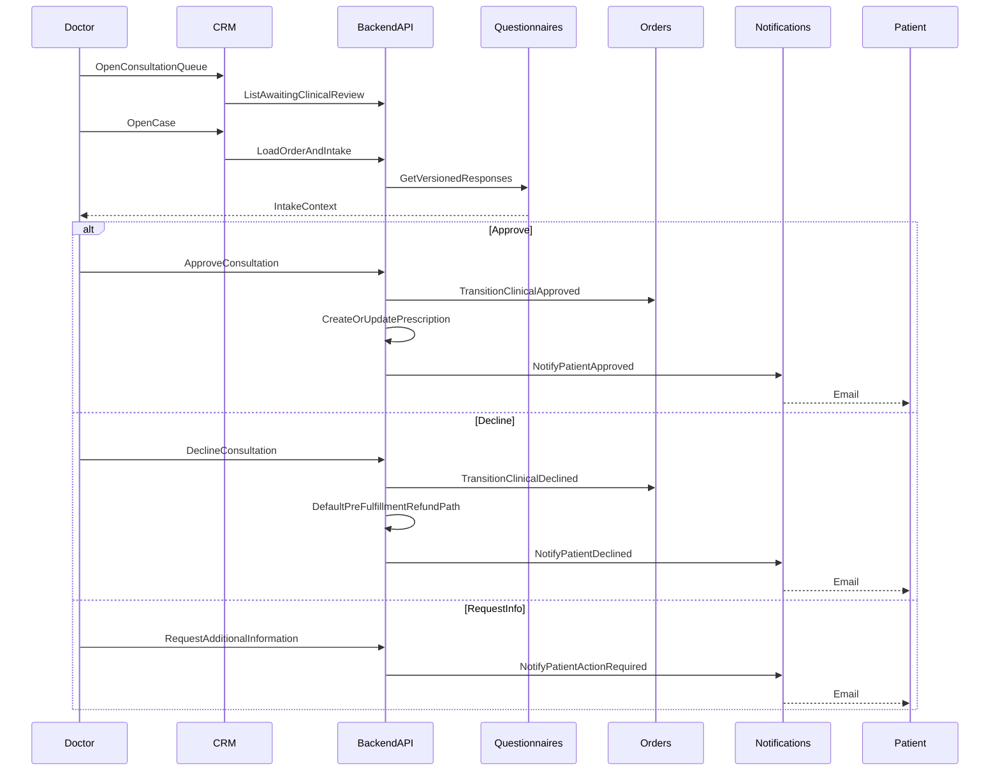

### 13.4 Prescription Flow

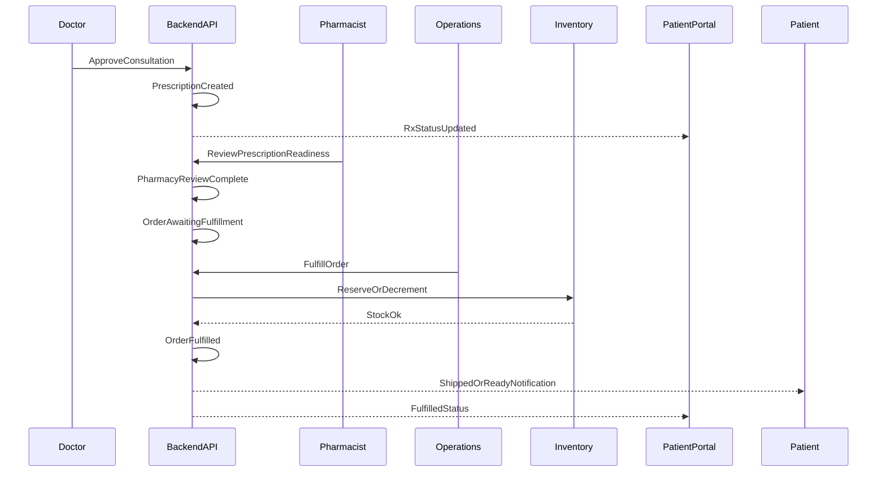

### 13.5 Subscription Renewal Flow

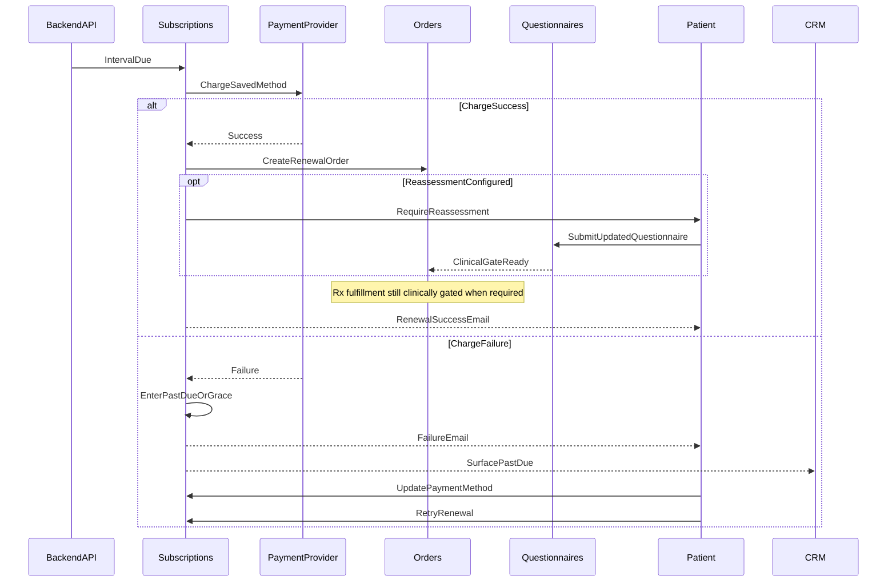

### 13.6 Appointment Booking Flow

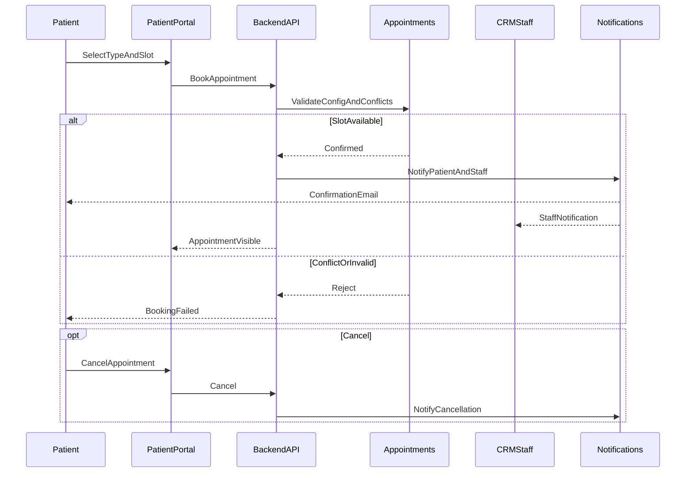

---

## 14. State Machine Summary

Canonical diagrams remain in [§6 State Diagrams](#6-state-diagrams). This table summarizes machines for implementation and QA.

| Entity | Possible States | Initial State | Terminal States | Notes |
| --- | --- | --- | --- | --- |
| Orders | `draft`, `payment_pending`, `awaiting_clinical_review`, `clinical_approved`, `clinical_declined`, `awaiting_fulfillment`, `fulfilled`, `cancelled`, `refunded` | `draft` | `fulfilled`, `cancelled`, `refunded` | Rx enters clinical states; non-Rx skips to `awaiting_fulfillment` after pay (OR-08/OR-09). See §6.1. |
| Subscriptions | `active`, `renewing`, `past_due` (grace), `reassessment_required`, `cancelled` | `active` (on create) | `cancelled` | Failed renewal → past-due/grace with notification; Rx reassessment may gate fulfillment (OR-10). See §6.2. |
| Appointments | `booked`, `confirmed`, `completed`, `cancelled`, `no_show` | `booked` | `completed`, `cancelled`, `no_show` | Scheduling-only in V1; no video session states (FR-APT-004). See §6.3. |
| Questionnaires (response) | `in_progress`, `submitted`, `needs_info` (after clinician request) | `in_progress` | `submitted` (locked version); may re-enter `in_progress` on request-info | Definition versions are immutable; responses reference version answered (OR-02). See §6.4. |
| Payments | `pending`, `authorized_or_captured`, `failed`, `refunded` (full/partial recorded) | `pending` | `authorized_or_captured`, `failed`, `refunded` | Webhooks idempotent; payment success ≠ Rx dispensing authority (OR-03). Physical PSP statuses map into these semantics. |
| Support Tickets | `open`, `in_progress`, `waiting_on_patient`, `resolved`, `closed` | `open` | `resolved`, `closed` | Patient creates; Support triages; Support cannot approve prescriptions (FR-SUP-004). |

---

## 15. Glossary

| Term | Definition in Clinexa context |
| --- | --- |
| Backend API | Shared system of record interface; owns business rules, RBAC, integrations, and audits for all clients |
| Care-commerce | End-to-end loop from discovery and intake through payment, clinical review, fulfillment, and portal self-service |
| Catalog-agnostic | Products, categories, questionnaires, plans, and workflows are configuration—not hard-coded clinical verticals |
| Clinical gate | Server-enforced prerequisite (questionnaire and/or doctor approval) before Rx fulfillment |
| Clinical review | Doctor evaluation of intake/order context resulting in approve, decline, or request-information |
| Consultation | CRM clinical case/work item linking patient, questionnaire, and order for doctor decision |
| CRM | Customer/clinical relationship management staff application—the clinical and operations control plane |
| Fulfillment | Operations/pharmacy process of preparing, shipping, or dispensing a cleared order |
| Guest | Unauthenticated Store visitor who may browse and begin purchase before register/sign-in |
| HIPAA | U.S. Health Insurance Portability and Accountability Act; Clinexa V1 is **HIPAA-aware** in design, not certified |
| HIPAA-aware | Architectural patterns for PHI minimization, access control, auditability, and encryption—without claiming certification |
| Patient Portal | Authenticated patient self-service application for orders, subscriptions, Rx status, documents, appointments, and tickets |
| Payment / PSP | Third-party payment service provider; tokenizes cards; platform never stores raw PAN |
| PHI | Protected Health Information; patient health/account artifacts requiring isolation and least-privilege access |
| Prescription (Rx) | Clinician-authorized treatment record created only after doctor approval; pharmacist review required before V1 Rx fulfillment completion |
| Questionnaire | Configurable, versioned medical intake form bound to products/plans/workflows; required for Rx-eligible checkout finalize |
| RBAC | Role-Based Access Control enforced server-side on privileged and PHI-adjacent operations |
| Store | Public web application for discovery, content, and commerce entry |
| Subscription | Recurring treatment plan with scheduled renewals, grace/past-due handling, and optional clinical reassessment |
| Treatment plan | Configurable therapy offering (products/intervals/pricing) associated with subscriptions and clinical workflows |
| Rx-eligible product | Catalog product flagged to require questionnaire and prescription clinical workflow |

Extended module-level definitions also appear in [§1.4 Definitions](#14-definitions).

---

## Related reading

| Topic | Document |
| --- | --- |
| Requirements contract | [00 — Product Requirements Document](00-product-requirements-document.md) |
| Orientation | [01 — Project overview](01-project-overview.md) |
| Business requirements | [02 — Business requirements](02-business-requirements.md) |
| Non-functional requirements | [04 — Non-functional requirements](04-non-functional-requirements.md) |
| Personas / journeys / roles | [06](06-user-personas.md), [07](07-user-journeys.md), [08](08-role-permissions.md) |
| API / DB / Auth / Security | [10](10-database-design.md), [11](11-api-design.md), [12](12-authentication-flow.md), [13](13-security.md) |
| Testing | [22 — Testing strategy](22-testing-strategy.md) |

---

## Document control

| Item | Value |
| --- | --- |
| Owner | Product + Architecture (Clinexa planning) |
| Change rule | Material functional scope changes must align with the PRD first; update BRD process/AC IDs when business evidence changes |
| Implementation rule | APIs, schemas, UI screens, user stories in delivery repos, and test cases should trace to `FR-*` / `US-*` / `AC-*` IDs herein |

---

## Revision History

| Version | Date | Author | Changes |
| --- | --- | --- | --- |
| 1.0 | 2026-07-23 | Abhishek Singh Sengar | Initial functional requirements specification |
| 1.1 | 2026-07-23 | Abhishek Singh Sengar | Added business→FR traceability detail, CRUD matrix, domain events, sequence diagrams, state machine summary, and glossary |

---

*End of Functional Requirements Specification.*
