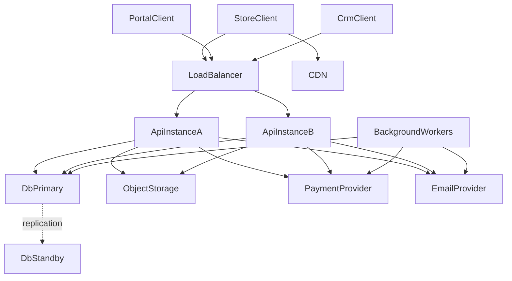
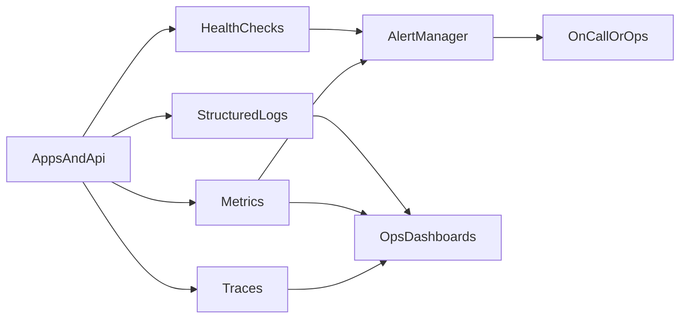
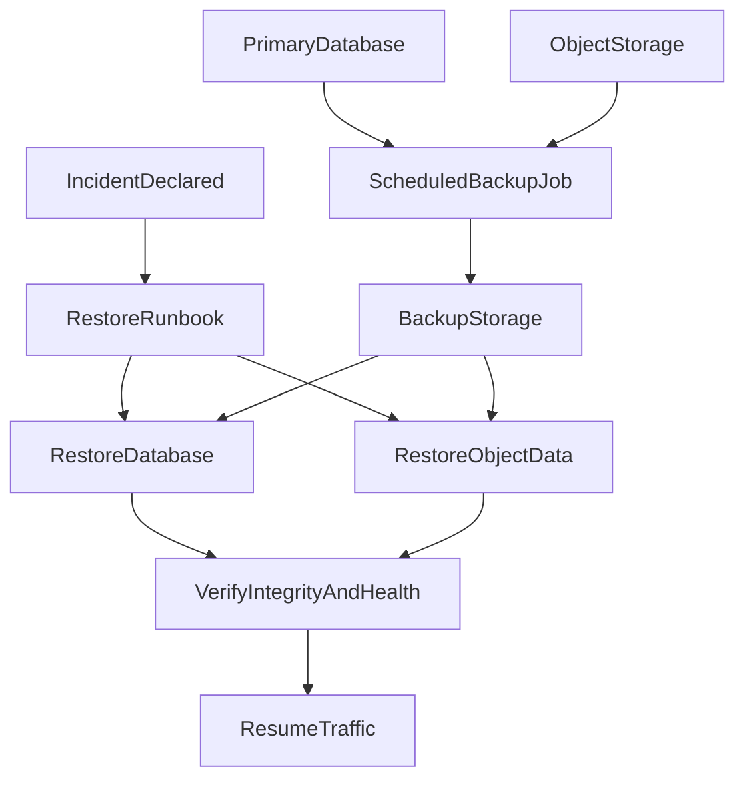

# 04 — Non-Functional Requirements

| Field | Value |
| --- | --- |
| Document | Non-Functional Requirements (NFR) |
| Product | Clinexa |
| Version | 1.0 |
| Status | Draft for review |
| Primary market | United States |
| Audience | Architecture, Engineering, DevOps, Security, QA, Operations |
| Source of truth | [00 — Product Requirements Document](00-product-requirements-document.md) |
| Related docs | [01 — Project overview](01-project-overview.md), [02 — Business requirements](02-business-requirements.md), [03 — Functional requirements](03-functional-requirements.md), [05 — System architecture](05-system-architecture.md), [11 — API design](11-api-design.md), [13 — Security](13-security.md), [21 — Development guidelines](21-development-guidelines.md), [22 — Testing strategy](22-testing-strategy.md), [23 — Deployment](23-deployment.md) |

This document is the **Non-Functional Requirements (NFR) charter** for Clinexa Version 1. It expands [PRD §12](00-product-requirements-document.md#12-non-functional-requirements) into measurable quality attributes for performance, reliability, security, privacy, operability, and related system qualities. It does **not** redefine product features, business processes, or user stories—those remain in the PRD, [02 — Business requirements](02-business-requirements.md), and [03 — Functional requirements](03-functional-requirements.md).

> **Demonstration vs enterprise:** Quantitative targets are **V1 engineering targets** for a production-like demonstration (PRD §12). They guide architecture and acceptance testing. Environment-specific production SLOs, on-call practice, and formal compliance programs may be refined later without rewriting core domain design.

---

## Table of contents

1. [Introduction](#1-introduction)
2. [Performance Requirements](#2-performance-requirements)
3. [Scalability](#3-scalability)
4. [Availability](#4-availability)
5. [Reliability](#5-reliability)
6. [Security](#6-security)
7. [Privacy & Compliance](#7-privacy--compliance)
8. [Maintainability](#8-maintainability)
9. [Observability](#9-observability)
10. [Backup & Disaster Recovery](#10-backup--disaster-recovery)
11. [Accessibility](#11-accessibility)
12. [Browser & Device Support](#12-browser--device-support)
13. [SEO Requirements](#13-seo-requirements)
14. [API Standards](#14-api-standards)
15. [Configuration Management](#15-configuration-management)
16. [Environment Strategy](#16-environment-strategy)
17. [Infrastructure Assumptions](#17-infrastructure-assumptions)
18. [Risk Assessment](#18-risk-assessment)
19. [NFR Traceability Matrix](#19-nfr-traceability-matrix)
20. [Revision History](#20-revision-history)

---

## 1. Introduction

### 1.1 Purpose

Define **how** the Clinexa platform must behave from a technical, operational, performance, reliability, and security perspective so that:

- Architects can constrain stack and topology choices in [05 — System architecture](05-system-architecture.md) and [23 — Deployment](23-deployment.md).
- Backend and frontend engineers can meet measurable latency, resilience, and security controls while implementing [03 — Functional requirements](03-functional-requirements.md).
- DevOps and operations can design environments, monitoring, backups, and promotion gates.
- Security and privacy stakeholders can verify HIPAA-aware patterns without overclaiming certification.
- QA can derive non-functional test cases (load, soak, a11y, security regression) with clear pass/fail criteria.

### 1.2 Scope

#### In scope (V1)

| Area | Coverage in this NFR |
| --- | --- |
| Surfaces | Store Web, Patient Portal, CRM, Backend API (client-agnostic quality attributes) |
| Qualities | Performance, scalability, availability, reliability, security, privacy, maintainability, observability, DR, accessibility, SEO, API standards, configuration, environments |
| Geography | Single-region deployment (PRD §11) |
| Compliance posture | HIPAA-aware architecture patterns—not regulatory certification |

#### Out of scope (V1)

Aligned with [PRD §11](00-product-requirements-document.md#11-out-of-scope): multi-region active-active, formal HIPAA/HITRUST/SOC 2 Type II as delivery gates, native mobile UX SLAs, live video telemedicine QoS, i18n beyond en-US, and stack-specific schemas/contracts (owned by docs 05, 10, 11, 13).

### 1.3 Audience

| Audience | How they use this NFR |
| --- | --- |
| Solution / cloud architects | Topology, HA, scale path, infrastructure assumptions |
| Backend engineers | API latency, idempotency, retries, security controls |
| Frontend engineers | Page budgets, a11y, SEO, browser matrix |
| DevOps / SRE | Environments, deployment gates, monitoring, backup/DR |
| Security architects | AuthN/Z, encryption, OWASP, secrets, audit |
| QA engineers | Measurable acceptance for load, resilience, a11y, security |
| Operations | Alerting, maintenance windows, recovery procedures |

### 1.4 References

| Doc | Role |
| --- | --- |
| [00 — PRD](00-product-requirements-document.md) | Requirements contract; §12 NFR baselines; §1.5 compliance; §17 tech constraints |
| [01 — Project overview](01-project-overview.md) | Architecture posture and design philosophy |
| [02 — Business requirements](02-business-requirements.md) | `BO-*`, `OR-*`, `AC-BR-*`, `KPI-*` (esp. KPI-09 availability, AC-BR-14 observability) |
| [03 — Functional requirements](03-functional-requirements.md) | `FR-*` implementation reference for quality-adjacent behavior |
| [05](05-system-architecture.md)–[23](23-deployment.md) | Downstream design that must satisfy these NFRs |

### 1.5 Definitions

| Term | Definition |
| --- | --- |
| SLI | Service Level Indicator—quantified measure of a quality (e.g., p95 API latency) |
| SLO | Service Level Objective—target value for an SLI over a window |
| SLA | Service Level Agreement—externally or demo-facing commitment derived from SLOs |
| Nominal load | V1 demonstration load profile defined in §2.1; all p95 targets assume this unless stated |
| Server processing time | Time from API receipt of a complete request to first byte of complete response, excluding client network and third-party PSP round-trips unless noted |
| PHI-adjacent | Data or actions involving patient health/account artifacts requiring isolation and audit (FRS §1.4) |
| HIPAA-aware | Design patterns for minimization, access control, audit, encryption—not certification |
| RPO | Recovery Point Objective—maximum acceptable data loss window |
| RTO | Recovery Time Objective—maximum acceptable time to restore service |
| Graceful degradation | Non-critical capability may fail while core journeys remain correct and fail-safe |
| Idempotency | Repeated identical requests produce the same durable side effect at most once from the system's perspective |
| Fail-safe (checkout) | Prefer failed payment/order creation over unpaid or inconsistent order state |

### 1.6 ID conventions

| Prefix | Meaning | Example |
| --- | --- | --- |
| `NFR-###` | Non-functional requirement (global sequence) | `NFR-042` |

Priorities use MoSCoW relative to V1 demonstration readiness: **Must** = acceptance gate; **Should** = strong expectation; **Could** = maturity stretch.

---

## 2. Performance Requirements

### 2.1 Nominal load definition (V1)

| Dimension | Nominal (V1 demo) |
| --- | --- |
| Concurrent Store/Portal users | ≤ 50 |
| Concurrent CRM staff | ≤ 10 |
| Catalog size | ≤ 5,000 published products; ≤ 500 categories |
| Consultation queue depth | ≤ 500 open cases |
| Sustained API read RPS (aggregate) | ≤ 100 |
| Background job backlog | ≤ 1,000 pending jobs |

Load tests that claim compliance with §2 targets must declare this profile (or a stricter one).

### 2.2 Performance requirements table

| ID | Statement | Metric / Target | Measurement | Priority |
| --- | --- | --- | --- |
| NFR-001 | Common Store browse/search read APIs meet PRD latency under nominal load | p95 server processing **&lt; 500 ms** | APM / load test on staging-like env | Must |
| NFR-002 | Portal authenticated reads (orders, subscriptions, profile summaries) meet PRD latency | p95 server processing **&lt; 700 ms** | APM / load test with authenticated sessions | Must |
| NFR-003 | CRM consultation queue list and case open meet PRD latency | p95 server processing **&lt; 1 s** under nominal staff concurrency | APM / CRM load scenario | Must |
| NFR-004 | Questionnaire save and submit meet PRD latency for typical payloads | p95 server processing **&lt; 1 s** | API timing on typical questionnaire size | Must |
| NFR-005 | Store browse pages feel responsive on broadband | p95 LCP **≤ 2.5 s**; TTFB aligned to NFR-001 | Lab or field RUM on broadband (≥25 Mbps down) | Must |
| NFR-006 | CRM default operational dashboards become interactive promptly | p95 time-to-interactive for default date range **≤ 3 s** | CRM perf harness / RUM | Should |
| NFR-007 | Store catalog/content search returns within Store API budget | p95 server processing **&lt; 500 ms** | Search load test | Must |
| NFR-008 | CRM search with RBAC filtering remains usable | p95 server processing **&lt; 1 s** | CRM search load test | Must |
| NFR-009 | Checkout finalize API (platform side) completes promptly excluding PSP | p95 server processing **&lt; 2 s** excluding PSP round-trip | Checkout load + timing breakdown | Must |
| NFR-010 | PSP timeouts fail safe without unpaid inconsistent orders | On PSP timeout/decline: no paid-state order without confirmed payment | Chaos / fault-injection tests | Must |
| NFR-011 | Synchronous report queries stay bounded | p95 **&lt; 5 s** for default scoped reports | Report API timing | Should |
| NFR-012 | Large report exports run off the request path | Export job accepted **&lt; 2 s**; generation async | Job instrumentation | Must |
| NFR-013 | Background renewals and notifications start promptly under nominal backlog | Job start **≤ 60 s** from eligible trigger | Queue lag metrics | Must |
| NFR-014 | Background jobs must not starve interactive API latency | Request-path p95 remains within NFR-001–004 while jobs run at nominal backlog | Combined load + job soak | Must |

---

## 3. Scalability

| ID | Statement | Metric / Target | Measurement | Priority |
| --- | --- | --- | --- |
| NFR-015 | API and web fronts support horizontal scale-out | ≥ 2 instances behind load balancer in staging-like topology; traffic sharable without sticky session dependence for API | Deploy topology review + smoke | Must |
| NFR-016 | API instances are effectively stateless for session/auth | Auth state validated via shared store/token; no in-memory-only session affinity required | Architecture review + failover test | Must |
| NFR-017 | Load balancing distributes healthy traffic | Unhealthy instance removed within **≤ 60 s** of failed health checks | LB health-check config + test | Must |
| NFR-018 | Vertical scale path exists for primary database | Documented CPU/memory/storage upgrade path without schema redesign for catalog growth | Runbook present | Must |
| NFR-019 | Catalog growth does not force core schema redesign | Categories/products/questionnaires scale via data/config (PRD §12.2) | Design review vs FRS catalog modules | Must |
| NFR-020 | Consultation queue supports pagination and filtering as volume grows | Default page size bounded; no unbounded full-table dump to CRM UI | API contract + QA | Must |
| NFR-021 | Queue processing scales independently of request path | Dedicated workers for renewals, notifications, reports | Topology + job metrics | Must |
| NFR-022 | Object storage holds documents/media separate from transactional DB | Docs/media not stored as DB BLOBs for primary path | Architecture assumption check | Must |
| NFR-023 | Public Store static assets use CDN (or equivalent edge cache) | Cacheable static assets served via CDN in staging-like/prod-like envs | Header / CDN config review | Should |
| NFR-024 | System remains single-region for V1 | No active-active multi-region requirement | Scope gate | Must |
| NFR-025 | Modular boundaries enable future microservice extraction | Clear domain modules in API; no forced microservice split in V1 | Architecture review | Should |

---

## 4. Availability

### 4.1 Availability targets

| ID | Statement | Metric / Target | Measurement | Priority |
| --- | --- | --- | --- |
| NFR-026 | Staging-like / demonstration production meets V1 uptime intent | **99.5%** monthly availability excluding planned maintenance (PRD §12.3 / KPI-09) | Uptime synthetic + incident log | Must |
| NFR-027 | Planned maintenance is scheduled and excluded from uptime calc | Maintenance window documented; advance notice **≥ 24 h** for staging-like demos when practical | Change calendar | Must |
| NFR-028 | Critical payment/webhook processing uses at-least-once delivery with idempotency | Duplicate webhooks do not double-charge or corrupt state (`FR-PAY-002`) | Webhook replay tests | Must |
| NFR-029 | Multi-AZ within single region for HA of API and primary data services where provider supports | Topology spans ≥ 2 AZs for API (and DB HA capability) | Infra diagram vs deploy | Should |
| NFR-030 | Failover procedures are documented and executable | RTO-aligned failover steps in runbook (§10) | Tabletop / drill | Must |

### 4.2 High Availability Architecture

---

## 5. Reliability

| ID | Statement | Metric / Target | Measurement | Priority |
| --- | --- | --- | --- |
| NFR-031 | Transient email/PSP failures retry with exponential backoff and jitter | Max attempts configured; backoff increases; no infinite loops | Integration tests + metrics | Must |
| NFR-032 | Payment webhooks are idempotent | Same event ID processed once for durable side effects | Replay tests | Must |
| NFR-033 | Critical mutating payment operations accept client/provider idempotency keys | Duplicate submit within retention window yields same outcome | API contract tests | Must |
| NFR-034 | External dependency calls use timeouts | Default outbound timeout **≤ 10 s** unless justified; checkout fails safe | Config + fault tests | Must |
| NFR-035 | Circuit breakers or equivalent protect against cascading outages | After sustained failure threshold, short-circuit until half-open probe | Resilience tests | Should |
| NFR-036 | Store browse degrades gracefully if non-critical services fail | Reviews/ratings outage does not block catalog browse | Fault injection | Must |
| NFR-037 | Checkout fails safe rather than creating unpaid inconsistent orders | Zero unpaid “completed” orders in fault scenarios | Chaos + payment tests | Must |
| NFR-038 | Queues provide at-least-once processing with visibility timeout | Failed jobs reappear; poison messages land in DLQ after max attempts | Queue metrics + DLQ inspection | Must |
| NFR-039 | Notification send is deduplicated for the same domain event within a window | No duplicate patient emails for identical event key under replay | NTF integration tests | Must |

---

## 6. Security

### 6.1 Authentication, authorization, and sessions

| ID | Statement | Metric / Target | Measurement | Priority |
| --- | --- | --- | --- |
| NFR-040 | All client–API traffic uses TLS | TLS **1.2+**; HTTP redirects to HTTPS on public endpoints | SSL scan / config | Must |
| NFR-041 | Authentication uses sessions or tokens validated by the Backend API | Unauthenticated PHI-adjacent calls rejected **100%** | Security tests | Must |
| NFR-042 | Password policy meets minimum strength | Min length **≥ 12**; reject known breached passwords when check available; no mandatory composition theater | Auth unit/integration tests | Must |
| NFR-043 | Account lockout / abuse protection exists | Lock after **≥ 5** consecutive failed attempts within **15 min**; unlock via time or admin | Auth abuse tests (`FR-AUTH-006`) | Must |
| NFR-044 | Sessions expire and password reset invalidates active sessions | Idle timeout **≤ 30 min** (staff/PHI surfaces); absolute session lifetime **≤ 12 h**; reset clears sessions (`FR-AUTH-003`) | Session tests | Must |
| NFR-045 | Server-side RBAC on every PHI-adjacent and privileged operation | Zero client-trusted authorization for clinical/admin paths (`FR-AUTH-004`) | AuthZ matrix tests | Must |
| NFR-046 | Patient data isolation holds under normal authorization paths | Zero cross-patient read/write in automated isolation suite (`FR-AUTH-005`, KPI-08) | Isolation regression | Must |
| NFR-047 | Shared anonymous clinical staff accounts prohibited in production-like envs | Attributable actor identity required (OR-06) | Access audit | Must |

### 6.2 Encryption, secrets, payments

| ID | Statement | Metric / Target | Measurement | Priority |
| --- | --- | --- | --- |
| NFR-048 | Encryption at rest for databases and document storage in deployed envs that support it | Enabled on managed DB and object storage | Infra attestation | Must |
| NFR-049 | Secrets never stored in source control | Zero secrets in git history of app/planning repos; env/secret store only | Secret scanning CI | Must |
| NFR-050 | No raw PAN storage; PSP tokenization only | Card data never in DB/logs (`FR-PAY-001`) | Code + log review | Must |

### 6.3 API security, OWASP, rate limits, headers, uploads

| ID | Statement | Metric / Target | Measurement | Priority |
| --- | --- | --- | --- |
| NFR-051 | Input validation and output encoding defend OWASP Top 10 classes | Mapped controls for injection, broken authZ, XSS, SSRF, misconfig, etc. | Security checklist + tests | Must |
| NFR-052 | Rate limiting on auth, reviews, support, and public APIs | Auth: ≤ **10** login attempts / IP / 15 min (align lockout); public write endpoints bounded | Rate-limit tests | Must |
| NFR-053 | Security headers on web responses | HSTS, `X-Content-Type-Options: nosniff`, frame protections, CSP baseline for Store/Portal | Header scan | Must |
| NFR-054 | File uploads restricted by type and size | Allowlist MIME/extensions; max size per [DOC](03-functional-requirements.md) policy (default **≤ 10 MB** unless configured) | Upload negative tests | Must |
| NFR-055 | Malware scanning for uploads as security maturity item | Scan path defined; enable when tooling available | Security design track | Should |
| NFR-056 | Dependency vulnerability scanning in CI as delivery matures | Critical/High vulns gated per policy | CI pipeline | Should |
| NFR-057 | Audit clinical and admin-sensitive events | Record actor, action, timestamp, object identifiers | Audit query samples | Must |

### 6.4 OWASP Top 10 control map (summary)

| OWASP class | Primary NFR controls |
| --- | --- |
| Broken Access Control | NFR-045, NFR-046, NFR-057 |
| Cryptographic Failures | NFR-040, NFR-048, NFR-050 |
| Injection | NFR-051, NFR-054, API allowlists (§14) |
| Insecure Design | Fail-safe checkout NFR-037; clinical gates in FRS |
| Security Misconfiguration | NFR-053, NFR-049, env separation (§15–16) |
| Vulnerable Components | NFR-056 |
| Identification / Auth Failures | NFR-041–NFR-044, NFR-052 |
| Software / Data Integrity | NFR-032, NFR-033, config publish audit |
| Logging / Monitoring Failures | NFR-057, §9 |
| SSRF | NFR-051; no open URL fetch from user input |

---

## 7. Privacy & Compliance

> **Disclaimer:** Clinexa V1 applies **HIPAA-aware** architectural considerations. This repository and initial build are portfolio / demonstration artifacts and do **not** claim regulatory certification, Covered Entity status, or a production BAA program (PRD §1.5, BRD §7.2).

| ID | Statement | Metric / Target | Measurement | Priority |
| --- | --- | --- | --- |
| NFR-058 | Architecture follows HIPAA-aware patterns | Minimization, access control, auditability, encryption in transit/at rest | Design review checklist | Must |
| NFR-059 | PHI minimized in collection and display | Only journey-necessary fields; marketing analytics avoid clinical free text (`FR-ANL-002`, OR-07) | Data inventory + analytics review | Must |
| NFR-060 | Marketing/Content roles denied clinical notes and full questionnaire answers by default | Access tests pass (`FR-CRM-006`, AC-BR-13) | RBAC tests | Must |
| NFR-061 | Consent and notice captured where product flows require | Consent flags/timestamps stored when applicable | Journey QA | Should |
| NFR-062 | Audit trails retained for clinical/admin events | Retention **≥ 1 year** intent for audit events in staging-like/prod-like | Retention policy + sample | Must |
| NFR-063 | Data retention for operational logs is bounded | Application debug logs retention **≤ 90 days** unless longer justified; redaction applied | Log store policy | Should |
| NFR-064 | Secure deletion / de-identification path exists for eligible data | Soft-delete/archive for clinical entities per FRS; hard-delete/key disposal procedure documented | Runbook | Should |
| NFR-065 | Compliance boundary is explicit | Formal HIPAA/HITRUST/SOC 2 Type II are **post-MVP**; demos must not imply certification | Comms + scope gate | Must |

### 7.1 Compliance boundary

| Concern | V1 | Post-MVP |
| --- | --- | --- |
| HIPAA-aware design patterns | Required | Required |
| Covered Entity / BAA program | Out of scope | Enterprise track |
| SOC 2 / HITRUST | Out of scope as delivery gate | Enterprise track |
| Pen testing | Ad hoc as maturity allows | Scheduled |
| Multi-region residency | Single-region US | Future |

---

## 8. Maintainability

| ID | Statement | Metric / Target | Measurement | Priority |
| --- | --- | --- | --- |
| NFR-066 | Clear module boundaries among Store, Portal, CRM clients and Backend API | Clients do not embed divergent clinical/payment rules | Architecture review | Must |
| NFR-067 | Backend follows clean / layered architecture principles | Domain rules not buried in UI; testable services | Code structure review | Must |
| NFR-068 | Catalog and clinical definitions are configuration-driven | New category/product/questionnaire without app fork (KPI-07 / AC-BR-05) | Demo evidence | Must |
| NFR-069 | Coding standards documented and enforced | Guidelines in [21](21-development-guidelines.md); lint/format in CI when available | CI + review | Should |
| NFR-070 | Public APIs and significant modules are documented | OpenAPI or equivalent for Backend API; README per app | Doc check | Should |
| NFR-071 | Dependencies prefer actively maintained open-source libraries | No abandoned critical deps without justification | Dependency review | Should |
| NFR-072 | Code reviews required for merges to protected branches | ≥ 1 approving review | Branch protection | Must |
| NFR-073 | API versioning posture is explicit | Breaking changes via version bump (§14); semantic versioning for libraries | Release policy | Must |

---

## 9. Observability

| ID | Statement | Metric / Target | Measurement | Priority |
| --- | --- | --- | --- |
| NFR-074 | Structured application logs with correlation IDs | ≥ 95% of API requests carry correlation ID across handlers | Log sample | Must |
| NFR-075 | Logs redact secrets, full PAN, and unnecessary questionnaire answer bodies | Redaction patterns verified; no raw PHI dumps in debug logs | Log scan tests | Must |
| NFR-076 | Clinical audit events distinct from debug logs when feasible | Separate sink or event type for audits | Logging design | Should |
| NFR-077 | Health checks for API and critical dependencies | Liveness + readiness; dependency probes for DB (and queue when used) | Probe endpoints | Must |
| NFR-078 | Core metrics collected | Request latency, error rate, queue depth, payment failures, renewal failures | Metrics catalog | Must |
| NFR-079 | Distributed tracing across Backend API request path | Trace ID propagates; sample rate documented | Trace UI sample | Should |
| NFR-080 | Alerting for elevated 5xx and webhook processing failures | Alert when 5xx rate **&gt; 2%** over **5 min** or webhook failure spike | Alert rules | Must |
| NFR-081 | Operations dashboards exist for golden signals | Latency, traffic, errors, saturation (+ queue/payment) | Dashboard review | Should |
| NFR-082 | Observability baseline satisfies AC-BR-14 | Health checks, structured logs, core error metrics for payment/webhook/API failures | Acceptance evidence | Must |

### 9.1 Monitoring Flow

---

## 10. Backup & Disaster Recovery

| ID | Statement | Metric / Target | Measurement | Priority |
| --- | --- | --- | --- |
| NFR-083 | Database backups are automated | At least **daily** automated backup of primary DB | Backup job success metrics | Must |
| NFR-084 | Database backup retention is tiered | Retain **≥ 7 days** daily; longer retention **≥ 30 days** where storage allows | Retention policy | Must |
| NFR-085 | File/object storage for critical documents is durable | Versioning and/or replication enabled per provider capability | Storage config | Must |
| NFR-086 | Recovery Point Objective for staging-like production | **RPO ≤ 24 hours** | Backup frequency + restore point check | Must |
| NFR-087 | Recovery Time Objective for staging-like production | **RTO ≤ 4 hours** | Restore drill timing | Must |
| NFR-088 | Restore procedures are documented | Step-by-step DB + file restore runbook | Doc review | Must |
| NFR-089 | Restore drills occur on a cadence | Intent: **≥ 1 successful restore drill per quarter** | Drill log | Should |
| NFR-090 | Disaster recovery strategy is single-region restore | Restore within region from backups/standby; multi-region DR out of V1 scope | DR plan | Must |

### 10.1 Backup & Restore Flow

---

## 11. Accessibility

| ID | Statement | Metric / Target | Measurement | Priority |
| --- | --- | --- | --- |
| NFR-091 | Store and Patient Portal align to WCAG 2.2 Level AA for core journeys | Browse, intake, checkout, portal self-service: **0 critical** automated a11y blockers; manual AA audit of core journeys | aXe/Lighthouse + manual | Must |
| NFR-092 | CRM provides keyboard access for dense operational screens | Primary clinical workflows operable without pointer-only traps | Keyboard test script | Must |
| NFR-093 | CRM primary clinical workflows aim for WCAG 2.2 AA | AA as goal for queue, case open, approve/decline paths | Manual audit | Should |
| NFR-094 | Text contrast meets AA for core UI | Contrast ratio **≥ 4.5:1** normal text; **≥ 3:1** large text | Contrast audit | Must |
| NFR-095 | Focus management is visible and logical | Visible focus; focus order matches reading order on core journeys | Manual + a11y CI | Must |
| NFR-096 | Screen reader support for critical forms and status | Labels, errors, and live regions for intake/checkout/portal status | SR spot-check (VoiceOver/NVDA) | Should |

---

## 12. Browser & Device Support

| ID | Statement | Metric / Target | Measurement | Priority |
| --- | --- | --- | --- |
| NFR-097 | Desktop browsers supported | Latest **2** major versions of Chrome, Edge, Firefox, Safari | Cross-browser smoke | Must |
| NFR-098 | Mobile web supported for Store and Portal | iOS Safari and Android Chrome **current and current−1** | Device lab / BrowserStack | Must |
| NFR-099 | Tablet web supported for Store and Portal | iPadOS Safari / Android Chrome current and current−1 | Smoke tests | Should |
| NFR-100 | CRM optimized for desktop | Usable at **≥ 1024 px**; preferred **≥ 1280 px** | Layout QA | Must |
| NFR-101 | Store/Portal minimum viewport | Usable at **≥ 375 px** width | Responsive QA | Must |
| NFR-102 | Native mobile apps are out of V1 scope; API remains mobile-ready | No native UX SLA; API contracts usable by future mobile clients | Scope gate | Must |

---

## 13. SEO Requirements

| ID | Statement | Metric / Target | Measurement | Priority |
| --- | --- | --- | --- |
| NFR-103 | Category, product, and blog pages are indexable | Server-rendered or otherwise crawlable HTML for primary content | Fetch as Google / curl | Must |
| NFR-104 | Metadata, slugs, and canonicals are editable without code changes | CMS/CRM fields drive title, description, slug, canonical (`FR-STO-002`) | Config demo | Must |
| NFR-105 | Sitemap is published | `sitemap.xml` (or index) covers published Store URLs | Crawl check | Must |
| NFR-106 | Robots directives are intentional | `robots.txt` present; no accidental block of indexable Store paths in prod-like | Config review | Must |
| NFR-107 | Canonical URLs prevent duplicate-content ambiguity | Self-referencing or preferred canonical on category/product/blog | HTML audit | Must |
| NFR-108 | Open Graph tags present on shareable Store pages | `og:title`, `og:description`, `og:url` (image when available) | HTML audit | Should |
| NFR-109 | Structured data where appropriate | JSON-LD for products/articles when content model supports | Rich results test | Should |
| NFR-110 | No cloaking or doorway tactics | Same primary content for users and bots; clinically responsible | Editorial + tech review | Must |
| NFR-111 | SEO must not force performance regressions beyond §2 budgets | Indexable pages still meet NFR-005 under nominal conditions | Perf + SEO joint check | Must |

---

## 14. API Standards

Detail contracts live in [11 — API design](11-api-design.md). This section constrains quality-facing conventions.

| ID | Statement | Metric / Target | Measurement | Priority |
| --- | --- | --- | --- |
| NFR-112 | Backend exposes versioned HTTP REST-style APIs | URI version prefix (e.g., `/v1`) for public API surface | Contract review | Must |
| NFR-113 | Resource naming is consistent | Plural nouns; predictable path hierarchy | Style guide compliance | Should |
| NFR-114 | Pagination is required for list endpoints that can grow | Default page size bounded (e.g., **≤ 50**); max page size enforced (e.g., **≤ 100**) | Contract tests | Must |
| NFR-115 | Filtering and sorting use allowlists | Unknown filter/sort fields rejected; no free-form SQL injection vectors | Negative tests | Must |
| NFR-116 | Errors use a consistent envelope | Machine-readable code, human message, correlation ID; no PHI leakage | Error schema tests | Must |
| NFR-117 | HTTP status codes used correctly | 2xx success; 4xx client; 5xx server; 401/403 distinction preserved | Contract tests | Must |
| NFR-118 | Idempotency for critical payment mutations | Idempotency-Key (or provider key) honored per NFR-033 | Replay tests | Must |
| NFR-119 | Rate limits documented and enforced | Limits published for clients; 429 with retry guidance | Load + docs | Must |
| NFR-120 | API remains suitable for future mobile clients | No browser-only auth assumptions for API core | Design review | Must |

---

## 15. Configuration Management

| ID | Statement | Metric / Target | Measurement | Priority |
| --- | --- | --- | --- |
| NFR-121 | Runtime configuration via environment variables (or equivalent) | No environment-specific secrets baked into images | Config review | Must |
| NFR-122 | Secrets managed separately from non-secret config | Secret store / sealed env; rotation procedure documented | Secrets review | Must |
| NFR-123 | Feature flags for non-clinical progressive delivery | Flags do not bypass clinical or payment gates | Flag audit | Should |
| NFR-124 | Environments are strictly separated | Distinct credentials and data stores per env (§16) | Infra review | Must |
| NFR-125 | Configuration validated at boot | Fail fast on missing/invalid required config | Startup tests | Must |
| NFR-126 | Planning and application repos contain no production secrets | Secret scan clean | CI | Must |

---

## 16. Environment Strategy

### 16.1 Environments

| Environment | Purpose | Data / integrations | Availability intent |
| --- | --- | --- | --- |
| Development | Local or shared dev cloud | Synthetic data; sandbox PSP/email | Best-effort |
| QA | Integration and regression | Anonymized/synthetic; sandbox providers | Best-effort |
| Staging | Production-like demonstration | Demo data; sandbox or carefully controlled providers | **99.5%** monthly intent (NFR-026) |
| Production | Live operations when launched | Real providers under enterprise controls | Refine SLOs post-MVP |

| ID | Statement | Metric / Target | Measurement | Priority |
| --- | --- | --- | --- |
| NFR-127 | Four-environment promotion path exists | Dev → QA → Staging → Production | Pipeline diagram | Must |
| NFR-128 | Automated CI gates before QA/Staging promote | Lint/tests/security scan as available | Pipeline config | Must |
| NFR-129 | Staging mirrors production topology at reduced scale | Same HA pattern, fewer instances OK | Topology compare | Should |
| NFR-130 | Production promotions are explicit and audited | Manual approval or change ticket for prod | Change log | Must |

### 16.2 Deployment Pipeline

```mermaid
flowchart LR
  commit[DeveloperCommit]
  ci[CIBuildAndTest]
  qa[QAEnvironment]
  staging[StagingEnvironment]
  prod[ProductionEnvironment]
  gateQa[AutomatedGates]
  gateStage[StagingAcceptance]
  gateProd[ProductionApproval]

  commit --> ci
  ci --> gateQa
  gateQa --> qa
  qa --> gateStage
  gateStage --> staging
  staging --> gateProd
  gateProd --> prod
```

---

## 17. Infrastructure Assumptions

| ID | Statement | Metric / Target | Measurement | Priority |
| --- | --- | --- | --- |
| NFR-131 | Cloud-first architecture | Primary deploy target is cloud (or cloud-equivalent PaaS) | Deploy docs | Must |
| NFR-132 | Container readiness | API and workers packageable as containers | Build artifacts | Should |
| NFR-133 | CDN for public Store assets | Aligns with NFR-023 | Config | Should |
| NFR-134 | Managed relational database as system of record | Single primary DB for transactional domain in V1 | Architecture | Must |
| NFR-135 | Object storage for documents and media | Separate from DB (NFR-022) | Architecture | Must |
| NFR-136 | Third-party email provider for notifications | Sandbox/test mode in V1 demos | Integration | Must |
| NFR-137 | Third-party PSP for payments | Tokenization; webhook receivers; sandbox in V1 | Integration | Must |
| NFR-138 | Free-tier-friendly for development and demonstration where practical | Graceful degradation under quota throttling (PRD §17) | Capacity notes | Should |
| NFR-139 | Avoid unnecessary vendor lock-in for core domain data | Domain data exportable; justify proprietary services | Architecture ADR | Should |
| NFR-140 | Stack choices deferred to architecture/deployment docs | This NFR remains stack-agnostic on language/framework | Scope gate | Must |

---

## 18. Risk Assessment

| Risk | Impact | Likelihood | Mitigation |
| --- | --- | --- | --- |
| Free-tier / quota throttling during demos | High — outages, failed emails | Medium | NFR-036, NFR-138; capacity notes; degrade non-critical paths |
| Lost or duplicated payment webhooks | High — money/state inconsistency | Medium | NFR-028, NFR-032, NFR-033, NFR-038; reconciliation jobs |
| PHI or secrets in application logs | High — privacy/security incident | Medium | NFR-075, NFR-049, NFR-050; log scanning |
| Single-region cloud outage | High — full unavailability | Low–Medium | NFR-026, NFR-029, NFR-086–NFR-090; accepted V1 scope |
| PSP outage or timeout | High — checkout/renewal failure | Medium | NFR-010, NFR-034, NFR-037; fail-safe UX |
| Untested backup restore | High — data loss beyond RPO | Medium | NFR-088, NFR-089 restore drills |
| Dependency CVEs | Medium–High | Medium | NFR-056; patch cadence |
| Accessibility / SEO debt delaying launch quality | Medium | Medium | NFR-091–NFR-111; CI a11y + SEO checks |
| Auth abuse / credential stuffing | High | Medium | NFR-043, NFR-052 |
| Misconfigured robots/CDN caching private pages | High | Low | NFR-106; cache rules review; auth on PHI routes |
| Queue backlog starving renewals/notifications | Medium | Medium | NFR-013, NFR-014, NFR-021, NFR-078, NFR-080 |
| Overclaiming HIPAA certification in demos | High (trust/legal) | Low | NFR-065; marketing/comms review |

---

## 19. NFR Traceability Matrix

Business IDs use BRD conventions (`BO-*`, `OR-*`, `AC-BR-*`, `KPI-*`). Functional IDs use FRS `FR-*`. Grouped ranges share the same primary links; individual NFRs inherit those links unless noted.

| NFR IDs | Theme | Business references | Functional references |
| --- | --- | --- | --- |
| NFR-001–NFR-014 | Performance | BO-1, BO-2, KPI-02 (ops timing context) | FR-STO-*, FR-SRCH-*, FR-PRT-*, FR-CRM-*, FR-QST-*, FR-CHK-*, FR-RPT-*, FR-NTF-*, FR-SUB-* |
| NFR-015–NFR-025 | Scalability | BO-2, BO-3 | FR-CRM-*, FR-SRCH-*, FR-RPT-*, FR-NTF-*, FR-SUB-*, FR-DOC-* |
| NFR-026–NFR-030 | Availability | KPI-09, AC-BR-14 | FR-PAY-002, FR-NTF-003 |
| NFR-031–NFR-039 | Reliability | AC-BR-09, AC-BR-11, KPI-05, KPI-10 | FR-PAY-001–005, FR-CHK-004, FR-NTF-003, FR-SUB-002–003 |
| NFR-040–NFR-057 | Security | OR-06, OR-07, AC-BR-08, KPI-08 | FR-AUTH-001–006, FR-PAY-001, FR-DOC-001–004, FR-ADM-001/004, FR-REV-*, FR-SUP-* |
| NFR-058–NFR-065 | Privacy & compliance | OR-06, OR-07, AC-BR-13, BRD §7.2 | FR-AUTH-004–005, FR-CRM-006, FR-ANL-002, FR-RPT-002, FR-QST-004–005, FR-DOC-* |
| NFR-066–NFR-073 | Maintainability | AC-BR-05, KPI-07, OR-14 | FR-ADM-002–004, FR-PRD-002, FR-CAT-002, FR-QST-001, FR-CRM-007, FR-SET-* |
| NFR-074–NFR-082 | Observability | AC-BR-14, KPI-09 | FR-PAY-002, FR-NTF-003, FR-ANL-001 |
| NFR-083–NFR-090 | Backup & DR | KPI-09, BO-5 (platform trust) | Cross-cutting (persistence for ORD/SUB/DOC/AUTH) |
| NFR-091–NFR-096 | Accessibility | BO-1 (conversion UX), PRD §12.4 | FR-STO-*, FR-CHK-*, FR-QST-*, FR-PRT-*, FR-CRM-* |
| NFR-097–NFR-102 | Browser & device | BO-1 | FR-STO-*, FR-PRT-*, FR-CRM-* |
| NFR-103–NFR-111 | SEO | BO-1, MoSCoW Should (SEO metadata) | FR-STO-002, FR-PRD-001, FR-CAT-001, FR-BLG-002, FR-CMS-* |
| NFR-112–NFR-120 | API standards | BO-3 (single API), AC-BR-08 | Cross-cutting; FR-SRCH pagination; FR-PAY-002 |
| NFR-121–NFR-126 | Configuration | OR-14, AC-BR-05 | FR-ADM-*, FR-SET-*, FR-CMS-* |
| NFR-127–NFR-130 | Environments | AC-BR-14, BRD §7.4 | Cross-cutting delivery |
| NFR-131–NFR-140 | Infrastructure | PRD §14, §17; BRD §7.4 | FR-PAY-*, FR-NTF-*, FR-DOC-* |

### 19.1 Coverage of PRD §12 baselines

| PRD §12 item | Covered by |
| --- | --- |
| §12.1 Performance | NFR-001–NFR-014 |
| §12.2 Scalability | NFR-015–NFR-025 |
| §12.3 Availability | NFR-026–NFR-030 |
| §12.4 Accessibility | NFR-091–NFR-096 |
| §12.5 SEO | NFR-103–NFR-111 |
| §12.6 Security | NFR-040–NFR-057 |
| §12.7 Maintainability | NFR-066–NFR-073 |
| §12.8 Logging | NFR-074–NFR-076 |
| §12.9 Monitoring | NFR-077–NFR-082 |
| §12.10 Reliability | NFR-031–NFR-039 |

---

## 20. Revision History

| Version | Date | Author | Reviewer | Approval Status | Changes |
| --- | --- | --- | --- | --- | --- |
| 1.0 | 2026-07-23 | Abhishek Singh Sengar | TBD | Draft for review | Initial NFR specification expanding PRD §12 into measurable `NFR-001`–`NFR-140` with HA, deployment, monitoring, and backup/restore diagrams |

---

## Related reading

| Topic | Document |
| --- | --- |
| Requirements contract | [00 — Product Requirements Document](00-product-requirements-document.md) |
| Vision and architecture posture | [01 — Project overview](01-project-overview.md) |
| Business KPIs and acceptance | [02 — Business requirements](02-business-requirements.md) |
| Functional behavior (`FR-*`) | [03 — Functional requirements](03-functional-requirements.md) |
| System structure | [05 — System architecture](05-system-architecture.md) |
| API contracts | [11 — API design](11-api-design.md) |
| Security depth | [13 — Security](13-security.md) |
| Engineering practices | [21 — Development guidelines](21-development-guidelines.md) |
| Test strategy | [22 — Testing strategy](22-testing-strategy.md) |
| Environments and release | [23 — Deployment](23-deployment.md) |

---

## Document control

| Item | Value |
| --- | --- |
| Owner | Architecture + Product (Clinexa planning) |
| Change rule | Material quality-target changes → align [PRD §12](00-product-requirements-document.md#12-non-functional-requirements) first; keep BRD KPI-09 and FRS cross-refs consistent |
| Implementation rule | Delivery artifacts (architecture, security, deployment, tests) must trace to `NFR-*` IDs |

---

*End of 04 — Non-Functional Requirements.*
