# 05 — System Architecture

| Field | Value |
| --- | --- |
| Document | System Architecture |
| Product | Clinexa |
| Version | 1.0 |
| Status | Draft for review |
| Primary market | United States |
| Audience | Solution architects, cloud architects, backend/frontend engineers, DevOps/SRE, security, QA, product |
| Source of truth | [00 — Product Requirements Document](00-product-requirements-document.md) |
| Related docs | [01 — Project overview](01-project-overview.md), [02 — Business requirements](02-business-requirements.md), [03 — Functional requirements](03-functional-requirements.md), [04 — Non-functional requirements](04-non-functional-requirements.md), [10 — Database design](10-database-design.md), [11 — API design](11-api-design.md), [12 — Authentication flow](12-authentication-flow.md), [13 — Security](13-security.md), [23 — Deployment](23-deployment.md) |

This document is the **System Architecture** charter for Clinexa Version 1. It explains **how** every major platform component fits together—clients, modular Backend API, persistence, async processing, integrations, security boundaries, and deployment topology. It expands [PRD §14](00-product-requirements-document.md#14-high-level-architecture) under constraints from [03 — Functional requirements](03-functional-requirements.md) and [04 — Non-functional requirements](04-non-functional-requirements.md).

It does **not** define database schemas ([10](10-database-design.md)), API endpoint catalogs ([11](11-api-design.md)), detailed auth sequences ([12](12-authentication-flow.md)), threat models ([13](13-security.md)), or environment runbooks ([23](23-deployment.md)). It does **not** contain implementation code.

> **Prescriptions note:** Prescriptions are not a standalone top-level architecture module. Prescription behavior is owned across Questionnaires (intake), Orders (clinical states), Doctors/CRM (approval and pharmacist review), Patient Portal (status view), Documents (Rx artifacts), and Notifications—consistent with the FRS.

---

## Table of contents

1. [Introduction](#1-introduction)
2. [Architecture Goals](#2-architecture-goals)
3. [High-Level System Architecture](#3-high-level-system-architecture)
4. [Client Applications](#4-client-applications)
5. [Backend Architecture](#5-backend-architecture)
6. [Domain Modules](#6-domain-modules)
7. [External Integrations](#7-external-integrations)
8. [Background Processing](#8-background-processing)
9. [Security Architecture](#9-security-architecture)
10. [Data Flow](#10-data-flow)
11. [Deployment View](#11-deployment-view)
12. [Scalability Strategy](#12-scalability-strategy)
13. [Failure Handling](#13-failure-handling)
14. [Architectural Decisions (ADR Summary)](#14-architectural-decisions-adr-summary)
15. [Assumptions](#15-assumptions)
16. [Constraints](#16-constraints)
17. [Risks](#17-risks)
18. [Traceability Matrix](#18-traceability-matrix)
19. [Revision History](#19-revision-history)

---

## 1. Introduction

### 1.1 Purpose

Define the production-grade system architecture for Clinexa so that:

- Architects and engineers share one structural model for Store, Patient Portal, CRM, Backend API, workers, and integrations.
- Clinical and payment gates remain server-enforced and consistent across all clients.
- Non-functional targets (latency, availability, security, observability) have a clear topological home.
- Downstream design docs (database, API, security, deployment) refine—not reinvent—this structure.

### 1.2 Scope

#### In scope (V1)

| Area | Coverage |
| --- | --- |
| Client applications | Store Web, Patient Portal, CRM |
| Shared platform | Modular Backend API, background workers, notification dispatch |
| Persistence | Managed PostgreSQL (system of record), S3-compatible object storage |
| Shared runtime services | Redis-compatible store (sessions, cache, job broker), CDN |
| Integrations | Payment Service Provider (PSP), email provider |
| Cross-cutting | AuthN/AuthZ, RBAC, audit, logging, monitoring, search, analytics |
| Topology | Single-region, multi-AZ capable, cloud-first, container-ready |

#### Out of scope (V1 delivery)

Aligned with [PRD §11](00-product-requirements-document.md#11-out-of-scope): native mobile apps (API remains mobile-ready), live video telemedicine, AI clinical decisions, labs, insurance, wearables, OCR, multi-region active-active, formal HIPAA/HITRUST/SOC 2 Type II as delivery gates, SMS as primary channel, maps, and third-party IdP/OAuth (future integration ports only).

### 1.3 Audience

| Audience | How they use this document |
| --- | --- |
| Solution / enterprise architects | Component boundaries, ADRs, extensibility |
| Cloud / platform architects | Topology, HA, scale, integrations |
| Backend engineers | Layered modular monolith and domain modules |
| Frontend engineers | Client responsibilities and API-only domain authority |
| DevOps / SRE | Deployment view, workers, observability seams |
| Security architects | Boundaries, RBAC, encryption, audit |
| QA | Critical data flows and failure modes for test design |
| Product | Alignment of architecture with care-commerce loop |

### 1.4 Architectural Principles

| ID | Principle | Implication |
| --- | --- | --- |
| ARCH-001 | Configuration over hard-coding | Catalog, questionnaires, treatment plans, and consultation workflows are data/config—not code forks per category |
| ARCH-002 | Clinical gates are first-class | Payment success does not authorize Rx dispensing; doctor (and pharmacist) gates are server-enforced |
| ARCH-003 | One domain, many clients | Store, Portal, CRM, and future Mobile share one Backend API and one clinical/commerce model |
| ARCH-004 | Thin clients | Clients must not embed divergent clinical or payment business rules |
| ARCH-005 | Least privilege by default | Server-side RBAC; patient isolation; marketing/content denied clinical free text by default |
| ARCH-006 | Human clinician accountability | No automated diagnosis or prescribing in V1; system records decisions with attributable actors |
| ARCH-007 | Fail-safe on money and clinical state | Prefer failed checkout over unpaid “completed” orders; idempotent payment webhooks |
| ARCH-008 | HIPAA-aware without overclaim | Minimization, access control, audit, encryption—not certification or Covered Entity claims |
| ARCH-009 | Async off the request path | Renewals, notifications, and large reports run on dedicated workers |
| ARCH-010 | Portable and demo-friendly | Prefer OSS for core domain; justify proprietary commodity services; free-tier-aware degradation |

### 1.5 References

| Doc | Role |
| --- | --- |
| [00 — PRD](00-product-requirements-document.md) | Requirements contract; §7 apps; §13 business rules; §14 architecture posture |
| [01 — Project overview](01-project-overview.md) | Vision, design principles, surface ownership |
| [02 — Business requirements](02-business-requirements.md) | `BO-*`, `OR-*`, `AC-BR-*`, `KPI-*` |
| [03 — Functional requirements](03-functional-requirements.md) | `FR-*` modules, domain events, journeys |
| [04 — Non-functional requirements](04-non-functional-requirements.md) | `NFR-*` quality attributes and infrastructure assumptions |
| [10](10-database-design.md)–[13](13-security.md), [23](23-deployment.md) | Downstream refinements |

### 1.6 ID conventions

| Prefix | Meaning | Example |
| --- | --- | --- |
| `ARCH-###` | Architecture component, view, principle, or decision | `ARCH-020` |

---

## 2. Architecture Goals

| Goal | Architectural intent | Primary anchors |
| --- | --- | --- |
| **Scalability** | Stateless API behind load balancer (≥2 instances); workers scale independently; catalog growth via config; single-region V1 with multi-AZ path | NFR-015–025, NFR-029 |
| **Maintainability** | Clear client vs API boundaries; layered modular monolith; OpenAPI later; coding standards in CI | NFR-066–073 |
| **Security** | TLS everywhere; server-side RBAC; PHI isolation; secrets out of source; no raw PAN; audit of clinical/admin events | NFR-040–057, NFR-058–065 |
| **Performance** | Meet Store/Portal/CRM p95 budgets; SSR/CDN for Store LCP; async for heavy reports; jobs must not starve interactive APIs | NFR-001–014 |
| **Modularity** | Domain modules with explicit dependencies; future microservice extraction without forced V1 split | NFR-025, NFR-066–068 |
| **Extensibility** | Integration ports for SMS, maps, IdP, labs, telemedicine; mobile-ready API; configuration-driven clinical commerce | PRD §18–19, NFR-102, NFR-120 |
| **Healthcare workflow support** | Questionnaire gates, consultation queue, doctor approve/decline/request info, pharmacist review, order clinical states, subscription reassessment | PRD §13, FR-QST/ORD/CRM/SUB |

---

## 3. High-Level System Architecture

### 3.1 Component inventory

| ID | Component | Role |
| --- | --- | --- |
| ARCH-011 | Store Web Application | Public discovery, SEO content, commerce entry, questionnaire on purchase path |
| ARCH-012 | Patient Portal | Authenticated patient self-service |
| ARCH-013 | CRM | Clinical and operational control plane for staff |
| ARCH-014 | Backend API | Modular monolith: domain logic, AuthZ, integrations, audit |
| ARCH-015 | Background Workers | Renewals, notifications, reports, cleanup, reindex |
| ARCH-016 | PostgreSQL | System of record for transactional domain data |
| ARCH-017 | Object Storage | Documents and media (S3-compatible) |
| ARCH-018 | Redis-compatible store | Sessions/tokens, cache, rate-limit counters, job broker |
| ARCH-019 | CDN | Public Store static assets and edge cache |
| ARCH-020 | Payment Provider (PSP) | Tokenization, charge, refund, webhooks; no raw PAN on platform |
| ARCH-021 | Email Provider | Transactional email delivery |
| ARCH-022 | Notification Service | In-process domain capability: template + enqueue + dispatch via workers |
| ARCH-023 | Search | V1: PostgreSQL full-text / indexed queries + reindex hooks |
| ARCH-024 | Analytics | First-party domain-event aggregates for CRM dashboards (PHI-minimized) |
| ARCH-025 | Logging | Structured application logs with correlation IDs and redaction |
| ARCH-026 | Monitoring | Health probes, metrics, alerts (latency, errors, queue depth, payment/renewal failures) |
| ARCH-027 | Future Mobile | Additional client of the same Backend API (not V1 delivery) |

### 3.2 System context

All interactive surfaces communicate exclusively with the Backend API over HTTPS. The API orchestrates PostgreSQL, object storage, Redis, PSP, and email. Workers consume the same domain model and infrastructure. Future Mobile attaches to the same API without a parallel clinical backend.

### 3.3 System architecture diagram

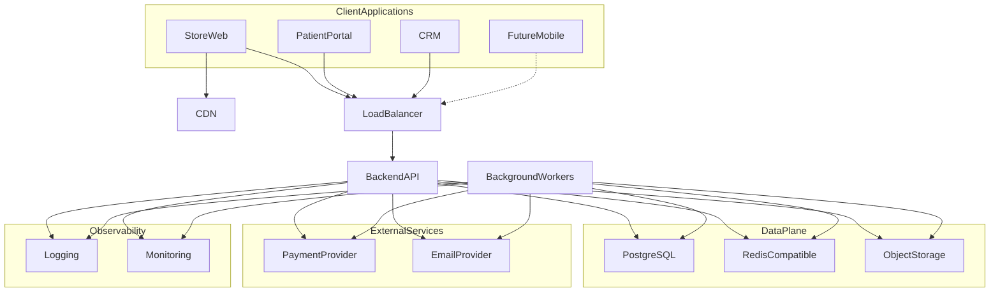

### 3.4 Communication summary

| From | To | Pattern |
| --- | --- | --- |
| Store / Portal / CRM | Backend API | HTTPS, versioned REST (`/v1`), session/token auth |
| Backend API | PostgreSQL | Encrypted connection; transactional writes |
| Backend API / Workers | Redis | Sessions, cache, queue broker |
| Backend API / Workers | Object storage | Signed upload/download paths; metadata in DB |
| Backend API / Workers | PSP | Outbound HTTPS + inbound webhooks (idempotent) |
| Notification path | Email provider | Outbound HTTPS via workers |
| Store browsers | CDN | Static assets; HTML still indexable per SEO NFRs |

---

## 4. Client Applications

### 4.1 Store (ARCH-011)

#### Responsibilities

- Public catalog browse, category/product detail, search UX, SEO rendering.
- Blog and CMS content rendering for published pages.
- Auth entry (register, sign-in, password reset initiation)—does not grant CRM access.
- Cart, coupon apply UX, checkout initiation, payment handoff UX.
- Questionnaire entry on the purchase path for Rx-eligible products.
- Moderated review display.

#### Major modules (client-side)

| Module | Behavior owned in UI |
| --- | --- |
| Catalog / SEO | Render published catalog and metadata |
| Content | Render published blogs/CMS blocks |
| Auth entry | Forms and redirects; API owns identity |
| Cart / Checkout | Cart UX; finalize via API gates |
| Questionnaire | Capture answers; submit to API |
| Reviews | Display approved reviews |

#### Communication

HTTPS to Backend API only. No direct DB, PSP secret, or clinical state mutation outside API responses.

#### Dependencies

Backend API (catalog, cart, checkout, auth, QST, payments initiation), CDN for static assets.

#### Explicit non-ownership

Clinical approval, inventory truth, staff CRM workflows, payment ≠ dispensing messaging is enforced by API (FR-STO-006).

---

### 4.2 Patient Portal (ARCH-012)

#### Responsibilities

- Authenticated self-service dashboard for the signed-in patient only.
- Profile, orders (including clinical-pending visibility), subscriptions and payment method management.
- Prescription status-appropriate view (not unconstrained clinical edit).
- Documents download, appointment book/view/cancel, support tickets.
- Optional non-mandatory notification preferences.

#### Major modules (client-side)

| Module | Behavior owned in UI |
| --- | --- |
| Account | Profile and security settings UX |
| Orders / Rx status | Status-appropriate presentation |
| Subscriptions | Manage/cancel; update payment method UX |
| Documents | List/download own artifacts |
| Appointments | Schedule within configured types |
| Support | Create/view own tickets |

#### Communication

HTTPS to Backend API with patient session/token. Patient-scoped responses only.

#### Dependencies

Backend API (PRT, ORD, SUB, DOC, APT, SUP, AUTH, NTF prefs).

#### Explicit non-ownership

Staff CRM workflows, catalog/clinical configuration, other patients’ data (FR-PRT-002, FR-PRT-006).

---

### 4.3 CRM (ARCH-013)

#### Responsibilities

- Role-scoped staff control plane: clinical review, pharmacy, fulfillment, support, marketing, content, administration.
- Consultation queue: approve, decline, or request additional information.
- Prescription create/update after doctor approval; pharmacist review before fulfillment readiness.
- Catalog, questionnaire, treatment plan, subscription, and consultation workflow configuration (admin).
- Inventory, orders, coupons, CMS/blogs, analytics dashboards, reports, support triage.

#### Major modules (client-side)

| Module | Staff focus |
| --- | --- |
| Clinical queue | Doctors |
| Pharmacy review | Pharmacists |
| Orders / inventory / fulfillment | Operations |
| Support desk | Support |
| Coupons / marketing analytics | Marketing |
| CMS / blogs | Content |
| Admin / settings | Administrators |

#### Internal clinical–ops workflow

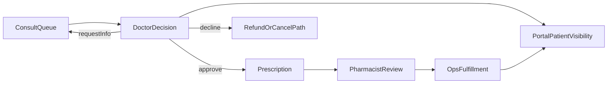

#### Communication

HTTPS to Backend API with staff session/token. Every privileged/PHI-adjacent action authorized server-side. Patient tokens must not access CRM routes.

#### Dependencies

Backend API (CRM, ORD, QST, INV, DOC, SUP, ADM, SET, ANL, RPT, NTF, AUTH).

#### Explicit non-ownership

Public SEO storefront rendering; Marketing/Content default access to clinical notes or full questionnaire answers (FR-CRM-006); Support must never approve prescriptions (FR-SUP-004).

---

## 5. Backend Architecture

### 5.1 Style: modular monolith (ARCH-028)

V1 delivers a **single Backend API deployable** organized as domain modules with clear boundaries. Modules share one process and one primary database, enabling transactional clinical/payment consistency. Boundaries are deliberate so a module can be extracted later without rewriting the care-commerce loop (NFR-025).

### 5.2 Layered model

| Layer | ID | Responsibilities |
| --- | --- | --- |
| API Layer | ARCH-029 | HTTP adapters, auth middleware, validation, rate limits, error envelope, correlation IDs, versioning |
| Business / Application Layer | ARCH-030 | Use-case orchestration (checkout, renew, approve consult, book appointment); transaction boundaries; domain-event publication |
| Domain Layer | ARCH-031 | Entities/rules: clinical gates, order state machine, RBAC policies, coupon validation, inventory policies |
| Repository Layer | ARCH-032 | Persistence abstractions; patient-scoped queries; no business rules leakage to SQL-only “truth” |
| Infrastructure Layer | ARCH-033 | PSP/email/object-storage/Redis/queue adapters; clock/scheduler; logging/metrics exporters |

Clinical and payment gates live in Domain and Business layers—not in Store/Portal/CRM UI logic.

### 5.3 Layered architecture diagram

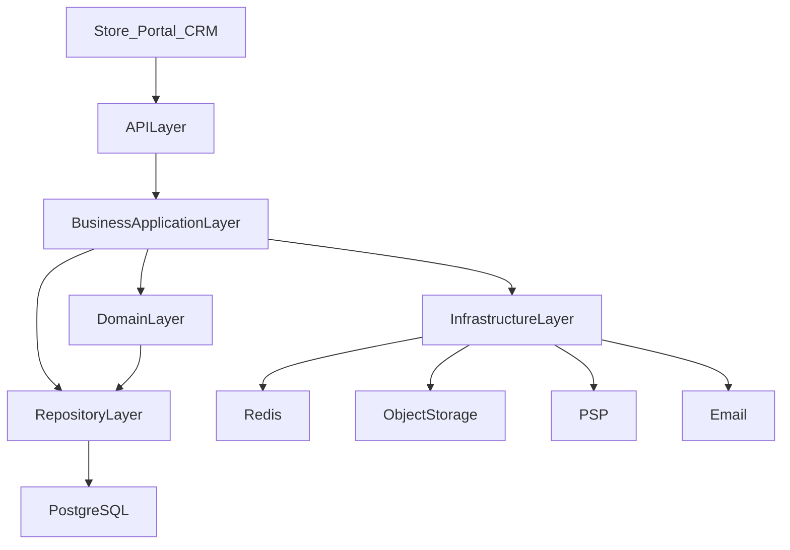

### 5.4 Cross-cutting backend concerns

| Concern | Placement |
| --- | --- |
| Authentication / session validation | API Layer + Redis/session store |
| Authorization (RBAC) | API middleware + Domain policy checks on every privileged op |
| Audit trail | Application Layer emits audit events (distinct from debug logs when feasible) |
| Idempotency | Application Layer for payment mutations and webhook handlers |
| Domain events | Application Layer publishes; workers/consumers handle NTF, analytics, search hooks |

---

## 6. Domain Modules

> Each module below is a Backend API domain capability. Client UIs consume them via the shared API. Prescriptions remain embedded across QST, ORD, Doctors/CRM, PRT, DOC, and NTF.

### 6.1 Authentication (ARCH-040)

| Aspect | Detail |
| --- | --- |
| Purpose | Email/password identity for patients and staff with role separation |
| Responsibilities | Register, authenticate, session/token issuance, password reset, lockout/abuse controls |
| Dependencies | Users, Notifications (reset/welcome), Audit |
| Events | User Registered, Email Verified, Password Reset Requested, Password Changed |
| External integrations | Email provider (reset tokens) |

### 6.2 Users (ARCH-041)

| Aspect | Detail |
| --- | --- |
| Purpose | Identity records and staff/patient profile attributes under admin control |
| Responsibilities | User lifecycle, role assignment, attributable staff accounts (no shared anonymous clinical accounts in prod-like) |
| Dependencies | Authentication, Settings/Admin, Audit |
| Events | User Registered; admin role-change audit events |
| External integrations | None in V1 (future IdP maps here) |

### 6.3 Products (ARCH-042)

| Aspect | Detail |
| --- | --- |
| Purpose | Catalog-agnostic products (SKU/variants, price, Rx flag, media, SEO) |
| Responsibilities | CRM-configurable publish without deploy; Rx-eligible flag drives gates |
| Dependencies | Categories, Inventory, Search, CMS/media via object storage |
| Events | Product Published, Product Updated |
| External integrations | Object storage (media) |

### 6.4 Categories (ARCH-043)

| Aspect | Detail |
| --- | --- |
| Purpose | Configurable Store navigation and SEO taxonomy |
| Responsibilities | Category publish; demo categories are seed data only |
| Dependencies | Products, Search, Store rendering |
| Events | Category Published |
| External integrations | None |

### 6.5 Cart (ARCH-044)

| Aspect | Detail |
| --- | --- |
| Purpose | Pre-order staging of lines and coupons for guest/patient |
| Responsibilities | Line management, merge on auth, coupon staging; cart is not an order |
| Dependencies | Products, Coupons, Checkout |
| Events | Cart Created |
| External integrations | None |

### 6.6 Checkout (ARCH-045)

| Aspect | Detail |
| --- | --- |
| Purpose | Finalize purchase with auth, clinical, coupon, and payment gates |
| Responsibilities | Validate cart; enforce QST for Rx; revalidate coupons; orchestrate payment; create order fail-safe |
| Dependencies | Auth, Cart, Questionnaires, Coupons, Payments, Orders, Inventory |
| Events | Checkout Started, Checkout Completed |
| External integrations | PSP (via Payments) |

### 6.7 Payments (ARCH-046)

| Aspect | Detail |
| --- | --- |
| Purpose | PSP-backed authorize/capture/refund and saved methods |
| Responsibilities | Tokenization only (no raw PAN); idempotent webhooks; drive order/subscription money states |
| Dependencies | Orders, Subscriptions, Notifications, Audit |
| Events | Payment Authorized, Payment Failed, Payment Refunded |
| External integrations | Payment Provider |

### 6.8 Orders (ARCH-047)

| Aspect | Detail |
| --- | --- |
| Purpose | Canonical order lifecycle including clinical states |
| Responsibilities | State transitions (`draft` → `payment_pending` → clinical path or `awaiting_fulfillment` → `fulfilled` / `cancelled` / `refunded`); Portal/CRM visibility |
| Dependencies | Payments, Questionnaires, Doctors/CRM, Inventory, Notifications, Documents |
| Events | Order Created, Order Cancelled, Order Fulfilled |
| External integrations | None directly (PSP via Payments) |

### 6.9 Subscriptions (ARCH-048)

| Aspect | Detail |
| --- | --- |
| Purpose | Recurring treatment plans with renewals and grace handling |
| Responsibilities | Plan binding, scheduled renewal charge, past-due/grace, cancel, Rx reassessment hooks |
| Dependencies | Payments, Orders, Questionnaires, Notifications, CRM visibility |
| Events | Subscription Created, Subscription Renewed, Subscription Cancelled |
| External integrations | PSP (renewal charges) |

### 6.10 Questionnaires (ARCH-049)

| Aspect | Detail |
| --- | --- |
| Purpose | Versioned clinical intake bound to products/plans/workflows |
| Responsibilities | Definition versioning; response capture; Rx checkout gate; clinician review artifacts |
| Dependencies | Products, Checkout, Doctors/CRM, Orders |
| Events | Questionnaire Submitted |
| External integrations | None |

### 6.11 Doctors (ARCH-050)

| Aspect | Detail |
| --- | --- |
| Purpose | Clinical consultation decisions by attributable doctor roles |
| Responsibilities | Queue case review; approve / decline / request info; create/update prescription on approve; audit actor/timestamp |
| Dependencies | Questionnaires, Orders, Documents, Notifications, Users/RBAC |
| Events | Doctor Approved Consultation, Doctor Declined Consultation, Prescription Created/Updated |
| External integrations | None |

### 6.12 Appointments (ARCH-051)

| Aspect | Detail |
| --- | --- |
| Purpose | Scheduling-only appointment artifacts (no video in V1) |
| Responsibilities | Book/view/cancel for patients; staff visibility in CRM; conflict validation |
| Dependencies | Users, Notifications, CRM |
| Events | Appointment Booked, Appointment Cancelled |
| External integrations | Future: maps / telemedicine ports |

### 6.13 Patient Portal (ARCH-052)

| Aspect | Detail |
| --- | --- |
| Purpose | Backend composition of patient self-service capabilities |
| Responsibilities | Aggregate authorized views of orders, subscriptions, Rx status, documents, appointments, tickets |
| Dependencies | Auth, Orders, Subscriptions, Documents, Appointments, Support, Notifications |
| Events | Consumes domain events for status freshness; does not invent clinical state |
| External integrations | None |

### 6.14 CRM (ARCH-053)

| Aspect | Detail |
| --- | --- |
| Purpose | Backend composition of staff clinical/ops control plane |
| Responsibilities | Role-scoped access to queues, pharmacy, fulfillment, support, config, analytics, reports |
| Dependencies | Doctors, Orders, Inventory, Support, Admin/Settings, Analytics, Reports, Content modules |
| Events | Consumes and triggers clinical/ops events under RBAC |
| External integrations | None beyond shared PSP/email |

### 6.15 Documents (ARCH-054)

| Aspect | Detail |
| --- | --- |
| Purpose | Patient-scoped document artifacts (receipts, Rx PDFs, education) |
| Responsibilities | Metadata in SoR; bytes in object storage; Portal download; CRM upload; audit PHI-sensitive access |
| Dependencies | Object storage, Orders/Prescriptions, AuthZ, Audit |
| Events | Document Uploaded |
| External integrations | Object storage |

### 6.16 Notifications (ARCH-055)

| Aspect | Detail |
| --- | --- |
| Purpose | Event-driven patient/staff communications (email-primary V1) |
| Responsibilities | Template selection, enqueue, dedupe by domain event key, retry/backoff, preference respect for non-mandatory |
| Dependencies | Domain events across modules; Background Workers; Settings |
| Events | Notification Sent |
| External integrations | Email provider (future SMS port) |

### 6.17 Reports (ARCH-056)

| Aspect | Detail |
| --- | --- |
| Purpose | Operational/clinical-ops tabular reports in CRM |
| Responsibilities | Scoped queries; sync for small reports; async export for large; never bypass RBAC |
| Dependencies | Orders, Inventory, CRM, Background Workers |
| Events | Report export job lifecycle (internal) |
| External integrations | Object storage (export files) |

### 6.18 Analytics (ARCH-057)

| Aspect | Detail |
| --- | --- |
| Purpose | Funnel and ops analytics for CRM (marketing-safe) |
| Responsibilities | Aggregate domain events; exclude unnecessary PHI and clinical free text from marketing views |
| Dependencies | Domain events; CRM dashboards |
| Events | Consumes User Registered, Checkout, Questionnaire Submitted, Order, Subscription events |
| External integrations | Optional future product analytics—must not receive clinical free text |

### 6.19 Settings (ARCH-058)

| Aspect | Detail |
| --- | --- |
| Purpose | Operator policy toggles enforced server-side |
| Responsibilities | Oversell policy, review moderation mode, notification template/hook flags; feature flags must not bypass clinical/payment gates |
| Dependencies | Admin, Inventory, Reviews, Notifications |
| Events | Audited settings changes |
| External integrations | None |

### 6.20 Support (ARCH-059)

| Aspect | Detail |
| --- | --- |
| Purpose | Patient tickets and staff triage |
| Responsibilities | Portal create/view; CRM triage; order linkage; refunds per policy; never Rx approve |
| Dependencies | Orders, Payments (refunds), Notifications, AuthZ |
| Events | Support Ticket Created |
| External integrations | Email (acknowledgements) |

### 6.21 Blogs (ARCH-060)

| Aspect | Detail |
| --- | --- |
| Purpose | Educational/SEO blog content |
| Responsibilities | Author/publish in CRM; Store render published posts |
| Dependencies | CMS patterns, Search, Store SEO |
| Events | Content publish (search reindex hook) |
| External integrations | CDN/object storage for assets |

### 6.22 CMS (ARCH-061)

| Aspect | Detail |
| --- | --- |
| Purpose | Store pages, banners, FAQs, content blocks without deploys |
| Responsibilities | Publish content configuration; Store rendering |
| Dependencies | Store, Search/SEO metadata |
| Events | Content publish hooks |
| External integrations | CDN/object storage for media |

### 6.23 Reviews (ARCH-062)

| Aspect | Detail |
| --- | --- |
| Purpose | Patient product reviews with moderation |
| Responsibilities | Submit when eligible; moderate before public by V1 default; Store displays approved only |
| Dependencies | Orders (eligibility), CRM moderation, Settings |
| Events | Review lifecycle (moderation) |
| External integrations | None |

### 6.24 Coupons (ARCH-063)

| Aspect | Detail |
| --- | --- |
| Purpose | Percent/fixed discounts configured in CRM |
| Responsibilities | Server-side validation at checkout; redemption on paid order; concurrency-safe usage |
| Dependencies | Cart, Checkout, Orders, Marketing CRM |
| Events | Redemption recorded with paid order |
| External integrations | None |

### 6.25 Inventory (ARCH-064)

| Aspect | Detail |
| --- | --- |
| Purpose | Stock truth for fulfillment |
| Responsibilities | Reserve/decrement per lifecycle; oversell policy; low-stock alerts; restock on cancel/refund rules |
| Dependencies | Orders, Settings, Notifications/CRM alerts |
| Events | Stock changes; low-stock alerts |
| External integrations | None |

### 6.26 Domain module relationship overview

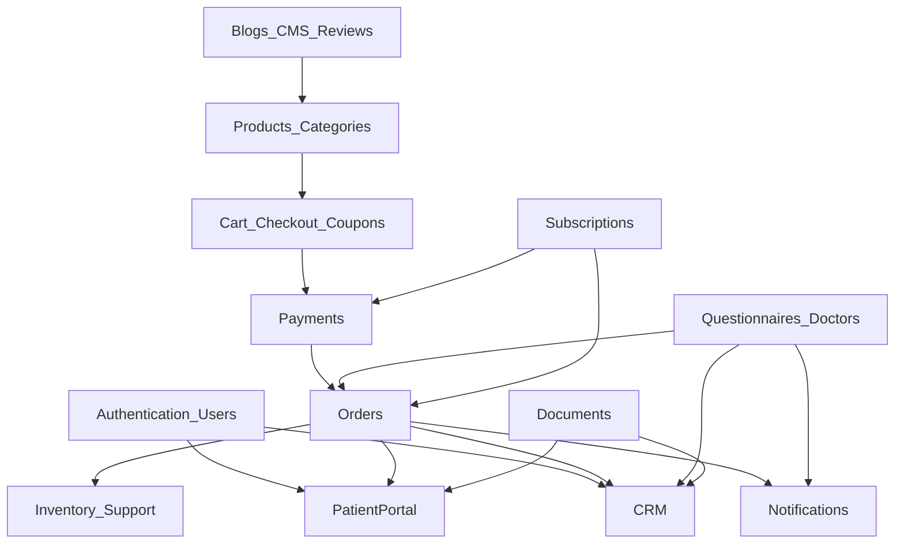

---

## 7. External Integrations

All external systems are reached through Infrastructure adapters (ports). Default outbound timeout **≤ 10 s** (NFR-034). Transient failures use exponential backoff with jitter and finite max attempts (NFR-031). Circuit breakers (or equivalent) are recommended (NFR-035).

| ID | Integration | V1 status | Architecture pattern |
| --- | --- | --- | --- |
| ARCH-070 | Payment Gateway (PSP) | Required | Tokenize/charge/refund; webhook receiver with at-least-once + idempotency; sandbox for demos |
| ARCH-071 | Email Service | Required | Transactional send via workers; sandbox/test mode; rate-aware sending |
| ARCH-072 | SMS Provider | Future | Notification channel port; same template/dedupe model as email |
| ARCH-073 | Cloud Object Storage | Required | S3-compatible; encryption at rest; versioning/replication where supported |
| ARCH-074 | CDN | Should | Public Store static assets; never cache private/PHI routes |
| ARCH-075 | Maps | Future | Appointment/location UX only; no clinical dependency |
| ARCH-076 | Analytics (third-party) | Optional/future | Only marketing-safe events; no clinical free text or unnecessary PHI |
| ARCH-077 | Authentication Providers (IdP/OAuth) | Future | Federated identity port beside email/password; RBAC remains server-side |

### 7.1 Integration boundary diagram

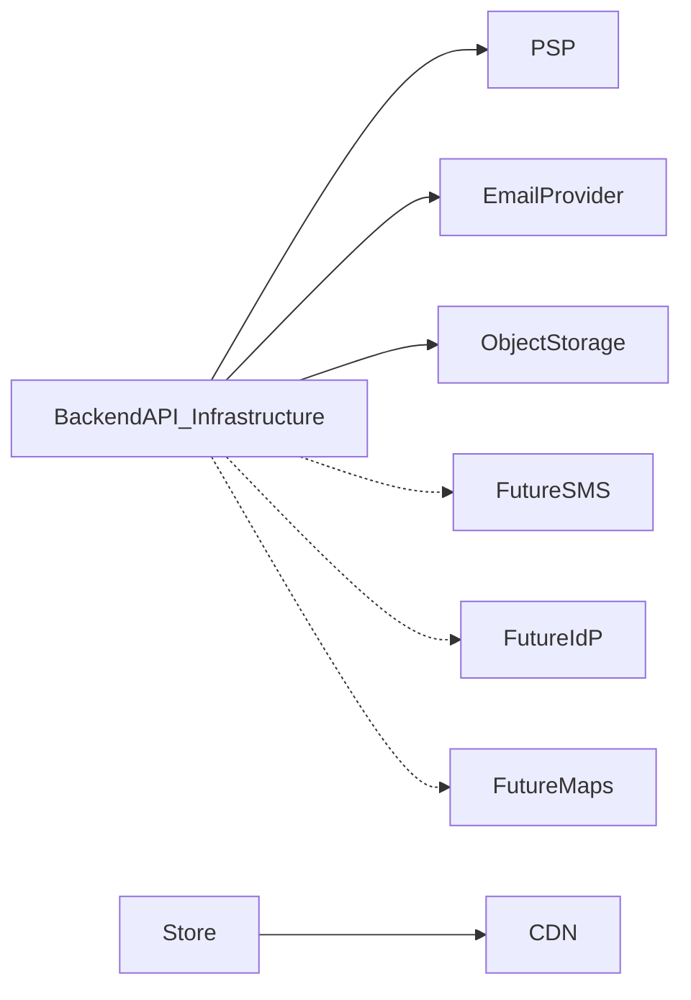

---

## 8. Background Processing

### 8.1 Queue model (ARCH-080)

- **Broker:** Redis-compatible queue (or equivalent) shared by API producers and worker consumers.
- **Delivery:** At-least-once with visibility timeout.
- **Poison messages:** After max attempts → **Dead Letter Queue (DLQ)** with ops visibility (NFR-038).
- **Isolation:** Workers are separate processes/containers from the interactive API so jobs do not starve p95 budgets (NFR-014, NFR-021).
- **Start lag:** Eligible jobs should start within **≤ 60 s** under nominal load (NFR-013).

### 8.2 Worker responsibilities

| Job class | Purpose |
| --- | --- |
| Subscription renewals | Interval due → charge saved method → create renewal order → optional reassessment gate |
| Notifications | Template render + email send; dedupe by domain event key |
| Report generation | Large CRM exports async; store artifact in object storage |
| Search reindex | Eventual consistency after publish |
| Cleanup | Expired tokens, stale carts (policy-defined), temporary export GC |
| Low-stock alerts | Notify ops when thresholds breach |
| Payment reconciliation | Detect charge-without-order / webhook lag edge cases |

### 8.3 Retry strategy

| Stage | Behavior |
| --- | --- |
| Transient external failure | Exponential backoff + jitter; capped attempts |
| Permanent failure | Stop; DLQ; alert if payment/webhook class |
| Notification duplicate | Dedupe window by domain event key (NFR-039) |
| Webhook replay | Idempotent by provider event ID (NFR-032) |

### 8.4 Scheduled jobs

| Schedule driver | Examples |
| --- | --- |
| Interval / cron worker | Subscription renewals, cleanup, reindex sweeps |
| Event-driven enqueue | Notification sends, report exports, low-stock alerts |

### 8.5 Queue processing workflow

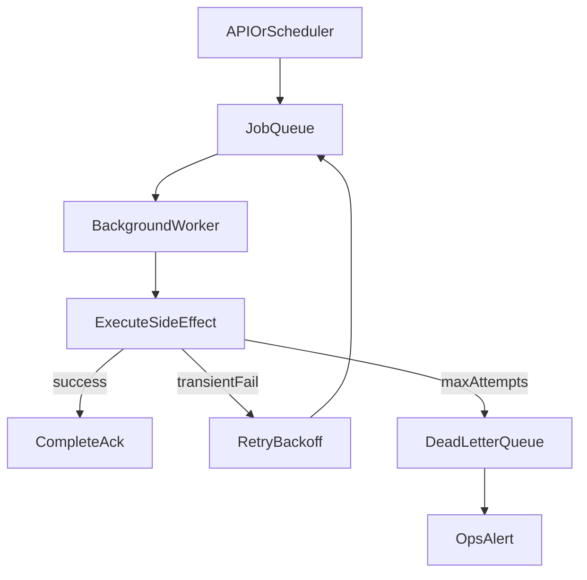

---

## 9. Security Architecture

### 9.1 Authentication flow (summary)

1. Patient or staff submits email/password to Backend API.
2. API validates credentials (password policy ≥ 12 chars; lockout after ≥ 5 failures / 15 min).
3. Session or opaque token issued; state stored in shared Redis-compatible store (stateless API instances).
4. Subsequent requests: API validates token/session; rejects unauthenticated PHI-adjacent access.
5. Password reset: time-limited email token; on success invalidate sessions.
6. Idle timeout ≤ 30 min (staff/PHI); absolute ≤ 12 h (NFR-044).

Deep sequence detail is owned by [12 — Authentication flow](12-authentication-flow.md).

### 9.2 Authorization and RBAC

- **Server-side RBAC** on every privileged and PHI-adjacent operation (NFR-045).
- Patient isolation: zero cross-patient read/write under normal paths (NFR-046).
- Staff roles: Doctor, Pharmacist, Support, Operations, Marketing, Content, Administrator—least privilege defaults.
- Marketing/Content denied clinical notes and full questionnaire answers by default (NFR-060).
- Support may assist refunds per policy; **never** approves prescriptions.
- Client role claims are never trusted without server policy evaluation.

### 9.3 Encryption, secrets, payments

| Control | Requirement |
| --- | --- |
| In transit | TLS 1.2+ for all client–API traffic (NFR-040) |
| At rest | Encryption for PostgreSQL and object storage where supported (NFR-048) |
| Secrets | Env/secret store only; never in source control or images (NFR-049, NFR-122) |
| Cards | PSP tokenization only; no raw PAN in DB/logs (NFR-050) |

### 9.4 Audit logs

- Clinical and admin-sensitive events record **actor, action, timestamp, object IDs** (NFR-057).
- Retention intent **≥ 1 year** for audit (NFR-062).
- Prefer audit sink distinct from debug application logs (NFR-076).
- Debug logs: structured, correlation IDs, redaction of secrets/PAN/questionnaire bodies; retention ≤ 90 days intent (NFR-063, NFR-074–075).

### 9.5 Rate limiting and abuse

- Auth: ≤ 10 login attempts / IP / 15 min (NFR-052).
- Public write endpoints bounded; HTTP 429 with retry guidance (NFR-119).
- Upload allowlist + default max ≤ 10 MB (NFR-054).

### 9.6 Security boundaries diagram

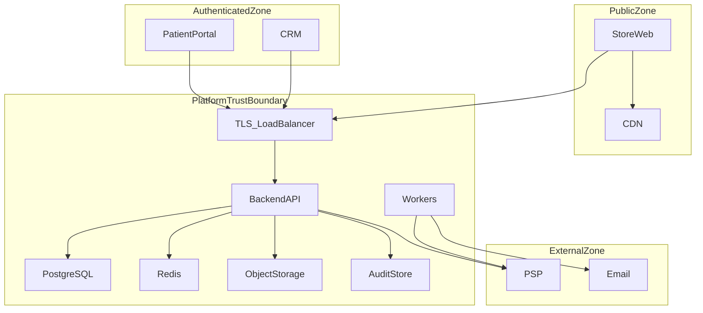

---

## 10. Data Flow

Architecture-level flows (no endpoint catalogs). Aligned with FRS journeys and PRD business rules.

### 10.1 User Registration

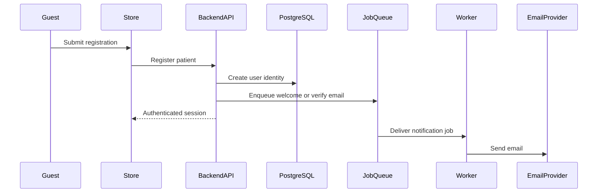

### 10.2 Checkout

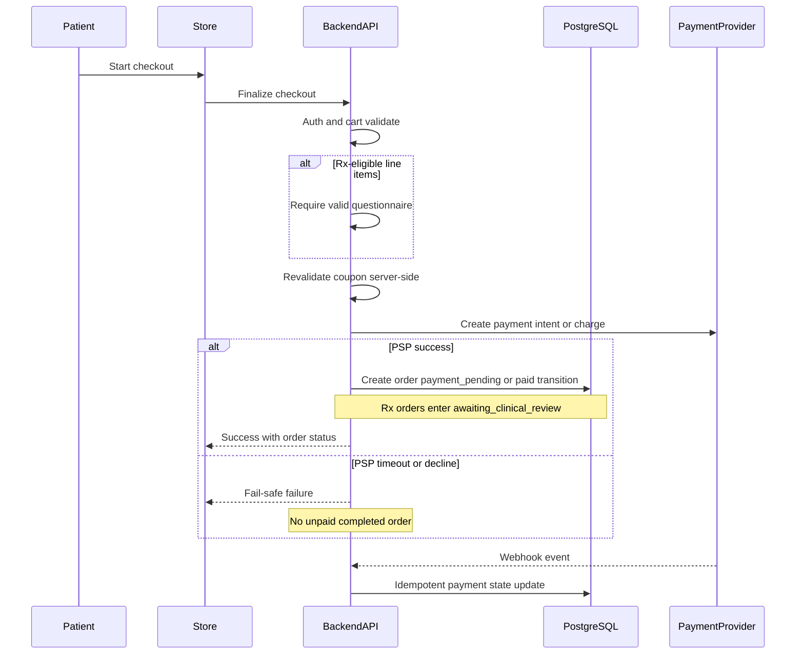

### 10.3 Doctor Approval

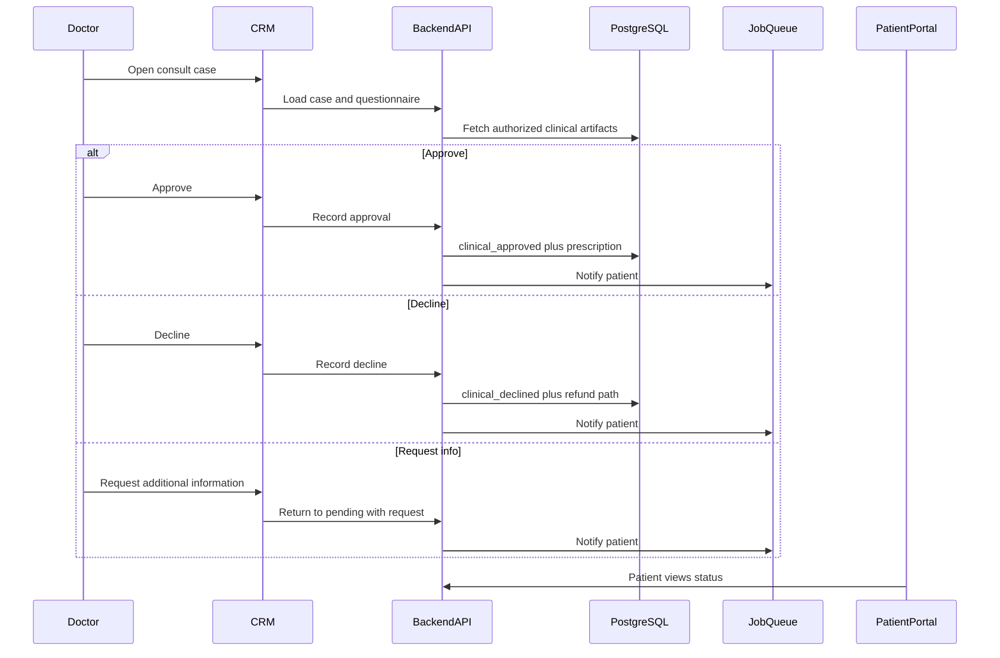

### 10.4 Subscription Renewal

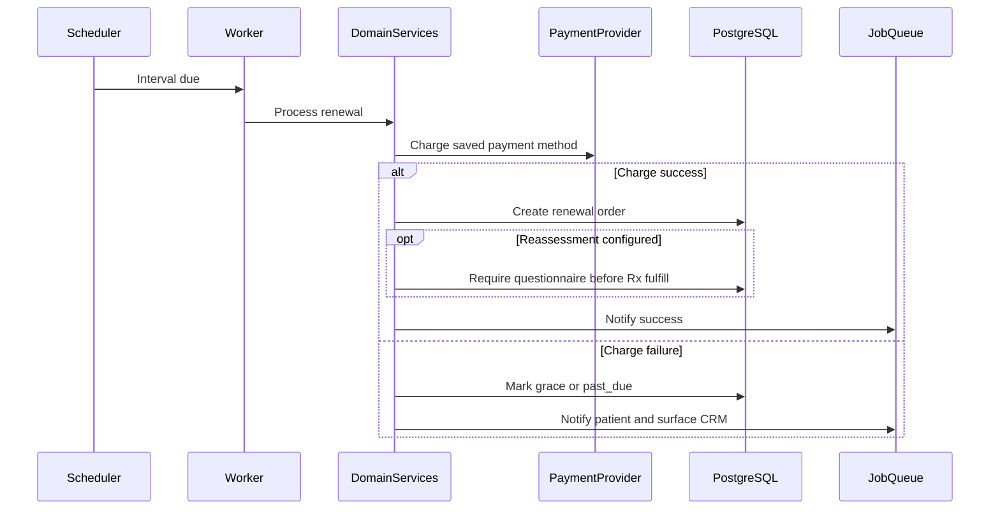

### 10.5 Appointment Booking

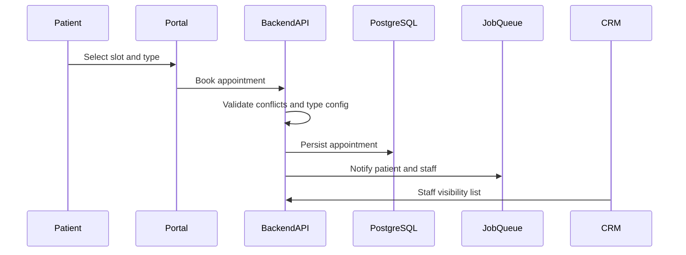

### 10.6 Document Upload

```mermaid
sequenceDiagram
  participant Actor
  participant Client as PortalOrCRM
  participant API as BackendAPI
  participant Objects as ObjectStorage
  participant DB as PostgreSQL
  participant Audit as AuditTrail

  Actor->>Client: Upload or attach document
  Client->>API: Request upload authorization
  API->>API: RBAC and patient-scope check
  API->>Objects: Store object bytes
  API->>DB: Persist metadata and ACL
  API->>Audit: Record PHI-sensitive access event
  API-->>Client: Document available to authorized parties
```

---

## 11. Deployment View

### 11.1 Runtime topology (ARCH-090)

| Tier | Components |
| --- | --- |
| Edge | CDN (Store static), TLS termination / load balancer |
| Web | Store (SSR-capable), Patient Portal, CRM |
| Application | Backend API instances (≥2), Background Workers (independent scale) |
| Data | Managed PostgreSQL primary (+ standby replication where supported), Redis-compatible, object storage |
| External | PSP, Email provider |
| Observability | Centralized logs, metrics, health probes, alerts |

### 11.2 Environments

Promotion path: **Dev → QA → Staging → Production** (NFR-127). Distinct credentials and data stores per environment (NFR-124). Staging mirrors production topology at reduced scale (NFR-129).

### 11.3 Deployment architecture diagram

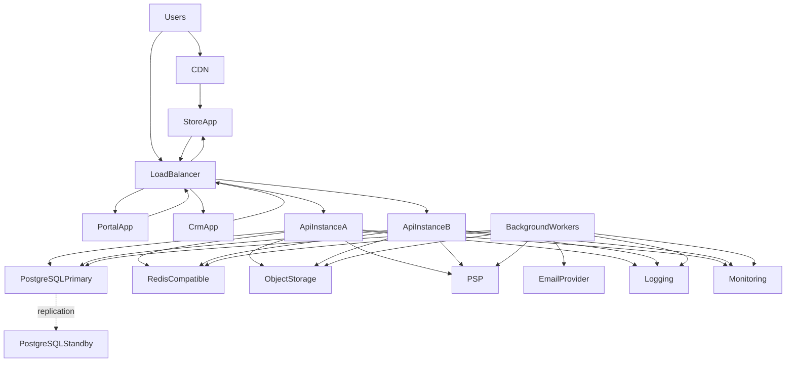

### 11.4 Health and operability

- Liveness and readiness probes on API; dependency probes for DB (and queue when used) (NFR-077).
- Unhealthy instance removed ≤ 60 s of failed checks (NFR-017).
- Metrics: latency, error rate, queue depth, payment failures, renewal failures (NFR-078).
- Alerts: 5xx rate > 2% over 5 min; webhook failure spikes (NFR-080).

---

## 12. Scalability Strategy

| Strategy | Approach |
| --- | --- |
| Horizontal scaling | API and web fronts scale out behind LB; no sticky-session dependence for API (NFR-015) |
| Stateless APIs | Session/token state in Redis-compatible shared store (NFR-016) |
| Database scaling | Vertical scale path for primary without schema redesign (NFR-018); indexed/paginated lists; single primary SoR in V1 |
| Caching | CDN for Store static; Redis for hot read cache where safe (never leak PHI across tenants) |
| Queues | Worker pool scales independently for renewals, NTF, reports (NFR-021) |
| Catalog growth | Configuration/data driven—no core redesign per category (NFR-019) |
| Consultation volume | Paginated/filtered CRM queues (NFR-020) |
| Future microservices | Extract by domain module boundary when scale/team needs justify; not forced in V1 (NFR-025) |

---

## 13. Failure Handling

| Failure | System behavior | Recovery |
| --- | --- | --- |
| External service (general) | Timeouts ≤ 10 s; circuit breaker when configured; degrade non-critical paths | Retry transient; alert sustained outages |
| Payment / PSP failure | Checkout **fail-safe**—no unpaid completed order (NFR-037) | User retry; webhook reconciliation; idempotent handlers |
| Payment webhook lag/replay | At-least-once; idempotent by event ID | Reconcile `payment_pending`; ops metrics |
| Database failure | API readiness fails; LB drains instances | Failover to standby where supported; restore from backup (RPO ≤ 24 h, RTO ≤ 4 h) |
| Queue / broker failure | Enqueue may fail; interactive path must not silently drop critical money/clinical commits | Buffer/retry; alert queue depth; DLQ review |
| Email failure | Core order create must not block on email (FR-NTF-003) | Worker retry/backoff; DLQ; manual resend path |
| Worker failure | Visibility timeout returns job to queue | Another worker retries; poison → DLQ |
| Reviews/search outage | Store browse continues (graceful degradation) (NFR-036) | Restore dependency; reindex if needed |
| Charge succeeded, order create failed | Detected via reconciliation job/report | Ops playbook to align order state or refund |

---

## 14. Architectural Decisions (ADR Summary)

| ID | Decision | Reason | Trade-offs |
| --- | --- | --- | --- |
| ARCH-100 | Modular monolith first | Fastest path to consistent clinical/payment transactions; NFR-025 allows later extraction | Single deployable can grow complex; mitigated by module boundaries |
| ARCH-101 | Versioned REST (`/v1`) | Matches NFR-112–120; simple for web and future mobile | Less flexible queries than GraphQL; acceptable for V1 resource model |
| ARCH-102 | Managed PostgreSQL as SoR | Strong relational consistency for orders/clinical states; OSS ecosystem; NFR-134 | Vertical scale limits vs distributed DB; sufficient for V1 single-region |
| ARCH-103 | S3-compatible object storage | Documents/media out of DB BLOBs (NFR-022/135); durable and scalable | Cross-object transactional coupling requires careful metadata design |
| ARCH-104 | Queues + dedicated workers | Isolates renewals/NTF/reports from request latency (NFR-021/038) | Operational complexity (DLQ, visibility timeouts) |
| ARCH-105 | Server-side RBAC | PHI isolation and clinical gates cannot be client-enforced | Requires thorough policy tests and role matrices (doc 08) |
| ARCH-106 | Background workers separate from API | Protects interactive p95; independent scale | Extra deployable and monitoring surface |
| ARCH-107 | Redis-compatible shared store | Enables stateless API, rate limits, and job broker on free-tier-friendly stacks | Another stateful dependency; must be HA-aware in staging/prod-like |
| ARCH-108 | SSR/indexable Store | SEO Musts (NFR-103–111) and LCP budgets | SSR ops complexity vs pure SPA |
| ARCH-109 | Single-region V1 | Matches PRD/NFR; reduces cost and complexity | No active-active DR; RPO/RTO via backup/standby only |
| ARCH-110 | PostgreSQL FTS for V1 search | Adequate for nominal catalog; avoids extra search cluster early | May need dedicated search engine at higher scale |
| ARCH-111 | First-party analytics aggregates | PHI minimization; marketing-safe dashboards | Less out-of-box product analytics; acceptable for V1 |
| ARCH-112 | Language/framework not mandated | NFR-140; patterns portable | Teams must still pick one stack in implementation repos |

---

## 15. Assumptions

| ID | Assumption |
| --- | --- |
| ARCH-120 | PRD remains the single source of truth; this doc does not invent product scope |
| ARCH-121 | Store, Portal, and CRM are separate V1 web applications sharing one Backend API |
| ARCH-122 | Email is the primary V1 notification channel |
| ARCH-123 | Document/media bytes live in object storage; transactional metadata in PostgreSQL |
| ARCH-124 | Demo catalog categories are seed data, not hard-wired product identity |
| ARCH-125 | Human clinicians approve prescriptions; system enforces gates and audit |
| ARCH-126 | Non-Rx products may skip clinical order states after successful payment |
| ARCH-127 | Reviews are moderated before public display by V1 default |
| ARCH-128 | V1 deployment is single-region and free-tier-friendly where practical |
| ARCH-129 | Application source code lives in repositories other than this planning repo |
| ARCH-130 | PSP and email providers offer sandbox/test modes for demos |
| ARCH-131 | Future Mobile reuses this API without a separate clinical domain model |

---

## 16. Constraints

| ID | Constraint |
| --- | --- |
| ARCH-140 | Clients must not embed divergent clinical or payment business rules |
| ARCH-141 | Server-side RBAC and auditability are mandatory for PHI-adjacent and admin actions |
| ARCH-142 | No raw card PAN storage; PSP tokenization only |
| ARCH-143 | Catalog/questionnaire/plan/workflow configurability is mandatory—no irreversible hard-coding of demo categories |
| ARCH-144 | Background renewals, notifications, and large reports must be isolatable from request/response latency |
| ARCH-145 | Multi-region active-active is out of V1 scope |
| ARCH-146 | Formal HIPAA/HITRUST/SOC 2 Type II certification is not a V1 delivery gate |
| ARCH-147 | Prefer open-source for core domain; justify proprietary commodity services in architecture/deployment docs |
| ARCH-148 | API must remain mobile-ready (client-agnostic auth and versioning) |
| ARCH-149 | Feature flags must not bypass clinical or payment gates |
| ARCH-150 | This planning repository contains documentation only—no application implementation code here |

---

## 17. Risks

| Risk | Impact | Mitigation |
| --- | --- | --- |
| Hard-coding demo categories into schema/UI | Breaks reusability / BO-5 | Config-driven Products/Categories; ADR ARCH-001 |
| Treating payment success as Rx clearance | Clinical/compliance failure | Order clinical states + Doctors module gates |
| Divergent rules in Store/Portal/CRM | Inconsistent money/clinical behavior | Thin clients; Domain Layer ownership |
| Shared anonymous staff accounts | Auditability loss | Attributable users; NFR-047 |
| Over-complex configurability delaying MVP | Delivery slip | Opinionated V1 config model; defer extreme branching |
| Over-broad CRM access | PHI leakage | Default-deny RBAC; marketing/content boundaries |
| Inventory drift | Oversell/undersell | Inventory module + settings policy + alerts |
| Free-tier quota throttling | Degraded demos | Graceful degradation; rate-aware email; capacity notes |
| Queue backlog during consult spikes | Slow NTF/renewals | Independent worker scale; queue depth alerts |
| Claiming certified HIPAA prematurely | Legal/comms risk | HIPAA-aware patterns only; NFR-065 |
| Search lag after publish | Stale Store results | Eventual consistency + reindex hooks |
| Charge without order | Money/state mismatch | Reconciliation worker + fail-safe checkout design |

---

## 18. Traceability Matrix

Maps architecture components → functional modules → representative NFR requirements.

| Architecture component | Functional modules (`FR-*` codes) | Representative NFRs |
| --- | --- | --- |
| Store (ARCH-011) | STO, PRD, CAT, SRCH, CART, CHK, BLG, CMS, REV, CPN, AUTH | NFR-001, NFR-005, NFR-103–111, NFR-091 |
| Patient Portal (ARCH-012) | PRT, ORD, SUB, DOC, APT, SUP, AUTH | NFR-002, NFR-046, NFR-091, NFR-098 |
| CRM (ARCH-013) | CRM, ADM, SET, ANL, RPT, INV, SUP | NFR-003, NFR-008, NFR-045, NFR-100 |
| Backend API (ARCH-014, ARCH-028–033) | All domain modules | NFR-015–016, NFR-066–068, NFR-112–120 |
| Authentication / Users (ARCH-040–041) | AUTH, ADM | NFR-041–047, NFR-052 |
| Products / Categories (ARCH-042–043) | PRD, CAT | NFR-019, NFR-068 |
| Cart / Checkout / Coupons (ARCH-044–045, ARCH-063) | CART, CHK, CPN | NFR-009–010, NFR-037 |
| Payments (ARCH-046) | PAY | NFR-028, NFR-032–033, NFR-050 |
| Orders (ARCH-047) | ORD | NFR-037, NFR-057 |
| Subscriptions (ARCH-048) | SUB | NFR-013, NFR-021 |
| Questionnaires / Doctors (ARCH-049–050) | QST, CRM clinical | NFR-004, NFR-045, NFR-057 |
| Appointments (ARCH-051) | APT | NFR-102 (scheduling-only; mobile-ready API) |
| Documents (ARCH-054) | DOC | NFR-022, NFR-048, NFR-054 |
| Notifications (ARCH-055) | NTF | NFR-031, NFR-039, NFR-136 |
| Reports / Analytics (ARCH-056–057) | RPT, ANL | NFR-011–012, NFR-059 |
| Inventory / Reviews / Support / Settings (ARCH-058–059, ARCH-062, ARCH-064) | INV, REV, SUP, SET | NFR-036, NFR-045, NFR-123 |
| Blogs / CMS (ARCH-060–061) | BLG, CMS | NFR-103–104 |
| PostgreSQL (ARCH-016) | All transactional modules | NFR-134, NFR-048, NFR-083–087 |
| Object storage (ARCH-017) | DOC, PRD media, exports | NFR-022, NFR-085, NFR-135 |
| Redis / workers / queues (ARCH-018, ARCH-015, ARCH-080) | SUB, NTF, RPT, PAY webhooks | NFR-013–014, NFR-021, NFR-038 |
| PSP / Email (ARCH-070–071) | PAY, NTF, AUTH reset | NFR-136–137 |
| CDN (ARCH-019) | STO static | NFR-023, NFR-133 |
| Logging / Monitoring (ARCH-025–026) | Cross-cutting | NFR-074–082, AC-BR-14 |
| Search (ARCH-023) | SRCH | NFR-007–008, NFR-001 |
| Security boundaries (ARCH- §9) | AUTH + all PHI modules | NFR-040–065 |

---

## Related reading

| Topic | Document |
| --- | --- |
| Requirements contract | [00 — Product Requirements Document](00-product-requirements-document.md) |
| Vision and principles | [01 — Project overview](01-project-overview.md) |
| Business goals and acceptance | [02 — Business requirements](02-business-requirements.md) |
| Functional behavior (`FR-*`) | [03 — Functional requirements](03-functional-requirements.md) |
| Quality attributes (`NFR-*`) | [04 — Non-functional requirements](04-non-functional-requirements.md) |
| Persistence design | [10 — Database design](10-database-design.md) |
| API contracts | [11 — API design](11-api-design.md) |
| Auth sequences | [12 — Authentication flow](12-authentication-flow.md) |
| Security depth | [13 — Security](13-security.md) |
| Environments and release | [23 — Deployment](23-deployment.md) |

---

## Document control

| Item | Value |
| --- | --- |
| Owner | Architecture (Clinexa planning) |
| Change rule | Material structural changes → align [PRD §14](00-product-requirements-document.md#14-high-level-architecture) and affected NFR/FR first |
| Implementation rule | Application repos and downstream docs (10–13, 23) must trace to `ARCH-*` decisions and component boundaries |

---

## 19. Revision History

| Version | Date | Author | Reviewer | Changes | Approval Status |
| --- | --- | --- | --- | --- | --- |
| 1.0 | 2026-07-23 | Abhishek Singh Sengar | — | Initial System Architecture draft for review | Pending review |

---

*End of 05 — System Architecture.*
