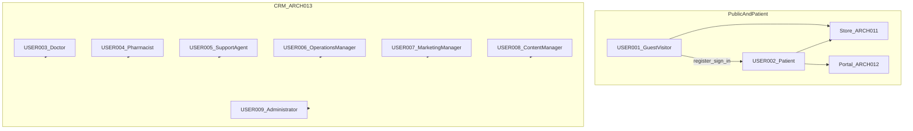
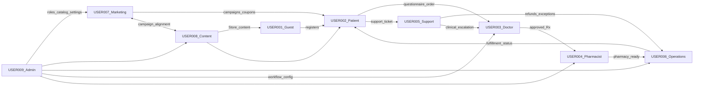
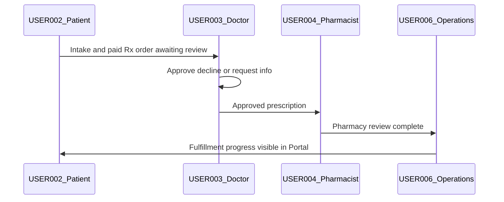

# 06 — User Personas

| Field | Value |
| --- | --- |
| Document | User Personas |
| Product | Clinexa |
| Version | 1.0 |
| Status | Draft for review |
| Primary market | United States |
| Audience | Product, UX/Design, Engineering, QA, Clinical Ops, Support, Marketing, Content, Operations, Administrators |
| Source of truth | [00 — Product Requirements Document](00-product-requirements-document.md) |
| Related docs | [01 — Project overview](01-project-overview.md), [02 — Business requirements](02-business-requirements.md), [03 — Functional requirements](03-functional-requirements.md), [04 — Non-functional requirements](04-non-functional-requirements.md), [05 — System architecture](05-system-architecture.md), [07 — User journeys](07-user-journeys.md), [08 — Role permissions](08-role-permissions.md), [20 — UI design system](20-ui-design-system.md) |

This document is the **User Personas** charter for Clinexa Version 1. It describes **who** interacts with the platform—their goals, motivations, pain points, environments, and high-level permission boundaries—so product, design, and delivery teams share one human model of the care-commerce system.

It expands [PRD §6](00-product-requirements-document.md#6-user-personas) using capabilities from [03 — Functional requirements](03-functional-requirements.md), business outcomes from [02 — Business requirements](02-business-requirements.md), surface boundaries from [05 — System architecture](05-system-architecture.md), and accessibility/device expectations from [04 — Non-functional requirements](04-non-functional-requirements.md).

It does **not** define end-to-end journey scripts ([07](07-user-journeys.md)), full RBAC matrices ([08](08-role-permissions.md)), UI layouts or mockups ([20](20-ui-design-system.md)), API contracts, or database design. It does **not** invent roles beyond the PRD.

> **Naming alignment:** Clinexa has no separate “Registered Customer” or “Super Administrator” persona. Unauthenticated Store visitors are **Guest Visitors**; after registration they are **Patients**. Inventory and fulfillment are owned by **Operations**. Elevated configuration and break-glass practices live under **Administrator**. Engineering and QA appear in the PRD as delivery stakeholders and are noted in scope only—they are not assigned `USER-*` IDs here.

---

## Table of contents

1. [Introduction](#1-introduction)
2. [Persona Overview](#2-persona-overview)
3. [Persona Catalog](#3-persona-catalog)
4. [Persona Relationships](#4-persona-relationships)
5. [User Environment](#5-user-environment)
6. [User Goals Matrix](#6-user-goals-matrix)
7. [Frustration & Pain Point Analysis](#7-frustration--pain-point-analysis)
8. [Accessibility Needs](#8-accessibility-needs)
9. [Persona Journey Readiness](#9-persona-journey-readiness)
10. [Persona Traceability Matrix](#10-persona-traceability-matrix)
11. [Revision History](#11-revision-history)

---

## 1. Introduction

### 1.1 Purpose

Define the primary human actors of Clinexa so that:

- Product decisions stay anchored to real user goals and constraints rather than feature lists alone.
- Design and journey work ([07](07-user-journeys.md), [20](20-ui-design-system.md)) start from a shared understanding of who each surface serves.
- Role-permission design ([08](08-role-permissions.md)) inherits clear duty-separation intent from named personas.
- Business objectives ([02](02-business-requirements.md)) and functional modules ([03](03-functional-requirements.md)) remain traceable to the people they serve.

### 1.2 Scope

#### In scope (V1)

| Area | Coverage |
| --- | --- |
| Primary personas | Guest Visitor, Patient, Doctor, Pharmacist, Support Agent, Operations Manager, Marketing Manager, Content Manager, Administrator |
| Identity lifecycle | Guest → Patient registration transition (same person, new authenticated identity) |
| Surfaces | Store Web, Patient Portal, CRM (staff) |
| Persona attributes | Goals, responsibilities, activities, motivations, pain points, needs, permission summaries, devices, skill, frequency, success metrics, accessibility, related modules and business goals |
| Relationships | How personas interact across clinical, commerce, and operations workflows |
| Traceability | Mapping to BO/BP/OR/KPI, FR modules, and ARCH surfaces |

#### Out of scope

| Area | Deferred to |
| --- | --- |
| Step-by-step journey scripts | [07 — User journeys](07-user-journeys.md) |
| Detailed permission matrices | [08 — Role permissions](08-role-permissions.md) |
| UI components, wireframes, visual design | [20 — UI design system](20-ui-design-system.md) |
| API behavior, schemas, deployment | [11](11-api-design.md), [10](10-database-design.md), [23](23-deployment.md) |
| Native mobile patient experience | Future Mobile (PRD §7.6; not V1 delivery) |
| Engineering and QA as product operators | PRD §6.9–6.10 (delivery stakeholders; not `USER-*` personas) |
| Fictional demographic characters | Role-based personas only (consistent with PRD §6) |

### 1.3 Audience

| Audience | How they use this document |
| --- | --- |
| Product managers | Prioritize features against persona goals and pain points |
| UX researchers / product designers | Frame research, journeys, and interaction priorities |
| Engineers / QA | Understand actor intent when implementing and testing FR acceptance |
| Clinical ops / support / marketing / content / operations | Confirm duty boundaries and day-to-day expectations |
| Administrators | Understand configuration and segregation-of-duties intent |
| Architects | Map personas to Store, Portal, and CRM trust boundaries |

### 1.4 References

| Document | Relevance |
| --- | --- |
| [00 — Product Requirements Document](00-product-requirements-document.md) | Source of truth for personas (§6), surfaces (§7), journeys (§9), accessibility (§12.4) |
| [01 — Project overview](01-project-overview.md) | Vision, mission pillars, application audiences |
| [02 — Business requirements](02-business-requirements.md) | BO, BP, OR, KPI, AC-BR, RACI |
| [03 — Functional requirements](03-functional-requirements.md) | FR modules, actors, CRUD intent |
| [04 — Non-functional requirements](04-non-functional-requirements.md) | Accessibility (NFR-091–096), browsers/devices (NFR-097–102) |
| [05 — System architecture](05-system-architecture.md) | ARCH-011 Store, ARCH-012 Portal, ARCH-013 CRM, role boundaries |
| [07 — User journeys](07-user-journeys.md) | Next document—journey scripts seeded by these personas |
| [08 — Role permissions](08-role-permissions.md) | Authoritative RBAC matrices |

### 1.5 ID convention

| Prefix | Meaning |
| --- | --- |
| `USER-###` | Primary product persona in this document |
| `BO-` / `BP-` / `OR-` / `KPI-` / `AC-BR-` | Business IDs from [02](02-business-requirements.md) |
| `FR-` | Functional requirement modules from [03](03-functional-requirements.md) |
| `NFR-` | Non-functional requirements from [04](04-non-functional-requirements.md) |
| `ARCH-` | Architecture components from [05](05-system-architecture.md) |

---

## 2. Persona Overview

### 2.1 Why personas exist

Personas translate Clinexa’s care-commerce loop into **human accountability**. The platform spans public discovery (Store), authenticated self-service (Patient Portal), and role-scoped staff work (CRM). Without a shared persona model, features risk optimizing for “the user” generically—collapsing clinical, commercial, and marketing duties that must remain separated for safety and trust.

### 2.2 How personas guide product decisions

| Decision type | Persona influence |
| --- | --- |
| Scope / MoSCoW | Must-have capabilities map to Patient clinical gates, Doctor/Pharmacist safety, Ops fulfillment, and Admin configurability |
| Surface design | Guest/Patient needs shape Store and Portal; staff personas shape CRM modules |
| Duty separation | Support never approves prescriptions; Marketing/Content do not default to clinical charts |
| Success metrics | KPIs attach to persona outcomes (e.g., doctor turnaround, portal deflection, configuration velocity) |
| Acceptance testing | AC-BR and FR acceptance criteria are validated as persona-visible outcomes |

### 2.3 Relationship with User Journeys

This document defines **who** acts. [07 — User journeys](07-user-journeys.md) will define **how** those actors move through PRD §9 / BP-01–BP-11 flows (guest purchase, doctor review, fulfillment, renewals, refunds, and more). Every journey script should name one or more `USER-*` actors and the surface they use.

### 2.4 Relationship with RBAC

Personas express **intent and boundaries**. [08 — Role permissions](08-role-permissions.md) will encode those boundaries as enforceable permissions. Permission summaries in §3 are descriptive only; server-side RBAC remains authoritative (FR-AUTH-004, ARCH-005).

### 2.5 Relationship with UI Design

[20 — UI design system](20-ui-design-system.md) will design patterns for Store, Portal, and CRM. Personas constrain which surface a role uses, accessibility expectations, and information density (patient self-service vs clinical queues)—not pixel layouts.

### 2.6 Catalog summary

| Persona ID | Persona | PRD name | Primary surface(s) |
| --- | --- | --- | --- |
| USER-001 | Guest Visitor | Guest | Store |
| USER-002 | Patient | Patient | Store, Patient Portal |
| USER-003 | Doctor | Doctor | CRM |
| USER-004 | Pharmacist | Pharmacist | CRM |
| USER-005 | Support Agent | Support Team | CRM |
| USER-006 | Operations Manager | Operations | CRM |
| USER-007 | Marketing Manager | Marketing | CRM (Store-facing outcomes) |
| USER-008 | Content Manager | Content Team | CRM (Store-facing content) |
| USER-009 | Administrator | Administrator | CRM |

---

## 3. Persona Catalog

### 3.1 USER-001 — Guest Visitor

| Field | Detail |
| --- | --- |
| **Persona ID** | USER-001 |
| **Role** | Guest Visitor (unauthenticated Store visitor) |
| **Description** | A prospective US patient exploring treatments, educational content, and pricing on the Store before creating an account. Guests can browse, search, read moderated reviews and CMS/blog content, and stage a cart; they must register or sign in before checkout finalize and clinical intake. |
| **Primary Goals** | Discover relevant treatments quickly; understand offerings and trust signals; start a purchase path without friction; decide whether to register |
| **Responsibilities** | Browse published catalog and content honestly; begin checkout when ready; provide accurate credentials when registering |
| **Daily Activities** | Land from SEO/campaigns; browse categories (e.g., Weight Management, Hair Loss, Men’s Health, Skincare demo catalog); read blogs/FAQs; compare products; add items to cart; encounter auth prompt at finalize |
| **Motivations** | Convenient access vs clinic waits; privacy-conscious self-serve discovery; clear pricing and process before sharing health data |
| **Pain Points** | Unclear online care processes; distrust of health data handling; dead-end carts; confusing prescription vs non-prescription paths |
| **Needs** | Fast, accessible Store discovery; transparent next steps; seamless cart preserve/merge when signing in; education without clinical jargon overload |
| **Permissions Summary** | Public Store read (catalog, CMS, blogs, moderated reviews); cart staging; registration/sign-in/password-reset entry. No Portal, no CRM, no order creation until authenticated. Full matrix → [08](08-role-permissions.md). |
| **Devices Used** | Desktop and mobile web (primary); tablet web (Should). Native apps out of V1. |
| **Technical Skill Level** | Low to medium (consumer web) |
| **Frequency of Use** | Episodic / acquisition-driven (often one or few sessions before conversion) |
| **Success Metrics** | KPI-01 (questionnaire completion among those who start Rx path); Store discovery conversion into registration; SEO engagement (supporting BO-1) |
| **Accessibility Considerations** | WCAG 2.2 AA for browse/search/content (NFR-091); mobile width ≥375px (NFR-101); keyboard and focus order on Store journeys |
| **Related Functional Modules** | FR-STO, FR-PRD (read), FR-CAT (read), FR-BLG (read), FR-CMS (read), FR-SRCH, FR-CART, FR-REV (read), FR-AUTH-001 (register) |
| **Related Business Goals** | BO-1 (convert discovery into care); BP-01; OR-01/OR-09; AC-BR-01, AC-BR-06, AC-BR-07 |

**Lifecycle note:** There is no separate “Registered Customer” persona. When a Guest registers, they become **USER-002 Patient** and may continue Store commerce plus Portal self-service.

---

### 3.2 USER-002 — Patient

| Field | Detail |
| --- | --- |
| **Persona ID** | USER-002 |
| **Role** | Patient (authenticated care-commerce end user) |
| **Description** | A registered US patient who purchases treatments, completes medical questionnaires on Rx paths, pays via PSP, and manages ongoing care artifacts in the Patient Portal—orders, prescription status, subscriptions, documents, appointments, and support tickets—while seeing only their own data. |
| **Primary Goals** | Complete intake quickly; purchase and renew safely; track orders and Rx status; self-serve documents and subscriptions; get help when stuck without losing privacy |
| **Responsibilities** | Provide accurate health information; protect credentials; keep payment and shipping details current; use Portal for status rather than informal channels when possible |
| **Daily Activities** | Sign in to Store/Portal; complete or resume questionnaires; checkout; monitor clinical pending/decline messaging; manage subscriptions and payment methods; download documents; book/cancel appointments; open support tickets; submit eligible reviews |
| **Motivations** | Convenient therapy access; continuity of care online; transparency of clinical process; confidence that payment ≠ automatic dispensing |
| **Pain Points** | Long clinic waits historically; opaque refill/document tracking; anxiety while awaiting clinical review; failed renewals; privacy concerns |
| **Needs** | Clear status messaging; own-data isolation; accessible Portal self-service; reliable renewal notifications; straightforward refund/support paths |
| **Permissions Summary** | Own profile, orders, questionnaires, prescriptions (status-appropriate), documents, appointments, subscriptions, support tickets, reviews (eligible), notification preferences. No CRM access; no cross-patient data. Full matrix → [08](08-role-permissions.md). |
| **Devices Used** | Desktop and mobile web Store/Portal; tablet web (Should). Future native mobile planned against same API. |
| **Technical Skill Level** | Low to medium |
| **Frequency of Use** | Recurring during active therapy (Portal check-ins, renewals); Store as needed for reorders |
| **Success Metrics** | KPI-01, KPI-04, KPI-05, KPI-06, KPI-08, KPI-10; portal deflection; zero cross-patient access |
| **Accessibility Considerations** | WCAG 2.2 AA on intake, checkout, Portal self-service (NFR-091); screen-reader labels/errors/live regions (NFR-096); contrast and focus (NFR-094–095) |
| **Related Functional Modules** | FR-AUTH, FR-STO, FR-CART, FR-CHK, FR-PAY, FR-QST, FR-ORD, FR-SUB, FR-PRT, FR-DOC, FR-APT, FR-SUP, FR-REV, FR-CPN, FR-NTF |
| **Related Business Goals** | BO-1, BO-3; BP-01, BP-02, BP-06, BP-07, BP-08, BP-09; OR-01–OR-06, OR-09–OR-11; AC-BR-01–04, AC-BR-07–11 |

---

### 3.3 USER-003 — Doctor

| Field | Detail |
| --- | --- |
| **Persona ID** | USER-003 |
| **Role** | Doctor (licensed clinical reviewer) |
| **Description** | A healthcare professional working in CRM who evaluates questionnaire responses and case context, then approves, declines, or requests more information on prescription-eligible orders—with documented rationale and human accountability for prescribing decisions. |
| **Primary Goals** | Review cases thoroughly; make timely approve/decline decisions; document clinical rationale; maintain quality and safety |
| **Responsibilities** | Evaluate intake completeness; issue or withhold prescriptions within role; escalate unsafe cases; never skip clinical gates for commerce pressure |
| **Daily Activities** | Open consult queue; review versioned questionnaire answers; write clinical notes; approve/decline/request info; monitor reassessment cases for subscriptions when configured |
| **Motivations** | Safe attributable prescribing; efficient throughput; tools that surface clinical context over commerce noise |
| **Pain Points** | Incomplete intake; noisy queues; commerce UI burying clinical signals; SLA pressure without good triage |
| **Needs** | Clear queue prioritization; complete intake context; audited decision actions; keyboard-friendly dense CRM workflows |
| **Permissions Summary** | Assigned/available consult cases; clinical notes; approve/decline Rx within role. No marketing admin, no system-wide config by default. Full matrix → [08](08-role-permissions.md). |
| **Devices Used** | Desktop CRM preferred (≥1024px usable, ≥1280px preferred per NFR-100) |
| **Technical Skill Level** | Medium (clinical systems literacy) |
| **Frequency of Use** | Daily during active clinical ops |
| **Success Metrics** | KPI-02 (doctor review turnaround ≤1 business day demo intent); KPI-03 (cycle time contribution); clinical quality (decline/refund correctness path) |
| **Accessibility Considerations** | Keyboard access for queue/case actions (NFR-092); AA goal for primary clinical workflows (NFR-093) |
| **Related Functional Modules** | FR-AUTH, FR-CRM-001–003, FR-QST-005, FR-ORD-002–003, FR-SUB-005, FR-DOC (case context), FR-APT (staff visibility as granted) |
| **Related Business Goals** | BO-2; BP-03, BP-04; OR-02–OR-04, OR-10; AC-BR-02, AC-BR-10 |

---

### 3.4 USER-004 — Pharmacist

| Field | Detail |
| --- | --- |
| **Persona ID** | USER-004 |
| **Role** | Pharmacist (pharmacy review for fulfillment readiness) |
| **Description** | A licensed pharmacy professional in CRM who confirms prescription completeness after doctor approval and updates pharmacy review status so fulfillment can proceed safely—without replacing doctor clinical approval. |
| **Primary Goals** | Confirm Rx completeness; enable safe fulfillment readiness; flag issues early |
| **Responsibilities** | Review approved prescriptions; coordinate with Operations on dispensing/order state; escalate missing details or inventory mismatches |
| **Daily Activities** | Work pharmacy review queue; verify Rx artifacts and order context; update review status; communicate blockers to Ops/Doctor as needed |
| **Motivations** | Patient safety at dispensing readiness; clear handoffs from clinical to fulfillment |
| **Pain Points** | Missing Rx details; inventory mismatch; unclear order state between payment, approval, and shipment |
| **Needs** | Linked Rx + order visibility; unambiguous review states; coordination path with Ops without bypassing clinical gates |
| **Permissions Summary** | View prescriptions and related order/fulfillment data; update pharmacy review status. Cannot unilaterally approve in place of the doctor. Full matrix → [08](08-role-permissions.md). |
| **Devices Used** | Desktop CRM (NFR-100) |
| **Technical Skill Level** | Medium |
| **Frequency of Use** | Daily during active fulfillment ops |
| **Success Metrics** | KPI-03 (order-to-fulfillment cycle); pharmacy review completeness before Rx fulfillment (OR-05 / AC-BR-03) |
| **Accessibility Considerations** | Keyboard-accessible CRM review workflows (NFR-092) |
| **Related Functional Modules** | FR-CRM-004, FR-ORD-002–003, FR-QST-005 (as permitted), FR-INV (coordination), FR-DOC (as permitted) |
| **Related Business Goals** | BO-2, BO-4; BP-04, BP-05; OR-05, OR-08, OR-12; AC-BR-03 |

---

### 3.5 USER-005 — Support Agent

| Field | Detail |
| --- | --- |
| **Persona ID** | USER-005 |
| **Role** | Support Agent (customer support / patient assistance) |
| **Description** | An internal support professional in CRM who resolves account, order, subscription, and refund issues with least-privilege PHI access limited to ticket context—never approving prescriptions. |
| **Primary Goals** | Resolve patient issues quickly; minimize clinical risk; apply refund policy correctly |
| **Responsibilities** | Triage Portal-originated tickets; assist account access and order questions; initiate refunds per policy; escalate clinical questions to clinical roles |
| **Daily Activities** | Work ticket queue; search patients in ticket/order context; explain clinical pending/decline status without changing clinical decisions; assist renewal failures; coordinate with Ops on fulfillment exceptions |
| **Motivations** | High first-contact resolution; clear policies; appropriate data access (neither over- nor under-broad) |
| **Pain Points** | Poor order visibility; unclear refund rules; credential sharing or over-broad PHI historically; pressure to “just approve” clinical outcomes |
| **Needs** | Linked ticket ↔ patient ↔ order views; policy-aligned refund tools; explicit denial of Rx approval; PHI minimization |
| **Permissions Summary** | Ticket triage/resolution; scoped account/order visibility; refunds per policy. No prescription approval (FR-SUP-004). Full matrix → [08](08-role-permissions.md). |
| **Devices Used** | Desktop CRM; email notification context |
| **Technical Skill Level** | Medium |
| **Frequency of Use** | Daily |
| **Success Metrics** | KPI-05, KPI-06, KPI-10; ticket resolution quality; adherence to PHI boundaries |
| **Accessibility Considerations** | Keyboard CRM desk workflows (NFR-092); clear error and status copy for assisting patients |
| **Related Functional Modules** | FR-SUP-001–005, FR-SRCH-002, FR-PAY-003, FR-ORD-006, FR-SUB-003, FR-PRT (patient-side ticket creation) |
| **Related Business Goals** | BO-3, BO-4; BP-06, BP-08, BP-09; OR-06, OR-08, OR-10–OR-11; AC-BR-09–AC-BR-11 |

---

### 3.6 USER-006 — Operations Manager

| Field | Detail |
| --- | --- |
| **Persona ID** | USER-006 |
| **Role** | Operations Manager (orders, inventory, fulfillment) |
| **Description** | An internal operations professional responsible for moving clinically cleared orders through fulfillment, maintaining inventory accuracy, and handling operational exceptions. This persona owns inventory management in V1—there is no separate “Inventory Manager” role in the PRD. |
| **Primary Goals** | Keep orders moving; maintain accurate stock; coordinate fulfillment with pharmacy readiness |
| **Responsibilities** | Manage order states and shipping/fulfillment updates; track inventory reserve/decrement; prevent oversell per policy; restock on refund/cancel where applicable; produce ops reports |
| **Daily Activities** | Monitor fulfillment queues; update order/fulfillment fields; respond to low-stock alerts; resolve payment↔clinical↔shipment blind spots; support refund restock with Support |
| **Motivations** | Predictable cycle times; fewer stockouts; single CRM source of truth vs spreadsheets |
| **Pain Points** | Blind spots between payment, clinical approval, and shipment; stockouts; inventory mismatches with pharmacy |
| **Needs** | End-to-end order lifecycle visibility; inventory controls; clinically gated fulfillment (cannot ship Rx before gates clear) |
| **Permissions Summary** | Orders, inventory, fulfillment, operational reports. No unrestricted clinical note editing unless dual-roled. Full matrix → [08](08-role-permissions.md). |
| **Devices Used** | Desktop CRM (NFR-100) |
| **Technical Skill Level** | Medium |
| **Frequency of Use** | Daily |
| **Success Metrics** | KPI-03, KPI-09 (availability impact on ops); inventory accuracy; oversell prevention (OR-12) |
| **Accessibility Considerations** | Keyboard-dense ops screens (NFR-092); usable at ≥1024px |
| **Related Functional Modules** | FR-INV-001–005, FR-CRM-005, FR-ORD-002, FR-RPT-001, FR-SET-001 (oversell policy enforcement), FR-PAY (refund restock context) |
| **Related Business Goals** | BO-4; BP-05, BP-09; OR-03, OR-08, OR-12; AC-BR-03, AC-BR-09 |

---

### 3.7 USER-007 — Marketing Manager

| Field | Detail |
| --- | --- |
| **Persona ID** | USER-007 |
| **Role** | Marketing Manager (acquisition and conversion) |
| **Description** | An internal marketing professional who drives qualified traffic and conversion through coupons, campaigns, and funnel analytics—without default access to clinical notes or full questionnaire answers. |
| **Primary Goals** | Grow qualified conversion; run coupons/promos safely; interpret funnel metrics without eroding clinical trust |
| **Responsibilities** | Configure coupons/campaigns (with Admin as needed); monitor marketing-safe analytics; collaborate with Content on SEO/education alignment; avoid PHI overreach |
| **Daily Activities** | Create/update coupons; review funnel dashboards; coordinate campaign messaging with Content; investigate conversion drop-offs without opening clinical charts |
| **Motivations** | Speed to change promos; trustworthy brand; measurable conversion |
| **Pain Points** | Slow coupon/content changes historically; weak SEO/funnel visibility; temptation to request clinical data that is out of role |
| **Needs** | Coupon tooling; PHI-minimized analytics; selected CMS fields where granted; clear deny on clinical notes/full QST answers |
| **Permissions Summary** | Coupons, marketing analytics, selected CMS fields as granted. Default deny clinical notes and full questionnaire answers (OR-07, FR-CRM-006). Full matrix → [08](08-role-permissions.md). |
| **Devices Used** | Desktop CRM; Store outcomes observed via public web |
| **Technical Skill Level** | Medium |
| **Frequency of Use** | Daily to several times per week |
| **Success Metrics** | KPI-01 (supporting conversion quality); funnel metrics; AC-BR-13 (marketing PHI boundary) |
| **Accessibility Considerations** | Standard CRM keyboard/contrast expectations |
| **Related Functional Modules** | FR-CPN-001, FR-ANL-001–002, FR-CRM-006, FR-BLG/CMS (limited), FR-RPT-002 (denials), FR-REV (moderation as granted) |
| **Related Business Goals** | BO-1, BO-4; BP-11; OR-07, OR-13; AC-BR-12, AC-BR-13 |

---

### 3.8 USER-008 — Content Manager

| Field | Detail |
| --- | --- |
| **Persona ID** | USER-008 |
| **Role** | Content Manager (CMS and educational/SEO content) |
| **Description** | An internal content professional who publishes blogs, CMS pages, banners, FAQs, and SEO metadata aligned with treatments—without access to orders, prescriptions, or clinical queues. |
| **Primary Goals** | Publish accurate educational and SEO content; reduce engineering dependency for content changes; keep Store education consistent with catalog |
| **Responsibilities** | Author and schedule CMS/blog content; maintain SEO metadata; collaborate with Marketing on campaigns; participate in review moderation when granted |
| **Daily Activities** | Draft/publish content; update FAQs and landing blocks; coordinate with Admin/Marketing on catalog messaging; ensure drafts stay unpublished until ready |
| **Motivations** | Autonomy to publish; clinical-trust-safe education; strong Store SEO |
| **Pain Points** | Engineering dependency for every content change; inconsistent product education; risk of mixing content work with PHI systems |
| **Needs** | CRM CMS/blog tooling; clear publish states; no clinical queue/PHI requirements for daily work |
| **Permissions Summary** | CMS and blog management; review moderation as granted. No order, Rx, or clinical queue access. Full matrix → [08](08-role-permissions.md). |
| **Devices Used** | Desktop CRM; preview via Store |
| **Technical Skill Level** | Medium (CMS literacy) |
| **Frequency of Use** | Daily to several times per week |
| **Success Metrics** | Content publish velocity without deploys; SEO discoverability supporting BO-1; AC-BR-13 |
| **Accessibility Considerations** | Author accessible Store content (semantic structure, alt text intent); CRM keyboard access for editors |
| **Related Functional Modules** | FR-BLG-001–004, FR-CMS-001–003, FR-STO (published consumption), FR-REV-003 (as granted) |
| **Related Business Goals** | BO-1, BO-5; BP-11; OR-07, OR-13–OR-14 (publish safety via Admin); AC-BR-06, AC-BR-13 |

---

### 3.9 USER-009 — Administrator

| Field | Detail |
| --- | --- |
| **Persona ID** | USER-009 |
| **Role** | Administrator (platform configuration and governance) |
| **Description** | An internal administrator who configures users/roles, catalog, questionnaires, treatment plans, subscription plans, consultation workflows, and system settings—with auditability and segregation-of-duties practices. There is no separate Super Administrator persona; elevated or break-glass access is an audited Administrator practice, including safeguards such as preventing removal of the last admin. |
| **Primary Goals** | Configure the platform safely; manage staff roles; maintain catalog and workflow integrity without code deploys |
| **Responsibilities** | Provision staff; assign roles; publish products/questionnaires/workflows safely; configure settings (oversell, moderation, notification templates); preserve audit trails |
| **Daily Activities** | User/role changes; catalog and questionnaire versioning; publish-safety checks for Rx products; settings updates; investigate configuration issues with clinical/ops stakeholders |
| **Motivations** | Reusable multi-category platform; safe configuration velocity; clear auditability |
| **Pain Points** | Dangerous misconfiguration; unclear audit trails; pressure to widen roles beyond least privilege |
| **Needs** | CRM administration modules; publish-safety guards; audited break-glass patterns; RACI clarity with clinical/ops consultants |
| **Permissions Summary** | Broad configuration, user/role admin, settings, catalog/clinical workflow config—still subject to audit and segregation-of-duties. Not a substitute for clinical approval roles. Full matrix → [08](08-role-permissions.md). |
| **Devices Used** | Desktop CRM |
| **Technical Skill Level** | Medium to high (platform/admin literacy) |
| **Frequency of Use** | Daily during launches; as needed for ops changes |
| **Success Metrics** | KPI-07 (configuration velocity); AC-BR-05; OR-14 publish safety; zero unsafe role sprawl incidents |
| **Accessibility Considerations** | Keyboard CRM admin workflows; clear confirmation patterns for destructive/privileged actions |
| **Related Functional Modules** | FR-ADM-001–004, FR-SET-001–004, FR-PRD/CAT/QST/SUB config FRs, FR-CRM-007, FR-APT config, FR-INV thresholds via settings |
| **Related Business Goals** | BO-5; BP-10; OR-02, OR-10, OR-14; AC-BR-05, AC-BR-06 |

---

### 3.10 Delivery stakeholders (not `USER-*` personas)

| Stakeholder | PRD | Why not a product persona here |
| --- | --- | --- |
| Engineering | §6.9 | Builds and operates platform; not a care-commerce end-user role |
| QA | §6.10 | Validates gates, RBAC, and journeys; uses test environments and synthetic data |

These stakeholders remain important audiences of planning docs but do not receive `USER-*` IDs in this catalog.

---

## 4. Persona Relationships

### 4.1 Key interaction pairs

| Pair | Interaction |
| --- | --- |
| **Patient ↔ Doctor** | Patient submits questionnaire/order; Doctor reviews and approves, declines, or requests more info; Patient sees status-appropriate outcomes in Portal |
| **Doctor ↔ Pharmacist** | After doctor approval, Pharmacist confirms Rx completeness for fulfillment readiness; Pharmacist cannot replace doctor approval |
| **Pharmacist ↔ Operations Manager** | Pharmacy-ready orders move to Ops fulfillment; inventory mismatches escalate between pharmacy review and stock control |
| **Support Agent ↔ Patient** | Patient opens tickets from Portal; Support resolves account/order/refund issues with scoped PHI; clinical disputes escalate to Doctor |
| **Support Agent ↔ Operations Manager** | Refunds, restock, and fulfillment exceptions require coordinated ops + support policy actions |
| **Administrator ↔ Marketing Manager** | Admin governs roles/settings; Marketing configures coupons/campaigns within granted fields; Admin may assist publish/config safety |
| **Marketing Manager ↔ Content Manager** | Campaign messaging and educational/SEO content align; Marketing analytics stay PHI-minimized while Content publishes Store-facing pages |
| **Administrator ↔ Operations Manager** | Admin sets oversell/inventory policy and catalog; Ops executes day-to-day fulfillment and stock |
| **Administrator ↔ Doctor / Pharmacist** | Admin configures questionnaires and workflows; clinicians consult on clinical config but execute reviews in-role |
| **Guest Visitor ↔ Patient** | Same person transitions via registration/sign-in; cart merge preserves purchase intent |
| **Content Manager ↔ Guest / Patient** | Published CMS/blogs/reviews educate discovery and trust on Store |
| **Patient ↔ Operations Manager** | Indirect via order lifecycle visibility (Portal status vs CRM fulfillment)—Patients do not operate inventory |

### 4.2 Interaction diagram

### 4.3 Care-commerce handoff (clinical path)

---

## 5. User Environment

### 5.1 Desktop users

| Persona group | Environment notes |
| --- | --- |
| Guests / Patients | Desktop browsers for Store and Portal (latest two majors: Chrome, Edge, Firefox, Safari — NFR-097) |
| All CRM staff | Desktop is primary; CRM usable ≥1024px, preferred ≥1280px (NFR-100) |

### 5.2 Mobile users

| Persona group | Environment notes |
| --- | --- |
| Guests / Patients | Mobile web Store and Portal on iOS Safari and Android Chrome (current and current−1 — NFR-098); min width ≥375px (NFR-101) |
| Staff | CRM is not optimized as a primary mobile clinical workstation in V1 |

Native iOS/Android apps are out of V1 delivery; the Backend API remains mobile-ready for a future Patient experience (ARCH-027, NFR-102).

### 5.3 Tablet users

Store and Portal tablet web support is a **Should** target (iPadOS Safari / Android Chrome — NFR-099). CRM tablet use is incidental, not a primary design target.

### 5.4 Office environment

Doctors, Pharmacists, Operations, Support, Marketing, Content, and Administrators typically work from office or clinic-adjacent desks using CRM on managed or personal workstations, with attributable individual accounts (no shared anonymous clinical logins in prod-like demos — NFR-047).

### 5.5 Remote users

Staff may work remotely via the same CRM web application and email notifications. Session idle and absolute timeouts apply on PHI-adjacent surfaces (NFR-044). Patients commonly use Portal remotely from home on desktop or mobile web.

### 5.6 Healthcare staff

Doctors and Pharmacists operate inside CRM clinical modules (consult queue, pharmacy review) with keyboard-accessible dense UIs and audited decisions. Clinical work is human-accountable; automated prescribing is out of V1.

### 5.7 Channel summary

| Channel | V1 status | Personas |
| --- | --- | --- |
| Store Web | In scope | Guest, Patient |
| Patient Portal Web | In scope | Patient |
| CRM Web | In scope | Doctor, Pharmacist, Support, Ops, Marketing, Content, Admin |
| Email notifications | Primary | Patient; staff informed as designed |
| Native mobile | Out of V1 | Future Patient |
| SMS / video telemedicine | Out of V1 | — |

---

## 6. User Goals Matrix

| Persona | Primary Goals | Modules Used | Business Value |
| --- | --- | --- | --- |
| USER-001 Guest Visitor | Discover treatments; start purchase path | STO, PRD/CAT (read), BLG/CMS (read), SRCH, CART, AUTH (register) | BO-1 |
| USER-002 Patient | Intake, purchase/renew, self-serve care artifacts | AUTH, STO, CART, CHK, PAY, QST, ORD, SUB, PRT, DOC, APT, SUP, REV, CPN, NTF | BO-1, BO-3 |
| USER-003 Doctor | Safe clinical review and prescribing decisions | CRM, QST (review), ORD (clinical states), SUB (reassessment), DOC | BO-2 |
| USER-004 Pharmacist | Rx completeness for fulfillment readiness | CRM (pharmacy), ORD, INV (context), DOC | BO-2, BO-4 |
| USER-005 Support Agent | Fast resolution; policy refunds; scoped PHI | SUP, SRCH, ORD, PAY (refunds), SUB | BO-3, BO-4 |
| USER-006 Operations Manager | Fulfillment flow; inventory accuracy | INV, CRM (fulfillment), ORD, RPT, SET (policy) | BO-4 |
| USER-007 Marketing Manager | Conversion via coupons and funnel insight | CPN, ANL, limited CMS, CRM boundary | BO-1, BO-4 |
| USER-008 Content Manager | Publish education/SEO without deploys | BLG, CMS, STO (published), REV (moderation) | BO-1, BO-5 |
| USER-009 Administrator | Safe config; roles; catalog/workflow integrity | ADM, SET, PRD/CAT/QST/SUB config, CRM admin | BO-5 |

---

## 7. Frustration & Pain Point Analysis

| Persona | Common frustrations | How Clinexa addresses them |
| --- | --- | --- |
| Guest Visitor | Unclear online care process; hard to trust health platforms | Guided Store discovery, educational CMS/blogs, moderated reviews, explicit auth before clinical checkout |
| Patient | Clinic waits; opaque refills/documents; privacy fear; renewal failures | Unified Store→Portal loop; order/Rx status; documents; subscriptions with renewal notifications; own-data isolation |
| Doctor | Incomplete intake; noisy queues; commerce burying clinical context | Structured questionnaires; consult queue; audited approve/decline/request-info; clinical gates not skippable by payment |
| Pharmacist | Missing Rx detail; inventory mismatch; unclear order state | Dedicated pharmacy review step; linked order/Rx context; coordination with Ops inventory |
| Support Agent | Poor visibility; unclear refunds; over/under PHI access; pressure to approve Rx | Ticket↔order linkage; policy refunds; least-privilege PHI; explicit prohibition on Rx approval |
| Operations Manager | Blind spots payment↔clinical↔shipment; stockouts | Single CRM order lifecycle; inventory reserve/decrement; clinically gated fulfillment |
| Marketing Manager | Slow promo changes; weak funnel metrics; unsafe PHI temptation | Coupon config in CRM; marketing-safe analytics; default deny on clinical charts |
| Content Manager | Engineering dependency; inconsistent education | CRM CMS/blog publishing without code deploys; Store SEO metadata |
| Administrator | Misconfiguration risk; weak audit trails; role sprawl | Publish-safety guards; audited admin actions; least-privilege role model; last-admin safeguards |

---

## 8. Accessibility Needs

Aligned with PRD §12.4 and NFR-091–NFR-096.

### 8.1 Patients (and Guest Visitors on Store)

| Need | Expectation |
| --- | --- |
| Core journeys | WCAG 2.2 Level AA for browse, intake, checkout, Portal self-service (NFR-091) |
| Contrast / focus | AA contrast (NFR-094); visible logical focus order (NFR-095) |
| Screen readers | Labels, errors, and live regions for intake/checkout/status (NFR-096) |
| Mobile | Usable on small viewports (≥375px — NFR-101) |

### 8.2 Healthcare staff (Doctor, Pharmacist)

| Need | Expectation |
| --- | --- |
| Keyboard | Dense CRM screens operable without pointer-only traps (NFR-092) |
| Clinical workflows | Queue, case open, approve/decline aim for WCAG 2.2 AA (NFR-093 Should) |
| Cognitive load | Clear clinical context and status; avoid ambiguous commerce-only cues during review |

### 8.3 Administrators (and other CRM staff)

| Need | Expectation |
| --- | --- |
| Keyboard | Admin and ops CRM workflows keyboard-accessible (NFR-092) |
| Privileged actions | Clear confirmations and understandable error states for config changes |
| Desktop density | Designed for ≥1024px / preferred ≥1280px (NFR-100) |

### 8.4 Mobile users

Primarily Guests and Patients on Store/Portal mobile web (NFR-098). Touch targets, readable typography, and non-hover-dependent actions matter for conversion and self-service.

### 8.5 Older users

Patients seeking routine treatments may include older adults. Prioritize readable typography, plain-language status (especially clinical pending/decline), generous hit areas on mobile, and avoidance of time-pressure UX that conflicts with careful health disclosure.

### 8.6 Keyboard users

Required across Store/Portal core journeys and CRM primary workflows (NFR-092, NFR-095). No essential action may be pointer-only.

### 8.7 Screen reader users

Store/Portal should expose accessible names, form errors, and status updates (NFR-096). CRM clinical workflows should progressively improve announcement quality for queue and decision states.

---

## 9. Persona Journey Readiness

These personas seed [07 — User journeys](07-user-journeys.md). Journey authors should:

1. Name actors using `USER-*` IDs from this document.
2. Bind each journey to PRD §9 scripts and BP-01–BP-11.
3. State the surface (Store, Portal, CRM) per step.
4. Preserve duty separation (e.g., Support never completes Doctor approval steps).

| PRD / BP journey | Primary personas |
| --- | --- |
| Guest Purchase (BP-01) | USER-001 → USER-002 |
| Returning Patient (BP-02) | USER-002 |
| Doctor Review (BP-03) | USER-003 (Patient informed) |
| Prescription + pharmacy readiness (BP-04) | USER-003, USER-004 |
| Order Fulfillment (BP-05) | USER-006, USER-004 |
| Subscription Renewal (BP-06) | USER-002, USER-005 (assist) |
| Appointment Booking (BP-07) | USER-002 (+ staff visibility) |
| Password Reset (BP-08) | USER-002 or any staff persona |
| Refund Flow (BP-09) | USER-002, USER-005, USER-006 |
| Catalog configuration (BP-10) | USER-009 (+ consulted clinicians/ops/marketing/content) |
| Content publish (BP-11) | USER-008, USER-007 |

Detailed step scripts, alternate paths, and notifications timing belong in doc 07—not here.

---

## 10. Persona Traceability Matrix

| Persona | Business requirements | Functional requirements | Architecture components |
| --- | --- | --- | --- |
| USER-001 Guest Visitor | BO-1; BP-01; OR-01, OR-09; KPI-01; AC-BR-01, AC-BR-06, AC-BR-07 | FR-STO, FR-CART, FR-SRCH, FR-BLG/CMS (read), FR-AUTH-001 | ARCH-011 Store; ARCH-044 Cart; ARCH-060/061 content; ARCH-019 CDN |
| USER-002 Patient | BO-1, BO-3; BP-01/02/06/07/08/09; OR-01–06, OR-09–11; KPI-01,04–06,08,10; AC-BR-01–04,07–11 | FR-AUTH, CHK, PAY, QST, ORD, SUB, PRT, DOC, APT, SUP, REV, CPN, NTF | ARCH-011, ARCH-012; ARCH-045–055, ARCH-059; ARCH-052 Portal backend |
| USER-003 Doctor | BO-2; BP-03/04; OR-02–04, OR-10; KPI-02/03; AC-BR-02, AC-BR-10 | FR-CRM-001–003, FR-QST-005, FR-ORD-002–003, FR-SUB-005 | ARCH-013 CRM; ARCH-049–050; ARCH-047 Orders |
| USER-004 Pharmacist | BO-2, BO-4; BP-04/05; OR-05, OR-08, OR-12; KPI-03; AC-BR-03 | FR-CRM-004, FR-ORD-003, FR-INV (coord) | ARCH-013; ARCH-047; ARCH-064 Inventory |
| USER-005 Support Agent | BO-3, BO-4; BP-06/08/09; OR-06, OR-08, OR-10–11; KPI-05/06/10; AC-BR-09–11 | FR-SUP-001–005, FR-SRCH-002, FR-PAY-003, FR-ORD-006 | ARCH-013; ARCH-059 Support; ARCH-047 |
| USER-006 Operations Manager | BO-4; BP-05/09; OR-03, OR-08, OR-12; KPI-03; AC-BR-03, AC-BR-09 | FR-INV-001–005, FR-CRM-005, FR-ORD-002, FR-RPT-001 | ARCH-013; ARCH-064; ARCH-047; ARCH-056 Reports |
| USER-007 Marketing Manager | BO-1, BO-4; BP-11; OR-07, OR-13; AC-BR-12/13 | FR-CPN-001, FR-ANL-001–002, FR-CRM-006 | ARCH-013; ARCH-057 Analytics; ARCH-063 Coupons |
| USER-008 Content Manager | BO-1, BO-5; BP-11; OR-07, OR-13; AC-BR-06, AC-BR-13 | FR-BLG-001–004, FR-CMS-001–003, FR-REV-003 | ARCH-013; ARCH-060 Blogs; ARCH-061 CMS; Store render ARCH-011 |
| USER-009 Administrator | BO-5; BP-10; OR-02, OR-10, OR-14; KPI-07; AC-BR-05/06 | FR-ADM-001–004, FR-SET-001–004, catalog/QST/SUB config FRs | ARCH-013; ARCH-041 Users; config modules ARCH-040+; settings |

Cross-cutting for all staff and patients: FR-AUTH-004/005 (RBAC + isolation), NFR-045/046, ARCH-014 Backend API as single rule authority.

---

## 11. Revision History

| Version | Date | Author | Reviewer | Changes | Approval Status |
| --- | --- | --- | --- | --- | --- |
| 1.0 | 2026-07-23 | Abhishek Singh Sengar | — | Initial User Personas draft for review (PRD-aligned USER-001–USER-009) | Pending review |

---

## Related reading

| Document | Why |
| --- | --- |
| [00 — Product Requirements Document](00-product-requirements-document.md) | Canonical persona summaries and surface map |
| [02 — Business requirements](02-business-requirements.md) | BO/BP/OR/KPI/RACI |
| [03 — Functional requirements](03-functional-requirements.md) | Actor capabilities and FR modules |
| [04 — Non-functional requirements](04-non-functional-requirements.md) | Accessibility and device support |
| [05 — System architecture](05-system-architecture.md) | Store / Portal / CRM boundaries |
| [07 — User journeys](07-user-journeys.md) | Journey scripts (next) |
| [08 — Role permissions](08-role-permissions.md) | Enforceable RBAC matrices |

---

## Document control

| Field | Value |
| --- | --- |
| Owner | Product |
| Change rule | Must remain consistent with PRD §6; do not invent roles absent from the PRD |
| Implementation rule | Personas guide UX and acceptance; permissions enforced in Backend API per docs 08/12/13 |

---

*End of 06 — User Personas.*
