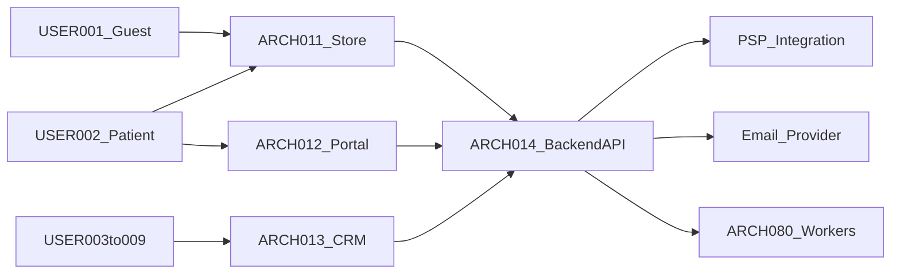
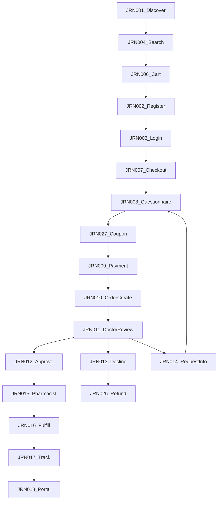
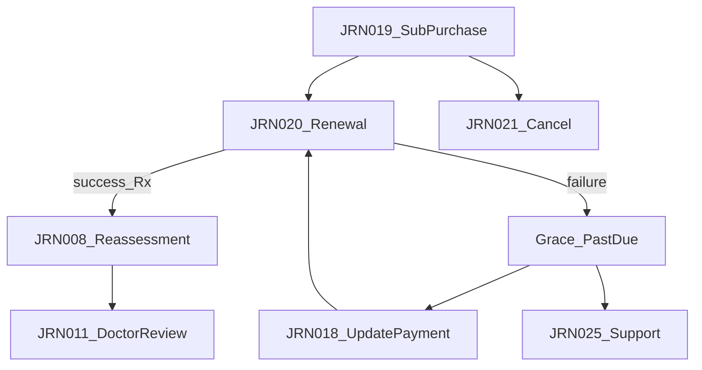
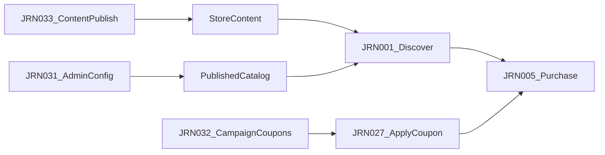
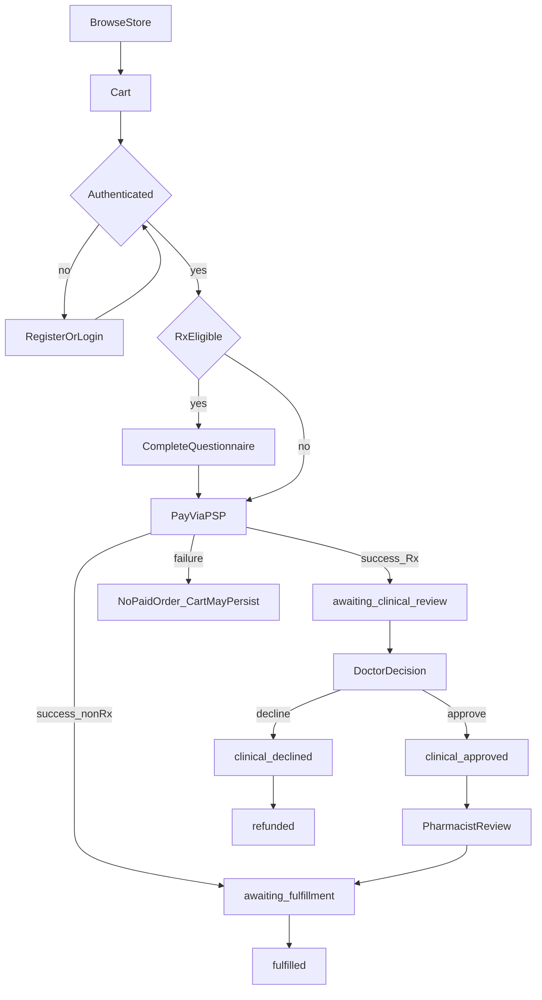
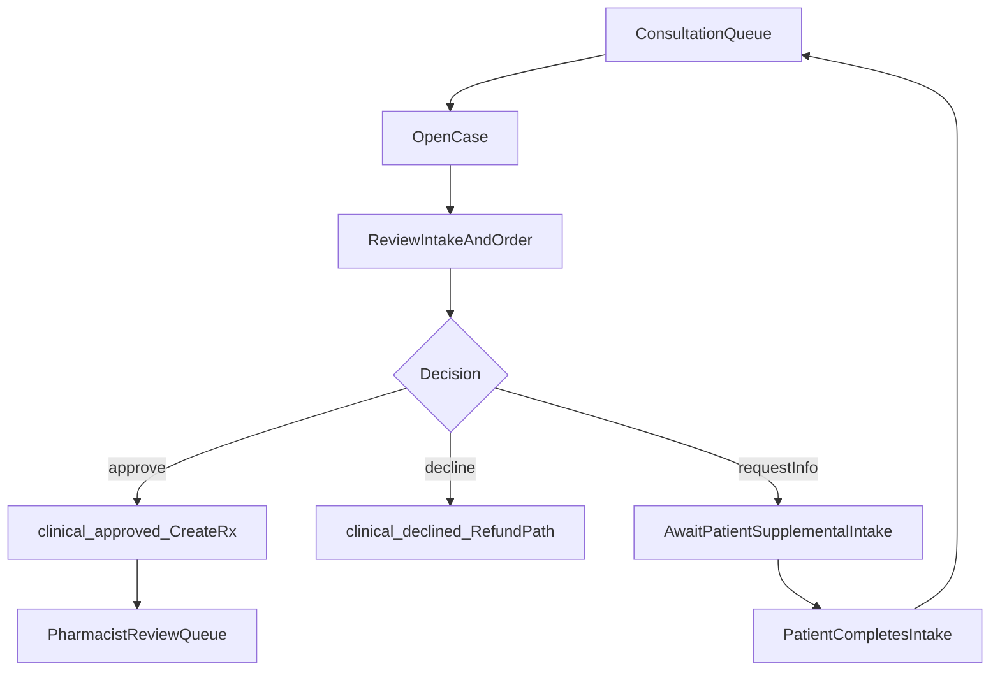
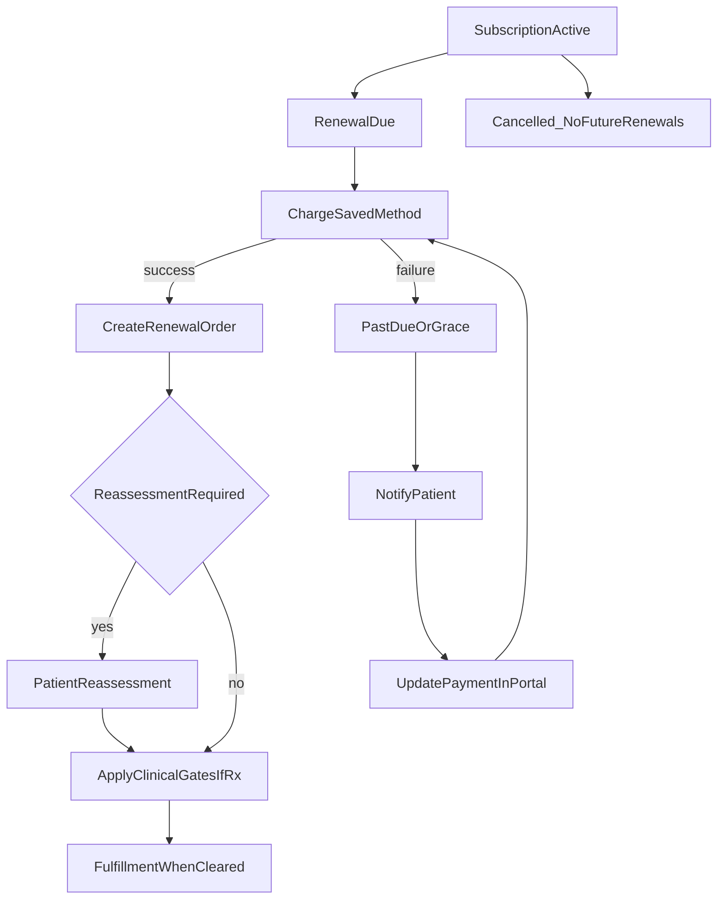
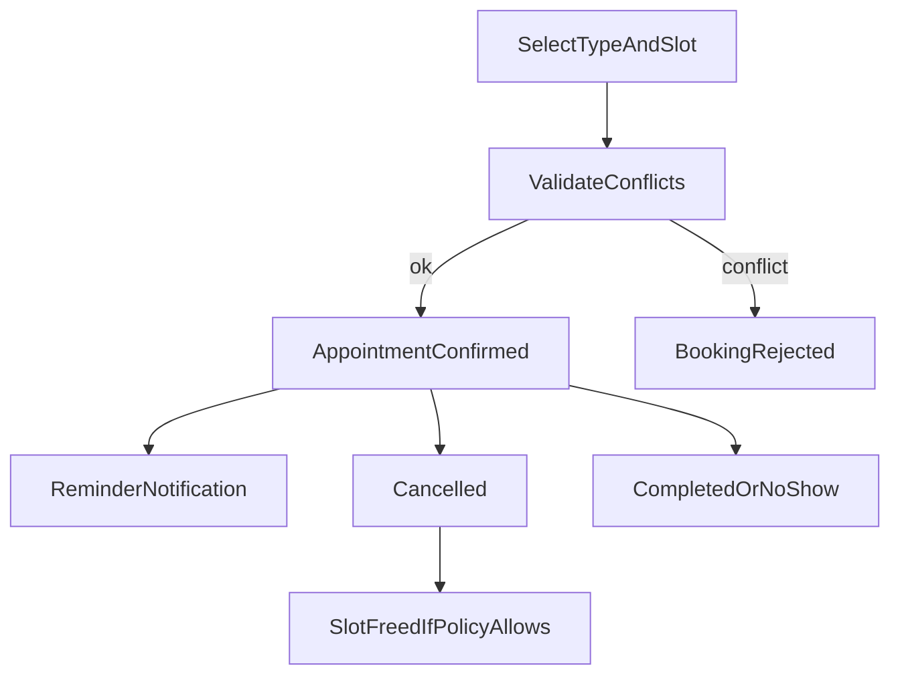
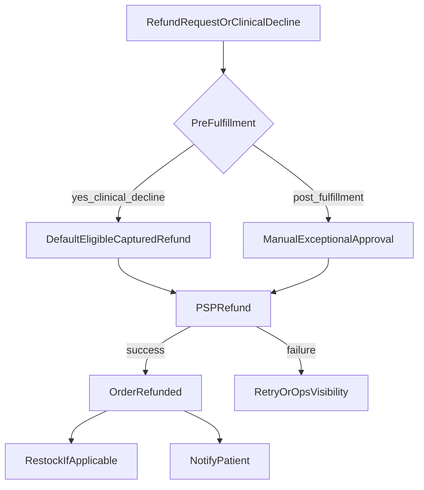
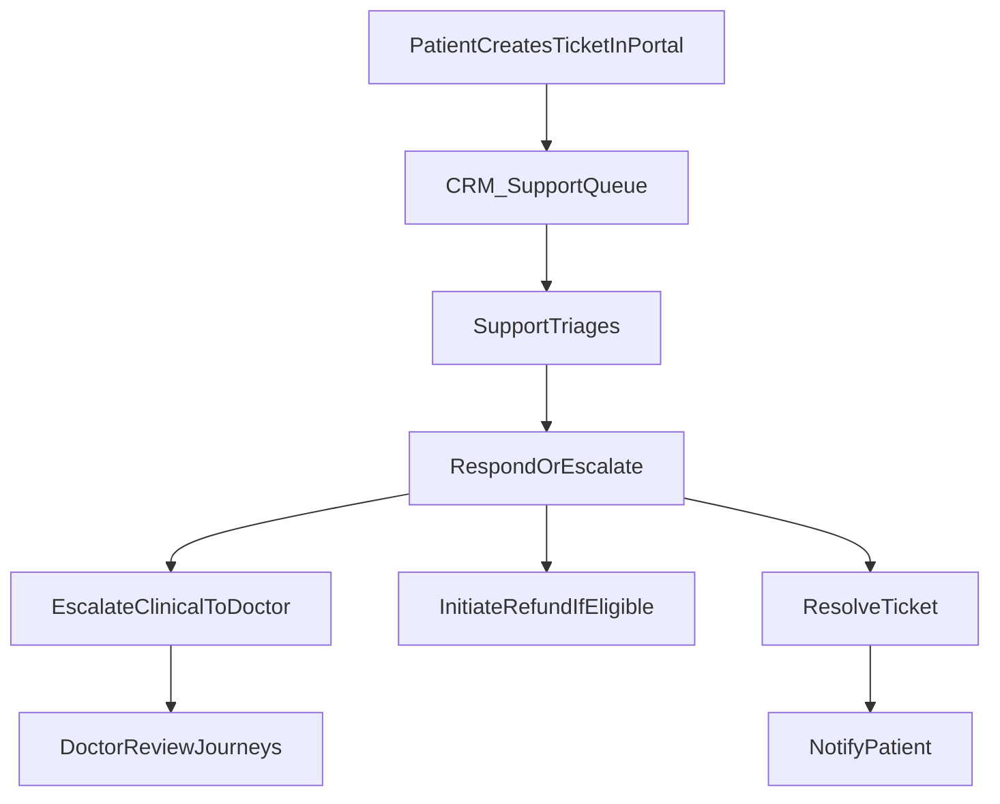

# 07 — User Journeys

| Field | Value |
| --- | --- |
| Document | User Journey Specification |
| Product | Clinexa |
| Version | 1.0 |
| Status | Draft for review |
| Primary market | United States |
| Audience | Product, UX/Design, Engineering, QA, Clinical Ops, Support, Marketing, Content, Operations, Administrators |
| Source of truth | [00 — Product Requirements Document](00-product-requirements-document.md) |
| Related docs | [01 — Project overview](01-project-overview.md), [02 — Business requirements](02-business-requirements.md), [03 — Functional requirements](03-functional-requirements.md), [04 — Non-functional requirements](04-non-functional-requirements.md), [05 — System architecture](05-system-architecture.md), [06 — User personas](06-user-personas.md), [08 — Role permissions](08-role-permissions.md), [14 — Notifications](14-notifications.md), [15 — Payment flow](15-payment-flow.md), [17 — Patient portal](17-patient-portal.md) |

This document is the **User Journey Specification** for Clinexa Version 1. It defines **how** personas move through end-to-end business workflows across Store, Patient Portal, CRM, and the Backend API—happy paths, alternatives, exceptions, notifications, and clinical/commerce gates.

It expands [PRD §9](00-product-requirements-document.md#9-primary-user-journeys) and [BRD BP-01–BP-11](02-business-requirements.md) using actors from [06 — User personas](06-user-personas.md), system behavior from [03 — Functional requirements](03-functional-requirements.md), and surface boundaries from [05 — System architecture](05-system-architecture.md).

It does **not** design screens or UI mockups, API endpoint catalogs, or database schemas. Those belong in [20](20-ui-design-system.md), [11](11-api-design.md), and [10](10-database-design.md).

> **Naming alignment:** Actors use `USER-001`–`USER-009` only. Canonical order states follow OR-08 / PRD §13.6. Password reset (BP-08) and returning-patient reorder (BP-02) are documented as alternate/exception flows under related journeys rather than separate `JRN` IDs. **JRN-032 Marketing campaign creation** is V1-scoped to coupons, marketing-safe analytics, and content coordination—not a paid-ads platform.

---

## Table of contents

1. [Introduction](#1-introduction)
2. [Journey Design Principles](#2-journey-design-principles)
3. [Journey Catalog](#3-journey-catalog)
12. [Journey Complexity Classification](#12-journey-complexity-classification)
13. [Journey SLA & Expected Duration](#13-journey-sla--expected-duration)
14. [Human vs System Responsibility Matrix](#14-human-vs-system-responsibility-matrix)
4. [Cross-Journey Dependencies](#4-cross-journey-dependencies)
5. [Journey State Diagrams](#5-journey-state-diagrams)
6. [User Journey Matrix](#6-user-journey-matrix)
7. [Notifications Throughout Journeys](#7-notifications-throughout-journeys)
8. [Failure Scenarios](#8-failure-scenarios)
9. [Accessibility During Journeys](#9-accessibility-during-journeys)
10. [Journey Traceability Matrix](#10-journey-traceability-matrix)
11. [Revision History](#11-revision-history)

---

## 1. Introduction

### 1.1 Purpose

Define production-grade, end-to-end user journeys so that:

- Product and UX share one scripted model of care-commerce workflows (discovery → clinical intake → payment → clinician review → fulfillment → portal self-service).
- Engineering and QA can derive acceptance scenarios from numbered steps, alternate paths, and exception flows without inventing business process.
- Clinical ops, support, and operations understand handoffs, gates, and notifications.
- Every journey remains traceable to personas (`USER-*`), business processes (`BP-*` / `OR-*` / `AC-BR-*`), functional modules (`FR-*`), and architecture components (`ARCH-*`).

### 1.2 Scope

#### In scope (V1)

| Area | Coverage |
| --- | --- |
| Surfaces | Store Web (ARCH-011), Patient Portal (ARCH-012), CRM (ARCH-013), Backend API (ARCH-014), workers, PSP, email |
| Journey catalog | JRN-001 through JRN-033 (discovery, auth, commerce, clinical, fulfillment, portal, subscriptions, appointments, support, content, admin) |
| Flow types | Main success scenarios, alternative flows, exception flows |
| Cross-cutting | Notifications map, failure scenarios, accessibility expectations, dependency chains, state diagrams |
| Traceability | Mapping to BO/BP/OR/AC-BR/KPI, FR modules, USER personas, ARCH components |

#### Out of scope

| Area | Deferred to |
| --- | --- |
| Screen layouts, wireframes, visual design | [20 — UI design system](20-ui-design-system.md) |
| API contracts and payloads | [11 — API design](11-api-design.md) |
| Database schemas | [10 — Database design](10-database-design.md) |
| Detailed RBAC matrices | [08 — Role permissions](08-role-permissions.md) |
| Notification template copy | [14 — Notifications](14-notifications.md) |
| Native mobile patient journeys | Future Mobile (PRD §7.6 / §11) |
| Live video telemedicine | Out of V1 (PRD §11); appointments are scheduling-only |
| Real-time clinician chat | Out of V1 (PRD §11) |

### 1.3 Audience

| Audience | How they use this document |
| --- | --- |
| Product managers | Validate end-to-end business coverage against PRD §9 and BO-1–BO-5 |
| UX researchers / designers | Frame interaction priorities and status transparency without treating this as UI spec |
| Engineers / QA | Implement and test gates, state transitions, and notifications per journey |
| Doctors / pharmacists / ops / support | Confirm handoffs and clinical/commerce duty separation |
| Marketing / content / administrators | Align campaign, publish, and configuration journeys with PHI boundaries |
| Architects | Verify client vs Backend API accountability for clinical and payment gates |

### 1.4 References

| Document | Relevance |
| --- | --- |
| [00 — Product Requirements Document](00-product-requirements-document.md) | Source of truth; journeys (§9), business rules (§13), surfaces (§7), a11y (§12.4) |
| [01 — Project overview](01-project-overview.md) | Care-commerce loop and design philosophy |
| [02 — Business requirements](02-business-requirements.md) | BO, BP, OR, KPI, AC-BR, RACI |
| [03 — Functional requirements](03-functional-requirements.md) | FR modules and acceptance behavior |
| [04 — Non-functional requirements](04-non-functional-requirements.md) | Accessibility NFR-091–096; reliability/fail-safe |
| [05 — System architecture](05-system-architecture.md) | ARCH surfaces and domain modules; failure handling |
| [06 — User personas](06-user-personas.md) | USER-001–USER-009 actors |
| [08 — Role permissions](08-role-permissions.md) | Enforceable RBAC (downstream) |
| [14 — Notifications](14-notifications.md) | Template and channel depth (downstream) |

### 1.5 ID conventions

| Prefix | Meaning | Example |
| --- | --- | --- |
| `JRN-###` | User journey in this document | `JRN-012` |
| `USER-###` | Persona from [06](06-user-personas.md) | `USER-003` |
| `BO-` / `BP-` / `OR-` / `KPI-` / `AC-BR-` | Business IDs from [02](02-business-requirements.md) | `BP-03`, `OR-04` |
| `FR-<MOD>-###` | Functional requirement from [03](03-functional-requirements.md) | `FR-CHK-002` |
| `ARCH-###` | Architecture component from [05](05-system-architecture.md) | `ARCH-047` |
| `NFR-###` | Non-functional requirement from [04](04-non-functional-requirements.md) | `NFR-091` |

### 1.6 Journey catalog index

| Journey ID | Journey name | Primary persona(s) | Primary surfaces |
| --- | --- | --- | --- |
| JRN-001 | Guest discovers products | USER-001 | Store |
| JRN-002 | Guest registration | USER-001 → USER-002 | Store, API |
| JRN-003 | Patient login | USER-002 | Store / Portal / CRM entry |
| JRN-004 | Product search | USER-001, USER-002 | Store |
| JRN-005 | Product purchase | USER-001 → USER-002 | Store, API |
| JRN-006 | Cart management | USER-001, USER-002 | Store |
| JRN-007 | Checkout | USER-002 | Store, API |
| JRN-008 | Questionnaire completion | USER-002 | Store / Portal path, API |
| JRN-009 | Payment | USER-002 | Store, API, PSP |
| JRN-010 | Order creation | System, USER-002 | API |
| JRN-011 | Doctor review | USER-003 | CRM |
| JRN-012 | Doctor approval | USER-003 | CRM |
| JRN-013 | Doctor rejection | USER-003 | CRM |
| JRN-014 | Request additional information | USER-003, USER-002 | CRM, Portal |
| JRN-015 | Pharmacist review | USER-004 | CRM |
| JRN-016 | Order fulfillment | USER-006 | CRM |
| JRN-017 | Shipment tracking | USER-002 | Portal |
| JRN-018 | Patient Portal usage | USER-002 | Portal |
| JRN-019 | Subscription purchase | USER-002 | Store, API |
| JRN-020 | Subscription renewal | System, USER-002 | API, Portal, CRM |
| JRN-021 | Subscription cancellation | USER-002 | Portal |
| JRN-022 | Appointment booking | USER-002 | Portal, CRM |
| JRN-023 | Appointment cancellation | USER-002 | Portal |
| JRN-024 | Document download | USER-002 | Portal |
| JRN-025 | Support ticket creation | USER-002 | Portal, CRM |
| JRN-026 | Refund request | USER-002, USER-005 | Portal, CRM, PSP |
| JRN-027 | Coupon application | USER-002 | Store |
| JRN-028 | Review submission | USER-002 | Portal / Store path, CRM |
| JRN-029 | Blog reading | USER-001, USER-002 | Store |
| JRN-030 | CMS content browsing | USER-001, USER-002 | Store |
| JRN-031 | Administrator configuration | USER-009 | CRM |
| JRN-032 | Marketing campaign creation | USER-007 | CRM |
| JRN-033 | Content publishing | USER-008 | CRM → Store |

---

## 2. Journey Design Principles

### 2.1 Happy paths

A **happy path** (main success scenario) is the primary sequence that achieves the journey business goal when preconditions hold, validations pass, and no clinical or payment gate blocks progress. Happy paths name the **surface** at each step (Store, Portal, CRM, Backend API, PSP, Worker) and end in measurable postconditions.

### 2.2 Alternate paths

**Alternate flows** are valid, expected variants that still achieve (or intentionally defer) the goal—for example non-Rx checkout skipping clinical states (OR-09), guest cart merge after sign-in (FR-CART-004), or password reset (BP-08) before login. Alternates must not bypass clinical or payment gates.

### 2.3 Exception flows

**Exception flows** handle failures and policy blocks: payment decline, invalid coupon, inventory unavailable, clinical decline, renewal charge failure, appointment conflict, notification delivery failure. Prefer **fail-safe** over inconsistent state (FR-CHK-004; ARCH failure handling): no unpaid “completed” order; no Rx fulfillment without doctor + pharmacist clearance.

### 2.4 Business rules

Journeys obey operational policies OR-01–OR-14 (BRD §4 / PRD §13):

| Theme | Rules | Journey impact |
| --- | --- | --- |
| Clinical intake | OR-01, OR-02 | Rx finalize blocked until valid versioned questionnaire |
| Clinical gates | OR-03, OR-04, OR-05 | Payment ≠ dispensing; doctor approve required; pharmacist review before Rx fulfillment |
| Isolation & duty separation | OR-06, OR-07 | Own-data only for patients; Marketing/Content no default clinical charts |
| Order lifecycle | OR-08, OR-09 | Canonical states visible; non-Rx may skip clinical states |
| Subscriptions | OR-10 | Charge, grace, cancel, reassessment hooks |
| Refunds | OR-11 | Decline pre-fulfillment default refund; post-fulfillment exceptional |
| Inventory | OR-12 | Reserve/decrement; prevent oversell per policy |
| Trust & config | OR-13, OR-14 | Review moderation; safe catalog/questionnaire publish |

### 2.5 Clinical safety

- Human clinicians remain accountable for prescribing decisions; the platform never auto-approves Rx from payment success (OR-03, OR-04).
- Doctor decisions (approve / decline / request info) are attributable with timestamp and actor identity (FR-CRM-002).
- Prescriptions are created/updated only after doctor approval (FR-CRM-003); pharmacist review is required before Rx fulfillment completion in V1 (OR-05, FR-CRM-004, FR-ORD-003).
- Store messaging must not imply payment equals clinical approval (FR-STO-006); Portal must show clinically pending and decline clearly (FR-PRT-003).

### 2.6 User experience goals

| Goal | Journey implication |
| --- | --- |
| Transparent care-commerce | Patients always know clinical pending vs fulfilled vs declined |
| Low-friction discovery | Guests can browse/search/cart before auth; auth required before checkout finalize |
| Recoverable commerce failures | Payment failure leaves cart usable; coupon invalidation fails closed |
| Continuity | Portal self-service for orders, Rx status, subscriptions, documents, tickets |
| Configurability | Admin/content journeys prove BO-5 without application deploys |

### 2.7 Accessibility considerations

| Surface / path | Expectation | NFR |
| --- | --- | --- |
| Store & Portal core journeys (browse, intake, checkout, self-service) | WCAG 2.2 Level AA alignment; 0 critical automated a11y blockers | NFR-091 |
| CRM primary clinical workflows | Keyboard operable; AA goal for queue/case/approve paths | NFR-092, NFR-093 |
| All core UI | Contrast AA; visible logical focus | NFR-094, NFR-095 |
| Critical forms & status | Labels, errors, live regions for intake/checkout/portal status | NFR-096 |

Detailed journey-group mapping is in [§9](#9-accessibility-during-journeys).

### 2.8 Architecture accountability

Clients orchestrate UX only. The Backend API is **accountable** for clinical and payment gate integrity (BRD RACI). Prescriptions are not a standalone ARCH module; behavior spans ARCH-049 Questionnaires, ARCH-047 Orders, ARCH-050 Doctors/CRM, ARCH-054 Documents, and ARCH-055 Notifications.

---

## 3. Journey Catalog

Each journey uses a fixed template: identity, goal, preconditions, trigger, main success scenario, alternatives, exceptions, business rules, notifications, system responses, postconditions, success metrics, and traceability links.

### 3.1 JRN-001 — Guest discovers products

| Field | Detail |
| --- | --- |
| **Journey ID** | JRN-001 |
| **Journey Name** | Guest discovers products |
| **Primary Persona** | USER-001 Guest Visitor |
| **Secondary Personas** | USER-002 Patient (if already authenticated browsing Store) |
| **Business Goal** | BO-1 — Convert discovery into care: enable guests to explore published catalog, categories, and trust signals before registration. |
| **Preconditions** | Store is available; published categories/products exist (demo: Weight Management, Hair Loss, Men's Health, Skincare); guest session or anonymous Store access permitted. |
| **Trigger** | Guest lands on Store from SEO, campaign, referral, or direct navigation. |

#### Main Success Scenario

1. Guest opens Store (ARCH-011) and views published home/category content rendered from Backend API published catalog.
2. Guest browses categories and product detail pages (pricing, Rx-eligibility indicators, media, moderated reviews if present).
3. Guest optionally reads related educational content (links to JRN-029/JRN-030) without providing PHI.
4. Guest adds interest to cart or proceeds toward purchase path (continues in JRN-005/JRN-006) or exits informed.

#### Alternative Flows

| Flow | Behavior |
| --- | --- |
| Authenticated patient browses | Same discovery path on Store; cart may already be patient-scoped. |
| SEO landing on category/product | Guest enters mid-funnel on a published SEO page with editable metadata (FR-STO-002). |
| Reviews unavailable | Store browse continues with graceful degradation (NFR-036); discovery still succeeds. |

#### Exception Flows

| Flow | Behavior |
| --- | --- |
| Unpublished product requested | API/Store returns not-found or non-public; guest cannot purchase unpublished catalog. |
| Store outage | Journey fails; no partial clinical intake created. |

#### Business Rules

- OR-07: discovery does not expose clinical questionnaire answers.
- FR-STO-001/003: published catalog only; no CRM access for guests.
- FR-STO-006: messaging must not imply payment = clinical approval.

#### Notifications Sent

| Event | Recipient | Channel |
| --- | --- | --- |
| None required for browse-only | — | — |

#### System Responses

- Expose only published catalog and moderated public reviews.
- No order or PHI artifacts created by browse alone.

#### Postconditions

- Guest has viewed relevant treatments.
- Optional cart staging may exist (JRN-006).
- No clinical gate started unless purchase path begins.

#### Success Metrics

Supports KPI funnel into KPI-01; AC-BR-06 demo catalog discoverable.

#### Traceability

| Dimension | References |
| --- | --- |
| Related Functional Requirements | FR-STO-001–006, FR-PRD-003, FR-CAT-003, FR-REV-002 (read), FR-SRCH-001 (optional) |
| Related Business Requirements | BO-1; BP-01 (discover); OR-07; AC-BR-06 |
| Related Personas | USER-001, USER-002 |
| Related Architecture Components | ARCH-011 Store; ARCH-042 Products; ARCH-043 Categories; ARCH-014 API; ARCH-019 CDN |

---

### 3.2 JRN-002 — Guest registration

| Field | Detail |
| --- | --- |
| **Journey ID** | JRN-002 |
| **Journey Name** | Guest registration |
| **Primary Persona** | USER-001 → USER-002 |
| **Secondary Personas** | System (AUTH) |
| **Business Goal** | BO-1 — Create authenticated patient identity so checkout finalize and clinical intake can proceed under OR-06 isolation. |
| **Preconditions** | Guest is on Store auth entry; email not already registered (or conflict handled); password policy available. |
| **Trigger** | Guest chooses Register from Store auth entry or is prompted during checkout finalize (FR-CHK-001). |

#### Main Success Scenario

1. Guest submits registration (email/password) via Store → Backend API (FR-AUTH-001).
2. API creates patient identity with patient role; no staff CRM access granted.
3. Guest becomes USER-002 Patient; session/token issued for Store/Portal.
4. Optional: cart preserve/merge from guest session (FR-CART-004).
5. Patient continues purchase path or enters Portal empty-state CTAs.

#### Alternative Flows

| Flow | Behavior |
| --- | --- |
| Register mid-checkout | Auth gate at finalize; after success, resume checkout/questionnaire. |
| Already registered | Guide to Patient login (JRN-003). |
| Password reset before first successful login | BP-08 alternate: request reset → time-limited email token → set password → sessions invalidated per security design → sign in. |

#### Exception Flows

| Flow | Behavior |
| --- | --- |
| Duplicate email | Registration rejected; no second patient identity for same email. |
| Weak password / validation failure | Account not created; guest remains unauthenticated. |
| Abuse / lockout signals | FR-AUTH-006 protections may block further attempts. |

#### Business Rules

- OR-06 patient isolation from creation.
- FR-AUTH-001/004/005 registration + RBAC + isolation.
- Staff accounts are not created via Store guest registration.

#### Notifications Sent

| Event | Recipient | Channel |
| --- | --- | --- |
| Registration welcome / account confirmation (if configured) | Patient | Email |
| Password reset email (alt flow) | Patient | Email |

#### System Responses

- Create patient user record; issue credentials.
- Deny CRM staff permissions.
- Merge/preserve cart per policy.

#### Postconditions

- Authenticated patient identity exists.
- Guest journey identity transition complete.
- Ready for JRN-003 continuity and JRN-007 finalize.

#### Success Metrics

AC-BR-01 registration step; KPI-08 isolation from day one.

#### Traceability

| Dimension | References |
| --- | --- |
| Related Functional Requirements | FR-AUTH-001, FR-AUTH-002, FR-AUTH-004–006, FR-CART-004, FR-STO-003 |
| Related Business Requirements | BO-1; BP-01; BP-08 (alt); OR-06; AC-BR-01, AC-BR-08 |
| Related Personas | USER-001, USER-002 |
| Related Architecture Components | ARCH-011; ARCH-040 Authentication; ARCH-041 Users; ARCH-044 Cart; ARCH-014 |

---

### 3.3 JRN-003 — Patient login

| Field | Detail |
| --- | --- |
| **Journey ID** | JRN-003 |
| **Journey Name** | Patient login |
| **Primary Persona** | USER-002 Patient |
| **Secondary Personas** | Staff personas when signing into CRM (USER-003–USER-009) using same identity system with role separation |
| **Business Goal** | Establish authenticated session for Store/Portal (patients) or CRM (staff) with server-side RBAC. |
| **Preconditions** | Account exists; credentials known or recoverable via BP-08 reset. |
| **Trigger** | User submits sign-in from Store, Portal, or CRM entry. |

#### Main Success Scenario

1. User submits email/password to Backend API (FR-AUTH-002).
2. API authenticates and issues session/token scoped by role.
3. Patient lands on Store authenticated context or Portal dashboard; staff land in CRM role-scoped home.
4. Patient isolation and RBAC enforced on subsequent reads/writes.

#### Alternative Flows

| Flow | Behavior |
| --- | --- |
| Password reset (BP-08) | Request reset → email time-limited token → set new password → invalidate active sessions → sign in with new credentials. |
| Post-login cart merge | Guest cart merged into patient cart (FR-CART-004). |
| Deep link after login | Return to intended checkout, questionnaire, or Portal resource if authorized. |

#### Exception Flows

| Flow | Behavior |
| --- | --- |
| Invalid credentials | No session; generic failure messaging (no account enumeration beyond policy). |
| Account lockout | FR-AUTH-006 blocks further attempts temporarily. |
| Cross-patient deep link | Denied (FR-AUTH-005 / FR-PRT-002). |

#### Business Rules

- OR-06 isolation.
- FR-AUTH-002/004/005/006.
- Patients never receive CRM staff capabilities via Portal/Store login.

#### Notifications Sent

| Event | Recipient | Channel |
| --- | --- | --- |
| Password reset email (alt) | User | Email |
| Security-sensitive login notices if configured | User | Email |

#### System Responses

- Issue credentials; enforce RBAC.
- Invalidate sessions on password reset.

#### Postconditions

- Authenticated session active.
- User can proceed to role-appropriate journeys.

#### Success Metrics

AC-BR-08; KPI-08; portal login success supports KPI-06.

#### Traceability

| Dimension | References |
| --- | --- |
| Related Functional Requirements | FR-AUTH-002–006, FR-PRT-001–002, FR-CRM-001 |
| Related Business Requirements | BP-02, BP-08; OR-06; AC-BR-08 |
| Related Personas | USER-002 (primary); USER-003–USER-009 for CRM sign-in |
| Related Architecture Components | ARCH-011/012/013 entry; ARCH-040; ARCH-014 |

---

### 3.4 JRN-004 — Product search

| Field | Detail |
| --- | --- |
| **Journey ID** | JRN-004 |
| **Journey Name** | Product search |
| **Primary Persona** | USER-001 Guest Visitor / USER-002 Patient |
| **Secondary Personas** | — |
| **Business Goal** | BO-1 — Help users find published products and content quickly without exposing PHI. |
| **Preconditions** | Search index/query path available for published Store entities. |
| **Trigger** | User enters a search query on Store. |

#### Main Success Scenario

1. User submits search on Store.
2. Backend API returns published products/content matching query (FR-SRCH-001).
3. User opens a result and continues discovery (JRN-001) or purchase (JRN-005).

#### Alternative Flows

| Flow | Behavior |
| --- | --- |
| Empty results | Clear empty state; user browses categories instead. |
| Content-only hits | Blog/CMS results lead to JRN-029/JRN-030. |

#### Exception Flows

| Flow | Behavior |
| --- | --- |
| Search dependency degraded | Graceful degradation; browse still available where possible. |
| Attempt to search other patients' PHI | Not applicable on Store; CRM search separately RBAC-filtered (FR-SRCH-002/003). |

#### Business Rules

- FR-SRCH-001 published-only Store search.
- FR-SRCH-003 no cross-patient PHI in patient-facing search.

#### Notifications Sent

| Event | Recipient | Channel |
| --- | --- | --- |
| None | — | — |

#### System Responses

- Return authorized published results only.

#### Postconditions

- User has navigated to a relevant product or content page, or empty-state exit.

#### Success Metrics

Supports conversion funnel into KPI-01 / BO-1.

#### Traceability

| Dimension | References |
| --- | --- |
| Related Functional Requirements | FR-SRCH-001, FR-SRCH-003, FR-STO-001 |
| Related Business Requirements | BO-1; BP-01 |
| Related Personas | USER-001, USER-002 |
| Related Architecture Components | ARCH-011; search hooks via ARCH-014; ARCH-042/043/060/061 |

---

### 3.5 JRN-005 — Product purchase

| Field | Detail |
| --- | --- |
| **Journey ID** | JRN-005 |
| **Journey Name** | Product purchase |
| **Primary Persona** | USER-002 Patient (after auth); USER-001 may start |
| **Secondary Personas** | USER-003 Doctor, USER-004 Pharmacist, USER-006 Ops (downstream) |
| **Business Goal** | BO-1 — Move from product selection through clinically governed purchase for Rx-eligible items (or non-Rx path per OR-09). |
| **Preconditions** | Published product available; pricing valid; for Rx: questionnaire bound (OR-01). |
| **Trigger** | User selects a product and starts purchase / add-to-cart toward checkout. |

#### Main Success Scenario

1. User selects product/variant on Store (JRN-001/JRN-004).
2. User manages cart (JRN-006) and proceeds to checkout (JRN-007).
3. If guest: register/sign-in (JRN-002/JRN-003) before finalize.
4. If Rx-eligible: complete questionnaire (JRN-008).
5. Optional coupon (JRN-027); payment (JRN-009); order creation (JRN-010) → clinically pending for Rx.
6. Patient tracks status in Portal (JRN-017/JRN-018).

#### Alternative Flows

| Flow | Behavior |
| --- | --- |
| Non-Rx purchase (OR-09 / AC-BR-07) | Skip clinical review states after payment; move to awaiting_fulfillment. |
| Returning patient reorder (BP-02) | Authenticated patient reorders from Store/Portal; reassessment questionnaire if configured. |
| Subscription-capable product | Continues as JRN-019 after payment success. |

#### Exception Flows

| Flow | Behavior |
| --- | --- |
| Incomplete questionnaire | Finalize blocked (FR-CHK-002). |
| Payment failure | Fail-safe; no inconsistent paid order (FR-CHK-004). |
| Product unpublished mid-flow | Revalidation fails at submit (FR-CHK-003). |

#### Business Rules

- OR-01–OR-05 for Rx path.
- OR-09 non-Rx skip.
- OR-08 lifecycle visibility.
- FR-STO-006 payment ≠ clinical approval messaging.

#### Notifications Sent

| Event | Recipient | Channel |
| --- | --- | --- |
| Order confirmation / pending clinical review | Patient | Email |
| Payment success | Patient | Email |

#### System Responses

- Orchestrate cart → checkout → QST → pay → order states via API.
- Rx → awaiting_clinical_review; Non-Rx → awaiting_fulfillment.

#### Postconditions

- Order exists in correct canonical state.
- Patient can see status in Portal.
- Clinical queue populated for Rx.

#### Success Metrics

AC-BR-01, AC-BR-07; KPI-01; KPI-03 start clock.

#### Traceability

| Dimension | References |
| --- | --- |
| Related Functional Requirements | FR-STO-004, FR-CART-*, FR-CHK-001–005, FR-QST-003, FR-PAY-001, FR-ORD-001–005 |
| Related Business Requirements | BO-1; BP-01, BP-02; OR-01–OR-05, OR-08, OR-09; AC-BR-01, AC-BR-07 |
| Related Personas | USER-001, USER-002 (primary); downstream USER-003, USER-004, USER-006 |
| Related Architecture Components | ARCH-011, ARCH-044–047, ARCH-049, ARCH-046, ARCH-014 |

---

### 3.6 JRN-006 — Cart management

| Field | Detail |
| --- | --- |
| **Journey ID** | JRN-006 |
| **Journey Name** | Cart management |
| **Primary Persona** | USER-001 / USER-002 |
| **Secondary Personas** | — |
| **Business Goal** | Stage line items and optional coupon code before checkout without creating a paid order. |
| **Preconditions** | Published products available; Store cart module reachable. |
| **Trigger** | User adds, updates, or removes cart line items. |

#### Main Success Scenario

1. User adds product/variant to cart (FR-CART-001).
2. API validates lines against published catalog (FR-CART-002).
3. User updates quantities or removes lines.
4. Optional: stage coupon code for later checkout validation (FR-CART-003).
5. User proceeds to checkout (JRN-007) or continues browsing.

#### Alternative Flows

| Flow | Behavior |
| --- | --- |
| Guest → patient auth | Preserve/merge cart (FR-CART-004). |
| Coupon staged but not validated until checkout | Final validation at submit (FR-CHK-003 / JRN-027). |

#### Exception Flows

| Flow | Behavior |
| --- | --- |
| Unpublished/invalid SKU in cart | Line rejected or removed on validation. |
| Empty cart checkout attempt | Blocked at checkout. |

#### Business Rules

- FR-CART-001–004.
- Cart is not payment authority; no order create from cart alone.

#### Notifications Sent

| Event | Recipient | Channel |
| --- | --- | --- |
| None typical | — | — |

#### System Responses

- Maintain cart state; validate catalog publish state.
- No clinical questionnaire forced until Rx checkout path.

#### Postconditions

- Cart reflects intended purchase set.
- Ready for JRN-007.

#### Success Metrics

Supports BO-1 conversion; reduces dead-end carts (persona pain). 

#### Traceability

| Dimension | References |
| --- | --- |
| Related Functional Requirements | FR-CART-001–004, FR-PRD-003, FR-CPN (staging) |
| Related Business Requirements | BO-1; BP-01 |
| Related Personas | USER-001, USER-002 |
| Related Architecture Components | ARCH-011; ARCH-044 Cart; ARCH-014 |

---

### 3.7 JRN-007 — Checkout

| Field | Detail |
| --- | --- |
| **Journey ID** | JRN-007 |
| **Journey Name** | Checkout |
| **Primary Persona** | USER-002 Patient |
| **Secondary Personas** | USER-001 (prompted to auth) |
| **Business Goal** | BO-1 — Finalize purchase intent with auth, clinical intake gate, price/coupon revalidation, and fail-safe payment handoff. |
| **Preconditions** | Non-empty cart; patient authenticated before finalize (FR-CHK-001); for Rx: questionnaire completable. |
| **Trigger** | Patient starts checkout finalize from Store cart. |

#### Main Success Scenario

1. Patient opens checkout; if guest, prompted to register/sign-in (JRN-002/JRN-003).
2. For Rx-eligible lines: ensure completed valid questionnaire (JRN-008 / FR-CHK-002).
3. Optional coupon application revalidated server-side (JRN-027 / FR-CHK-003).
4. Patient confirms shipping/billing details as modeled and submits payment (JRN-009).
5. On payment success, order created (JRN-010) in correct clinical/fulfillment state (FR-CHK-005).

#### Alternative Flows

| Flow | Behavior |
| --- | --- |
| Non-Rx checkout | Skip QST requirement; after pay → awaiting_fulfillment (OR-09). |
| Save payment method for subscription | Tokenized method retained via PSP for JRN-019/JRN-020. |

#### Exception Flows

| Flow | Behavior |
| --- | --- |
| Unauthenticated finalize | Blocked (FR-CHK-001). |
| Missing/invalid questionnaire | Blocked (FR-CHK-002 / OR-01). |
| Coupon/price/catalog invalid at submit | Fail closed; no order (FR-CHK-003). |
| Payment decline | Fail-safe; no unpaid completed order (FR-CHK-004). |

#### Business Rules

- OR-01, OR-03, OR-08, OR-09.
- FR-CHK-001–005.
- FR-STO-006 messaging.

#### Notifications Sent

| Event | Recipient | Channel |
| --- | --- | --- |
| Order confirmation / clinical pending | Patient | Email |
| Payment failure notice (exc) | Patient | Email |

#### System Responses

- Revalidate all gates server-side.
- Create order only after payment rules succeed.

#### Postconditions

- Draft/payment_pending resolved to paid clinical or fulfillment state.
- Cart cleared or updated per policy.

#### Success Metrics

AC-BR-01; KPI-01 (Rx checkout starts).

#### Traceability

| Dimension | References |
| --- | --- |
| Related Functional Requirements | FR-CHK-001–005, FR-AUTH-001–002, FR-QST-003, FR-PAY-001, FR-ORD-001 |
| Related Business Requirements | BO-1; BP-01; OR-01, OR-03, OR-08, OR-09; AC-BR-01, AC-BR-07 |
| Related Personas | USER-002, USER-001 |
| Related Architecture Components | ARCH-011; ARCH-045 Checkout; ARCH-046; ARCH-049; ARCH-014 |

---

### 3.8 JRN-008 — Questionnaire completion

| Field | Detail |
| --- | --- |
| **Journey ID** | JRN-008 |
| **Journey Name** | Questionnaire completion |
| **Primary Persona** | USER-002 Patient |
| **Secondary Personas** | USER-003 Doctor (consumer of responses) |
| **Business Goal** | BO-1 / BO-2 — Capture versioned clinical intake required before Rx-eligible order finalize (OR-01, OR-02). |
| **Preconditions** | Patient authenticated; Rx-eligible product/plan bound to questionnaire definition; definition published/active. |
| **Trigger** | Patient enters intake on Rx purchase path (or reassessment when configured for renewal/reorder). |

#### Main Success Scenario

1. Patient opens bound questionnaire for product/treatment/consultation workflow (FR-QST-002).
2. Patient answers required questions (branching as supported in V1 — FR-QST-006 Could).
3. Patient submits; API stores responses referencing definition version (FR-QST-004 / OR-02).
4. Checkout finalize becomes eligible for Rx path (FR-QST-003 / FR-CHK-002).
5. Authorized clinicians can later review responses in consult context (FR-QST-005); patient sees submission status in Portal.

#### Alternative Flows

| Flow | Behavior |
| --- | --- |
| Save and resume | Partial progress retained per design until submit/expiry rules. |
| Reassessment for renewal/reorder (BP-02/BP-06) | New or updated intake when configuration requires. |
| Doctor requested additional information (JRN-014) | Patient completes supplemental intake; case returns to review queue. |

#### Exception Flows

| Flow | Behavior |
| --- | --- |
| Questionnaire expired / definition superseded unsafely | Finalize blocked until valid completion against required version policy. |
| Submit with missing required answers | Rejected; patient corrects. |
| Unauthorized access to another patient's responses | Denied (OR-06). |

#### Business Rules

- OR-01, OR-02.
- Non-Rx may omit unless optionally configured (OR-09).
- Marketing/Content no default access to full answers (OR-07).

#### Notifications Sent

| Event | Recipient | Channel |
| --- | --- | --- |
| Questionnaire reminder (if incomplete / configured) | Patient | Email |
| Additional info requested (from JRN-014) | Patient | Email |

#### System Responses

- Persist versioned intake artifact.
- Link to future order/consultation.
- Gate checkout finalize for Rx.

#### Postconditions

- Valid questionnaire completion recorded.
- Rx checkout may proceed to payment.
- Clinician-ready artifact available.

#### Success Metrics

KPI-01 questionnaire completion rate; AC-BR-01.

#### Traceability

| Dimension | References |
| --- | --- |
| Related Functional Requirements | FR-QST-001–006, FR-CHK-002, FR-CRM-002 (downstream) |
| Related Business Requirements | BO-1, BO-2; BP-01, BP-02, BP-06; OR-01, OR-02, OR-07, OR-09; AC-BR-01 |
| Related Personas | USER-002, USER-003 |
| Related Architecture Components | ARCH-049 Questionnaires; ARCH-011/012; ARCH-050; ARCH-014 |

---

### 3.9 JRN-009 — Payment

| Field | Detail |
| --- | --- |
| **Journey ID** | JRN-009 |
| **Journey Name** | Payment |
| **Primary Persona** | USER-002 Patient |
| **Secondary Personas** | System, PSP; Support on failures (USER-005) |
| **Business Goal** | Capture/authorize payment via PSP without storing raw PAN; drive order/subscription state safely (OR-03). |
| **Preconditions** | Checkout ready; patient authenticated; clinical intake satisfied if Rx; amounts revalidated. |
| **Trigger** | Patient submits payment on Store checkout (or system charges saved method on renewal — JRN-020). |

#### Main Success Scenario

1. Patient pays via PSP tokenization (FR-PAY-001); platform does not store raw card PAN.
2. API awaits authorization/capture outcome and handles webhooks idempotently (FR-PAY-002).
3. On success, proceed to order creation (JRN-010) / subscription activation (JRN-019).
4. Patient notified of payment success (FR-PAY-005).

#### Alternative Flows

| Flow | Behavior |
| --- | --- |
| Saved payment method | Used for subscriptions renewals (FR-PAY-004). |
| Coupon-adjusted amount | Charge captured amount only (OR-11 coupon-adjusted refunds later). |

#### Exception Flows

| Flow | Behavior |
| --- | --- |
| Payment declined / PSP error | Fail-safe: no unpaid completed order; cart may persist; patient notified. |
| Webhook duplicate/delay | Idempotent handling; reconciliation without double orders. |
| Partial capture anomalies | Ops/support investigate; do not clear clinical gates from money alone. |

#### Business Rules

- OR-03 payment is not dispensing authority.
- FR-PAY-001–005.
- NFR fail-safe checkout.

#### Notifications Sent

| Event | Recipient | Channel |
| --- | --- | --- |
| Payment success | Patient | Email |
| Payment failure | Patient | Email |

#### System Responses

- Tokenize via PSP; update payment state; emit domain events.
- Never treat success as Rx approval.

#### Postconditions

- Payment outcome recorded.
- Order/subscription state transition eligible.
- No PAN at rest in Clinexa.

#### Success Metrics

AC-BR-09; supports KPI-04 renewals.

#### Traceability

| Dimension | References |
| --- | --- |
| Related Functional Requirements | FR-PAY-001–005, FR-CHK-004, FR-ORD-001 |
| Related Business Requirements | BO-1, BO-3; BP-01, BP-06; OR-03, OR-10, OR-11; AC-BR-09 |
| Related Personas | USER-002, USER-005 |
| Related Architecture Components | ARCH-046 Payments; ARCH-045; ARCH-014; PSP integration; ARCH-080 workers |

---

### 3.10 JRN-010 — Order creation

| Field | Detail |
| --- | --- |
| **Journey ID** | JRN-010 |
| **Journey Name** | Order creation |
| **Primary Persona** | System (API); USER-002 informed |
| **Secondary Personas** | USER-003 (queue), USER-006 (ops visibility) |
| **Business Goal** | Create durable order with line items, amounts, discounts, patient identity, and clinical prerequisite status in canonical OR-08 state. |
| **Preconditions** | Payment authorization/capture rules succeeded; patient identity known; clinical prerequisites evaluated. |
| **Trigger** | Successful payment path completes checkout (or renewal charge creates renewal order). |

#### Main Success Scenario

1. Backend API creates order with line items, totals, discounts, patient identity, clinical prerequisite status (FR-ORD-001).
2. Rx-eligible: state `awaiting_clinical_review` (FR-CHK-005 / FR-ORD-002).
3. Non-Rx: state `awaiting_fulfillment` (FR-ORD-004 / OR-09).
4. Domain events enqueue patient notification and CRM queue visibility.
5. Patient can view order in Portal (FR-ORD-005 / FR-PRT-003).

#### Alternative Flows

| Flow | Behavior |
| --- | --- |
| Renewal order | Created on subscription renewal success; reassessment/clinical gates evaluated (FR-SUB-005). |
| Multi-line mixed Rx/non-Rx | Apply strictest clinical gating per platform policy for Rx lines (fulfillment blocked until Rx rules clear). |

#### Exception Flows

| Flow | Behavior |
| --- | --- |
| Payment success without durable order | Reconciliation worker / fail-safe design; ops visibility (ARCH failure handling). |
| Illegal state transition attempt | Rejected (FR-ORD-002). |

#### Business Rules

- OR-08 lifecycle.
- OR-03/04/05 gates for Rx.
- OR-09 non-Rx skip.

#### Notifications Sent

| Event | Recipient | Channel |
| --- | --- | --- |
| Order confirmation / clinically pending | Patient | Email |

#### System Responses

- Persist order; set canonical state; publish events.
- Populate doctor consultation queue for Rx.

#### Postconditions

- Order visible to patient and authorized staff.
- Rx awaiting clinical review OR non-Rx awaiting fulfillment.

#### Success Metrics

AC-BR-01; KPI-02/KPI-03 timers start for Rx.

#### Traceability

| Dimension | References |
| --- | --- |
| Related Functional Requirements | FR-ORD-001–006, FR-CHK-005, FR-NTF-001–002 |
| Related Business Requirements | BO-1, BO-2; BP-01; OR-08, OR-09; AC-BR-01, AC-BR-07 |
| Related Personas | USER-002, USER-003, USER-006 |
| Related Architecture Components | ARCH-047 Orders; ARCH-014; ARCH-055; ARCH-013 visibility |

---

### 3.11 JRN-011 — Doctor review

| Field | Detail |
| --- | --- |
| **Journey ID** | JRN-011 |
| **Journey Name** | Doctor review |
| **Primary Persona** | USER-003 Doctor |
| **Secondary Personas** | USER-002 Patient (informed) |
| **Business Goal** | BO-2 — Scale clinical throughput: doctor opens consultation queue and evaluates intake + order context before decision. |
| **Preconditions** | Rx order in `awaiting_clinical_review`; questionnaire responses available; doctor has CRM clinical role (FR-CRM-001). |
| **Trigger** | Doctor opens consultation queue / case in CRM. |

#### Main Success Scenario

1. Doctor signs into CRM (JRN-003 staff path) and opens consultation queue (FR-CRM-002).
2. Doctor reviews versioned questionnaire responses, patient history available in platform, and order context.
3. Doctor proceeds to approve (JRN-012), decline (JRN-013), or request additional information (JRN-014).
4. All views/actions are role-scoped and attributable (OR-06).

#### Alternative Flows

| Flow | Behavior |
| --- | --- |
| Reassessment case from renewal | Same review path when subscription reassessment creates clinical pending. |
| Pharmacy/ops notes present | Doctor considers fulfillment context without transferring prescribing authority. |

#### Exception Flows

| Flow | Behavior |
| --- | --- |
| Incomplete intake | Doctor requests additional information (JRN-014) rather than unsafe approve. |
| Unauthorized role | Access denied (FR-CRM-001/006). |
| Queue backlog | SLA risk (KPI-02); does not auto-approve. |

#### Business Rules

- OR-02–OR-04.
- OR-03 payment is not approval.
- FR-CRM-002 audit trail required for decisions.

#### Notifications Sent

| Event | Recipient | Channel |
| --- | --- | --- |
| None until decision journey | — | — |

#### System Responses

- Present clinical context; enforce RBAC.
- Do not create prescription until approve.

#### Postconditions

- Doctor has sufficient context to decide, or has requested more info.
- Order remains awaiting clinical review until decision.

#### Success Metrics

KPI-02 doctor review turnaround; AC-BR-02.

#### Traceability

| Dimension | References |
| --- | --- |
| Related Functional Requirements | FR-CRM-001–002, FR-QST-005, FR-ORD-002–003, FR-ORD-005 |
| Related Business Requirements | BO-2; BP-03; OR-02–OR-04, OR-06; AC-BR-02 |
| Related Personas | USER-003, USER-002 |
| Related Architecture Components | ARCH-013 CRM; ARCH-050 Doctors; ARCH-049; ARCH-047; ARCH-014 |

---

### 3.12 JRN-012 — Doctor approval

| Field | Detail |
| --- | --- |
| **Journey ID** | JRN-012 |
| **Journey Name** | Doctor approval |
| **Primary Persona** | USER-003 Doctor |
| **Secondary Personas** | USER-004 Pharmacist, USER-002 Patient |
| **Business Goal** | BO-2 — Approve clinically appropriate Rx-eligible case; create/update prescription; advance order toward pharmacy readiness (OR-04). |
| **Preconditions** | Case in clinical review with adequate intake; doctor authenticated in CRM. |
| **Trigger** | Doctor records Approve decision with required rationale fields as configured. |

#### Main Success Scenario

1. Doctor selects Approve and documents clinical rationale (FR-CRM-002).
2. API transitions order to `clinical_approved` (FR-ORD-002).
3. Prescription record created/updated linked to patient, questionnaire, order/treatment (FR-CRM-003).
4. Case becomes eligible for pharmacist review (JRN-015).
5. Patient notified of clinical approval / Rx status update (status-appropriate).

#### Alternative Flows

| Flow | Behavior |
| --- | --- |
| Approval with conditions noted | Documented in clinical notes; still requires pharmacist review before fulfillment. |

#### Exception Flows

| Flow | Behavior |
| --- | --- |
| Approve attempted without permission | Rejected by RBAC. |
| Approve after already declined | Illegal transition rejected. |

#### Business Rules

- OR-04 prescriptions only via doctor approval.
- OR-03 payment alone insufficient.
- OR-05 pharmacist still required before Rx fulfillment completion.

#### Notifications Sent

| Event | Recipient | Channel |
| --- | --- | --- |
| Doctor decision — approved / Rx status update | Patient | Email |

#### System Responses

- Audit actor+timestamp.
- Create/update Rx.
- State → clinical_approved.
- Enqueue pharmacy review.

#### Postconditions

- Prescription exists.
- Order clinical_approved.
- Fulfillment still blocked until pharmacy review + inventory rules.

#### Success Metrics

AC-BR-02, AC-BR-03; KPI-02 decision latency; KPI-03.

#### Traceability

| Dimension | References |
| --- | --- |
| Related Functional Requirements | FR-CRM-002–004, FR-ORD-002–003, FR-NTF-001 |
| Related Business Requirements | BO-2; BP-03, BP-04; OR-03–OR-05; AC-BR-02 |
| Related Personas | USER-003, USER-004, USER-002 |
| Related Architecture Components | ARCH-013; ARCH-050; ARCH-047; ARCH-054 Documents (Rx artifacts); ARCH-055 |

---

### 3.13 JRN-013 — Doctor rejection

| Field | Detail |
| --- | --- |
| **Journey ID** | JRN-013 |
| **Journey Name** | Doctor rejection |
| **Primary Persona** | USER-003 Doctor |
| **Secondary Personas** | USER-002 Patient, USER-005 Support (refund path) |
| **Business Goal** | BO-2 / safety — Decline unsafe or inappropriate cases; stop fulfillment; trigger refund path per OR-11 (AC-BR-10). |
| **Preconditions** | Order in `awaiting_clinical_review` (pre-fulfillment). |
| **Trigger** | Doctor records Decline decision with rationale. |

#### Main Success Scenario

1. Doctor selects Decline and documents rationale (FR-CRM-002).
2. API sets order to `clinical_declined` (FR-ORD-002).
3. No dispensable prescription is created for fulfillment.
4. Default V1 pre-fulfillment: refund eligible captured amounts (OR-11 / FR-ORD-006 / FR-PAY-003).
5. Patient notified of decline and refund path; Portal shows decline clearly (FR-PRT-003).

#### Alternative Flows

| Flow | Behavior |
| --- | --- |
| Decline after partial workflow | Still blocks fulfillment; refund tier depends on fulfillment state (OR-11). |
| Support assists patient questions | Support cannot reverse clinical decision; may explain status and refund. |

#### Exception Flows

| Flow | Behavior |
| --- | --- |
| Refund PSP failure | Order remains declined; refund retry/ops visibility; patient notified of delay (see §8). |
| Attempt to fulfill declined order | Rejected (FR-ORD-003). |

#### Business Rules

- OR-04, OR-08, OR-11.
- AC-BR-10 clinical decline refund path.
- Support never approves Rx (duty separation).

#### Notifications Sent

| Event | Recipient | Channel |
| --- | --- | --- |
| Doctor decision — declined | Patient | Email |
| Refund processed (when succeeds) | Patient | Email |

#### System Responses

- State → clinical_declined.
- Block fulfillment.
- Initiate eligible refund.
- Audit decision.

#### Postconditions

- Order clinically declined; not fulfillable.
- Refund initiated or queued per policy.
- Patient informed.

#### Success Metrics

AC-BR-02, AC-BR-10; safety over conversion.

#### Traceability

| Dimension | References |
| --- | --- |
| Related Functional Requirements | FR-CRM-002, FR-ORD-002–003, FR-ORD-006, FR-PAY-003, FR-PRT-003, FR-NTF-001 |
| Related Business Requirements | BO-2, BO-4; BP-03, BP-09; OR-04, OR-08, OR-11; AC-BR-02, AC-BR-10 |
| Related Personas | USER-003, USER-002, USER-005 |
| Related Architecture Components | ARCH-013; ARCH-047; ARCH-046; ARCH-055; ARCH-059 Support |

---

### 3.14 JRN-014 — Request additional information

| Field | Detail |
| --- | --- |
| **Journey ID** | JRN-014 |
| **Journey Name** | Request additional information |
| **Primary Persona** | USER-003 Doctor |
| **Secondary Personas** | USER-002 Patient |
| **Business Goal** | Obtain complete clinical intake before approve/decline; avoid unsafe decisions on incomplete questionnaires. |
| **Preconditions** | Order in clinical review; intake incomplete or insufficient per doctor judgment / workflow config. |
| **Trigger** | Doctor selects Request additional information. |

#### Main Success Scenario

1. Doctor requests more information with guidance (FR-CRM-002 alt flow).
2. Patient notified to complete supplemental intake (Portal/Store questionnaire path).
3. Patient completes additional questionnaire responses (JRN-008 alt).
4. Case returns to doctor review queue (JRN-011) for approve/decline.
5. Order remains clinically pending (not fulfilled) until resolved.

#### Alternative Flows

| Flow | Behavior |
| --- | --- |
| Patient abandons supplemental intake | Case remains pending; reminders may send; SLA tracked (KPI-02). |
| Doctor later declines/approves | Continue JRN-013 or JRN-012. |

#### Exception Flows

| Flow | Behavior |
| --- | --- |
| Patient cannot access request | Support may assist access (not clinical answer on behalf of patient). |
| Notification failure | Core request state still persisted; retry email (FR-NTF-003). |

#### Business Rules

- OR-01/OR-02 completeness and versioning.
- OR-03 no fulfillment from payment while pending.
- OR-06 patient completes own intake.

#### Notifications Sent

| Event | Recipient | Channel |
| --- | --- | --- |
| Additional information requested | Patient | Email |
| Questionnaire reminder | Patient | Email |

#### System Responses

- Mark consult needing patient action.
- Keep order awaiting clinical resolution.
- Re-queue on patient submit.

#### Postconditions

- Pending supplemental intake outstanding or completed.
- No Rx fulfillment until approve + pharmacy.

#### Success Metrics

Supports KPI-01/KPI-02 quality; reduces incomplete-intake declines.

#### Traceability

| Dimension | References |
| --- | --- |
| Related Functional Requirements | FR-CRM-002, FR-QST-003–005, FR-ORD-002, FR-NTF-001 |
| Related Business Requirements | BO-2; BP-03; OR-01–OR-03; AC-BR-02 |
| Related Personas | USER-003, USER-002 |
| Related Architecture Components | ARCH-013; ARCH-049; ARCH-047; ARCH-012; ARCH-055 |

---

### 3.15 JRN-015 — Pharmacist review

| Field | Detail |
| --- | --- |
| **Journey ID** | JRN-015 |
| **Journey Name** | Pharmacist review |
| **Primary Persona** | USER-004 Pharmacist |
| **Secondary Personas** | USER-003 Doctor, USER-006 Operations |
| **Business Goal** | BO-2 / BO-4 — Confirm prescription completeness and fulfillment readiness without replacing doctor approval (OR-05). |
| **Preconditions** | Order `clinical_approved`; prescription created/updated; pharmacist CRM access. |
| **Trigger** | Pharmacist opens pharmacy review queue/case in CRM. |

#### Main Success Scenario

1. Pharmacist reviews prescription and linked order/patient context (FR-CRM-004).
2. Pharmacist confirms pharmacy review status for fulfillment readiness.
3. When review passes and inventory rules allow, order may move to `awaiting_fulfillment` (FR-ORD-003).
4. Ops can then fulfill (JRN-016).

#### Alternative Flows

| Flow | Behavior |
| --- | --- |
| Flag issues back to doctor/ops | Block fulfillment until resolved; do not unilaterally clinically approve. |
| Inventory mismatch noted | Coordinate with Ops (OR-12); do not oversell. |

#### Exception Flows

| Flow | Behavior |
| --- | --- |
| Attempt fulfill before pharmacy review | Rejected (FR-ORD-003 / AC-BR-03). |
| Pharmacist attempts doctor-only approve | Denied by RBAC. |

#### Business Rules

- OR-05 pharmacist review required before Rx fulfillment completion.
- OR-04 doctor approval already required.
- OR-12 inventory coordination.

#### Notifications Sent

| Event | Recipient | Channel |
| --- | --- | --- |
| Optional status update when ready for fulfillment / Rx ready | Patient | Email |

#### System Responses

- Record pharmacy review with actor+timestamp.
- Gate transition to awaiting_fulfillment for Rx.

#### Postconditions

- Pharmacy review complete or blocked with reason.
- Rx path cleared for ops fulfillment when successful.

#### Success Metrics

AC-BR-03; KPI-03 cycle time contribution.

#### Traceability

| Dimension | References |
| --- | --- |
| Related Functional Requirements | FR-CRM-004, FR-ORD-002–003, FR-INV (coord) |
| Related Business Requirements | BO-2, BO-4; BP-04, BP-05; OR-05, OR-08, OR-12; AC-BR-03 |
| Related Personas | USER-004, USER-003, USER-006 |
| Related Architecture Components | ARCH-013; ARCH-047; ARCH-064 Inventory; ARCH-050; ARCH-014 |

---

### 3.16 JRN-016 — Order fulfillment

| Field | Detail |
| --- | --- |
| **Journey ID** | JRN-016 |
| **Journey Name** | Order fulfillment |
| **Primary Persona** | USER-006 Operations Manager |
| **Secondary Personas** | USER-004 Pharmacist; USER-002 Patient |
| **Business Goal** | BO-4 — Fulfill orders only when payment + clinical gates cleared; apply inventory rules; record shipment/dispense status. |
| **Preconditions** | Order in `awaiting_fulfillment`; for Rx: doctor approved + pharmacist reviewed; stock available per OR-12. |
| **Trigger** | Operations selects order ready for fulfillment in CRM. |

#### Main Success Scenario

1. Ops verifies clearance (payment captured; clinical gates for Rx satisfied) (FR-CRM-005 / FR-ORD-003).
2. Inventory reserved/decremented per lifecycle rules (FR-INV / OR-12).
3. Shipping or dispensing status recorded; order → `fulfilled`.
4. Patient notified of shipment/fulfillment; Portal status updates (JRN-017).

#### Alternative Flows

| Flow | Behavior |
| --- | --- |
| Non-Rx fulfillment | No clinical/pharmacy gates; still inventory rules apply. |
| Low stock alert | Ops warned; may delay; prevent oversell per policy. |

#### Exception Flows

| Flow | Behavior |
| --- | --- |
| Inventory unavailable | Fulfillment blocked; order remains awaiting_fulfillment or exception state per policy; patient/support informed. |
| Attempt fulfill clinically pending/declined | Rejected. |
| Duplicate fulfill command | Idempotent; no double decrement. |

#### Business Rules

- OR-08, OR-12.
- OR-03–OR-05 for Rx.
- AC-BR-03.

#### Notifications Sent

| Event | Recipient | Channel |
| --- | --- | --- |
| Shipped / fulfilled | Patient | Email |
| Low stock alert (ops) | Operations | Email/CRM |

#### System Responses

- Update order fulfilled; inventory mutate; emit events.
- Audit ops actions.

#### Postconditions

- Order fulfilled.
- Inventory accurate.
- Patient can track shipment (JRN-017).

#### Success Metrics

KPI-03 order-to-fulfillment cycle time; AC-BR-03.

#### Traceability

| Dimension | References |
| --- | --- |
| Related Functional Requirements | FR-CRM-005, FR-ORD-002–003, FR-INV-001–005, FR-NTF-001 |
| Related Business Requirements | BO-4; BP-05; OR-08, OR-12; AC-BR-03 |
| Related Personas | USER-006, USER-004, USER-002 |
| Related Architecture Components | ARCH-013; ARCH-047; ARCH-064; ARCH-055; ARCH-014 |

---

### 3.17 JRN-017 — Shipment tracking

| Field | Detail |
| --- | --- |
| **Journey ID** | JRN-017 |
| **Journey Name** | Shipment tracking |
| **Primary Persona** | USER-002 Patient |
| **Secondary Personas** | USER-006 Operations (updates) |
| **Business Goal** | BO-3 / BO-4 — Patient views fulfillment/shipment status transparently in Portal after ops updates. |
| **Preconditions** | Patient authenticated; order exists; fulfillment status recorded or pending. |
| **Trigger** | Patient opens order detail in Patient Portal. |

#### Main Success Scenario

1. Patient signs into Portal (JRN-003/JRN-018).
2. Patient opens own order and views lifecycle status including shipped/fulfilled fields (FR-ORD-005 / FR-PRT-003).
3. Patient receives shipment notification when ops marks shipped/fulfilled (from JRN-016).

#### Alternative Flows

| Flow | Behavior |
| --- | --- |
| Clinically pending order | Status shows awaiting clinical review—not shipped. |
| Declined order | Decline + refund messaging; no shipment. |

#### Exception Flows

| Flow | Behavior |
| --- | --- |
| Cross-patient order ID | Denied (FR-PRT-002). |
| Stale client cache | Refresh shows server truth. |

#### Business Rules

- OR-06 isolation.
- OR-08 visible lifecycle semantics.
- FR-STO-006/FR-PRT-003 clarity.

#### Notifications Sent

| Event | Recipient | Channel |
| --- | --- | --- |
| Shipped / fulfilled | Patient | Email |

#### System Responses

- Expose only owning patient's order status.
- Reflect CRM fulfillment updates.

#### Postconditions

- Patient understands current shipment/order state.

#### Success Metrics

KPI-06 portal deflection; reduces support tickets.

#### Traceability

| Dimension | References |
| --- | --- |
| Related Functional Requirements | FR-PRT-001–003, FR-ORD-005, FR-NTF-001 |
| Related Business Requirements | BO-3, BO-4; BP-05; OR-06, OR-08; AC-BR-04 |
| Related Personas | USER-002, USER-006 |
| Related Architecture Components | ARCH-012 Portal; ARCH-052; ARCH-047; ARCH-055 |

---

### 3.18 JRN-018 — Patient Portal usage

| Field | Detail |
| --- | --- |
| **Journey ID** | JRN-018 |
| **Journey Name** | Patient Portal usage |
| **Primary Persona** | USER-002 Patient |
| **Secondary Personas** | — |
| **Business Goal** | BO-3 — Enable secure self-service for orders, Rx status, subscriptions, documents, appointments, tickets (AC-BR-04). |
| **Preconditions** | Patient authenticated; may have zero or many artifacts. |
| **Trigger** | Patient opens Patient Portal after login. |

#### Main Success Scenario

1. Patient views dashboard summary: orders, Rx status, subscriptions, appointments, tickets (FR-PRT-001).
2. Patient opens detail views: orders (incl. clinical pending/decline), subscriptions, documents, appointments.
3. Patient may manage subscription/payment method, book appointments, open support tickets, update notification preferences.
4. All access limited to own records (FR-PRT-002 / OR-06).

#### Alternative Flows

| Flow | Behavior |
| --- | --- |
| New patient empty state | Clear CTAs to Store discovery/purchase. |
| Returning patient reorder (BP-02) | Navigate to Store/Portal reorder; reassessment if configured. |
| Notification preference management | Non-mandatory prefs (FR-NTF-004 Should); security/receipt emails may remain required. |

#### Exception Flows

| Flow | Behavior |
| --- | --- |
| Unauthorized deep link | Denied. |
| Session expired | Re-auth via JRN-003. |

#### Business Rules

- OR-06.
- FR-PRT-001–006 — no CRM workflows in Portal.
- Status-appropriate Rx info only.

#### Notifications Sent

| Event | Recipient | Channel |
| --- | --- | --- |
| None for browse; downstream journeys send their own | — | — |

#### System Responses

- Aggregate authorized patient domain data.
- Enforce isolation on every resource ID.

#### Postconditions

- Patient self-served or escalated via ticket (JRN-025).
- No cross-patient exposure.

#### Success Metrics

KPI-06; AC-BR-04; KPI-08.

#### Traceability

| Dimension | References |
| --- | --- |
| Related Functional Requirements | FR-PRT-001–006, FR-ORD-005, FR-SUB-004, FR-DOC-*, FR-APT-*, FR-SUP-001 |
| Related Business Requirements | BO-3; BP-02; OR-06; AC-BR-04, AC-BR-08 |
| Related Personas | USER-002 |
| Related Architecture Components | ARCH-012; ARCH-052; ARCH-047–055, ARCH-059 |

---

### 3.19 JRN-019 — Subscription purchase

| Field | Detail |
| --- | --- |
| **Journey ID** | JRN-019 |
| **Journey Name** | Subscription purchase |
| **Primary Persona** | USER-002 Patient |
| **Secondary Personas** | System; USER-003 if Rx reassessment later |
| **Business Goal** | BO-3 — Enroll patient in configurable subscription plan via checkout with saved payment method and clinical gates for Rx therapies. |
| **Preconditions** | Published subscription plan; patient authenticated; for Rx plan: questionnaire rules satisfied at initial purchase. |
| **Trigger** | Patient selects subscription plan and completes checkout payment. |

#### Main Success Scenario

1. Patient selects configurable plan (interval, products/treatment, pricing) on Store.
2. Complete checkout gates (auth, QST if Rx, coupon optional, payment) — JRN-007–JRN-010.
3. On success: subscription activated; initial order created; payment method saved via PSP tokenization.
4. Renewals scheduled per plan interval (leads to JRN-020).
5. Patient can view subscription in Portal (FR-SUB-004 / FR-PRT-004).

#### Alternative Flows

| Flow | Behavior |
| --- | --- |
| Non-Rx subscription | Skip clinical states on initial/renewal orders per OR-09 where applicable. |
| Returning patient changes plan | Per configuration/policy; future renewals use new plan pricing rules. |

#### Exception Flows

| Flow | Behavior |
| --- | --- |
| Payment failure at purchase | No active subscription created inconsistently; fail-safe. |
| Clinical decline on initial Rx order | Decline/refund path; subscription enrollment follows order outcome rules. |

#### Business Rules

- OR-10 subscription rules.
- OR-01–OR-05 for Rx plans.
- FR-SUB-001.

#### Notifications Sent

| Event | Recipient | Channel |
| --- | --- | --- |
| Subscription started / order confirmation | Patient | Email |

#### System Responses

- Create subscription + initial order.
- Schedule renewals.
- Tokenize payment method.

#### Postconditions

- Active subscription.
- Portal shows manage/cancel options.
- Renewal job eligible.

#### Success Metrics

KPI-04 baseline enrollment; BO-3.

#### Traceability

| Dimension | References |
| --- | --- |
| Related Functional Requirements | FR-SUB-001–005, FR-CHK-*, FR-PAY-001/004, FR-ORD-001, FR-PRT-004 |
| Related Business Requirements | BO-1, BO-3; BP-01, BP-06; OR-10; AC-BR-01, AC-BR-11 |
| Related Personas | USER-002, USER-003 |
| Related Architecture Components | ARCH-048 Subscriptions; ARCH-045–047; ARCH-046; ARCH-012 |

---

### 3.20 JRN-020 — Subscription renewal

| Field | Detail |
| --- | --- |
| **Journey ID** | JRN-020 |
| **Journey Name** | Subscription renewal |
| **Primary Persona** | System; USER-002 Patient |
| **Secondary Personas** | USER-005 Support; USER-003 if reassessment |
| **Business Goal** | BO-3 — Automatically renew on interval with recoverable failure (grace) and clinical reassessment hooks (OR-10, AC-BR-11). |
| **Preconditions** | Active subscription; renewal due; saved PSP method on file. |
| **Trigger** | System identifies upcoming/due renewal based on plan interval (worker). |

#### Main Success Scenario

1. Worker attempts charge on saved payment method (FR-SUB-002 / FR-PAY-004).
2. On success: create renewal order; evaluate reassessment configuration (FR-SUB-005).
3. If reassessment required: patient completes questionnaire; Rx fulfillment remains clinically gated.
4. Apply clinical gates for Rx; proceed toward pharmacist/fulfillment when cleared.
5. Notify patient of successful renewal.

#### Alternative Flows

| Flow | Behavior |
| --- | --- |
| Charge failure → grace/past-due | Enter grace; notify patient; surface in CRM; patient updates payment in Portal and retries; Support assists without bypassing gates (FR-SUB-003). |
| Cancel before renewal fires | No charge (JRN-021). |

#### Exception Flows

| Flow | Behavior |
| --- | --- |
| Renewal charge fails repeatedly | Remain past-due/grace per policy; do not silently fulfill Rx. |
| Clinical decline on renewal order | Decline/refund path for that order; subscription rules apply. |
| Notification failure on grace | State still correct; retry notify (FR-NTF-003); KPI-05 requires notification attempt. |

#### Business Rules

- OR-10.
- AC-BR-11 grace path with notification.
- OR-03–OR-05 still apply to Rx renewal fulfillment.

#### Notifications Sent

| Event | Recipient | Channel |
| --- | --- | --- |
| Renewal success | Patient | Email |
| Renewal failure / past-due | Patient | Email |
| Reassessment required | Patient | Email |

#### System Responses

- Charge; create renewal order or enter grace.
- CRM visibility for failures.
- Never auto-clear clinical gates.

#### Postconditions

- Subscription renewed with order, or in recoverable grace.
- Patient informed.

#### Success Metrics

KPI-04 renewal success; KPI-05 failure recovery notification; AC-BR-09, AC-BR-11.

#### Traceability

| Dimension | References |
| --- | --- |
| Related Functional Requirements | FR-SUB-002–005, FR-PAY-004–005, FR-ORD-001–003, FR-QST-003, FR-NTF-001 |
| Related Business Requirements | BO-3; BP-06; OR-10; AC-BR-09, AC-BR-11 |
| Related Personas | USER-002, USER-005, USER-003 |
| Related Architecture Components | ARCH-048; ARCH-046; ARCH-080 Workers; ARCH-047; ARCH-012; ARCH-013 |

---

### 3.21 JRN-021 — Subscription cancellation

| Field | Detail |
| --- | --- |
| **Journey ID** | JRN-021 |
| **Journey Name** | Subscription cancellation |
| **Primary Persona** | USER-002 Patient |
| **Secondary Personas** | USER-005 Support (assist) |
| **Business Goal** | BO-3 — Stop future renewals while leaving already-created orders under order rules (OR-10). |
| **Preconditions** | Patient has active or past-due subscription; authenticated in Portal. |
| **Trigger** | Patient chooses cancel subscription in Portal (or Support assists per policy without forging patient intent). |

#### Main Success Scenario

1. Patient opens subscription management in Portal (FR-SUB-004 / FR-PRT-004).
2. Patient confirms cancellation.
3. API stops future renewal charges.
4. Existing open orders continue under OR-08/OR-11 rules (not silently deleted).
5. Patient notified of cancellation confirmation.

#### Alternative Flows

| Flow | Behavior |
| --- | --- |
| Cancel during grace | Stops retries/future renewals; open orders unchanged. |
| Support-assisted cancel | Attributed staff action; still no clinical gate bypass. |

#### Exception Flows

| Flow | Behavior |
| --- | --- |
| Cancel not allowed by transient policy hold | Explain; ticket if needed. |
| Unauthorized cancel of another patient | Denied. |

#### Business Rules

- OR-10 cancellation stops future renewals.
- Already-created orders follow order rules.

#### Notifications Sent

| Event | Recipient | Channel |
| --- | --- | --- |
| Subscription cancelled | Patient | Email |

#### System Responses

- Mark subscription cancelled; remove from renewal schedule.
- Preserve order history.

#### Postconditions

- No future auto-renew charges.
- Portal reflects cancelled state.

#### Success Metrics

Retention honesty; supports KPI-04 denominator clarity.

#### Traceability

| Dimension | References |
| --- | --- |
| Related Functional Requirements | FR-SUB-004, FR-PRT-004, FR-NTF-001 |
| Related Business Requirements | BO-3; BP-06; OR-10 |
| Related Personas | USER-002, USER-005 |
| Related Architecture Components | ARCH-012; ARCH-048; ARCH-055 |

---

### 3.22 JRN-022 — Appointment booking

| Field | Detail |
| --- | --- |
| **Journey ID** | JRN-022 |
| **Journey Name** | Appointment booking |
| **Primary Persona** | USER-002 Patient |
| **Secondary Personas** | Staff (CRM visibility); USER-009 configures types |
| **Business Goal** | BO-3 / BO-4 — Book scheduling-only appointment (no video in V1) with conflict validation (BP-07). |
| **Preconditions** | Appointment types/slots configured; patient authenticated; slot available. |
| **Trigger** | Patient selects appointment type and slot in Portal. |

#### Main Success Scenario

1. Patient chooses type/slot in Portal (FR-APT-001).
2. API validates configuration and conflicts (FR-APT-003).
3. Appointment confirmed; visible to patient and authorized staff in CRM (FR-APT-002).
4. Notifications sent to patient and relevant staff.

#### Alternative Flows

| Flow | Behavior |
| --- | --- |
| Staff reschedule | Patient notified; slot updated. |
| No video attempt | FR-APT-004 — V1 has no integrated video visit. |

#### Exception Flows

| Flow | Behavior |
| --- | --- |
| Slot conflict / already booked | Booking rejected. |
| Slot deleted after booking | Notify patient; reschedule path. |
| Unauthorized booking for another patient | Denied. |

#### Business Rules

- BP-07 scheduling artifacts only.
- OR-06 isolation.
- PRD out of scope: live video.

#### Notifications Sent

| Event | Recipient | Channel |
| --- | --- | --- |
| Appointment confirmed | Patient | Email |
| Appointment confirmed (staff) | Relevant staff | Email |
| Appointment reminder (if configured) | Patient | Email |

#### System Responses

- Persist appointment; reserve slot; emit notifications.

#### Postconditions

- Confirmed appointment exists.
- No telemedicine session created.

#### Success Metrics

Supports BO-3 engagement; AC-BR-04 adjacency.

#### Traceability

| Dimension | References |
| --- | --- |
| Related Functional Requirements | FR-APT-001–004, FR-NTF-001, FR-PRT-001 |
| Related Business Requirements | BO-3, BO-4; BP-07; OR-06 |
| Related Personas | USER-002, USER-009, staff as granted |
| Related Architecture Components | ARCH-012; ARCH-051 Appointments; ARCH-013; ARCH-055 |

---

### 3.23 JRN-023 — Appointment cancellation

| Field | Detail |
| --- | --- |
| **Journey ID** | JRN-023 |
| **Journey Name** | Appointment cancellation |
| **Primary Persona** | USER-002 Patient |
| **Secondary Personas** | Staff (CRM manage) |
| **Business Goal** | Free slot when patient cancels per rules; notify stakeholders. |
| **Preconditions** | Patient owns a future appointment; cancellation allowed by policy. |
| **Trigger** | Patient cancels appointment in Portal (or staff cancels/reschedules in CRM). |

#### Main Success Scenario

1. Patient opens appointment in Portal and cancels.
2. API validates ownership and policy; frees slot if rules allow.
3. Notifications sent to patient and relevant staff.
4. CRM reflects cancelled/scheduling outcome.

#### Alternative Flows

| Flow | Behavior |
| --- | --- |
| Staff cancel/reschedule | Patient notified. |
| No-show recorded later | Scheduling outcome only—not clinical Rx decision. |

#### Exception Flows

| Flow | Behavior |
| --- | --- |
| Cancel past appointment outside policy | Rejected. |
| Cross-patient cancel | Denied. |

#### Business Rules

- OR-06.
- FR-APT ownership validations.

#### Notifications Sent

| Event | Recipient | Channel |
| --- | --- | --- |
| Appointment cancelled | Patient | Email |
| Staff notice | Relevant staff | Email |

#### System Responses

- Update appointment state; free slot; notify.

#### Postconditions

- Slot available again if policy allows.
- History retained.

#### Success Metrics

Scheduling hygiene; reduces conflicts for KPI ops.

#### Traceability

| Dimension | References |
| --- | --- |
| Related Functional Requirements | FR-APT-001–003, FR-NTF-001 |
| Related Business Requirements | BP-07; OR-06 |
| Related Personas | USER-002, staff |
| Related Architecture Components | ARCH-012; ARCH-051; ARCH-013; ARCH-055 |

---

### 3.24 JRN-024 — Document download

| Field | Detail |
| --- | --- |
| **Journey ID** | JRN-024 |
| **Journey Name** | Document download |
| **Primary Persona** | USER-002 Patient |
| **Secondary Personas** | Staff may upload/attach in CRM where permitted |
| **Business Goal** | BO-3 — Patient securely downloads own care artifacts (receipts, Rx PDFs, education) with access control and audit for PHI-sensitive artifacts. |
| **Preconditions** | Patient authenticated; document attached to patient's record. |
| **Trigger** | Patient selects download/view document in Portal. |

#### Main Success Scenario

1. Patient opens Documents in Portal.
2. API authorizes ownership and streams/downloads artifact (FR-DOC).
3. PHI-sensitive download audited.
4. Patient obtains file locally.

#### Alternative Flows

| Flow | Behavior |
| --- | --- |
| Staff uploaded document becomes available | Patient notified if configured. |
| Education artifact non-PHI | Still ownership-scoped if patient-specific. |

#### Exception Flows

| Flow | Behavior |
| --- | --- |
| Document for another patient | Denied. |
| Upload/storage failure (staff side) | Document not available; retry; patient not shown broken link as success. |
| Download failure / storage outage | Error surfaced; retry; no cross-patient fallback. |

#### Business Rules

- OR-06 isolation.
- PRD §8.9 access control + audit.
- Marketing/Content no default clinical doc access (OR-07).

#### Notifications Sent

| Event | Recipient | Channel |
| --- | --- | --- |
| New document available (optional) | Patient | Email |

#### System Responses

- Authorize; audit; serve object storage artifact via API.

#### Postconditions

- Patient received authorized document or clear failure.
- Audit recorded for PHI-sensitive access.

#### Success Metrics

KPI-06 deflection; AC-BR-04.

#### Traceability

| Dimension | References |
| --- | --- |
| Related Functional Requirements | FR-DOC (module), FR-PRT-001–002, FR-AUTH-005 |
| Related Business Requirements | BO-3; OR-06, OR-07; AC-BR-04 |
| Related Personas | USER-002, staff uploaders as permitted |
| Related Architecture Components | ARCH-012; ARCH-054 Documents; object storage; ARCH-014 |

---

### 3.25 JRN-025 — Support ticket creation

| Field | Detail |
| --- | --- |
| **Journey ID** | JRN-025 |
| **Journey Name** | Support ticket creation |
| **Primary Persona** | USER-002 Patient |
| **Secondary Personas** | USER-005 Support Agent |
| **Business Goal** | BO-4 — Patient opens scoped support ticket from Portal; staff triage in CRM without prescribing authority. |
| **Preconditions** | Patient authenticated; Portal support module available. |
| **Trigger** | Patient submits support ticket (optionally linked to order). |

#### Main Success Scenario

1. Patient creates ticket in Portal with description and optional order link (FR-PRT-005 / FR-SUP).
2. Ticket stored scoped to patient; appears in CRM support queue.
3. Support Agent triages, responds, resolves (FR-SUP).
4. Patient receives support response notification.

#### Alternative Flows

| Flow | Behavior |
| --- | --- |
| Ticket about renewal failure | Support assists payment update; does not bypass clinical gates. |
| Ticket about clinical pending | Support explains status; does not approve Rx. |

#### Exception Flows

| Flow | Behavior |
| --- | --- |
| Cross-patient ticket access | Denied. |
| Support attempts Rx approve | Denied (FR-SUP / duty separation). |

#### Business Rules

- OR-06.
- Support no prescription approval.
- PHI limited to ticket context.

#### Notifications Sent

| Event | Recipient | Channel |
| --- | --- | --- |
| Ticket received / created confirmation | Patient | Email |
| Support response | Patient | Email |

#### System Responses

- Create ticket; link patient/order; notify; RBAC CRM triage.

#### Postconditions

- Open or resolved ticket with audit trail.
- Patient informed of response.

#### Success Metrics

KPI-06; KPI-10 if defined; AC-BR-04.

#### Traceability

| Dimension | References |
| --- | --- |
| Related Functional Requirements | FR-SUP-001–005, FR-PRT-005, FR-SRCH-002, FR-NTF-001 |
| Related Business Requirements | BO-3, BO-4; BP-09 adjacency; OR-06; AC-BR-04 |
| Related Personas | USER-002, USER-005 |
| Related Architecture Components | ARCH-012; ARCH-059 Support; ARCH-013; ARCH-055 |

---

### 3.26 JRN-026 — Refund request

| Field | Detail |
| --- | --- |
| **Journey ID** | JRN-026 |
| **Journey Name** | Refund request |
| **Primary Persona** | USER-002 Patient; USER-005 Support Agent |
| **Secondary Personas** | USER-006 Operations (inventory restock) |
| **Business Goal** | BO-4 — Process policy-compliant refunds via PSP; update order/payment state; restock when applicable (BP-09, OR-11). |
| **Preconditions** | Order/payment exists; refund eligibility depends on state and OR-11 tier. |
| **Trigger** | Patient requests refund via support ticket / eligible Portal action; or clinical decline triggers default pre-fulfillment refund (JRN-013). |

#### Main Success Scenario

1. Patient requests refund (ticket) or automated clinical-decline path starts.
2. Support verifies order state, fulfillment state, and refund policy (FR-PAY-003 / FR-ORD-006).
3. If approved: refund initiated through PSP; order/payment → `refunded` (or recorded refund outcome).
4. Inventory restock when unfulfilled/returned stock rules apply (OR-12).
5. Patient receives refund confirmation.

#### Alternative Flows

| Flow | Behavior |
| --- | --- |
| Clinical decline pre-fulfillment | Default eligible captured refund (AC-BR-10). |
| Post-fulfillment exceptional refund | Manual staff approval + reason codes. |
| Coupon-adjusted order | Refund amount actually captured. |

#### Exception Flows

| Flow | Behavior |
| --- | --- |
| Refund not eligible | Denied with explanation; ticket remains for appeal/exception. |
| PSP refund failure | Retry/ops visibility; patient notified of delay; order not falsely marked refunded. |
| Support lacks permission | Escalation to authorized role. |

#### Business Rules

- OR-11 refund tiers.
- OR-12 restock.
- Support never uses refund to fake clinical approval.

#### Notifications Sent

| Event | Recipient | Channel |
| --- | --- | --- |
| Refund processed | Patient | Email |
| Refund failed / delayed (exc) | Patient | Email |

#### System Responses

- Policy check; PSP refund; state update; restock; notify.

#### Postconditions

- Refund outcome recorded.
- Inventory adjusted if applicable.
- Patient informed.

#### Success Metrics

AC-BR-09, AC-BR-10; BO-4 trust.

#### Traceability

| Dimension | References |
| --- | --- |
| Related Functional Requirements | FR-PAY-003, FR-PAY-005, FR-ORD-006, FR-SUP-*, FR-INV, FR-NTF-001 |
| Related Business Requirements | BO-4; BP-09; OR-11, OR-12; AC-BR-09, AC-BR-10 |
| Related Personas | USER-002, USER-005, USER-006 |
| Related Architecture Components | ARCH-059; ARCH-046; ARCH-047; ARCH-064; ARCH-014; PSP |

---

### 3.27 JRN-027 — Coupon application

| Field | Detail |
| --- | --- |
| **Journey ID** | JRN-027 |
| **Journey Name** | Coupon application |
| **Primary Persona** | USER-002 Patient |
| **Secondary Personas** | USER-007 Marketing Manager (creates coupons) |
| **Business Goal** | BO-1 — Apply valid coupon at checkout with server-side validation (scope, window, limits). |
| **Preconditions** | Active coupon configured; patient in checkout; cart lines present. |
| **Trigger** | Patient enters coupon code at checkout (or staged from cart). |

#### Main Success Scenario

1. Patient applies code on Store checkout.
2. API validates type, value, validity window, usage limits, catalog scope (FR-CPN).
3. Totals update to discounted payable amount.
4. On successful paid order, redemption recorded / usage incremented.

#### Alternative Flows

| Flow | Behavior |
| --- | --- |
| Marketing creates coupon first (JRN-032) | Coupon available for patients to apply. |
| No coupon | Checkout proceeds at list pricing. |

#### Exception Flows

| Flow | Behavior |
| --- | --- |
| Expired / not started / limit reached / out of scope | Reject; fail closed; checkout continues without discount. |
| Coupon invalid at final submit revalidation | FR-CHK-003 rejects inconsistent totals. |

#### Business Rules

- Server-side validation only.
- OR-07 Marketing configures coupons without clinical chart access.
- Refunds of discounted orders refund captured amount (OR-11).

#### Notifications Sent

| Event | Recipient | Channel |
| --- | --- | --- |
| None required for apply | — | — |

#### System Responses

- Validate; compute discount; bind to checkout/order on pay success.

#### Postconditions

- Valid discount applied or rejected clearly.
- Order amounts reflect captured reality.

#### Success Metrics

Supports BO-1 conversion; marketing funnel analytics (PHI-minimized).

#### Traceability

| Dimension | References |
| --- | --- |
| Related Functional Requirements | FR-CPN-001+, FR-CHK-003, FR-CART-003 |
| Related Business Requirements | BO-1; OR-07, OR-11; AC-BR-13 (staff side) |
| Related Personas | USER-002, USER-007 |
| Related Architecture Components | ARCH-011; ARCH-063 Coupons; ARCH-045; ARCH-014 |

---

### 3.28 JRN-028 — Review submission

| Field | Detail |
| --- | --- |
| **Journey ID** | JRN-028 |
| **Journey Name** | Review submission |
| **Primary Persona** | USER-002 Patient |
| **Secondary Personas** | Content/Support/Admin moderator as granted (USER-008 / USER-005 / USER-009) |
| **Business Goal** | Collect eligible post-purchase reviews; moderate before public display (OR-13, AC-BR-12). |
| **Preconditions** | Patient authenticated; eligible completed purchase for product/treatment. |
| **Trigger** | Patient submits rating/text review. |

#### Main Success Scenario

1. Patient submits review from Portal/eligible Store path (FR-REV-001).
2. Review stored as pending—not public (FR-REV-002).
3. Staff moderates approve/reject in CRM (FR-REV-003).
4. On approve, Store displays review to guests/patients.

#### Alternative Flows

| Flow | Behavior |
| --- | --- |
| Reject for PHI/spam/abuse | Not published; patient may be informed per policy. |
| Ineligible patient | Submit rejected. |

#### Exception Flows

| Flow | Behavior |
| --- | --- |
| Guest attempts submit | Auth required. |
| Public display before moderation | Must not occur in V1 default. |

#### Business Rules

- OR-13 moderate before publish.
- AC-BR-12.
- FR-STO-005 only moderated public reviews.

#### Notifications Sent

| Event | Recipient | Channel |
| --- | --- | --- |
| Review moderation outcome (optional) | Patient | Email |

#### System Responses

- Pending queue; publish only on approve.

#### Postconditions

- Pending or published/rejected review.
- Store trust preserved.

#### Success Metrics

AC-BR-12; content trust for BO-1.

#### Traceability

| Dimension | References |
| --- | --- |
| Related Functional Requirements | FR-REV-001–003, FR-STO-005 |
| Related Business Requirements | BO-1; OR-13; AC-BR-12 |
| Related Personas | USER-002, USER-008, USER-005, USER-009 |
| Related Architecture Components | ARCH-062 Reviews; ARCH-011; ARCH-013; ARCH-012 |

---

### 3.29 JRN-029 — Blog reading

| Field | Detail |
| --- | --- |
| **Journey ID** | JRN-029 |
| **Journey Name** | Blog reading |
| **Primary Persona** | USER-001 / USER-002 |
| **Secondary Personas** | USER-008 Content Manager (publisher) |
| **Business Goal** | BO-1 — Educate and SEO-inform users via published blogs without requiring PHI. |
| **Preconditions** | Published blog posts exist on Store. |
| **Trigger** | User opens a published blog post (from search, category, or navigation). |

#### Main Success Scenario

1. User views published blog with SEO metadata (FR-BLG-002).
2. User may navigate to related products/categories (JRN-001).
3. Draft posts remain non-public (FR-BLG-003).

#### Alternative Flows

| Flow | Behavior |
| --- | --- |
| Authenticated patient reads same content | No clinical chart access via blog. |
| Blog associated to category/treatment | Association without Content PHI access (FR-BLG-004). |

#### Exception Flows

| Flow | Behavior |
| --- | --- |
| Draft/unpublished slug guessed | Not found / non-public. |

#### Business Rules

- OR-07 Content has no default clinical answers access.
- Published-only rendering.

#### Notifications Sent

| Event | Recipient | Channel |
| --- | --- | --- |
| None | — | — |

#### System Responses

- Render published content only.

#### Postconditions

- User informed; optional conversion to discovery/purchase.

#### Success Metrics

Supports BO-1 acquisition/education funnel.

#### Traceability

| Dimension | References |
| --- | --- |
| Related Functional Requirements | FR-BLG-001–004, FR-STO-001–002 |
| Related Business Requirements | BO-1; BP-11 (consume); OR-07; AC-BR-13 |
| Related Personas | USER-001, USER-002, USER-008 |
| Related Architecture Components | ARCH-011; ARCH-060 Blogs; ARCH-014 |

---

### 3.30 JRN-030 — CMS content browsing

| Field | Detail |
| --- | --- |
| **Journey ID** | JRN-030 |
| **Journey Name** | CMS content browsing |
| **Primary Persona** | USER-001 / USER-002 |
| **Secondary Personas** | USER-008 Content Manager |
| **Business Goal** | BO-1 — Browse published CMS pages, banners, FAQs without engineering deploys on content side. |
| **Preconditions** | Published CMS content exists. |
| **Trigger** | User opens Store CMS-managed page/FAQ/banner content. |

#### Main Success Scenario

1. User views published CMS content (FR-CMS-002).
2. User may proceed to catalog/search/purchase paths.

#### Alternative Flows

| Flow | Behavior |
| --- | --- |
| Marketing-granted CMS fields | Still no clinical chart access (OR-07). |

#### Exception Flows

| Flow | Behavior |
| --- | --- |
| Unpublished CMS content | Not rendered publicly. |

#### Business Rules

- FR-CMS-001–003.
- OR-07 PHI boundary.

#### Notifications Sent

| Event | Recipient | Channel |
| --- | --- | --- |
| None | — | — |

#### System Responses

- Render published blocks only.

#### Postconditions

- User consumed educational/ops content.

#### Success Metrics

BO-1 / BO-4 content ops outcomes.

#### Traceability

| Dimension | References |
| --- | --- |
| Related Functional Requirements | FR-CMS-001–003, FR-STO-001 |
| Related Business Requirements | BO-1, BO-4; BP-11; OR-07; AC-BR-13 |
| Related Personas | USER-001, USER-002, USER-008 |
| Related Architecture Components | ARCH-011; ARCH-061 CMS; ARCH-014 |

---

### 3.31 JRN-031 — Administrator configuration

| Field | Detail |
| --- | --- |
| **Journey ID** | JRN-031 |
| **Journey Name** | Administrator configuration |
| **Primary Persona** | USER-009 Administrator |
| **Secondary Personas** | Consulted: USER-003/004/006/007/008 as needed |
| **Business Goal** | BO-5 — Configure catalog, questionnaires, plans, workflows, users/roles, settings via CRM without application code deploy for ordinary expansion (BP-10, OR-14, AC-BR-05). |
| **Preconditions** | Admin authenticated in CRM with configuration permissions; audit logging enabled. |
| **Trigger** | Admin creates/updates/publishes category, product, questionnaire, subscription plan, consultation workflow, or role/settings. |

#### Main Success Scenario

1. Admin configures entity in CRM (FR-CRM-007 / FR-ADM / FR-SET / catalog FRs).
2. System validates publish safety (OR-14)—incomplete unsafe clinical config must not silently go live.
3. On publish, Store/Portal paths can use new config without application deploy.
4. Configuration change audited.

#### Alternative Flows

| Flow | Behavior |
| --- | --- |
| Draft then publish | Draft not public until publish. |
| Role assignment changes | RBAC updates; dual-role still audited (OR-06/OR-07). |

#### Exception Flows

| Flow | Behavior |
| --- | --- |
| Validation failure on publish | Blocked; admin corrects. |
| Attempt to disable clinical gates globally | Not permitted as product policy; gates remain OR-03–OR-05. |

#### Business Rules

- OR-14 configuration publish safety.
- OR-06 attributable admin actions.
- BO-5 reusability.
- AC-BR-05/06.

#### Notifications Sent

| Event | Recipient | Channel |
| --- | --- | --- |
| Optional admin/ops notices on publish | Admin/Ops | Email |

#### System Responses

- Validate; persist config; audit; expose published entities to Store.

#### Postconditions

- New demo-class catalog/workflow usable without code deploy.
- Audit trail exists.

#### Success Metrics

KPI-07 configuration velocity; AC-BR-05, AC-BR-06.

#### Traceability

| Dimension | References |
| --- | --- |
| Related Functional Requirements | FR-ADM-001–004, FR-SET-001–004, FR-CRM-007, FR-PRD-002, FR-CAT-002, FR-QST-001, FR-SUB-001 |
| Related Business Requirements | BO-5; BP-10; OR-14; AC-BR-05, AC-BR-06 |
| Related Personas | USER-009 (+ consulted staff) |
| Related Architecture Components | ARCH-013; ARCH-041; ARCH-042–043; ARCH-048–051; ARCH-058 Settings; ARCH-014 |

---

### 3.32 JRN-032 — Marketing campaign creation

| Field | Detail |
| --- | --- |
| **Journey ID** | JRN-032 |
| **Journey Name** | Marketing campaign creation |
| **Primary Persona** | USER-007 Marketing Manager |
| **Secondary Personas** | USER-008 Content Manager; USER-009 Admin as needed |
| **Business Goal** | BO-1 / BO-4 — Create V1 'campaign' as coupon configuration + marketing-safe funnel analytics + content coordination—not a paid-ads network. |
| **Preconditions** | Marketing role in CRM; coupon/analytics modules granted; no default clinical chart access. |
| **Trigger** | Marketing creates/updates a time-boxed coupon and reviews funnel metrics; coordinates messaging with Content. |

#### Main Success Scenario

1. Marketing creates coupon (type, value, window, limits, catalog scope) in CRM (FR-CPN).
2. Marketing reviews marketing-safe analytics dashboards excluding unnecessary PHI (FR-ANL / FR-CRM-006).
3. Marketing coordinates campaign messaging with Content (JRN-033) for SEO/education alignment.
4. Patients later apply coupon at checkout (JRN-027).

#### Alternative Flows

| Flow | Behavior |
| --- | --- |
| Admin assists coupon publish/config safety | Still audited; Marketing still denied clinical notes by default. |
| Analytics-only review without new coupon | Valid campaign optimization activity. |

#### Exception Flows

| Flow | Behavior |
| --- | --- |
| Attempt to open full questionnaire answers / clinical notes | Denied (OR-07 / AC-BR-13 / FR-CRM-006). |
| Misconfigured coupon causing negative totals | Validation blocks unsafe config. |

#### Business Rules

- OR-07 Marketing PHI boundary.
- AC-BR-13.
- V1 campaign ≠ external ad-tech platform.

#### Notifications Sent

| Event | Recipient | Channel |
| --- | --- | --- |
| None required to patients for create | — | — |

#### System Responses

- Persist coupon; expose to checkout validation.
- Serve PHI-minimized analytics.

#### Postconditions

- Active campaign coupon and/or insight loop ready.
- No clinical PHI overreach.

#### Success Metrics

BO-1 conversion; coupon redemption; funnel insight without PHI breach.

#### Traceability

| Dimension | References |
| --- | --- |
| Related Functional Requirements | FR-CPN-001+, FR-ANL-001–002, FR-CRM-006 |
| Related Business Requirements | BO-1, BO-4; OR-07; AC-BR-13 |
| Related Personas | USER-007, USER-008, USER-009 |
| Related Architecture Components | ARCH-013; ARCH-063; ARCH-057 Analytics; ARCH-014 |

---

### 3.33 JRN-033 — Content publishing

| Field | Detail |
| --- | --- |
| **Journey ID** | JRN-033 |
| **Journey Name** | Content publishing |
| **Primary Persona** | USER-008 Content Manager |
| **Secondary Personas** | USER-007 Marketing (consult); USER-009 Admin |
| **Business Goal** | BO-1 / BO-5 — Publish blogs/CMS/SEO content to Store without engineering deploy and without clinical chart access (BP-11). |
| **Preconditions** | Content role in CRM; draft content ready; publish permissions. |
| **Trigger** | Content publishes blog post or CMS page/banner/FAQ. |

#### Main Success Scenario

1. Content authors/updates blog or CMS entity in CRM (FR-BLG-001 / FR-CMS-001).
2. Content sets SEO metadata (title, description, slug/canonical) as applicable.
3. Content publishes; Store renders published content only (FR-BLG-002 / FR-CMS-002).
4. Drafts remain non-public.

#### Alternative Flows

| Flow | Behavior |
| --- | --- |
| Schedule publish if supported | Becomes public at schedule without code deploy. |
| Review moderation participation | When granted, moderate patient reviews (JRN-028) without clinical chart access. |

#### Exception Flows

| Flow | Behavior |
| --- | --- |
| Publish without required SEO fields if policy requires | Validation may block. |
| Attempt clinical queue access | Denied (OR-07). |

#### Business Rules

- OR-07, OR-14 where content touches catalog associations.
- AC-BR-13.
- No order/Rx access for Content by default.

#### Notifications Sent

| Event | Recipient | Channel |
| --- | --- | --- |
| Optional internal publish notice | Content/Marketing | Email |

#### System Responses

- Publish content; invalidate CDN caches as designed; Store serves public content.

#### Postconditions

- Store shows new educational/SEO content.
- No PHI exposure via content tools.

#### Success Metrics

BO-1/BO-5 content velocity; AC-BR-13 boundary held.

#### Traceability

| Dimension | References |
| --- | --- |
| Related Functional Requirements | FR-BLG-001–004, FR-CMS-001–003, FR-STO-002, FR-REV-003 (if granted) |
| Related Business Requirements | BO-1, BO-5; BP-11; OR-07; AC-BR-13 |
| Related Personas | USER-008, USER-007, USER-009 |
| Related Architecture Components | ARCH-013; ARCH-060; ARCH-061; ARCH-011; ARCH-019 CDN |

---

## 12. Journey Complexity Classification

Complexity is classified for capacity planning, test prioritization, and operational readiness. Levels reflect **number of actors**, **clinical involvement**, **external integrations** (PSP, email), **state-transition depth**, and **business impact** (safety, money, PHI, or BO-critical outcomes). Existing journey definitions in §3 are unchanged.

| Level | Meaning |
| --- | --- |
| Low | Single primary actor; read-mostly or simple mutation; no clinical gate; minimal external dependency |
| Medium | Auth or multi-step self-service; limited staff handoff; bounded integrations |
| High | Multi-step commerce/ops with validations, inventory, or configurable clinical intake; meaningful failure modes |
| Critical | Clinical prescribing safety, payment integrity, automated money movement, and/or irreversible fulfillment/refund impact |

| Journey ID | Journey Name | Complexity | Primary Systems | Notes |
| --- | --- | --- | --- | --- |
| JRN-001 | Guest discovers products | Low | Store, API, CDN | Browse-only; no PHI; no order state |
| JRN-002 | Guest registration | Medium | Store, Auth, API | Identity creation; cart merge; isolation from creation |
| JRN-003 | Patient login | Low | Store/Portal/CRM entry, Auth | Session issue; lockout/reset alternates |
| JRN-004 | Product search | Low | Store, Search, API | Published catalog only; graceful degradation |
| JRN-005 | Product purchase | Critical | Store, Cart, Checkout, QST, Pay, Orders | End-to-end care-commerce; Rx and non-Rx branches |
| JRN-006 | Cart management | Low | Store, Cart | Staging only; no payment authority |
| JRN-007 | Checkout | High | Store, Checkout, Auth, QST, Pay | Auth + clinical + coupon revalidation gates |
| JRN-008 | Questionnaire completion | High | Store/Portal, Questionnaires | PHI intake; versioning; Rx finalize gate |
| JRN-009 | Payment | Critical | Checkout, Payments, PSP | Fail-safe money path; webhooks; no PAN storage |
| JRN-010 | Order creation | Critical | Orders, Notifications, API | Canonical OR-08 states; clinical pending for Rx |
| JRN-011 | Doctor review | Critical | CRM, QST, Orders | Clinical accountability; KPI-02 queue |
| JRN-012 | Doctor approval | Critical | CRM, Orders, Documents | Creates/updates Rx; OR-04 |
| JRN-013 | Doctor rejection | Critical | CRM, Orders, Payments, Support | Stops fulfillment; OR-11 refund path |
| JRN-014 | Request additional information | High | CRM, QST, Portal, NTF | Multi-actor pending loop; no fulfillment |
| JRN-015 | Pharmacist review | High | CRM, Orders, Inventory | OR-05 safety gate before Rx fulfillment |
| JRN-016 | Order fulfillment | High | CRM, Orders, Inventory, NTF | Inventory mutate; shipment; KPI-03 |
| JRN-017 | Shipment tracking | Low | Portal, Orders, NTF | Read status; isolation |
| JRN-018 | Patient Portal usage | Medium | Portal (+ ORD/SUB/DOC/APT/SUP) | Aggregation + isolation; AC-BR-04 |
| JRN-019 | Subscription purchase | High | Store, Sub, Checkout, Pay, Orders | Plan enroll + saved method + clinical if Rx |
| JRN-020 | Subscription renewal | Critical | Workers, Sub, Pay, QST, Orders, NTF | Auto-charge; grace; reassessment hooks; KPI-04/05 |
| JRN-021 | Subscription cancellation | Medium | Portal, Sub, NTF | Stops future renewals; orders retain rules |
| JRN-022 | Appointment booking | Medium | Portal, Appointments, CRM, NTF | Conflict validation; scheduling-only V1 |
| JRN-023 | Appointment cancellation | Low | Portal, Appointments, NTF | Slot free; ownership checks |
| JRN-024 | Document download | Medium | Portal, Documents, Object storage | PHI-sensitive audit |
| JRN-025 | Support ticket creation | Medium | Portal, Support, CRM, NTF | Duty separation; no Rx approve |
| JRN-026 | Refund request | Critical | Support, Pay, Orders, Inventory, PSP | OR-11 tiers; money + restock |
| JRN-027 | Coupon application | Medium | Store, Coupons, Checkout | Server-side fail-closed validation |
| JRN-028 | Review submission | Low | Portal/Store, Reviews, CRM | Pending moderation (OR-13) |
| JRN-029 | Blog reading | Low | Store, Blogs | Published content only |
| JRN-030 | CMS content browsing | Low | Store, CMS | Published content only |
| JRN-031 | Administrator configuration | High | CRM, Admin, Settings, Catalog/QST/Sub | OR-14 publish safety; KPI-07 / BO-5 |
| JRN-032 | Marketing campaign creation | Medium | CRM, Coupons, Analytics | PHI boundary OR-07; no ad-network |
| JRN-033 | Content publishing | Medium | CRM, Blogs, CMS, Store, CDN | Publish without deploy; OR-07 |

---

## 13. Journey SLA & Expected Duration

Durations below are **V1 demonstration / ops intents** aligned with [02 — Business requirements](02-business-requirements.md) KPIs (especially KPI-02 one-business-day doctor review) and PRD success metrics. They are not customer contractual SLAs. Interactive Store/Portal steps also respect NFR latency budgets for responsiveness; clinical and fulfillment SLAs are **business turnaround** targets.

| Journey | Expected Duration | SLA Target | Responsible Team | KPI / BR anchor |
| --- | --- | --- | --- | --- |
| Registration (JRN-002) | Seconds to complete form submit | Account usable immediately after successful registration | Product / Engineering (Auth); Patient performs action | AC-BR-01 / AC-BR-08 |
| Login (JRN-003) | Seconds | Session issued on valid credentials; lockout per FR-AUTH-006 | Engineering (Auth); Support assists access issues | AC-BR-08; KPI-08 |
| Checkout (JRN-007) | Minutes (patient-driven) | Finalize blocked only by policy gates (auth, QST, coupon, pay); no unpaid completed order | Product / Engineering (Checkout); Patient | AC-BR-01; FR-CHK-004 |
| Questionnaire completion (JRN-008) | Minutes (patient-driven) | Majority of started Rx-eligible checkouts complete intake (demo intent) | Patient; Product / Clinical Ops (definition quality) | KPI-01 |
| Payment (JRN-009) | Seconds to PSP confirmation | Fail-safe outcome; idempotent webhook reconciliation | Engineering (Payments) + PSP; Support on failures | AC-BR-09; OR-03 |
| Order creation (JRN-010) | Seconds after payment success | Durable order in correct OR-08 state; patient notified | System / Engineering (Orders) | AC-BR-01; OR-08 |
| Doctor review (JRN-011 → decision) | Hours within operating day | Clinical decision within **one business day** of `awaiting_clinical_review` (demo ops) | Clinical Ops (Doctors) | KPI-02; BO-2 |
| Doctor approval / rejection / request info (JRN-012–014) | Minutes once case opened | Decision recorded with audit; downstream state correct same transaction | Doctors; System enforces gates | KPI-02; AC-BR-02 / AC-BR-10 |
| Pharmacist review (JRN-015) | Hours within operating day | Pharmacy review completed before Rx fulfillment; contribute to end-to-end cycle | Pharmacists; coordinate with Ops | KPI-03; OR-05; AC-BR-03 |
| Order fulfillment (JRN-016) | Same day to few business days (ops-dependent) | Trackable payment → `fulfilled` cycle in CRM (Rx includes clinical + pharmacy clearance) | Operations | KPI-03; BP-05 |
| Shipment tracking visibility (JRN-017) | Near real-time after ops update | Portal reflects server status after fulfillment events | Operations (updates); Engineering (Portal) | KPI-06; AC-BR-04 |
| Subscription renewal (JRN-020) | Scheduled batch; charge attempt seconds | Automated renewal attempt on interval; **100%** failed attempts notified and enter grace/past-due correctly | System (Workers); Support assists recovery | KPI-04; KPI-05; AC-BR-11 |
| Appointment booking (JRN-022) | Seconds to confirm | Conflict validation; confirmed appointment + notifications | Patient; Staff visibility; Engineering (APT) | BP-07 |
| Document download (JRN-024) | Seconds | Authorized download with PHI-sensitive audit | Patient; Engineering (Documents) | AC-BR-04; OR-06 |
| Support response (JRN-025) | Hours within support operating window | First response same business day for demo ops; no clinical approve by Support | Support | KPI-06; BO-4 |
| Refund processing (JRN-026) | Minutes (automated decline path) to one business day (manual post-fulfillment) | Pre-fulfillment clinical decline follows default eligible refund (AC-BR-10); staff refunds policy-complete | Support / Ops; System + PSP | KPI-10; OR-11; AC-BR-09/10 |
| Admin configuration publish (JRN-031) | Minutes to hours (ops process) | New demo product/questionnaire usable **without** application deploy after valid publish | Administrators; Product | KPI-07; AC-BR-05 |
| Content publishing (JRN-033) | Minutes | Published Store content without engineering deploy | Content; Marketing consult | BP-11; BO-5 |

---

## 14. Human vs System Responsibility Matrix

Legend: **H** = human performs the step; **A** = automated system performs the step; **H+A** = human initiates and system enforces/completes; **—** = not responsible for that step. Backend API remains accountable for clinical and payment **gate integrity** even when a human is Responsible for the decision (BRD RACI).

| Journey Step | Patient | Doctor | Pharmacist | Operations | Administrator | System |
| --- | --- | --- | --- | --- | --- | --- |
| Registration | H | — | — | — | — | A |
| Login | H | H (CRM staff) | H (CRM staff) | H (CRM staff) | H (CRM staff) | A |
| Password reset request | H | H (if staff) | H (if staff) | H (if staff) | H (if staff) | A |
| Product discovery / search | H | — | — | — | — | A |
| Cart management | H | — | — | — | — | A |
| Checkout submit | H | — | — | — | — | A |
| Questionnaire completion | H | — | — | — | H (config definitions) | A |
| Coupon application | H | — | — | — | H (or Marketing creates) | A |
| Payment | H | — | — | — | — | A |
| Order creation | — | — | — | — | — | A |
| Doctor review (open case) | — | H | — | — | — | A |
| Doctor approval | — | H | — | — | — | A |
| Doctor rejection | — | H | — | — | — | A |
| Request additional information | H (responds) | H (requests) | — | — | — | A |
| Pharmacist review | — | — | H | — | — | A |
| Order fulfillment / shipment update | — | — | H (coord) | H | — | A |
| Shipment tracking (view) | H | — | — | — | — | A |
| Subscription purchase | H | — | — | — | H (plan config) | A |
| Subscription renewal charge | — | — | — | — | — | A |
| Subscription renewal recovery (update pay) | H | — | — | — | — | A |
| Subscription cancellation | H | — | — | — | — | A |
| Notifications (send) | — | — | — | — | — | A |
| Appointment booking | H | — | — | — | H (types/slots) | A |
| Appointment reminder | — | — | — | — | — | A |
| Appointment cancellation | H | — | — | — | — | A |
| Document generation / attach | — | H (as permitted) | H (as permitted) | H (as permitted) | — | A |
| Document download | H | — | — | — | — | A |
| Support ticket creation | H | — | — | — | — | A |
| Support triage / response | — | — | — | H (Support Agent duty) | — | A (notify) |
| Refund request / policy check | H (request) | — | — | H (Support/Ops) | — | — |
| Refund execution via PSP | — | — | — | — | — | A |
| Inventory reserve/decrement | — | — | — | H (oversight) | — | A |
| Catalog / questionnaire publish | — | — | — | — | H | A |
| Coupon / campaign configuration | — | — | — | — | H (assist) | A |
| Content / blog publish | — | — | — | — | H (assist) | A |
| Review moderation | — | — | — | H (Support if granted) | H (or Content) | A |

> **Duty note:** Support Agents (USER-005) perform ticket triage and policy-compliant refund initiation. They appear under **Operations** in this matrix only as an operational column proxy—they **never** approve prescriptions (OR-04 / FR-SUP). Marketing/Content coupon and publish steps are Administrator-assisted or role-granted CRM actions; clinical chart access remains denied by default (OR-07).

---

## 4. Cross-Journey Dependencies

### 4.1 Primary care-commerce chain (Rx-eligible)

Guest discovery and content often precede commerce. Registration and login unlock checkout finalize. Questionnaire and payment gates create the order that feeds clinical and fulfillment journeys. Portal closes the loop for status and retention.

### 4.2 Subscription lifecycle chain

### 4.3 Content and campaign funnel

### 4.4 Support and refund overlay

Support tickets (JRN-025) and refunds (JRN-026) may attach to any post-order state. Clinical decline (JRN-013) automatically enters the pre-fulfillment refund tier. Appointment book/cancel (JRN-022/023) and document download (JRN-024) depend on Portal usage (JRN-018) but do not clear clinical gates.

### 4.5 Dependency notes

| Upstream | Downstream | Dependency type |
| --- | --- | --- |
| JRN-002 / JRN-003 | JRN-007+ | Auth required before finalize |
| JRN-008 | JRN-007 / JRN-010 | Rx finalize gate |
| JRN-009 | JRN-010 | Fail-safe order create |
| JRN-010 | JRN-011–016 | Clinical/fulfillment pipeline |
| JRN-012 | JRN-015 | Rx record before pharmacy |
| JRN-015 | JRN-016 | Pharmacy clearance |
| JRN-016 | JRN-017 / JRN-024 | Status + documents |
| JRN-019 | JRN-020 / JRN-021 | Subscription continuum |
| JRN-031 | JRN-001 / JRN-008 / JRN-019 | Configurability (BO-5) |
| JRN-032 / JRN-033 | JRN-001 / JRN-027 | Acquisition content + coupons |

---

## 5. Journey State Diagrams

### 5.1 Purchase journey

### 5.2 Doctor review

### 5.3 Subscription lifecycle

### 5.4 Appointment lifecycle

### 5.5 Refund lifecycle

### 5.6 Support workflow

---

## 6. User Journey Matrix

| Persona | Journey | Modules used | Business outcome |
| --- | --- | --- | --- |
| USER-001 Guest | JRN-001 Discover | STO, PRD, CAT, REV(read) | BO-1 discovery |
| USER-001 Guest | JRN-002 Registration | AUTH, CART | BO-1 identity |
| USER-001 Guest | JRN-004 Search | SRCH, STO | BO-1 findability |
| USER-001 Guest | JRN-006 Cart | CART | BO-1 staging |
| USER-001 Guest | JRN-029 Blog | BLG, STO | BO-1 education |
| USER-001 Guest | JRN-030 CMS browse | CMS, STO | BO-1 education |
| USER-002 Patient | JRN-003 Login | AUTH, PRT | Access / KPI-08 |
| USER-002 Patient | JRN-005 Purchase | STO, CART, CHK, QST, PAY, ORD | BO-1; AC-BR-01 |
| USER-002 Patient | JRN-007 Checkout | CHK, AUTH, QST, PAY | BO-1 |
| USER-002 Patient | JRN-008 Questionnaire | QST | KPI-01; OR-01 |
| USER-002 Patient | JRN-009 Payment | PAY | AC-BR-09 |
| USER-002 Patient | JRN-010 Order (informed) | ORD, PRT, NTF | OR-08 visibility |
| USER-002 Patient | JRN-014 Supplemental intake | QST, PRT, NTF | BO-2 quality |
| USER-002 Patient | JRN-017 Tracking | PRT, ORD, NTF | KPI-06 |
| USER-002 Patient | JRN-018 Portal usage | PRT, ORD, SUB, DOC, APT, SUP | AC-BR-04; BO-3 |
| USER-002 Patient | JRN-019 Sub purchase | SUB, CHK, PAY | BO-3 |
| USER-002 Patient | JRN-020 Renewal (actor) | SUB, PAY, PRT | KPI-04/05 |
| USER-002 Patient | JRN-021 Cancel sub | SUB, PRT | OR-10 |
| USER-002 Patient | JRN-022 Book appointment | APT, PRT, NTF | BP-07 |
| USER-002 Patient | JRN-023 Cancel appointment | APT, NTF | BP-07 |
| USER-002 Patient | JRN-024 Document download | DOC, PRT | AC-BR-04 |
| USER-002 Patient | JRN-025 Support ticket | SUP, PRT | KPI-06 |
| USER-002 Patient | JRN-026 Refund request | SUP, PAY, ORD | OR-11 |
| USER-002 Patient | JRN-027 Coupon apply | CPN, CHK | BO-1 |
| USER-002 Patient | JRN-028 Review submit | REV | OR-13 |
| USER-003 Doctor | JRN-011 Review | CRM, QST, ORD | KPI-02; BO-2 |
| USER-003 Doctor | JRN-012 Approval | CRM, ORD | OR-04; AC-BR-02 |
| USER-003 Doctor | JRN-013 Rejection | CRM, ORD, PAY | AC-BR-10 |
| USER-003 Doctor | JRN-014 Request info | CRM, QST, NTF | BO-2 |
| USER-004 Pharmacist | JRN-015 Pharmacy review | CRM, ORD, INV | OR-05; AC-BR-03 |
| USER-005 Support | JRN-025 Triage | SUP, SRCH | BO-4 |
| USER-005 Support | JRN-026 Refund | SUP, PAY, ORD | OR-11 |
| USER-005 Support | JRN-020 Assist renewal | SUB, SUP | KPI-05 |
| USER-006 Operations | JRN-016 Fulfillment | CRM, ORD, INV | KPI-03; BO-4 |
| USER-007 Marketing | JRN-032 Campaign | CPN, ANL, CRM | BO-1; OR-07 |
| USER-008 Content | JRN-033 Publish | BLG, CMS | BP-11; BO-5 |
| USER-008 Content | JRN-028 Moderate (if granted) | REV | OR-13 |
| USER-009 Administrator | JRN-031 Configuration | ADM, SET, CRM, PRD, CAT, QST, SUB | KPI-07; AC-BR-05 |
| System / Workers | JRN-010 / JRN-020 | ORD, SUB, PAY, NTF | OR-08 / OR-10 |

---

## 7. Notifications Throughout Journeys

V1 channel is **email** (FR-NTF-001–003). Template copy belongs in [14 — Notifications](14-notifications.md). Delivery failures retry with backoff; core domain transactions still commit (graceful degradation).

| Notification | Trigger journey(s) | Recipient | Related FR | Failure behavior |
| --- | --- | --- | --- | --- |
| Registration welcome / account confirmation | JRN-002 | Patient | FR-NTF-001, FR-AUTH-001 | Retry/DLQ; account still created |
| Password reset | JRN-002/003 alt (BP-08) | User | FR-AUTH-003, FR-NTF-001 | Retry; token not usable if undelivered—user re-requests |
| Questionnaire reminder | JRN-008, JRN-014 | Patient | FR-NTF-001, FR-QST | Retry; intake state unchanged |
| Additional information requested | JRN-014 | Patient | FR-CRM-002, FR-NTF-001 | Retry; request state persists |
| Order confirmation / clinically pending | JRN-010, JRN-005 | Patient | FR-ORD, FR-NTF-001 | Retry; order persists |
| Payment success | JRN-009 | Patient | FR-PAY-005 | Retry |
| Payment failure | JRN-009 | Patient | FR-PAY-005 | Retry; fail-safe order rules already applied |
| Doctor decision — approved | JRN-012 | Patient | FR-CRM-002, FR-NTF-001 | Retry; clinical state persists |
| Doctor decision — declined | JRN-013 | Patient | FR-CRM-002, FR-NTF-001 | Retry; decline/refund path continues |
| Shipped / fulfilled | JRN-016, JRN-017 | Patient | FR-ORD, FR-NTF-001 | Retry; fulfillment state persists |
| Subscription started | JRN-019 | Patient | FR-SUB, FR-NTF-001 | Retry |
| Subscription renewal success | JRN-020 | Patient | FR-SUB-002, FR-NTF-001 | Retry |
| Subscription renewal failure / past-due | JRN-020 | Patient | FR-SUB-003, FR-NTF-001 | **Must attempt** (KPI-05); retry/DLQ with ops visibility |
| Subscription cancelled | JRN-021 | Patient | FR-SUB-004, FR-NTF-001 | Retry |
| Reassessment required | JRN-020 | Patient | FR-SUB-005, FR-NTF-001 | Retry |
| Appointment confirmed | JRN-022 | Patient + staff | FR-APT, FR-NTF-001 | Retry; appointment persists |
| Appointment reminder | JRN-022 | Patient | FR-NTF-001 | Retry |
| Appointment cancelled | JRN-023 | Patient + staff | FR-APT, FR-NTF-001 | Retry |
| Document available (optional) | JRN-024 | Patient | FR-DOC, FR-NTF-001 | Retry |
| Ticket created / support response | JRN-025 | Patient | FR-SUP, FR-NTF-001 | Retry; ticket persists |
| Refund processed | JRN-026, JRN-013 | Patient | FR-PAY-005, FR-NTF-001 | Retry; reconcile PSP state |
| Refund failed / delayed | JRN-026 | Patient | FR-PAY-003, FR-NTF-001 | Retry; do not mark refunded falsely |
| Review moderation outcome (optional) | JRN-028 | Patient | FR-REV, FR-NTF-001 | Retry |
| Low stock alert | JRN-016 | Operations | FR-INV, FR-NTF-001 | Retry/CRM visibility |
| Publish/config notices (optional) | JRN-031–033 | Staff | FR-NTF-001 | Retry |

---

## 8. Failure Scenarios

### 8.1 Payment fails

| Dimension | Behavior |
| --- | --- |
| Trigger | PSP declines or errors during JRN-009 / checkout |
| User-visible outcome | Payment failure message; cart may persist; no claim of order success |
| Order/subscription state | No unpaid completed order (fail-safe FR-CHK-004); subscription not activated inconsistently |
| Staff action | Support may assist retry; no clinical bypass |
| Notifications | Payment failure email |
| Trace | FR-CHK-004, FR-PAY-001–002, ARCH §13 failure handling |

### 8.2 Questionnaire expires

| Dimension | Behavior |
| --- | --- |
| Trigger | Intake incomplete past validity / definition version policy during JRN-008 |
| User-visible outcome | Finalize blocked until valid completion |
| Order state | No Rx order finalize |
| Staff action | Doctor may see incomplete cases; may request info rather than approve |
| Notifications | Questionnaire reminder |
| Trace | OR-01, OR-02, FR-QST-003, FR-CHK-002 |

### 8.3 Doctor rejects

| Dimension | Behavior |
| --- | --- |
| Trigger | JRN-013 decline |
| User-visible outcome | Decline status in Portal; refund messaging |
| Order state | `clinical_declined` → refund path |
| Staff action | Support explains; cannot reverse clinical decision as approve |
| Notifications | Decline + refund processed |
| Trace | OR-04, OR-11, AC-BR-10, FR-ORD-006 |

### 8.4 Doctor requests more information

| Dimension | Behavior |
| --- | --- |
| Trigger | JRN-014 |
| User-visible outcome | Patient prompted for supplemental intake |
| Order state | Remains clinically pending; not fulfilled |
| Staff action | Doctor re-reviews after patient submits |
| Notifications | Additional info requested; reminders |
| Trace | FR-CRM-002, FR-QST-005 |

### 8.5 Inventory unavailable

| Dimension | Behavior |
| --- | --- |
| Trigger | Ops fulfillment when stock insufficient (JRN-016) |
| User-visible outcome | Delay/exception messaging via Portal/support as configured |
| Order state | Remains `awaiting_fulfillment` or ops exception; not falsely `fulfilled` |
| Staff action | Ops resolves stock; low-stock alerts; prevent oversell (OR-12) |
| Notifications | Ops alert; patient update if delayed |
| Trace | FR-INV, OR-12, FR-ORD-003 |

### 8.6 Subscription renewal fails

| Dimension | Behavior |
| --- | --- |
| Trigger | Saved method charge fails (JRN-020) |
| User-visible outcome | Past-due/grace messaging; update payment CTA |
| Subscription state | Grace/past-due; **no silent Rx fulfillment** |
| Staff action | Support assists payment update; clinical gates remain |
| Notifications | Renewal failure (KPI-05) |
| Trace | OR-10, FR-SUB-003, AC-BR-11 |

### 8.7 Appointment conflict

| Dimension | Behavior |
| --- | --- |
| Trigger | Double-book attempt (JRN-022) |
| User-visible outcome | Booking rejected; choose another slot |
| Appointment state | No conflicting confirmation |
| Staff action | CRM shows accurate schedule |
| Notifications | None for rejected book; confirm only on success |
| Trace | FR-APT-003 |

### 8.8 Document upload fails

| Dimension | Behavior |
| --- | --- |
| Trigger | Staff upload to object storage fails (feeds JRN-024) |
| User-visible outcome | Document not listed as available |
| State | No partial “success” download link |
| Staff action | Retry upload; verify permissions |
| Notifications | Optional failure to staff |
| Trace | ARCH-054 / object storage; FR-DOC |

### 8.9 Coupon invalid

| Dimension | Behavior |
| --- | --- |
| Trigger | Expired, limited, out-of-scope, or revalidation fail (JRN-027) |
| User-visible outcome | Clear rejection; checkout continues without discount |
| Order state | No order with invalid discount totals |
| Staff action | Marketing fixes coupon config if systemic |
| Notifications | None required |
| Trace | FR-CPN, FR-CHK-003 |

### 8.10 Order cancelled

| Dimension | Behavior |
| --- | --- |
| Trigger | Cancel before fulfillment per policy (patient/support/ops) |
| User-visible outcome | Cancelled status; refund rules if payment captured |
| Order state | `cancelled` (and possibly `refunded`) |
| Staff action | Apply OR-11; restock if applicable |
| Notifications | Cancellation / refund confirmation |
| Trace | FR-ORD-006, OR-08, OR-11 |

### 8.11 Refund fails

| Dimension | Behavior |
| --- | --- |
| Trigger | PSP refund error (JRN-026) |
| User-visible outcome | Delay notice; not false “refunded” |
| Order/payment state | Remain consistent with PSP; retry/reconcile |
| Staff action | Ops/support retry; escalate |
| Notifications | Refund failed/delayed |
| Trace | FR-PAY-002–003, ARCH reconciliation |

### 8.12 Notification delivery fails

| Dimension | Behavior |
| --- | --- |
| Trigger | Email provider throttle/bounce during any journey |
| User-visible outcome | Domain action still succeeded (order, decision, ticket) |
| State | Unchanged for core transaction |
| Staff action | Ops visibility via logs/DLQ (ARCH-080); resend if needed |
| Notifications | Retry with backoff; dedupe window (NFR-039 / FR-NTF-003) |
| Trace | FR-NTF-003, ARCH-055, ARCH-080 |

---

## 9. Accessibility During Journeys

Accessibility is a journey quality requirement—not a screen mockup. Targets: [04 — NFR](04-non-functional-requirements.md) NFR-091–096 and persona guidance in [06 §8](06-user-personas.md).

| Journey group | Journeys | Accessibility expectations |
| --- | --- | --- |
| Browse / search / content | JRN-001, JRN-004, JRN-029, JRN-030 | Semantic structure; keyboard navigation; contrast; meaningful link/image names (NFR-091, NFR-094–095) |
| Cart / checkout / coupons / payment | JRN-006, JRN-007, JRN-009, JRN-027 | Accessible form labels; error identification; focus order; status of totals; fail messages programmatically associated (NFR-091, NFR-096) |
| Questionnaire / additional info | JRN-008, JRN-014 | Clear question labels; required-field errors; progress/status announcements; keyboard operable branching (NFR-091, NFR-096) |
| Auth | JRN-002, JRN-003 | Accessible auth forms; reset instructions; lockout messaging without reliance on color alone |
| Portal self-service | JRN-017, JRN-018, JRN-019–024, JRN-025 | Live regions for order/Rx status changes; document download announcements; ticket forms labeled (NFR-091, NFR-096) |
| CRM clinical / pharmacy / ops | JRN-011–016 | Keyboard access for queue, case open, approve/decline/request-info (NFR-092); AA goal for primary clinical workflows (NFR-093) |
| Support / refunds | JRN-025, JRN-026 | Keyboard CRM desk flows; clear status copy for assisting patients |
| Admin / marketing / content | JRN-031–033 | Keyboard operable configuration forms; validation errors associated with fields |

**Clinical safety + a11y:** Status text must distinguish clinically pending, approved, declined, and fulfilled without relying on color alone (supports FR-PRT-003 and FR-STO-006).

---

## 10. Journey Traceability Matrix

| Journey | Primary persona | Business requirements | Functional modules | Architecture components |
| --- | --- | --- | --- | --- |
| JRN-001 | USER-001 | BO-1; BP-01; AC-BR-06 | STO, PRD, CAT, REV | ARCH-011, 042, 043, 014 |
| JRN-002 | USER-001→002 | BP-01; BP-08 alt; OR-06; AC-BR-01/08 | AUTH, CART | ARCH-040, 041, 044, 011 |
| JRN-003 | USER-002 | BP-02; BP-08; OR-06; AC-BR-08 | AUTH, PRT, CRM | ARCH-040, 011–013 |
| JRN-004 | USER-001/002 | BO-1; BP-01 | SRCH, STO | ARCH-011, 014 |
| JRN-005 | USER-002 | BO-1; BP-01/02; OR-01–05,08,09; AC-BR-01/07 | STO, CART, CHK, QST, PAY, ORD | ARCH-011, 044–047, 049 |
| JRN-006 | USER-001/002 | BO-1; BP-01 | CART | ARCH-044, 011 |
| JRN-007 | USER-002 | BO-1; OR-01,03,08,09; AC-BR-01 | CHK, AUTH, QST, PAY | ARCH-045, 046, 049 |
| JRN-008 | USER-002 | BO-1/2; OR-01/02; KPI-01; AC-BR-01 | QST, CHK | ARCH-049, 011/012 |
| JRN-009 | USER-002 | OR-03; AC-BR-09 | PAY, CHK | ARCH-046, PSP |
| JRN-010 | System/USER-002 | OR-08/09; AC-BR-01/07 | ORD, NTF | ARCH-047, 055 |
| JRN-011 | USER-003 | BO-2; BP-03; OR-02–04; KPI-02; AC-BR-02 | CRM, QST, ORD | ARCH-013, 050, 049, 047 |
| JRN-012 | USER-003 | BP-03/04; OR-04/05; AC-BR-02 | CRM, ORD | ARCH-013, 050, 047, 054 |
| JRN-013 | USER-003 | BP-03/09; OR-11; AC-BR-10 | CRM, ORD, PAY | ARCH-013, 047, 046 |
| JRN-014 | USER-003/002 | BP-03; OR-01–03 | CRM, QST, NTF | ARCH-013, 049, 012, 055 |
| JRN-015 | USER-004 | BP-04/05; OR-05/12; AC-BR-03 | CRM, ORD, INV | ARCH-013, 047, 064 |
| JRN-016 | USER-006 | BP-05; OR-08/12; KPI-03; AC-BR-03 | CRM, ORD, INV, NTF | ARCH-013, 047, 064, 055 |
| JRN-017 | USER-002 | BP-05; OR-06/08; KPI-06; AC-BR-04 | PRT, ORD, NTF | ARCH-012, 047, 055 |
| JRN-018 | USER-002 | BO-3; BP-02; OR-06; AC-BR-04 | PRT (+ ORD/SUB/DOC/APT/SUP) | ARCH-012, 052 |
| JRN-019 | USER-002 | BO-3; BP-01/06; OR-10 | SUB, CHK, PAY, ORD | ARCH-048, 045–047 |
| JRN-020 | System/USER-002 | BP-06; OR-10; KPI-04/05; AC-BR-11 | SUB, PAY, QST, ORD, NTF | ARCH-048, 046, 080 |
| JRN-021 | USER-002 | OR-10 | SUB, PRT | ARCH-048, 012 |
| JRN-022 | USER-002 | BP-07 | APT, NTF, PRT | ARCH-051, 012, 013 |
| JRN-023 | USER-002 | BP-07 | APT, NTF | ARCH-051, 012 |
| JRN-024 | USER-002 | OR-06; AC-BR-04 | DOC, PRT | ARCH-054, 012 |
| JRN-025 | USER-002/005 | BO-4; OR-06; AC-BR-04 | SUP, PRT | ARCH-059, 012, 013 |
| JRN-026 | USER-002/005 | BP-09; OR-11/12; AC-BR-09/10 | SUP, PAY, ORD, INV | ARCH-059, 046, 047, 064 |
| JRN-027 | USER-002 | BO-1; OR-07 | CPN, CHK | ARCH-063, 045 |
| JRN-028 | USER-002 | OR-13; AC-BR-12 | REV, STO | ARCH-062, 011, 013 |
| JRN-029 | USER-001/002 | BP-11; OR-07 | BLG, STO | ARCH-060, 011 |
| JRN-030 | USER-001/002 | BP-11; OR-07 | CMS, STO | ARCH-061, 011 |
| JRN-031 | USER-009 | BO-5; BP-10; OR-14; KPI-07; AC-BR-05 | ADM, SET, CRM, PRD, CAT, QST, SUB | ARCH-013, 041–043, 058 |
| JRN-032 | USER-007 | BO-1/4; OR-07; AC-BR-13 | CPN, ANL, CRM | ARCH-063, 057, 013 |
| JRN-033 | USER-008 | BO-1/5; BP-11; OR-07; AC-BR-13 | BLG, CMS, STO | ARCH-060, 061, 011 |

---

## 11. Revision History

| Version | Date | Author | Reviewer | Changes | Approval Status |
| --- | --- | --- | --- | --- | --- |
| 1.0 | 2026-07-23 | Abhishek Singh Sengar | — | Initial User Journey Specification (JRN-001–JRN-033) for review | Pending review |

---

## Related reading

| Document | Why |
| --- | --- |
| [00 — Product Requirements Document](00-product-requirements-document.md) | Canonical journeys (§9) and business rules (§13) |
| [02 — Business requirements](02-business-requirements.md) | BP/OR/KPI/AC-BR process semantics |
| [03 — Functional requirements](03-functional-requirements.md) | FR module behavior |
| [04 — Non-functional requirements](04-non-functional-requirements.md) | Accessibility and fail-safe qualities |
| [05 — System architecture](05-system-architecture.md) | Surfaces and domain modules |
| [06 — User personas](06-user-personas.md) | USER-* actors |
| [08 — Role permissions](08-role-permissions.md) | Enforceable RBAC matrices |
| [14 — Notifications](14-notifications.md) | Template/channel depth |
| [15 — Payment flow](15-payment-flow.md) | Payment sequence detail |
| [17 — Patient portal](17-patient-portal.md) | Portal domain depth |

---

## Document control

| Field | Value |
| --- | --- |
| Owner | Product |
| Change rule | Must remain consistent with PRD §9 and §13; do not invent personas beyond USER-001–USER-009 |
| Implementation rule | Journey scripts guide UX and acceptance; clinical and payment gates enforced in Backend API |
| Explicit non-goals | UI mockups, API catalogs, database schemas |

---

*End of 07 — User Journeys.*
