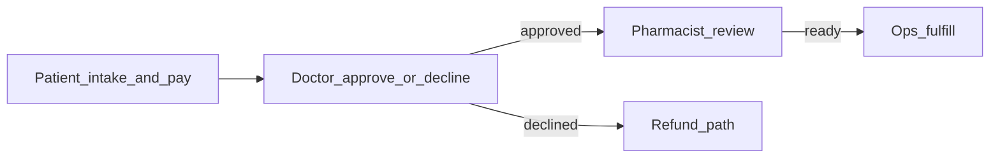
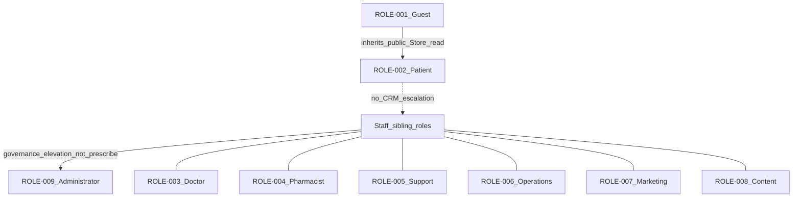
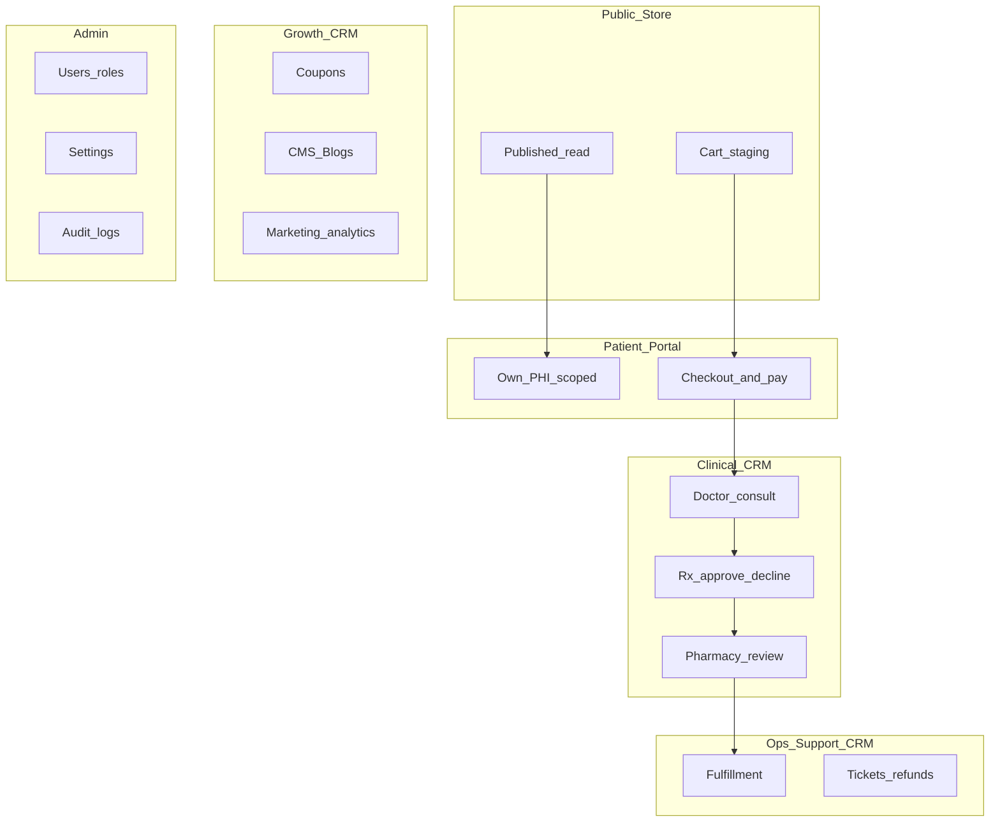
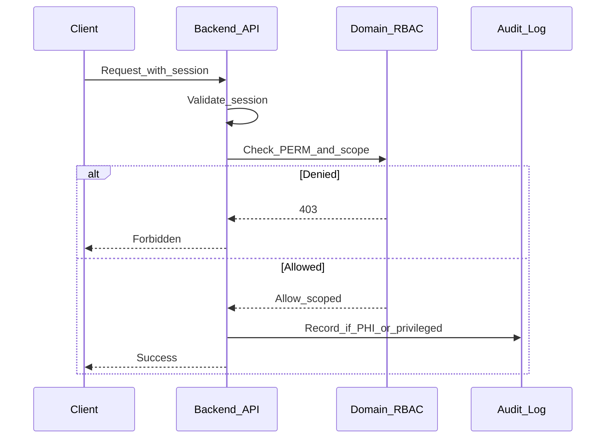
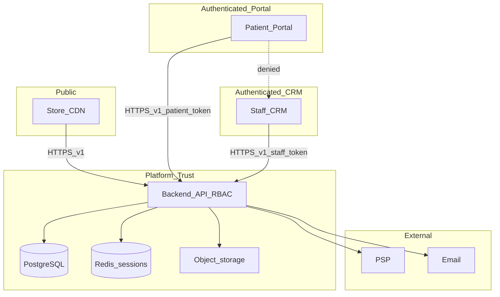
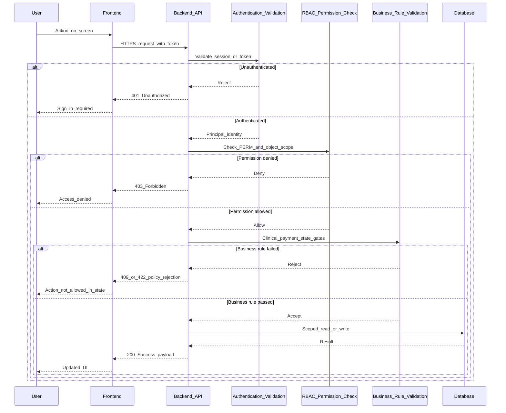

# 08 — Role Permissions

| Field | Value |
| --- | --- |
| Document | Role Permissions (RBAC Specification) |
| Product | Clinexa |
| Version | 1.0 |
| Status | Draft for review |
| Primary market | United States |
| Audience | IAM, Security Architecture, Engineering, Product, Clinical Ops, Support, Operations, Compliance, QA |
| Source of truth | [00 — Product Requirements Document](00-product-requirements-document.md) |
| Related docs | [01 — Project overview](01-project-overview.md), [02 — Business requirements](02-business-requirements.md), [03 — Functional requirements](03-functional-requirements.md), [04 — Non-functional requirements](04-non-functional-requirements.md), [05 — System architecture](05-system-architecture.md), [06 — User personas](06-user-personas.md), [07 — User journeys](07-user-journeys.md), [12 — Authentication flow](12-authentication-flow.md), [13 — Security](13-security.md) |

This document is the **authoritative Role-Based Access Control (RBAC)** specification for Clinexa Version 1. Personas ([06](06-user-personas.md)) and journeys ([07](07-user-journeys.md)) express intent and duty boundaries; **this document owns enforceable roles, permissions, matrices, and separation-of-duties rules**.

It expands PRD §6, §8.3, §12.6, and §13.3–13.4 using functional modules from [03](03-functional-requirements.md), operational rules from [02](02-business-requirements.md), and surface/trust boundaries from [05](05-system-architecture.md).

It does **not** define authentication protocols, session middleware, API handlers, or UI code. Those belong to [12](12-authentication-flow.md), [13](13-security.md), and implementation repos.

> **Compliance posture:** Controls are **HIPAA-aware** (PHI minimization, access control, auditability, encryption patterns). This document does **not** claim HIPAA, HITRUST, or SOC 2 Type II certification as V1 delivery gates (PRD §1.5; NFR-065).

---

## Table of contents

1. [Introduction](#1-introduction)
2. [RBAC Principles](#2-rbac-principles)
3. [Role Catalog](#3-role-catalog)
4. [Permission Categories](#4-permission-categories)
   - [Permission Dictionary](#permission-dictionary)
5. [Permission Matrix](#5-permission-matrix)
6. [CRUD Matrix](#6-crud-matrix)
7. [Separation of Duties](#7-separation-of-duties)
8. [Permission Inheritance](#8-permission-inheritance)
9. [Sensitive Data Access](#9-sensitive-data-access)
10. [Audit Requirements](#10-audit-requirements)
11. [Security Considerations](#11-security-considerations)
12. [Future Roles](#12-future-roles)
13. [RBAC Traceability Matrix](#13-rbac-traceability-matrix)
14. [Revision History](#14-revision-history)
15. [Screen-to-Role Access Matrix](#screen-to-role-access-matrix)
16. [JWT Claims Reference](#jwt-claims-reference)
17. [Authorization Request Flow](#authorization-request-flow)

---

## 1. Introduction

### 1.1 Purpose

Define production-grade authorization policy for Clinexa so that:

- Backend API enforces **server-side RBAC** on every privileged and PHI-adjacent operation (`FR-AUTH-004`, `NFR-045`, `ARCH-005`).
- Product and engineering share one matrix of who may View, Create, Edit, Delete, Approve, Reject, Export, or Manage each capability.
- Clinical, pharmacy, support, marketing, content, and admin duties remain **separated** (`OR-06`, `OR-07`).
- Patients access **only their own** records (`FR-AUTH-005`, `NFR-046`, `OR-06`, `AC-BR-08`).
- Auditors and QA can derive authorization test cases with clear pass/fail criteria (KPI-08: zero cross-patient exposure).

### 1.2 Scope

#### In scope (V1)

| Area | Coverage |
| --- | --- |
| Roles | Guest Visitor, Patient, Doctor, Pharmacist, Support, Operations, Marketing, Content, Administrator (`ROLE-001`–`ROLE-009`) |
| Surfaces | Store Web (`ARCH-011`), Patient Portal (`ARCH-012`), CRM (`ARCH-013`), Backend API as enforcement locus (`ARCH-014`) |
| Permissions | Module-scoped `PERM-<MOD>-###` capabilities aligned to FR modules |
| Policies | Least privilege, SoD, need-to-know, inheritance rules, sensitive-data access, audit events, break-glass |
| Traceability | Mapping to `USER-*`, `BO`/`BP`/`OR`/`AC-BR`, `FR-*`, `NFR-*`, `ARCH-*`, `JRN-*` |

#### Out of scope

| Area | Deferred to |
| --- | --- |
| Authentication flows, password reset UX, token formats | [12 — Authentication flow](12-authentication-flow.md) |
| Encryption, OWASP hardening, secrets management depth | [13 — Security](13-security.md) |
| API route contracts and middleware code | [11 — API design](11-api-design.md) / implementation |
| Database ACLs as substitute for domain RBAC | [10 — Database design](10-database-design.md) |
| Engineering / QA as product CRM roles | PRD §6.9–6.10 (delivery stakeholders only) |
| Native mobile patient UX | Future Mobile (not V1) |
| SaaS multi-tenant org model | Not defined for V1; isolation is **patient isolation** |

### 1.3 Audience

| Audience | How they use this document |
| --- | --- |
| IAM / Security architects | Authorize design reviews; SoD and break-glass policy |
| Backend engineers | Implement domain policy checks; never trust client role claims alone |
| Frontend engineers | Hide/disable UI affordances consistently with server policy (UX only; not enforcement) |
| Clinical ops / doctors / pharmacists | Confirm clinical gate permissions |
| Support / Operations / Marketing / Content | Confirm duty boundaries |
| Product / QA | Acceptance criteria for authz and isolation tests |
| Compliance reviewers | Trace HIPAA-aware access controls without overclaiming certification |

### 1.4 References

| ID / Doc | Relevance |
| --- | --- |
| PRD §6, §8.3, §12.6, §13.2–13.4 | Roles, AuthZ, clinical gates, patient isolation |
| [02](02-business-requirements.md) | `OR-06`, `OR-07`, RACI, `AC-BR-08`, `AC-BR-13` |
| [03](03-functional-requirements.md) | `FR-AUTH-004/005`, `FR-CRM-006`, `FR-SUP-004`, module FRs |
| [04](04-non-functional-requirements.md) | `NFR-045`–`NFR-047`, `NFR-057`–`NFR-062` |
| [05](05-system-architecture.md) | Trust boundaries; `ARCH-005`, `ARCH-011`–`014`, domain modules |
| [06](06-user-personas.md) | `USER-001`–`USER-009` |
| [07](07-user-journeys.md) | Journey actors and restrictions |

### 1.5 ID conventions

| Namespace | Pattern | Meaning |
| --- | --- | --- |
| Roles | `ROLE-001` … `ROLE-009` | Product roles (1:1 with `USER-001` … `USER-009`) |
| Permissions | `PERM-<MOD>-###` | Capability within an FR module code |
| Spec rules | `RBAC-001` … | Principles, SoD, inheritance, sensitive-data, audit, security, future roles |

---

## 2. RBAC Principles

| ID | Principle | Clinexa application | Anchors |
| --- | --- | --- | --- |
| **RBAC-001** | Principle of Least Privilege | Grant only permissions required for the role’s documented duties. Default deny for clinical notes, full questionnaire answers, admin config, and CRM routes for patients/guests. | PRD §13.4; NFR-045 |
| **RBAC-002** | Separation of Duties | Clinical approval, pharmacy review, fulfillment, support refunds, marketing, content, and admin config are distinct. No single default staff role may complete the entire Rx-to-ship path alone. | OR-06; BRD §2.2 |
| **RBAC-003** | Need-to-Know Access | Staff see PHI only as required for assigned case, ticket, order, or pharmacy review context. Marketing analytics exclude unnecessary PHI. | OR-07; NFR-059 |
| **RBAC-004** | Healthcare Privacy | HIPAA-aware: minimize PHI collection/display; encrypt in transit/at rest patterns; redact sensitive bodies from debug logs. No certification claim as V1 gate. | PRD §1.5; NFR-058, NFR-065 |
| **RBAC-005** | Auditability | Privileged and PHI-adjacent actions record attributable actor, action, timestamp, and object IDs. Clinical audit trails are distinct from debug logs. | NFR-057, NFR-062, NFR-076 |
| **RBAC-006** | Role Hierarchy | Capability nesting: Guest ⊂ Patient (Store); staff roles are siblings under CRM; Administrator is governance elevation—not automatic clinical prescribe. | §8; PRD §13.4 |
| **RBAC-007** | Permission Inheritance | Inherited permissions are explicit and SoD-constrained. Dual-role grants require explicit assignment and remain audited. Admin does **not** inherit Doctor approve or Ops fulfill by default. | §8; personas Admin |
| **RBAC-008** | Future Extensibility | New roles/permissions add via Admin-managed role config without collapsing SoD. Feature flags must not bypass clinical or payment gates. | FR-ADM-001; NFR-123; ARCH-149 |

---

## 3. Role Catalog

### 3.1 Role overview

| Role ID | Display name | Persona | Primary surface | Identity |
| --- | --- | --- | --- | --- |
| ROLE-001 | Guest Visitor | USER-001 | Store (public) | Unauthenticated |
| ROLE-002 | Patient | USER-002 | Store + Patient Portal | Authenticated end user |
| ROLE-003 | Doctor | USER-003 | CRM | Authenticated staff |
| ROLE-004 | Pharmacist | USER-004 | CRM | Authenticated staff |
| ROLE-005 | Support | USER-005 | CRM | Authenticated staff |
| ROLE-006 | Operations | USER-006 | CRM | Authenticated staff |
| ROLE-007 | Marketing | USER-007 | CRM | Authenticated staff |
| ROLE-008 | Content | USER-008 | CRM | Authenticated staff |
| ROLE-009 | Administrator | USER-009 | CRM | Authenticated staff |

### 3.2 ROLE-001 — Guest Visitor

| Field | Detail |
| --- | --- |
| **Role ID** | ROLE-001 |
| **Persona** | USER-001 |
| **Description** | Unauthenticated public visitor discovering treatments, education, and trust signals on the Store. |
| **Responsibilities** | Browse published catalog/CMS/blogs; stage cart; enter registration/sign-in/password-reset flows. |
| **System access** | Store Web (`ARCH-011`) public read; cart staging (`FR-CART`); auth entry (`FR-AUTH-001/002/003` entry points). |
| **Restrictions** | No Portal; no CRM; no order finalize; no PHI; no unpublished content; cannot submit reviews as guest. |
| **Business justification** | Enable acquisition (BO-1, BP-01, OR-01) without exposing patient or clinical data. |

### 3.3 ROLE-002 — Patient

| Field | Detail |
| --- | --- |
| **Role ID** | ROLE-002 |
| **Persona** | USER-002 |
| **Description** | Authenticated care-commerce end user purchasing treatments and self-serving after checkout. |
| **Responsibilities** | Complete intake questionnaires; checkout/pay; track orders/Rx status; manage subscriptions, appointments, documents, tickets, notification prefs; submit eligible reviews. |
| **System access** | Store + Patient Portal (`ARCH-012`); **own records only** across profile, orders, QST responses, prescriptions (status-appropriate), documents, appointments, subscriptions, tickets. |
| **Restrictions** | No CRM; no other patient’s data (`FR-AUTH-005`); no clinical note editing; no staff queues; no catalog/workflow configuration (`FR-PRT-006`). |
| **Business justification** | Deliver self-service retention and isolation (BO-3; OR-06; AC-BR-04; AC-BR-08). |

### 3.4 ROLE-003 — Doctor

| Field | Detail |
| --- | --- |
| **Role ID** | ROLE-003 |
| **Persona** | USER-003 |
| **Description** | Licensed clinical reviewer responsible for consult decisions and prescription approval/decline. |
| **Responsibilities** | Review assigned/available cases; read versioned questionnaire answers; create/update clinical notes; approve/decline/request additional info; create/update prescriptions only after approval path. |
| **System access** | CRM clinical queue (`FR-CRM-001`–`003`); case-scoped order/document context; reassessment cases when configured. |
| **Restrictions** | No marketing admin or system-wide config by default; no anonymous shared clinical accounts (`NFR-047`); actions must be attributable and audited. |
| **Business justification** | Human clinician accountability for Rx gates (BO-2; OR-03–04; AC-BR-02). |

### 3.5 ROLE-004 — Pharmacist

| Field | Detail |
| --- | --- |
| **Role ID** | ROLE-004 |
| **Persona** | USER-004 |
| **Description** | Pharmacy reviewer confirming prescription completeness and fulfillment readiness. |
| **Responsibilities** | Review Rx + related order/fulfillment; update pharmacy review status; flag issues to doctor/ops; coordinate inventory context. |
| **System access** | CRM pharmacy review (`FR-CRM-004`); related order/inventory visibility as needed for readiness. |
| **Restrictions** | **Cannot** unilaterally replace doctor clinical approval (PRD §13.2); no marketing/content/admin config by default. |
| **Business justification** | Second clinical-operational gate before Rx fulfillment (OR-05; AC-BR-03). |

### 3.6 ROLE-005 — Support

| Field | Detail |
| --- | --- |
| **Role ID** | ROLE-005 |
| **Persona** | USER-005 |
| **Description** | Customer support agent resolving patient issues within policy without clinical decision authority. |
| **Responsibilities** | Triage/resolve tickets; scoped account/order/subscription visibility in ticket context; initiate refunds per policy; explain clinical pending/decline; escalate clinical disputes to Doctor. |
| **System access** | CRM support (`FR-SUP-001`–`005`); refund initiation (`FR-PAY-003`, `FR-ORD-006`); CRM search with RBAC filter (`FR-SRCH-002`). |
| **Restrictions** | **Never** approve prescriptions (`FR-SUP-004`); no unrestricted clinical charts beyond ticket need-to-know; cannot reverse clinical decisions. |
| **Business justification** | Patient assistance and refund policy without clinical risk (BO-3/BO-4; OR-11; AC-BR-09–11). |

### 3.7 ROLE-006 — Operations

| Field | Detail |
| --- | --- |
| **Role ID** | ROLE-006 |
| **Persona** | USER-006 |
| **Description** | Fulfillment and inventory owner keeping cleared orders moving with accurate stock. |
| **Responsibilities** | Update shipping/fulfillment; reserve/decrement inventory; enforce oversell policy; operational reports; refund restock coordination. |
| **System access** | CRM ops (`FR-CRM-005`); inventory (`FR-INV-001`–`005`); order lifecycle after clearance (`FR-ORD-002`–`003`); reports (`FR-RPT-001`). |
| **Restrictions** | Cannot ship Rx before doctor approve + pharmacist review; no unrestricted clinical note editing unless dual-roled; cannot approve treatments. |
| **Business justification** | Operational throughput with clinical-gate integrity (BO-4; OR-08/OR-12; AC-BR-03). |

### 3.8 ROLE-007 — Marketing

| Field | Detail |
| --- | --- |
| **Role ID** | ROLE-007 |
| **Persona** | USER-007 |
| **Description** | Acquisition and conversion owner for coupons and marketing-safe analytics. |
| **Responsibilities** | Configure coupons; read funnel/marketing analytics; selected CMS fields as granted; review moderation as granted. |
| **System access** | CRM coupons (`FR-CPN-001`); marketing analytics (`FR-ANL-001`–`002`); limited CMS as granted. |
| **Restrictions** | **Default deny** clinical notes and full questionnaire answer sets (`OR-07`, `FR-CRM-006`, `AC-BR-13`, `NFR-060`); no full PHI charts. |
| **Business justification** | Growth without eroding clinical privacy (BO-1; BP-11; OR-07). |

### 3.9 ROLE-008 — Content

| Field | Detail |
| --- | --- |
| **Role ID** | ROLE-008 |
| **Persona** | USER-008 |
| **Description** | CMS/blog/SEO content owner publishing education without clinical system access. |
| **Responsibilities** | Create/update/publish blogs and CMS pages/banners/FAQs/SEO; draft non-public content; moderate reviews as granted. |
| **System access** | CRM blogs/CMS (`FR-BLG`, `FR-CMS`); Store consume published only. |
| **Restrictions** | No orders, prescriptions, clinical queues, or patient PHI for daily work (`OR-07`, `FR-CRM-006`). |
| **Business justification** | Trusted education/SEO without PHI exposure (BO-1/BO-5; BP-11; OR-13–14). |

### 3.10 ROLE-009 — Administrator

| Field | Detail |
| --- | --- |
| **Role ID** | ROLE-009 |
| **Persona** | USER-009 |
| **Description** | Platform configuration and governance owner for users, roles, settings, and clinical/commerce workflows. |
| **Responsibilities** | Manage users/roles; configure products/categories/questionnaires/plans/workflows; platform settings; notification templates; publish-safety validation; audited break-glass practice. |
| **System access** | CRM admin (`FR-ADM-001`–`004`, `FR-SET-001`–`004`, `FR-CRM-007`); broad config subject to audit. |
| **Restrictions** | Does not substitute for clinical approval roles by default; unaudited break-glass forbidden; last-admin safeguard required; cannot disable clinical gates globally. |
| **Business justification** | Safe configurability without code deploys (BO-5; BP-10; OR-14; AC-BR-05). |

---

## 4. Permission Categories

Permissions use `PERM-<MOD>-###`. Categories below group capabilities for matrices. **Doctor Reviews** means clinical consult queue actions (`FR-CRM-002/003`), not Store product star-ratings (`FR-REV`).

| Category | Module codes | Representative permissions | Primary roles |
| --- | --- | --- | --- |
| Authentication | AUTH | `PERM-AUTH-001` Register; `PERM-AUTH-002` Sign-in; `PERM-AUTH-003` Password reset; `PERM-AUTH-004` Session end; `PERM-AUTH-005` Enforce RBAC (system) | Guest, Patient, Staff |
| Patient Management | CRM, SRCH | `PERM-CRM-010` Search/view patient records (staff-scoped); `PERM-SRCH-002` CRM search | Staff (role-scoped) |
| Profile Management | PRT, AUTH | `PERM-PRT-001` View own profile; `PERM-PRT-002` Update own profile | Patient |
| Products | PRD | `PERM-PRD-001` View published; `PERM-PRD-002` Manage/publish products | Guest/Patient view; Admin manage |
| Categories | CAT | `PERM-CAT-001` View published; `PERM-CAT-002` Manage categories | Guest/Patient; Admin |
| Cart | CART | `PERM-CART-001` Create/update/delete cart lines; `PERM-CART-002` Apply coupon staging | Guest, Patient |
| Checkout | CHK | `PERM-CHK-001` Start checkout; `PERM-CHK-002` Finalize order (auth required) | Patient |
| Payments | PAY | `PERM-PAY-001` Pay; `PERM-PAY-002` Manage saved methods (own); `PERM-PAY-003` Initiate refund | Patient; Support/Ops |
| Orders | ORD | `PERM-ORD-001` View own/staff-scoped; `PERM-ORD-002` Cancel; `PERM-ORD-003` Fulfill/ship | Patient; Support; Ops |
| Subscriptions | SUB | `PERM-SUB-001` View/manage own; `PERM-SUB-002` Configure plans; `PERM-SUB-003` Assist renewal (no gate bypass) | Patient; Admin; Support |
| Questionnaires | QST | `PERM-QST-001` Submit responses; `PERM-QST-002` View own status; `PERM-QST-003` View full answers (clinical); `PERM-QST-004` Configure definitions | Patient; Doctor; Admin |
| Doctor Reviews | CRM | `PERM-CRM-001` Open consult queue; `PERM-CRM-002` Approve; `PERM-CRM-003` Decline; `PERM-CRM-004` Request info; `PERM-CRM-005` Clinical notes | Doctor |
| Pharmacy | CRM | `PERM-CRM-006` Pharmacy review; `PERM-CRM-007` Mark pharmacy ready / flag | Pharmacist |
| Appointments | APT | `PERM-APT-001` Book/cancel own; `PERM-APT-002` Staff view/manage | Patient; Staff as granted |
| Patient Portal | PRT | `PERM-PRT-010` Aggregate self-service dashboard | Patient only |
| CRM | CRM | `PERM-CRM-020` Access CRM shell (staff); deny patients | Staff roles |
| Documents | DOC | `PERM-DOC-001` View/download own; `PERM-DOC-002` Staff attach/view case-scoped; `PERM-DOC-003` Audit PHI access | Patient; Staff scoped |
| Notifications | NTF | `PERM-NTF-001` Receive; `PERM-NTF-002` Manage prefs; `PERM-NTF-003` Manage templates | Patient; Admin |
| Inventory | INV | `PERM-INV-001` View stock; `PERM-INV-002` Adjust/reserve/decrement; `PERM-INV-003` Low-stock alerts | Ops; Pharmacist coord |
| Reports | RPT | `PERM-RPT-001` View operational/clinical reports; `PERM-RPT-002` Export | Ops, Doctor, Support, Admin |
| Analytics | ANL | `PERM-ANL-001` Marketing-safe analytics; `PERM-ANL-002` Ops/clinical metrics | Marketing; Ops/Clinical; Admin |
| Marketing | CPN, ANL | Coupons + marketing analytics (see Coupons/Analytics) | Marketing, Admin |
| CMS | CMS | `PERM-CMS-001` Manage pages/banners/FAQs; `PERM-CMS-002` Publish | Content, Admin; Marketing limited |
| Blogs | BLG | `PERM-BLG-001` Create/edit/publish posts | Content, Admin |
| Coupons | CPN | `PERM-CPN-001` Configure coupons; `PERM-CPN-002` Redeem at checkout | Marketing/Admin; Patient |
| Support | SUP | `PERM-SUP-001` Create ticket (patient); `PERM-SUP-002` Triage/resolve; `PERM-SUP-003` Link order/patient | Patient; Support |
| Administration | ADM | `PERM-ADM-001` Manage users; `PERM-ADM-002` Assign roles; `PERM-ADM-003` Configure workflows | Admin |
| System Configuration | SET | `PERM-SET-001` Manage platform settings; `PERM-SET-002` Oversell/publish policies | Admin |
| Audit Logs | ADM, DOC | `PERM-ADM-010` View audit logs; `PERM-DOC-003` PHI access audit | Admin (primary) |
| Reviews (product) | REV | `PERM-REV-001` Submit review; `PERM-REV-002` Moderate approve/reject | Patient; Content/Support/Admin as granted |

---

## Permission Dictionary

Human-readable catalog of every `PERM-*` capability referenced in this specification. Allowed roles reflect the matrices in §5 and §6; scoped grants are noted where applicable. This dictionary does **not** invent new permissions or change existing assignments.

| Permission ID | Permission Name | Description | Module | Allowed Roles |
| --- | --- | --- | --- | --- |
| PERM-AUTH-001 | Register | Create a patient account via Store registration. | AUTH | Guest |
| PERM-AUTH-002 | Sign-in | Authenticate with email/password and establish a session/token. | AUTH | Guest, Patient, Doctor, Pharmacist, Support, Operations, Marketing, Content, Admin |
| PERM-AUTH-003 | Password reset | Initiate and complete password reset; invalidates existing sessions on success. | AUTH | Guest, Patient, Doctor, Pharmacist, Support, Operations, Marketing, Content, Admin |
| PERM-AUTH-004 | Session end | Sign out and invalidate the current session/token. | AUTH | Patient, Doctor, Pharmacist, Support, Operations, Marketing, Content, Admin |
| PERM-AUTH-005 | Enforce RBAC (system) | Platform capability: server-side RBAC evaluation on privileged/PHI-adjacent operations (not a user-granted CRM permission). | AUTH | System |
| PERM-SRCH-002 | CRM search | Search patients, orders, and catalog within CRM subject to RBAC filtering. | SRCH | Doctor, Pharmacist, Support, Operations, Marketing, Content, Admin (role-filtered results) |
| PERM-CRM-010 | Search/view patient records (staff-scoped) | View patient account records in CRM within role and need-to-know scope. | CRM | Doctor, Pharmacist, Support, Operations, Admin (scoped); Marketing/Content denied clinical charts |
| PERM-PRT-001 | View own profile | Read the authenticated patient’s own profile. | PRT | Patient |
| PERM-PRT-002 | Update own profile | Update the authenticated patient’s own profile fields. | PRT | Patient |
| PERM-PRT-010 | Patient Portal dashboard | Access the Portal self-service aggregate (own orders, Rx status, subscriptions, docs, appointments, tickets). | PRT | Patient |
| PERM-PRD-001 | View published products | Read published product catalog on the Store. | PRD | Guest, Patient, Marketing, Content, Admin |
| PERM-PRD-002 | Manage/publish products | Create, update, publish, archive, and restore products in CRM. | PRD | Admin |
| PERM-CAT-001 | View published categories | Read published category pages on the Store. | CAT | Guest, Patient, Marketing, Content, Admin |
| PERM-CAT-002 | Manage categories | Create, update, publish, and manage category structure/SEO in CRM. | CAT | Admin |
| PERM-CART-001 | Manage cart lines | Create, update, and delete cart line items. | CART | Guest, Patient |
| PERM-CART-002 | Stage coupon on cart | Apply or clear a coupon code on the cart before checkout. | CART | Guest, Patient |
| PERM-CHK-001 | Start checkout | Begin checkout from a staged cart (may require subsequent authentication). | CHK | Guest, Patient |
| PERM-CHK-002 | Finalize order | Complete checkout and create an order after authentication and payment rules. | CHK | Patient |
| PERM-PAY-001 | Pay | Submit payment for checkout or renewal via PSP tokenization (no raw PAN). | PAY | Patient |
| PERM-PAY-002 | Manage own payment methods | View/update saved payment methods for the owning patient. | PAY | Patient |
| PERM-PAY-003 | Initiate refund | Start a staff- or policy-allowed refund against an order/payment. | PAY | Support, Operations; Patient (request scoped); Admin (scoped) |
| PERM-ORD-001 | View orders | View order records—own for patients; role-scoped for authorized staff. | ORD | Patient (own); Doctor, Pharmacist, Support, Operations, Admin (scoped) |
| PERM-ORD-002 | Cancel order | Cancel an order or apply cancel/refund outcomes when policy allows. | ORD | Patient (own, scoped); Support, Operations; Admin (scoped) |
| PERM-ORD-003 | Fulfill/ship order | Record fulfillment/shipment after required clinical and pharmacy gates clear for Rx. | ORD | Operations |
| PERM-SUB-001 | Manage own subscription | View, update, and cancel the patient’s own subscriptions. | SUB | Patient; Support (assist, scoped); Admin |
| PERM-SUB-002 | Configure subscription plans | Create and publish subscription plan configuration. | SUB | Admin |
| PERM-SUB-003 | Assist renewal | Assist with renewal failures without bypassing clinical gates. | SUB | Support |
| PERM-QST-001 | Submit questionnaire responses | Complete and store intake questionnaire answers for the owning patient. | QST | Patient |
| PERM-QST-002 | View own questionnaire status | View status of the patient’s own questionnaire submissions. | QST | Patient |
| PERM-QST-003 | View full questionnaire answers | Read full clinical questionnaire answer sets for consult/pharmacy review. | QST | Doctor; Pharmacist (as permitted for review) |
| PERM-QST-004 | Configure questionnaire definitions | Create, version, and bind questionnaire definitions to products/workflows. | QST | Admin |
| PERM-CRM-001 | Open consult queue | Access the clinical consult queue of assigned/available cases. | CRM | Doctor |
| PERM-CRM-002 | Approve prescription | Clinically approve a prescription / treatment decision for a case. | CRM | Doctor |
| PERM-CRM-003 | Decline prescription | Clinically decline a prescription / treatment decision for a case. | CRM | Doctor |
| PERM-CRM-004 | Request additional info | Request supplemental intake/information from the patient for a consult case. | CRM | Doctor |
| PERM-CRM-005 | Clinical notes | Create and update clinical notes on a consult case. | CRM | Doctor |
| PERM-CRM-006 | Pharmacy review | Perform pharmacy review of approved prescriptions and related order context. | CRM | Pharmacist |
| PERM-CRM-007 | Mark pharmacy ready / flag | Mark pharmacy readiness or flag issues to doctor/operations. | CRM | Pharmacist |
| PERM-CRM-020 | Access CRM shell | Enter the staff CRM application shell (denied to Guest and Patient). | CRM | Doctor, Pharmacist, Support, Operations, Marketing, Content, Admin |
| PERM-APT-001 | Book/cancel own appointments | Create, view, update, and cancel the patient’s own appointments. | APT | Patient |
| PERM-APT-002 | Staff manage appointments | View and manage appointments in CRM as granted. | APT | Doctor, Pharmacist, Support, Operations (scoped); Admin |
| PERM-DOC-001 | View/download own documents | View and download the patient’s own documents (PHI access audited). | DOC | Patient |
| PERM-DOC-002 | Staff attach/view documents | Attach or view documents in case/ticket/order context (scoped). | DOC | Doctor, Pharmacist, Support, Operations, Admin (scoped) |
| PERM-DOC-003 | Audit PHI document access | Record and support audit of PHI document view/download events. | DOC | System; Admin (audit visibility) |
| PERM-NTF-001 | Receive notifications | Receive domain-triggered notifications (email and in-product as configured). | NTF | Patient, Doctor, Pharmacist, Support, Operations, Marketing, Content, Admin |
| PERM-NTF-002 | Manage notification preferences | Update non-mandatory notification preferences for self. | NTF | Patient |
| PERM-NTF-003 | Manage notification templates | Configure notification templates used by the platform. | NTF | Admin |
| PERM-INV-001 | View inventory | View stock levels and inventory status. | INV | Operations; Pharmacist (coordination); Admin |
| PERM-INV-002 | Adjust/reserve/decrement inventory | Reserve, decrement, or adjust inventory as part of fulfillment and restock flows. | INV | Operations; Admin (scoped) |
| PERM-INV-003 | Low-stock alerts | Receive and act on low-stock operational alerts. | INV | Operations |
| PERM-RPT-001 | View reports | View operational/clinical tabular reports within RBAC scope. | RPT | Operations; Doctor, Pharmacist, Support (scoped); Admin |
| PERM-RPT-002 | Export reports | Export authorized reports (async exports remain under RBAC). | RPT | Operations; Doctor, Pharmacist, Support (scoped); Admin |
| PERM-ANL-001 | Marketing-safe analytics | View funnel/marketing analytics that exclude unnecessary PHI. | ANL | Marketing; Admin |
| PERM-ANL-002 | Ops/clinical analytics | View operational and clinical queue/metrics dashboards. | ANL | Operations; Doctor, Pharmacist, Support (scoped); Admin |
| PERM-CMS-001 | Manage CMS content | Create and edit CMS pages, banners, FAQs, and blocks. | CMS | Content, Admin; Marketing (limited / as granted) |
| PERM-CMS-002 | Publish CMS content | Publish or unpublish CMS content to the Store. | CMS | Content, Admin; Marketing (limited / as granted) |
| PERM-BLG-001 | Manage blogs | Create, edit, publish, and archive blog posts. | BLG | Content, Admin |
| PERM-CPN-001 | Configure coupons | Create, update, and archive promotional coupons. | CPN | Marketing, Admin |
| PERM-CPN-002 | Redeem coupon | Apply a valid coupon at checkout. | CPN | Patient |
| PERM-SUP-001 | Create support ticket | Create a support ticket from the Patient Portal. | SUP | Patient |
| PERM-SUP-002 | Triage/resolve tickets | Triage and resolve support tickets in CRM. | SUP | Support; Admin (scoped) |
| PERM-SUP-003 | Link ticket to order/patient | Associate tickets with patient and order records within authorization. | SUP | Support; Admin (scoped) |
| PERM-ADM-001 | Manage users | Create and update staff/patient user records in administration. | ADM | Admin |
| PERM-ADM-002 | Assign roles | Assign and change roles/permissions (audited; no self-elevation). | ADM | Admin |
| PERM-ADM-003 | Configure workflows | Configure catalog, questionnaires, treatment plans, and consult workflows. | ADM | Admin |
| PERM-ADM-010 | View audit logs | Read clinical/admin audit log records. | ADM | Admin |
| PERM-SET-001 | Manage platform settings | Create/update platform configuration settings. | SET | Admin |
| PERM-SET-002 | Manage oversell/publish policies | Configure oversell, publish-safety, and related operational policies. | SET | Admin |
| PERM-REV-001 | Submit product review | Submit an eligible product review (held pending moderation). | REV | Patient |
| PERM-REV-002 | Moderate reviews | Approve or reject product reviews before public display. | REV | Admin; Content, Support, Marketing (as granted) |

---

## 5. Permission Matrix

### 5.1 Legend

| Symbol | Meaning |
| --- | --- |
| ✓ | Allowed |
| — | Denied |
| ◐ | Scoped (own-patient, ticket-context, case-assigned, marketing-safe, or as-granted) |
| V | View |
| C | Create |
| E | Edit |
| D | Delete |
| A | Approve |
| R | Reject / Decline |
| X | Export / Download |
| M | Manage (configure / administer) |

Role columns: **G** Guest · **P** Patient · **Dr** Doctor · **Ph** Pharmacist · **Su** Support · **Op** Operations · **Mk** Marketing · **Ct** Content · **Ad** Admin

### 5.2 Module permission matrix

| Module / capability | G | P | Dr | Ph | Su | Op | Mk | Ct | Ad | Key permissions |
| --- | --- | --- | --- | --- | --- | --- | --- | --- | --- | --- |
| Auth — register / sign-in / reset | ✓ | ✓ | ✓ | ✓ | ✓ | ✓ | ✓ | ✓ | ✓ | PERM-AUTH-001–003 |
| CRM shell access | — | — | ✓ | ✓ | ✓ | ✓ | ✓ | ✓ | ✓ | PERM-CRM-020 |
| Patient Portal | — | ✓ | — | — | — | — | — | — | — | PERM-PRT-010 |
| Published catalog / CMS / blogs (Store) | V | V | — | — | — | — | V* | V* | V* | PERM-PRD/CAT/CMS/BLG-001 |
| Products / categories manage | — | — | — | — | — | — | — | — | M | PERM-PRD-002, PERM-CAT-002 |
| Cart | C/E/D | C/E/D | — | — | — | — | — | — | — | PERM-CART-001 |
| Checkout finalize | — | ✓ | — | — | — | — | — | — | — | PERM-CHK-002 |
| Payments (pay / own methods) | — | ✓ | — | — | — | — | — | — | — | PERM-PAY-001–002 |
| Refunds initiate | — | ◐ | — | — | ✓ | ✓ | — | — | ◐ | PERM-PAY-003 |
| Orders view | — | ◐ | ◐ | ◐ | ◐ | ◐ | — | — | ◐ | PERM-ORD-001 |
| Orders fulfill / ship | — | — | — | — | — | ✓† | — | — | — | PERM-ORD-003 |
| Subscriptions own manage | — | ✓ | — | — | ◐ | — | — | — | M | PERM-SUB-001–002 |
| QST submit / own status | — | ✓ | — | — | — | — | — | — | M | PERM-QST-001–002,004 |
| QST full answers | — | — | ✓ | ◐ | — | — | — | — | — | PERM-QST-003 |
| Clinical notes | — | — | C/E | — | — | — | — | — | — | PERM-CRM-005 |
| Doctor approve / decline Rx | — | — | A/R | — | — | — | — | — | — | PERM-CRM-002–003 |
| Pharmacy review | — | — | — | A | — | — | — | — | — | PERM-CRM-006–007 |
| Appointments | — | ✓ | ◐ | ◐ | ◐ | ◐ | — | — | M | PERM-APT-001–002 |
| Documents | — | ◐ | ◐ | ◐ | ◐ | ◐ | — | — | ◐ | PERM-DOC-001–002 |
| Inventory | — | — | — | ◐ | — | M | — | — | ◐ | PERM-INV-001–003 |
| Support tickets | — | C/V | — | — | M | ◐ | — | — | ◐ | PERM-SUP-001–003 |
| Coupons configure | — | redeem | — | — | — | — | M | — | M | PERM-CPN-001–002 |
| Marketing analytics | — | — | — | — | — | — | ◐ | — | ✓ | PERM-ANL-001 |
| Ops / clinical analytics | — | — | ◐ | ◐ | ◐ | ✓ | — | — | ✓ | PERM-ANL-002 |
| Reports view/export | — | — | ◐ | ◐ | ◐ | ✓ | — | — | ✓ | PERM-RPT-001–002 |
| Blogs / CMS manage | — | — | — | — | — | — | ◐ | M | M | PERM-BLG/CMS |
| Product review submit | — | ✓ | — | — | — | — | — | — | — | PERM-REV-001 |
| Review moderate | — | — | — | — | ◐ | — | ◐ | ◐ | ✓ | PERM-REV-002 |
| User / role admin | — | — | — | — | — | — | — | — | M | PERM-ADM-001–002 |
| Settings / system config | — | — | — | — | — | — | — | — | M | PERM-SET-001–002 |
| Audit log view | — | — | — | — | — | — | — | — | ✓ | PERM-ADM-010 |

\* Marketing/Content may view Store publicly; manage only via CRM permissions.  
† Ops fulfill only after clinical + pharmacy gates clear for Rx (`FR-ORD-003`).

### 5.3 Hard-deny summary (always —)

| Action | Denied for | Rule |
| --- | --- | --- |
| Prescription clinical approve | Pharmacist, Support, Ops, Marketing, Content, Patient, Guest | RBAC-020; FR-SUP-004; PRD §13.2 |
| Unilateral doctor-replace approve | Pharmacist | RBAC-021 |
| Clinical notes / full QST answers | Marketing, Content (default) | RBAC-022; OR-07; FR-CRM-006 |
| CRM access | Guest, Patient | RBAC-023 |
| Cross-patient data | Patient (any other patient) | RBAC-024; FR-AUTH-005 |
| Fulfill Rx before gates | Operations | RBAC-025; FR-ORD-003 |
| Approve treatments / prescribe | Operations, Admin (default) | RBAC-026 |

---

## 6. CRUD Matrix

Actions: **V** View · **C** Create · **U** Update · **D** Delete · **A** Approve · **R** Reject · **P** Publish · **Ar** Archive · **Rs** Restore · **X** Export

| Module | Action | G | P | Dr | Ph | Su | Op | Mk | Ct | Ad |
| --- | --- | --- | --- | --- | --- | --- | --- | --- | --- | --- |
| Products | V published | ✓ | ✓ | — | — | — | — | ✓ | ✓ | ✓ |
| Products | C/U/D/P/Ar/Rs | — | — | — | — | — | — | — | — | ✓ |
| Categories | V published | ✓ | ✓ | — | — | — | — | ✓ | ✓ | ✓ |
| Categories | C/U/D/P | — | — | — | — | — | — | — | — | ✓ |
| Blogs | V published | ✓ | ✓ | — | — | — | — | ✓ | ✓ | ✓ |
| Blogs | C/U/P/Ar | — | — | — | — | — | — | — | ✓ | ✓ |
| CMS pages | V published | ✓ | ✓ | — | — | — | — | ✓ | ✓ | ✓ |
| CMS pages | C/U/P/Ar | — | — | — | — | — | — | ◐ | ✓ | ✓ |
| Cart | C/U/D | ✓ | ✓ | — | — | — | — | — | — | — |
| Orders | V | — | ◐ | ◐ | ◐ | ◐ | ◐ | — | — | ◐ |
| Orders | C (via checkout) | — | ✓ | — | — | — | — | — | — | — |
| Orders | U fulfill | — | — | — | — | — | ✓† | — | — | — |
| Orders | Cancel / refund outcome | — | ◐ | — | — | ✓ | ✓ | — | — | ◐ |
| Prescriptions | V status | — | ◐ | ✓ | ✓ | ◐‡ | ◐‡ | — | — | — |
| Prescriptions | A/R (clinical) | — | — | ✓ | — | — | — | — | — | — |
| Prescriptions | Pharmacy ready | — | — | — | ✓ | — | — | — | — | — |
| Questionnaires (defs) | C/U/P | — | — | — | — | — | — | — | — | ✓ |
| Questionnaire answers | C (submit) | — | ✓ | — | — | — | — | — | — | — |
| Questionnaire answers | V full | — | — | ✓ | ◐ | — | — | — | — | — |
| Clinical notes | C/U | — | — | ✓ | — | — | — | — | — | — |
| Clinical notes | V | — | — | ✓ | — | — | — | — | — | — |
| Subscriptions | V/U/Cancel own | — | ✓ | — | — | ◐ | — | — | — | ✓ |
| Subscription plans | C/U/P | — | — | — | — | — | — | — | — | ✓ |
| Appointments | C/V/U/Cancel own | — | ✓ | — | — | — | — | — | — | — |
| Appointments | V/U staff | — | — | ◐ | ◐ | ◐ | ◐ | — | — | ✓ |
| Documents | V/X own | — | ✓ | — | — | — | — | — | — | — |
| Documents | C/V case | — | — | ◐ | ◐ | ◐ | ◐ | — | — | ◐ |
| Documents | D | — | — | — | — | — | — | — | — | ◐ |
| Inventory | V | — | — | — | ◐ | — | ✓ | — | — | ✓ |
| Inventory | U adjust | — | — | — | — | — | ✓ | — | — | ◐ |
| Coupons | C/U/Ar | — | — | — | — | — | — | ✓ | — | ✓ |
| Coupons | Redeem | — | ✓ | — | — | — | — | — | — | — |
| Support tickets | C/V own | — | ✓ | — | — | — | — | — | — | — |
| Support tickets | U resolve | — | — | — | — | ✓ | — | — | — | ◐ |
| Reviews | C | — | ✓ | — | — | — | — | — | — | — |
| Reviews | A/R moderate | — | — | — | — | ◐ | — | ◐ | ◐ | ✓ |
| Users / roles | C/U/A assign | — | — | — | — | — | — | — | — | ✓ |
| Settings | U | — | — | — | — | — | — | — | — | ✓ |
| Audit logs | V/X | — | — | — | — | — | — | — | — | ✓ |
| Reports | V/X | — | — | ◐ | ◐ | ◐ | ✓ | — | — | ✓ |
| Analytics marketing | V | — | — | — | — | — | — | ✓ | — | ✓ |

† Gate-cleared Rx only.  
‡ Status/context only—not clinical edit; Support ticket need-to-know.

---

## 7. Separation of Duties

### 7.1 Clinical gate sequence

### 7.2 SoD rules

| ID | Rule | Denied behavior | Business reason |
| --- | --- | --- | --- |
| **RBAC-020** | Doctor cannot fulfill orders | Doctor has no `PERM-ORD-003` ship/fulfill | Preserving clinical focus and dual control before shipment |
| **RBAC-021** | Pharmacist cannot prescribe / clinically approve | Pharmacist lacks `PERM-CRM-002/003` | Pharmacy readiness ≠ medical judgment (PRD §13.2) |
| **RBAC-022** | Marketing cannot access patient medical information | No clinical notes / full QST (`FR-CRM-006`) | Privacy; marketing need-to-know (OR-07; AC-BR-13) |
| **RBAC-023** | Content cannot approve prescriptions | No clinical queue / Rx approve | Content duty is education/SEO only |
| **RBAC-024** | Support cannot modify or approve prescriptions | `FR-SUP-004` hard deny | Prevents support pressure from becoming clinical risk |
| **RBAC-025** | Operations cannot approve treatments | No doctor approve permissions | Fulfillment must not invent clinical clearance |
| **RBAC-026** | Patients only access their own data | `FR-AUTH-005` isolation | Patient privacy and KPI-08 |
| **RBAC-027** | Payment does not authorize dispensing | Checkout/pay ≠ Rx approve | Clinical gates first-class (OR-03) |
| **RBAC-028** | Admin config ≠ clinical prescribe | Admin lacks default `PERM-CRM-002` | Governance without replacing licensed review |
| **RBAC-029** | No shared anonymous clinical accounts | All staff actions attributable | Accountability (OR-06; NFR-047) |
| **RBAC-030** | Dual-role only by explicit assignment | Extra permissions audited | Controlled exceptions without silent god-roles |

---

## 8. Permission Inheritance

### 8.1 Hierarchy model (`RBAC-040`)

Inheritance is **capability nesting of surfaces**, not classical “higher role receives all lower clinical powers.” SoD overrides inheritance (`RBAC-007`).

### 8.2 Inherited vs exclusive

| From → To | Inherited | Exclusive to target | Explicitly NOT inherited |
| --- | --- | --- | --- |
| Guest → Patient | Published Store browse, cart | Portal, checkout, own PHI, tickets, reviews | CRM |
| Patient → Staff | None (identity system shared; roles separated) | CRM modules per staff role | Portal self-service as patient unless dual identity |
| Staff siblings | CRM shell + auth | Duty-specific PERMs | Each other’s exclusive clinical/ops/marketing powers |
| Staff → Admin | CRM shell; config/admin PERMs | Users/roles/settings/audit; workflow publish | Default Doctor approve, Pharmacist ready, Ops fulfill |

### 8.3 Permission relationships

### 8.4 Access flow

### 8.5 Trust boundaries

| Boundary | Rule (`RBAC-041`) |
| --- | --- |
| Public | Unauthenticated browse/content; auth entry only |
| Portal vs CRM | Patient tokens must not access CRM routes |
| Platform | Sole AuthZ authority; clients never trusted alone |
| External | Webhooks verified/idempotent; not staff-session auth |
| CDN | Never cache private/PHI |

---

## 9. Sensitive Data Access

| Data class | View | Edit | Export | Delete | Policy ID |
| --- | --- | --- | --- | --- | --- |
| **Patient Profile** | Patient (own); Support/Ops/Doctor/Pharmacist (scoped); Admin (scoped) | Patient (own); Admin (break-glass/scoped) | Admin; authorized staff reports | Admin only (policy-controlled) | **RBAC-050** |
| **Medical Questionnaires** | Patient: own status; Doctor: full answers; Pharmacist: as permitted for review; Marketing/Content: **deny** full answers | Patient: submit; Admin: definitions only | Doctor/Admin clinical export as granted | Admin definitions; answers retain per retention policy | **RBAC-051** |
| **Prescriptions** | Patient: status-appropriate; Doctor/Pharmacist: full clinical; Support: status in ticket context | Doctor: create/update after approve path; Pharmacist: review status only | Authorized clinical/ops export | Not routine; Admin exceptional | **RBAC-052** |
| **Orders** | Patient own; Doctor/Pharm/Support/Ops scoped; Marketing/Content deny | Ops fulfill; Support cancel/refund outcomes | Ops/Admin/Support as granted | Not routine | **RBAC-053** |
| **Payments** | Patient own payment status; Support/Ops refund context; **no raw PAN** any role | Patient pay/methods; Support/Ops refunds | Admin/Ops reports (tokenized) | N/A (PSP) | **RBAC-054** |
| **Documents** | Patient own; staff case-scoped; audited views | Staff attach; Patient limited upload if product allows | Patient download own; staff as granted — **audited** (`FR-DOC-004`) | Admin exceptional | **RBAC-055** |
| **Support Tickets** | Patient own; Support manage; Ops consulted | Support resolve; Patient create/comment own | Support/Admin | Admin exceptional | **RBAC-056** |
| **Analytics** | Marketing: PHI-minimized; Ops/Clinical: operational metrics; Admin: all authorized views | N/A (derived) | Admin/authorized | N/A | **RBAC-057** |
| **Audit Logs** | Admin primary; future auditor role | Immutable (append-only) | Admin | Denied (retention `NFR-062`) | **RBAC-058** |

---

## 10. Audit Requirements

### 10.1 Mandatory audited actions

| ID | Event | Always log | Anchors |
| --- | --- | --- | --- |
| **RBAC-060** | Login / logout / lockout | Actor, outcome, timestamp, IP/session id as available | NFR-057; FR-AUTH |
| **RBAC-061** | Role assignment / permission changes | Actor, target user, old/new roles | FR-ADM-001/004 |
| **RBAC-062** | Prescription approval | Doctor id, order/Rx ids, decision | OR-03; FR-CRM-002 |
| **RBAC-063** | Prescription rejection / decline | Doctor id, reason code, order/Rx ids | OR-03; AC-BR-10 |
| **RBAC-064** | Pharmacy review decision | Pharmacist id, order/Rx ids, status | FR-CRM-004 |
| **RBAC-065** | Refund approval / initiation | Staff id, order id, amount, reason | OR-11; FR-PAY-003 |
| **RBAC-066** | Content publishing (blog/CMS) | Actor, content id, publish state | FR-BLG/CMS |
| **RBAC-067** | Settings changes | Actor, setting key, old/new | FR-SET-003 |
| **RBAC-068** | Inventory changes | Actor, SKU, delta, order id if any | FR-INV |
| **RBAC-069** | Document PHI view / download | Actor, document id, patient id | FR-DOC-004 |
| **RBAC-070** | Break-glass / elevated admin access | Actor, justification, scope, duration | §11.6 |
| **RBAC-071** | Consult request-info | Doctor id, case id | FR-CRM-002 |
| **RBAC-072** | Failed authorization (403 on PHI) | Actor, resource, permission | NFR-045/117 |

### 10.2 Audit record fields

| Field | Required |
| --- | --- |
| Actor user id + role(s) at time of action | Yes |
| Action type | Yes |
| Timestamp (UTC) | Yes |
| Object type + object id(s) | Yes |
| Outcome (success/deny/failure) | Yes |
| Correlation / request id | Should |
| Justification (break-glass / refund reason) | When applicable |

### 10.3 Retention

| ID | Requirement |
| --- | --- |
| **RBAC-073** | Clinical/admin audit retention ≥ 1 year (`NFR-062`) |
| **RBAC-074** | Audit logs distinct from debug logs; no QST answer bodies, secrets, or raw PAN in debug (`NFR-075`–`076`) |

---

## 11. Security Considerations

| ID | Control | Specification |
| --- | --- | --- |
| **RBAC-080** | Privilege escalation prevention | Role changes only via `PERM-ADM-002`; self-elevation forbidden; last-admin safeguard; dual-role explicit + audited |
| **RBAC-081** | Session validation | Every privileged request requires validated session/token (`NFR-041`); idle ≤30 min staff/PHI; absolute ≤12 h; reset invalidates sessions (`NFR-044`) — AuthN mechanics in doc 12 |
| **RBAC-082** | Cross-tenant isolation | V1 has no SaaS multi-org tenancy; enforce **patient isolation** and never leak PHI across patients via cache/search/reports |
| **RBAC-083** | Patient isolation | Zero cross-patient read/write under normal auth paths (`NFR-046`; `FR-AUTH-005`; KPI-08); repository queries patient-scoped (`ARCH-032`) |
| **RBAC-084** | Administrative controls | Admin actions audited; unsafe Rx publish blocked (`FR-ADM-003`); feature flags cannot bypass clinical/payment gates (`NFR-123`) |
| **RBAC-085** | Emergency access (Break Glass) | Temporary elevation only by Administrator (or dual-roled Admin); requires justification; time-bounded; fully audited (`RBAC-070`); does not permanently grant Doctor prescribe without explicit role |
| **RBAC-086** | Least privilege enforcement | Server-side RBAC on every PHI-adjacent and privileged op (`FR-AUTH-004`; `ARCH-005`); UI hiding is non-authoritative |
| **RBAC-087** | AuthZ response hygiene | Preserve 401 vs 403 (`NFR-117`); CRM search RBAC-filtered (`FR-SRCH-002`; `NFR-008`) |

---

## 12. Future Roles

| ID | Future role | Intended duties | Why not V1 |
| --- | --- | --- | --- |
| **RBAC-090** | Nurse | Care coordination, limited clinical documentation | V1 clinical path is Doctor + Pharmacist only (PRD scope) |
| **RBAC-091** | Finance | Settlements, complex refunds, reconciliation | Support/Ops cover policy refunds; PSP owns card data |
| **RBAC-092** | Compliance Officer | Policy oversight, audit review, DPIA support | Admin + audit logs suffice for demo; certification not V1 gate |
| **RBAC-093** | Warehouse Staff | Pick/pack separate from Ops manager | Operations owns inventory/fulfillment in V1 (USER-006) |
| **RBAC-094** | External Partner | Limited API for labs/pharmacies | No partner integration surface in V1 |
| **RBAC-095** | Read-only Auditor | Immutable audit/report access without config | Admin audit view covers V1; split later for SoD purity |

---

## 13. RBAC Traceability Matrix

### 13.1 Role → permissions → requirements → architecture

| Role | Core permissions | Business | Functional | Architecture |
| --- | --- | --- | --- | --- |
| ROLE-001 Guest | Store read; cart; auth entry | BO-1; BP-01; OR-01; AC-BR-01/06/07 | FR-STO, FR-CART, FR-AUTH-001 | ARCH-011, ARCH-044 |
| ROLE-002 Patient | Own Portal/Store commerce + PHI | BO-1/3; BP-01/02/06–09; OR-06; AC-BR-04/08 | FR-AUTH-005, FR-PRT, FR-CHK, FR-PAY, FR-QST, FR-ORD, FR-SUB, FR-DOC, FR-APT, FR-SUP | ARCH-011/012, ARCH-045–055 |
| ROLE-003 Doctor | Consult; QST full; Rx A/R; notes | BO-2; BP-03/04; OR-03/04; AC-BR-02 | FR-CRM-001–003, FR-QST-005 | ARCH-013, ARCH-049/050 |
| ROLE-004 Pharmacist | Pharmacy review | BO-2/4; BP-04/05; OR-05; AC-BR-03 | FR-CRM-004, FR-ORD-003 | ARCH-013, ARCH-047/064 |
| ROLE-005 Support | Tickets; refunds; scoped order view | BO-3/4; BP-06/08/09; OR-11; AC-BR-09–11 | FR-SUP-001–005, FR-PAY-003; **deny** FR-SUP-004 | ARCH-013, ARCH-059 |
| ROLE-006 Operations | Fulfill; inventory; ops reports | BO-4; BP-05/09; OR-08/12; AC-BR-03 | FR-CRM-005, FR-INV, FR-ORD-002/003, FR-RPT | ARCH-013, ARCH-047/064 |
| ROLE-007 Marketing | Coupons; marketing analytics | BO-1/4; BP-11; OR-07; AC-BR-13 | FR-CPN, FR-ANL-001/002; **deny** FR-CRM-006 | ARCH-013, ARCH-057/063 |
| ROLE-008 Content | Blogs/CMS; review mod as granted | BO-1/5; BP-11; OR-07/13; AC-BR-06/13 | FR-BLG, FR-CMS, FR-REV-003; **deny** FR-CRM-006 | ARCH-013, ARCH-060/061 |
| ROLE-009 Admin | Users/roles/settings/workflows/audit | BO-5; BP-10; OR-14; AC-BR-05 | FR-ADM, FR-SET, FR-CRM-007 | ARCH-013, ARCH-041, ARCH-058 |

### 13.2 Cross-cutting enforcement

| Concern | Spec IDs | FR / NFR | ARCH |
| --- | --- | --- | --- |
| Server-side RBAC | RBAC-001, RBAC-086 | FR-AUTH-004; NFR-045 | ARCH-005, ARCH-014, ARCH-031 |
| Patient isolation | RBAC-024, RBAC-083 | FR-AUTH-005; NFR-046; OR-06; AC-BR-08 | ARCH-032, ARCH-052 |
| Marketing/Content PHI deny | RBAC-022, RBAC-051 | FR-CRM-006; OR-07; NFR-060; AC-BR-13 | ARCH-053 |
| Clinical gates | RBAC-020–027 | FR-ORD-003; FR-CRM-002–004 | ARCH-047, ARCH-050 |
| Audit | RBAC-005, RBAC-060–074 | NFR-057, NFR-062 | ARCH-022/026 |

### 13.3 Journey coverage (authz test seeds)

| Journey | Roles | AuthZ assertions |
| --- | --- | --- |
| JRN-001–007 | Guest→Patient | Guest cannot finalize; patient isolation after auth |
| JRN-011–014 | Doctor | Only Doctor approve/decline/request info |
| JRN-015 | Pharmacist | Pharmacy ready; cannot doctor-approve |
| JRN-016 | Operations | Fulfill only when gates clear |
| JRN-026 | Support/Ops | Refunds allowed; Rx approve denied |
| JRN-032 | Marketing | Coupons/analytics; clinical chart deny |
| JRN-033 | Content | Publish content; clinical deny |
| JRN-031 | Admin | Config audited; gates not disabled |

---

## 14. Revision History

| Version | Date | Author | Reviewer | Changes | Approval Status |
| --- | --- | --- | --- | --- | --- |
| 1.0 | 2026-07-23 | Principal Security / IAM Architect (Clinexa Planning) | — | Initial Role & Permission Specification (RBAC-001+; ROLE-001–009; PERM matrices) for review | Draft for review |
| 1.1 | 2026-07-23 | Principal Security / IAM Architect (Clinexa Planning) | — | Additive enterprise sections: Permission Dictionary, Screen-to-Role Access Matrix, JWT Claims Reference, Authorization Request Flow (no changes to existing IDs, matrices, or rules) | Draft for review |

---

## Screen-to-Role Access Matrix

UI/screen access derived from §5 Permission Matrix and §3 Role Catalog. This matrix is a **navigation affordance guide**; the Backend API remains the authoritative enforcement point (`FR-AUTH-004`, `RBAC-086`).

### Legend

| Symbol | Meaning |
| --- | --- |
| ✓ Full Access | Role may use the screen’s primary functions consistent with granted permissions |
| ◐ Limited Access | Role may access only scoped, status-appropriate, ticket/case-context, marketing-safe, or as-granted functions |
| — No Access | Screen/module is not available to the role |

| Screen / Module | Guest | Patient | Doctor | Pharmacist | Support | Operations | Marketing | Content | Admin |
| --- | --- | --- | --- | --- | --- | --- | --- | --- | --- |
| Home | ✓ Full Access | ✓ Full Access | — No Access | — No Access | — No Access | — No Access | ✓ Full Access | ✓ Full Access | ✓ Full Access |
| Product Listing | ✓ Full Access | ✓ Full Access | — No Access | — No Access | — No Access | — No Access | ✓ Full Access | ✓ Full Access | ✓ Full Access |
| Product Details | ✓ Full Access | ✓ Full Access | — No Access | — No Access | — No Access | — No Access | ✓ Full Access | ✓ Full Access | ✓ Full Access |
| Cart | ✓ Full Access | ✓ Full Access | — No Access | — No Access | — No Access | — No Access | — No Access | — No Access | — No Access |
| Checkout | ◐ Limited Access | ✓ Full Access | — No Access | — No Access | — No Access | — No Access | — No Access | — No Access | — No Access |
| Patient Portal Dashboard | — No Access | ✓ Full Access | — No Access | — No Access | — No Access | — No Access | — No Access | — No Access | — No Access |
| Orders | — No Access | ◐ Limited Access | ◐ Limited Access | ◐ Limited Access | ◐ Limited Access | ◐ Limited Access | — No Access | — No Access | ◐ Limited Access |
| Subscriptions | — No Access | ✓ Full Access | — No Access | — No Access | ◐ Limited Access | — No Access | — No Access | — No Access | ✓ Full Access |
| Documents | — No Access | ◐ Limited Access | ◐ Limited Access | ◐ Limited Access | ◐ Limited Access | ◐ Limited Access | — No Access | — No Access | ◐ Limited Access |
| Appointments | — No Access | ✓ Full Access | ◐ Limited Access | ◐ Limited Access | ◐ Limited Access | ◐ Limited Access | — No Access | — No Access | ✓ Full Access |
| CRM Dashboard | — No Access | — No Access | ✓ Full Access | ✓ Full Access | ✓ Full Access | ✓ Full Access | ✓ Full Access | ✓ Full Access | ✓ Full Access |
| Clinical Queue | — No Access | — No Access | ✓ Full Access | — No Access | — No Access | — No Access | — No Access | — No Access | — No Access |
| Pharmacy Queue | — No Access | — No Access | — No Access | ✓ Full Access | — No Access | — No Access | — No Access | — No Access | — No Access |
| Inventory | — No Access | — No Access | — No Access | ◐ Limited Access | — No Access | ✓ Full Access | — No Access | — No Access | ◐ Limited Access |
| Coupons | — No Access | ◐ Limited Access | — No Access | — No Access | — No Access | — No Access | ✓ Full Access | — No Access | ✓ Full Access |
| CMS | ◐ Limited Access | ◐ Limited Access | — No Access | — No Access | — No Access | — No Access | ◐ Limited Access | ✓ Full Access | ✓ Full Access |
| Blogs | ◐ Limited Access | ◐ Limited Access | — No Access | — No Access | — No Access | — No Access | ◐ Limited Access | ✓ Full Access | ✓ Full Access |
| Reports | — No Access | — No Access | ◐ Limited Access | ◐ Limited Access | ◐ Limited Access | ✓ Full Access | — No Access | — No Access | ✓ Full Access |
| Analytics | — No Access | — No Access | ◐ Limited Access | ◐ Limited Access | ◐ Limited Access | ✓ Full Access | ◐ Limited Access | — No Access | ✓ Full Access |
| User Management | — No Access | — No Access | — No Access | — No Access | — No Access | — No Access | — No Access | — No Access | ✓ Full Access |
| Settings | — No Access | — No Access | — No Access | — No Access | — No Access | — No Access | — No Access | — No Access | ✓ Full Access |
| Audit Logs | — No Access | — No Access | — No Access | — No Access | — No Access | — No Access | — No Access | — No Access | ✓ Full Access |

Notes:

- Guest/Patient **CMS** and **Blogs** access on Store is published-content read only (`◐`); create/publish is CRM Content/Admin.
- Patient **Coupons** access is redeem-at-checkout only (`PERM-CPN-002`), not coupon administration.
- Guest **Checkout** is limited because finalize requires authentication (`PERM-CHK-002`).
- Staff **Orders**, **Documents**, and **Appointments** are need-to-know / case-or-ticket scoped.
- Marketing **Analytics** is marketing-safe / PHI-minimized (`PERM-ANL-001`); Ops/clinical metrics use `PERM-ANL-002`.

---

## JWT Claims Reference

Authenticated clients may carry session tokens or JWTs as **identity carriers**. Claims help the API identify the subject and session; they are **not** a substitute for server-side authorization.

> **Authoritative rule:** Authorization is always validated server-side against role and permission policy (`FR-AUTH-004`, `NFR-045`, `RBAC-086`, `ARCH-005`). Frontend or token-embedded permission lists must never be trusted alone for PHI-adjacent or privileged operations.

| Claim | Type | Purpose | Required |
| --- | --- | --- | --- |
| `userId` | string (UUID) | Stable identifier of the authenticated principal | Yes |
| `role` | string or string[] | Product role code(s) at issuance (e.g., `ROLE-002`, `ROLE-003`); dual-role may be an array | Yes |
| `permissions` | string[] | Optional advisory list of `PERM-*` codes for UI hinting only; **re-resolved server-side** | No (advisory) |
| `sessionId` | string | Correlates the token to a server-side session record (revocation/idle timeout) | Yes |
| `issuedAt` | number (unix epoch) / datetime | Token issuance time | Yes |
| `expiresAt` | number (unix epoch) / datetime | Absolute token/session expiry | Yes |
| `tokenVersion` | number / string | Version stamp for global invalidation after password reset or privilege change | Yes |

### Claim usage rules

| Rule | Detail |
| --- | --- |
| Identity only | Claims establish *who* is calling; domain policy decides *what* they may do |
| Fresh policy | API loads current role assignments from the Users/RBAC store; stale `permissions` claims do not grant access |
| Scope still required | Even with a valid Doctor role claim, patient/order object scope and clinical-gate state must pass |
| Patient vs staff | Patient tokens must not authorize CRM routes; staff tokens must not impersonate arbitrary patients without policy |
| Revocation | Password reset, lockout, role change, or `tokenVersion` bump invalidates prior sessions (`NFR-044`) |

Token format, signing algorithms, and cookie vs bearer transport are defined in [12 — Authentication flow](12-authentication-flow.md), not in this document.

---

## Authorization Request Flow

End-to-end authorization decision path for privileged and PHI-adjacent API requests. This expands §8.4 with explicit authentication validation, RBAC permission check, and business-rule validation stages.

### Authorization decision process

| Step | Component | Decision | Failure outcome |
| --- | --- | --- | --- |
| 1 | User → Frontend | User invokes a screen action | N/A (client UX) |
| 2 | Frontend → Backend API | Request sent over HTTPS `/v1` with session/token | Network/client errors |
| 3 | Authentication Validation | Token/session signature, expiry, `tokenVersion`, lockout, and idle limits (`NFR-041`, `NFR-044`) | **401 Unauthorized** |
| 4 | RBAC Permission Check | Required `PERM-*` present for the principal’s role(s); object scope (own-patient, case, ticket) enforced (`FR-AUTH-004`, `FR-AUTH-005`) | **403 Forbidden** (`RBAC-072` audit when PHI-adjacent) |
| 5 | Business Rule Validation | Clinical gates, payment state, inventory/oversell, publish-safety, illegal state transitions (`FR-ORD-003`, OR-03–05) | **409/422** (or equivalent policy rejection)—not a grant of missing permissions |
| 6 | Database | Patient-scoped / RBAC-filtered persistence (`ARCH-032`) | Persistence errors; never used to bypass AuthZ |
| 7 | Response | Success payload or typed error; privileged/PHI actions audited when required (§10) | Client renders allowed UI only |

**Authorized path:** AuthN pass → RBAC allow (permission + scope) → business rules accept → scoped DB operation → success response (and audit when required).

**Unauthorized path (403):** AuthN pass → RBAC deny (missing permission, wrong surface, or cross-patient/out-of-scope) → **403 Forbidden**; no business-rule mutation and no privileged DB write.

UI hiding of buttons is non-authoritative (`RBAC-086`). Feature flags must not skip steps 4–5 (`NFR-123`).

---

## Related reading

| Document | Why |
| --- | --- |
| [00 — Product Requirements Document](00-product-requirements-document.md) | Source of truth for roles and AuthZ business rules |
| [06 — User personas](06-user-personas.md) | Human model (`USER-*`) behind `ROLE-*` |
| [07 — User journeys](07-user-journeys.md) | Duty sequences and restriction scenarios |
| [03 — Functional requirements](03-functional-requirements.md) | Action-level FR modules |
| [05 — System architecture](05-system-architecture.md) | Surfaces and trust boundaries |
| [12 — Authentication flow](12-authentication-flow.md) | AuthN (sessions, reset)—not AuthZ matrices |
| [13 — Security](13-security.md) | Broader security controls |

---

## Document control

| Field | Value |
| --- | --- |
| Owner | Security / IAM (with Product) |
| Change rule | Must remain consistent with PRD §6 and §13; do not invent V1 product roles absent from the PRD |
| Implementation rule | Enforce in Backend API domain policies; clients are non-authoritative |
| Related enforcement IDs | FR-AUTH-004, FR-AUTH-005, NFR-045, NFR-046, ARCH-005 |

---

*End of 08 — Role Permissions.*
