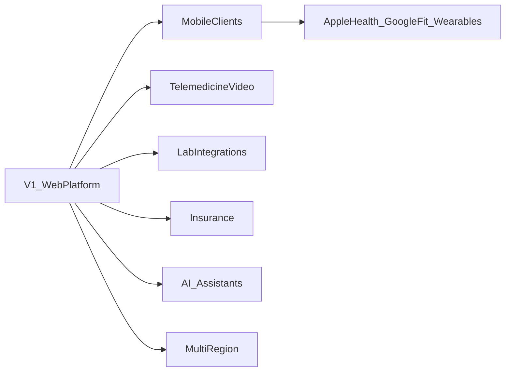
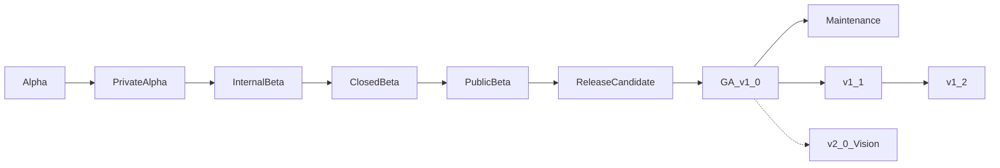
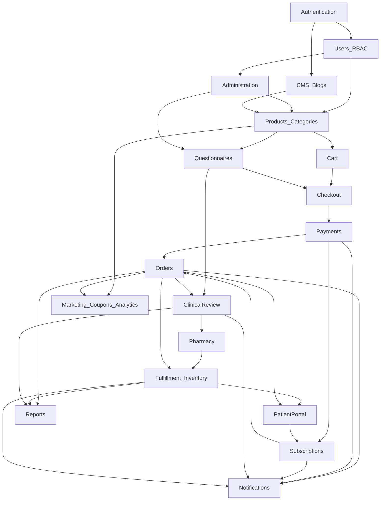
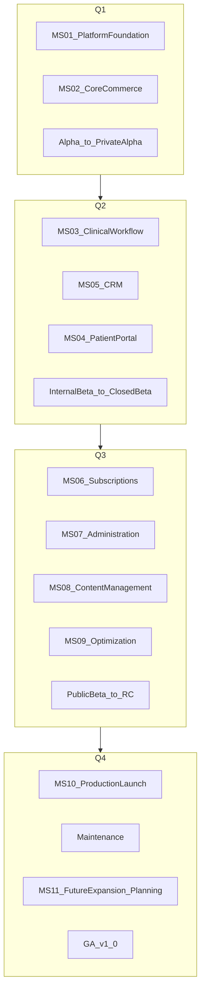
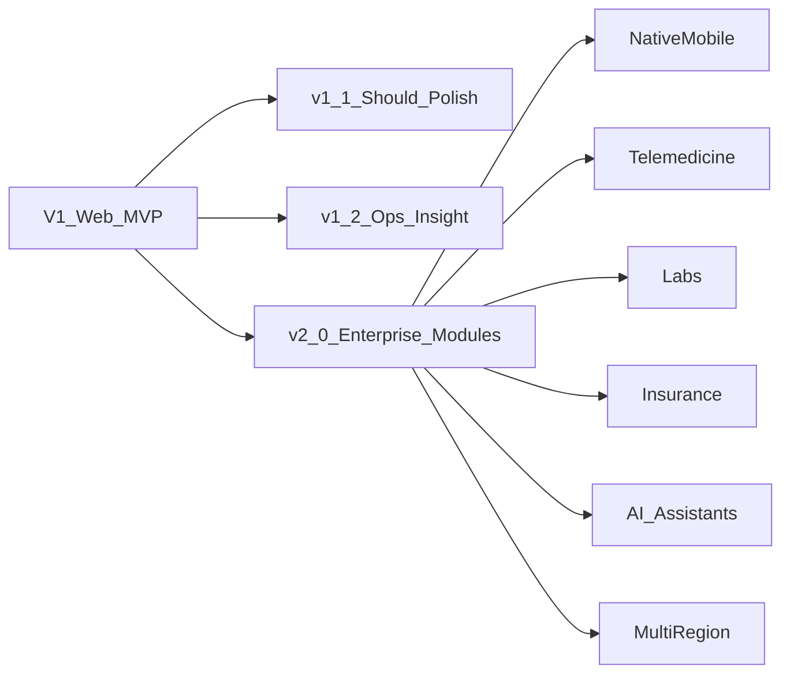
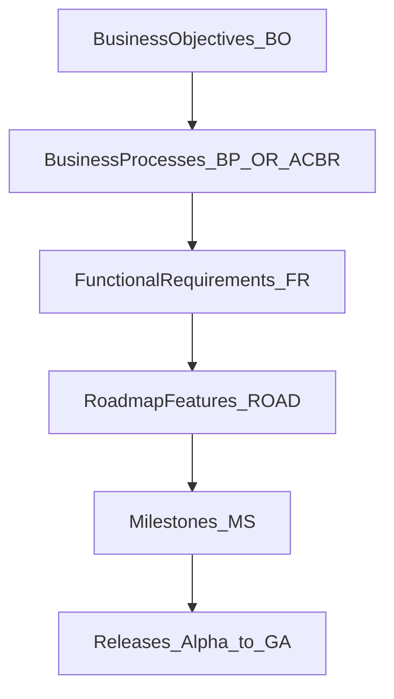
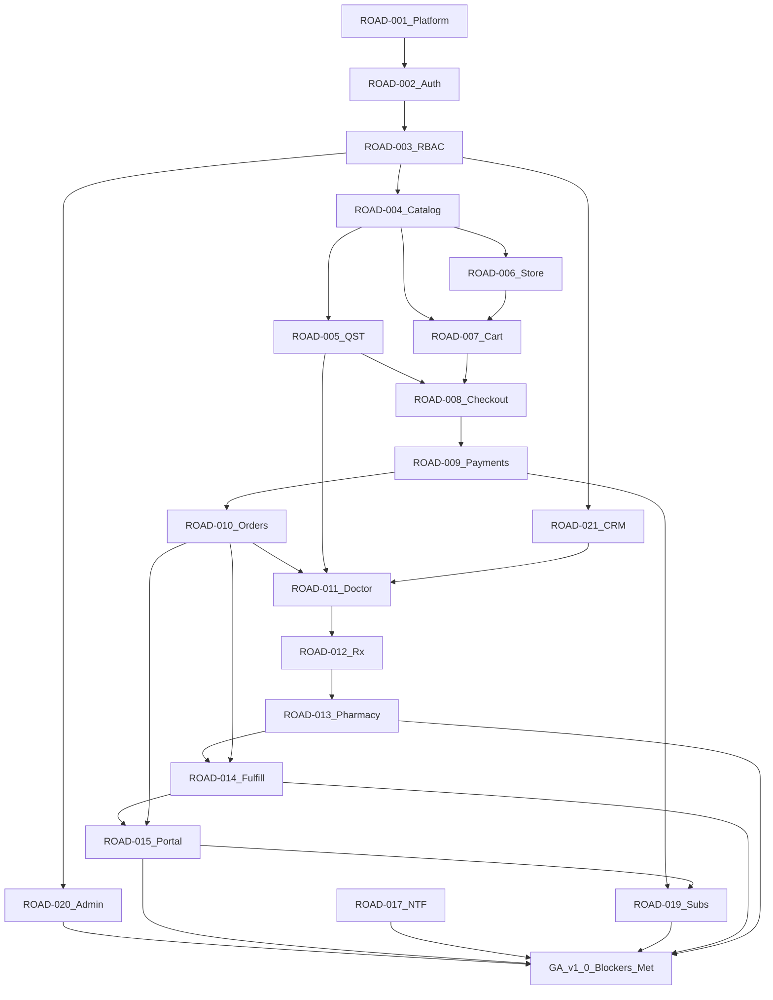

# 09 — Feature Roadmap

| Field | Value |
| --- | --- |
| Document | Feature Roadmap |
| Product | Clinexa |
| Version | 1.0 |
| Status | Draft for review |
| Primary market | United States |
| Audience | Engineering leadership, investors, stakeholders, Product, Program Management, Architecture, Clinical Ops, Operations, Support, Marketing, Content, QA, Security |
| Source of truth | [00 — Product Requirements Document](00-product-requirements-document.md) |
| Related docs | [01 — Project overview](01-project-overview.md), [02 — Business requirements](02-business-requirements.md), [03 — Functional requirements](03-functional-requirements.md), [04 — Non-functional requirements](04-non-functional-requirements.md), [05 — System architecture](05-system-architecture.md), [06 — User personas](06-user-personas.md), [07 — User journeys](07-user-journeys.md), [08 — Role permissions](08-role-permissions.md), [24 — Future features](24-future-features.md) |

This document is the **Feature Roadmap** for Clinexa Version 1 and the governed path toward post-V1 expansion. It defines **what gets built, why, in what order, under which release gates, and how value and risk are managed**—without sprint tasks, Jira tickets, or implementation code.

It expands [PRD §10](00-product-requirements-document.md#10-functional-scope), [PRD §11](00-product-requirements-document.md#11-out-of-scope), [PRD §18](00-product-requirements-document.md#18-success-criteria), and [PRD §19](00-product-requirements-document.md#19-future-vision) using MoSCoW priorities from [02 — Business requirements](02-business-requirements.md) §6, functional modules from [03 — Functional requirements](03-functional-requirements.md), and delivery constraints from [04](04-non-functional-requirements.md) / [05](05-system-architecture.md).

It does **not** own functional requirement statements, RBAC matrices, API contracts, schemas, or UI design. Those remain in docs 03, 08, 10–11, and 20.

> **Compliance posture:** Controls are **HIPAA-aware** (PHI minimization, access control, auditability, encryption patterns). This roadmap does **not** treat HIPAA, HITRUST, or SOC 2 Type II certification as V1 delivery gates (PRD §1.5; NFR-065).

> **Release naming:** Alpha through GA are **delivery-governance stages** toward PRD §18.1 MVP evidence. Upstream docs use V1 / post-V1 vocabulary; release names here do not invent product scope beyond the PRD.

---

## Table of contents

1. [Introduction](#1-introduction)
2. [Roadmap Strategy](#2-roadmap-strategy)
3. [Product Milestones](#3-product-milestones)
4. [Release Roadmap](#4-release-roadmap)
5. [Feature Prioritization](#5-feature-prioritization)
6. [Feature Dependency Map](#6-feature-dependency-map)
7. [Business Value Matrix](#7-business-value-matrix)
8. [Technical Readiness Matrix](#8-technical-readiness-matrix)
9. [Risk Assessment](#9-risk-assessment)
10. [Success Metrics](#10-success-metrics)
11. [Timeline View](#11-timeline-view)
12. [Future Vision](#12-future-vision)
13. [Roadmap Traceability Matrix](#13-roadmap-traceability-matrix)
14. [Revision History](#14-revision-history)
15. [RICE Prioritization Matrix](#15-rice-prioritization-matrix)
16. [Delivery Ownership Matrix](#16-delivery-ownership-matrix)
17. [Relative Effort Matrix](#17-relative-effort-matrix)
18. [Critical Path Analysis](#18-critical-path-analysis)
19. [Release Readiness Dashboard](#19-release-readiness-dashboard)

---

## 1. Introduction

### 1.1 Purpose

Provide a production-grade delivery roadmap so that:

- Engineering leadership can sequence platform, commerce, clinical, and operations work without bypassing clinical gates.
- Investors and stakeholders see business value, release intent, and deferred scope with clear PRD alignment.
- Implementation teams share one model of milestones, MoSCoW priority, dependencies, readiness targets, and exit criteria.
- Product governance can reject scope creep that contradicts [PRD §11](00-product-requirements-document.md#11-out-of-scope).

### 1.2 Scope

#### In scope

| Area | Coverage |
| --- | --- |
| Strategy | Vision, MVP philosophy, incremental delivery, clinical safety, business value, foundation-first, scalability |
| Milestones | Platform through Future Expansion |
| Releases | Alpha → GA (v1.0), Maintenance, v1.1, v1.2, v2.0 Vision |
| Features | `ROAD-001`–`ROAD-028` mapped to approved FR / business IDs |
| Prioritization | MoSCoW (authority: BR §6.2 + FR priorities) |
| Dependencies | Care-commerce critical path and supporting domains |
| Governance | Value matrix, readiness targets, risks, KPIs, relative timeline, future deferrals, traceability |

#### Out of scope

| Area | Deferred to |
| --- | --- |
| Sprint tasks / story points / Jira | Delivery tools outside this repo |
| Stack selection, schemas, API contracts | [05](05-system-architecture.md), [10](10-database-design.md), [11](11-api-design.md) |
| Screen designs | [20 — UI design system](20-ui-design-system.md) |
| Exhaustive post-V1 feature design | [24 — Future features](24-future-features.md) |
| Calendar dates or staffing plans | Program management outside this document |

### 1.3 Audience

| Audience | Use of this document |
| --- | --- |
| Engineering leadership | Sequence modules, protect clinical gates, plan readiness |
| Product / Program | Prioritize MoSCoW, gate releases on AC-BR / KPI intent |
| Investors / stakeholders | Understand V1 value, risks, and post-V1 vision |
| Architecture / Security | Align foundation-first and HIPAA-aware controls |
| Clinical Ops / Pharmacy / Ops / Support | See when their workflows become demo-ready |
| Marketing / Content | See Should-path content and PHI boundaries |
| QA | Derive release exit suites from AC-BR and critical journeys |

### 1.4 References

| Document | Role |
| --- | --- |
| [00 — PRD](00-product-requirements-document.md) | Single source of truth for scope, rules, success, future |
| [02 — Business requirements](02-business-requirements.md) | BO / BP / OR / AC-BR / KPI / MoSCoW |
| [03 — Functional requirements](03-functional-requirements.md) | FR modules and Must/Should/Could |
| [04 — Non-functional requirements](04-non-functional-requirements.md) | Release quality gates |
| [05 — System architecture](05-system-architecture.md) | Module boundaries and dependency order |
| [06 — User personas](06-user-personas.md) | Target users by release stage |
| [07 — User journeys](07-user-journeys.md) | Critical E2E paths |
| [08 — Role permissions](08-role-permissions.md) | RBAC foundations that must land early |

### 1.5 ID conventions

| Prefix | Meaning | Example |
| --- | --- | --- |
| `ROAD-###` | Major roadmap feature / work package | `ROAD-011` |
| `BO-` / `BP-` / `OR-` / `AC-BR-` / `KPI-` | Business IDs from [02](02-business-requirements.md) | `AC-BR-02` |
| `FR-<MOD>-###` | Functional requirements from [03](03-functional-requirements.md) | `FR-ORD-003` |
| `NFR-###` / `ARCH-###` | Quality and architecture constraints | `NFR-045` |

Business requirements do **not** use a `BR-*` prefix. Prescriptions are **not** a standalone FR module; `ROAD-012` is a delivery work package spanning CRM / ORD / QST / DOC / NTF / PRT.

---

## 2. Roadmap Strategy

### 2.1 Product Vision

Clinexa becomes the **operating system for digital treatment programs**: a configurable catalog and clinical workflow engine powering Store, Patient Portal, CRM, and future Mobile clients—extendable into telemedicine, labs, insurance, and intelligent assistance **without rewriting** the core care-commerce loop (PRD §3.1; Overview §2).

Near-term delivery is a credible US-market **web MVP**: Store, Patient Portal, CRM, and Backend API, demonstrated with seed categories (Weight Management, Hair Loss, Men's Health, Skincare) that are **data**, not product identity (PRD §1.3, §8.2).

### 2.2 MVP Philosophy

Version 1 succeeds when PRD §18.1 and AC-BR-01–AC-BR-15 are demonstrably true—not when every Should/Could item is maximally polished.

| Principle | Implication |
| --- | --- |
| Evidence over ambition | Exit on AC-BR suite, not on feature count |
| Human clinician accountability | No automated diagnosis or prescribing in V1 |
| Configuration over forks | New categories via CRM config (BO-5, AC-BR-05) |
| Opinionated V1 configurability | Defer extreme questionnaire branching if it threatens MVP (FR-QST-006 Could) |
| HIPAA-aware, not certified | Security patterns are Must; certification programs are post-MVP |

### 2.3 Incremental Delivery

Ship the care-commerce loop in thin vertical slices that always preserve clinical truth:

`Discover → ClinicalIntake → Pay → DoctorReview → Prescription → Pharmacy → Fulfill → PortalSelfService → (retain via Subscriptions)`

Clients remain thin; the Backend API owns domain rules (ARCH-003, ARCH-004). Each release adds capability without inventing a second clinical backend.

### 2.4 Clinical Safety First

Sequencing is constrained by operational rules OR-01–OR-05:

1. Prescription-eligible products require a completed valid questionnaire before finalize (OR-01).
2. Payment alone never authorizes dispensing (OR-03).
3. Doctor approval is required for prescriptions (OR-04).
4. Pharmacist review is required before Rx fulfillment completion in V1 (OR-05).

No release may demo “fulfilled Rx” without these gates. Non-Rx paths (OR-09) may proceed after payment without clinical states.

### 2.5 Business Value Driven Development

Every milestone maps to BO-1–BO-5:

| Objective | Roadmap emphasis |
| --- | --- |
| BO-1 Convert discovery into care | Store, QST, checkout, clinical pending |
| BO-2 Scale clinical throughput | Doctor/pharmacist CRM workflows |
| BO-3 Retain patients on therapy | Portal, subscriptions, notifications |
| BO-4 Operate the business | Fulfillment, inventory, support, reports |
| BO-5 Remain reusable | Admin publish of catalog/questionnaires/plans |

### 2.6 Technical Foundation First

Before trusting commerce or clinical demos:

1. Backend API modular monolith foundation (`ROAD-001`)
2. Authentication and sessions (`ROAD-002`)
3. Users, roles, server-side RBAC, patient isolation (`ROAD-003`)
4. Observability baseline (AC-BR-14)

RBAC and isolation tests (NFR-045–046, KPI-08) gate Internal Beta and later.

### 2.7 Scalability Strategy

| Strategy | Source |
| --- | --- |
| Catalog-agnostic configuration | ARCH-001, PRD §14.3 |
| Horizontal path for API and fronts | PRD §12.2 |
| Async workers for renewals, notifications, reports | ARCH-009, NFR-021 |
| Pagination and filtering on consult queues | PRD §12.2 |
| Single-region V1; multi-region deferred | PRD §11, ARCH-109 |
| Free-tier-aware degradation for demos | PRD §17.3 |

### 2.8 Product Evolution

Post-V1 themes must **not** block MVP delivery (PRD §19). Detail belongs in [24 — Future features](24-future-features.md).

---

## 3. Product Milestones

### 3.1 Milestone index

| ID | Milestone | Primary ROAD items | Primary BO |
| --- | --- | --- | --- |
| MS-01 | Platform Foundation | ROAD-001–003 | Trust / BO-5 enabler |
| MS-02 | Core Commerce | ROAD-004–010, ROAD-022 (partial) | BO-1 |
| MS-03 | Clinical Workflow | ROAD-005, ROAD-011–013 | BO-2 |
| MS-04 | Patient Portal | ROAD-015–018 | BO-3 |
| MS-05 | CRM | ROAD-021 (+ clinical/ops surfaces) | BO-2, BO-4 |
| MS-06 | Subscriptions | ROAD-019 | BO-3 |
| MS-07 | Administration | ROAD-020, ROAD-004/005 publish | BO-5 |
| MS-08 | Content Management | ROAD-023–024 | BO-1, BO-4 |
| MS-09 | Optimization | ROAD-026, NFR polish, ROAD-022/025 | BO-2, BO-4 |
| MS-10 | Production Launch | All Must + committed Should | BO-1–BO-5 |
| MS-11 | Future Expansion | ROAD-028 | Enterprise (PRD §18.2) |

### 3.2 MS-01 — Platform Foundation

| Field | Content |
| --- | --- |
| Goal | Establish Backend API, auth, RBAC, patient isolation, and observability so all later modules share one trusted domain. |
| Business Value | Enables every BO; prevents rewrite for enterprise AuthZ (Overview §8.3). |
| Success Criteria | AC-BR-08 (auth/isolation); AC-BR-14 (health checks, structured logs, core metrics); FR-AUTH-001–006 skeleton green. |
| Dependencies | None (first milestone). Infrastructure for DB, object storage, Redis-compatible store, environments (ARCH-016–018). |

### 3.3 MS-02 — Core Commerce

| Field | Content |
| --- | --- |
| Goal | Configurable catalog, Store discovery, cart, checkout, PSP payments, and order creation including non-Rx path. |
| Business Value | BO-1 conversion; proves patient-pay commerce without inventing clinical bypass. |
| Success Criteria | AC-BR-01 (Rx purchase reaches clinical pending); AC-BR-06 (demo catalog); AC-BR-07 (non-Rx path); AC-BR-09 (sandbox pay). |
| Dependencies | MS-01; ROAD-004–010. Coupons (ROAD-022) may trail as Should. |

### 3.4 MS-03 — Clinical Workflow

| Field | Content |
| --- | --- |
| Goal | Questionnaire-bound intake, doctor consultation queue, prescription create/update, pharmacist review—non-bypassable for Rx. |
| Business Value | BO-2 clinical throughput and clinical governance credibility. |
| Success Criteria | AC-BR-02 (clinical gate); AC-BR-10 (decline → refund path available); OR-01–OR-05 enforced server-side. |
| Dependencies | MS-02 (orders in `awaiting_clinical_review`); ROAD-005, ROAD-011–013; CRM surface ROAD-021. |

### 3.5 MS-04 — Patient Portal

| Field | Content |
| --- | --- |
| Goal | Authenticated self-service for profile, orders, Rx status, documents, tickets, and subscription/payment method views. |
| Business Value | BO-3 retention and support deflection (KPI-06). |
| Success Criteria | AC-BR-04; FR-PRT-001–006; clear clinical pending/decline visibility (FR-PRT-003). |
| Dependencies | MS-01–03 for meaningful status; ROAD-015–018; ROAD-016 documents. |

### 3.6 MS-05 — CRM

| Field | Content |
| --- | --- |
| Goal | Unified staff control plane for clinical, pharmacy, ops, support, config, and content—with SoD and PHI boundaries. |
| Business Value | BO-2 / BO-4 operational control; OR-07 marketing/content clinical deny. |
| Success Criteria | FR-CRM-001–007; AC-BR-13 (marketing PHI boundary); Support cannot approve Rx (FR-SUP-004). |
| Dependencies | MS-01; expands with MS-02–04, MS-07–08. |

### 3.7 MS-06 — Subscriptions

| Field | Content |
| --- | --- |
| Goal | Configurable plans, auto-renewal, grace/past-due with notification, patient manage/cancel, Rx reassessment hooks. |
| Business Value | BO-3 therapy retention (KPI-04, KPI-05). |
| Success Criteria | AC-BR-11; FR-SUB-001–005; renewal work off request path (ARCH-009). |
| Dependencies | MS-02 payments (saved methods); MS-03 for Rx reassessment gates; ROAD-017 notifications. |

### 3.8 MS-07 — Administration

| Field | Content |
| --- | --- |
| Goal | Admin user/role management, settings (oversell, moderation, notification hooks), and publish-safe catalog/clinical config without code deploy. |
| Business Value | BO-5 reusability (KPI-07, AC-BR-05). |
| Success Criteria | AC-BR-05; FR-ADM-001–004; FR-SET-001–003; OR-14 publish safety. |
| Dependencies | MS-01 RBAC; CRM admin surfaces (ROAD-021). |

### 3.9 MS-08 — Content Management

| Field | Content |
| --- | --- |
| Goal | CMS pages, blogs, SEO metadata, and moderated reviews for Store conversion without clinical PHI leakage. |
| Business Value | BO-1 discovery quality; BO-4 content ops (BP-11). |
| Success Criteria | FR-CMS / FR-BLG Should; AC-BR-12 review moderation; FR-CMS-003 role restriction Must. |
| Dependencies | MS-01 AuthZ; Store rendering (ROAD-006); does not block clinical E2E if seed catalog exists. |

### 3.10 MS-09 — Optimization

| Field | Content |
| --- | --- |
| Goal | Core analytics/reports, performance against Must NFRs, coupon polish, appointment scheduling, notification preference polish. |
| Business Value | BO-2 / BO-4 operational insight; conversion helpers (Should). |
| Success Criteria | FR-ANL / FR-RPT Should with PHI-safe views (FR-ANL-002 Must); nominal-load p95 targets (PRD §12.1 / NFR Must). |
| Dependencies | Sufficient event volume from MS-02–06; ROAD-022, ROAD-025, ROAD-026. |

### 3.11 MS-10 — Production Launch

| Field | Content |
| --- | --- |
| Goal | Promote staging-like demo production to GA (v1.0) with full AC-BR suite, Must NFRs, and documentation alignment. |
| Business Value | Credible US MVP launch (PRD §4.1, §18.1). |
| Success Criteria | AC-BR-01–AC-BR-15; KPI MVP intents instrumented; NFR-026 availability intent; no certification overclaim (NFR-065). |
| Dependencies | MS-01–MS-09 committed scope; RC exit criteria met. |

### 3.12 MS-11 — Future Expansion

| Field | Content |
| --- | --- |
| Goal | Governed post-V1 themes only (ROAD-028 / PRD §19)—Mobile, telemedicine, labs, insurance, AI, wearables, multi-region. |
| Business Value | Enterprise platform path (PRD §18.2) without rewriting the care-commerce loop. |
| Success Criteria | PRD revised before any near-term promotion of §11 exclusions; API remains mobile-ready (ARCH-027). |
| Dependencies | Successful V1 core; detailed design in doc 24. |

---

## 4. Release Roadmap

### 4.1 Release flow

### 4.2 Alpha

| Field | Content |
| --- | --- |
| Included Features | ROAD-001 (API foundation), ROAD-002 (auth skeleton), ROAD-006 (stub Store browse of seed/static catalog) |
| Target Users | Engineering, Architecture |
| Objectives | Prove deployable API + client shell; environment pipeline starts (Dev → QA path) |
| Risks | Over-building UI before AuthZ; skipping observability |
| Exit Criteria | Health checks respond; auth register/sign-in happy path in test env; structured logging correlation IDs present |

### 4.3 Private Alpha

| Field | Content |
| --- | --- |
| Included Features | ROAD-002–004, ROAD-006–010 (non-Rx emphasize), ROAD-009 sandbox PSP, ROAD-003 RBAC shell |
| Target Users | Internal eng + product |
| Objectives | Non-Rx checkout end-to-end in sandbox; demo categories seeded; fail-safe checkout |
| Risks | Premature Rx fulfillment claims; webhook non-idempotency |
| Exit Criteria | AC-BR-06, AC-BR-07 path proven; AC-BR-09 capture in sandbox; AC-BR-08 isolation tests started |

### 4.4 Internal Beta

| Field | Content |
| --- | --- |
| Included Features | ROAD-005, ROAD-011–013, ROAD-021 clinical surfaces, ROAD-010 clinical states, ROAD-017 core emails |
| Target Users | Internal Doctor, Pharmacist, Ops, Product (USER-003, USER-004, USER-006) |
| Objectives | Full Rx path to clinical approval + pharmacist review without public patients |
| Risks | Role sprawl; Marketing roles seeing QST answers |
| Exit Criteria | AC-BR-01 pending state; AC-BR-02 non-bypass; AC-BR-13 deny checks; SoD tests for Support/Ops |

### 4.5 Closed Beta

| Field | Content |
| --- | --- |
| Included Features | ROAD-014–018, ROAD-015 Portal, ROAD-016 documents, ROAD-009 refunds, ROAD-020 admin publish basics |
| Target Users | Invited demo patients + full staff set |
| Objectives | Portal self-service; fulfillment + inventory; ticket/refund loops |
| Risks | Inventory drift; PHI in logs/notifications |
| Exit Criteria | AC-BR-03, AC-BR-04, AC-BR-05, AC-BR-10; email events for core journeys |

### 4.6 Public Beta

| Field | Content |
| --- | --- |
| Included Features | ROAD-019 subscriptions, ROAD-018 support hardening, ROAD-022 coupons (if ready), ROAD-023–024 content baseline |
| Target Users | Broader demo audience (guests/patients) + staff |
| Objectives | Retention loop; support desk under load; content-assisted discovery |
| Risks | Renewal worker failures; grace-path silent fulfill of Rx |
| Exit Criteria | AC-BR-11; KPI-04/05 instrumentation; subscription cancel/manage in Portal |

### 4.7 Release Candidate

| Field | Content |
| --- | --- |
| Included Features | Hardening of all Must ROAD items; ROAD-025/026 if committed for GA; NFR Must suite |
| Target Users | Same as Public Beta + QA + Security |
| Objectives | Freeze scope; prove AC-BR-01–15; performance and AuthZ suites |
| Risks | Late scope creep; free-tier quota surprises |
| Exit Criteria | Full AC-BR suite green; KPI-08 zero cross-patient in tests; NFR Must gates; AC-BR-15 doc alignment |

### 4.8 General Availability (v1.0)

| Field | Content |
| --- | --- |
| Included Features | All **Must** ROAD-001–021; committed **Should** for launch credibility (SEO Store, core reports as available, moderation default) |
| Target Users | Portfolio / demonstration production operators and demo patients |
| Objectives | Credible US MVP per PRD §18.1 |
| Risks | Overclaiming certification; clinical queue bottleneck in live demos |
| Exit Criteria | MS-10 success criteria; 99.5% availability intent on staging-like production (excl. maintenance); runbooks for PSP/email |

### 4.9 Maintenance Release

| Field | Content |
| --- | --- |
| Included Features | Defect fixes, NFR tuning, security patches, observability improvements—no new PRD §11 scope |
| Target Users | Ops, Engineering, Support |
| Objectives | Stabilize GA without expanding clinical claims |
| Risks | Silent scope via “small” features |
| Exit Criteria | Regression of AC-BR critical paths; dependency CVE hygiene progressing (NFR-055–056 Should) |

### 4.10 v1.1

| Field | Content |
| --- | --- |
| Included Features | ROAD-022–025 depth (coupons, reviews, CMS/blogs, appointments scheduling-only); FR-NTF-004 prefs |
| Target Users | Marketing, Content, Patients, Staff |
| Objectives | Complete Should backlog that did not block GA |
| Risks | Appointment UX mistaken for telemedicine |
| Exit Criteria | FR-APT-004 still enforced (no video); AC-BR-12; CMS publish without deploy |

### 4.11 v1.2

| Field | Content |
| --- | --- |
| Included Features | ROAD-026 richer core analytics; ROAD-027 only if safe; admin/config UX polish; report export polish |
| Target Users | Ops, Clinical Ops, Marketing (PHI-safe) |
| Objectives | Operational excellence toward PRD §18.2 without new domains |
| Risks | Analytics PHI leakage; branching complexity delaying other work |
| Exit Criteria | FR-ANL-002/FR-RPT-002 PHI boundaries; FR-QST-006 only if MVP already stable |

### 4.12 v2.0 Vision

| Field | Content |
| --- | --- |
| Included Features | ROAD-028 themes: Mobile, telemedicine/video, labs, insurance, wearables/Health platforms, OCR, AI assistants, multi-region, partner-scale expansion |
| Target Users | Enterprise operators, mobile patients, extended clinical programs |
| Objectives | Multi-client parity and modular extensions on the same API (PRD §18.2, §19) |
| Risks | Rewriting core if V1 shortcuts were taken; regulatory program complexity |
| Exit Criteria | Explicit PRD revision for any item pulled forward; BAAs/cert programs as separate enterprise initiatives |

---

## 5. Feature Prioritization

Authority: [02 — Business requirements](02-business-requirements.md) §6.2 and FR MoSCoW in [03](03-functional-requirements.md).

### 5.1 Must Have

| ROAD | Feature | Trace |
| --- | --- | --- |
| ROAD-001 | Backend API and platform foundation | AC-BR-14; ARCH-014 |
| ROAD-002 | Authentication and sessions | FR-AUTH-001–006; AC-BR-08 |
| ROAD-003 | Users, roles, and server-side RBAC | FR-AUTH-004/005; FR-ADM-001; OR-06/07 |
| ROAD-004 | Product and category catalog | FR-PRD; FR-CAT; AC-BR-05/06 |
| ROAD-005 | Medical questionnaires | FR-QST-001–005; OR-01/02 |
| ROAD-006 | Store discovery, search, and SEO | FR-STO-001–004/006; FR-SRCH-001 |
| ROAD-007 | Cart | FR-CART-001/002/004 |
| ROAD-008 | Checkout (Rx gate + fail-safe) | FR-CHK-001–005; AC-BR-01/07 |
| ROAD-009 | Payments (PSP, webhooks, refunds) | FR-PAY-001–005; AC-BR-09/10 |
| ROAD-010 | Orders and lifecycle states | FR-ORD-001–006; OR-08/09 |
| ROAD-011 | Doctor consultation / clinical review | FR-CRM-002/003; AC-BR-02 |
| ROAD-012 | Prescriptions (cross-module package) | FR-CRM-003; OR-04; ORD/QST/DOC/NTF/PRT |
| ROAD-013 | Pharmacist review | FR-CRM-004; OR-05; AC-BR-03 |
| ROAD-014 | Inventory and fulfillment | FR-INV; FR-CRM-005; OR-12 |
| ROAD-015 | Patient Portal self-service | FR-PRT; AC-BR-04 |
| ROAD-016 | Documents | FR-DOC-001–004 |
| ROAD-017 | Email notifications | FR-NTF-001–003 |
| ROAD-018 | Support ticketing | FR-SUP-001–005 |
| ROAD-019 | Subscriptions and renewals | FR-SUB-001–005; AC-BR-11 |
| ROAD-020 | Administration and publish safety | FR-ADM; FR-SET-001–003; OR-14; AC-BR-05 |
| ROAD-021 | CRM staff control plane | FR-CRM-001–007 |

Also Must as capability (BR §6.2): Store + Portal + CRM + shared API care-commerce loop; patient isolation; clinical pending visibility.

### 5.2 Should Have

| ROAD | Feature | Trace |
| --- | --- | --- |
| ROAD-022 | Coupons | FR-CPN-001–003; FR-CART-003 |
| ROAD-023 | Reviews and moderation | FR-REV; OR-13; AC-BR-12; FR-SET-004 |
| ROAD-024 | CMS and blogs | FR-CMS-001–002; FR-BLG; FR-CMS-003 Must for AuthZ |
| ROAD-025 | Appointments (scheduling only) | FR-APT-001–003; FR-APT-004 Must (no video) |
| ROAD-026 | Analytics and reports | FR-ANL-001/003; FR-RPT-001/003; FR-ANL-002 / FR-RPT-002 Must boundaries |

### 5.3 Could Have

| ROAD | Feature | Trace |
| --- | --- | --- |
| ROAD-027 | Advanced questionnaire branching | FR-QST-006; BR Could — defer if threatens MVP |
| — | Richer analytics beyond core reports | BR Could; expand ROAD-026 post-core |

### 5.4 Won't Have (V1)

| Item | Rationale | Trace |
| --- | --- | --- |
| Native iOS/Android apps | API remains mobile-ready | PRD §11; ROAD-028 |
| Live video telemedicine | Appointments scheduling-only | FR-APT-004; PRD §11 |
| AI clinical assistant / automated diagnosis | Human clinician accountable | PRD §11, §19 |
| Lab ordering and results | Future Vision | PRD §11 |
| Insurance eligibility / claims | Patient-pay PSP only | PRD §11 |
| Wearables / Apple Health / Google Fit | Future Vision | PRD §11, §19 |
| OCR document intake | Future Vision | PRD §11 |
| Multi-region active-active | Single-region V1 | PRD §11 |
| Multi-country licensing workflows | US primary | PRD §11 |
| Formal HIPAA / HITRUST / SOC 2 as delivery gates | HIPAA-aware posture only | PRD §1.5, §11; NFR-065 |
| Full ambulatory EHR | Care-commerce + digital treatment ops | PRD §11 |
| EPCS / controlled-substance productization depth | Not a V1 claim | PRD §11 |
| Marketplace of third-party clinics | Single-platform operator | PRD §11 |
| Real-time clinician chat | Tickets + consult + email suffice | PRD §11 |
| Multi-language / i18n | en-US V1 | PRD §11 |

---

## 15. RICE Prioritization Matrix

This section supplements [§5 Feature Prioritization](#5-feature-prioritization). **MoSCoW remains the authoritative prioritization model** for V1 inclusion (Must / Should / Could / Won't). RICE provides a relative scoring lens to compare sequencing trade-offs within an already-approved MoSCoW band (for example, ordering Should items across v1.1 vs v1.2) and to evaluate post-V1 themes—**without changing** MoSCoW labels, ROAD IDs, or release commitments.

### 15.1 Factor definitions (relative only)

| Factor | Meaning in this roadmap | Relative scale used |
| --- | --- | --- |
| **Reach** | How broadly the feature touches patients, staff personas, or core journeys in the V1 / post-V1 operating model | 1 (narrow) – 10 (platform-wide) |
| **Impact** | Relative strength of outcome when reached (conversion, clinical safety, retention, ops control) | 0.5 Minimal · 1 Low · 2 Medium · 3 High |
| **Confidence** | Relative certainty in Reach/Impact estimates given approved PRD/FR clarity and known integration risk | 50% · 80% · 100% (as 0.5 / 0.8 / 1.0) |
| **Effort** | Relative implementation complexity across Backend, Frontend, integrations, and test depth—not weeks or story points | 1 (small) – 10 (very large) |

**RICE Score** = `(Reach × Impact × Confidence) ÷ Effort` (higher suggests stronger relative return per unit effort for sequencing discussions only).

### 15.2 RICE scores for ROAD-001–ROAD-028

| ROAD ID | Feature | Reach | Impact | Confidence | Effort | RICE Score |
| --- | --- | --- | --- | --- | --- | --- |
| ROAD-001 | Backend API and platform foundation | 10 | 3 | 0.8 | 8 | 3.0 |
| ROAD-002 | Authentication and sessions | 10 | 3 | 0.9 | 5 | 5.4 |
| ROAD-003 | Users, roles, and server-side RBAC | 10 | 3 | 0.8 | 7 | 3.4 |
| ROAD-004 | Product and category catalog | 9 | 2 | 0.9 | 5 | 3.2 |
| ROAD-005 | Medical questionnaires | 8 | 3 | 0.8 | 6 | 3.2 |
| ROAD-006 | Store discovery, search, and SEO | 9 | 2 | 0.9 | 4 | 4.1 |
| ROAD-007 | Cart | 8 | 2 | 1.0 | 3 | 5.3 |
| ROAD-008 | Checkout (Rx gate + fail-safe) | 9 | 3 | 0.8 | 7 | 3.1 |
| ROAD-009 | Payments (PSP, webhooks, refunds) | 9 | 3 | 0.8 | 8 | 2.7 |
| ROAD-010 | Orders and lifecycle states | 9 | 3 | 0.8 | 7 | 3.1 |
| ROAD-011 | Doctor consultation / clinical review | 7 | 3 | 0.8 | 6 | 2.8 |
| ROAD-012 | Prescriptions (cross-module package) | 7 | 3 | 0.8 | 5 | 3.4 |
| ROAD-013 | Pharmacist review | 6 | 3 | 0.9 | 4 | 4.1 |
| ROAD-014 | Inventory and fulfillment | 7 | 2 | 0.8 | 6 | 1.9 |
| ROAD-015 | Patient Portal self-service | 8 | 2 | 0.9 | 6 | 2.4 |
| ROAD-016 | Documents | 6 | 1 | 0.9 | 4 | 1.4 |
| ROAD-017 | Email notifications | 9 | 2 | 0.9 | 4 | 4.1 |
| ROAD-018 | Support ticketing | 6 | 2 | 0.9 | 4 | 2.7 |
| ROAD-019 | Subscriptions and renewals | 7 | 3 | 0.8 | 8 | 2.1 |
| ROAD-020 | Administration and publish safety | 5 | 2 | 0.8 | 5 | 1.6 |
| ROAD-021 | CRM staff control plane | 8 | 3 | 0.8 | 9 | 2.1 |
| ROAD-022 | Coupons | 5 | 1 | 0.9 | 3 | 1.5 |
| ROAD-023 | Reviews and moderation | 5 | 1 | 0.9 | 3 | 1.5 |
| ROAD-024 | CMS and blogs | 6 | 1 | 0.9 | 4 | 1.4 |
| ROAD-025 | Appointments (scheduling only) | 4 | 1 | 0.8 | 4 | 0.8 |
| ROAD-026 | Analytics and reports | 5 | 1 | 0.8 | 5 | 0.8 |
| ROAD-027 | Advanced questionnaire branching | 3 | 0.5 | 0.5 | 6 | 0.1 |
| ROAD-028 | Post-V1 platform expansion pack | 10 | 3 | 0.5 | 10 | 1.5 |

### 15.3 Governance note

- A high RICE score does **not** promote a Won't (V1) or Could item over a Must item.
- A lower RICE score on a Must item does **not** defer it past GA if it is on the clinical or commerce critical path ([§18](#18-critical-path-analysis)).
- Use RICE inside MoSCoW bands when planning Should polish (v1.1 / v1.2) and Future Expansion sequencing.

---

## 6. Feature Dependency Map

### 6.1 Critical path (why each edge exists)

| From | To | Why the dependency exists |
| --- | --- | --- |
| Authentication | Users / RBAC | Principals must exist before role-scoped staff or patient isolation |
| Users / RBAC | Products | Catalog publish and clinical config require attributable admin/staff |
| Products | Cart | Cart lines validate against published catalog SKUs |
| Cart | Checkout | Checkout finalizes authenticated cart contents |
| Checkout | Payments | Orders created only after PSP auth/capture rules succeed (fail-safe) |
| Payments | Orders | Payment outcomes drive order state transitions |
| Orders | Clinical Review | Rx orders enter `awaiting_clinical_review`; doctor acts on order + QST context |
| Clinical Review | Pharmacy | Prescription exists only after doctor approval; pharmacist reviews readiness |
| Pharmacy | Fulfillment | Ops fulfills only when payment + clinical + pharmacy gates clear |
| Fulfillment | Patient Portal | Patients need truthful status, shipment, and documents |
| Patient Portal | Subscriptions | Manage/cancel and payment-method update are Portal self-service; renewals create orders that re-enter gates |

Questionnaires bind into Checkout (Rx gate) and Clinical Review (intake artifacts) and may re-enter on subscription reassessment.

### 6.2 Supporting domains

| Domain | Depends on | Enables | Why |
| --- | --- | --- | --- |
| CMS / Blogs | AuthZ, Admin | Store discovery, SEO | Content publish without deploy (BP-11); not a clinical substitute |
| Marketing (coupons, PHI-safe analytics) | AuthZ, Catalog, ORD events | Conversion and funnel insight | OR-07 / FR-ANL-002 deny clinical free text |
| Notifications | Domain events (ORD, PAY, SUB, APT, SUP) | Patient/staff awareness | Email is V1 primary channel (FR-NTF) |
| Reports | ORD, INV, PAY, CRM events | Ops and clinical throughput visibility | Should; RBAC on columns (FR-RPT-002) |
| Administration / Settings | Auth / RBAC | Catalog, QST, oversell, moderation, NTF hooks | BO-5 and OR-14 publish safety |

### 6.3 Feature dependency graph

---

## 7. Business Value Matrix

| Feature | Business Value | User Value | Technical Complexity | Priority |
| --- | --- | --- | --- | --- |
| ROAD-001 Platform foundation | Enables all BOs; demo reliability | Stable system for all personas | High | Must |
| ROAD-002 Authentication | Trust; AC-BR-08 | Account access / reset | Medium | Must |
| ROAD-003 RBAC / isolation | Zero cross-patient (KPI-08); SoD | Safe staff/patient boundaries | High | Must |
| ROAD-004 Catalog | BO-1, BO-5; AC-BR-05/06 | Discover and configure treatments | Medium | Must |
| ROAD-005 Questionnaires | Clinical intake; OR-01 | Clear Rx intake | Medium–High | Must |
| ROAD-006 Store / search / SEO | BO-1 discovery | Browse and find treatments | Medium | Must |
| ROAD-007 Cart | Commerce staging | Build purchase intent | Low–Medium | Must |
| ROAD-008 Checkout | BO-1 conversion; clinical gate entry | Complete purchase safely | High | Must |
| ROAD-009 Payments | Revenue; renewals; refunds | Pay / get refunded | High | Must |
| ROAD-010 Orders | Lifecycle truth; OR-08 | Status transparency | High | Must |
| ROAD-011 Doctor review | BO-2; AC-BR-02 | Clinician decisions | Medium–High | Must |
| ROAD-012 Prescriptions | Clinical artifact integrity | Rx status for patient/staff | Medium | Must |
| ROAD-013 Pharmacist review | Safety before dispense; AC-BR-03 | Pharmacy readiness | Medium | Must |
| ROAD-014 Inventory / fulfillment | BO-4; OR-12 | Receive therapy | Medium–High | Must |
| ROAD-015 Patient Portal | BO-3; KPI-06 | Self-service care artifacts | Medium | Must |
| ROAD-016 Documents | Continuity / receipts / Rx PDFs | Access own documents | Medium | Must |
| ROAD-017 Email notifications | Journey awareness | Timely status updates | Medium | Must |
| ROAD-018 Support | BO-4 exception handling | Help without Rx misuse | Medium | Must |
| ROAD-019 Subscriptions | BO-3 retention | Ongoing therapy | High | Must |
| ROAD-020 Administration | BO-5 velocity | Configure without engineering | Medium–High | Must |
| ROAD-021 CRM control plane | Unified ops | Staff daily work | High | Must |
| ROAD-022 Coupons | Conversion lift | Discounts | Medium | Should |
| ROAD-023 Reviews | Social proof; OR-13 | Share experiences safely | Low–Medium | Should |
| ROAD-024 CMS / blogs | SEO / education | Learn before purchase | Medium | Should |
| ROAD-025 Appointments | Scheduling continuity | Book consult slots | Medium | Should |
| ROAD-026 Analytics / reports | Ops insight | Funnel and throughput visibility | Medium | Should |
| ROAD-027 Advanced QST branching | Config richness | More tailored intake | High | Could |
| ROAD-028 Post-V1 expansion | Enterprise growth | Mobile, tele, insurance, AI, etc. | Very High | Won't V1 |

---

## 8. Technical Readiness Matrix

Readiness values are **planning targets** for promotion gates (not claims of implemented status). Legend: **A** = required by Alpha/Private Alpha; **B** = required by Internal/Closed/Public Beta; **G** = required by RC/GA.

| Module | Backend | Frontend | Infrastructure | Security | Testing | Deployment |
| --- | --- | --- | --- | --- | --- | --- |
| Auth / Sessions (ROAD-002) | A | A | A | A | A | A |
| Users / RBAC (ROAD-003) | A | B (CRM admin) | A | A | A (isolation suite) | A |
| Platform / API / Observe (ROAD-001) | A | — | A | A | A | A |
| Catalog PRD/CAT (ROAD-004) | A | B Store + CRM | A | B publish audit | A seed tests | A |
| Questionnaires (ROAD-005) | B | B Store + CRM | A | B PHI | B gate tests | B |
| Store / Search / SEO (ROAD-006) | A | A | A CDN | B | B a11y/SEO smoke | B |
| Cart (ROAD-007) | A | A | A | A | A | A |
| Checkout (ROAD-008) | A/B | A/B | A | B | B fail-safe | B |
| Payments (ROAD-009) | B | B | B PSP sandbox | B no PAN | B webhook idempotency | B |
| Orders (ROAD-010) | B | B Portal/CRM | A | B | B state machine | B |
| Clinical / Rx / Pharmacy (ROAD-011–013) | B | B CRM | A | B SoD + audit | B AC-BR-02/03 | B |
| Inventory / Fulfillment (ROAD-014) | B | B CRM | A | B | B oversell policy | B |
| Patient Portal (ROAD-015) | B | B | A | B isolation | B AC-BR-04 | B |
| Documents (ROAD-016) | B | B | B object storage | B access audit | B | B |
| Notifications (ROAD-017) | B | — | B email provider | B redaction | B | B workers |
| Support (ROAD-018) | B | B Portal/CRM | A | B no Rx approve | B | B |
| Subscriptions (ROAD-019) | B | B Portal/CRM | B workers | B | B grace path | B |
| Administration / Settings (ROAD-020) | B | B CRM | A | B audit | B AC-BR-05 | B |
| CRM shell (ROAD-021) | B | B | A | B RBAC screens | B | B |
| Coupons (ROAD-022) | G or v1.1 | Store/CRM | A | B server validate | G | G |
| Reviews (ROAD-023) | G or v1.1 | Store/CRM | A | B moderation | G AC-BR-12 | G |
| CMS / Blogs (ROAD-024) | G or v1.1 | Store/CRM | A | B role restrict | G | G |
| Appointments (ROAD-025) | G or v1.1 | Portal/CRM | A | B | G no-video assert | G |
| Analytics / Reports (ROAD-026) | G or v1.1–1.2 | CRM | B workers | B PHI-safe | G | G |

---

## 9. Risk Assessment

| Risk | Likelihood | Impact | Mitigation | Owner |
| --- | --- | --- | --- | --- |
| Clinical approval delays / queue bottleneck | Medium | High — conversion and support load | Queue UX, SLA intent (KPI-02), Portal pending clarity, notifications | Clinical Ops + Product |
| Payment failures / webhook duplication or loss | Medium | High — incorrect order/payment state | Idempotent webhooks, reconciliation reports, fail-safe checkout | Engineering + Ops |
| Inventory drift / oversell | Medium | High — fulfillment failure | Explicit reserve/decrement (OR-12), low-stock alerts, settings policy | Operations |
| Security — cross-patient exposure or over-broad CRM roles | Low–Medium | Severe — trust failure | Server-side RBAC, isolation suite (KPI-08), audit, least privilege | Security + Engineering |
| Compliance misclaim (HIPAA-aware read as certified) | Medium | High — legal/trust | Explicit posture in docs and demos (NFR-065); no cert as GA gate | Product + Compliance liaison |
| Scope creep (telemedicine, insurance, AI into V1) | High | High — missed MVP | MoSCoW Won't list; PRD revision required before pull-forward | Product / Program |
| Performance under demo load | Medium | Medium — credibility | Must NFR p95 targets; isolate workers; pagination | Engineering |
| Infrastructure / free-tier limits | Medium | Medium — demo outages | Capacity notes, graceful degradation of non-critical add-ons | DevOps / Engineering |
| Third-party PSP or email dependency outages | Medium | High — payments/notifications | Sandbox first; retries/backoff; DLQ; status communications | Engineering + Ops |
| Catalog configuration publishes unsafe Rx setups | Medium | High — clinical/process failure | OR-14 validation, versioning, admin audit (FR-ADM-003) | Admin + Clinical Ops |
| Over-complex questionnaire branching delays MVP | Medium | High — schedule slip | Keep FR-QST-006 Could; opinionated V1 model | Product + Engineering |
| PHI in logs, analytics, or error trackers | Medium | High — privacy incident | Redaction standards; separate audit vs debug; marketing-safe analytics | Security + Engineering |

---

## 10. Success Metrics

### 10.1 KPI mapping by category

| Category | KPI / Measure | MVP intent |
| --- | --- | --- |
| Commerce | KPI-01 questionnaire completion; AC-BR-01/06/07 | Majority complete Rx intake; demo catalog purchasable; non-Rx works |
| Clinical | KPI-02 review turnaround; AC-BR-02 | Within one business day for demo ops; gates non-bypassable |
| Patient Experience | KPI-06 portal deflection; AC-BR-04 | Self-serve orders, Rx status, documents, tickets |
| Operations | KPI-03 order-to-fulfillment; AC-BR-03 | Trackable E2E; pharmacy + inventory updates |
| Subscriptions | KPI-04 renewal success; KPI-05 failure recovery; AC-BR-11 | Auto-renew + 100% failure notification in sandbox/demo |
| Performance | KPI-09 availability; PRD §12.1 p95 | 99.5% monthly intent excl. maintenance; nominal-load latency |
| Support | KPI-06; AC-BR-09/10 | Refunds and decline refunds correct; tickets linked to context |
| Security | KPI-08 cross-patient incidents; AC-BR-08/13 | Zero unauthorized cross-patient; marketing PHI boundary |
| Content | AC-BR-12; BP-11 | Reviews moderated; CMS/blogs publishable |
| Marketing | KPI-01 supporting; FR-ANL-002 | Funnel metrics without clinical free text |

### 10.2 Release gates (acceptance)

| Gate | Required evidence |
| --- | --- |
| Private Alpha → Internal Beta | AC-BR-06, AC-BR-07, sandbox pay path, isolation tests underway |
| Internal Beta → Closed Beta | AC-BR-01, AC-BR-02, SoD/PHI deny checks |
| Closed Beta → Public Beta | AC-BR-03, AC-BR-04, AC-BR-05, AC-BR-10 |
| Public Beta → RC | AC-BR-11; core NTF; subscription grace |
| RC → GA | AC-BR-01–AC-BR-15; Must NFRs; AC-BR-15 documentation alignment |

---

## 11. Timeline View

Relative planning only—**no calendar dates**.

### 11.1 Quarter plan

| Quarter | Milestones | Releases | Emphasis |
| --- | --- | --- | --- |
| Q1 | MS-01 Platform Foundation; MS-02 Core Commerce | Alpha → Private Alpha | API, AuthZ, catalog, non-Rx sandbox commerce |
| Q2 | MS-03 Clinical Workflow; MS-05 CRM; MS-04 Patient Portal | Internal Beta → Closed Beta | Rx gates, pharmacy, Portal, fulfillment |
| Q3 | MS-06 Subscriptions; MS-07 Administration; MS-08 Content; MS-09 Optimization start | Public Beta → Release Candidate | Retention, config velocity, Should polish, hardening |
| Q4 | MS-10 Production Launch; Maintenance; MS-11 planning only | GA (v1.0) → Maintenance; v1.1 start if ready | Launch evidence; stabilize; no §11 scope without PRD change |

### 11.2 Roadmap timeline

---

## 12. Future Vision

Items below are **intentionally excluded from V1**. They are tracked as ROAD-028 themes and detailed further in [24 — Future features](24-future-features.md). Promoting any item into near-term delivery requires an explicit PRD revision first.

| Deferred capability | Why deferred |
| --- | --- |
| Native mobile apps | V1 is web-first; Backend API stays mobile-ready for later clients |
| AI clinical assistance / automated diagnosis | Clinical decisions remain human-in-the-loop in V1 |
| Telemedicine / integrated video visits | Appointments are scheduling-only (FR-APT-004) |
| Wearables / Apple Health / Google Fit | Privacy, consent, and mobile-first dependencies |
| Insurance eligibility, claims, billing | V1 is patient-pay via PSP |
| Internationalization / multi-language | US English V1 only |
| Marketplace of third-party clinics | Single-platform operator model |
| Partner APIs / ecosystem integrations | Stabilize core domain and AuthZ first |
| Advanced analytics / warehouse-scale BI | Core CRM reports first (Should); richer Could post-MVP |
| Lab ordering and results | Partner integrations beyond MVP loop |
| OCR for document intake | Accelerate intake later with validation UX |
| Multi-region active-active | V1 single-region |
| Formal certification programs (HIPAA/HITRUST/SOC 2) | Post-MVP enterprise initiatives; architecture should not require rewrite |
| Real-time clinician chat | Notifications + tickets + consult workflow suffice for V1 |
| Full ambulatory EHR replacement | Out of product identity |
| EPCS-depth controlled-substance productization | Not a V1 product claim |

---

## 13. Roadmap Traceability Matrix

### 13.1 Objective → delivery chain

| Business Objective | Business process / rules / AC | FR modules | ROAD features | Milestone | Release target |
| --- | --- | --- | --- | --- | --- |
| BO-1 Convert | BP-01, BP-11; OR-01/09; AC-BR-01/06/07 | STO, PRD, CAT, CART, CHK, QST, PAY, ORD | ROAD-004–010, ROAD-006, ROAD-022/024 | MS-02, MS-08 | Private Alpha → GA |
| BO-2 Throughput | BP-03, BP-04; OR-03–05; AC-BR-02/03 | CRM, QST, ORD, DOC, NTF | ROAD-011–013, ROAD-021 | MS-03, MS-05 | Internal Beta → GA |
| BO-3 Retain | BP-02, BP-06, BP-07; OR-10; AC-BR-04/11 | PRT, SUB, NTF, APT, PAY | ROAD-015–017, ROAD-019, ROAD-025 | MS-04, MS-06 | Closed Beta → v1.1 |
| BO-4 Operate | BP-05, BP-09; OR-11/12; AC-BR-03/09/10 | INV, CRM, SUP, RPT, ANL, PAY | ROAD-014, ROAD-018, ROAD-026 | MS-05, MS-09 | Closed Beta → v1.2 |
| BO-5 Reuse | BP-10; OR-14; AC-BR-05; KPI-07 | ADM, SET, PRD, CAT, QST, CRM | ROAD-020, ROAD-004/005 | MS-07 | Closed Beta → GA |
| Trust / Security | OR-06/07; AC-BR-08/13; KPI-08 | AUTH, ADM, CRM, ANL | ROAD-002, ROAD-003, ROAD-021 | MS-01 | Alpha → GA |

### 13.2 Traceability flow

### 13.3 ROAD master index

| ROAD | MoSCoW | Primary FR / business anchors | Primary milestone |
| --- | --- | --- | --- |
| ROAD-001 | Must | AC-BR-14; ARCH-014; NFR observe | MS-01 |
| ROAD-002 | Must | FR-AUTH-001–006; AC-BR-08 | MS-01 |
| ROAD-003 | Must | FR-AUTH-004/005; FR-ADM-001; OR-06/07 | MS-01 |
| ROAD-004 | Must | FR-PRD; FR-CAT; AC-BR-05/06 | MS-02 / MS-07 |
| ROAD-005 | Must | FR-QST-001–005; OR-01/02 | MS-02 / MS-03 |
| ROAD-006 | Must | FR-STO; FR-SRCH-001 | MS-02 |
| ROAD-007 | Must | FR-CART | MS-02 |
| ROAD-008 | Must | FR-CHK; AC-BR-01/07 | MS-02 |
| ROAD-009 | Must | FR-PAY; AC-BR-09/10 | MS-02 |
| ROAD-010 | Must | FR-ORD; OR-08/09 | MS-02 |
| ROAD-011 | Must | FR-CRM-002/003; AC-BR-02 | MS-03 |
| ROAD-012 | Must | FR-CRM-003; OR-04 | MS-03 |
| ROAD-013 | Must | FR-CRM-004; OR-05; AC-BR-03 | MS-03 |
| ROAD-014 | Must | FR-INV; FR-CRM-005; OR-12 | MS-03 / MS-05 |
| ROAD-015 | Must | FR-PRT; AC-BR-04 | MS-04 |
| ROAD-016 | Must | FR-DOC | MS-04 |
| ROAD-017 | Must | FR-NTF-001–003 | MS-04 / MS-06 |
| ROAD-018 | Must | FR-SUP | MS-04 / MS-05 |
| ROAD-019 | Must | FR-SUB; AC-BR-11 | MS-06 |
| ROAD-020 | Must | FR-ADM; FR-SET; OR-14; AC-BR-05 | MS-07 |
| ROAD-021 | Must | FR-CRM-001–007 | MS-05 |
| ROAD-022 | Should | FR-CPN | MS-09 / v1.1 |
| ROAD-023 | Should | FR-REV; OR-13; AC-BR-12 | MS-08 |
| ROAD-024 | Should | FR-CMS; FR-BLG | MS-08 |
| ROAD-025 | Should | FR-APT | MS-09 / v1.1 |
| ROAD-026 | Should | FR-ANL; FR-RPT | MS-09 / v1.2 |
| ROAD-027 | Could | FR-QST-006 | v1.2 if safe |
| ROAD-028 | Won't V1 | PRD §11 / §19 | MS-11 / v2.0 |

---

## 14. Revision History

| Version | Date | Author | Reviewer | Changes | Approval Status |
| --- | --- | --- | --- | --- | --- |
| 1.0 | 2026-07-23 | Abhishek Singh Sengar | TBD | Initial feature roadmap: milestones, releases, MoSCoW, ROAD-001–028, dependencies, readiness, risks, KPIs, relative timeline, future deferrals, traceability | Draft for review |
| 1.1 | 2026-07-23 | Abhishek Singh Sengar | TBD | Appended enterprise planning sections: RICE matrix, delivery ownership, relative effort, critical path analysis, release readiness dashboard (no changes to ROAD IDs, MoSCoW, milestones, or releases) | Draft for review |

---

## 16. Delivery Ownership Matrix

Functional ownership only—no named individuals. Roles describe which function is **Primary** (accountable delivery), **Supporting** (contributes materially), **Review** (gates or accepts), or **N/A**.

| ROAD | Feature | Product | Backend | Frontend | QA | DevOps | Security | Clinical Ops |
| --- | --- | --- | --- | --- | --- | --- | --- | --- |
| ROAD-001 | Backend API and platform foundation | Review | Primary | Supporting | Supporting | Primary | Review | N/A |
| ROAD-002 | Authentication and sessions | Review | Primary | Supporting | Primary | Supporting | Primary | N/A |
| ROAD-003 | Users, roles, and server-side RBAC | Review | Primary | Supporting | Primary | Supporting | Primary | Review |
| ROAD-004 | Product and category catalog | Primary | Primary | Supporting | Supporting | Supporting | Review | Review |
| ROAD-005 | Medical questionnaires | Primary | Primary | Supporting | Primary | Supporting | Review | Primary |
| ROAD-006 | Store discovery, search, and SEO | Primary | Supporting | Primary | Supporting | Supporting | Review | N/A |
| ROAD-007 | Cart | Primary | Primary | Primary | Supporting | Supporting | Review | N/A |
| ROAD-008 | Checkout (Rx gate + fail-safe) | Primary | Primary | Primary | Primary | Supporting | Review | Review |
| ROAD-009 | Payments (PSP, webhooks, refunds) | Primary | Primary | Supporting | Primary | Supporting | Primary | N/A |
| ROAD-010 | Orders and lifecycle states | Primary | Primary | Supporting | Primary | Supporting | Review | Review |
| ROAD-011 | Doctor consultation / clinical review | Primary | Primary | Supporting | Primary | Supporting | Review | Primary |
| ROAD-012 | Prescriptions (cross-module package) | Primary | Primary | Supporting | Primary | Supporting | Review | Primary |
| ROAD-013 | Pharmacist review | Primary | Primary | Supporting | Primary | Supporting | Review | Primary |
| ROAD-014 | Inventory and fulfillment | Primary | Primary | Supporting | Supporting | Supporting | Review | Supporting |
| ROAD-015 | Patient Portal self-service | Primary | Supporting | Primary | Primary | Supporting | Review | Review |
| ROAD-016 | Documents | Supporting | Primary | Supporting | Supporting | Supporting | Primary | Review |
| ROAD-017 | Email notifications | Supporting | Primary | Supporting | Supporting | Primary | Review | Supporting |
| ROAD-018 | Support ticketing | Primary | Primary | Supporting | Supporting | Supporting | Review | N/A |
| ROAD-019 | Subscriptions and renewals | Primary | Primary | Supporting | Primary | Supporting | Review | Review |
| ROAD-020 | Administration and publish safety | Primary | Primary | Supporting | Supporting | Supporting | Primary | Review |
| ROAD-021 | CRM staff control plane | Primary | Primary | Primary | Primary | Supporting | Review | Primary |
| ROAD-022 | Coupons | Primary | Primary | Supporting | Supporting | Supporting | Review | N/A |
| ROAD-023 | Reviews and moderation | Primary | Supporting | Supporting | Supporting | Supporting | Review | N/A |
| ROAD-024 | CMS and blogs | Primary | Supporting | Supporting | Supporting | Supporting | Review | N/A |
| ROAD-025 | Appointments (scheduling only) | Primary | Primary | Supporting | Supporting | Supporting | Review | Supporting |
| ROAD-026 | Analytics and reports | Primary | Primary | Supporting | Supporting | Supporting | Review | Supporting |
| ROAD-027 | Advanced questionnaire branching | Primary | Primary | Supporting | Supporting | Supporting | Review | Review |
| ROAD-028 | Post-V1 platform expansion pack | Primary | Supporting | Supporting | Review | Review | Review | Review |

**Notes:**

- **Operations** (fulfillment/inventory day-to-day) partners with Backend/Product under ROAD-014; represented via Clinical Ops **Supporting** where pharmacy/ops handoff matters and Product **Primary** for policy.
- **Support** desk ownership for ROAD-018 is Product + Backend; Security reviews AuthZ so Support cannot approve Rx.
- ROAD-028 ownership is planning/governance until a PRD revision opens specific themes.

---

## 17. Relative Effort Matrix

Relative implementation size only. Values express complexity of building and verifying the ROAD package—not calendar duration and not story points.

| Size | Meaning |
| --- | --- |
| XS | Narrow surface; limited states; few integrations |
| S | Single domain; standard CRUD or thin client work |
| M | Multi-surface or non-trivial domain rules |
| L | Cross-module workflows, external integration, or dense AuthZ |
| XL | Platform-wide foundation or high-risk money/clinical state machine |
| XXL | Multi-theme enterprise expansion (post-V1 pack) |

| ROAD | Feature | Relative Size | Reasoning |
| --- | --- | --- | --- |
| ROAD-001 | Backend API and platform foundation | XL | Modular monolith shell, persistence, workers, observability, env pipeline |
| ROAD-002 | Authentication and sessions | L | Register/sign-in/reset, session policy, lockout across surfaces |
| ROAD-003 | Users, roles, and server-side RBAC | XL | Full role/permission enforcement, isolation, SoD, audit hooks |
| ROAD-004 | Product and category catalog | M | Configurable catalog + publish + demo seed; CRM and Store read paths |
| ROAD-005 | Medical questionnaires | L | Versioned definitions, bindings, Rx gate, clinician/patient visibility |
| ROAD-006 | Store discovery, search, and SEO | M | Browse/search/SEO metadata; indexable Store rendering |
| ROAD-007 | Cart | S | Line item lifecycle with catalog validation and auth merge |
| ROAD-008 | Checkout (Rx gate + fail-safe) | L | Auth + QST + payment orchestration; Rx vs non-Rx state branching |
| ROAD-009 | Payments (PSP, webhooks, refunds) | XL | PSP tokenization, idempotent webhooks, refunds, renewal charges |
| ROAD-010 | Orders and lifecycle states | L | Canonical state machine, Portal/CRM visibility, cancel/refund outcomes |
| ROAD-011 | Doctor consultation / clinical review | L | Queue, decide, audit; PHI-heavy CRM workflows |
| ROAD-012 | Prescriptions (cross-module package) | M | Cross-cutting create/update/status spanning CRM/ORD/DOC/NTF/PRT |
| ROAD-013 | Pharmacist review | M | Focused readiness review step before fulfillment |
| ROAD-014 | Inventory and fulfillment | L | Reserve/decrement, oversell policy, ops fulfillment recording |
| ROAD-015 | Patient Portal self-service | L | Multi-artifact authenticated UX with strict isolation |
| ROAD-016 | Documents | M | Object storage, ACL, audited download/view |
| ROAD-017 | Email notifications | M | Event-driven templates, retries, worker dispatch |
| ROAD-018 | Support ticketing | M | Portal ↔ CRM tickets with order context and refund policy checks |
| ROAD-019 | Subscriptions and renewals | XL | Plans, workers, grace, Portal manage, Rx reassessment hooks |
| ROAD-020 | Administration and publish safety | L | Users/roles, settings, publish validation, audit |
| ROAD-021 | CRM staff control plane | XL | Unified staff UX composing clinical, ops, config, and SoD |
| ROAD-022 | Coupons | S | Config + server-side checkout validation + redemption record |
| ROAD-023 | Reviews and moderation | S | Submit, moderate-before-publish, Store display |
| ROAD-024 | CMS and blogs | M | Content authoring, drafts, Store render, SEO fields |
| ROAD-025 | Appointments (scheduling only) | M | Types/slots, conflict checks, Portal/CRM visibility (no video) |
| ROAD-026 | Analytics and reports | M | Aggregations, PHI-safe views, tabular exports |
| ROAD-027 | Advanced questionnaire branching | L | Richer branching without changing Must gate semantics |
| ROAD-028 | Post-V1 platform expansion pack | XXL | Mobile, telemedicine, labs, insurance, AI, multi-region themes |

---

## 18. Critical Path Analysis

### 18.1 Purpose

Identify **GA blockers**: ROAD items that must be complete (and AC-BR-evidenced) before General Availability (v1.0). Sequencing below respects clinical safety (OR-01–OR-05) and does not alter MoSCoW or release definitions in §§4–5.

### 18.2 GA blocker groups

#### Core Foundation (must start first)

| ROAD | Blocker role |
| --- | --- |
| ROAD-001 | API, data, workers, observability baseline (AC-BR-14) |
| ROAD-002 | Identity for every subsequent surface |
| ROAD-003 | Server-side RBAC and patient isolation (AC-BR-08); gates all PHI-adjacent work |

**Nothing clinical or paid may be trusted in demo production until ROAD-001–003 are in place.**

#### Commerce (blocks clinical pending and revenue proof)

| ROAD | Blocker role |
| --- | --- |
| ROAD-004 | Published catalog / demo seed (AC-BR-06) |
| ROAD-005 | Rx questionnaire gate (OR-01) — required before Rx finalize |
| ROAD-006 | Store entry for discovery journeys |
| ROAD-007 | Cart staging |
| ROAD-008 | Checkout finalize + fail-safe |
| ROAD-009 | PSP capture/webhooks/refunds (AC-BR-09/10) |
| ROAD-010 | Order lifecycle including clinical pending (OR-08/09) |

**ROAD-005 may proceed in parallel with catalog/Store once ROAD-003 exists, but must complete before Rx checkout finalize.**

#### Clinical Workflow (blocks any “fulfilled Rx” claim)

| ROAD | Blocker role |
| --- | --- |
| ROAD-011 | Doctor approve/decline (AC-BR-02) |
| ROAD-012 | Prescription after approval (OR-04) |
| ROAD-013 | Pharmacist review before Rx fulfillment (OR-05, AC-BR-03) |
| ROAD-021 | CRM surfaces that host clinical/ops work |

**Fulfillment of Rx must not begin until ROAD-011–013 clear the order.**

#### Operations (blocks E2E care-commerce completion)

| ROAD | Blocker role |
| --- | --- |
| ROAD-014 | Inventory + fulfillment execution (AC-BR-03) |
| ROAD-015 | Portal self-service evidence (AC-BR-04) |
| ROAD-016 | Documents for receipts/Rx artifacts |
| ROAD-017 | Core journey email notifications |
| ROAD-018 | Support/refunds exception path |
| ROAD-019 | Subscriptions renew/grace (AC-BR-11) — Must for GA per MoSCoW |

#### Administration (blocks BO-5 / configuration velocity)

| ROAD | Blocker role |
| --- | --- |
| ROAD-020 | Admin publish safety and settings (AC-BR-05, OR-14) |

**ROAD-020 can trail first commerce vertical slices but is a GA blocker for AC-BR-05.**

### 18.3 Must-complete-before rules (summary)

| Predecessor set | May not begin / may not claim done without |
| --- | --- |
| ROAD-001–003 | Any privileged CRM, checkout finalize, or PHI read |
| ROAD-004 (+ ROAD-003) | Meaningful cart/checkout against catalog |
| ROAD-005 + ROAD-007–009 | Rx order creation into clinical review |
| ROAD-010 | Clinical queue work on real orders |
| ROAD-011–012 | Pharmacist review and Rx fulfillment |
| ROAD-013 + ROAD-014 | Completed Rx fulfillment with inventory truth |
| ROAD-015–018 | Closed/Public Beta patient-facing completeness |
| ROAD-019 | Public Beta → RC subscription evidence |
| ROAD-020 | GA configuration-without-deploy acceptance |

**Not GA-critical path (Should/Could/Won't):** ROAD-022–027 may ship at GA if ready or defer to v1.1/v1.2 per §4; ROAD-028 remains post-V1.

### 18.4 Critical path diagram

Thick vertical sequence `Auth → Catalog/QST → Checkout → Pay → Orders → Doctor → Rx → Pharmacy → Fulfill → Portal/Subs/Admin` is the **GA critical path**. Parallel enabling work (Store UI, CRM shell, notifications) feeds the path but cannot bypass clinical gates.

---

## 19. Release Readiness Dashboard

Planning dashboard for **release governance**. Statuses are baseline planning values at document authoring time and **must be updated throughout development** by Program / Engineering leadership. They do not change release definitions in [§4](#4-release-roadmap).

### 19.1 Status legend

| Status | Meaning |
| --- | --- |
| Not Started | Work for this release gate has not begun |
| In Progress | Active delivery toward the gate |
| Ready | Gate evidence met for that column |
| Blocked | Cannot proceed until a dependency or risk clears |
| Future | Intentionally beyond current V1 GA scope |

### 19.2 Dashboard

| Release | Functional Readiness | Security | Testing | Documentation | Deployment | Go/No-Go |
| --- | --- | --- | --- | --- | --- | --- |
| Alpha | Not Started | Not Started | Not Started | In Progress | Not Started | No-Go |
| Private Alpha | Not Started | Not Started | Not Started | In Progress | Not Started | No-Go |
| Internal Beta | Not Started | Not Started | Not Started | In Progress | Not Started | No-Go |
| Closed Beta | Not Started | Not Started | Not Started | In Progress | Not Started | No-Go |
| Public Beta | Not Started | Not Started | Not Started | In Progress | Not Started | No-Go |
| Release Candidate | Not Started | Not Started | Not Started | In Progress | Not Started | No-Go |
| General Availability (v1.0) | Not Started | Not Started | Not Started | In Progress | Not Started | No-Go |
| Maintenance Release | Future | Future | Future | Future | Future | Future |
| v1.1 | Future | Future | Future | Future | Future | Future |
| v1.2 | Future | Future | Future | Future | Future | Future |
| v2.0 Vision | Future | Future | Future | Future | Future | Future |

### 19.3 Column guidance

| Column | Update when |
| --- | --- |
| Functional Readiness | ROAD items and AC-BR evidence for that release’s Included Features are met |
| Security | AuthZ isolation, SoD, secrets, and PHI controls for the release scope pass review |
| Testing | Automated/manual suites for the release exit criteria are green |
| Documentation | Planning/impl docs aligned (AC-BR-15); runbooks for PSP/email as required |
| Deployment | Target environment promoted with health checks and rollback notes |
| Go/No-Go | Program decision: **Go** only when prior columns are Ready (or accepted waivers recorded) |

Documentation shows **In Progress** for V1 releases because this planning set (including this roadmap) is already underway; all other columns remain **Not Started** until implementation repositories begin delivery.

---

## Related reading

| Document | Why |
| --- | --- |
| [00 — Product Requirements Document](00-product-requirements-document.md) | Scope, success criteria, out-of-scope, future vision |
| [02 — Business requirements](02-business-requirements.md) | MoSCoW, AC-BR, KPI, BO/BP/OR |
| [03 — Functional requirements](03-functional-requirements.md) | FR module detail and priorities |
| [04 — Non-functional requirements](04-non-functional-requirements.md) | Quality gates for RC/GA |
| [05 — System architecture](05-system-architecture.md) | Module dependency order |
| [07 — User journeys](07-user-journeys.md) | Critical E2E paths for release evidence |
| [08 — Role permissions](08-role-permissions.md) | AuthZ foundations for early milestones |
| [24 — Future features](24-future-features.md) | Post-V1 expansion detail |

---

## Document control

| Field | Value |
| --- | --- |
| Owner | Product + Program (Clinexa planning) |
| Change rule | Material scope changes update the PRD first; this roadmap must not invent V1 features absent from PRD §8/§10 or contradict §11 |
| Implementation rule | Delivery programs derive sequencing from `ROAD-*` and release exit criteria; FR statements remain authoritative in [03](03-functional-requirements.md) |
| Related IDs | `ROAD-001`–`ROAD-028`; AC-BR-01–15; BO-1–BO-5; FR modules in [03](03-functional-requirements.md) |

---

*End of 09 — Feature Roadmap.*
