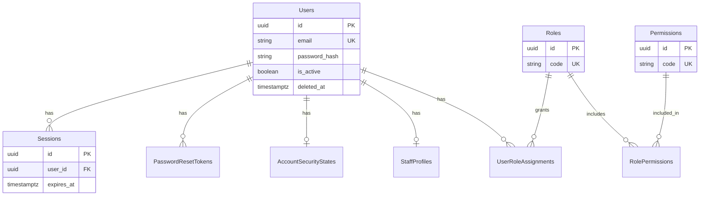
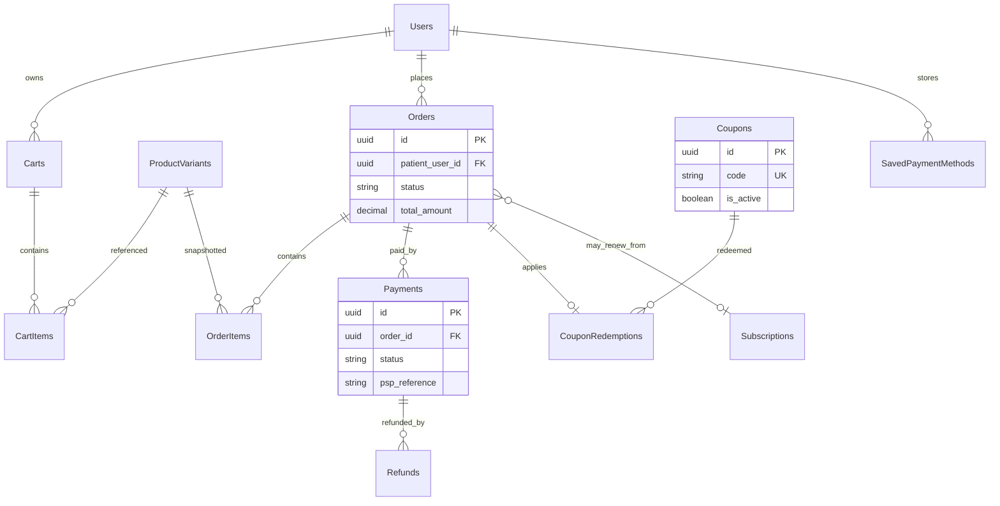
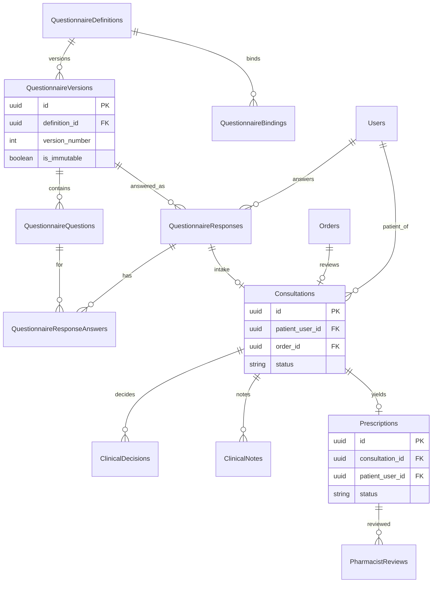
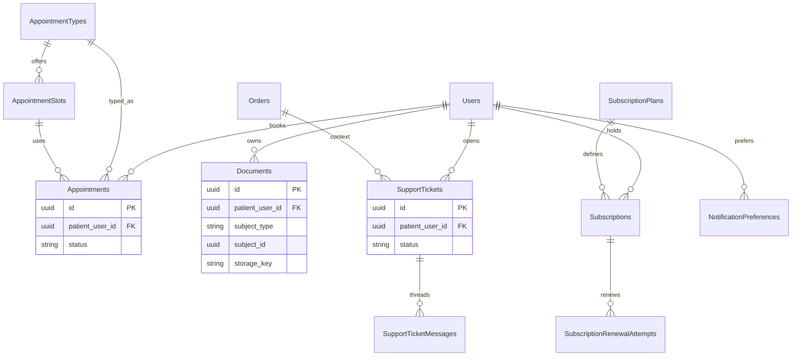
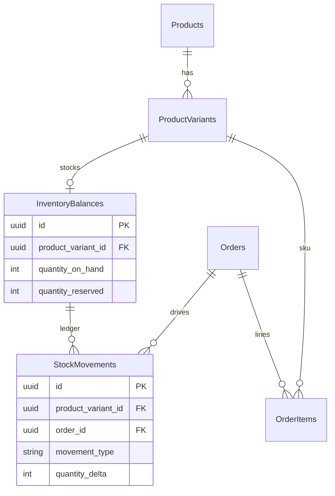
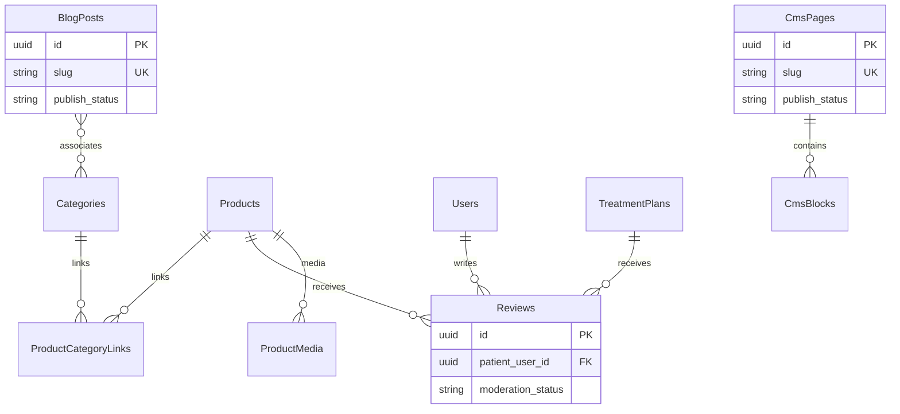
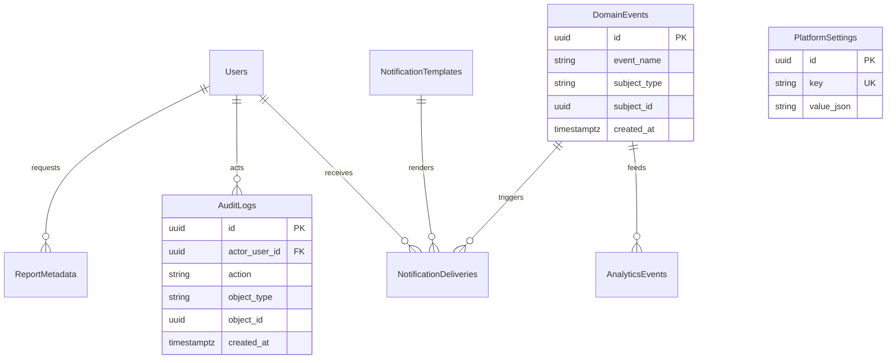
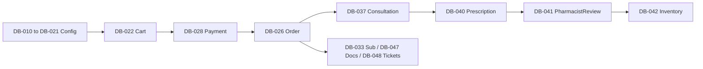

# 10 — Database Design

| Field | Value |
| --- | --- |
| Document | Database Design |
| Product | Clinexa |
| Version | 1.0 |
| Status | Draft for review |
| Primary market | United States |
| Audience | Data Architecture, Backend Engineering, Security, Product, Clinical Ops, Operations, Compliance, QA |
| Source of truth | [00 — Product Requirements Document](00-product-requirements-document.md) |
| Related docs | [01 — Project overview](01-project-overview.md), [02 — Business requirements](02-business-requirements.md), [03 — Functional requirements](03-functional-requirements.md), [04 — Non-functional requirements](04-non-functional-requirements.md), [05 — System architecture](05-system-architecture.md), [06 — User personas](06-user-personas.md), [07 — User journeys](07-user-journeys.md), [08 — Role permissions](08-role-permissions.md), [09 — Feature roadmap](09-feature-roadmap.md), [11 — API design](11-api-design.md), [12 — Authentication flow](12-authentication-flow.md), [13 — Security](13-security.md), [15 — Payment flow](15-payment-flow.md) |

This document is the **authoritative logical database design** for Clinexa Version 1. It defines the PostgreSQL system-of-record model that persists state for Store, Patient Portal, CRM, and Backend API—without prescribing SQL DDL, Prisma schemas, or migrations.

It expands [PRD §8](00-product-requirements-document.md)–[§14](00-product-requirements-document.md), operational rules from [02](02-business-requirements.md), functional modules and state machines from [03](03-functional-requirements.md), NFRs from [04](04-non-functional-requirements.md), and persistence choices from [05](05-system-architecture.md) (`ARCH-016`).

It does **not** define API contracts, authentication wire formats, encryption algorithms, UI screens, or ORM mappings. Those belong to docs 11–13, 20, and implementation repositories.

> **Compliance posture:** Controls are **HIPAA-aware** (PHI minimization, access control, auditability, encryption patterns). This document does **not** claim HIPAA, HITRUST, or SOC 2 Type II certification as V1 delivery gates (PRD §1.5; NFR-065).

> **Implementation independence:** Entity names and relationships are logical. Physical table DDL, indexes as SQL, and ORMs are deferred to implementation. Status vocabularies below are canonical and must match [03 §14](03-functional-requirements.md#14-state-machine-summary).

---

## Table of contents

1. [Introduction](#1-introduction)
2. [Database Design Principles](#2-database-design-principles)
3. [Entity Catalog](#3-entity-catalog)
4. [Relationship Matrix](#4-relationship-matrix)
5. [ER Diagrams](#5-er-diagrams)
6. [Naming Conventions](#6-naming-conventions)
7. [Data Lifecycle](#7-data-lifecycle)
8. [Indexing Strategy](#8-indexing-strategy)
9. [Data Integrity Rules](#9-data-integrity-rules)
10. [Performance Strategy](#10-performance-strategy)
11. [Security Considerations](#11-security-considerations)
12. [Database Traceability Matrix](#12-database-traceability-matrix)
13. [Revision History](#13-revision-history)

---

## 1. Introduction

### 1.1 Purpose

Define a production-grade relational data architecture so that:

- Backend API (`ARCH-014`) persists transactional domain state in a single managed **PostgreSQL** system of record (`ARCH-016`, NFR-134).
- Store, Patient Portal, and CRM share one consistent model with **patient isolation** and server-side RBAC (`FR-AUTH-004`/`005`, NFR-045/`046`, [08](08-role-permissions.md)).
- Clinical gates (questionnaire, doctor approval, pharmacist review) are enforceable as durable state—not client-side trust (`OR-01`–`OR-05`).
- Catalog, questionnaires, treatment plans, subscriptions, and consultation workflows remain **configuration data** without core schema redesign (`BO-5`, NFR-019).
- Engineering can implement schemas and migrations that trace to `DB-*` and `FR-*` IDs.

### 1.2 Scope

#### In scope (V1)

| Area | Coverage |
| --- | --- |
| Logical entities | Identity, catalog, commerce, clinical, inventory, portal, content, notifications, audit, settings, analytics/report metadata (`DB-001`–`DB-061`) |
| Surfaces served | Store Web (`ARCH-011`), Patient Portal (`ARCH-012`), CRM (`ARCH-013`), Backend API (`ARCH-014`) |
| Persistence model | Single-operator PostgreSQL SoR; object-storage metadata for documents/media; Redis session/cache/queue coordination (`ARCH-017`, `ARCH-018`) |
| Lifecycles | Canonical statuses from [03 §14](03-functional-requirements.md#14-state-machine-summary) |
| Traceability | Mapping to `BO`/`OR`/`AC-BR`, `FR-*`, `NFR-*`, `ARCH-*`, `ROLE-*`, `ROAD-*` |
| Roadmap Should entities | Coupons, Reviews, CMS/Blogs, Appointments, Analytics/Reports (`ROAD-022`–`026`) modeled now even if delivery lands GA–v1.2 |

#### Out of scope

| Area | Deferred to |
| --- | --- |
| SQL DDL, Prisma models, migrations | Implementation repositories |
| API route contracts and DTOs | [11 — API design](11-api-design.md) |
| Auth protocols, JWT wire format, password hashing algorithms | [12 — Authentication flow](12-authentication-flow.md) |
| Threat modeling, OWASP hardening, key management depth | [13 — Security](13-security.md) |
| PSP merchant configuration detail | [15 — Payment flow](15-payment-flow.md) |
| SaaS multi-org `tenant_id` tenancy | Not in V1 (PRD §11; RBAC-082) |
| ROAD-028 domains (telemedicine sessions, labs, insurance, wearables, marketplace clinics) | [09](09-feature-roadmap.md) / [24](24-future-features.md) |

### 1.3 Audience

| Audience | Use of this document |
| --- | --- |
| Data / PostgreSQL architects | Logical model, integrity, indexing, lifecycle, scaling path |
| Backend engineers | Entity boundaries, FK rules, immutability, status enums |
| Security / compliance | PHI classes, audit, retention, isolation |
| Product / clinical ops | Confirm data supports care-commerce gates |
| QA | Derive data fixtures and negative tests from integrity rules |

### 1.4 References

| Document | Role |
| --- | --- |
| [00 — PRD](00-product-requirements-document.md) | Single source of truth for product scope and business rules |
| [02 — Business requirements](02-business-requirements.md) | `BO-*`, `BP-*`, `OR-*`, `AC-BR-*`, `KPI-*` |
| [03 — Functional requirements](03-functional-requirements.md) | `FR-*`, CRUD matrix §11, domain events §12, state machines §14 |
| [04 — Non-functional requirements](04-non-functional-requirements.md) | Performance, security, backup, retention NFRs |
| [05 — System architecture](05-system-architecture.md) | PostgreSQL SoR, object storage, Redis, search, analytics ADRs |
| [08 — Role permissions](08-role-permissions.md) | Roles, permissions, SoD; DB ACLs are not a substitute for domain RBAC |
| [09 — Feature roadmap](09-feature-roadmap.md) | `ROAD-001`–`028` delivery sequencing |

### 1.5 ID conventions

| Prefix | Meaning |
| --- | --- |
| `DB-###` | Logical entity in this document |
| `FR-<MOD>-###` | Functional requirement ([03](03-functional-requirements.md)) |
| `OR-*` | Operational rule ([02](02-business-requirements.md)) |
| `NFR-###` | Non-functional requirement ([04](04-non-functional-requirements.md)) |
| `ARCH-###` | Architecture component/ADR ([05](05-system-architecture.md)) |
| `ROLE-###` | Product role ([08](08-role-permissions.md)) |

---

## 2. Database Design Principles

### 2.1 Normalization Strategy

| Principle | Application |
| --- | --- |
| Target form | Third Normal Form (3NF) for transactional entities |
| Controlled denormalization | Order line **price snapshots**, coupon discount amounts at redemption, published catalog SEO fields copied into search-friendly columns, and audit **actor role snapshot** at event time |
| Why snapshots | Catalog price/media edits must not rewrite historical paid orders (`FR-ORD-001`, `FR-CHK-003`) |
| Config vs runtime | Treatment plans, questionnaire definitions, subscription plans, and consultation workflows are configuration rows—not code forks (`BO-5`, NFR-019) |

### 2.2 Referential Integrity

- Every foreign key is declared and enforced in PostgreSQL.
- Prefer **RESTRICT** / **NO ACTION** on historical commerce and clinical parents (products, questionnaire versions, patients) over cascading hard deletes.
- Prefer **CASCADE** only for dependent children that have no independent lifecycle (e.g., cart items with cart, response answers with response).
- Application layer enforces **status transition legality**; database enforces structural existence and uniqueness.

### 2.3 Soft Deletes

Aligned with [03 §11](03-functional-requirements.md#11-crud-responsibility-matrix) and NFR-064:

| Pattern | Used for |
| --- | --- |
| `deleted_at` / deactivate | Users/patients (deactivate preferred), coupons (deactivate), appointments (soft-cancel) |
| Unpublish / archive | Products, categories, blogs, CMS, questionnaire versions |
| Terminal status only | Orders, subscriptions, tickets, prescriptions (no hard delete of paid/clinical history) |
| Documented hard-delete procedure | Rare admin/sys retention actions; audit rows retained |

### 2.4 Auditability

- Clinical and admin-sensitive actions record **actor user id**, **role(s) at time of action**, **action**, **timestamp**, **object type/id**, **outcome** (`OR-03`–`OR-06`, `OR-14`, FR-ADM-001/004, FR-DOC-004, RBAC-060+).
- Audit store is **append-only** and distinct from debug application logs (NFR-076).
- Intent: audit retention **≥ 1 year** (NFR-062); debug logs **≤ 90 days** (NFR-063)—logs are not the SoR for clinical accountability.

### 2.5 Versioning

| Domain | Rule |
| --- | --- |
| Questionnaires | Definitions versioned; versions immutable once answerable; responses reference version answered (`OR-02`, FR-QST-001/004) |
| Catalog | Publish/unpublish workflow; archived products retain historical order references (FR-PRD / FR §11) |
| Clinical config | Consultation workflows and treatment plans versioned or publish-gated (`OR-14`, FR-ADM-003) |
| Money | Order/payment amounts immutable after capture success |

### 2.6 Data Ownership

| Class | Owner | Isolation |
| --- | --- | --- |
| Patient-scoped PHI/PII | Owning patient user | Zero cross-patient read/write under normal auth (`FR-AUTH-005`, `OR-06`, NFR-046) |
| Platform configuration | Administrator / authorized roles | Not patient-owned; staff RBAC |
| Staff clinical work items | Platform + assigned clinicians | Case/queue scoped; Marketing/Content denied full Q answers and clinical notes by default (`OR-07`, FR-CRM-006) |
| Public catalog/content | Platform | Published subset only on Store |

V1 is a **single-platform operator**—no multi-org SaaS tenant key (PRD §11).

### 2.7 Immutable Records

Once written under business rules, do not mutate:

- Submitted questionnaire answers (lock on submit; `needs_info` creates follow-up path without rewriting locked answers without audit)
- Clinical decisions (approve/decline/request-info rows)
- Audit log rows
- Captured payment amounts and order money snapshots
- Coupon redemptions tied to successful payment

### 2.8 Healthcare Data Handling

- Store only PHI required for care-commerce journeys (NFR-058/059).
- Questionnaire answers and clinical notes are **high-sensitivity**; default deny for Marketing/Content (`FR-CRM-006`).
- Document bytes live in object storage; DB holds metadata + ACL (`ARCH-017`, NFR-022, FR-DOC-001).
- No raw PAN; PSP tokens only (`FR-PAY-001`, NFR-050).
- Marketing analytics exclude clinical free text (`FR-ANL-002`).

### 2.9 Performance

- Design for NFR browse/search/queue latencies (NFR-001–008) via indexes, pagination (NFR-114), and bounded page sizes (NFR-020).
- Nominal V1 load sizing: ≤5,000 products, ≤500 categories, ≤500 open consult cases, ≤100 aggregate read RPS (NFR §2.1).
- Hot paths: auth lookup, published catalog, cart validate, checkout finalize, consultation queue list, order-by-patient.

### 2.10 Scalability

- Vertical scale path for primary DB without schema redesign (NFR-018).
- Catalog growth via data/config rows (NFR-019).
- Future: partitioning/archive for audit, domain events, and aged orders; read replicas if needed—V1 assumes single primary (+ standby where supported) (ARCH-109, NFR-029).

---

## 3. Entity Catalog

Logical primary key for all entities unless noted: **UUID** `id`.

Retention notes use intents from NFR-062/064 and FR §11; numeric legal holds are not defined in V1 planning and must be finalized in compliance runbooks.

### 3.1 Identity and access

#### DB-001 Users

| Field | Detail |
| --- | --- |
| Purpose | Unified identity for patients and staff; Guest is unauthenticated (no row until register) |
| Primary key | `id` (UUID) |
| Relationships | 1:N Sessions, PasswordResetTokens; 1:N UserRoleAssignments; 0:1 StaffProfiles; 1:N patient-owned Orders, Subscriptions, Documents, Appointments, Tickets, QuestionnaireResponses |
| Business rules | Email unique (normalized); patients self-register (`FR-AUTH-001`); staff provisioned by Admin (`FR-ADM-001`); deactivate preferred over hard delete; password hashes only—no plaintext |
| Retention | Deactivated accounts retained per policy; clinical history remains attributable |
| Trace | FR-AUTH-001–006, FR-ADM-001, ARCH-040/041, ROLE-002–009 |

#### DB-002 Roles

| Field | Detail |
| --- | --- |
| Purpose | Catalog of product roles (`ROLE-001` Guest is not a persisted staff assignment; Patient–Administrator are) |
| Primary key | `id` |
| Relationships | M:N Permissions via RolePermissions; M:N Users via UserRoleAssignments |
| Business rules | Dual-role only via explicit assignment (`RBAC-030`); Admin configures with audit (`FR-ADM-001`) |
| Retention | Retain role definitions; assignment history via audit |
| Trace | FR-AUTH-004, FR-ADM-001, [08](08-role-permissions.md) ROLE-002–009 |

#### DB-003 Permissions

| Field | Detail |
| --- | --- |
| Purpose | Capability dictionary aligned to `PERM-<MOD>-###` |
| Primary key | `id` |
| Relationships | M:N Roles via RolePermissions |
| Business rules | Enforcement is server-side; JWT permission claims are advisory only ([08](08-role-permissions.md) §16) |
| Retention | Retain; changes audited |
| Trace | FR-AUTH-004, FR-ADM-001, ARCH-041 |

#### DB-004 RolePermissions

| Field | Detail |
| --- | --- |
| Purpose | Many-to-many join Roles ↔ Permissions |
| Primary key | `id` or composite (`role_id`, `permission_id`) |
| Relationships | N:1 Role; N:1 Permission |
| Business rules | Unique (`role_id`, `permission_id`); Admin changes audited (`FR-ADM-004`) |
| Retention | Soft-replace via new assignments; audit keeps history |
| Trace | FR-ADM-001/004 |

#### DB-005 UserRoleAssignments

| Field | Detail |
| --- | --- |
| Purpose | Assign one or more staff/patient roles to a user |
| Primary key | `id` |
| Relationships | N:1 User; N:1 Role |
| Business rules | Patient role for portal users; staff roles mutually constrained by SoD (`FR-SUP-004`, RBAC-020+); API loads current assignments at authorization time |
| Retention | Prefer deactivate assignment over hard delete; audit |
| Trace | FR-ADM-001, FR-AUTH-004, OR-06 |

#### DB-006 Sessions

| Field | Detail |
| --- | --- |
| Purpose | Server-side session record for revocation, idle timeout, and JWT `sessionId` correlation |
| Primary key | `id` |
| Relationships | N:1 User |
| Business rules | Password reset invalidates sessions (`FR-AUTH-003`); Redis may cache but DB is revocation authority |
| Retention | Expire/cleanup jobs (architecture cleanup workers); retain short window for abuse analysis |
| Trace | FR-AUTH-002/003, NFR-041/044, ARCH-018 |

#### DB-007 PasswordResetTokens

| Field | Detail |
| --- | --- |
| Purpose | Time-limited single-use password reset tokens |
| Primary key | `id` |
| Relationships | N:1 User |
| Business rules | Store hash only; expire by TTL; single use; trigger session invalidation on success |
| Retention | Delete/expire after use or TTL |
| Trace | FR-AUTH-003, BP-08 |

#### DB-008 AccountSecurityStates

| Field | Detail |
| --- | --- |
| Purpose | Lockout counters, last failed login, abuse-protection state |
| Primary key | `id` (or 1:1 `user_id`) |
| Relationships | 1:1 User |
| Business rules | Basic lockout/abuse protections (`FR-AUTH-006`) |
| Retention | Rolling counters; retain lock events per security policy |
| Trace | FR-AUTH-006 |

#### DB-009 StaffProfiles

| Field | Detail |
| --- | --- |
| Purpose | Optional clinician/ops profile attributes for Doctor/Pharmacist/Support/Ops (display name, credentials display, CRM preferences)—not a separate person identity |
| Primary key | `id` |
| Relationships | 1:1 User |
| Business rules | Doctors/Pharmacists are Users with `ROLE-003`/`ROLE-004`; no independent Doctor/Pharmacist person tables |
| Retention | Follows user deactivate policy |
| Trace | ARCH-050, FR-CRM-001–004, ROLE-003/004 |

### 3.2 Catalog and clinical configuration

#### DB-010 Categories

| Field | Detail |
| --- | --- |
| Purpose | Configurable Store categories with SEO metadata |
| Primary key | `id` |
| Relationships | M:N Products via ProductCategoryLinks; optional Blog associations |
| Business rules | Create/update/publish via CRM without deploy (`FR-CAT-001/002`); only published visible on Store (`FR-CAT-003`); demo categories are seed data (`FR-CAT-004`) |
| Retention | Unpublish/archive preferred |
| Trace | FR-CAT-001–004, ARCH-043, ROAD-004 |

#### DB-011 Products

| Field | Detail |
| --- | --- |
| Purpose | Sellable catalog offerings with Rx-eligibility, pricing base, media, SEO, publish state |
| Primary key | `id` |
| Relationships | 1:N ProductVariants, ProductMedia; M:N Categories; bindings to questionnaires/treatment plans |
| Business rules | Rx flag drives clinical intake and order states (`FR-PRD-004`); only published on Store (`FR-PRD-003`); Admin publish without code (`FR-PRD-002`) |
| Retention | Archive/unpublish; retain for historical order FKs |
| Trace | FR-PRD-001–005, ARCH-042, ROAD-004 |

#### DB-012 ProductVariants

| Field | Detail |
| --- | --- |
| Purpose | SKU-level variants (size/strength/pack) with price and fulfillability |
| Primary key | `id` |
| Relationships | N:1 Product; 0:1 InventoryBalance; referenced by CartItems, OrderItems, StockMovements |
| Business rules | Inventory tracked per fulfillable SKU (`FR-INV-001`); checkout revalidates published state |
| Retention | Archive with product; historical order lines keep snapshot + variant FK |
| Trace | FR-PRD-001, FR-INV-001 |

#### DB-013 ProductMedia

| Field | Detail |
| --- | --- |
| Purpose | Media metadata (object-storage keys, alt, sort order) for products |
| Primary key | `id` |
| Relationships | N:1 Product |
| Business rules | Bytes in object storage; DB stores references only (NFR-022) |
| Retention | Soft-delete with product media updates |
| Trace | FR-PRD-001, ARCH-017 |

#### DB-014 ProductCategoryLinks

| Field | Detail |
| --- | --- |
| Purpose | Many-to-many Products ↔ Categories |
| Primary key | `id` or composite |
| Relationships | N:1 Product; N:1 Category |
| Business rules | Unique pair; supports multi-category listing |
| Retention | Cascade with unlink on archive policies |
| Trace | FR-PRD-001, FR-CAT-001 |

#### DB-015 TreatmentPlans

| Field | Detail |
| --- | --- |
| Purpose | Configurable therapy offerings tying products/intervals/workflows for subscriptions and clinical paths |
| Primary key | `id` |
| Relationships | Links to Products/SubscriptionPlans/QuestionnaireBindings/ConsultationWorkflowConfigs |
| Business rules | Configuration-not-code (`BO-5`); publish validation before unsafe Rx go-live (`OR-14`, FR-ADM-003) |
| Retention | Archive preferred |
| Trace | FR-QST-002, FR-SUB-001, FR-CRM-007, glossary Treatment plan |

#### DB-016 TreatmentPlanLinks

| Field | Detail |
| --- | --- |
| Purpose | Join treatment plans to products and/or subscription plans |
| Primary key | `id` |
| Relationships | N:1 TreatmentPlan; optional N:1 Product / SubscriptionPlan |
| Business rules | Supports catalog-agnostic composition |
| Retention | Follow treatment plan archive |
| Trace | FR-SUB-001, FR-CRM-007 |

#### DB-017 QuestionnaireDefinitions

| Field | Detail |
| --- | --- |
| Purpose | Named questionnaire family (logical questionnaire independent of version) |
| Primary key | `id` |
| Relationships | 1:N QuestionnaireVersions; 1:N QuestionnaireBindings |
| Business rules | Configurable via CRM (`FR-QST-001`) |
| Retention | Archive family; retain versions that have responses |
| Trace | FR-QST-001, ARCH-049, ROAD-005 |

#### DB-018 QuestionnaireVersions

| Field | Detail |
| --- | --- |
| Purpose | Immutable definition revision once published for answering |
| Primary key | `id` |
| Relationships | N:1 QuestionnaireDefinition; 1:N QuestionnaireQuestions; referenced by QuestionnaireResponses |
| Business rules | Responses **must** reference version answered (`OR-02`); new edits create new version (`FR-QST-001`) |
| Retention | Never hard-delete answered versions |
| Trace | OR-02, FR-QST-001/004 |

#### DB-019 QuestionnaireQuestions

| Field | Detail |
| --- | --- |
| Purpose | Questions, types, order, and V1 branching metadata within a version |
| Primary key | `id` |
| Relationships | N:1 QuestionnaireVersion; 1:N ResponseAnswers |
| Business rules | Branching as designed for V1 (`FR-QST-006` Could); immutable with parent version |
| Retention | With version |
| Trace | FR-QST-001/006 |

#### DB-020 QuestionnaireBindings

| Field | Detail |
| --- | --- |
| Purpose | Bind questionnaire definition/version policy to products, treatment plans, or consultation workflows |
| Primary key | `id` |
| Relationships | N:1 QuestionnaireDefinition (and optional pinned version); polymorphic or typed FKs to Product / TreatmentPlan / ConsultationWorkflowConfig |
| Business rules | Required for Rx-eligible finalize path (`FR-QST-002/003`) |
| Retention | Archive with config publish history |
| Trace | FR-QST-002/003, OR-01 |

#### DB-021 ConsultationWorkflowConfigs

| Field | Detail |
| --- | --- |
| Purpose | Configurable consultation workflow settings (publish-gated clinical config) |
| Primary key | `id` |
| Relationships | Optional bindings to questionnaires/treatment plans; used when creating Consultations |
| Business rules | Admin configure/publish without deploy (`FR-CRM-007`, FR-ADM-002/003); validate before publish (`OR-14`) |
| Retention | Archive preferred |
| Trace | FR-CRM-007, FR-ADM-002/003, OR-14 |

### 3.3 Commerce

#### DB-022 Carts

| Field | Detail |
| --- | --- |
| Purpose | Guest or patient shopping cart |
| Primary key | `id` |
| Relationships | 0:1 User (null for guest); 1:N CartItems; optional staged coupon code |
| Business rules | Merge/preserve across auth per policy (`FR-CART-004`); validate lines against published catalog (`FR-CART-002`) |
| Retention | Stale cart cleanup jobs |
| Trace | FR-CART-001–004, ARCH-044, ROAD-007 |

#### DB-023 CartItems

| Field | Detail |
| --- | --- |
| Purpose | Cart line items referencing variants/qty |
| Primary key | `id` |
| Relationships | N:1 Cart; N:1 ProductVariant |
| Business rules | Qty ≥ 1; remove/update allowed pre-checkout |
| Retention | Cascade with cart |
| Trace | FR-CART-001 |

#### DB-024 Coupons

| Field | Detail |
| --- | --- |
| Purpose | Percent/fixed coupons with validity windows, usage limits, catalog scope |
| Primary key | `id` |
| Relationships | 1:N CouponRedemptions; scoped to products/categories as configured |
| Business rules | Server-side validation at checkout (`FR-CPN-002`); deactivate preferred (`FR-CPN-001`) |
| Retention | Deactivate; retain for redemption history |
| Trace | FR-CPN-001–003, OR-13 adjacent, ROAD-022 |

#### DB-025 CouponRedemptions

| Field | Detail |
| --- | --- |
| Purpose | Record successful coupon use on paid orders |
| Primary key | `id` |
| Relationships | N:1 Coupon; N:1 Order; N:1 User (patient) |
| Business rules | Record on successful payment (`FR-CPN-003`); immutable |
| Retention | Retain with order history |
| Trace | FR-CPN-003 |

#### DB-026 Orders

| Field | Detail |
| --- | --- |
| Purpose | Canonical commerce + clinical order aggregate |
| Primary key | `id` |
| Relationships | N:1 User (patient); 1:N OrderItems, Payments, Refunds; optional Consultation, Prescription, Subscription, CouponRedemption |
| Business rules | Canonical statuses (`FR-ORD-002`, OR-08); Rx blocked until doctor + pharmacist rules (`FR-ORD-003`); non-Rx skip clinical states (`FR-ORD-004`, OR-09); no hard delete of paid clinical orders |
| Key attributes (logical) | `status`, money totals snapshot, clinical_prerequisite flags, shipping fields, timestamps |
| Retention | Retain indefinitely for clinical/commerce audit intent; cancel/refund via status |
| Trace | FR-ORD-001–006, ARCH-047, ROAD-010 |

#### DB-027 OrderItems

| Field | Detail |
| --- | --- |
| Purpose | Line items with **price snapshots**, qty, Rx-eligibility snapshot, variant reference |
| Primary key | `id` |
| Relationships | N:1 Order; N:1 ProductVariant (historical FK) |
| Business rules | Snapshot unit price, discount allocation, tax/shipping share as designed; catalog edits do not mutate lines |
| Retention | With order |
| Trace | FR-ORD-001, FR-CHK-003 |

#### DB-028 Payments

| Field | Detail |
| --- | --- |
| Purpose | Payment attempts/outcomes for orders and subscription renewals |
| Primary key | `id` |
| Relationships | N:1 Order and/or Subscription; optional SavedPaymentMethod; 1:N Refunds |
| Business rules | Statuses: `pending`, `authorized_or_captured`, `failed`, `refunded` (FR §14); PSP tokens only; drives order/subscription transitions (`FR-PAY-002`) |
| Retention | Retain financial history |
| Trace | FR-PAY-001–005, ARCH-046, ROAD-009 |

#### DB-029 Refunds

| Field | Detail |
| --- | --- |
| Purpose | Full/partial refunds per OR-11 tiers |
| Primary key | `id` |
| Relationships | N:1 Payment; N:1 Order; optional actor User (staff) |
| Business rules | Clinical decline pre-fulfillment default eligible captured refund; post-fulfillment manual + reason; coupon-adjusted; may trigger inventory restock (`OR-11`, FR-PAY-003) |
| Retention | Retain with payments/orders |
| Trace | OR-11, FR-PAY-003, FR-ORD-006, AC-BR-10 |

#### DB-030 SavedPaymentMethods

| Field | Detail |
| --- | --- |
| Purpose | Patient saved PSP payment method tokens for renewals |
| Primary key | `id` |
| Relationships | N:1 User; referenced by Subscriptions/Payments |
| Business rules | No PAN; token + last4/brand metadata only (`FR-PAY-001/004`) |
| Retention | Soft-delete on patient remove; retain references needed for historical payments |
| Trace | FR-PAY-004, FR-SUB-002, FR-PRT-004 |

#### DB-031 PaymentWebhookIdempotencyKeys

| Field | Detail |
| --- | --- |
| Purpose | Idempotency keys for at-least-once PSP webhooks |
| Primary key | `id` or unique `idempotency_key` |
| Relationships | Optional link to Payment |
| Business rules | Unique key; safe replay (`FR-PAY-002`, NFR-033) |
| Retention | Retain long enough to cover PSP retry windows; archive thereafter |
| Trace | FR-PAY-002, NFR-033 |

### 3.4 Subscriptions

#### DB-032 SubscriptionPlans

| Field | Detail |
| --- | --- |
| Purpose | Configurable plans: interval, pricing, product/treatment plan linkage |
| Primary key | `id` |
| Relationships | Links via TreatmentPlanLinks; 1:N Subscriptions |
| Business rules | CRM configurable (`FR-SUB-001`); publish validation |
| Retention | Archive; active subscriptions keep plan FK |
| Trace | FR-SUB-001, ARCH-048, ROAD-019 |

#### DB-033 Subscriptions

| Field | Detail |
| --- | --- |
| Purpose | Patient subscription instances |
| Primary key | `id` |
| Relationships | N:1 User; N:1 SubscriptionPlan; optional SavedPaymentMethod; 1:N RenewalAttempts / renewal Orders |
| Business rules | Statuses: `active`, `renewing`, `past_due`, `reassessment_required`, `cancelled` (FR §14, OR-10); cancel stops future renewals; existing orders follow order rules; Rx reassessment hooks (`FR-SUB-003/005`) |
| Retention | Retain history on cancel |
| Trace | FR-SUB-001–005, ROAD-019 |

#### DB-034 SubscriptionRenewalAttempts

| Field | Detail |
| --- | --- |
| Purpose | Scheduled renewal charge attempts and outcomes |
| Primary key | `id` |
| Relationships | N:1 Subscription; optional N:1 Payment; optional N:1 Order (renewal order) |
| Business rules | Failure → past_due/grace + notify (`FR-SUB-003`); success may create renewal order and reassessment requirement |
| Retention | Retain for subscription health KPIs |
| Trace | FR-SUB-002/003/005, KPI-04/05 |

### 3.5 Clinical

#### DB-035 QuestionnaireResponses

| Field | Detail |
| --- | --- |
| Purpose | Patient intake artifact bound to a questionnaire version |
| Primary key | `id` |
| Relationships | N:1 User; N:1 QuestionnaireVersion; optional Order/Consultation; 1:N Answers |
| Business rules | Statuses: `in_progress`, `submitted`, `needs_info`; immutable after submit except controlled needs_info flow (`FR-QST-004/005`, OR-02) |
| Retention | Clinical retention; no patient hard delete |
| Trace | FR-QST-003–005, OR-01/02, ROAD-005 |

#### DB-036 QuestionnaireResponseAnswers

| Field | Detail |
| --- | --- |
| Purpose | Per-question answers for a response |
| Primary key | `id` |
| Relationships | N:1 QuestionnaireResponse; N:1 QuestionnaireQuestion |
| Business rules | PHI; Marketing/Content default deny (`OR-07`); immutable after parent submit |
| Retention | With response |
| Trace | FR-QST-004, FR-CRM-006 |

#### DB-037 Consultations

| Field | Detail |
| --- | --- |
| Purpose | CRM clinical case/work item linking patient, questionnaire, and order |
| Primary key | `id` |
| Relationships | N:1 User (patient); N:1 Order; optional QuestionnaireResponse; optional assignee Staff User; 1:N ClinicalDecisions, ClinicalNotes; optional Prescription |
| Business rules | Doctor queue: approve / decline / request information with audit (`FR-CRM-002`); drives order clinical states |
| Retention | Retain clinical history |
| Trace | FR-CRM-002, glossary Consultation, ROAD-011, JRN-011–014 |

#### DB-038 ClinicalDecisions

| Field | Detail |
| --- | --- |
| Purpose | Immutable decision records (approve, decline, request_info) |
| Primary key | `id` |
| Relationships | N:1 Consultation; N:1 Actor User (doctor) |
| Business rules | Audited; payment never substitutes (`OR-03`); decline triggers refund path when pre-fulfillment (`OR-11`) |
| Retention | Immutable clinical retention |
| Trace | FR-CRM-002, OR-03/04, AC-BR-02/10 |

#### DB-039 ClinicalNotes

| Field | Detail |
| --- | --- |
| Purpose | Clinician notes on consultation/case |
| Primary key | `id` |
| Relationships | N:1 Consultation; N:1 Author User |
| Business rules | Default deny Marketing/Content (`FR-CRM-006`, OR-07) |
| Retention | Clinical retention |
| Trace | FR-CRM-006, OR-07 |

#### DB-040 Prescriptions

| Field | Detail |
| --- | --- |
| Purpose | Prescription created/updated only after doctor approval |
| Primary key | `id` |
| Relationships | N:1 User (patient); N:1 Consultation; N:1 Order (context); 1:N PharmacistReviews; optional Documents |
| Business rules | Cannot precede approval (`FR-CRM-003`, OR-04); patient sees status-appropriate info (`FR-PRT-003`); no patient delete |
| Retention | Clinical retention |
| Trace | FR-CRM-003, OR-04, ROAD-012 |

#### DB-041 PharmacistReviews

| Field | Detail |
| --- | --- |
| Purpose | Pharmacist review status before Rx fulfillment completion |
| Primary key | `id` |
| Relationships | N:1 Prescription; N:1 Pharmacist User; N:1 Order |
| Business rules | Required before Rx fulfillment completion in V1 (`FR-CRM-004`, OR-05, FR-ORD-003) |
| Retention | Clinical retention |
| Trace | FR-CRM-004, OR-05, ROAD-013 |

### 3.6 Inventory and fulfillment

#### DB-042 InventoryBalances

| Field | Detail |
| --- | --- |
| Purpose | Current stock level per fulfillable SKU |
| Primary key | `id` |
| Relationships | 1:1 ProductVariant; 1:N StockMovements |
| Business rules | Prevent oversell per settings policy (`FR-INV-003`, FR-SET-001); low-stock alerts (`FR-INV-004`) |
| Retention | Current balance; history via movements |
| Trace | FR-INV-001–005, ARCH-064, ROAD-014 |

#### DB-043 StockMovements

| Field | Detail |
| --- | --- |
| Purpose | Reserve, decrement, restock, manual adjustment ledger |
| Primary key | `id` |
| Relationships | N:1 InventoryBalance / ProductVariant; optional Order; optional actor User |
| Business rules | Tied to order lifecycle (`FR-INV-002`); restock on refund/cancel when applicable (`FR-INV-005`); manual adjust audited |
| Retention | Retain movement history for reports |
| Trace | FR-INV-002/005, OR-12 |

### 3.7 Portal and support

#### DB-044 AppointmentTypes

| Field | Detail |
| --- | --- |
| Purpose | Configurable appointment types |
| Primary key | `id` |
| Relationships | 1:N AppointmentSlots, Appointments |
| Business rules | Scheduling only—no video (`FR-APT-004`) |
| Retention | Archive types carefully if referenced |
| Trace | FR-APT-001, ROAD-025 |

#### DB-045 AppointmentSlots

| Field | Detail |
| --- | --- |
| Purpose | Bookable slot configuration / capacity windows |
| Primary key | `id` |
| Relationships | N:1 AppointmentType; 1:N Appointments |
| Business rules | Conflict validation before confirm (`FR-APT-003`) |
| Retention | Soft-close past slots |
| Trace | FR-APT-001/003 |

#### DB-046 Appointments

| Field | Detail |
| --- | --- |
| Purpose | Patient bookings |
| Primary key | `id` |
| Relationships | N:1 User; N:1 AppointmentType; optional Slot; optional staff User |
| Business rules | Statuses: `booked`, `confirmed`, `completed`, `cancelled`, `no_show` (FR §14); soft-cancel |
| Retention | Retention policy (FR §11) |
| Trace | FR-APT-001–004, ARCH-051, ROAD-025 |

#### DB-047 Documents

| Field | Detail |
| --- | --- |
| Purpose | Patient document metadata + ACL; bytes in object storage |
| Primary key | `id` |
| Relationships | N:1 User (patient); polymorphic link to Order/Prescription/Consultation; optional uploader User |
| Business rules | Patient view/download own (`FR-DOC-002`); staff upload where permitted (`FR-DOC-003`); audit PHI-sensitive views/downloads (`FR-DOC-004`) |
| Retention | Adm/Sys per retention; audit retained |
| Trace | FR-DOC-001–004, ARCH-054, ROAD-016 |

#### DB-048 SupportTickets

| Field | Detail |
| --- | --- |
| Purpose | Patient support cases |
| Primary key | `id` |
| Relationships | N:1 User (patient); optional Order; 1:N Messages; optional assignee Support User |
| Business rules | Statuses: `open`, `in_progress`, `waiting_on_patient`, `resolved`, `closed`; Support cannot approve Rx (`FR-SUP-004`); refunds only when policy allows (`FR-SUP-005`) |
| Retention | Close/resolve; retain history |
| Trace | FR-SUP-001–005, ARCH-059, ROAD-018 |

#### DB-049 SupportTicketMessages

| Field | Detail |
| --- | --- |
| Purpose | Ticket thread for patient comments and staff triage notes |
| Primary key | `id` |
| Relationships | N:1 SupportTicket; N:1 Author User |
| Business rules | Supports triage/resolve collaboration (`FR-SUP-002`) |
| Retention | With ticket |
| Trace | FR-SUP-001/002 |

### 3.8 Content and trust

#### DB-050 BlogPosts

| Field | Detail |
| --- | --- |
| Purpose | Blog content authored in CRM, rendered on Store |
| Primary key | `id` |
| Relationships | Optional associations to Categories/TreatmentPlans; SEO fields |
| Business rules | Draft not public (`FR-BLG-003`); Content/Admin manage (`FR-BLG-001`); no clinical PHI access via content role (`FR-BLG-004`) |
| Retention | Unpublish/archive preferred |
| Trace | FR-BLG-001–004, ARCH-060, ROAD-024 |

#### DB-051 CmsPages

| Field | Detail |
| --- | --- |
| Purpose | Store pages managed without deploys |
| Primary key | `id` |
| Relationships | 1:N CmsBlocks (optional) |
| Business rules | Only published on Store (`FR-CMS-002`); RBAC (`FR-CMS-003`) |
| Retention | Unpublish/archive |
| Trace | FR-CMS-001–003, ARCH-061, ROAD-024 |

#### DB-052 CmsBlocks

| Field | Detail |
| --- | --- |
| Purpose | Banners, FAQs, content blocks |
| Primary key | `id` |
| Relationships | Optional N:1 CmsPage; typed block kind |
| Business rules | Publish-gated; Content/Admin (`FR-CMS-001`) |
| Retention | Unpublish/archive |
| Trace | FR-CMS-001 |

#### DB-053 Reviews

| Field | Detail |
| --- | --- |
| Purpose | Product/treatment reviews with moderation |
| Primary key | `id` |
| Relationships | N:1 User; N:1 Product or TreatmentPlan; optional Order (eligibility) |
| Business rules | Eligible submit (`FR-REV-001`); pending until moderated (`FR-REV-002`, OR-13); CRM approve/reject (`FR-REV-003`); Store shows approved only (`FR-STO-005`) |
| Retention | Retain moderated history |
| Trace | FR-REV-001–003, OR-13, ROAD-023 |

### 3.9 Cross-cutting administration

#### DB-054 NotificationTemplates

| Field | Detail |
| --- | --- |
| Purpose | Email templates for domain events |
| Primary key | `id` |
| Relationships | Referenced by NotificationDeliveries; settings hooks |
| Business rules | Event-driven from API (`FR-NTF-002`); Admin/settings configurable hooks (`FR-SET-001`) |
| Retention | Version/archive templates |
| Trace | FR-NTF-001/002, FR-SET-001, ARCH-055, ROAD-017 |

#### DB-055 NotificationDeliveries

| Field | Detail |
| --- | --- |
| Purpose | Delivery attempts and outcomes (dedupe by domain event key) |
| Primary key | `id` |
| Relationships | N:1 User (recipient); optional template; polymorphic subject; optional DomainEvent |
| Business rules | Retry with backoff (`FR-NTF-003`); dedupe (NFR-039); avoid PHI in logs |
| Retention | Operational retention; not substitute for audit of clinical acts |
| Trace | FR-NTF-001–003, NFR-039 |

#### DB-056 NotificationPreferences

| Field | Detail |
| --- | --- |
| Purpose | Patient preferences for non-mandatory notifications |
| Primary key | `id` |
| Relationships | 1:1 or 1:N per channel/event family on User |
| Business rules | Should-level Portal manage (`FR-NTF-004`); mandatory transactional may still send |
| Retention | With user |
| Trace | FR-NTF-004 |

#### DB-057 AuditLogs

| Field | Detail |
| --- | --- |
| Purpose | Append-only clinical/admin/security audit trail |
| Primary key | `id` |
| Relationships | Polymorphic object_type/object_id; actor_user_id; role snapshot |
| Business rules | Immutable; distinct from debug logs; covers clinical decisions, role changes, settings, PHI document access, sensitive report access |
| Retention | ≥ 1 year intent (NFR-062) |
| Trace | NFR-057/062/076, FR-ADM-004, FR-DOC-004, FR-SET-003, RBAC-058 |

#### DB-058 PlatformSettings

| Field | Detail |
| --- | --- |
| Purpose | Admin-configurable policy settings (oversell policy, review moderation mode, notification template/trigger hooks, and boolean capability toggles) |
| Primary key | `id` or unique `key` |
| Relationships | None required; consumed server-side |
| Business rules | Server-side enforcement (`FR-SET-002`); changes audited (`FR-SET-003`); default moderate-before-publish (`FR-SET-004`). **Feature-flag-style toggles are settings keys under this entity—not a separate product feature-flag platform.** |
| Retention | Keep current + audit history of changes |
| Trace | FR-SET-001–004, ARCH-058 |

#### DB-059 DomainEvents

| Field | Detail |
| --- | --- |
| Purpose | Durable outbox/event log of business domain events ([03 §12](03-functional-requirements.md#12-domain-events)) |
| Primary key | `id` |
| Relationships | Polymorphic subject; producer module; consumers via workers |
| Business rules | At-least-once to workers; drives NTF, analytics, search reindex hooks |
| Retention | Archive after consumers succeed; keep enough for replay/debug |
| Trace | FR §12, ARCH domain events, NFR-038 |

#### DB-060 AnalyticsEvents

| Field | Detail |
| --- | --- |
| Purpose | PHI-minimized funnel/ops analytics events and aggregates feed |
| Primary key | `id` |
| Relationships | Derived from DomainEvents; optional patient id only when required and access-controlled |
| Business rules | Exclude unnecessary PHI and clinical free text (`FR-ANL-002`); CRM dashboards (`FR-ANL-001/003`) |
| Retention | Aggregate retention per analytics policy |
| Trace | FR-ANL-001–003, ARCH-024, ROAD-026 |

#### DB-061 ReportMetadata

| Field | Detail |
| --- | --- |
| Purpose | Report definitions and async export job metadata (exports to object storage) |
| Primary key | `id` |
| Relationships | Requesting User; object-storage export key |
| Business rules | RBAC on report access; minimize PHI columns (`FR-RPT-002`); large exports async (NFR-012); sensitive access audited |
| Retention | Export GC per cleanup jobs; definitions retained |
| Trace | FR-RPT-001–003, NFR-011/012, ROAD-026 |

### 3.10 Entity index

| ID | Entity | Domain |
| --- | --- | --- |
| DB-001 | Users | Identity |
| DB-002 | Roles | Identity |
| DB-003 | Permissions | Identity |
| DB-004 | RolePermissions | Identity |
| DB-005 | UserRoleAssignments | Identity |
| DB-006 | Sessions | Identity |
| DB-007 | PasswordResetTokens | Identity |
| DB-008 | AccountSecurityStates | Identity |
| DB-009 | StaffProfiles | Identity |
| DB-010 | Categories | Catalog |
| DB-011 | Products | Catalog |
| DB-012 | ProductVariants | Catalog |
| DB-013 | ProductMedia | Catalog |
| DB-014 | ProductCategoryLinks | Catalog |
| DB-015 | TreatmentPlans | Catalog |
| DB-016 | TreatmentPlanLinks | Catalog |
| DB-017 | QuestionnaireDefinitions | Clinical config |
| DB-018 | QuestionnaireVersions | Clinical config |
| DB-019 | QuestionnaireQuestions | Clinical config |
| DB-020 | QuestionnaireBindings | Clinical config |
| DB-021 | ConsultationWorkflowConfigs | Clinical config |
| DB-022 | Carts | Commerce |
| DB-023 | CartItems | Commerce |
| DB-024 | Coupons | Commerce |
| DB-025 | CouponRedemptions | Commerce |
| DB-026 | Orders | Commerce |
| DB-027 | OrderItems | Commerce |
| DB-028 | Payments | Commerce |
| DB-029 | Refunds | Commerce |
| DB-030 | SavedPaymentMethods | Commerce |
| DB-031 | PaymentWebhookIdempotencyKeys | Commerce |
| DB-032 | SubscriptionPlans | Subscriptions |
| DB-033 | Subscriptions | Subscriptions |
| DB-034 | SubscriptionRenewalAttempts | Subscriptions |
| DB-035 | QuestionnaireResponses | Clinical |
| DB-036 | QuestionnaireResponseAnswers | Clinical |
| DB-037 | Consultations | Clinical |
| DB-038 | ClinicalDecisions | Clinical |
| DB-039 | ClinicalNotes | Clinical |
| DB-040 | Prescriptions | Clinical |
| DB-041 | PharmacistReviews | Clinical |
| DB-042 | InventoryBalances | Inventory |
| DB-043 | StockMovements | Inventory |
| DB-044 | AppointmentTypes | Portal |
| DB-045 | AppointmentSlots | Portal |
| DB-046 | Appointments | Portal |
| DB-047 | Documents | Portal |
| DB-048 | SupportTickets | Portal |
| DB-049 | SupportTicketMessages | Portal |
| DB-050 | BlogPosts | Content |
| DB-051 | CmsPages | Content |
| DB-052 | CmsBlocks | Content |
| DB-053 | Reviews | Content |
| DB-054 | NotificationTemplates | Admin |
| DB-055 | NotificationDeliveries | Admin |
| DB-056 | NotificationPreferences | Admin |
| DB-057 | AuditLogs | Admin |
| DB-058 | PlatformSettings | Admin |
| DB-059 | DomainEvents | Admin |
| DB-060 | AnalyticsEvents | Admin |
| DB-061 | ReportMetadata | Admin |

---

## 4. Relationship Matrix

### 4.1 One-to-One

| Parent | Child | Notes |
| --- | --- | --- |
| Users | AccountSecurityStates | Lockout state |
| Users | StaffProfiles | Optional staff attributes |
| ProductVariants | InventoryBalances | One balance row per fulfillable SKU |
| Users | NotificationPreferences | Or 1:N by preference key |

### 4.2 One-to-Many

| Parent | Children |
| --- | --- |
| Users | Sessions, Orders, Subscriptions, Documents, Appointments, SupportTickets, QuestionnaireResponses, SavedPaymentMethods |
| Products | ProductVariants, ProductMedia, Reviews |
| QuestionnaireDefinitions | QuestionnaireVersions, QuestionnaireBindings |
| QuestionnaireVersions | QuestionnaireQuestions |
| QuestionnaireResponses | QuestionnaireResponseAnswers |
| Orders | OrderItems, Payments, Refunds, StockMovements (optional), Documents |
| Consultations | ClinicalDecisions, ClinicalNotes |
| Prescriptions | PharmacistReviews |
| Carts | CartItems |
| Coupons | CouponRedemptions |
| Subscriptions | SubscriptionRenewalAttempts |
| SupportTickets | SupportTicketMessages |
| AppointmentTypes | AppointmentSlots, Appointments |
| InventoryBalances | StockMovements |
| CmsPages | CmsBlocks |

### 4.3 Many-to-Many

| Left | Right | Join entity |
| --- | --- | --- |
| Roles | Permissions | RolePermissions (DB-004) |
| Users | Roles | UserRoleAssignments (DB-005) |
| Products | Categories | ProductCategoryLinks (DB-014) |
| TreatmentPlans | Products / SubscriptionPlans | TreatmentPlanLinks (DB-016) |

### 4.4 Polymorphic relationships

| Entity | Pattern | Subjects |
| --- | --- | --- |
| Documents | `subject_type` + `subject_id` | Order, Prescription, Consultation, User (general) |
| AuditLogs | `object_type` + `object_id` | Any audited domain object |
| NotificationDeliveries | `subject_type` + `subject_id` | Order, Subscription, Appointment, Ticket, Prescription, User |
| DomainEvents | `subject_type` + `subject_id` | Per [03 §12](03-functional-requirements.md#12-domain-events) event catalog |
| QuestionnaireBindings | typed FK or `target_type` + `target_id` | Product, TreatmentPlan, ConsultationWorkflowConfig |

Application layer validates polymorphic type allowlists (NFR-115 spirit)—no free-form SQL.

### 4.5 Dependency and delete rules

| Parent | Child | On parent remove | Rationale |
| --- | --- | --- | --- |
| Cart | CartItems | CASCADE | No independent lifecycle |
| QuestionnaireResponse | Answers | CASCADE | Contained PHI answers |
| SupportTicket | Messages | CASCADE | Thread ownership |
| Product | Variants | RESTRICT if OrderItems exist; else archive | Historical orders |
| QuestionnaireVersion | — | RESTRICT if Responses exist | OR-02 |
| User (patient) | Orders | RESTRICT / deactivate user | Clinical/commerce history |
| Order | Payments/Refunds | RESTRICT | Financial integrity |
| Role | Assignments | RESTRICT if in use | AuthZ safety |
| Coupon | Redemptions | RESTRICT; deactivate coupon | History |

---

## 5. ER Diagrams

### 5.1 Identity

### 5.2 Commerce

### 5.3 Clinical

### 5.4 Portal

### 5.5 Inventory and fulfillment

### 5.6 Content

### 5.7 Administration

---

## 6. Naming Conventions

| Concern | Convention | Example |
| --- | --- | --- |
| Tables | Plural `snake_case` | `order_items`, `questionnaire_versions` |
| Columns | `snake_case` | `patient_user_id`, `created_at` |
| Primary keys | `id` UUID | `orders.id` |
| Foreign keys | `<singular>_id` | `order_id`, `product_variant_id` |
| Indexes | `idx_<table>_<cols>` | `idx_orders_patient_user_id_status` |
| Unique constraints | `uq_<table>_<cols>` | `uq_users_email` |
| Check constraints | `ck_<table>_<rule>` | `ck_order_items_quantity_positive` |
| Foreign key constraints | `fk_<from>_<to>` | `fk_order_items_orders` |
| Enum vocabularies | Documented string statuses (app + DB check) | `awaiting_clinical_review` |
| Timestamps | `*_at` timestamptz UTC | `created_at`, `updated_at`, `deleted_at`, `published_at`, `submitted_at` |
| Booleans | `is_*` / `has_*` | `is_active`, `is_rx_eligible`, `has_completed_intake` |
| Status fields | `<entity>_status` or `status` on aggregate | `orders.status`, `moderation_status` |
| Money | Decimal/numeric minor-unit strategy chosen in implementation; **never float** | `unit_price_amount` |
| Soft delete | `deleted_at` nullable | null = active |
| Publish | `publish_status` or `published_at` | `draft` / `published` / `archived` |

Logical entity names in §3 map to physical tables by lowercasing and pluralizing (`QuestionnaireResponseAnswers` → `questionnaire_response_answers`).

---

## 7. Data Lifecycle

### 7.1 User

| Stage | Behavior |
| --- | --- |
| Create | Guest registers → Patient user + Patient role (`FR-AUTH-001`); staff created by Admin |
| Active | Sessions issued; profile updates self-service |
| Security | Lockout via AccountSecurityStates; password reset rotates credentials and invalidates sessions |
| Deactivate | Preferred over hard delete; block auth; retain clinical/order FKs |
| Delete | Rare documented procedure; audit retained (NFR-064) |

### 7.2 Order

Canonical states ([03 §14](03-functional-requirements.md#14-state-machine-summary), OR-08):

| Status | Meaning |
| --- | --- |
| `draft` | Cart/checkout not finalized |
| `payment_pending` | Awaiting PSP confirmation |
| `awaiting_clinical_review` | Paid/authorized; doctor review required (Rx) |
| `clinical_approved` | Doctor approved; Rx workflow proceeding |
| `clinical_declined` | Doctor declined; refund/cancel path |
| `awaiting_fulfillment` | Cleared for ops/pharmacy fulfillment |
| `fulfilled` | Shipped/dispensed/complete |
| `cancelled` | Cancelled before fulfillment |
| `refunded` | Payment refunded (full or recorded outcome) |

Non-Rx: after payment success → `awaiting_fulfillment` (OR-09). Terminal: `fulfilled` | `cancelled` | `refunded`. No hard delete of paid clinical orders.

### 7.3 Prescription

| Stage | Behavior |
| --- | --- |
| Create | Only after doctor approve decision (`FR-CRM-003`, OR-04) |
| Pharmacy review | PharmacistReviews gate before Rx fulfillment complete (`OR-05`) |
| Update | Clinical update path / pharmacy status |
| Patient view | Status-appropriate Portal display (`FR-PRT-003`) |
| Delete | Not patient-deletable; clinical retention |

### 7.4 Subscription

States: `active` → `renewing` → (`active` | `past_due` | `reassessment_required`) → `cancelled`.

| Event | Effect |
| --- | --- |
| Create | After paid plan purchase |
| Renewal success | Renewal order; optional reassessment (`FR-SUB-005`) |
| Renewal failure | `past_due` + notify (`FR-SUB-003`) |
| Cancel | Stop future renewals; retain history; existing orders follow order rules (OR-10) |

### 7.5 Support Ticket

`open` → `in_progress` ↔ `waiting_on_patient` → `resolved` / `closed`. Retain history; no hard delete as normal path.

### 7.6 Document

Upload/generate → metadata + ACL persisted → patient/staff access with PHI download audit → retention delete by Adm/Sys with audit retained.

### 7.7 Notification

DomainEvent → template render → NotificationDelivery attempt → retry/backoff → terminal success/fail; dedupe by event key (NFR-039).

### 7.8 Audit Log

Append-only insert on sensitive actions; never update/delete in application paths; archive/partition after retention window for ops—not for rewriting history.

---

## 8. Indexing Strategy

| Domain | Logical indexes | Purpose |
| --- | --- | --- |
| Authentication | Unique `users.email`; `sessions(user_id, expires_at)`; hashed reset token unique | Login, revocation, reset (`FR-AUTH`) |
| Products | Unique published `slug`; `(publish_status, category)`; `is_rx_eligible`; FTS on name/description | Store browse/search (NFR-001/007) |
| Orders | `(patient_user_id, created_at DESC)`; `(status, created_at)`; optional subscription_id | Portal + CRM lists (NFR-002) |
| Search | `tsvector` (or equivalent) on published products/blogs/CMS; reindex on publish events | ARCH-023 |
| Clinical queues | Consultations `(status, created_at)`; assignee_user_id; order_id unique where 1:1 | Queue p95 (NFR-003/020) |
| Subscriptions | `(status, next_renewal_at)`; `patient_user_id` | Renewal worker + Portal |
| Reports | Orders/payments/refunds/stock_movements by `created_at` ranges | FR-RPT, NFR-011 |
| Audit logs | `(created_at)`; `(object_type, object_id)`; `(actor_user_id, created_at)` | Investigation; append-only |
| Inventory | Unique `product_variant_id` on balances; movements `(variant_id, created_at)` | Oversell checks |
| Coupons | Unique `code` where active | Checkout validation |
| Idempotency | Unique webhook `idempotency_key` | FR-PAY-002 |
| Tickets | `(status, updated_at)`; `patient_user_id` | Support queue |
| Appointments | `(slot_id, starts_at)` uniqueness / exclusion as designed | Conflict checks FR-APT-003 |

Partial indexes on `deleted_at IS NULL` / `publish_status = published` are recommended at implementation time.

---

## 9. Data Integrity Rules

### 9.1 Cascade rules

See §4.5. Summary: cascade only contained children (cart items, answers, ticket messages); never cascade-delete orders, payments, responses, or audit.

### 9.2 Restrict rules

- Cannot hard-delete ProductVariant referenced by OrderItems.
- Cannot delete QuestionnaireVersion referenced by Responses.
- Cannot delete User with clinical/order history (deactivate).
- Cannot delete Role with active assignments without reassignment.

### 9.3 Unique constraints

| Entity | Unique |
| --- | --- |
| Users | email (normalized) |
| Roles / Permissions | code |
| RolePermissions | (role_id, permission_id) |
| Categories / Products / Blogs / CMS | slug (within publish scope as designed) |
| Coupons | code |
| PaymentWebhookIdempotencyKeys | idempotency_key |
| InventoryBalances | product_variant_id |
| PlatformSettings | key |
| ProductCategoryLinks | (product_id, category_id) |

### 9.4 Check constraints

| Rule | Example |
| --- | --- |
| Quantities | cart/order qty > 0 |
| Money | amounts ≥ 0; refund ≤ captured |
| Status allowlists | order/subscription/payment/ticket/appointment/response statuses match §7 |
| Inventory | on_hand ≥ 0; reserved ≥ 0; reserved ≤ on_hand + policy exceptions via settings |
| Questionnaire | submitted response cannot revert to editable without needs_info path |

Status **transition** graphs are enforced primarily in the domain layer; DB checks enforce membership in allowlists.

### 9.5 Default values

| Field | Default |
| --- | --- |
| `created_at` / `updated_at` | now() UTC |
| `is_active` | true |
| Review moderation | pending (FR-SET-004) |
| Order status on create path | per checkout machine |
| Ticket status | `open` |
| Appointment status | `booked` |

### 9.6 Required fields

- Users: email, password_hash (for password auth), is_active
- Orders: patient_user_id, status, money totals
- OrderItems: order_id, variant reference, qty, unit price snapshot
- QuestionnaireResponses: patient_user_id, questionnaire_version_id, status
- Payments: status, psp references as applicable
- AuditLogs: actor, action, timestamp, object identifiers

### 9.7 Immutable fields

| Record | Immutable after |
| --- | --- |
| QuestionnaireResponseAnswers | parent `submitted` |
| ClinicalDecisions | insert |
| AuditLogs | insert |
| OrderItem price snapshots | order paid / created from payment success |
| CouponRedemptions | insert |
| Payment captured amount | authorized_or_captured |
| QuestionnaireVersions | published for answering |

---

## 10. Performance Strategy

### 10.1 Pagination

- Default page size ≤ 50; max ≤ 100 (NFR-114).
- Consultation queue and CRM lists use keyset/cursor pagination where possible (NFR-020).
- Always filter allowlisted sort/filter fields (NFR-115).

### 10.2 Archiving

- Soft-delete/archive catalog and users.
- Archive aged DomainEvents/AnalyticsEvents after aggregation.
- Cold-archive audit partitions after retention while keeping online window queryable.

### 10.3 Partitioning

V1 may run unpartitioned. Future candidates: `audit_logs`, `domain_events`, `analytics_events`, `stock_movements`, aged `orders` by `created_at`—without changing logical entity IDs.

### 10.4 Caching

- Redis for sessions, hot published catalog fragments, rate limits (`ARCH-018`).
- **Never** cache PHI in keys that can leak across patients (RBAC-082).
- CDN for Store static assets only.

### 10.5 Read-heavy optimization

- Published catalog denormalized read models optional later; V1 indexed tables + FTS.
- Covering indexes for Portal order lists and CRM queues.
- Read replica later if primary saturates (NFR-018 path).

### 10.6 Write-heavy optimization

- Checkout and webhook handlers: short transactions; idempotency keys; fail-safe no unpaid fulfillment orders (`FR-CHK-004`).
- Inventory reserve/decrement in same transaction as relevant order transition.
- Outbox (DomainEvents) for async NTF/analytics/search to keep API latency within NFR-009/013–014.

### 10.7 Search optimization

- PostgreSQL FTS on published products/content (ARCH-110).
- Reindex hooks on Product/Category/Blog/CMS publish events.
- CRM search always applies RBAC + patient isolation filters (FR-SRCH-002/003, NFR-008).

### 10.8 Future scaling

- Vertical scale primary (NFR-018).
- Standby for HA (NFR-029).
- Optional dedicated search engine post-V1 without redesigning SoR entities (ARCH-023 evolution).
- No multi-region active-active in V1 (ARCH-109).

---

## 11. Security Considerations

### 11.1 PHI storage

| Class | Examples | Controls |
| --- | --- | --- |
| High | Questionnaire answers, clinical notes, prescriptions | RBAC + patient scope; Marketing/Content default deny |
| Moderate | Orders, appointments, tickets, documents metadata | Patient ownership + staff RBAC |
| Financial token | SavedPaymentMethods | PSP tokens only; no PAN |
| Public | Published catalog/CMS/blogs/approved reviews | Publish gates |

### 11.2 Encryption

- Encryption at rest for PostgreSQL and object storage in deployed environments (NFR-048).
- Encryption in transit for all DB and API connections ([05](05-system-architecture.md) / [13](13-security.md)).

### 11.3 Data isolation

- Patient isolation is the tenancy axis (NFR-046, OR-06).
- Repository queries are patient-scoped for patient data (ARCH-032).
- No SaaS multi-org tenant column in V1 (RBAC-082).

### 11.4 Least privilege

- Domain RBAC from [08](08-role-permissions.md) enforced in API—not replaced by coarse DB users.
- DB credentials per environment (NFR-124); least-privilege DB roles for app vs migrations vs analytics if used.

### 11.5 Audit trails

- Mandatory for clinical decisions, Rx create/update, pharmacy review, admin role/settings changes, PHI document access, sensitive reports (FR-DOC-004, FR-ADM-004, FR-SET-003).

### 11.6 PII handling

- Minimize PII in analytics and logs; redact secrets/PAN/questionnaire bodies from debug logs (NFR-059/063).
- Consent flags/timestamps where applicable (NFR-061).

### 11.7 Retention

| Store | Intent |
| --- | --- |
| AuditLogs | ≥ 1 year (NFR-062) |
| Debug logs | ≤ 90 days (NFR-063)—outside SoR |
| Clinical/commerce history | Retain; soft-delete/archive (NFR-064, FR §11) |
| Sessions / reset tokens | Short TTL + cleanup jobs |

### 11.8 Deletion

- Prefer deactivate/unpublish/terminal status.
- Hard delete only via documented procedure with audit retention (NFR-064).

### 11.9 Backups

| Target | Requirement |
| --- | --- |
| Frequency | Automated ≥ daily (NFR-083) |
| Retention | ≥ 7 days daily; ≥ 35 days where storage allows (NFR-084) |
| RPO | ≤ 24 hours (NFR-086) |
| RTO | ≤ 4 hours (NFR-087) |
| Objects | Durable object storage versioning/replication (NFR-085) |

---

## 12. Database Traceability Matrix

### 12.1 Business → Functional → Entities

| Business | Functional modules | Primary entities |
| --- | --- | --- |
| BO-1 Care conversion | STO, CART, CHK, QST, ORD, PAY | DB-010–014, DB-022–029, DB-035–036 |
| BO-2 Clinical throughput | CRM, QST, ORD | DB-037–041, DB-018–020 |
| BO-3 Retention | SUB, PRT, PAY | DB-032–034, DB-030 |
| BO-4 Operate | INV, SUP, CMS/BLG, RPT, ANL, NTF | DB-042–043, DB-048–055, DB-050–052, DB-060–061 |
| BO-5 Reuse/config | PRD, CAT, QST, ADM, SET | DB-010–021, DB-058 |
| OR-01/02 Questionnaire gate | QST | DB-017–020, DB-035–036 |
| OR-03–05 Clinical/Rx/pharmacy | CRM, ORD | DB-037–041, DB-026 |
| OR-06/07 Isolation & SoD | AUTH, CRM | DB-001–005, DB-036, DB-039 |
| OR-08/09 Order lifecycle | ORD | DB-026–027 |
| OR-10 Subscriptions | SUB | DB-032–034 |
| OR-11 Refunds | PAY, ORD, INV | DB-029, DB-043 |
| OR-12 Inventory | INV | DB-042–043 |
| OR-13 Reviews | REV | DB-053 |
| OR-14 Publish safety | ADM | DB-010–021, DB-057–058 |

### 12.2 Functional → Entities → Architecture → Surfaces

| FR module | Entities | ARCH | Surfaces |
| --- | --- | --- | --- |
| AUTH | DB-001–008 | ARCH-040 | Store, Portal, CRM, API |
| ADM | DB-001–005, DB-057–058 | ARCH-041/058 | CRM, API |
| PRD/CAT | DB-010–014 | ARCH-042/043 | Store, CRM, API |
| QST | DB-017–020, DB-035–036 | ARCH-049 | Store, Portal, CRM, API |
| CART/CHK | DB-022–023, DB-026 | ARCH-044/045 | Store, API |
| PAY | DB-028–031 | ARCH-046 | Store, Portal, API |
| ORD | DB-026–027 | ARCH-047 | All |
| SUB | DB-032–034 | ARCH-048 | Portal, CRM, API |
| CRM clinical | DB-037–041 | ARCH-050/053 | CRM, API |
| APT | DB-044–046 | ARCH-051 | Portal, CRM, API |
| DOC | DB-047 | ARCH-054 | Portal, CRM, API |
| NTF | DB-054–056 | ARCH-055 | API workers |
| INV | DB-042–043 | ARCH-064 | CRM, API |
| SUP | DB-048–049 | ARCH-059 | Portal, CRM, API |
| BLG/CMS | DB-050–052 | ARCH-060/061 | Store, CRM, API |
| REV | DB-053 | ARCH-062 | Store, CRM, API |
| CPN | DB-024–025 | ARCH-063 | Store, CRM, API |
| ANL/RPT | DB-059–061 | ARCH-024/056/057 | CRM, API |
| SET | DB-058 | ARCH-058 | CRM, API |
| SRCH | indexes on catalog/content + RBAC filters | ARCH-023 | Store, CRM |

### 12.3 Acceptance criteria coverage (sample)

| AC-BR | Supporting entities |
| --- | --- |
| AC-BR-01 Rx purchase → clinical pending | DB-026, DB-035, DB-037 |
| AC-BR-02 Clinical gate non-bypass | DB-038, DB-040, DB-026 status |
| AC-BR-03 Pharmacy + inventory | DB-041, DB-042–043 |
| AC-BR-04 Portal self-service | DB-026, DB-033, DB-047, DB-048 |
| AC-BR-05 Config without deploy | DB-010–021, DB-058 |
| AC-BR-08 Auth isolation | DB-001, DB-006, patient FKs |
| AC-BR-09/10 Payments/refunds | DB-028–031, DB-029 |
| AC-BR-11 Renewal grace | DB-033–034 |
| AC-BR-12 Moderated reviews | DB-053 |
| AC-BR-13 Marketing clinical deny | DB-036, DB-039 + RBAC |

### 12.4 Relationship summary → care-commerce loop

---

## 13. Revision History

| Version | Date | Author | Reviewer | Changes | Approval Status |
| --- | --- | --- | --- | --- | --- |
| 1.0 | 2026-07-23 | Abhishek Singh Sengar | TBD | Initial logical database design: principles, DB-001–DB-061 entity catalog, relationship matrix, split Mermaid ER diagrams, lifecycles, indexing, integrity, performance, security, and BO/OR/FR→DB→ARCH traceability | Draft for review |

---

## Related reading

| Topic | Document |
| --- | --- |
| Source of truth | [00 — Product Requirements Document](00-product-requirements-document.md) |
| Functional requirements | [03 — Functional requirements](03-functional-requirements.md) |
| System architecture | [05 — System architecture](05-system-architecture.md) |
| Role permissions | [08 — Role permissions](08-role-permissions.md) |
| Feature roadmap | [09 — Feature roadmap](09-feature-roadmap.md) |
| API / Auth / Security | [11](11-api-design.md), [12](12-authentication-flow.md), [13](13-security.md) |
| Payments | [15 — Payment flow](15-payment-flow.md) |

---

## Document control

| Field | Value |
| --- | --- |
| Owner | Data Architecture + Backend Architecture (Clinexa planning) |
| Change rule | Material data-model scope changes update the PRD and affected FR/OR IDs first; this document must not invent V1 entities absent from approved requirements |
| Implementation rule | Schemas, migrations, and ORMs in delivery repos must trace to `DB-*` and `FR-*` IDs; no SQL/Prisma in this planning doc |
| Related IDs | `DB-001`–`DB-061`; FR modules in [03](03-functional-requirements.md); `ARCH-016` PostgreSQL SoR |

---

## 14. Address Architecture (Future Recommendation)

> **Scope notice:** This section is an **architectural recommendation for post-V1**. It does **not** introduce a V1 entity, does **not** assign a `DB-*` ID, and does **not** change Orders, Users, or any relationship defined in §§3–5. Address fields used in V1 (for example shipping fields on Orders — see DB-026) remain embedded until a governed migration is approved via the PRD.

### 14.1 Purpose

Recommend a future shared **Address** model so that shipping, billing, clinic, and warehouse locations can be reused, validated once, and referenced by multiple aggregates—without forcing that separation in the V1 single-operator care-commerce MVP.

### 14.2 Why addresses should eventually become a shared entity

| Driver | Rationale |
| --- | --- |
| Deduplication | Patients reuse shipping/billing addresses across orders and subscriptions |
| Consistency | One validation and normalization path (US postal rules, en-US) |
| Multi-purpose reuse | Same physical place may serve as shipping, billing, or both |
| Operations growth | Future clinic and warehouse locations need first-class records for fulfillment routing |
| Audit clarity | Address changes become attributable events instead of silent order-field edits |
| Platform expansion | Post-V1 multi-location / multi-facility operations (not SaaS multi-tenant tenancy) benefit from shared address rows |

### 14.3 Why addresses are intentionally not separated in V1

| Reason | Detail |
| --- | --- |
| MVP scope | PRD V1 emphasizes checkout, clinical gate, fulfillment, and Portal self-service—not a facilities master data domain |
| Single-operator model | V1 assumes one platform operator (PRD §11); clinic/warehouse networks are not required for GA |
| Order immutability | Paid order money and fulfillment context already snapshot critical fields; embedding shipping on the order preserves historical truth without join complexity |
| Delivery risk | Premature address normalization adds migration and UX cost before multi-location demand is proven |
| No FR mandate | No `FR-*` requires a standalone Address aggregate in V1; shipping is described as order/checkout context |

### 14.4 Logical address kinds (future)

#### Shipping Address

| Field | Detail |
| --- | --- |
| Purpose | Destination for fulfilled shipments / dispensing delivery |
| Relationships (future) | N:1 User (patient owner); referenced by Orders, Subscriptions (default ship-to) |
| Business rules | Patient-scoped; may be marked default; historical orders should retain **snapshot or immutable FK** so later edits do not rewrite shipped history |
| Access | Owning patient; Support/Ops/Admin per RBAC |

#### Billing Address

| Field | Detail |
| --- | --- |
| Purpose | Address associated with payment method / invoicing context (PSP may also hold billing data) |
| Relationships (future) | N:1 User; optional link to SavedPaymentMethods (DB-030) |
| Business rules | No PAN storage; billing address is PII; may differ from shipping; PSP remains card SoR (`FR-PAY-001`) |
| Access | Owning patient; Support (limited); Admin |

#### Clinic Address

| Field | Detail |
| --- | --- |
| Purpose | Physical or mailing location of a clinical facility (post-V1 operations) |
| Relationships (future) | Platform configuration / facility record—not patient-owned |
| Business rules | Not required for V1 single-operator model; introduce only when facility scheduling or multi-site clinical ops are in scope |
| Access | Admin / Operations; not public Store data by default |

#### Warehouse Address

| Field | Detail |
| --- | --- |
| Purpose | Fulfillment origin / stock location for inventory routing |
| Relationships (future) | Optional link from InventoryBalances (DB-042) or future location entity |
| Business rules | Supports multi-warehouse stock; V1 inventory is SKU-level without location dimension |
| Access | Operations / Admin |

### 14.5 Future multi-location support

| Capability | Intent |
| --- | --- |
| Multiple ship-to per patient | Address book with default + labels |
| Order-time snapshot | Persist address values (or immutable address version) on the order at payment success |
| Facility routing | Map warehouse/clinic addresses to fulfillment and appointment ops |
| Not multi-tenant SaaS | Shared Address does **not** imply org-level `tenant_id` tenancy (RBAC-082 remains patient isolation) |

### 14.6 Future migration strategy

| Phase | Action |
| --- | --- |
| 1 — Prepare | Keep V1 embedded shipping/billing fields on Orders (and profile fields if any); document field map |
| 2 — Introduce | Add shared Address entity + ownership/type; **do not** remove embedded columns yet |
| 3 — Dual-write | Write new checkouts to Address + order snapshot; backfill historical orders as snapshots only |
| 4 — Cut over | Read path prefers Address FK + snapshot; deprecate embedded writable fields |
| 5 — Cleanup | Drop redundant writable columns only after PRD/FR update and data verification |

Migration must preserve: patient isolation, order historical integrity, audit of address changes, and no rewrite of fulfilled shipment destinations.

---

## 15. State Transition Matrices

These matrices refine lifecycle enforcement for domain logic. They **do not** alter entity definitions in §3, ER diagrams in §5, or traceability in §12. Canonical V1 status vocabularies for Orders, Payments, Subscriptions, Questionnaire responses, Appointments, and Support Tickets remain those in [03 §14](03-functional-requirements.md#14-state-machine-summary) and §7. Consultation and Prescription matrices below document **workflow statuses** implied by `FR-CRM-002`–`004`, `OR-03`–`05`, and clinical journeys—for implementation guidance alongside ClinicalDecisions (DB-038) and PharmacistReviews (DB-041).

### 15.1 Order State Machine (DB-026)

Aligned to OR-08 / `FR-ORD-002` / §7.2.

#### Allowed transitions

| Current State | Allowed Next State | Trigger | Actor | Business Rule |
| --- | --- | --- | --- | --- |
| `draft` | `payment_pending` | Submit checkout | Patient / System | Auth required; cart validated; Rx gate if applicable (`FR-CHK-001`–`003`) |
| `payment_pending` | `awaiting_clinical_review` | Payment success (Rx-eligible) | System / PSP webhook | Payment success ≠ dispensing authority (`OR-03`); enter clinical queue (`FR-CHK-005`) |
| `payment_pending` | `awaiting_fulfillment` | Payment success (non-Rx) | System / PSP webhook | Non-Rx skips clinical states (`OR-09`, `FR-ORD-004`) |
| `payment_pending` | `cancelled` | Payment failure / fail-safe abort | System | No inconsistent unpaid fulfillment order (`FR-CHK-004`) |
| `awaiting_clinical_review` | `clinical_approved` | Doctor approve | Doctor | Audited clinical decision (`FR-CRM-002`, `OR-04`) |
| `awaiting_clinical_review` | `clinical_declined` | Doctor decline | Doctor | Triggers default pre-fulfillment refund path when applicable (`OR-11`, AC-BR-10) |
| `awaiting_clinical_review` | `cancelled` | Cancel before clinical decision (policy) | Patient assist / Support / System | Inventory/payment rules per OR-11; no Rx create |
| `clinical_approved` | `awaiting_fulfillment` | Pharmacist review complete (Rx) | Pharmacist / System | Pharmacy review required before Rx fulfillment completion (`OR-05`, `FR-ORD-003`) |
| `clinical_approved` | `cancelled` | Cancel before fulfillment (policy) | Support / Ops / System | No fulfill; refund/restock rules |
| `clinical_declined` | `refunded` | Refund captured amount | System / Staff | Default eligible captured refund pre-fulfillment (`OR-11`) |
| `clinical_declined` | `cancelled` | Cancel without separate refund record (policy) | System | Outcome must still satisfy payment state honesty |
| `awaiting_fulfillment` | `fulfilled` | Ship / dispense complete | Operations / System | Inventory finalize (`FR-INV-002`); Portal visibility |
| `awaiting_fulfillment` | `cancelled` | Cancel before ship | Support / Ops / System | Restock when applicable (`FR-INV-005`) |
| `awaiting_fulfillment` | `refunded` | Refund before/instead of fulfill | Staff / System | Policy + reason codes post-capture |
| `fulfilled` | `refunded` | Post-fulfillment refund | Staff (policy) | Manual + reason codes (`OR-11`); Support only when allowed (`FR-SUP-005`) |
| `draft` | `cancelled` | Abandon / expire cart-order draft | System / Patient | No payment captured |

#### Forbidden transitions (representative)

| From | To | Why forbidden |
| --- | --- | --- |
| `draft` | `fulfilled` | Skips payment and clinical/fulfillment gates |
| `draft` | `awaiting_clinical_review` | Requires payment success path |
| `payment_pending` | `fulfilled` | Skips clearance |
| `awaiting_clinical_review` | `awaiting_fulfillment` | Skips doctor approval (`AC-BR-02`) |
| `awaiting_clinical_review` | `fulfilled` | Skips approval + pharmacy + ops |
| `clinical_declined` | `fulfilled` | Declined orders must not dispense |
| `clinical_declined` | `clinical_approved` | Requires new clinical process; not a silent reopen |
| `fulfilled` | `awaiting_clinical_review` | Terminal commerce path; clinical history immutable |
| `refunded` | `fulfilled` | Terminal financial outcome |
| `cancelled` | `fulfilled` | Terminal; recreate via new order if needed |
| Any | `draft` | No re-entry to draft after leaving |

**Business reasoning:** Order status is the patient-visible spine of care-commerce. Clinical and pharmacy gates are server-enforced; payment never authorizes Rx dispensing (`OR-03`).

### 15.2 Payment State Machine (DB-028)

Aligned to [03 §14](03-functional-requirements.md#14-state-machine-summary) / `FR-PAY-002`.

#### Allowed transitions

| Current State | Allowed Next State | Trigger | Actor | Business Rule |
| --- | --- | --- | --- | --- |
| `pending` | `authorized_or_captured` | PSP success / confirmed webhook | System | Idempotent webhook handling (`FR-PAY-002`, NFR-033) |
| `pending` | `failed` | PSP decline, timeout, fail-safe | System | Fail-safe: no paid fulfillment order (`FR-CHK-004`) |
| `authorized_or_captured` | `refunded` | Full or partial refund recorded | Staff / System | OR-11 tiers; coupon-adjusted amounts; may restock |
| `failed` | `pending` | Explicit retry / new attempt | Patient / System | Prefer new Payment row; reopen only if product policy allows same row |
| `failed` | `authorized_or_captured` | Retry success on same logical attempt (if allowed) | System | Must remain idempotent vs webhooks |

#### Forbidden transitions

| From | To | Why forbidden |
| --- | --- | --- |
| `failed` | `refunded` | Nothing captured to refund |
| `refunded` | `authorized_or_captured` | Terminal financial state; issue new payment if needed |
| `refunded` | `pending` | No rebirth of refunded payment |
| `authorized_or_captured` | `failed` | Success cannot become failure; use refund for reversal |
| `pending` | `refunded` | Refund requires prior capture/authorization |

**Business reasoning:** Payment outcomes drive order/subscription transitions but never substitute for clinical approval (`OR-03`). Raw PAN is never stored (`FR-PAY-001`).

### 15.3 Consultation State Machine (DB-037)

Workflow statuses for the CRM consultation case. Clinical decision rows (DB-038) remain immutable evidence of approve / decline / request_info (`FR-CRM-002`).

#### Allowed transitions

| Current State | Allowed Next State | Trigger | Actor | Business Rule |
| --- | --- | --- | --- | --- |
| `new` | `assigned` | Claim / assign queue case | Doctor / System | Queue item links patient, order, questionnaire (`FR-CRM-002`) |
| `new` | `needs_information` | Request info before assign (policy) | Doctor | Patient notified; response may enter `needs_info` (`FR-QST`) |
| `assigned` | `needs_information` | Request additional information | Doctor | Audited; does not approve Rx (`FR-CRM-002`) |
| `assigned` | `approved` | Approve consultation | Doctor | Creates/updates prescription only after approve (`FR-CRM-003`, `OR-04`) |
| `assigned` | `declined` | Decline consultation | Doctor | Order → clinical_declined; refund path (`OR-11`) |
| `needs_information` | `assigned` | Patient submitted updates; return to review | System / Doctor | Questionnaire may re-enter editable path then lock again |
| `needs_information` | `approved` | Approve after updated intake | Doctor | Still requires doctor action; payment does not approve |
| `needs_information` | `declined` | Decline after review | Doctor | Same decline rules as assigned |
| `approved` | `completed` | Pharmacy + order path advanced / case closed | System / Doctor | Case completion does not skip pharmacist review on Rx orders (`OR-05`) |
| `declined` | `completed` | Close declined case | System | Terminal clinical outcome recorded |

#### Forbidden transitions

| From | To | Why forbidden |
| --- | --- | --- |
| `new` | `approved` | Skips review work / attribution |
| `new` | `completed` | No clinical decision |
| `declined` | `approved` | Requires explicit new clinical process, not silent flip |
| `completed` | `assigned` | Terminal case; open new consultation if re-review needed |
| `approved` | `declined` | Use audited amendment process; not a simple status flip |
| Any non-doctor path | `approved` | Support/Marketing/Content cannot approve (`FR-SUP-004`, `OR-07`) |

**Business reasoning:** Consultation is the CRM work item that enforces the clinical gate. Decisions are attributable and audited; Marketing/Content do not receive full intake by default (`OR-07`).

### 15.4 Prescription State Machine (DB-040)

Complements PharmacistReviews (DB-041). Prescription create still requires prior doctor approval (`FR-CRM-003`).

#### Allowed transitions

| Current State | Allowed Next State | Trigger | Actor | Business Rule |
| --- | --- | --- | --- | --- |
| `draft` | `issued` | Doctor approval materializes Rx | System / Doctor | Only after consultation approve (`OR-04`); not creatable by payment alone |
| `issued` | `under_pharmacy_review` | Pharmacist opens / system queues review | Pharmacist / System | V1 Rx fulfillment blocked until review (`OR-05`) |
| `under_pharmacy_review` | `approved` | Pharmacist confirms pharmacy review | Pharmacist | Required before Rx fulfillment completion (`FR-CRM-004`) |
| `under_pharmacy_review` | `cancelled` | Pharmacy/clinical cancel path | Pharmacist / Doctor / System | Order must not fulfill as Rx |
| `approved` | `fulfilled` | Order fulfilled / dispensed | Operations / System | Aligns with order `fulfilled`; inventory rules apply |
| `issued` | `cancelled` | Clinical cancel before pharmacy complete | Doctor / System | Patient sees status-appropriate info (`FR-PRT-003`) |
| `draft` | `cancelled` | Abandon before issue | System | Rare; prefer not leaving orphan drafts |
| `approved` | `cancelled` | Exception cancel before dispense | Doctor / Ops (policy) | Audited; inventory/order coordination |

#### Forbidden transitions

| From | To | Why forbidden |
| --- | --- | --- |
| `draft` | `fulfilled` | Skips issue and pharmacy review |
| `draft` | `approved` | Skips pharmacy review gate in V1 |
| `issued` | `fulfilled` | Skips pharmacist review (`OR-05`) |
| `cancelled` | `fulfilled` | Terminal |
| `fulfilled` | `draft` | Immutable clinical history |
| Patient / Support | any approve path | Patients cannot edit Rx; Support cannot approve (`FR-SUP-004`) |

**Business reasoning:** Prescription is a clinical artifact downstream of doctor approval and upstream of pharmacist clearance—never a checkout side effect.

### 15.5 Subscription State Machine (DB-033)

Aligned to OR-10 / `FR-SUB-*` / §7.4.

#### Allowed transitions

| Current State | Allowed Next State | Trigger | Actor | Business Rule |
| --- | --- | --- | --- | --- |
| `active` | `renewing` | Interval due; charge started | System | Charge saved PSP method (`FR-SUB-002`, `FR-PAY-004`) |
| `renewing` | `active` | Renewal charge success | System | May create renewal order; Rx still clinically gated when required |
| `renewing` | `past_due` | Renewal charge failure | System | Grace/past-due + notify (`FR-SUB-003`, AC-BR-11) |
| `renewing` | `reassessment_required` | Success but reassessment configured | System | Clinical reassessment hook (`FR-SUB-005`) |
| `past_due` | `renewing` | Retry charge | Patient / System | After payment method update (`FR-PRT-004`) |
| `past_due` | `active` | Successful recovery charge | System | Clears grace |
| `past_due` | `cancelled` | Cancel during past-due | Patient / Support assist | Stops future renewals; retain history |
| `reassessment_required` | `active` | Reassessment satisfied + gates clear | System / Patient | Fulfillment still respects clinical rules |
| `reassessment_required` | `cancelled` | Cancel while reassessment pending | Patient / System | Existing orders follow order rules |
| `active` | `cancelled` | Patient cancel | Patient | Cancel stops future renewals (`FR-SUB-004`) |
| `renewing` | `cancelled` | Cancel during renew attempt (policy) | Patient / System | In-flight payment handled per PAY rules |
| (create) | `active` | Paid plan purchase | System | Initial state on create ([03 §14](03-functional-requirements.md#14-state-machine-summary)) |

#### Forbidden transitions

| From | To | Why forbidden |
| --- | --- | --- |
| `cancelled` | `active` | Terminal; start a new subscription |
| `cancelled` | `renewing` | No renewals after cancel |
| `past_due` | `fulfilled` N/A | Subscription has no `fulfilled` state—orders own fulfillment |
| `active` | `past_due` | Must pass through failed renewal (`renewing`) |
| Any | silent Rx fulfill bypass | Reassessment/clinical gates cannot be skipped (`FR-SUB-005`, `OR-03`) |

**Business reasoning:** Subscriptions retain patients on therapy while keeping clinical gates intact on renewal orders.

---

## 16. Enumeration Catalog

Central logical enumerations used by the database design. Values are **strings** enforced by domain allowlists (and optional DB checks)—not Prisma enums. Where §7 / [03 §14](03-functional-requirements.md#14-state-machine-summary) already define a vocabulary, this catalog restates it for implementers.

### 16.1 Order Status

| Value | Meaning | Where Used | Referenced FR / Rule |
| --- | --- | --- | --- |
| `draft` | Checkout not finalized | DB-026 Orders | FR-ORD-002, OR-08 |
| `payment_pending` | Awaiting PSP confirmation | DB-026 | FR-ORD-002, FR-CHK-004 |
| `awaiting_clinical_review` | Paid; doctor review required | DB-026 | FR-CHK-005, FR-ORD-002 |
| `clinical_approved` | Doctor approved; Rx path proceeds | DB-026 | FR-CRM-002, FR-ORD-002 |
| `clinical_declined` | Doctor declined | DB-026 | FR-CRM-002, OR-11 |
| `awaiting_fulfillment` | Cleared for fulfillment | DB-026 | FR-ORD-004, OR-09 |
| `fulfilled` | Shipped/dispensed/complete | DB-026 | FR-ORD-002, BP-05 |
| `cancelled` | Cancelled before fulfillment | DB-026 | FR-ORD-006 |
| `refunded` | Payment refund recorded | DB-026 | FR-ORD-006, OR-11 |

### 16.2 Payment Status

| Value | Meaning | Where Used | Referenced FR / Rule |
| --- | --- | --- | --- |
| `pending` | Authorization/capture in flight | DB-028 Payments | FR-PAY-002 |
| `authorized_or_captured` | PSP success recorded | DB-028 | FR-PAY-002, OR-03 |
| `failed` | Decline/timeout/fail-safe | DB-028 | FR-CHK-004 |
| `refunded` | Full/partial refund recorded | DB-028, DB-029 | FR-PAY-003, OR-11 |

### 16.3 Subscription Status

| Value | Meaning | Where Used | Referenced FR / Rule |
| --- | --- | --- | --- |
| `active` | In good standing | DB-033 Subscriptions | FR-SUB-001/004, OR-10 |
| `renewing` | Renewal charge in progress | DB-033, DB-034 | FR-SUB-002 |
| `past_due` | Grace after failed renewal | DB-033 | FR-SUB-003, AC-BR-11 |
| `reassessment_required` | Clinical reassessment needed | DB-033 | FR-SUB-005 |
| `cancelled` | Future renewals stopped | DB-033 | FR-SUB-004, OR-10 |

### 16.4 Consultation Status

| Value | Meaning | Where Used | Referenced FR / Rule |
| --- | --- | --- | --- |
| `new` | Case created in queue | DB-037 Consultations | FR-CRM-002 |
| `assigned` | Claimed by clinician | DB-037 | FR-CRM-002 |
| `needs_information` | Waiting on patient updates | DB-037; aligns with response `needs_info` | FR-CRM-002, FR-QST-005 |
| `approved` | Doctor approved | DB-037; pairs with DB-038 | FR-CRM-002/003, OR-04 |
| `declined` | Doctor declined | DB-037; pairs with DB-038 | FR-CRM-002, OR-11 |
| `completed` | Case closed | DB-037 | FR-CRM-002 |

### 16.5 Prescription Status

| Value | Meaning | Where Used | Referenced FR / Rule |
| --- | --- | --- | --- |
| `draft` | Pre-issue clinical draft | DB-040 Prescriptions | FR-CRM-003 |
| `issued` | Issued after doctor approval | DB-040 | FR-CRM-003, OR-04 |
| `under_pharmacy_review` | Pharmacist review in progress | DB-040, DB-041 | FR-CRM-004, OR-05 |
| `approved` | Pharmacy review confirmed | DB-040, DB-041 | FR-CRM-004, FR-ORD-003 |
| `fulfilled` | Dispensed/fulfilled with order | DB-040 | FR-ORD-003, BP-05 |
| `cancelled` | Cancelled; not dispensable | DB-040 | FR-PRT-003, FR §11 |

### 16.6 Questionnaire Status (response)

| Value | Meaning | Where Used | Referenced FR / Rule |
| --- | --- | --- | --- |
| `in_progress` | Patient editing intake | DB-035 QuestionnaireResponses | FR-QST-004 |
| `submitted` | Locked to version answered | DB-035 | FR-QST-004, OR-02 |
| `needs_info` | Clinician requested more information | DB-035 | FR-QST-005, FR-CRM-002 |

### 16.7 Appointment Status

| Value | Meaning | Where Used | Referenced FR / Rule |
| --- | --- | --- | --- |
| `booked` | Initial booking | DB-046 Appointments | FR-APT-001 |
| `confirmed` | Confirmed slot | DB-046 | FR-APT-001/003 |
| `completed` | Visit/scheduling completed | DB-046 | FR-APT-002 |
| `cancelled` | Soft-cancelled | DB-046 | FR-APT-002, FR §11 |
| `no_show` | Patient did not attend | DB-046 | FR-APT-002 |

### 16.8 Support Ticket Status

| Value | Meaning | Where Used | Referenced FR / Rule |
| --- | --- | --- | --- |
| `open` | Newly created | DB-048 SupportTickets | FR-SUP-001 |
| `in_progress` | Being triaged/worked | DB-048 | FR-SUP-002 |
| `waiting_on_patient` | Awaiting patient reply | DB-048 | FR-SUP-002 |
| `resolved` | Resolution recorded | DB-048 | FR-SUP-002 |
| `closed` | Closed after resolve/policy | DB-048 | FR-SUP-002 |

### 16.9 Review Moderation Status

| Value | Meaning | Where Used | Referenced FR / Rule |
| --- | --- | --- | --- |
| `pending` | Awaiting moderation | DB-053 Reviews | FR-REV-002, OR-13, FR-SET-004 |
| `approved` | Publicly displayable | DB-053 | FR-REV-003, FR-STO-005 |
| `rejected` | Not public | DB-053 | FR-REV-003 |

### 16.10 Notification Status (delivery)

| Value | Meaning | Where Used | Referenced FR / Rule |
| --- | --- | --- | --- |
| `queued` | Accepted for send | DB-055 NotificationDeliveries | FR-NTF-002 |
| `sending` | Dispatch in progress | DB-055 | FR-NTF-002 |
| `sent` | Provider accepted / sent | DB-055 | FR-NTF-001 |
| `failed` | Transient/permanent failure | DB-055 | FR-NTF-003 |
| `deduplicated` | Suppressed by event key | DB-055 | NFR-039 |

### 16.11 Publish Status

| Value | Meaning | Where Used | Referenced FR / Rule |
| --- | --- | --- | --- |
| `draft` | Not Store-visible | DB-010–011, DB-050–052, config entities | FR-PRD-003, FR-BLG-003, FR-CMS-002 |
| `published` | Store-visible / active config | Catalog, CMS, blogs | FR-PRD-003, FR-CAT-003, FR-CMS-002 |
| `archived` | Unpublished retained | Catalog, CMS, blogs, Q versions | FR §11, OR-14 |

### 16.12 Role Codes

| Value | Meaning | Where Used | Referenced FR / Rule |
| --- | --- | --- | --- |
| `guest` | Unauthenticated visitor (typically not a persisted assignment) | AuthZ context | ROLE-001, FR-STO-001 |
| `patient` | Authenticated end user | DB-002 / DB-005 | ROLE-002, FR-AUTH-001 |
| `doctor` | Clinical reviewer | DB-002 / DB-005 | ROLE-003, FR-CRM-002 |
| `pharmacist` | Pharmacy review | DB-002 / DB-005 | ROLE-004, FR-CRM-004 |
| `support` | Support triage | DB-002 / DB-005 | ROLE-005, FR-SUP-002 |
| `operations` | Fulfillment / inventory | DB-002 / DB-005 | ROLE-006, FR-CRM-005 |
| `marketing` | Marketing (no default clinical chart) | DB-002 / DB-005 | ROLE-007, FR-CRM-006 |
| `content` | CMS/blog authors | DB-002 / DB-005 | ROLE-008, FR-CMS-001 |
| `administrator` | Users/roles/config governance | DB-002 / DB-005 | ROLE-009, FR-ADM-001 |

### 16.13 Permission Prefixes

| Value | Meaning | Where Used | Referenced FR / Rule |
| --- | --- | --- | --- |
| `PERM-AUTH-` | Authentication / session enforcement | DB-003 Permissions | FR-AUTH-*, [08](08-role-permissions.md) |
| `PERM-STO-` | Store capabilities | DB-003 | FR-STO-* |
| `PERM-PRD-` | Products | DB-003 | FR-PRD-* |
| `PERM-CAT-` | Categories | DB-003 | FR-CAT-* |
| `PERM-CART-` | Cart | DB-003 | FR-CART-* |
| `PERM-CHK-` | Checkout | DB-003 | FR-CHK-* |
| `PERM-PAY-` | Payments | DB-003 | FR-PAY-* |
| `PERM-ORD-` | Orders | DB-003 | FR-ORD-* |
| `PERM-SUB-` | Subscriptions | DB-003 | FR-SUB-* |
| `PERM-QST-` | Questionnaires | DB-003 | FR-QST-* |
| `PERM-CRM-` | CRM clinical/ops | DB-003 | FR-CRM-* |
| `PERM-PRT-` | Patient Portal | DB-003 | FR-PRT-* |
| `PERM-APT-` | Appointments | DB-003 | FR-APT-* |
| `PERM-DOC-` | Documents | DB-003 | FR-DOC-* |
| `PERM-NTF-` | Notifications | DB-003 | FR-NTF-* |
| `PERM-INV-` | Inventory | DB-003 | FR-INV-* |
| `PERM-REV-` | Reviews | DB-003 | FR-REV-* |
| `PERM-CPN-` | Coupons | DB-003 | FR-CPN-* |
| `PERM-SUP-` | Support | DB-003 | FR-SUP-* |
| `PERM-ANL-` | Analytics | DB-003 | FR-ANL-* |
| `PERM-RPT-` | Reports | DB-003 | FR-RPT-* |
| `PERM-ADM-` | Administration | DB-003 | FR-ADM-* |
| `PERM-SET-` | Settings | DB-003 | FR-SET-* |
| `PERM-CMS-` | CMS | DB-003 | FR-CMS-* |
| `PERM-BLG-` | Blogs | DB-003 | FR-BLG-* |
| `PERM-SRCH-` | Search | DB-003 | FR-SRCH-* |

---

## 17. Data Classification Matrix

Security appendix classifying major entities from §3. Classifications support HIPAA-aware design (NFR-058) without claiming certification (NFR-065). **Encryption required** refers to encryption at rest for the SoR / object storage holding the data (NFR-048), in addition to TLS in transit. **Audit required** means domain AuditLogs (DB-057) for sensitive actions—not merely application debug logs (NFR-076).

### 17.1 Classification legend

| Classification | Meaning |
| --- | --- |
| Public | Safe for unauthenticated Store display when published |
| Internal | Staff-only operational data without clinical chart content |
| Confidential | Restricted business configuration or staff identity |
| Sensitive | Elevated confidentiality; limited staff roles |
| PHI | Protected health information or clinical artifacts |
| Financial | Payment/money artifacts (still no raw PAN) |
| System | Platform machinery (sessions, idempotency, events, settings keys) |
| Administrative | Governance, RBAC, audit, report metadata |

### 17.2 Entity classification table

| Entity | ID | Classification | Contains PHI | Contains PII | Encryption Required | Audit Required | Retention Level | Who can access (summary) |
| --- | --- | --- | --- | --- | --- | --- | --- | --- |
| Users | DB-001 | Confidential / Sensitive | No* | Yes | Yes | Yes (admin/security events) | Deactivate; retain history links | Self; Admin; staff per RBAC (*clinical linkage via other entities) |
| Roles | DB-002 | Administrative | No | No | Yes | Yes (assignment changes) | Retain | Admin; System authZ |
| Permissions | DB-003 | Administrative | No | No | Yes | Yes | Retain | Admin; System |
| RolePermissions | DB-004 | Administrative | No | No | Yes | Yes | Retain + audit | Admin; System |
| UserRoleAssignments | DB-005 | Administrative | No | Yes (user link) | Yes | Yes (mandatory) | Retain + audit | Admin; System |
| Sessions | DB-006 | System | No | Yes (user link) | Yes | Security-sensitive events | Short TTL | Owning user context; System |
| PasswordResetTokens | DB-007 | System | No | Yes | Yes | Yes | TTL / single-use | System only |
| AccountSecurityStates | DB-008 | System | No | Yes | Yes | Yes (lockouts) | Rolling | System; Admin |
| StaffProfiles | DB-009 | Confidential | No | Yes | Yes | Optional profile edits | With user | Self staff; Admin |
| Categories | DB-010 | Public (when published) / Internal (draft) | No | No | Yes | Publish actions | Archive preferred | Store public subset; CRM Content/Admin |
| Products | DB-011 | Public (published) / Internal (draft) | No | No | Yes | Publish/config | Archive; keep order FKs | Store public; CRM Admin |
| ProductVariants | DB-012 | Public/Internal | No | No | Yes | Config changes | With product | Store/CRM as product |
| ProductMedia | DB-013 | Public/Internal | No | No | Yes (DB + object store) | Optional | With product | Store/CRM |
| ProductCategoryLinks | DB-014 | Internal | No | No | Yes | Low | With catalog | System/CRM |
| TreatmentPlans | DB-015 | Internal / Sensitive | No | No | Yes | Publish validation | Archive | Admin; clinical config roles |
| TreatmentPlanLinks | DB-016 | Internal | No | No | Yes | Config | With plans | Admin |
| QuestionnaireDefinitions | DB-017 | Sensitive | No | No | Yes | Publish | Archive | Admin; Doc (active defs) |
| QuestionnaireVersions | DB-018 | Sensitive | No | No | Yes | Publish; immutable | Retain if answered | Admin; clinicians |
| QuestionnaireQuestions | DB-019 | Sensitive | No | No | Yes | With version | With version | Admin; clinicians |
| QuestionnaireBindings | DB-020 | Sensitive | No | No | Yes | Publish safety | Archive | Admin |
| ConsultationWorkflowConfigs | DB-021 | Sensitive | No | No | Yes | Publish (`OR-14`) | Archive | Admin |
| Carts | DB-022 | Sensitive | No | Yes (if identified) | Yes | Low | Stale cleanup | Owner; System |
| CartItems | DB-023 | Sensitive | No | No | Yes | Low | With cart | Owner; System |
| Coupons | DB-024 | Internal | No | No | Yes | Config | Deactivate | Marketing/Admin; validate System |
| CouponRedemptions | DB-025 | Confidential | No | Yes | Yes | Recommended | With orders | Admin/Marketing/System |
| Orders | DB-026 | Sensitive / PHI-adjacent | Yes (care context) | Yes | Yes | Yes (state/clinical path) | Long-term retain | Patient (own); Doc/Pharm/Sup/Ops/Admin per RBAC |
| OrderItems | DB-027 | Sensitive | Possible | No | Yes | With order | With order | As order |
| Payments | DB-028 | Financial | No | Yes | Yes | Yes | Long-term financial | System; limited Support/Admin; patient outcomes via Portal |
| Refunds | DB-029 | Financial | No | Yes | Yes | Yes | With payments | Staff policy; System |
| SavedPaymentMethods | DB-030 | Financial | No | Yes | Yes | Yes (add/remove) | Soft-delete | Owning patient; System |
| PaymentWebhookIdempotencyKeys | DB-031 | System | No | No | Yes | Operational | Retry window | System |
| SubscriptionPlans | DB-032 | Internal | No | No | Yes | Publish | Archive | Admin; Portal read published |
| Subscriptions | DB-033 | Sensitive | Possible | Yes | Yes | Yes | Retain on cancel | Patient (own); Sup/Ops; System |
| SubscriptionRenewalAttempts | DB-034 | Financial / Sensitive | No | Yes | Yes | Recommended | KPI retention | System; Ops/Admin |
| QuestionnaireResponses | DB-035 | PHI | Yes | Yes | Yes | Yes | Clinical retention | Patient status; Doc in context; deny Mkt/Content default |
| QuestionnaireResponseAnswers | DB-036 | PHI | Yes | Yes | Yes | Yes (access) | Clinical retention | Doc/Pharm as permitted; deny Mkt/Content default (`OR-07`) |
| Consultations | DB-037 | PHI | Yes | Yes | Yes | Yes | Clinical retention | Doc/Pharm/assigned; Admin oversight |
| ClinicalDecisions | DB-038 | PHI | Yes | Yes | Yes | Yes (immutable) | Clinical retention | Clinicians; auditors |
| ClinicalNotes | DB-039 | PHI | Yes | Yes | Yes | Yes | Clinical retention | Doc; deny Mkt/Content default |
| Prescriptions | DB-040 | PHI | Yes | Yes | Yes | Yes | Clinical retention | Patient status-appropriate; Doc/Pharm/Ops |
| PharmacistReviews | DB-041 | PHI | Yes | Yes | Yes | Yes | Clinical retention | Pharmacist; Doc; Ops context |
| InventoryBalances | DB-042 | Internal | No | No | Yes | Manual adjust audited | Current + movements | Ops/Admin |
| StockMovements | DB-043 | Internal | No | No | Yes | Yes (manual) | Report retention | Ops/Admin |
| AppointmentTypes | DB-044 | Internal | No | No | Yes | Config | Archive careful | Admin; Portal read |
| AppointmentSlots | DB-045 | Internal | No | No | Yes | Low | Soft-close | System; staff |
| Appointments | DB-046 | Sensitive / PHI-adjacent | Possible | Yes | Yes | Recommended | Retention policy | Patient (own); staff RBAC |
| Documents | DB-047 | PHI (often) | Yes | Yes | Yes (DB + object store) | Yes (view/download) | Adm/Sys + audit retained | Patient (own); authorized staff |
| SupportTickets | DB-048 | Sensitive | Possible | Yes | Yes | Recommended | Retain on close | Patient (own); Support; Ops consulted |
| SupportTicketMessages | DB-049 | Sensitive | Possible | Yes | Yes | Recommended | With ticket | Ticket participants per RBAC |
| BlogPosts | DB-050 | Public/Internal | No | No | Yes | Publish | Archive | Store published; Content/Admin |
| CmsPages | DB-051 | Public/Internal | No | No | Yes | Publish | Archive | Store published; Content/Admin |
| CmsBlocks | DB-052 | Public/Internal | No | No | Yes | Publish | Archive | Store published; Content/Admin |
| Reviews | DB-053 | Public (approved) / Internal | No | Yes (author) | Yes | Moderation actions | Retain | Store approved; CRM moderators |
| NotificationTemplates | DB-054 | Internal | No | No | Yes | Template changes | Version/archive | Admin |
| NotificationDeliveries | DB-055 | Sensitive | Minimize | Yes | Yes | Ops metrics; avoid PHI bodies | Operational | System; limited Admin |
| NotificationPreferences | DB-056 | Confidential | No | Yes | Yes | Low | With user | Owning patient |
| AuditLogs | DB-057 | Administrative | Minimize | Yes (actor) | Yes | N/A (is the audit) | ≥ 1 year (NFR-062) | Admin/Security auditors |
| PlatformSettings | DB-058 | Administrative / System | No | No | Yes | Yes (FR-SET-003) | Current + change audit | Admin |
| DomainEvents | DB-059 | System | Minimize | Possible | Yes | Pipeline integrity | Archive after consume | System workers |
| AnalyticsEvents | DB-060 | Internal | No (must minimize) | Minimize | Yes | Access to dashboards | Aggregate policy | Marketing-safe views; RBAC (`FR-ANL-002`) |
| ReportMetadata | DB-061 | Administrative | Minimize in exports | Possible | Yes | Yes (sensitive reports) | Export GC; defs retain | RBAC (`FR-RPT-002`) |

### 17.3 Classification notes

| Topic | Rule |
| --- | --- |
| PHI vs PII | Email/name alone are PII; questionnaire answers, Rx, clinical notes, and many documents are PHI |
| Marketing/Content | Default deny on DB-036 and DB-039 (`FR-CRM-006`, `OR-07`) |
| Financial | PSP tokens only—never raw PAN (`FR-PAY-001`, NFR-050) |
| Public catalog | Only `published` rows are Public; drafts remain Internal |
| Encryption | All PostgreSQL SoR and object-storage deployments supporting at-rest encryption (NFR-048) |
| Retention | Prefer deactivate/archive/terminal status over hard delete (NFR-064, FR §11); audit retained when content purged |
| Future Address | If introduced post-V1, classify as **Sensitive / PII** (patient) or **Internal** (clinic/warehouse), encryption yes, audit on changes |

---

*End of 10 — Database Design.*
