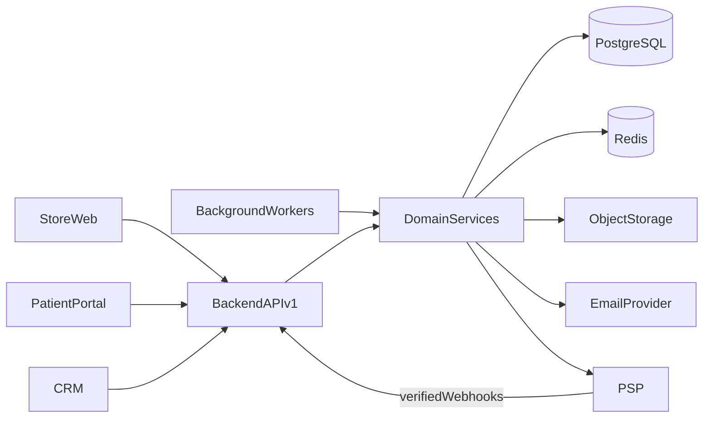
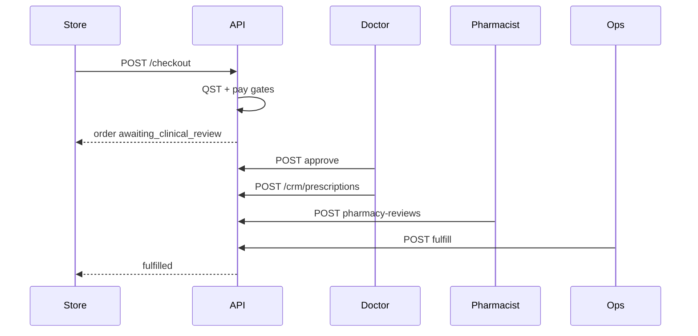
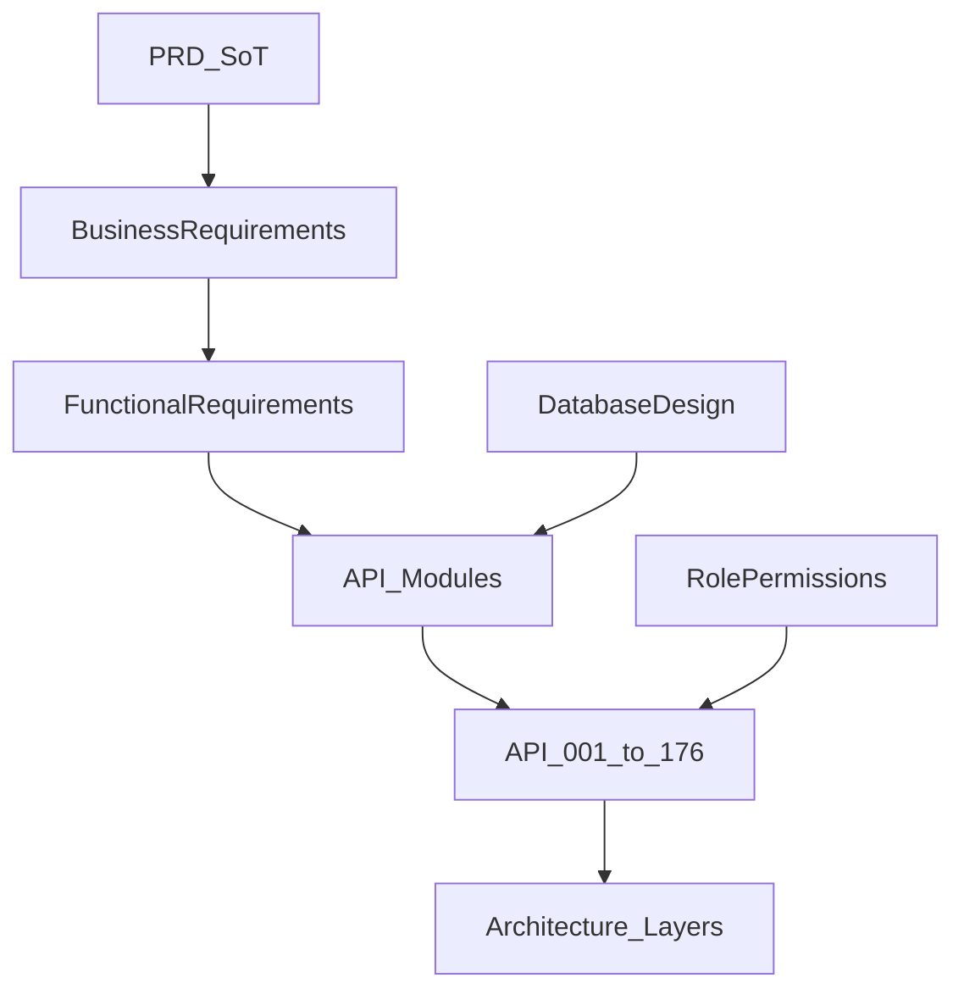
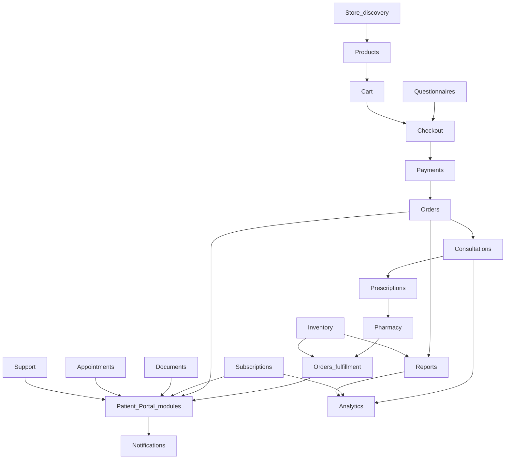

# 11 — API Design

| Field | Value |
| --- | --- |
| Document | API Design |
| Product | Clinexa |
| Version | 1.0 |
| Status | Approved — Implementation Ready |
| Primary market | United States |
| Audience | Backend Engineering, API Architecture, Security, Frontend (Store/Portal/CRM), Product, Clinical Ops, Operations, QA |
| Source of truth | [00 — Product Requirements Document](00-product-requirements-document.md) |
| Related docs | [01 — Project overview](01-project-overview.md), [02 — Business requirements](02-business-requirements.md), [03 — Functional requirements](03-functional-requirements.md), [04 — Non-functional requirements](04-non-functional-requirements.md), [05 — System architecture](05-system-architecture.md), [06 — User personas](06-user-personas.md), [07 — User journeys](07-user-journeys.md), [08 — Role permissions](08-role-permissions.md), [09 — Feature roadmap](09-feature-roadmap.md), [10 — Database design](10-database-design.md), [12 — Authentication flow](12-authentication-flow.md), [13 — Security](13-security.md), [14 — Notifications](14-notifications.md), [15 — Payment flow](15-payment-flow.md) |

This document is the **authoritative logical REST API design** for Clinexa Version 1. It defines the versioned Backend API surface (`ARCH-014`, `ARCH-101`) that Store Web, Patient Portal, CRM, background workers, and payment webhooks consume—without prescribing frameworks, route handlers, DTOs, OpenAPI YAML, or source code.

It expands [PRD](00-product-requirements-document.md) commerce and clinical rules, functional modules from [03](03-functional-requirements.md), API standards from [04](04-non-functional-requirements.md) (NFR-112–120), architecture decisions from [05](05-system-architecture.md), RBAC from [08](08-role-permissions.md), and resource shapes from [10](10-database-design.md) (`DB-001`–`DB-061`).

It does **not** define authentication wire formats, password hashing algorithms, threat-model depth, PSP merchant setup, UI screens, or ORM mappings. Those belong to docs 12–15, 20, and implementation repositories.

> **Compliance posture:** Controls are **HIPAA-aware** (PHI minimization, access control, auditability, patient isolation). This document does **not** claim HIPAA, HITRUST, or SOC 2 Type II certification as V1 delivery gates (PRD §1.5; NFR-065).

> **Implementation independence:** Paths, methods, and `API-*` IDs are logical contracts. Frameworks, controllers, middleware code, and OpenAPI generation are deferred to implementation. Status vocabularies must match [03 §14](03-functional-requirements.md#14-state-machine-summary).

---

## Table of contents

1. [Introduction](#1-introduction)
2. [API Design Principles](#2-api-design-principles)
3. [API Architecture](#3-api-architecture)
4. [Authentication Requirements](#4-authentication-requirements)
5. [API Modules](#5-api-modules)
6. [Endpoint Catalog](#6-endpoint-catalog)
7. [Standard Request Patterns](#7-standard-request-patterns)
8. [Standard Response Structure](#8-standard-response-structure)
9. [Error Catalog](#9-error-catalog)
10. [Versioning Strategy](#10-versioning-strategy)
11. [Performance Guidelines](#11-performance-guidelines)
12. [Security Considerations](#12-security-considerations)
13. [API Traceability Matrix](#13-api-traceability-matrix)
14. [Revision History](#14-revision-history)

---

## 1. Introduction

### 1.1 Purpose

Define a production-grade REST API architecture so that:

- Store, Patient Portal, CRM, and future Mobile share **one** Backend API (`ARCH-003`, `ARCH-014`) with no divergent clinical or payment rules in clients (`ARCH-004`, `ARCH-140`).
- Every privileged and PHI-adjacent operation is authorized server-side against [08](08-role-permissions.md) (`FR-AUTH-004`, NFR-045).
- Patient isolation is enforceable on every patient-scoped resource (`FR-AUTH-005`, `FR-PRT-002`, NFR-046, KPI-08).
- Clinical gates (questionnaire, doctor approval, pharmacist review) and payment safety (idempotent webhooks, fail-safe checkout) are API-enforced (`OR-01`–`OR-05`, `FR-PAY-002`, NFR-033/118).
- Engineering can implement HTTP adapters that trace to `API-*`, `FR-*`, `PERM-*`, and `DB-*` IDs.

### 1.2 Scope

#### In scope (V1)

| Area | Coverage |
| --- | --- |
| Logical REST surface | Versioned `/v1` resource endpoints for all approved functional modules |
| Surfaces served | Store Web (`ARCH-011`), Patient Portal (`ARCH-012`), CRM (`ARCH-013`), Backend API (`ARCH-014`) |
| Integration endpoints | PSP payment webhooks; health/readiness; worker-consumed domain operations (same AuthZ model) |
| AuthZ contract | Role and permission boundaries from [08](08-role-permissions.md); patient object-scope rules |
| Conventions | Pagination, filtering, sorting, errors, idempotency, rate limits (NFR-112–120) |
| Roadmap Should APIs | Coupons, Reviews, CMS/Blogs, Appointments, Analytics/Reports (`ROAD-022`–`026`) designed now even if delivery lands GA–v1.2 |
| Traceability | Mapping to `BO`/`OR`/`AC-BR`, `FR-*`, `NFR-*`, `ARCH-*`, `ROLE-*`, `PERM-*`, `DB-*`, `ROAD-*` |

#### Out of scope

| Area | Deferred to |
| --- | --- |
| Express/Nest routes, controllers, middleware code | Implementation repositories |
| OpenAPI YAML / Swagger JSON / SDK generation | Implementation (NFR OpenAPI Should) |
| Request/response JSON payload examples | Implementation contracts |
| Auth protocols, JWT claims wire format, cookie flags | [12 — Authentication flow](12-authentication-flow.md) |
| Threat modeling, OWASP hardening depth, key management | [13 — Security](13-security.md) |
| Email template bodies and channel orchestration detail | [14 — Notifications](14-notifications.md) |
| PSP merchant configuration and capture nuance | [15 — Payment flow](15-payment-flow.md) |
| SaaS multi-org `tenant_id` path prefixes | Not in V1 (PRD §11; RBAC-082) |
| ROAD-028 domains (video visits, labs, insurance, wearables, AI clinical) | [09](09-feature-roadmap.md) / [24](24-future-features.md) |
| GraphQL or gRPC public surfaces | Not in V1 (`ARCH-101`) |

### 1.3 Audience

| Audience | Use of this document |
| --- | --- |
| Backend / API engineers | Implement `/v1` adapters and domain use cases against `API-*` IDs |
| Frontend Store / Portal / CRM | Consume only documented resources; never embed clinical/payment gates |
| Security / Compliance | Verify AuthZ, isolation, PHI filtering, audit emission |
| Product / Clinical Ops | Confirm coverage of journeys and clinical SoD |
| QA | Derive contract and AuthZ matrix tests |

### 1.4 References

| Document | Relevance |
| --- | --- |
| [00 — PRD](00-product-requirements-document.md) | Single source of truth for product scope and rules |
| [02 — Business requirements](02-business-requirements.md) | `BO-*`, `OR-*`, `AC-BR-*` acceptance |
| [03 — Functional requirements](03-functional-requirements.md) | `FR-*` modules, state machines, domain events |
| [04 — Non-functional requirements](04-non-functional-requirements.md) | Latency, security, API standards |
| [05 — System architecture](05-system-architecture.md) | Layers, consumers, `/v1`, workers, webhooks |
| [07 — User journeys](07-user-journeys.md) | Journey → operation coverage |
| [08 — Role permissions](08-role-permissions.md) | `ROLE-*`, `PERM-*`, isolation rules |
| [09 — Feature roadmap](09-feature-roadmap.md) | MoSCoW / release sequencing |
| [10 — Database design](10-database-design.md) | `DB-*` entities → REST resources |
| [12 — Authentication flow](12-authentication-flow.md) | AuthN implementation (forward) |

### 1.5 ID conventions

| Prefix | Form | Meaning |
| --- | --- | --- |
| `API-###` | `API-001` | Logical endpoint in this document (global sequence) |
| `ERR-<DOM>-###` | `ERR-AUTH-001` | Stable API error code |
| `FR-<MOD>-###` | `FR-ORD-001` | Functional requirement ([03](03-functional-requirements.md)) |
| `PERM-<MOD>-###` | `PERM-CRM-001` | Permission ([08](08-role-permissions.md)) |
| `ROLE-###` | `ROLE-003` | Role ([08](08-role-permissions.md)) |
| `DB-###` | `DB-026` | Logical entity ([10](10-database-design.md)) |
| `ARCH-###` / `NFR-###` | Cross-doc architecture / quality IDs | |

Role abbreviations used in catalog tables: **G** Guest, **P** Patient, **Dr** Doctor, **Ph** Pharmacist, **Su** Support, **Op** Operations, **Mk** Marketing, **Ct** Content, **Ad** Administrator, **Sys** System/webhook/worker identity.

---

## 2. API Design Principles

### 2.1 REST principles

- Resources are nouns; HTTP methods express intent (`GET` read, `POST` create/action, `PATCH` partial update, `PUT` replace collection membership where documented, `DELETE` only for non-historical staging resources such as cart lines).
- Clinical and commerce **history is never hard-deleted** via public API; use status transitions (`cancelled`, `deactivated`, `unpublished`).
- Safe methods (`GET`, `HEAD`) must not mutate durable domain state.

### 2.2 Resource-oriented design

- Plural resource names under `/v1` (NFR-113): `/products`, `/orders`, `/consultations`.
- Nested paths for CASCADE children without independent lifecycle: `/cart/items`, `/support-tickets/{id}/messages`.
- Flat paths for queues and cross-linked work items: `/orders`, `/consultations`, `/prescriptions`.
- Polymorphic collections (`/documents`, `/audit-logs`) use allowlisted type filters—not free-form nesting (NFR-115).

### 2.3 Statelessness

- API instances are **stateless** (`ARCH-029`); session/token validity is resolved via shared session store with DB as revocation authority (NFR-041/044).
- No sticky sessions required for horizontal scale.

### 2.4 Versioning strategy

- URI version prefix `/v1` for the public and authenticated API surface (`ARCH-101`, NFR-112).
- Breaking changes require `/v2` (or successor); additive fields and new endpoints are compatible within `/v1`.
- See [§10](#10-versioning-strategy).

### 2.5 Idempotency

- Payment mutations and PSP webhook handlers honor idempotency keys / provider event IDs (`FR-PAY-002`, NFR-033, NFR-118, `ARCH-007`).
- Clients may send an `Idempotency-Key` header on checkout finalize, payment initiate, and refund initiate.
- Duplicate successful replays return the original outcome without double-charging or double state transition.

### 2.6 Consistent naming

| Element | Convention |
| --- | --- |
| Path segments | kebab-case plural nouns (`/subscription-plans`, `/questionnaire-responses`) |
| Path IDs | Opaque UUID (`{id}`); public Store may also resolve `{slug}` where SEO requires |
| Query params | camelCase or snake_case—pick one in implementation; document allowlists |
| Status enums | snake_case strings matching [03 §14](03-functional-requirements.md#14-state-machine-summary) |
| Headers | `Authorization`, `Idempotency-Key`, `X-Correlation-Id` (or generate server-side) |

### 2.7 Pagination philosophy

- All unbounded lists require pagination (NFR-114, NFR-020).
- Default page size **≤ 50**; maximum **≤ 100**.
- Cursor or offset pagination is an implementation choice; contracts must expose total or next-page token consistently.

### 2.8 Filtering

- Filter fields are **allowlisted** per endpoint (NFR-115).
- Unknown filter keys → validation error (`ERR-VAL-001`).
- CRM filters never bypass RBAC or patient isolation.

### 2.9 Sorting

- Sort fields are allowlisted; default sorts are defined per list (e.g., consult queue by oldest pending).
- Unknown sort keys rejected.

### 2.10 Error handling philosophy

- Consistent error envelope: machine code, human message, correlation ID; **no PHI** in messages (NFR-116).
- Correct HTTP status: 401 unauthenticated, 403 unauthorized, 404 not found (or opaque 404 for unauthorized cross-patient), 409 conflict, 422 business rule, 429 rate limit, 5xx server (NFR-117).
- See [§8](#8-standard-response-structure) and [§9](#9-error-catalog).

### 2.11 Backward compatibility

- Within `/v1`: additive response fields and new optional query params are allowed.
- Removing fields, changing status enum meanings, or tightening AuthZ in a breaking way requires a new major version and deprecation notice.
- Mobile-ready: contracts remain client-agnostic (`ARCH-148`).

---

## 3. API Architecture

### 3.1 Overview

Clinexa exposes a **single modular-monolith Backend API** (`ARCH-028`) with an HTTP API layer (`ARCH-029`) that authenticates, authorizes, validates, rate-limits, and maps to application use cases (`ARCH-030`). Domain policies (`ARCH-031`) own clinical gates, order state machines, coupons, and inventory. Persistence uses patient-scoped repositories (`ARCH-032`) over PostgreSQL (`ARCH-016`).

### 3.2 API zones

| Zone | Consumers | Auth | Typical modules |
| --- | --- | --- | --- |
| **Public APIs** | Store guests (and unauthenticated browse) | None (rate-limited) | Published products, categories, CMS, blogs, Store search, moderated reviews, auth entry |
| **Authenticated APIs** | Patients (Portal + Store checkout) | Patient session/token | Profile, cart merge, checkout finalize, orders, subscriptions, QST submit, documents, appointments, support, NTF prefs |
| **CRM APIs** | Staff roles | Staff session/token + `PERM-CRM-020` | Consultations, pharmacy, fulfillment, inventory, support triage, catalog config, reports, admin |
| **Internal APIs** | Platform operators / probes | Network or service auth | Health live/ready |
| **Worker APIs** | Background workers (`ARCH-015`) | Internal job trust; same domain services | Subscription renewals, NTF dispatch, report export, search reindex, low-stock alerts |
| **Webhook endpoints** | PSP | Provider signature verification; not user JWT | Payment events → order/subscription state (`FR-PAY-002`) |

### 3.3 Hard surface denies

| Rule | Enforcement |
| --- | --- |
| Patient tokens must not access CRM routes | `PERM-CRM-020` deny (RBAC-023/041) |
| Guest must not finalize checkout | `PERM-CHK-002` requires Patient (`FR-CHK-001`) |
| Marketing/Content default-deny clinical notes and full QST answers | `FR-CRM-006`, OR-07 |
| Support never clinically approves prescriptions | `FR-SUP-004`, `PERM-CRM-002` Doctor only |
| Ops must not fulfill Rx before doctor + pharmacist gates | `FR-ORD-003`, `PERM-ORD-003` |

### 3.4 Architecture diagram

### 3.5 Layer mapping

| Layer | ARCH | API duty |
| --- | --- | --- |
| API | ARCH-029 | HTTP adapters, auth middleware, validation, rate limits, error envelope, correlation IDs, versioning |
| Application | ARCH-030 | Use cases, transactions, domain events, idempotency, audit emit |
| Domain | ARCH-031 | RBAC policies, clinical gates, order/subscription state machines |
| Repository | ARCH-032 | Persistence; patient-scoped queries |
| Infrastructure | ARCH-033 | PSP, email, object storage, Redis, queue |

### 3.6 Composition surfaces

- **Store** is a thin public + commerce client; it never owns clinical approval messaging as “payment success = dispensed” (`FR-STO-006`).
- **Patient Portal** composes patient-scoped modules only (`FR-PRT-001`–`006`).
- **CRM** composes staff modules behind role permissions (`FR-CRM-001`–`007`).
- Prescriptions are **not** a standalone FR module but are first-class API resources spanning ORD/CRM/QST/DOC.

---

## 4. Authentication Requirements

Authentication **implementation** (token format, cookie flags, hashing) is owned by [12 — Authentication flow](12-authentication-flow.md). This section states API-visible requirements only.

### 4.1 Public endpoints

- No session required for published catalog/content, Store search, moderated reviews, and auth entry forms (`FR-STO-001`, `PERM-PRD-001`).
- Public writes (where any) and auth attempts are rate-limited (NFR-052/119).

### 4.2 Authenticated endpoints

- Require valid session/token validated by Backend API (NFR-041).
- Idle timeout ≤ 30 min on staff/PHI surfaces; absolute ≤ 12 h; password reset invalidates sessions (`FR-AUTH-003`, NFR-044).

### 4.3 Role-protected endpoints

- After AuthN, every privileged/PHI operation checks `PERM-*` and object scope (`FR-AUTH-004`, NFR-045, RBAC decision chain).
- UI hiding is non-authoritative (RBAC-086).

### 4.4 Patient isolation

- Patients read/write **only own** records (`FR-AUTH-005`, `FR-PRT-002`, NFR-046).
- Cross-patient ID access returns **404** (preferred) or 403 without leaking existence of other patients’ PHI.
- V1 isolation is patient-scoped, not multi-tenant org (`RBAC-082`).

### 4.5 Permission enforcement

| Step | Result if fail |
| --- | --- |
| 1. Authenticate | **401** `ERR-AUTH-001` |
| 2. RBAC + object scope | **403** `ERR-AUTHZ-001` (audit PHI 403s per RBAC-072) |
| 3. Business / clinical / inventory / state gates | **409** or **422** domain error |
| 4. Persist via scoped repository | Success + audit when required |

### 4.6 Session validation

- `GET /v1/auth/session` (or equivalent) confirms active session and returns non-sensitive identity summary for clients.
- Staff CRM shell requires `PERM-CRM-020`; Patient Portal shell requires Patient role (`PERM-PRT-010`).
- Dual-role identities (if ever assigned) still re-resolve permissions server-side; never trust client permission lists for AuthZ.

---

## 5. API Modules

For each module: purpose, consumers, authorization posture, primary resources (`DB-*`), and referenced FRs.

### 5.1 Platform (supporting)

| Field | Detail |
| --- | --- |
| Purpose | Liveness and readiness probes for deployment health |
| Consumers | Orchestrators, ops |
| Authorization | Internal / unauthenticated live; ready may require network restriction |
| Primary Resources | None (operational) |
| Referenced FRs | Cross-cutting observability (NFR health); no product FR invention |

### 5.2 Authentication

| Field | Detail |
| --- | --- |
| Purpose | Register, sign-in, sign-out, password reset, session check |
| Consumers | Store, Portal, CRM |
| Authorization | Public entry; logout/session require auth |
| Primary Resources | `DB-001`, `DB-006`, `DB-007`, `DB-008` |
| Referenced FRs | `FR-AUTH-001`–`006`, `FR-STO-003` |

### 5.3 Users

| Field | Detail |
| --- | --- |
| Purpose | Staff/patient user administration and role assignment |
| Consumers | CRM Administrator; limited self via Profile |
| Authorization | `PERM-ADM-001`/`002`; patients cannot list other users |
| Primary Resources | `DB-001`, `DB-002`, `DB-005`, `DB-009` |
| Referenced FRs | `FR-ADM-001`, `FR-ADM-004`, `FR-AUTH-004` |

### 5.4 Profile

| Field | Detail |
| --- | --- |
| Purpose | Patient self-service profile view/update |
| Consumers | Patient Portal |
| Authorization | `PERM-PRT-001`/`002`; own record only |
| Primary Resources | `DB-001` (patient fields) |
| Referenced FRs | `FR-PRT-001`, `FR-PRT-002` |

### 5.5 Products

| Field | Detail |
| --- | --- |
| Purpose | Published catalog browse; Admin CRM catalog manage/publish |
| Consumers | Store (read), CRM Admin (write) |
| Authorization | `PERM-PRD-001` view published; `PERM-PRD-002` manage |
| Primary Resources | `DB-011`–`DB-014`, `DB-015`–`DB-016` |
| Referenced FRs | `FR-PRD-001`–`005`, `FR-STO-001`/`002`/`004` |

### 5.6 Categories

| Field | Detail |
| --- | --- |
| Purpose | Category navigation and CRM configuration |
| Consumers | Store, CRM Admin |
| Authorization | `PERM-CAT-001`/`002` |
| Primary Resources | `DB-010`, `DB-014` |
| Referenced FRs | `FR-CAT-001`–`004` |

### 5.7 Search

| Field | Detail |
| --- | --- |
| Purpose | Store catalog/content search; CRM RBAC-filtered search |
| Consumers | Store, CRM staff |
| Authorization | Public Store search; `PERM-SRCH-002` CRM |
| Primary Resources | Indexed views over products/content/patients/orders |
| Referenced FRs | `FR-SRCH-001`–`003` |

### 5.8 Questionnaires

| Field | Detail |
| --- | --- |
| Purpose | Versioned intake definitions, bindings, patient responses |
| Consumers | Store/Portal (submit), CRM Doctor/Pharmacist (view), Admin (config) |
| Authorization | `PERM-QST-001`–`004`; full answers Doctor (+ Ph scoped) |
| Primary Resources | `DB-017`–`DB-021`, `DB-035`–`DB-036` |
| Referenced FRs | `FR-QST-001`–`006`, `FR-CHK-002` |

### 5.9 Cart

| Field | Detail |
| --- | --- |
| Purpose | Guest/patient cart line management and coupon staging |
| Consumers | Store |
| Authorization | `PERM-CART-001`/`002` |
| Primary Resources | `DB-022`, `DB-023` |
| Referenced FRs | `FR-CART-001`–`004` |

### 5.10 Checkout

| Field | Detail |
| --- | --- |
| Purpose | Preview and finalize order creation under auth + clinical gates |
| Consumers | Store / Portal |
| Authorization | Start Guest/Patient; finalize **Patient only** (`PERM-CHK-002`) |
| Primary Resources | Cart → Order create path (`DB-026`) |
| Referenced FRs | `FR-CHK-001`–`005` |

### 5.11 Payments

| Field | Detail |
| --- | --- |
| Purpose | Pay, saved methods, refunds, webhook ingestion |
| Consumers | Patient, Support/Ops (refunds), PSP webhooks, renewal workers |
| Authorization | `PERM-PAY-001`–`003`; webhook = verified provider |
| Primary Resources | `DB-028`–`DB-031` |
| Referenced FRs | `FR-PAY-001`–`005` |

### 5.12 Orders

| Field | Detail |
| --- | --- |
| Purpose | Order lifecycle visibility and ops fulfillment |
| Consumers | Portal (own), CRM staff (scoped), Ops fulfill |
| Authorization | `PERM-ORD-001`–`003` |
| Primary Resources | `DB-026`, `DB-027` |
| Referenced FRs | `FR-ORD-001`–`006`, `FR-STO-006` |

### 5.13 Subscriptions

| Field | Detail |
| --- | --- |
| Purpose | Plans, patient subscriptions, cancel, renewal side effects |
| Consumers | Portal, CRM Admin/Support, workers |
| Authorization | `PERM-SUB-001`–`003` |
| Primary Resources | `DB-032`–`DB-034` |
| Referenced FRs | `FR-SUB-001`–`005` |

### 5.14 Consultations

| Field | Detail |
| --- | --- |
| Purpose | Doctor consult queue and clinical decisions |
| Consumers | CRM Doctor |
| Authorization | `PERM-CRM-001`–`005` |
| Primary Resources | `DB-037`–`DB-039` |
| Referenced FRs | `FR-CRM-002`, `FR-QST-005`, `FR-ORD-002`/`003` |

### 5.15 Prescriptions

| Field | Detail |
| --- | --- |
| Purpose | Prescription create/update after doctor approval; patient status |
| Consumers | CRM Doctor; Portal status; Pharmacist context |
| Authorization | Doctor create/update after approve path; Patient view own status |
| Primary Resources | `DB-040` |
| Referenced FRs | `FR-CRM-003`, `FR-PRT-003`, `FR-ORD-003` |

### 5.16 Pharmacy

| Field | Detail |
| --- | --- |
| Purpose | Pharmacist review before Rx fulfillment |
| Consumers | CRM Pharmacist |
| Authorization | `PERM-CRM-006`/`007`; cannot replace doctor approval |
| Primary Resources | `DB-041` |
| Referenced FRs | `FR-CRM-004`, `FR-ORD-003` |

### 5.17 Inventory

| Field | Detail |
| --- | --- |
| Purpose | Stock balances, adjustments, low-stock visibility |
| Consumers | CRM Operations (+ Pharmacist view scoped) |
| Authorization | `PERM-INV-001`–`003` |
| Primary Resources | `DB-042`, `DB-043` |
| Referenced FRs | `FR-INV-001`–`005` |

### 5.18 Documents

| Field | Detail |
| --- | --- |
| Purpose | Patient document metadata, upload, audited download |
| Consumers | Portal, CRM clinical/ops/support scoped |
| Authorization | `PERM-DOC-001`–`003` |
| Primary Resources | `DB-047` |
| Referenced FRs | `FR-DOC-001`–`004` |

### 5.19 Appointments

| Field | Detail |
| --- | --- |
| Purpose | Scheduling-only appointment types, slots, bookings |
| Consumers | Portal, CRM staff |
| Authorization | `PERM-APT-001`/`002`; no video (`FR-APT-004`) |
| Primary Resources | `DB-044`–`DB-046` |
| Referenced FRs | `FR-APT-001`–`004` |

### 5.20 Support

| Field | Detail |
| --- | --- |
| Purpose | Patient tickets and CRM triage/resolve |
| Consumers | Portal, CRM Support |
| Authorization | `PERM-SUP-001`–`003`; no Rx approve (`FR-SUP-004`) |
| Primary Resources | `DB-048`, `DB-049` |
| Referenced FRs | `FR-SUP-001`–`005` |

### 5.21 Notifications

| Field | Detail |
| --- | --- |
| Purpose | Patient prefs; Admin templates; delivery is worker-driven |
| Consumers | Portal, CRM Admin, workers |
| Authorization | `PERM-NTF-001`–`003` |
| Primary Resources | `DB-054`–`DB-056` |
| Referenced FRs | `FR-NTF-001`–`004` |

### 5.22 Reviews

| Field | Detail |
| --- | --- |
| Purpose | Patient submit; moderate before public; Store display approved |
| Consumers | Store, Portal, CRM moderators |
| Authorization | `PERM-REV-001`/`002` |
| Primary Resources | `DB-053` |
| Referenced FRs | `FR-REV-001`–`003`, `FR-STO-005` |

### 5.23 Coupons

| Field | Detail |
| --- | --- |
| Purpose | CRM configure; checkout validate/redeem |
| Consumers | Store/Checkout, CRM Marketing/Admin |
| Authorization | `PERM-CPN-001`/`002` |
| Primary Resources | `DB-024`, `DB-025` |
| Referenced FRs | `FR-CPN-001`–`003`, `FR-CART-003`, `FR-CHK-003` |

### 5.24 CMS

| Field | Detail |
| --- | --- |
| Purpose | Published Store pages/blocks; CRM content manage |
| Consumers | Store, CRM Content/Admin (+ Marketing limited) |
| Authorization | `PERM-CMS-001`/`002`; `FR-CMS-003` |
| Primary Resources | `DB-051`, `DB-052` |
| Referenced FRs | `FR-CMS-001`–`003` |

### 5.25 Blogs

| Field | Detail |
| --- | --- |
| Purpose | Published posts; CRM create/publish; drafts private |
| Consumers | Store, CRM Content/Admin |
| Authorization | `PERM-BLG-001` |
| Primary Resources | `DB-050` |
| Referenced FRs | `FR-BLG-001`–`004` |

### 5.26 Reports

| Field | Detail |
| --- | --- |
| Purpose | CRM tabular reports and async export |
| Consumers | CRM Ops and scoped clinical/support; Admin |
| Authorization | `PERM-RPT-001`/`002`; PHI-minimized columns (`FR-RPT-002`) |
| Primary Resources | `DB-061` |
| Referenced FRs | `FR-RPT-001`–`003` |

### 5.27 Analytics

| Field | Detail |
| --- | --- |
| Purpose | Funnel/ops analytics; marketing-safe views |
| Consumers | CRM Marketing (safe), Ops/clinical scoped, Admin |
| Authorization | `PERM-ANL-001`/`002`; `FR-ANL-002` |
| Primary Resources | `DB-060` |
| Referenced FRs | `FR-ANL-001`–`003` |

### 5.28 Administration

| Field | Detail |
| --- | --- |
| Purpose | Roles/permissions, workflow/catalog publish governance, audit |
| Consumers | CRM Administrator |
| Authorization | `PERM-ADM-001`–`010` |
| Primary Resources | `DB-002`–`DB-005`, `DB-021`, `DB-057` |
| Referenced FRs | `FR-ADM-001`–`004`, `FR-CRM-007` |

### 5.29 Settings

| Field | Detail |
| --- | --- |
| Purpose | Platform policy settings (oversell, review moderation defaults, NTF hooks) |
| Consumers | CRM Administrator |
| Authorization | `PERM-SET-001`/`002` |
| Primary Resources | `DB-058` |
| Referenced FRs | `FR-SET-001`–`004` |

### 5.30 Webhooks (supporting)

| Field | Detail |
| --- | --- |
| Purpose | Inbound PSP events driving payment/order/subscription state |
| Consumers | PSP |
| Authorization | Provider signature + idempotency store (`DB-031`) |
| Primary Resources | `DB-028`, `DB-031`, orders/subscriptions side effects |
| Referenced FRs | `FR-PAY-002`, `FR-PAY-004`, `FR-SUB-002`/`003` |

---

## 6. Endpoint Catalog

All paths are relative to `/v1` unless noted. **Roles Allowed** use abbreviations from §1.5. **Auth** = session/token required. Object-scope (own / case / ticket) always applies where marked ◐ in RBAC.

### 6.1 Platform

| API ID | Method | Resource | Purpose | Auth | Roles Allowed | Related FR IDs | Business Rules |
| --- | --- | --- | --- | --- | --- | --- | --- |
| API-001 | GET | `/health/live` | Process liveness | No | Public/Sys | — | No dependency checks; cheap |
| API-002 | GET | `/health/ready` | Readiness incl. DB/queue probes | No* | Sys / network-restricted | — | Fail if SoR or critical deps unavailable |

\*May be restricted by network policy in production.

### 6.2 Authentication

| API ID | Method | Resource | Purpose | Auth | Roles Allowed | Related FR IDs | Business Rules |
| --- | --- | --- | --- | --- | --- | --- | --- |
| API-003 | POST | `/auth/register` | Patient registration | No | G | FR-AUTH-001, FR-STO-003 | Email/password; rate-limited; creates Patient; optional cart merge token |
| API-004 | POST | `/auth/login` | Authenticate user | No | G, P, staff | FR-AUTH-002, FR-STO-003 | Issues session/token; lockout ≥5 fails / 15 min (FR-AUTH-006); cart merge for patients |
| API-005 | POST | `/auth/logout` | End session | Yes | P, staff | FR-AUTH-002 | Invalidates current session |
| API-006 | POST | `/auth/password-reset/request` | Start reset | No | G, P, staff | FR-AUTH-003 | Time-limited token email; rate-limited |
| API-007 | POST | `/auth/password-reset/confirm` | Complete reset | No | Token holder | FR-AUTH-003 | Invalidates all sessions for user |
| API-008 | GET | `/auth/session` | Validate session / identity summary | Yes | P, staff | FR-AUTH-002/004 | No PHI beyond self identity; roles advisory only |

### 6.3 Users

| API ID | Method | Resource | Purpose | Auth | Roles Allowed | Related FR IDs | Business Rules |
| --- | --- | --- | --- | --- | --- | --- | --- |
| API-009 | GET | `/users` | List users | Yes | Ad | FR-ADM-001 | Paginated; no unrestricted PHI dump |
| API-010 | GET | `/users/{id}` | Get user | Yes | Ad | FR-ADM-001 | Staff/patient admin view |
| API-011 | POST | `/users` | Create staff user | Yes | Ad | FR-ADM-001 | Assign initial role; audit |
| API-012 | PATCH | `/users/{id}` | Update user admin fields | Yes | Ad | FR-ADM-001 | Cannot silently escalate clinical powers without role change audit |
| API-013 | POST | `/users/{id}/deactivate` | Deactivate user | Yes | Ad | FR-ADM-001 | Soft-deactivate; revoke sessions |
| API-014 | GET | `/users/{id}/roles` | List role assignments | Yes | Ad | FR-ADM-001 | |
| API-015 | PUT | `/users/{id}/roles` | Replace role assignments | Yes | Ad | FR-ADM-001, FR-ADM-004 | Audit; Admin cannot grant “disable clinical gates” |

### 6.4 Profile

| API ID | Method | Resource | Purpose | Auth | Roles Allowed | Related FR IDs | Business Rules |
| --- | --- | --- | --- | --- | --- | --- | --- |
| API-016 | GET | `/profile` | Own profile | Yes | P | FR-PRT-001/002 | Own only |
| API-017 | PATCH | `/profile` | Update own profile | Yes | P | FR-PRT-001/002 | Allowlisted fields; no role self-escalation |

### 6.5 Products

| API ID | Method | Resource | Purpose | Auth | Roles Allowed | Related FR IDs | Business Rules |
| --- | --- | --- | --- | --- | --- | --- | --- |
| API-018 | GET | `/products` | List published products | No | G, P, Mk, Ct, Ad | FR-PRD-003, FR-STO-001 | Store: published only |
| API-019 | GET | `/products/{slug}` | Product detail by slug | No | G, P, Mk, Ct, Ad | FR-PRD-001/003, FR-STO-002 | SEO metadata; Rx flag visible |
| API-020 | GET | `/products/{id}` | Product by id | No* | G, P / Ad | FR-PRD-003 | Unpublished only for Ad CRM |
| API-021 | GET | `/admin/products` | CRM product list | Yes | Ad | FR-PRD-002 | Includes drafts/unpublished |
| API-022 | POST | `/admin/products` | Create product | Yes | Ad | FR-PRD-002, FR-ADM-002 | Config without deploy |
| API-023 | PATCH | `/admin/products/{id}` | Update product | Yes | Ad | FR-PRD-002 | |
| API-024 | POST | `/admin/products/{id}/publish` | Publish product | Yes | Ad | FR-PRD-002, FR-ADM-003 | Validate Rx/QST bindings before publish |
| API-025 | POST | `/admin/products/{id}/unpublish` | Unpublish | Yes | Ad | FR-PRD-002 | Removes from Store |
| API-026 | GET | `/admin/products/{id}/variants` | List variants | Yes | Ad | FR-PRD-001 | |
| API-027 | POST | `/admin/products/{id}/variants` | Create variant/SKU | Yes | Ad | FR-PRD-001 | |
| API-028 | PATCH | `/admin/products/{id}/variants/{variantId}` | Update variant | Yes | Ad | FR-PRD-001 | |
| API-029 | PUT | `/admin/products/{id}/categories` | Set category links | Yes | Ad | FR-PRD-001, FR-CAT-002 | |
| API-030 | POST | `/admin/products/{id}/media` | Attach media metadata | Yes | Ad | FR-PRD-001 | Upload binary via signed URL pattern (§7) |

\*Unauthenticated access limited to published.

### 6.6 Categories

| API ID | Method | Resource | Purpose | Auth | Roles Allowed | Related FR IDs | Business Rules |
| --- | --- | --- | --- | --- | --- | --- | --- |
| API-031 | GET | `/categories` | List published categories | No | G, P, Mk, Ct, Ad | FR-CAT-003, FR-STO-001 | |
| API-032 | GET | `/categories/{slug}` | Category detail | No | G, P, Mk, Ct, Ad | FR-CAT-001/003, FR-STO-002 | SEO metadata |
| API-033 | GET | `/admin/categories` | CRM category list | Yes | Ad | FR-CAT-002 | |
| API-034 | POST | `/admin/categories` | Create category | Yes | Ad | FR-CAT-002 | |
| API-035 | PATCH | `/admin/categories/{id}` | Update category | Yes | Ad | FR-CAT-002 | |
| API-036 | POST | `/admin/categories/{id}/publish` | Publish | Yes | Ad | FR-CAT-002 | |
| API-037 | POST | `/admin/categories/{id}/unpublish` | Unpublish | Yes | Ad | FR-CAT-002 | |

### 6.7 Search

| API ID | Method | Resource | Purpose | Auth | Roles Allowed | Related FR IDs | Business Rules |
| --- | --- | --- | --- | --- | --- | --- | --- |
| API-038 | GET | `/search` | Store search | No | G, P | FR-SRCH-001/003 | Published products/content only; no PHI |
| API-039 | GET | `/crm/search` | CRM search | Yes | Dr, Ph, Su, Op, Mk, Ct, Ad | FR-SRCH-002 | RBAC-filtered; Mk/Ct cannot retrieve clinical charts / full QST |

### 6.8 Questionnaires

| API ID | Method | Resource | Purpose | Auth | Roles Allowed | Related FR IDs | Business Rules |
| --- | --- | --- | --- | --- | --- | --- | --- |
| API-040 | GET | `/questionnaires/bindings` | Resolve bound definition for product/plan | No* | G, P | FR-QST-002 | Returns published version for purchase path |
| API-041 | GET | `/questionnaires/definitions/{id}/versions/{versionId}` | Get definition version for intake | Yes | P | FR-QST-001 | Patient starts intake |
| API-042 | POST | `/questionnaire-responses` | Create/save response draft | Yes | P | FR-QST-003/004 | Tied to definition version |
| API-043 | PATCH | `/questionnaire-responses/{id}` | Update draft answers | Yes | P | FR-QST-004 | Own only; locked after submit |
| API-044 | POST | `/questionnaire-responses/{id}/submit` | Submit completed response | Yes | P | FR-QST-003/004 | Required before Rx checkout finalize |
| API-045 | GET | `/questionnaire-responses/{id}` | Get own response status/summary | Yes | P | FR-QST-005, FR-PRT-003 | Patient sees status, not staff notes |
| API-046 | GET | `/crm/questionnaire-responses/{id}` | Clinician view full answers | Yes | Dr, Ph◐ | FR-QST-005, FR-CRM-002/006 | Mk/Ct denied |
| API-047 | GET | `/admin/questionnaire-definitions` | List definitions | Yes | Ad | FR-QST-001, FR-ADM-002 | |
| API-048 | POST | `/admin/questionnaire-definitions` | Create definition | Yes | Ad | FR-QST-001 | |
| API-049 | POST | `/admin/questionnaire-definitions/{id}/versions` | Create version | Yes | Ad | FR-QST-001 | Immutable prior versions with answers |
| API-050 | PATCH | `/admin/questionnaire-versions/{id}` | Edit draft version questions | Yes | Ad | FR-QST-001/006 | Branching Could (FR-QST-006) |
| API-051 | POST | `/admin/questionnaire-versions/{id}/publish` | Publish version | Yes | Ad | FR-ADM-003 | Validate before publish |
| API-052 | PUT | `/admin/questionnaire-bindings` | Upsert product/plan bindings | Yes | Ad | FR-QST-002, FR-ADM-003 | Unsafe Rx setups blocked |

\*Binding discovery may require auth when tied to cart context.

### 6.9 Cart

| API ID | Method | Resource | Purpose | Auth | Roles Allowed | Related FR IDs | Business Rules |
| --- | --- | --- | --- | --- | --- | --- | --- |
| API-053 | GET | `/cart` | Get current cart | No* | G, P | FR-CART-001 | Guest cart via cart token/cookie |
| API-054 | POST | `/cart/items` | Add line | No* | G, P | FR-CART-001/002 | Validate published catalog |
| API-055 | PATCH | `/cart/items/{itemId}` | Update qty | No* | G, P | FR-CART-001/002 | |
| API-056 | DELETE | `/cart/items/{itemId}` | Remove line | No* | G, P | FR-CART-001 | Staging delete allowed |
| API-057 | POST | `/cart/coupon` | Stage coupon code | No* | G, P | FR-CART-003 | Validation finalized at checkout |
| API-058 | DELETE | `/cart/coupon` | Clear staged coupon | No* | G, P | FR-CART-003 | |
| API-059 | POST | `/cart/merge` | Merge guest cart into patient | Yes | P | FR-CART-004 | Post-login merge per policy |

### 6.10 Checkout

| API ID | Method | Resource | Purpose | Auth | Roles Allowed | Related FR IDs | Business Rules |
| --- | --- | --- | --- | --- | --- | --- | --- |
| API-060 | POST | `/checkout/preview` | Price/tax/shipping preview | No* | G, P | FR-CHK-003 | Revalidate catalog/coupon; no order create |
| API-061 | POST | `/checkout` | Finalize checkout | Yes | P | FR-CHK-001–005, FR-STO-004 | Auth required; Rx requires completed QST; creates `payment_pending` order; fail-safe if pay fails; Idempotency-Key |

### 6.11 Payments

| API ID | Method | Resource | Purpose | Auth | Roles Allowed | Related FR IDs | Business Rules |
| --- | --- | --- | --- | --- | --- | --- | --- |
| API-062 | POST | `/payments/intents` | Create PSP payment intent for order | Yes | P | FR-PAY-001, FR-CHK-004 | Tokenization only; no raw PAN; Idempotency-Key |
| API-063 | GET | `/payments/{id}` | Payment status | Yes | P◐, Su◐, Op◐, Ad◐ | FR-PAY-005, FR-ORD-005 | Scoped |
| API-064 | GET | `/payment-methods` | List own saved methods | Yes | P | FR-PAY-004, FR-PRT-004 | Tokens only |
| API-065 | POST | `/payment-methods` | Attach saved method | Yes | P | FR-PAY-001/004 | PSP token reference |
| API-066 | DELETE | `/payment-methods/{id}` | Remove saved method | Yes | P | FR-PRT-004 | Soft-deactivate |
| API-067 | POST | `/payments/{id}/refunds` | Initiate refund | Yes | Su, Op, Ad◐, P◐ | FR-PAY-003, FR-ORD-006, FR-SUP-005 | OR-11 tiers; clinical decline path eligible |
| API-068 | POST | `/webhooks/payments` | PSP webhook ingest | No† | Sys (PSP) | FR-PAY-002/004/005, FR-SUB-002/003 | Verify signature; idempotent by provider event id; drive order/sub state |

†Not user JWT; provider verification required.

### 6.12 Orders

| API ID | Method | Resource | Purpose | Auth | Roles Allowed | Related FR IDs | Business Rules |
| --- | --- | --- | --- | --- | --- | --- | --- |
| API-069 | GET | `/orders` | List own orders | Yes | P | FR-ORD-005, FR-PRT-001 | Own only; paginated |
| API-070 | GET | `/orders/{id}` | Own order detail | Yes | P | FR-ORD-005, FR-PRT-003 | Status clarity for clinical pending/decline |
| API-071 | POST | `/orders/{id}/cancel` | Cancel own order | Yes | P◐ | FR-ORD-006 | Policy-scoped; may trigger refund path |
| API-072 | GET | `/crm/orders` | Staff order list | Yes | Dr, Ph, Su, Op, Ad | FR-ORD-005, FR-CRM-005 | RBAC scoped; Mk/Ct denied |
| API-073 | GET | `/crm/orders/{id}` | Staff order detail | Yes | Dr, Ph, Su, Op, Ad | FR-ORD-005 | Need-to-know fields by role |
| API-074 | POST | `/crm/orders/{id}/cancel` | Staff cancel | Yes | Su, Op, Ad◐ | FR-ORD-006 | Audit |
| API-075 | POST | `/crm/orders/{id}/fulfill` | Mark fulfilled / ship | Yes | Op | FR-ORD-003/004, FR-INV-002, FR-CRM-005 | Rx requires doctor approve + pharmacist review; non-Rx skips clinical; inventory decrement |
| API-076 | GET | `/crm/orders/{id}/items` | Order lines | Yes | Dr, Ph, Su, Op, Ad | FR-ORD-001 | |

Canonical order statuses: `draft`, `payment_pending`, `awaiting_clinical_review`, `clinical_approved`, `clinical_declined`, `awaiting_fulfillment`, `fulfilled`, `cancelled`, `refunded` ([03 §14](03-functional-requirements.md#14-state-machine-summary)). Payment success ≠ dispensing (`FR-STO-006`).

### 6.13 Subscriptions

| API ID | Method | Resource | Purpose | Auth | Roles Allowed | Related FR IDs | Business Rules |
| --- | --- | --- | --- | --- | --- | --- | --- |
| API-077 | GET | `/subscription-plans` | List published plans | No | G, P | FR-SUB-001 | Store/Portal |
| API-078 | GET | `/subscription-plans/{id}` | Plan detail | No | G, P | FR-SUB-001 | |
| API-079 | GET | `/subscriptions` | List own subscriptions | Yes | P | FR-SUB-004, FR-PRT-004 | Own only |
| API-080 | GET | `/subscriptions/{id}` | Own subscription detail | Yes | P | FR-SUB-004 | |
| API-081 | POST | `/subscriptions/{id}/cancel` | Cancel subscription | Yes | P | FR-SUB-004 | Stops future renewals; open orders preserved |
| API-082 | PATCH | `/subscriptions/{id}/payment-method` | Update renewal PM | Yes | P | FR-PRT-004, FR-PAY-004 | |
| API-083 | GET | `/crm/subscriptions` | Staff subscription list | Yes | Su◐, Ad | FR-SUB-004, FR-CRM-005 | Assist only; no gate bypass |
| API-084 | GET | `/admin/subscription-plans` | Admin plan list | Yes | Ad | FR-SUB-001, FR-ADM-002 | |
| API-085 | POST | `/admin/subscription-plans` | Create plan | Yes | Ad | FR-SUB-001 | |
| API-086 | PATCH | `/admin/subscription-plans/{id}` | Update plan | Yes | Ad | FR-SUB-001 | |
| API-087 | POST | `/admin/subscription-plans/{id}/publish` | Publish plan | Yes | Ad | FR-ADM-003 | Validate clinical bindings for Rx plans |

Renewal charging is executed by workers (`FR-SUB-002`/`003`/`005`) via domain services—not a public patient endpoint.

### 6.14 Consultations

| API ID | Method | Resource | Purpose | Auth | Roles Allowed | Related FR IDs | Business Rules |
| --- | --- | --- | --- | --- | --- | --- | --- |
| API-088 | GET | `/crm/consultations` | Doctor consult queue | Yes | Dr | FR-CRM-002 | Filter status; paginate; oldest-first default |
| API-089 | GET | `/crm/consultations/{id}` | Case detail | Yes | Dr | FR-CRM-002, FR-QST-005 | Includes order context + QST answers |
| API-090 | POST | `/crm/consultations/{id}/approve` | Clinical approve | Yes | Dr | FR-CRM-002/003, FR-ORD-002 | Order → `clinical_approved`; audit; enables Rx |
| API-091 | POST | `/crm/consultations/{id}/decline` | Clinical decline | Yes | Dr | FR-CRM-002, FR-ORD-006 | Order → `clinical_declined`; refund path; notify |
| API-092 | POST | `/crm/consultations/{id}/request-info` | Request additional info | Yes | Dr | FR-CRM-002, FR-QST-003 | Patient supplemental intake; re-queue |
| API-093 | POST | `/crm/consultations/{id}/notes` | Add clinical note | Yes | Dr | FR-CRM-002 | Doctor only; Mk/Ct denied |
| API-094 | GET | `/crm/consultations/{id}/notes` | List clinical notes | Yes | Dr | FR-CRM-002/006 | |
| API-095 | GET | `/admin/consultation-workflows` | List workflow configs | Yes | Ad | FR-CRM-007, FR-ADM-002 | |
| API-096 | PUT | `/admin/consultation-workflows/{id}` | Upsert workflow config | Yes | Ad | FR-ADM-003 | Validate before publish |

### 6.15 Prescriptions

| API ID | Method | Resource | Purpose | Auth | Roles Allowed | Related FR IDs | Business Rules |
| --- | --- | --- | --- | --- | --- | --- | --- |
| API-097 | POST | `/crm/prescriptions` | Create prescription | Yes | Dr | FR-CRM-003 | Only after clinical approve path |
| API-098 | PATCH | `/crm/prescriptions/{id}` | Update prescription | Yes | Dr | FR-CRM-003 | Audit |
| API-099 | GET | `/crm/prescriptions/{id}` | Staff Rx detail | Yes | Dr, Ph; Su/Op status◐ | FR-CRM-003/004 | Su/Op no unrestricted clinical edit |
| API-100 | GET | `/prescriptions` | Patient Rx status list | Yes | P | FR-PRT-001/003 | Own status only |
| API-101 | GET | `/prescriptions/{id}` | Patient Rx status | Yes | P | FR-PRT-003 | No staff clinical notes |

### 6.16 Pharmacy

| API ID | Method | Resource | Purpose | Auth | Roles Allowed | Related FR IDs | Business Rules |
| --- | --- | --- | --- | --- | --- | --- | --- |
| API-102 | GET | `/crm/pharmacy/queue` | Pharmacist review queue | Yes | Ph | FR-CRM-004 | |
| API-103 | POST | `/crm/prescriptions/{id}/pharmacy-reviews` | Submit pharmacy review | Yes | Ph | FR-CRM-004, FR-ORD-003 | Ready or flag; cannot replace doctor approve |
| API-104 | GET | `/crm/prescriptions/{id}/pharmacy-reviews` | List reviews | Yes | Ph, Dr◐, Op◐ | FR-CRM-004 | |

### 6.17 Inventory

| API ID | Method | Resource | Purpose | Auth | Roles Allowed | Related FR IDs | Business Rules |
| --- | --- | --- | --- | --- | --- | --- | --- |
| API-105 | GET | `/crm/inventory` | List balances | Yes | Op, Ph◐, Ad◐ | FR-INV-001 | |
| API-106 | GET | `/crm/inventory/{variantId}` | Balance for SKU | Yes | Op, Ph◐, Ad◐ | FR-INV-001 | |
| API-107 | POST | `/crm/inventory/{variantId}/adjustments` | Manual adjust | Yes | Op, Ad◐ | FR-INV-001/003 | Audit; oversell policy from settings |
| API-108 | GET | `/crm/inventory/{variantId}/movements` | Stock ledger | Yes | Op, Ad◐ | FR-INV-002/005 | Reserve/decrement/restock history |
| API-109 | GET | `/crm/inventory/low-stock` | Low-stock list | Yes | Op, Ad | FR-INV-004 | Threshold from settings |

### 6.18 Documents

| API ID | Method | Resource | Purpose | Auth | Roles Allowed | Related FR IDs | Business Rules |
| --- | --- | --- | --- | --- | --- | --- | --- |
| API-110 | GET | `/documents` | List own documents | Yes | P | FR-DOC-001/002 | Own only |
| API-111 | GET | `/documents/{id}` | Document metadata | Yes | P◐ / staff◐ | FR-DOC-001 | ACL + scope |
| API-112 | GET | `/documents/{id}/content` | Download/view content | Yes | P◐ / staff◐ | FR-DOC-002/004 | **Audit** PHI access |
| API-113 | POST | `/crm/documents` | Staff upload/attach | Yes | Dr, Ph, Su, Op, Ad | FR-DOC-003 | Case-scoped subject link |
| API-114 | POST | `/documents/upload-sessions` | Patient upload session (if allowed) | Yes | P | FR-DOC-001 | MIME allowlist; ≤10 MB default (NFR) |

### 6.19 Appointments

| API ID | Method | Resource | Purpose | Auth | Roles Allowed | Related FR IDs | Business Rules |
| --- | --- | --- | --- | --- | --- | --- | --- |
| API-115 | GET | `/appointment-types` | List bookable types | Yes | P | FR-APT-001 | Configured types only |
| API-116 | GET | `/appointment-slots` | Available slots | Yes | P | FR-APT-001/003 | |
| API-117 | GET | `/appointments` | List own appointments | Yes | P | FR-APT-001, FR-PRT-001 | |
| API-118 | POST | `/appointments` | Book appointment | Yes | P | FR-APT-001/003 | Conflict validation; **no video** (FR-APT-004) |
| API-119 | POST | `/appointments/{id}/cancel` | Cancel own | Yes | P | FR-APT-001 | Soft-cancel; free slot |
| API-120 | GET | `/crm/appointments` | Staff appointment list | Yes | Dr, Ph, Su, Op, Ad | FR-APT-002 | Scoped |
| API-121 | PATCH | `/crm/appointments/{id}` | Staff manage | Yes | Dr, Ph, Su, Op, Ad | FR-APT-002/003 | |
| API-122 | GET | `/admin/appointment-types` | Admin types | Yes | Ad | FR-APT-001, FR-ADM-002 | |
| API-123 | POST | `/admin/appointment-types` | Create type | Yes | Ad | FR-ADM-002 | |
| API-124 | PUT | `/admin/appointment-slots` | Upsert slot grid | Yes | Ad | FR-APT-003 | |

### 6.20 Support

| API ID | Method | Resource | Purpose | Auth | Roles Allowed | Related FR IDs | Business Rules |
| --- | --- | --- | --- | --- | --- | --- | --- |
| API-125 | GET | `/support-tickets` | List own tickets | Yes | P | FR-SUP-001, FR-PRT-005 | Own only |
| API-126 | POST | `/support-tickets` | Create ticket | Yes | P | FR-SUP-001 | Optional order link if owned |
| API-127 | GET | `/support-tickets/{id}` | Own ticket detail | Yes | P | FR-SUP-001 | |
| API-128 | POST | `/support-tickets/{id}/messages` | Patient reply | Yes | P | FR-SUP-001 | |
| API-129 | GET | `/crm/support-tickets` | Triage queue | Yes | Su, Ad◐ | FR-SUP-002 | |
| API-130 | GET | `/crm/support-tickets/{id}` | Staff ticket detail | Yes | Su, Ad◐ | FR-SUP-002/003 | Link patient/order when authorized |
| API-131 | POST | `/crm/support-tickets/{id}/messages` | Staff reply | Yes | Su, Ad◐ | FR-SUP-002 | |
| API-132 | POST | `/crm/support-tickets/{id}/resolve` | Resolve ticket | Yes | Su, Ad◐ | FR-SUP-002 | Support never approves Rx (FR-SUP-004) |

### 6.21 Notifications

| API ID | Method | Resource | Purpose | Auth | Roles Allowed | Related FR IDs | Business Rules |
| --- | --- | --- | --- | --- | --- | --- | --- |
| API-133 | GET | `/notification-preferences` | Get own prefs | Yes | P | FR-NTF-004 | Non-mandatory prefs only |
| API-134 | PUT | `/notification-preferences` | Update prefs | Yes | P | FR-NTF-004 | Cannot disable mandatory transactional where policy requires |
| API-135 | GET | `/admin/notification-templates` | List templates | Yes | Ad | FR-NTF-002, FR-SET-001 | |
| API-136 | PUT | `/admin/notification-templates/{id}` | Upsert template | Yes | Ad | FR-NTF-002, FR-ADM-004 | Audit |

Delivery is asynchronous via workers (`FR-NTF-001`–`003`); no patient “send email” endpoint.

### 6.22 Reviews

| API ID | Method | Resource | Purpose | Auth | Roles Allowed | Related FR IDs | Business Rules |
| --- | --- | --- | --- | --- | --- | --- | --- |
| API-137 | GET | `/products/{slug}/reviews` | Public approved reviews | No | G, P | FR-REV-002, FR-STO-005 | Moderated only |
| API-138 | POST | `/reviews` | Submit review | Yes | P | FR-REV-001 | Eligible patients; status `pending` |
| API-139 | GET | `/crm/reviews` | Moderation queue | Yes | Ad, Ct◐, Mk◐, Su◐ | FR-REV-003 | |
| API-140 | POST | `/crm/reviews/{id}/approve` | Approve review | Yes | Ad, Ct◐, Mk◐, Su◐ | FR-REV-002/003, FR-SET-004 | Default moderate-before-publish |
| API-141 | POST | `/crm/reviews/{id}/reject` | Reject review | Yes | Ad, Ct◐, Mk◐, Su◐ | FR-REV-003 | |

### 6.23 Coupons

| API ID | Method | Resource | Purpose | Auth | Roles Allowed | Related FR IDs | Business Rules |
| --- | --- | --- | --- | --- | --- | --- | --- |
| API-142 | POST | `/coupons/validate` | Validate code for cart | No* | G, P | FR-CPN-002, FR-CART-003 | Server-side; final check at checkout |
| API-143 | GET | `/admin/coupons` | List coupons | Yes | Mk, Ad | FR-CPN-001 | |
| API-144 | POST | `/admin/coupons` | Create coupon | Yes | Mk, Ad | FR-CPN-001 | Windows, limits, scope |
| API-145 | PATCH | `/admin/coupons/{id}` | Update coupon | Yes | Mk, Ad | FR-CPN-001 | |
| API-146 | POST | `/admin/coupons/{id}/deactivate` | Deactivate | Yes | Mk, Ad | FR-CPN-001 | |
| API-147 | GET | `/admin/coupons/{id}/redemptions` | Redemption list | Yes | Mk, Ad | FR-CPN-003 | Recorded after successful payment |

### 6.24 CMS

| API ID | Method | Resource | Purpose | Auth | Roles Allowed | Related FR IDs | Business Rules |
| --- | --- | --- | --- | --- | --- | --- | --- |
| API-148 | GET | `/cms/pages` | List published pages | No | G, P | FR-CMS-002, FR-STO-001 | |
| API-149 | GET | `/cms/pages/{slug}` | Published page + blocks | No | G, P | FR-CMS-002, FR-STO-002 | |
| API-150 | GET | `/admin/cms/pages` | CRM page list | Yes | Ct, Ad, Mk◐ | FR-CMS-001/003 | Drafts included |
| API-151 | POST | `/admin/cms/pages` | Create page | Yes | Ct, Ad | FR-CMS-001 | |
| API-152 | PATCH | `/admin/cms/pages/{id}` | Update page | Yes | Ct, Ad | FR-CMS-001 | |
| API-153 | PUT | `/admin/cms/pages/{id}/blocks` | Replace blocks | Yes | Ct, Ad | FR-CMS-001 | |
| API-154 | POST | `/admin/cms/pages/{id}/publish` | Publish | Yes | Ct, Ad | FR-CMS-002/003 | Drafts never public until publish |

### 6.25 Blogs

| API ID | Method | Resource | Purpose | Auth | Roles Allowed | Related FR IDs | Business Rules |
| --- | --- | --- | --- | --- | --- | --- | --- |
| API-155 | GET | `/blog-posts` | List published posts | No | G, P | FR-BLG-002/003 | Drafts excluded |
| API-156 | GET | `/blog-posts/{slug}` | Published post | No | G, P | FR-BLG-002, FR-STO-002 | SEO |
| API-157 | GET | `/admin/blog-posts` | CRM post list | Yes | Ct, Ad | FR-BLG-001 | |
| API-158 | POST | `/admin/blog-posts` | Create post | Yes | Ct, Ad | FR-BLG-001/004 | Optional category/treatment assoc without PHI |
| API-159 | PATCH | `/admin/blog-posts/{id}` | Update post | Yes | Ct, Ad | FR-BLG-001 | |
| API-160 | POST | `/admin/blog-posts/{id}/publish` | Publish | Yes | Ct, Ad | FR-BLG-002/003 | |

### 6.26 Reports

| API ID | Method | Resource | Purpose | Auth | Roles Allowed | Related FR IDs | Business Rules |
| --- | --- | --- | --- | --- | --- | --- | --- |
| API-161 | GET | `/crm/reports` | List available reports | Yes | Op, Dr◐, Ph◐, Su◐, Ad | FR-RPT-001/002 | RBAC; PHI-minimized |
| API-162 | GET | `/crm/reports/{reportKey}` | Run sync report | Yes | Op, Dr◐, Ph◐, Su◐, Ad | FR-RPT-001 | p95 &lt; 5s target; allowlisted params |
| API-163 | POST | `/crm/reports/{reportKey}/exports` | Start async export | Yes | Op, Ad | FR-RPT-003 | Returns job id; worker generates |
| API-164 | GET | `/crm/report-exports/{id}` | Export job status/download | Yes | Op, Ad | FR-RPT-003 | Scoped; audit sensitive exports |

### 6.27 Analytics

| API ID | Method | Resource | Purpose | Auth | Roles Allowed | Related FR IDs | Business Rules |
| --- | --- | --- | --- | --- | --- | --- | --- |
| API-165 | GET | `/crm/analytics/funnel` | Marketing-safe funnel | Yes | Mk, Ad | FR-ANL-001/002 | No unnecessary PHI |
| API-166 | GET | `/crm/analytics/operations` | Ops/clinical metrics | Yes | Op, Dr◐, Ph◐, Su◐, Ad | FR-ANL-001/003 | Q completion, consult queue, sub health |
| API-167 | GET | `/crm/analytics/subscriptions` | Subscription health | Yes | Op, Ad, Su◐ | FR-ANL-003, FR-SUB-003 | |

### 6.28 Administration

| API ID | Method | Resource | Purpose | Auth | Roles Allowed | Related FR IDs | Business Rules |
| --- | --- | --- | --- | --- | --- | --- | --- |
| API-168 | GET | `/admin/roles` | List roles | Yes | Ad | FR-ADM-001 | |
| API-169 | GET | `/admin/permissions` | Permission dictionary | Yes | Ad | FR-ADM-001 | |
| API-170 | PUT | `/admin/roles/{id}/permissions` | Set role permissions | Yes | Ad | FR-ADM-001/004 | Audit; cannot disable clinical gates globally |
| API-171 | GET | `/admin/audit-logs` | Query audit logs | Yes | Ad | FR-ADM-004, FR-DOC-004 | Append-only; paginated allowlisted filters |
| API-172 | GET | `/admin/treatment-plans` | List treatment plans | Yes | Ad | FR-ADM-002, FR-CRM-007 | |
| API-173 | POST | `/admin/treatment-plans` | Create treatment plan | Yes | Ad | FR-ADM-002 | |
| API-174 | PUT | `/admin/treatment-plans/{id}/links` | Link products/plans | Yes | Ad | FR-ADM-003 | Validate publish safety |

### 6.29 Settings

| API ID | Method | Resource | Purpose | Auth | Roles Allowed | Related FR IDs | Business Rules |
| --- | --- | --- | --- | --- | --- | --- | --- |
| API-175 | GET | `/admin/settings` | Get platform settings | Yes | Ad | FR-SET-001 | |
| API-176 | PATCH | `/admin/settings` | Update settings | Yes | Ad | FR-SET-001–003 | Server-applied; audit; oversell/review moderation policies |

### 6.30 Endpoint index summary

| Range | Module | Count |
| --- | --- | --- |
| API-001–002 | Platform | 2 |
| API-003–008 | Authentication | 6 |
| API-009–015 | Users | 7 |
| API-016–017 | Profile | 2 |
| API-018–030 | Products | 13 |
| API-031–037 | Categories | 7 |
| API-038–039 | Search | 2 |
| API-040–052 | Questionnaires | 13 |
| API-053–059 | Cart | 7 |
| API-060–061 | Checkout | 2 |
| API-062–068 | Payments (+ webhook) | 7 |
| API-069–076 | Orders | 8 |
| API-077–087 | Subscriptions | 11 |
| API-088–096 | Consultations | 9 |
| API-097–101 | Prescriptions | 5 |
| API-102–104 | Pharmacy | 3 |
| API-105–109 | Inventory | 5 |
| API-110–114 | Documents | 5 |
| API-115–124 | Appointments | 10 |
| API-125–132 | Support | 8 |
| API-133–136 | Notifications | 4 |
| API-137–141 | Reviews | 5 |
| API-142–147 | Coupons | 6 |
| API-148–154 | CMS | 7 |
| API-155–160 | Blogs | 6 |
| API-161–164 | Reports | 4 |
| API-165–167 | Analytics | 3 |
| API-168–174 | Administration | 7 |
| API-175–176 | Settings | 2 |
| **Total** | | **176** |

### 6.31 Clinical care-commerce sequence

---

## 7. Standard Request Patterns

### 7.1 Pagination

| Rule | Value |
| --- | --- |
| Required | All list endpoints that can grow (NFR-114, NFR-020) |
| Default page size | ≤ 50 |
| Maximum page size | ≤ 100 |
| Parameters | `page`/`limit` or `cursor`/`limit` (implementation chooses one style and applies consistently) |
| Response meta | Include `next` token or page metadata; never unbounded dumps to CRM UI |

### 7.2 Filtering

- Allowlisted query fields per endpoint (NFR-115).
- Examples: `status`, `createdFrom`, `createdTo`, `productId`, `orderId`—only where documented.
- Unknown filters → `ERR-VAL-001`.
- CRM filters cannot widen AuthZ scope.

### 7.3 Sorting

- Allowlisted `sort` / `sortDir` (or equivalent).
- Defaults: consult queue oldest pending; orders newest first; products Store relevance/catalog order.
- Unknown sort → `ERR-VAL-001`.

### 7.4 Searching

- Store: `GET /search?q=` over published catalog/content (`API-038`).
- CRM: `GET /crm/search?q=` with role-filtered result types (`API-039`).
- Patient-facing search must never return other patients’ PHI (`FR-SRCH-003`).

### 7.5 Field selection

- Optional `fields` allowlist may be supported for large resources in implementation.
- Clients must not rely on undocumented omission to hide AuthZ; server still filters PHI by role.

### 7.6 Expansion

- Optional `include` allowlist (e.g., `include=items,payments`) for order/consultation detail.
- Expansions remain AuthZ-gated (e.g., QST answers not expanded for Marketing).

### 7.7 Bulk operations

- V1 does **not** introduce general-purpose bulk mutation APIs beyond documented collection replaces (e.g., `PUT .../blocks`, `PUT .../categories`).
- Report exports and renewals are async jobs, not bulk REST dumps.

### 7.8 Idempotency keys

| Endpoint class | Requirement |
| --- | --- |
| `POST /checkout` | `Idempotency-Key` recommended/required (NFR-118) |
| `POST /payments/intents` | Required |
| `POST .../refunds` | Required |
| `POST /webhooks/payments` | Provider event id idempotency (`DB-031`) |

Keys are scoped to actor + route; replay returns original outcome.

### 7.9 File uploads

- Prefer **upload session** + direct-to-object-storage with MIME allowlist and size cap (default ≤ 10 MB).
- API stores metadata + ACL (`DB-047`); binary not in PostgreSQL.
- Document downloads go through API for audit (`API-112`).

---

## 8. Standard Response Structure

Logical envelopes only—no JSON payload examples.

### 8.1 Success

| Element | Meaning |
| --- | --- |
| HTTP 200/201/204 | Read / create / empty success |
| `data` | Resource or collection |
| `meta` | Pagination, correlation id echo |
| Consistency | Same shape across modules |

### 8.2 Validation error

| Element | Meaning |
| --- | --- |
| HTTP 400 or 422 | Invalid schema / allowlist violation |
| `code` | `ERR-VAL-*` |
| `message` | Safe human text |
| `details` | Field-level issues (no secrets/PHI) |
| `correlationId` | Trace key (NFR-074/116) |

### 8.3 Business rule violation

| Element | Meaning |
| --- | --- |
| HTTP 422 (or 409 when state conflict) | Clinical/commerce gate failed |
| Examples | Rx checkout without QST; fulfill before pharmacy; coupon ineligible |
| `code` | Domain `ERR-*` |

### 8.4 Authentication failure

| Element | Meaning |
| --- | --- |
| HTTP **401** | Missing/invalid/expired session |
| `code` | `ERR-AUTH-001` |

### 8.5 Authorization failure

| Element | Meaning |
| --- | --- |
| HTTP **403** | Authenticated but lacking `PERM-*` or object scope |
| `code` | `ERR-AUTHZ-001` |
| Audit | PHI-adjacent 403s recorded (RBAC-072) |

### 8.6 Resource not found

| Element | Meaning |
| --- | --- |
| HTTP **404** | Missing resource **or** opaque deny for cross-patient |
| `code` | `ERR-RES-001` |

### 8.7 Conflict

| Element | Meaning |
| --- | --- |
| HTTP **409** | State machine conflict, slot conflict, duplicate idempotent in-flight |
| `code` | `ERR-CONFLICT-001` or domain-specific |

### 8.8 Rate limit

| Element | Meaning |
| --- | --- |
| HTTP **429** | Auth or public-write limit exceeded (NFR-119) |
| Guidance | Retry-after semantics documented for clients |

### 8.9 Server error

| Element | Meaning |
| --- | --- |
| HTTP **5xx** | Unexpected failure |
| `code` | `ERR-SYS-001` |
| Message | No stack traces or PHI to clients |

### 8.10 Response consistency

- All errors share envelope fields: `code`, `message`, `correlationId`.
- 401 vs 403 distinction preserved (NFR-117).
- CDN must not cache authenticated/PHI responses.

---

## 9. Error Catalog

Stable machine codes for clients and observability. Messages are illustrative intent—not UI copy.

### 9.1 Validation

| Code | Meaning |
| --- | --- |
| ERR-VAL-001 | Unknown or invalid filter/sort/field |
| ERR-VAL-002 | Missing required field |
| ERR-VAL-003 | Invalid format (email, UUID, enum) |
| ERR-VAL-004 | Page size exceeds maximum |
| ERR-VAL-005 | Upload MIME/size not allowed |

### 9.2 Authentication

| Code | Meaning |
| --- | --- |
| ERR-AUTH-001 | Unauthenticated / invalid session |
| ERR-AUTH-002 | Invalid credentials |
| ERR-AUTH-003 | Account locked (FR-AUTH-006) |
| ERR-AUTH-004 | Password reset token invalid/expired |
| ERR-AUTH-005 | Session expired (idle/absolute) |

### 9.3 Authorization

| Code | Meaning |
| --- | --- |
| ERR-AUTHZ-001 | Missing permission |
| ERR-AUTHZ-002 | Object scope denied (including cross-patient) |
| ERR-AUTHZ-003 | CRM shell denied for patient/guest |
| ERR-AUTHZ-004 | Clinical data denied for Marketing/Content |

### 9.4 Payments

| Code | Meaning |
| --- | --- |
| ERR-PAY-001 | Payment authorization failed |
| ERR-PAY-002 | Idempotency conflict / replay mismatch |
| ERR-PAY-003 | Webhook signature invalid |
| ERR-PAY-004 | Refund not eligible under OR-11 |
| ERR-PAY-005 | Saved payment method missing/invalid |
| ERR-PAY-006 | PSP timeout / unavailable (fail-safe; no false completed order) |

### 9.5 Clinical

| Code | Meaning |
| --- | --- |
| ERR-CLIN-001 | Questionnaire required before Rx finalize |
| ERR-CLIN-002 | Questionnaire incomplete/invalid for bound version |
| ERR-CLIN-003 | Order not in reviewable clinical state |
| ERR-CLIN-004 | Prescription create blocked (not clinically approved) |
| ERR-CLIN-005 | Pharmacy review required before fulfill |
| ERR-CLIN-006 | Doctor approval required (SoD) |
| ERR-CLIN-007 | Support cannot approve prescriptions |
| ERR-CLIN-008 | Unsafe clinical config publish blocked |

### 9.6 Inventory

| Code | Meaning |
| --- | --- |
| ERR-INV-001 | Insufficient stock / oversell blocked |
| ERR-INV-002 | Reservation failed |
| ERR-INV-003 | Invalid stock adjustment |

### 9.7 Subscriptions

| Code | Meaning |
| --- | --- |
| ERR-SUB-001 | Subscription not cancellable in current state |
| ERR-SUB-002 | Renewal charge failed (past-due/grace path) |
| ERR-SUB-003 | Clinical reassessment required before renewal fulfill |
| ERR-SUB-004 | Plan not published / not bindable |

### 9.8 Appointments

| Code | Meaning |
| --- | --- |
| ERR-APT-001 | Slot unavailable / conflict |
| ERR-APT-002 | Appointment type not bookable |
| ERR-APT-003 | Cancel/reschedule not allowed in state |
| ERR-APT-004 | Video visit not supported (FR-APT-004) |

### 9.9 Documents

| Code | Meaning |
| --- | --- |
| ERR-DOC-001 | Document not found or ACL deny |
| ERR-DOC-002 | Upload rejected |
| ERR-DOC-003 | Download denied |

### 9.10 Support

| Code | Meaning |
| --- | --- |
| ERR-SUP-001 | Ticket not found or not owned |
| ERR-SUP-002 | Ticket already resolved |
| ERR-SUP-003 | Unauthorized order link on ticket |

### 9.11 Administration

| Code | Meaning |
| --- | --- |
| ERR-ADM-001 | Role/permission change rejected |
| ERR-ADM-002 | Settings validation failed |
| ERR-ADM-003 | Audit query filter invalid |
| ERR-ADM-004 | Attempt to disable clinical gates globally |

### 9.12 Cross-cutting

| Code | Meaning |
| --- | --- |
| ERR-RES-001 | Resource not found |
| ERR-CONFLICT-001 | Generic state conflict |
| ERR-RATE-001 | Rate limit exceeded |
| ERR-SYS-001 | Unexpected server error |

---

## 10. Versioning Strategy

### 10.1 URI versioning

- Public contract is rooted at `/v1/...` (`ARCH-101`, NFR-112).
- Health endpoints may live outside version churn (`/health/*`) as operational practice.

### 10.2 Deprecation

- Deprecated endpoints remain in `/v1` until a published removal window.
- Deprecation communicated via docs + optional response headers in implementation.
- Removals only in a new major version (`/v2`) unless security-critical.

### 10.3 Compatibility

Within `/v1`:

| Compatible | Breaking |
| --- | --- |
| Add optional fields | Remove/rename fields |
| Add endpoints | Change auth from public→auth without version bump planning |
| Add enum values with unknown-tolerant clients | Change enum meaning |
| Loosen validation cautiously | Tighten required AuthZ unexpectedly without notice |

### 10.4 Migration philosophy

- Prefer additive evolution for Store/Portal/CRM and future Mobile (`ARCH-148`).
- Domain status vocabularies remain aligned to [03 §14](03-functional-requirements.md#14-state-machine-summary); changing them is a cross-doc change, not a silent API tweak.

### 10.5 Future expansion

- Mobile clients reuse `/v1` (or successor) without parallel clinical APIs.
- ROAD-028 domains (video, labs, insurance) get new resources under a planned version—not bolted onto V1 clinical gates incorrectly.

---

## 11. Performance Guidelines

### 11.1 Caching

| Surface | Guidance |
| --- | --- |
| Public Store reads | Cache-friendly where content is published; invalidate on publish |
| Authenticated / PHI | **No CDN cache**; careful Redis TTL; never cross-patient keys |
| Sessions | Redis hot path; DB revocation authority |

### 11.2 Pagination

Enforce §7.1 on queues, orders, search, audit, reports lists to protect p95 (NFR-001–008, NFR-020).

### 11.3 Compression

TLS + HTTP compression for JSON responses where beneficial; do not compress already-compressed media downloads unnecessarily.

### 11.4 Batch endpoints

No general batch API in V1. Use async jobs for exports/renewals/notifications.

### 11.5 Timeouts

| Path | Guidance |
| --- | --- |
| Outbound PSP/email | ≤ 10 s; fail-safe checkout (NFR) |
| Interactive API | Meet module p95 budgets |
| Workers | Must not starve request-path p95 (NFR-014) |

### 11.6 Retry behavior

| Client | Guidance |
| --- | --- |
| Safe GET | Retry with backoff |
| Idempotent POST (with key) | Safe retry |
| Non-idempotent POST without key | Avoid blind retry |
| Webhooks | At-least-once; handler idempotent |
| Email | Retry transient failures (FR-NTF-003) |

### 11.7 Rate limiting

| Area | Guidance |
| --- | --- |
| Login | ≤ 10 attempts / IP / 15 min (align lockout) |
| Public writes | Bounded (reviews, support, register) |
| Response | 429 + `ERR-RATE-001` |

### 11.8 Async operations

| Job | Trigger |
| --- | --- |
| Subscription renewal charge | Scheduler worker |
| Notification send | Domain events |
| Report export | `API-163` |
| Search reindex | Publish hooks |
| Low-stock alert | Inventory thresholds |

Async acceptance should return quickly (&lt; 2 s) with job status resources where applicable.

---

## 12. Security Considerations

### 12.1 Authorization

- Server-side RBAC on every privileged/PHI route (`FR-AUTH-004`, NFR-045).
- Decision chain: AuthN → PERM + scope → business gates → scoped persistence.

### 12.2 RBAC

- Roles `ROLE-001`–`009` and permissions `PERM-*` from [08](08-role-permissions.md) are the AuthZ contract.
- Feature flags must not bypass clinical gates (`ARCH-149`).

### 12.3 Patient isolation

- Repository-level patient scope (`ARCH-032`, `FR-AUTH-005`, NFR-046).
- Opaque 404 for cross-patient access preferred.

### 12.4 Sensitive resources

| Resource | Extra control |
| --- | --- |
| QST full answers | Doctor (+ Ph scoped); deny Mk/Ct |
| Clinical notes | Doctor only |
| Prescriptions | SoD create/approve vs pharmacy vs fulfill |
| Payments | No raw PAN; token vault via PSP |
| Documents | ACL + audited download |
| Audit logs | Admin only; append-only |

### 12.5 PHI handling

- Minimize PHI in analytics/reports (`FR-ANL-002`, `FR-RPT-002`).
- No PHI in logs, error messages, or CDN artifacts (NFR-075).

### 12.6 Input validation

- Schema validation + allowlists (NFR-115).
- Upload MIME/size limits.
- Reject unknown fields on privileged writes where practical.

### 12.7 Output filtering

- Role-based field redaction (Support sees status/context, not full clinical notes).
- Store never exposes unpublished drafts (`FR-BLG-003`, `FR-CMS-002`, `FR-PRD-003`).

### 12.8 Audit events

Emit audit for: clinical decisions, pharmacy review, role/permission changes, settings, PHI document access, sensitive report exports, config publish (`FR-ADM-004`, `FR-DOC-004`, `DB-057`).

### 12.9 Idempotency

Payment and webhook paths must be replay-safe (`FR-PAY-002`, NFR-118).

### 12.10 Webhook verification

- Verify PSP signatures before side effects (`ERR-PAY-003`).
- Persist provider event ids (`DB-031`); duplicate → no-op success.

---

## 13. API Traceability Matrix

### 13.1 Business → Functional → API modules

| Business drivers | FR modules | API modules | Example endpoints |
| --- | --- | --- | --- |
| BO catalog growth / Store | STO, PRD, CAT, SRCH, CMS, BLG | Products, Categories, Search, CMS, Blogs | API-018, API-031, API-038, API-148, API-155 |
| OR-01 QST gate | QST, CHK, PRD | Questionnaires, Checkout | API-044, API-061 |
| OR-03 payment ≠ dispense | ORD, CRM, PAY, STO | Orders, Consultations, Prescriptions, Pharmacy, Payments | API-068, API-075, API-090, API-103 |
| OR-04 pharmacist before fulfill | CRM, ORD | Pharmacy, Orders | API-102–104, API-075 |
| OR-06 / KPI-08 isolation | AUTH, PRT | Auth, Profile, Orders, Documents | API-016, API-069, API-110 |
| OR-07 Mk/Ct clinical deny | CRM, ANL | Consultations, Analytics, Search | API-046 deny Mk/Ct; API-165 |
| OR-11 refunds | PAY, ORD, SUP | Payments, Orders, Support | API-067, API-071 |
| Subscriptions BO | SUB, PAY | Subscriptions, Payments, Workers | API-081, API-068 |
| Support / trust | SUP, REV, CPN | Support, Reviews, Coupons | API-125, API-138, API-142 |
| Admin config without deploy | ADM, SET, CRM | Administration, Settings, Admin catalog | API-024, API-175, API-170 |
| AC-BR observability | NTF, RPT, ANL | Notifications, Reports, Analytics, Platform | API-001, API-161, API-166 |

### 13.2 Architecture consumers → API zones

| Consumer | ARCH | Zone | Representative API IDs |
| --- | --- | --- | --- |
| Store Web | ARCH-011 | Public + Cart/Checkout | API-018–038, API-053–061, API-137, API-148–156 |
| Patient Portal | ARCH-012 | Authenticated patient | API-016–017, API-069–082, API-100, API-110–134 |
| CRM | ARCH-013 | Role-protected | API-039, API-072–076, API-088–109, API-120–176 |
| Workers | ARCH-015 | Internal domain | Renewals, NTF, exports (via services behind API-163) |
| PSP | ARCH-046/070 | Webhooks | API-068 |

### 13.3 FR coverage checklist (modules)

| FR module | Covered by API modules / IDs |
| --- | --- |
| AUTH | API-003–008 |
| STO | Public catalog/content + checkout messaging rules on API-061/070 |
| PRD / CAT | API-018–037 |
| BLG / CMS | API-148–160 |
| SRCH | API-038–039 |
| CART / CHK | API-053–061 |
| PAY | API-062–068 |
| QST | API-040–052 |
| ORD | API-069–076 |
| SUB | API-077–087 |
| APT | API-115–124 |
| PRT | Profile + patient-scoped resources |
| CRM | Consultations, Prescriptions, Pharmacy, CRM orders/search |
| NTF | API-133–136 + workers |
| DOC | API-110–114 |
| INV | API-105–109 |
| REV | API-137–141 |
| CPN | API-142–147 |
| SUP | API-125–132 |
| ANL / RPT | API-161–167 |
| ADM / SET | API-168–176 |

### 13.4 Database → API resource map (summary)

| DB entities | API resources |
| --- | --- |
| DB-001–009 | `/auth/*`, `/users`, `/profile` |
| DB-010–021 | `/products`, `/categories`, `/questionnaires/*`, `/admin/treatment-plans`, workflows |
| DB-022–031 | `/cart`, `/checkout`, `/payments`, `/webhooks/payments`, coupons |
| DB-032–034 | `/subscriptions`, `/subscription-plans` |
| DB-035–041 | questionnaire-responses, consultations, prescriptions, pharmacy-reviews |
| DB-042–043 | `/crm/inventory` |
| DB-044–049 | appointments, documents, support-tickets |
| DB-050–053 | blog-posts, cms pages, reviews |
| DB-054–061 | notification-*, settings, audit-logs, reports/analytics |

### 13.5 Traceability diagram

### 13.6 API Lifecycle Classification

Classifies the logical lifecycle of endpoint categories. Individual `API-*` IDs in §6 are not renumbered; this matrix governs change expectations for implementers and consumers.

| Lifecycle | Description | Typical Examples | Change Policy |
| --- | --- | --- | --- |
| **Stable** | Guaranteed for Clinexa V1 client contracts (Store, Patient Portal, CRM). Covered by §6 endpoint catalog and MoSCoW Must/committed Should FRs. | Authentication, Products, Categories, Search, Questionnaires, Cart, Checkout, Payments (client), Orders, Subscriptions (patient/admin), Consultations, Prescriptions, Pharmacy, Inventory, Documents, Appointments, Support, Notifications prefs/templates, Reviews, Coupons, CMS, Blogs, Reports, Analytics, Administration, Settings, public Platform health live | Additive changes only within `/v1` (§10). Breaking changes require a new major URI version. AuthZ and clinical gates may tighten for safety with notice; they must not silently weaken. |
| **Internal** | Worker/system-only surfaces. Not part of browser or mobile client contracts. Same domain AuthZ and audit rules apply. | Payment webhook ingest (`API-068`), subscription renewal charging (worker), notification dispatch (worker), report export job execution (behind `API-163`), search reindex hooks, readiness probes (`API-002`) where network-restricted | May evolve with infrastructure without Store/Portal/CRM release coordination, provided domain outcomes and idempotency (`FR-PAY-002`, NFR-118, `ARCH-007`) remain intact. Must not expose Internal routes on public CDN origins. |
| **Future** | Roadmap placeholders outside V1 approved FRs. Documented for sequencing awareness only—**not** implemented in V1. | ROAD-028 themes: native mobile-only endpoints (clients reuse Stable `/v1`), live video visit sessions, labs, insurance claims, wearables/health sync, OCR, AI clinical assist, multi-region active-active APIs | Do not allocate Stable `API-*` IDs until PRD/FR approval. When introduced, prefer additive `/v1` resources or a planned `/v2` if incompatible. |
| **Deprecated** | Previously Stable endpoints scheduled for removal. | *(Currently none)* | Remains empty until a future major release. Deprecation requires published notice, dual-run window, and Revision History entry before removal from `/v1`. |

**Lifecycle rules**

- **Stable** APIs are guaranteed for V1: Store, Portal, and CRM may depend on them for GA.
- **Internal** APIs are worker/system only; clients must not call them directly.
- **Future** APIs are roadmap placeholders; inventing client routes for ROAD-028 domains is out of scope.
- **Deprecated** remains empty until a future major release introduces a deprecation cycle.

### 13.7 Idempotency Matrix

Centralized replay contract for critical mutations. Aligns with §2.5, §7.8, §12.9, `FR-PAY-002`, NFR-118, and `ARCH-007`.

| Endpoint Pattern | API IDs | Idempotency Required | Replay Behaviour | Reason |
| --- | --- | --- | --- | --- |
| Checkout finalize | `API-061` | **Yes** — client `Idempotency-Key` | Same key + same actor + equivalent body → return original order/payment-pending outcome; no second order | Prevents duplicate orders on client retry; fail-safe with payment (`FR-CHK-004`) |
| Payment intent | `API-062` | **Yes** — client `Idempotency-Key` | Replay returns the original intent/reference; no second PSP authorization | NFR-118; tokenization path must not double-authorize |
| Refund initiate | `API-067` | **Yes** — client `Idempotency-Key` | Replay returns original refund record; no second PSP refund | OR-11 / `FR-PAY-003`; money-safety |
| Payment webhook | `API-068` | **Yes** — provider event id (`DB-031`) | Duplicate verified events → **no-op success**; state already applied is left unchanged | At-least-once delivery (`FR-PAY-002`, `ARCH-007`) |
| Subscription renewal worker | Internal (domain service; not a Stable client route) | **Yes** — renewal attempt / billing period key | Replay of the same period key does not create a second charge or duplicate renewal order | `FR-SUB-002`/`003`; worker at-least-once |
| Document upload session | `API-114` | **Recommended** — client `Idempotency-Key` | Replay returns the same upload session metadata; no duplicate ACL rows for identical key | Avoid orphan sessions on flaky networks; PHI metadata hygiene (`FR-DOC-001`) |
| Appointment booking | `API-118` | **Recommended** — client `Idempotency-Key` | Replay returns the original appointment; slot not double-booked | Conflict-safe booking (`FR-APT-003`); `ERR-APT-001` if slot taken by another key |
| Support ticket creation | `API-126` | **Recommended** — client `Idempotency-Key` | Replay returns the original ticket; no duplicate open tickets for same key | Patient retry on Portal (`FR-SUP-001`); reduces noise in Support queue |

**Replay expectations**

1. Keys are scoped to **actor + route** (and provider event id for webhooks).
2. A successful replay returns the **same durable outcome** (same resource id / status) without additional side effects (no second charge, refund, order, or notification storm). In-flight duplicate requests may return **409** `ERR-CONFLICT-001` or wait for the first completion—implementation chooses one consistent policy.
3. Mismatched body for a reused key is rejected (validation / conflict)—never silently applied as a new mutation.
4. Safe `GET`s are naturally idempotent and are omitted from this matrix.
5. Non-listed `POST`s should avoid blind client retry without a key (§11.6).

### 13.8 API Ownership Matrix

Governance matrix using **role-based team ownership** (not named individuals). Primary Owner is accountable for contract correctness, AuthZ alignment with [08](08-role-permissions.md), and change review. Supporting Teams review or consume the surface.

| Module | Primary Owner | Supporting Teams |
| --- | --- | --- |
| Platform | Backend Engineering | Operations, QA, Security |
| Authentication | Backend Engineering | Security, Frontend Store, Frontend CRM, QA |
| Users | Backend Engineering | Security, Frontend CRM, Product |
| Profile | Backend Engineering | Frontend Store (Portal), QA, Security |
| Products | Backend Engineering | Frontend Store, Frontend CRM, Product, Content |
| Categories | Backend Engineering | Frontend Store, Frontend CRM, Product, Content |
| Search | Backend Engineering | Frontend Store, Frontend CRM, QA, Security |
| Questionnaires | Backend Engineering | Clinical Operations, Frontend Store, Frontend CRM, Security, QA |
| Cart | Backend Engineering | Frontend Store, QA, Product |
| Checkout | Backend Engineering | Frontend Store, Security, QA, Product |
| Payments | Backend Engineering | Security, Operations, Frontend Store, QA |
| Orders | Backend Engineering | Operations, Clinical Operations, Frontend CRM, Frontend Store (Portal), QA |
| Subscriptions | Backend Engineering | Product, Frontend Store (Portal), Operations, QA |
| Consultations | Backend Engineering | Clinical Operations, Frontend CRM, Security, QA |
| Prescriptions | Backend Engineering | Clinical Operations, Frontend CRM, Security, QA |
| Pharmacy | Backend Engineering | Clinical Operations, Operations, Frontend CRM, QA |
| Inventory | Backend Engineering | Operations, Frontend CRM, QA |
| Documents | Backend Engineering | Security, Clinical Operations, Frontend Store (Portal), Frontend CRM, QA |
| Appointments | Backend Engineering | Frontend Store (Portal), Frontend CRM, Product, QA |
| Support | Backend Engineering | Frontend Store (Portal), Frontend CRM, Product, QA |
| Notifications | Backend Engineering | Product, Frontend Store (Portal), Frontend CRM, QA |
| Reviews | Backend Engineering | Marketing, Content, Frontend Store, Frontend CRM, QA |
| Coupons | Backend Engineering | Marketing, Frontend Store, Frontend CRM, QA |
| CMS | Backend Engineering | Content, Frontend Store, Frontend CRM, Marketing |
| Blogs | Backend Engineering | Content, Frontend Store, Frontend CRM |
| Reports | Backend Engineering | Operations, Frontend CRM, Security, QA |
| Analytics | Backend Engineering | Marketing, Operations, Frontend CRM, Security, Product |
| Administration | Backend Engineering | Security, Frontend CRM, Product, QA |
| Settings | Backend Engineering | Security, Operations, Product, QA |
| Webhooks | Backend Engineering | Security, Operations, QA |

**Ownership responsibilities**

| Role | Responsibility |
| --- | --- |
| **Primary Owner (Backend Engineering)** | Owns `/v1` contract fidelity to `API-*` / `FR-*` / `PERM-*`; enforces clinical and payment gates server-side; coordinates breaking-change versioning (§10). |
| **Frontend Store / Frontend CRM** | Consume only documented Stable endpoints; never embed divergent clinical or payment rules; raise contract gaps via review. |
| **Security** | AuthZ, patient isolation, PHI output filtering, webhook verification, audit coverage reviews. |
| **Clinical Operations** | Validate consultation, prescription, pharmacy, and questionnaire behaviours against SoD and care quality. |
| **Operations** | Fulfillment, inventory, refunds operations fit; readiness and worker operability. |
| **Product** | Scope alignment to PRD/roadmap; prioritizes Stable vs Future. |
| **Marketing / Content** | Coupons, analytics-safe views, CMS/blogs/reviews moderation workflows—without clinical chart access. |
| **QA** | Contract, AuthZ matrix, idempotency replay, and isolation regression tests. |

### 13.9 API Dependency Flow

High-level dependency among major API modules already defined in §5. Edges mean “downstream module depends on successful upstream outcomes,” not HTTP call nesting.

Care-commerce critical path (Stable): **Products → Cart → Checkout → Payments → Orders → Consultations → Prescriptions → Pharmacy → Orders fulfillment**, with **Questionnaires** gating Rx checkout and **Inventory** constraining fulfillment. Patient Portal modules then surface status; **Notifications** fan out from domain events; **Reports** / **Analytics** observe ops and funnel metrics without bypassing AuthZ.

### 13.10 HTTP Status Code Reference

Centralized HTTP status usage for Clinexa `/v1`. Machine error codes and envelopes remain in [§8](#8-standard-response-structure) and [§9](#9-error-catalog)—this table does not repeat the `ERR-*` catalog.

| Status Code | Meaning | Typical API Usage |
| --- | --- | --- |
| **200** | OK | Successful `GET`/`PATCH`/`PUT`/`POST` that returns a resource body (e.g., product detail, order detail, session check). |
| **201** | Created | Successful resource creation (`POST` register, create product, create ticket, create prescription) when a new durable id is minted. |
| **202** | Accepted | Async work accepted without immediate final payload (report export start `API-163`; long-running job acknowledgment). |
| **204** | No Content | Successful mutation with empty body (e.g., logout, delete cart line, deactivate where no representation is returned). |
| **400** | Bad Request | Malformed syntax or unparseable request before domain evaluation; prefer **422** for allowlist/schema field errors when the request is well-formed JSON (`ERR-VAL-*`). |
| **401** | Unauthorized | Missing, invalid, or expired session/token (`ERR-AUTH-001`–`005`). Client must re-authenticate. |
| **403** | Forbidden | Authenticated but lacking `PERM-*` or object scope (`ERR-AUTHZ-*`). Distinct from 401 (NFR-117). |
| **404** | Not Found | Unknown resource id **or** opaque deny for cross-patient access (`ERR-RES-001`). Prefer 404 over 403 when existence of another patient’s PHI must not be confirmed. |
| **409** | Conflict | State-machine conflict, slot conflict, in-flight idempotent duplicate, or stale transition (`ERR-CONFLICT-001`, `ERR-APT-001`, clinical state conflicts). |
| **422** | Unprocessable Entity | Well-formed request that violates validation allowlists or **business/clinical gates** (QST required, coupon invalid, fulfill before pharmacy, unsafe publish)—see §9 domain `ERR-*`. |
| **429** | Too Many Requests | Rate limit exceeded on auth or public writes (`ERR-RATE-001`, NFR-119). Clients honor retry guidance. |
| **500** | Internal Server Error | Unexpected server failure (`ERR-SYS-001`). No stack traces or PHI in the body; correlate via `correlationId`. |

**Clinexa standards notes**

- Preserve **401 vs 403** strictly (NFR-117).
- Prefer **422** for clinical/commerce rule failures and field validation; use **409** when the conflict is specifically current resource state or concurrency.
- Payment/PSP timeouts must **fail safe** (no false “completed” order)—typically mapped to domain payment errors with appropriate 4xx/5xx without claiming fulfillment (`ERR-PAY-006`).
- Webhook handlers may return **200** on idempotent replay after signature verification even when no new transition occurs (`FR-PAY-002`).

---

## 14. Revision History

| Version | Date | Author | Reviewer | Changes | Approval Status |
| --- | --- | --- | --- | --- | --- |
| 1.0 | 2026-07-23 | Abhishek Singh Sengar | TBD | Initial API design: principles, architecture, modules, endpoint catalog API-001–176, errors, versioning, performance, security, traceability | Draft for review |
| 1.0 | 2026-07-23 | Abhishek Singh Sengar | TBD | Architectural appendix: §13.6 lifecycle classification, §13.7 idempotency matrix, §13.8 ownership matrix, §13.9 dependency flow, §13.10 HTTP status reference; status set to Approved — Implementation Ready | Approved — Implementation Ready |

---

## Related reading

- [00 — Product requirements document](00-product-requirements-document.md)
- [03 — Functional requirements](03-functional-requirements.md)
- [05 — System architecture](05-system-architecture.md)
- [08 — Role permissions](08-role-permissions.md)
- [10 — Database design](10-database-design.md)
- [12 — Authentication flow](12-authentication-flow.md) (forward)
- [13 — Security](13-security.md) (forward)
- [15 — Payment flow](15-payment-flow.md) (forward)

---

## Document control

| Item | Value |
| --- | --- |
| Classification | Internal planning |
| Next review | After stakeholder review of endpoint catalog and AuthZ columns |
| Implementation gate | Do not implement routes until this document is approved |

*End of 11 — API Design.*
