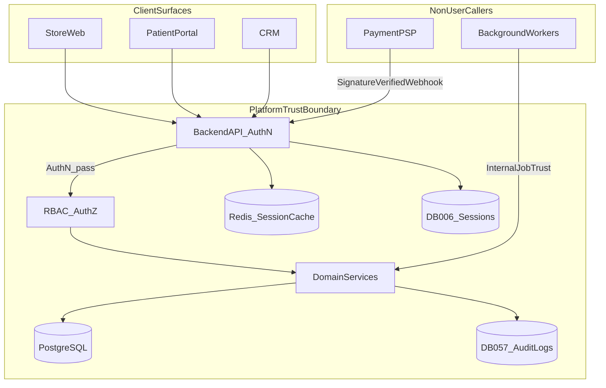
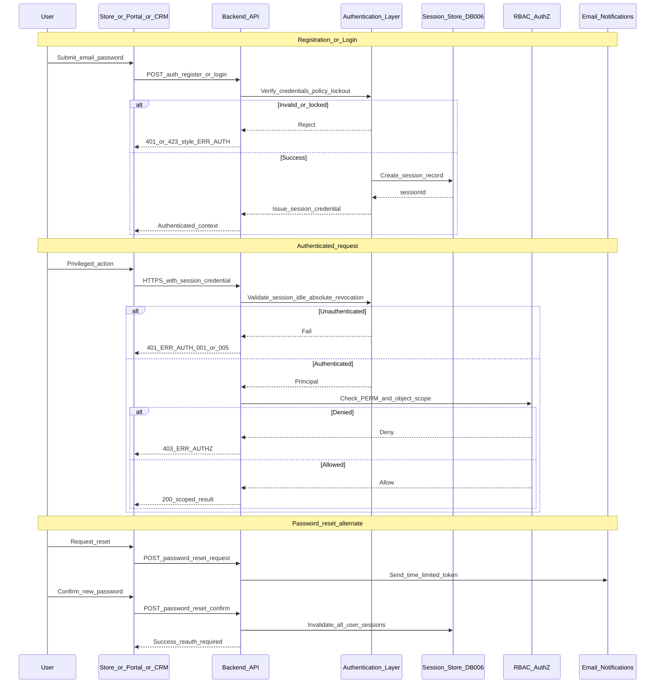
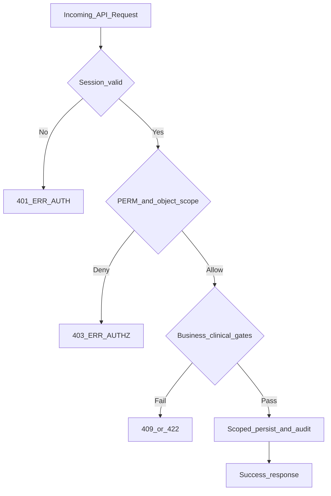
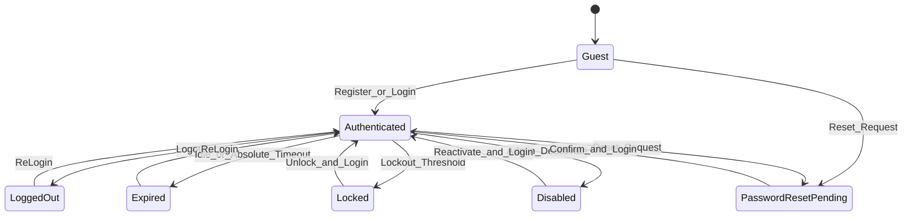
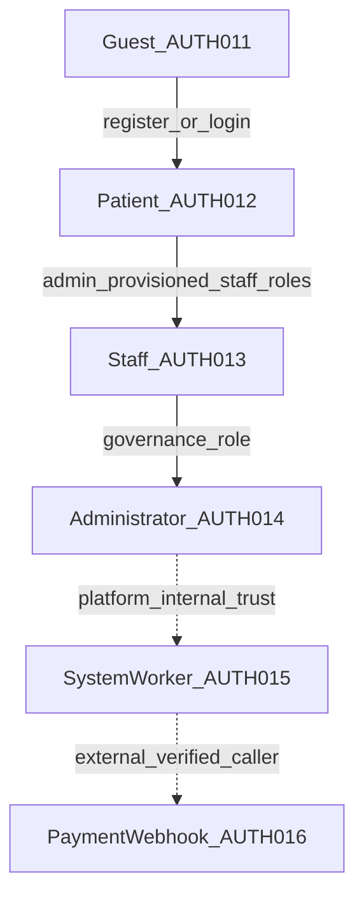

# 12 — Authentication Flow

| Field | Value |
| --- | --- |
| Document | Authentication Flow |
| Product | Clinexa |
| Version | 1.0 |
| Status | Approved — Implementation Ready |
| Primary market | United States |
| Audience | Security Architecture, Identity & Access Management, Backend Engineering, Clinical Ops, Operations, QA, Product |
| Source of truth | [00 — Product Requirements Document](00-product-requirements-document.md) |
| Related docs | [01 — Project overview](01-project-overview.md), [02 — Business requirements](02-business-requirements.md), [03 — Functional requirements](03-functional-requirements.md), [04 — Non-functional requirements](04-non-functional-requirements.md), [05 — System architecture](05-system-architecture.md), [06 — User personas](06-user-personas.md), [07 — User journeys](07-user-journeys.md), [08 — Role permissions](08-role-permissions.md), [09 — Feature roadmap](09-feature-roadmap.md), [10 — Database design](10-database-design.md), [11 — API design](11-api-design.md), [13 — Security](13-security.md), [14 — Notifications](14-notifications.md), [15 — Payment flow](15-payment-flow.md) |

This document is the **authoritative authentication and session planning** for Clinexa Version 1. It defines identity types, AuthN lifecycle, session policy, AuthZ decision integration, named authentication flows, security controls (logical), state transitions, and audit expectations—without prescribing frameworks, middleware, token wire formats, or source code.

It expands [PRD §8.3](00-product-requirements-document.md) Authentication, [03](03-functional-requirements.md) `FR-AUTH-001`–`006`, [04](04-non-functional-requirements.md) `NFR-040`–`047`/`052`, [05](05-system-architecture.md) `ARCH-040`/`041`, [08](08-role-permissions.md) RBAC, [10](10-database-design.md) identity entities, and [11](11-api-design.md) auth endpoints and errors.

It does **not** redefine role permission matrices ([08](08-role-permissions.md)), API path catalogs ([11](11-api-design.md)), database schemas ([10](10-database-design.md)), or threat-model depth ([13](13-security.md)). Authorization policy detail remains owned by [08](08-role-permissions.md); this document owns AuthN mechanics and how AuthN hands off to AuthZ.

> **Compliance posture:** Controls are **HIPAA-aware** (access control, attributable actors, auditability, patient isolation). This document does **not** claim HIPAA, HITRUST, or SOC 2 Type II certification as V1 delivery gates (PRD §1.5; NFR-065).

> **Implementation independence:** `AUTH-*` IDs are logical controls and flows. Session credential transport (cookie vs bearer), signing algorithms, password hashing algorithms, and OAuth/IdP configuration are deferred to implementation and [13](13-security.md). No JWT payloads, middleware, or OAuth client setup appear here.

---

## Table of contents

1. [Introduction](#1-introduction)
2. [Authentication Architecture](#2-authentication-architecture)
3. [Supported Identity Types](#3-supported-identity-types)
4. [Authentication Lifecycle](#4-authentication-lifecycle)
5. [Session Management](#5-session-management)
6. [Authorization Model](#6-authorization-model)
7. [Authentication Flows](#7-authentication-flows)
8. [Security Controls](#8-security-controls)
9. [Authentication State Machine](#9-authentication-state-machine)
10. [Authentication Error Catalog](#10-authentication-error-catalog)
11. [Audit & Compliance](#11-audit--compliance)
12. [Authentication Traceability Matrix](#12-authentication-traceability-matrix)
    - [12.1 Authentication Flow Index](#121-authentication-flow-index)
    - [12.2 Session Event Matrix](#122-session-event-matrix)
    - [12.3 Identity Trust Hierarchy](#123-identity-trust-hierarchy)
    - [12.4 Authentication Decision Matrix](#124-authentication-decision-matrix)
    - [12.5 Authentication Ownership Matrix](#125-authentication-ownership-matrix)
13. [Revision History](#13-revision-history)

---

## 1. Introduction

### 1.1 Purpose

Define production-grade authentication and session behavior for Clinexa so that:

- Patients and staff authenticate with email/password through one first-party identity system with role separation (PRD §8.3; `FR-AUTH-002`; `ARCH-040`).
- Every privileged and PHI-adjacent API call is session-validated then authorized server-side (`NFR-041`, `NFR-045`, `FR-AUTH-004`).
- Patient isolation and attributable staff access hold under normal authorization (`OR-06`, `FR-AUTH-005`, `NFR-046`/`047`, KPI-08).
- Password reset, lockout, and session revocation behave consistently across Store, Patient Portal, and CRM (`FR-AUTH-003`/`006`, `BP-08`, `AC-BR-08`).
- Non-user callers (background workers, payment webhooks) authenticate by trust model appropriate to their zone—not user sessions ([11](11-api-design.md) §3.2).

### 1.2 Scope

#### In scope (V1)

| Area | Coverage |
| --- | --- |
| Identity | Guest, Patient, Staff, Administrator, System Worker, Payment Webhook identity |
| AuthN lifecycle | Register, optional email verification branch, login, session, authenticated requests, logout, expiry, password reset |
| Session policy | Idle/absolute timeouts, multi-device, revocation, reset invalidation (`NFR-044`) |
| AuthZ handoff | Integration with [08](08-role-permissions.md) RBAC, object scope, SoD, default deny |
| Named flows | Patient login, CRM staff login, password reset, logout, session validation, protected API, webhook, worker |
| Security controls | Password policy, lockout, rate limits, CSRF (logical), credential storage principles, MFA readiness |
| Errors & audit | Mapping to `ERR-AUTH*` / `ERR-AUTHZ*` and `DB-057` AuditLogs |
| Traceability | BR → FR → RBAC → AUTH flows → API → DB |

#### Out of scope

| Area | Deferred to |
| --- | --- |
| Third-party IdP, OAuth, SSO/SAML, social login | Future (`ARCH-077`; FRS AUTH future enhancements) |
| MFA / step-up as V1 Must | Future (FRS AUTH future); readiness only in §8 |
| JWT JSON payloads, signing algorithms, cookie flag code | Implementation / [13](13-security.md) |
| Express/Nest middleware, OAuth client config | Implementation repositories |
| Role × permission matrices | [08](08-role-permissions.md) |
| Full threat model / OWASP hardening depth | [13](13-security.md) |
| Email template bodies | [14](14-notifications.md) |
| PSP merchant capture nuance | [15](15-payment-flow.md) |
| SaaS multi-org `tenant_id` | Not in V1 (PRD §11; RBAC-082) |

### 1.3 Audience

| Audience | Use of this document |
| --- | --- |
| Security / IAM architects | Validate AuthN architecture, session policy, identity trust levels |
| Backend engineers | Implement session validation and auth endpoints against `AUTH-*` / `API-*` |
| Frontend Store / Portal / CRM | Consume session contracts; never embed AuthZ or clinical gates |
| Clinical Ops / Compliance | Confirm attributable access and audit coverage |
| QA | Derive AuthN, lockout, isolation, and session-timeout tests |

### 1.4 References

| Document | Relevance |
| --- | --- |
| [00 — PRD](00-product-requirements-document.md) | Single source of truth; §8.3 Auth, §9.9 Password Reset, §13 isolation/RBAC |
| [02 — Business requirements](02-business-requirements.md) | `BP-08`, `OR-06`/`07`, `AC-BR-08` |
| [03 — Functional requirements](03-functional-requirements.md) | `FR-AUTH-001`–`006`, related Store/Portal/Admin FRs |
| [04 — Non-functional requirements](04-non-functional-requirements.md) | `NFR-040`–`047`, `NFR-052`, `NFR-057`/`062`, `NFR-117`/`119`/`120` |
| [05 — System architecture](05-system-architecture.md) | `ARCH-040`/`041`/`018`/`029`/`015`/`077` |
| [07 — User journeys](07-user-journeys.md) | `JRN-002`, `JRN-003`, checkout auth gates |
| [08 — Role permissions](08-role-permissions.md) | Roles, `PERM-*`, SoD, claim purposes, AuthZ flow |
| [10 — Database design](10-database-design.md) | `DB-001`–`008`, `DB-057` |
| [11 — API design](11-api-design.md) | `API-003`–`008`, `API-068`, error catalog |

---

## 2. Authentication Architecture

### 2.1 Overview

Clinexa uses a **first-party identity module** inside the modular Backend API (`ARCH-040`). Clients never own clinical or payment gates; they present credentials or session proofs to the API, which validates AuthN and then evaluates AuthZ (`ARCH-014`, `ARCH-029`, `ARCH-031`).

| ID | Principle |
| --- | --- |
| **AUTH-001** | Single Backend API is the AuthN/AuthZ enforcement point for Store, Portal, and CRM |
| **AUTH-002** | Session/token credentials are identity carriers only; permissions are re-resolved server-side (`RBAC-086`) |
| **AUTH-003** | Redis may cache session state; **DB-006 Sessions** is the revocation authority |
| **AUTH-004** | Fail closed on AuthN or AuthZ failure; prefer opaque cross-patient denial ([11](11-api-design.md) §4.4) |

### 2.2 Identity Provider

| ID | Detail |
| --- | --- |
| **AUTH-005** | **Identity Provider (V1)** = Clinexa first-party Authentication module (`ARCH-040`): email/password for patients and staff with role separation (PRD §8.3) |
| Future | External IdP/OAuth maps at `ARCH-041` / `ARCH-077`; RBAC remains server-side. **Not in V1.** |

Staff are not registered via Store self-service; Administrators provision staff identities (`FR-ADM-001`, `ARCH-041`). Patients self-register (`FR-AUTH-001`, `JRN-002`).

### 2.3 Authentication Layer

| ID | Responsibility |
| --- | --- |
| **AUTH-006** | Registration, login, logout, password-reset request/confirm, lockout/abuse counters (`API-003`–`007`, `FR-AUTH-001`–`003`/`006`, `DB-008`) |
| Issuance | On successful login or registration, create a server-side session (`DB-006`) and issue a session credential bound to `sessionId` |
| Notifications | Password-reset and related emails via notification path (`FR-NTF-001`, [14](14-notifications.md)) |

### 2.4 Session Validation

| ID | Responsibility |
| --- | --- |
| **AUTH-007** | On every privileged/PHI-adjacent request: validate credential integrity, session existence, revocation, idle timeout, absolute lifetime, account lockout/disabled state (`NFR-041`, `NFR-044`, `RBAC-081`) |
| Discovery | `GET /v1/auth/session` (`API-008`) returns a non-sensitive identity summary for clients |
| Failure | Unauthenticated → **401** `ERR-AUTH-001` (or expired variant `ERR-AUTH-005`) |

### 2.5 Authorization Layer

| ID | Responsibility |
| --- | --- |
| **AUTH-008** | After AuthN succeeds, evaluate `PERM-*` and object scope from [08](08-role-permissions.md) (`FR-AUTH-004`, `NFR-045`) |
| Separation | AuthN answers *who*; AuthZ answers *what* and *which objects*. UI hiding is non-authoritative (`RBAC-086`) |
| Isolation | Patient principals are constrained to own records (`FR-AUTH-005`, `OR-06`) |

### 2.6 API Integration

| ID | Detail |
| --- | --- |
| **AUTH-009** | API zones from [11](11-api-design.md) §3.2 consume distinct trust models |

| Zone | AuthN model |
| --- | --- |
| Public | None (rate-limited); auth entry points allowed |
| Authenticated | Patient session/token |
| CRM | Staff session/token + `PERM-CRM-020` |
| Worker | Internal job trust (`ARCH-015`) |
| Webhook | PSP signature verification (`API-068`)—not user session |

### 2.7 Backend Responsibilities

| ID | Duty |
| --- | --- |
| **AUTH-010** | Backend owns: credential verification, session lifecycle, RBAC policy evaluation, patient-scoped persistence (`ARCH-032`), audit emission (`DB-057`), rate/lockout enforcement |
| Clients | Store (`ARCH-011`), Portal (`ARCH-012`), CRM (`ARCH-013`) present credentials and render allowed UI only |
| Never | Client-trusted clinical gates, payment authority, or cross-patient access |

### 2.8 Architecture diagram



---

## 3. Supported Identity Types

| ID | Identity | Trust level | How established | Capabilities | Explicit denials |
| --- | --- | --- | --- | --- | --- |
| **AUTH-011** | **Guest** (`ROLE-001`) | Unauthenticated / lowest | No `DB-001` row until register | Browse published catalog/content; build cart; start journeys that do not finalize checkout (`FR-STO-001`, `JRN-001`) | Checkout finalize; Portal; CRM; PHI of any patient (`PERM-CHK-002`, `PERM-CRM-020`) |
| **AUTH-012** | **Patient** (`ROLE-002`) | Authenticated end-user | Self-register email/password (`FR-AUTH-001`) or login (`FR-AUTH-002`) | Own profile, orders, QST, Rx status, documents, appointments, subscriptions, tickets (`FR-PRT-001`/`002`); Store checkout finalize | Other patients’ data (`FR-AUTH-005`); CRM staff workflows (`FR-PRT-006`, `PERM-CRM-020`) |
| **AUTH-013** | **Staff** (`ROLE-003`–`008`) | Authenticated workforce | Admin-provisioned (`FR-ADM-001`); login to CRM entry | Role-scoped CRM actions per [08](08-role-permissions.md); attributable individual accounts (`NFR-047`, `OR-06`) | Permissions outside assigned roles; Marketing/Content default clinical notes / full QST answers (`OR-07`, `FR-CRM-006`) |
| **AUTH-014** | **Administrator** (`ROLE-009`) | Authenticated governance | Admin-provisioned; elevated config/user management | Users/roles, settings, audited config (`FR-ADM-001`/`004`); still subject to SoD (e.g. not default prescribe) | Shared anonymous clinical use; bypass of audit or patient isolation tests |
| **AUTH-015** | **System Worker** | Platform internal | Job broker / internal trust (`ARCH-015`); not a browser user session | Domain operations: renewals, notifications, cleanup, reindex, alerts—same domain AuthZ model | Must not impersonate arbitrary patients without policy; must not skip clinical/payment fail-safes |
| **AUTH-016** | **Payment Webhook Identity** | External PSP, cryptographically verified | Provider signature on `API-068` | Drive payment/order/subscription state transitions idempotently (`FR-PAY-002`, `DB-031`) | Not a staff session; invalid signature → reject (`ERR-PAY-003`); no CRM UI access |

**Dual-role note:** Dual role only via explicit assignment (`RBAC-030`); permissions re-resolved server-side on each request (`AUTH-002`).

---

## 4. Authentication Lifecycle

### 4.1 Lifecycle chain

| Stage | ID | V1 behavior |
| --- | --- | --- |
| Guest | AUTH-011 | Unauthenticated Store use |
| Registration | **AUTH-017** | Guest → Patient user + Patient role (`FR-AUTH-001`, `API-003`, `JRN-002`); staff never via Store register |
| Email Verification | **AUTH-018** | **Not required** for V1 register/login. Conditional only if product later enables mailbox confirmation (domain event *Email Verified* in FRS §12 / `ARCH-040`). Non-blocking for V1. |
| Login | **AUTH-019** | Email/password → session credential (`FR-AUTH-002`, `API-004`, `JRN-003`) |
| Session Creation | **AUTH-020** | Persist `DB-006`; bind credential to `sessionId`; apply idle/absolute limits (`NFR-044`) |
| Authenticated Requests | **AUTH-021** | Validate session then AuthZ (`NFR-041`, §6) |
| Logout | **AUTH-022** | Revoke current session (`API-005`, `PERM-AUTH-004`) |
| Session Expiration | **AUTH-023** | Idle or absolute timeout → require re-auth (`ERR-AUTH-005`) |
| Password Reset | **AUTH-024** | Time-limited email token; on success invalidate **all** sessions (`FR-AUTH-003`, `API-006`/`007`, `BP-08`) |

```text
Guest
  → Registration
  → Email Verification (if applicable; not V1 Must)
  → Login
  → Session Creation
  → Authenticated Requests
  → Logout
  → Session Expiration
  → Password Reset (alternate from Login / Locked paths)
```

### 4.2 Sequence diagram



### 4.3 Cart continuity

Across registration/login mid-checkout, cart preserve/merge follows `FR-CART-004` / `JRN-002`–`007`. Auth expiry during checkout denies finalize and prompts re-auth without inventing unpaid fulfillment (`FR-CHK-001`).

---

## 5. Session Management

### 5.1 Session lifecycle

| ID | Phase | Rule |
| --- | --- | --- |
| **AUTH-020** | Issue | Created on successful register/login; correlated via `sessionId` |
| **AUTH-007** | Validate | Every privileged request checks integrity, revocation, timeouts, account state |
| **AUTH-025** | Maintain | Successful authenticated activity may refresh idle window; absolute lifetime still caps session |
| **AUTH-022** / **AUTH-023** / **AUTH-024** | End | Logout, idle/absolute expiry, password reset, deactivate, or security revocation |

Logical credential properties (implementation-independent): bound to `sessionId`; carries identity correlation purposes described in [08](08-role-permissions.md) JWT Claims Reference (`userId`, role(s), `sessionId`, issued/expiry, `tokenVersion`) **without** prescribing JWT encoding; permissions claims if present are **advisory only**.

Transport (cookie vs bearer) must satisfy `NFR-041` and remain suitable for future mobile (`NFR-120`)—no browser-only assumption for API core.

### 5.2 Idle timeout

| Control | Value | Source |
| --- | --- | --- |
| Idle timeout | **≤ 30 minutes** on staff/PHI surfaces | `NFR-044`, `RBAC-081` |
| Effect | Session treated expired; client must re-authenticate (`ERR-AUTH-005`) | AUTH-023 |

### 5.3 Absolute timeout

| Control | Value | Source |
| --- | --- | --- |
| Absolute lifetime | **≤ 12 hours** from issuance | `NFR-044` |
| Effect | Session ends even if continuously active within idle windows | AUTH-023 |

### 5.4 Session revocation

| Trigger | Scope | References |
| --- | --- | --- |
| Logout | Current session | `API-005`, AUTH-022 |
| Password reset confirm | **All** sessions for the user | `API-007`, `FR-AUTH-003`, AUTH-024 |
| Account deactivate | All sessions; block further AuthN | `API-013`, `DB-001` lifecycle |
| Lockout / `tokenVersion` bump / privilege security event | Prior credentials invalidated | [08](08-role-permissions.md) claim rules; `DB-008` |
| Admin/security revocation | Targeted or bulk session invalidate | Audit required (§11) |

**Authority:** Redis may cache; **DB-006 is revocation authority** (`AUTH-003`).

### 5.5 Multi-device sessions

| Policy | V1 decision |
| --- | --- |
| Concurrent devices | **Allowed** — independent sessions per device/client |
| Independence | Each session has its own idle/absolute clocks |
| Global revoke | Password reset, deactivate, and security `tokenVersion` events revoke all |

### 5.6 Concurrent login policy

No hard V1 cap on concurrent sessions beyond abuse protections (`FR-AUTH-006`, `NFR-052`). Abuse is handled via lockout and rate limits, not by inventing single-session-only product behavior.

### 5.7 Remember Me policy

| Policy | V1 decision |
| --- | --- |
| Remember Me | **Not offered in V1** |
| Rationale | Idle and absolute limits in `NFR-044` always apply; extending lifetime would invent scope outside approved NFRs |

### 5.8 Session invalidation after password reset

Mandatory (`FR-AUTH-003`, `AC-AUTH-001`, `BP-08`, PRD §9.9): after successful reset confirm, all active sessions are invalidated before the user signs in with new credentials. Stolen session reuse after rotation must fail closed (FRS AUTH edge cases).

---

## 6. Authorization Model

Authoritative permission matrices, SoD rules, and `PERM-*` dictionary live in [08 — Role permissions](08-role-permissions.md). This section defines how AuthN integrates with that model.

### 6.1 RBAC

- Every privileged and PHI-adjacent operation checks server-side RBAC (`FR-AUTH-004`, `NFR-045`).
- Roles: `ROLE-001`–`ROLE-009` ([08](08-role-permissions.md) §3).
- Auth-related permissions: `PERM-AUTH-001`–`005` (register, sign-in, password reset, session end, enforce RBAC).

### 6.2 Permission evaluation

Order of enforcement ([11](11-api-design.md) §4.5; [08](08-role-permissions.md) Authorization Request Flow):

1. Authenticate → fail **401**
2. RBAC + object scope → fail **403** (audit PHI-adjacent denies per `RBAC-072`)
3. Business/clinical/inventory/state gates → **409** / **422**
4. Persist via patient-scoped / RBAC-filtered repository (`ARCH-032`)

Role changes mid-session take effect on **subsequent** authorization (current assignments loaded server-side; stale advisory permission lists ignored).

### 6.3 Object-level authorization

- Scope types include own-patient, case, and ticket ([08](08-role-permissions.md)).
- Patient isolation is patient-scoped, not SaaS org tenancy (`RBAC-082`).
- Cross-patient ID access prefers **404** without leaking existence of other patients’ PHI ([11](11-api-design.md) §4.4).

### 6.4 Patient isolation

`OR-06` / `FR-AUTH-005` / `FR-PRT-002` / `NFR-046` / KPI-08: patients access only their own records. Staff access is role-scoped and attributable; no shared anonymous clinical accounts in production-like environments (`NFR-047`).

### 6.5 Clinical separation of duties

`OR-07` and `RBAC-020`+: e.g. doctor ≠ fulfill, pharmacist ≠ prescribe, support ≠ Rx approve, marketing/content clinical deny, payment success ≠ dispensing authority (`OR-03`). AuthN success never implies clinical gate pass.

### 6.6 Least privilege and default deny

`RBAC-001` / `ARCH-005`: default deny for clinical notes, full questionnaire answers, admin config, and CRM routes for patients/guests. Grant only explicit `PERM-*`.

### 6.7 Authorization decision flow



---

## 7. Authentication Flows

### 7.1 Patient Login — AUTH-026

| Field | Detail |
| --- | --- |
| Purpose | Authenticate a Patient for Store and/or Patient Portal |
| Actors | Patient (`USER-002` / `ROLE-002`); System (AuthN) |
| Preconditions | Account exists and is not Disabled; not Locked (or lockout window elapsed); email/password credentials |
| Flow | 1. User submits email/password on Store or Portal (`JRN-003`). 2. `API-004` verifies credentials and lockout state. 3. Create `DB-006` session; issue credential (`AUTH-020`). 4. Subsequent Portal/Store authenticated calls use session (`AUTH-021`). 5. Optional cart merge per `FR-CART-004`. |
| Failure cases | Invalid credentials (`ERR-AUTH-002`); locked (`ERR-AUTH-003`); rate limited (`ERR-RATE-001`); disabled account denied |
| Related FRs | `FR-AUTH-002`, `FR-AUTH-006`, `FR-PRT-001`, `FR-STO-003`; `API-004`; `AC-BR-08` |

### 7.2 CRM Staff Login — AUTH-027

| Field | Detail |
| --- | --- |
| Purpose | Authenticate staff/Administrator for CRM |
| Actors | Staff roles / Administrator; System |
| Preconditions | Admin-provisioned user with staff role assignment(s); attributable individual account (`NFR-047`) |
| Flow | 1. User submits email/password at CRM entry. 2. `API-004` authenticates. 3. Session issued. 4. CRM shell requires `PERM-CRM-020`. 5. Each CRM action re-checks `PERM-*` and object scope. |
| Failure cases | Invalid credentials; lockout; Patient or Guest principal on CRM routes → `ERR-AUTHZ-003`; staff without required role → `ERR-AUTHZ-001` |
| Related FRs | `FR-AUTH-002`/`004`, `FR-CRM-001`–`007`, `FR-ADM-001`; `API-004`; `PERM-CRM-020` |

### 7.3 Password Reset — AUTH-028

| Field | Detail |
| --- | --- |
| Purpose | Allow Patient or Staff to rotate password via time-limited email token and invalidate prior sessions |
| Actors | Patient or Staff; System; Email provider |
| Preconditions | Account with known email; rate limits allow request |
| Flow | 1. `API-006` request reset (generic success messaging to limit enumeration beyond policy). 2. Persist hashed single-use token (`DB-007`); email link (`FR-NTF-001`). 3. User submits new password meeting policy via `API-007`. 4. Update credential; invalidate **all** sessions (`AUTH-024`). 5. User logs in with new password (`AUTH-019`). |
| Failure cases | Expired/invalid/reused token (`ERR-AUTH-004`); weak password (`NFR-042`); rate limit; locked account may still use reset path per security design if unlock-via-reset is enabled—otherwise remain Locked until unlock policy |
| Related FRs | `FR-AUTH-003`, `FR-AUTH-006`, `BP-08`, `AC-AUTH-001`, `API-006`/`007` |

### 7.4 Logout — AUTH-029

| Field | Detail |
| --- | --- |
| Purpose | End the current authenticated session |
| Actors | Patient or Staff; System |
| Preconditions | Valid current session |
| Flow | 1. Client calls `API-005`. 2. Revoke current `DB-006` session. 3. Client clears local session credential. 4. Further privileged calls require re-login. |
| Failure cases | Already expired/revoked session → treat as logged out; unauthenticated logout is no-op or 401 per API convention |
| Related FRs | `FR-AUTH-002` (sign-out in AUTH scope); `PERM-AUTH-004`; `API-005` |

### 7.5 Session Validation — AUTH-030

| Field | Detail |
| --- | --- |
| Purpose | Confirm active session and return non-sensitive identity summary |
| Actors | Authenticated Patient or Staff; System |
| Preconditions | Session credential presented |
| Flow | 1. Client calls `API-008` (or equivalent). 2. AuthN validates idle/absolute/revocation/lockout (`AUTH-007`). 3. Return identity summary (roles advisory for UI). 4. Dual-role identities still re-resolved server-side for AuthZ. |
| Failure cases | Missing/invalid → `ERR-AUTH-001`; expired → `ERR-AUTH-005`; revoked → session revoked mapping (§10) |
| Related FRs | `FR-AUTH-002`/`004`; `NFR-041`/`044`; `API-008`; `RBAC-081` |

### 7.6 Protected API Request — AUTH-031

| Field | Detail |
| --- | --- |
| Purpose | Execute a privileged or PHI-adjacent operation under AuthN + AuthZ |
| Actors | Patient, Staff, or Administrator; System |
| Preconditions | Endpoint requires authentication; principal has appropriate surface (Portal vs CRM) |
| Flow | 1. Client sends HTTPS request with session credential. 2. AuthN validation (`AUTH-007`). 3. AuthZ `PERM-*` + object scope (`AUTH-008`). 4. Business/clinical gates. 5. Scoped persistence + audit when required. |
| Failure cases | 401 AuthN errors; 403 AuthZ errors; 404 preferred for cross-patient; 409/422 for state/policy |
| Related FRs | `FR-AUTH-004`/`005`, `NFR-045`/`046`/`117`; [11](11-api-design.md) §4.5 |

### 7.7 Webhook Authentication — AUTH-032

| Field | Detail |
| --- | --- |
| Purpose | Authenticate inbound PSP payment events without user sessions |
| Actors | Payment PSP; Backend API |
| Preconditions | Shared webhook signing secret/configuration; endpoint `API-068` |
| Flow | 1. PSP posts event. 2. Verify provider signature. 3. Enforce idempotency via `DB-031`. 4. Apply payment/order/subscription transitions (`FR-PAY-002`). 5. May return success on idempotent replay after valid signature. |
| Failure cases | Invalid signature → `ERR-PAY-003`; must not process as staff AuthN |
| Related FRs | `FR-PAY-002`, `NFR-033`, `RBAC-041`, `API-068`, AUTH-016 |

### 7.8 Worker Authentication — AUTH-033

| Field | Detail |
| --- | --- |
| Purpose | Allow background workers to execute domain jobs under platform trust |
| Actors | Background workers (`ARCH-015`); Domain services |
| Preconditions | Job dequeued from trusted broker; worker runtime in platform trust boundary |
| Flow | 1. Worker receives job. 2. Internal job trust—**not** end-user JWT. 3. Invoke same domain services/AuthZ model for business rules. 4. Emit audit where actions are security/clinical relevant. 5. Jobs include token cleanup, renewals, notifications, reindex. |
| Failure cases | Untrusted invocation path rejected; domain fail-safes still apply (no unpaid fulfillment, clinical gates intact) |
| Related FRs | Cross-cutting reliability/NFR; `ARCH-015`/`080`; AUTH-015 |

---

## 8. Security Controls

All controls below are **logical**. Algorithms, library choices, and cookie flag literals are deferred to [13](13-security.md) / implementation.

| ID | Control | V1 requirement | Source |
| --- | --- | --- | --- |
| **AUTH-034** | Password policy | Minimum length **≥ 12**; reject known breached passwords when check available; avoid mandatory composition theater | `NFR-042` |
| **AUTH-035** | Account lockout | Lock after **≥ 5** consecutive failed attempts within **15 minutes**; unlock via time and/or admin | `NFR-043`, `FR-AUTH-006`, `DB-008` |
| **AUTH-036** | Brute-force / rate limiting | Auth login attempts **≤ 10 / IP / 15 min**; document 429 + retry guidance | `NFR-052`, `NFR-119`, `ERR-RATE-001` |
| **AUTH-037** | MFA readiness | V1 does **not** require MFA. Architecture must not preclude future MFA/step-up for clinical actions (FRS AUTH future) | Future; not Must |
| **AUTH-038** | Secure session credentials | Credentials must be confidential in transit (TLS `NFR-040`), integrity-protected, bound to `sessionId`, revocable, and non-forgeable under normal threat assumptions—logical only | `NFR-040`/`041` |
| **AUTH-039** | CSRF protection | Browser clients that bind sessions via cookies must use anti-CSRF measures appropriate to that transport; bearer-style API clients follow token-in-header patterns without inventing new products | Logical; transport-dependent |
| **AUTH-040** | Rate limiting (broader) | Public writes and auth entry rate-limited; align with API catalog | `NFR-052`/`119` |
| **AUTH-041** | Replay protection | Password-reset tokens single-use + TTL (`DB-007`); webhook events idempotent (`DB-031`); session credentials not reusable after revocation | `FR-AUTH-003`, `FR-PAY-002` |
| **AUTH-042** | Credential storage principles | Store password **hashes only**—never plaintext; reset tokens stored hashed; secrets not in source control (`NFR-049`) | `DB-001`/`007`; NFR-048/049 |
| **AUTH-043** | Device trust considerations | Trust model is **attributable user accounts + revocable sessions**, not a device-fingerprinting product. Multi-device allowed (§5.5). No shared anonymous clinical accounts (`NFR-047`) | `OR-06` |
| **AUTH-044** | Enumeration hygiene | Invalid credential and reset-request responses fail closed and avoid unnecessary account disclosure beyond approved policy | FRS AUTH alternatives |
| **AUTH-045** | TLS | All client–API traffic TLS 1.2+ | `NFR-040` |

**Password expiration:** Forced periodic password expiry is **not** a V1 Must FR. Do not treat “password expired” as an enforced AuthN state in V1 (see §10).

---

## 9. Authentication State Machine

### 9.1 States

| ID | State | Meaning |
| --- | --- | --- |
| **AUTH-046** | Guest | No authenticated principal; public Store capabilities only |
| **AUTH-047** | Authenticated | Valid session; AuthZ applies per role |
| **AUTH-048** | Locked | Account lockout active (`DB-008`); AuthN denied until unlock policy |
| **AUTH-049** | Password Reset Pending | Valid reset token outstanding (`DB-007`); user may complete reset |
| **AUTH-050** | Expired | Session idle or absolute timeout reached; must re-authenticate |
| **AUTH-051** | Logged Out | Session explicitly revoked by logout |
| **AUTH-052** | Disabled | User deactivated; AuthN blocked; clinical/order FKs retained (`DB-001` lifecycle) |

Aligned with identity lifecycle Create → Active → Security → Deactivate in [10](10-database-design.md) §7.1.

### 9.2 Transition table

| From | To | Trigger | Allowed? | Business rule |
| --- | --- | --- | --- | --- |
| Guest | Authenticated | Successful register or login | Yes | Patient role on self-register; staff only if provisioned |
| Guest | Password Reset Pending | Reset request for existing account | Yes | Token emailed; do not leak existence beyond policy |
| Authenticated | Logged Out | Logout (`API-005`) | Yes | Revoke current session only |
| Authenticated | Expired | Idle ≤30 min or absolute ≤12 h | Yes | `NFR-044` |
| Authenticated | Locked | Failed AuthN threshold while credential attacks accumulate on account | Yes | `NFR-043` |
| Authenticated | Disabled | Admin deactivate | Yes | Revoke sessions; block AuthN |
| Authenticated | Authenticated | New login on another device | Yes | Multi-device allowed (`AUTH-025` family) |
| Authenticated | Password Reset Pending | User requests reset while logged in | Yes | Completing reset revokes **all** sessions |
| Password Reset Pending | Authenticated | Reset confirm + subsequent login | Yes | All prior sessions invalidated first (`FR-AUTH-003`) |
| Password Reset Pending | Guest / Logged Out | Token expiry without confirm | Yes | Must request new token (`ERR-AUTH-004`) |
| Locked | Authenticated | Unlock (time elapsed and/or admin) + successful login | Yes | Counters cleared per security design |
| Locked | Password Reset Pending | Reset request (if allowed by unlock policy) | Conditional | Must not weaken lockout intent |
| Expired | Authenticated | Re-login | Yes | New session |
| Logged Out | Authenticated | Re-login | Yes | New session |
| Disabled | Authenticated | Reactivation by Admin + login | Conditional | Audited reactivation only |
| Disabled | Guest (effective) | Any AuthN attempt | AuthN denied | Prefer deactivate over hard delete |

### 9.3 Forbidden transitions

| Transition | Forbidden because |
| --- | --- |
| Guest → CRM Authenticated staff capabilities without provisioned staff role | Staff not created via Store registration |
| Authenticated Patient → CRM shell | `PERM-CRM-020` / `ERR-AUTHZ-003` |
| Expired / Logged Out / Disabled → privileged API success without new AuthN | `NFR-041` |
| Password Reset Pending → Authenticated **without** invalidating prior sessions | Violates `FR-AUTH-003` / `AC-AUTH-001` |
| Locked → Authenticated via raw password guess while still locked | Violates `NFR-043` |
| Any → skip AuthZ after AuthN for PHI-adjacent ops | Violates `FR-AUTH-004` / default deny |

### 9.4 State overview diagram



---

## 10. Authentication Error Catalog

Logical authentication/authorization errors align with [11 — API Design](11-api-design.md) §9. Preserve **401 vs 403** (`NFR-117`).

### 10.1 Authentication errors

| AUTH ID | API error | Meaning | Typical HTTP |
| --- | --- | --- | --- |
| **AUTH-053** | `ERR-AUTH-001` | Unauthenticated / invalid session | 401 |
| **AUTH-054** | `ERR-AUTH-002` | Invalid credentials | 401 |
| **AUTH-055** | `ERR-AUTH-003` | Account locked | 401 or policy-equivalent locked response |
| **AUTH-056** | `ERR-AUTH-004` | Password reset token invalid/expired | 400/422 per API convention |
| **AUTH-057** | `ERR-AUTH-005` | Session expired (idle/absolute) | 401 |
| **AUTH-058** | Session revoked | Session explicitly revoked (logout, reset, admin)—clients treat as unauthenticated; map to `ERR-AUTH-001` unless API distinguishes | 401 |

### 10.2 Authorization errors

| AUTH ID | API error | Meaning | Typical HTTP |
| --- | --- | --- | --- |
| **AUTH-059** | `ERR-AUTHZ-001` | Missing permission (Permission denied) | 403 |
| **AUTH-060** | `ERR-AUTHZ-002` | Object scope denied (incl. cross-patient) | 403 (or **404** preferred when hiding existence) |
| **AUTH-061** | `ERR-AUTHZ-003` | CRM shell denied for patient/guest | 403 |
| **AUTH-062** | `ERR-AUTHZ-004` | Clinical data denied for Marketing/Content | 403 |

### 10.3 Related errors

| AUTH ID | API error | Meaning | Typical HTTP |
| --- | --- | --- | --- |
| **AUTH-063** | `ERR-RATE-001` | Rate limit exceeded | 429 |
| **AUTH-064** | `ERR-PAY-003` | Webhook signature invalid | 401/403 per webhook convention |

### 10.4 Password expired

| Topic | V1 stance |
| --- | --- |
| Forced password expiry | **Not a V1 Must control** (no FR) |
| Catalog treatment | Do **not** introduce a required `ERR-AUTH` password-expired code for V1 enforcement |
| Future | If product adds expiry policy, add error mapping then—without changing this doc’s V1 Must set prematurely |

---

## 11. Audit & Compliance

### 11.1 Audit sink

Security and access events that require accountability are written to **`DB-057` AuditLogs** (append-only; distinct from debug logs; retention **≥ 1 year** intent — `NFR-057`, `NFR-062`, `NFR-076`).

Minimum fields: **actor user id**, **role(s) snapshot at time of action**, **action**, **timestamp**, **object type/id**, **outcome**.

### 11.2 Required auth-related audit events

| Event | Audit? | Notes |
| --- | --- | --- |
| Successful login | Yes | Actor, surface (Store/Portal/CRM), outcome success |
| Failed login | Yes | Outcome failure; support abuse analysis without storing plaintext passwords |
| Password reset request | Yes | Request initiated; token secrets never logged |
| Password reset confirm | Yes | Credential rotation; session invalidation outcome |
| Role change | Yes | `FR-ADM-001`/`004`; before/after role assignment attributable |
| Permission / role-permission change | Yes | `FR-ADM-004` |
| Session revocation | Yes | Logout (current), reset (all), admin revoke, deactivate |
| Sensitive access | Yes | Privileged CRM/admin reads where policy requires (`RBAC-072` for PHI-adjacent denies) |
| Clinical access | Yes | Clinical decisions and clinical record access per clinical modules + `NFR-057` |
| Document downloads | Yes | PHI document view/download (`FR-DOC-004`) |

### 11.3 Compliance posture

- HIPAA-aware access control and auditability; **no** certification claim as V1 gate (PRD §1.5; NFR-065).
- Patient isolation verified continuously (`AC-BR-08`, KPI-08).
- Marketing/Content clinical boundary audited when denied or attempted (`OR-07`, `FR-CRM-006`).

---

## 12. Authentication Traceability Matrix

| Business | Functional | RBAC / PERM | AUTH control / flow | API | Database |
| --- | --- | --- | --- | --- | --- |
| PRD §8.3 Auth; ROAD-002 | `FR-AUTH-001` | `PERM-AUTH-001` | AUTH-017 Registration; AUTH-011/012 | `API-003` | `DB-001`, `DB-005` |
| PRD §8.3; `JRN-003` | `FR-AUTH-002` | `PERM-AUTH-002` | AUTH-019; AUTH-026; AUTH-027 | `API-004` | `DB-001`, `DB-006`, `DB-008` |
| Sign-out in AUTH scope | `FR-AUTH-002` | `PERM-AUTH-004` | AUTH-022; AUTH-029 | `API-005` | `DB-006` |
| `BP-08`; PRD §9.9; `AC-BR-08` | `FR-AUTH-003` | `PERM-AUTH-003` | AUTH-024; AUTH-028 | `API-006`, `API-007` | `DB-007`, `DB-006` |
| `OR-06`; KPI-08; `AC-BR-08` | `FR-AUTH-004`, `FR-AUTH-005` | `PERM-AUTH-005`; `RBAC-001`/`026`/`082` | AUTH-008; AUTH-031; §6 | All privileged `/v1` | `DB-001`–`005`, scoped domain tables |
| `OR-07` | `FR-AUTH-004`, `FR-CRM-006` | `RBAC-020+`; `ERR-AUTHZ-004` | AUTH-062 | CRM clinical reads | Clinical entities + `DB-057` |
| Abuse protection | `FR-AUTH-006` | — | AUTH-035; AUTH-036; AUTH-048 | `API-004` | `DB-008` |
| Session policy `NFR-044` | `FR-AUTH-002`/`003` | `RBAC-081` | AUTH-007; AUTH-020; AUTH-023; AUTH-025; AUTH-030 | `API-008` | `DB-006` |
| Staff attributable `OR-06` | `FR-ADM-001`, `NFR-047` | `ROLE-003`–`009` | AUTH-013; AUTH-014; AUTH-027 | `API-004`, admin user APIs | `DB-001`, `DB-005`, `DB-009` |
| Checkout auth gate | `FR-CHK-001`, `FR-STO-003` | `PERM-CHK-002` | AUTH-011 deny finalize; AUTH-012 allow | Checkout APIs | Cart/Order entities |
| Payment webhooks | `FR-PAY-002` | `RBAC-041` | AUTH-016; AUTH-032 | `API-068` | `DB-028`, `DB-031` |
| Workers | Platform ops | Domain AuthZ | AUTH-015; AUTH-033 | Worker → domain | Shared SoR |
| Audit | `FR-ADM-004`, `FR-DOC-004`, `NFR-057` | `RBAC-058`/`072` | §11 | — | `DB-057` |

### 12.1 Authentication Flow Index

Centralized navigation for architects and developers: where every authentication workflow is defined in this document and how it links to APIs and functional requirements.

| Authentication Flow | AUTH IDs | Related API Endpoints | Related Functional Requirements | Primary Actors |
| --- | --- | --- | --- | --- |
| Patient Registration | AUTH-017; AUTH-011 → AUTH-012; AUTH-020 | `API-003` | `FR-AUTH-001`, `FR-STO-003`, `FR-CART-004` | Guest → Patient; System |
| Patient Login | AUTH-019; AUTH-026; AUTH-020; AUTH-021 | `API-004` | `FR-AUTH-002`, `FR-AUTH-006`, `FR-PRT-001`, `FR-STO-003` | Patient; System |
| CRM Staff Login | AUTH-019; AUTH-027; AUTH-013; AUTH-014 | `API-004` | `FR-AUTH-002`, `FR-AUTH-004`, `FR-ADM-001`, `FR-CRM-001`–`007` | Staff; Administrator; System |
| Password Reset | AUTH-024; AUTH-028; AUTH-049 | `API-006`, `API-007` | `FR-AUTH-003`, `FR-AUTH-006`, `FR-NTF-001` | Patient or Staff; System |
| Logout | AUTH-022; AUTH-029; AUTH-051 | `API-005` | `FR-AUTH-002` (sign-out), `PERM-AUTH-004` | Patient or Staff; System |
| Session Validation | AUTH-007; AUTH-030; AUTH-025 | `API-008` | `FR-AUTH-002`, `FR-AUTH-004`; `NFR-041`/`044` | Patient or Staff; System |
| Protected API Request | AUTH-021; AUTH-031; AUTH-008 | Privileged `/v1` endpoints ([11](11-api-design.md) §4.5) | `FR-AUTH-004`, `FR-AUTH-005` | Patient, Staff, or Administrator; System |
| Webhook Authentication | AUTH-016; AUTH-032 | `API-068` | `FR-PAY-002` | Payment PSP; Backend API |
| Worker Authentication | AUTH-015; AUTH-033 | Worker → domain services (`ARCH-015`) | Domain AuthZ (same model; not user JWT) | Background Workers; Domain services |

### 12.2 Session Event Matrix

Centralized matrix of events that affect authentication sessions. **Current session** = the calling credential’s `DB-006` record; **all sessions** = every active session for the user; **no session impact** = does not create, refresh, or revoke end-user sessions.

| Event | Session Effect | User Impact | Related AUTH IDs | Related APIs |
| --- | --- | --- | --- | --- |
| Registration | **Creates** a new session for the new Patient | Guest becomes Authenticated Patient; may merge cart (`FR-CART-004`) | AUTH-017; AUTH-020; AUTH-012 | `API-003` |
| Login | **Creates** a new session (multi-device allowed; prior sessions remain unless revoked) | User Authenticated on that device/client | AUTH-019; AUTH-020; AUTH-026; AUTH-027 | `API-004` |
| Logout | **Invalidates current session only** | That client returns to Logged Out / must re-auth | AUTH-022; AUTH-029; AUTH-051 | `API-005` |
| Idle Timeout | **Invalidates current session** (idle ≤ 30 min staff/PHI) | Must re-authenticate (`ERR-AUTH-005`) | AUTH-023; AUTH-050; AUTH-007 | Enforced on privileged calls; visible via `API-008` |
| Absolute Timeout | **Invalidates current session** (absolute ≤ 12 h) | Must re-authenticate even if continuously active within idle windows | AUTH-023; AUTH-050 | Enforced on privileged calls; visible via `API-008` |
| Password Reset | **Invalidates all sessions** on successful confirm | All devices signed out; must login with new password | AUTH-024; AUTH-028 | `API-006`, `API-007` |
| Account Lock | **Blocks new AuthN**; existing sessions fail validation while Locked | Cannot login until unlock policy; privileged calls deny | AUTH-035; AUTH-048 | `API-004`; validation on protected APIs |
| Account Disable | **Invalidates all sessions**; blocks further AuthN | Account Disabled; no Store/Portal/CRM AuthN | AUTH-052 | `API-013` (deactivate); AuthN endpoints deny |
| Role Change | **Permissions re-resolved** on subsequent AuthZ; privilege/`tokenVersion` security events **may invalidate prior sessions** | Effective permissions change immediately on next request; may require re-login if sessions revoked | AUTH-002; AUTH-008; AUTH-013/014 | Admin user/role APIs (`FR-ADM-001`); subsequent privileged `/v1` |
| Session Revocation | **Invalidates current or all sessions** per trigger (admin/security revoke, logout, reset, deactivate) | Affected clients must re-authenticate | AUTH-003; AUTH-022; AUTH-024; AUTH-058 | `API-005`, `API-007`, `API-013`, security revoke paths |
| Multi-device Login | **Creates additional session**; does not revoke others | Concurrent Authenticated sessions across devices | AUTH-025; §5.5–5.6 | `API-004` |
| Worker Invocation | **No end-user session impact** | N/A (internal job trust) | AUTH-015; AUTH-033 | Worker → domain (`ARCH-015`) |
| Payment Webhook | **No end-user session impact** | N/A (PSP signature identity) | AUTH-016; AUTH-032 | `API-068` |

### 12.3 Identity Trust Hierarchy

Trust increases down the hierarchy for **platform operational privilege**, not for automatic PHI or clinical authority. **Every level still requires server-side authorization** (`FR-AUTH-004`, `NFR-045`, `RBAC-086`). Higher trust never bypasses RBAC, patient isolation (`FR-AUTH-005`, `OR-06`), or clinical separation of duties (`RBAC-020+`, `OR-07`).



| Level | Identity | Trust / permissions posture |
| --- | --- | --- |
| Lowest | Guest | Unauthenticated public Store only; no Portal/CRM/PHI |
| ↑ | Patient | Authenticated own-data access; Store checkout; no CRM |
| ↑ | Staff | Role-scoped CRM; attributable accounts; SoD applies |
| ↑ | Administrator | Governance and user/role admin; still least privilege / SoD |
| Platform internal | System Worker | Internal job trust; same domain AuthZ; not a user JWT |
| External verified | Payment Webhook | Signature-verified PSP caller only; not staff session |

**Clarification:** Trust hierarchy orders identity *kinds* for architecture navigation. It does **not** grant cumulative permissions. Worker and Webhook sit outside the human login ladder: they are distinct trust models ([11](11-api-design.md) §3.2), not “more privileged patients.” RBAC and object scope remain mandatory after AuthN at every human and non-human level (`AUTH-008`, `RBAC-001`).

### 12.4 Authentication Decision Matrix

Surface access by identity type. Values are coarse gates only—detailed `PERM-*` and object scope remain in [08 — Role permissions](08-role-permissions.md). “Protected APIs” means privileged/PHI-adjacent `/v1` resources after AuthN+AuthZ ([11](11-api-design.md) §4).

| Identity | Store | Patient Portal | CRM | Administration | Protected APIs | Internal Services |
| --- | --- | --- | --- | --- | --- | --- |
| Guest | **Restricted** (public browse/cart; no checkout finalize — `PERM-CHK-002`, AUTH-011) | **Not Allowed** | **Not Allowed** (`PERM-CRM-020`, `ERR-AUTHZ-003`) | **Not Allowed** | **Not Allowed** (auth entry / public reads only) | **Not Allowed** |
| Patient | **Allowed** (authenticated commerce + own checkout — AUTH-012) | **Allowed** (`PERM-PRT-010`, `FR-PRT-001`) | **Not Allowed** | **Not Allowed** | **Conditional** (own-patient scope only — `FR-AUTH-005`, `RBAC-026`) | **Not Allowed** |
| Staff | **Conditional** (no staff CRM via Store registration; Store auth entry only as needed) | **Not Allowed** (staff use CRM, not patient self-service as authority) | **Restricted** (role-scoped `PERM-*` / SoD — AUTH-013, [08](08-role-permissions.md)) | **Conditional** (only if assigned admin-capable permissions; default staff ≠ full admin) | **Conditional** (RBAC + object/case/ticket scope) | **Not Allowed** (not worker trust) |
| Administrator | **Conditional** (same identity system; not a substitute for patient journeys) | **Not Allowed** as patient impersonation without policy | **Allowed** / **Restricted** per admin `PERM-*` | **Allowed** (`FR-ADM-001`/`004`, AUTH-014) | **Conditional** (server-side RBAC; SoD still applies) | **Not Allowed** (admin ≠ worker runtime) |
| Worker | **Not Allowed** | **Not Allowed** | **Not Allowed** | **Not Allowed** | **Not Allowed** as browser principal | **Allowed** (internal job trust — AUTH-015/`033`, `ARCH-015`) |
| Webhook Identity | **Not Allowed** | **Not Allowed** | **Not Allowed** | **Not Allowed** | **Not Allowed** as user session | **Restricted** to verified payment webhook path only (`API-068`, AUTH-016/`032`) |

### 12.5 Authentication Ownership Matrix

Enterprise governance for authentication-related areas. Owners are **organizational roles**, not named individuals.

| Authentication Area | Primary Owner | Supporting Teams |
| --- | --- | --- |
| Identity Management | Identity & Access Management / Security Architecture | Backend Engineering; Clinical Ops (staff provisioning policy); Product |
| Authentication APIs | Backend Engineering | Security Architecture; Frontend (Store / Portal / CRM) consumers; QA |
| Session Management | Backend Engineering | Security Architecture; SRE / Platform (Redis/session infrastructure); QA |
| Authorization | Security Architecture / IAM | Backend Engineering; Clinical Ops; Product |
| RBAC | Security Architecture / IAM | Backend Engineering; Administrator operators; Clinical Ops; QA |
| Password Policies | Security Architecture | Backend Engineering; Compliance; Product |
| Audit Logging | Security Architecture / Compliance | Backend Engineering; Clinical Ops; SRE (retention/storage) |
| Incident Response | Security Operations | Backend Engineering; SRE / Platform; Compliance; Clinical Ops (PHI incidents) |
| Security Monitoring | Security Operations / SRE | Backend Engineering; Compliance; Platform |
| Compliance | Compliance / Privacy | Security Architecture; Legal (as engaged); Clinical Ops; Product |

---

## 13. Revision History

| Version | Date | Author | Reviewer | Changes | Approval Status |
| --- | --- | --- | --- | --- | --- |
| 1.0 | 2026-07-23 | Principal Security / IAM Architect (planning) | Pending | Initial authentication flow: architecture, identity types, lifecycle, sessions, AuthZ integration, eight flows, security controls, state machine, errors, audit, traceability (`AUTH-001`–`064`) | Draft for review |
| 1.0 | 2026-07-23 | Principal Security / IAM Architect (planning) | Pending | Architectural appendices: §12.1 Flow Index, §12.2 Session Event Matrix, §12.3 Identity Trust Hierarchy, §12.4 Decision Matrix, §12.5 Ownership Matrix; status set to Approved — Implementation Ready | Approved — Implementation Ready |

---

## Related reading

- [00 — Product requirements document](00-product-requirements-document.md)
- [03 — Functional requirements](03-functional-requirements.md)
- [04 — Non-functional requirements](04-non-functional-requirements.md)
- [05 — System architecture](05-system-architecture.md)
- [08 — Role permissions](08-role-permissions.md)
- [10 — Database design](10-database-design.md)
- [11 — API design](11-api-design.md)
- [13 — Security](13-security.md) (forward)

---

## Document control

| Item | Value |
| --- | --- |
| Classification | Internal planning |
| Owner | Security / IAM Architecture (planning) |
| Change rule | Do not invent AuthN product features beyond PRD; keep aligned with docs 03, 04, 08, 11 |
| Implementation gate | Do not implement auth middleware or token formats until this document is approved |
| Next review | After stakeholder review of session policy, identity types, and flow coverage |

*End of 12 — Authentication Flow.*
