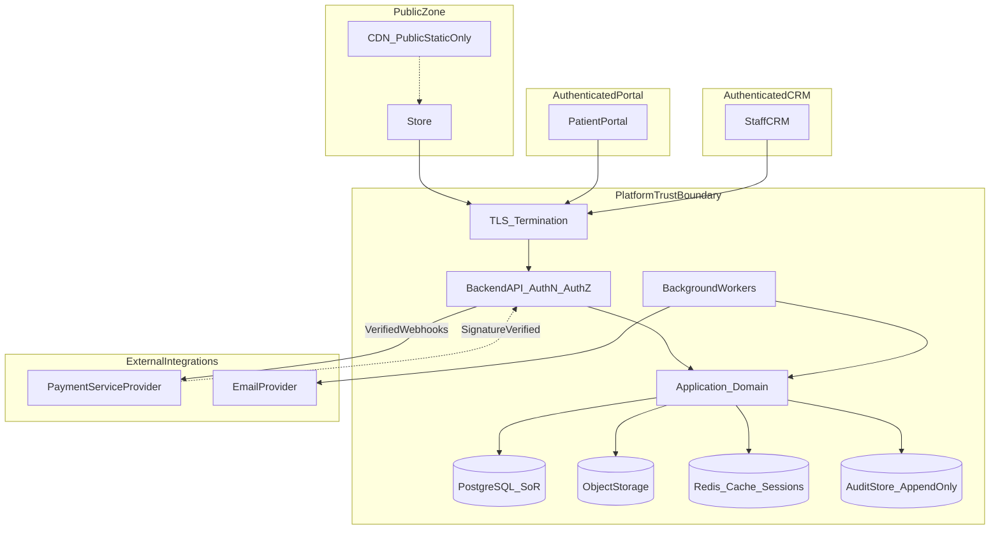
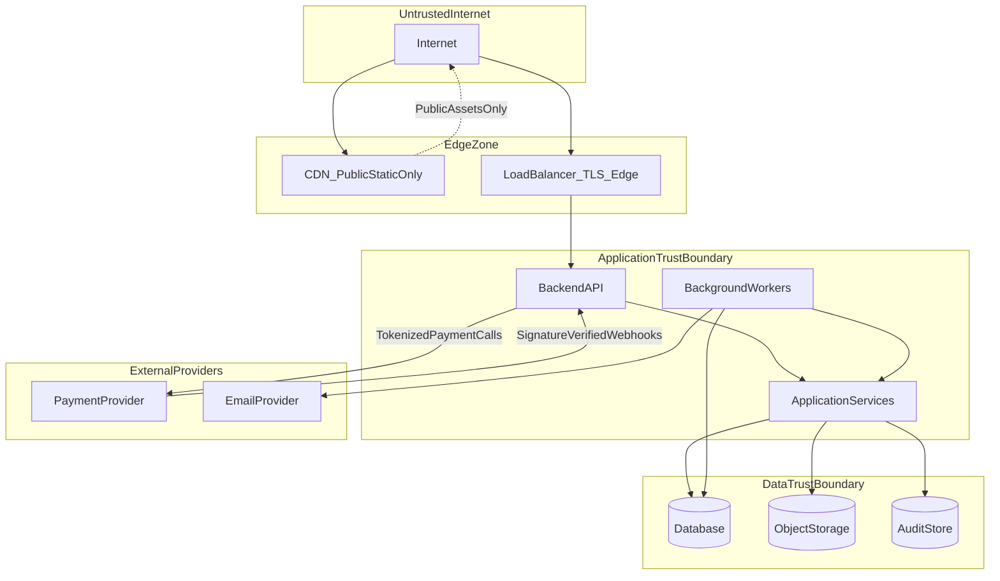
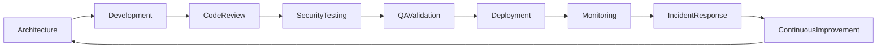

# 13 — Security

| Field | Value |
| --- | --- |
| Document | Security |
| Product | Clinexa |
| Version | 1.0 |
| Status | Approved — Implementation Ready |
| Primary market | United States |
| Audience | Security Architecture, Enterprise Security, Healthcare SaaS Security, Cloud Security, HIPAA Advisors, Backend Engineering, Operations, QA, Product |
| Source of truth | [00 — Product Requirements Document](00-product-requirements-document.md) |
| Related docs | [01 — Project overview](01-project-overview.md), [02 — Business requirements](02-business-requirements.md), [03 — Functional requirements](03-functional-requirements.md), [04 — Non-functional requirements](04-non-functional-requirements.md), [05 — System architecture](05-system-architecture.md), [06 — User personas](06-user-personas.md), [07 — User journeys](07-user-journeys.md), [08 — Role permissions](08-role-permissions.md), [09 — Feature roadmap](09-feature-roadmap.md), [10 — Database design](10-database-design.md), [11 — API design](11-api-design.md), [12 — Authentication flow](12-authentication-flow.md), [14 — Notifications](14-notifications.md), [15 — Payment flow](15-payment-flow.md), [23 — Deployment](23-deployment.md) |

This document is the **authoritative security architecture** for Clinexa Version 1. It defines security principles, domain responsibilities, data protection, application and API controls, infrastructure posture, identity and access security, incident response, and compliance governance—without prescribing frameworks, cloud-provider configuration, firewall rules, Terraform, IAM policy documents, or source code.

It expands [PRD §1.5](00-product-requirements-document.md) (HIPAA-aware posture), [PRD §12.6](00-product-requirements-document.md) (security controls), [PRD §12.8](00-product-requirements-document.md) (logging), [04](04-non-functional-requirements.md) `NFR-040`–`065` / `NFR-074`–`076`, [05](05-system-architecture.md) trust boundaries, [08](08-role-permissions.md) RBAC, [10](10-database-design.md) PHI classes, [11](11-api-design.md) API security zones, and [12](12-authentication-flow.md) AuthN controls.

It does **not** redefine role permission matrices ([08](08-role-permissions.md)), authentication flows ([12](12-authentication-flow.md)), API path catalogs ([11](11-api-design.md)), or database schemas ([10](10-database-design.md)). Those documents remain authoritative for their topics; this document owns cross-cutting security architecture and the `SEC-*` control catalog.

> **Compliance posture:** Controls are **HIPAA-aware** (PHI minimization, access control, auditability, encryption in transit and at rest). This document does **not** claim HIPAA, HITRUST, or SOC 2 Type II certification as V1 delivery gates (PRD §1.5; `NFR-065`).

> **Implementation independence:** `SEC-*` IDs are logical controls. Algorithms, cookie vs bearer transport details, key-management products, and hardening runbooks are specified at the principle level only. No exploit PoCs, firewall ACLs, Terraform, or IAM JSON appear here.

---

## Table of contents

1. [Introduction](#1-introduction)
2. [Security Architecture Principles](#2-security-architecture-principles)
3. [Security Domains](#3-security-domains)
4. [Data Protection](#4-data-protection)
5. [Application Security](#5-application-security)
6. [API Security](#6-api-security)
7. [Infrastructure Security](#7-infrastructure-security)
8. [Identity & Access Security](#8-identity--access-security)
9. [Incident Response](#9-incident-response)
10. [Compliance & Governance](#10-compliance--governance)
11. [Security Traceability Matrix](#11-security-traceability-matrix)
    - [11.1 End-to-end mapping](#111-end-to-end-mapping)
    - [11.2 SEC control index](#112-sec-control-index)
    - [11.3 Ownership split](#113-ownership-split)
    - [11.4 Security Priority Matrix](#114-security-priority-matrix)
    - [11.5 Security Ownership Matrix](#115-security-ownership-matrix)
    - [11.6 Threat Surface Diagram](#116-threat-surface-diagram)
    - [11.7 Security Event Matrix](#117-security-event-matrix)
    - [11.8 Secure Development Lifecycle](#118-secure-development-lifecycle)
12. [Revision History](#12-revision-history)

---

## 1. Introduction

### 1.1 Purpose

Define a production-grade, HIPAA-aware security architecture for Clinexa so that:

- Store, Patient Portal, and CRM clients never become the authority for AuthN, AuthZ, clinical gates, or payment integrity ([05](05-system-architecture.md); `ARCH-005`).
- PHI-adjacent and privileged operations are authenticated, authorized server-side, patient-isolated, and auditable (`FR-AUTH-004`/`005`; `NFR-045`/`046`; `OR-06`; KPI-08).
- Encryption, secrets hygiene, log redaction, and retention boundaries protect PHI/PII and payment tokens without overclaiming certification (`NFR-040`–`065`, `NFR-074`–`076`).
- Identity, RBAC, API, and data designs remain consistent with [12](12-authentication-flow.md), [08](08-role-permissions.md), [11](11-api-design.md), and [10](10-database-design.md).
- Enterprise security program steps (policies, BAAs, pen tests, evidence) remain a **future path** without requiring architecture rewrite (PRD §18.2).

### 1.2 Scope

#### In scope (V1)

| Area | Coverage |
| --- | --- |
| Surfaces | Store, Patient Portal, CRM, Backend API, background workers, PostgreSQL, object storage, Redis, audit sink |
| Integrations | PSP (tokenization + verified webhooks), transactional email |
| Controls | Principles, domains, data protection, app/API/infra security, IAM security, IR, governance |
| Identity | Email/password first-party IdP; sessions/tokens; staff provisioning; worker and webhook trust models |
| Authorization | Server-side RBAC, object-level scope, SoD, Marketing/Content PHI boundary |
| Data | PHI/PII classification, encryption patterns, retention, secure deletion intent, backup protection |
| Traceability | Business → Functional → SEC → AUTH → RBAC → API → DB |

#### Out of scope

| Area | Deferred to / note |
| --- | --- |
| Formal HIPAA / HITRUST / SOC 2 Type II certification | Post-MVP (`NFR-065`; PRD §11) |
| Covered Entity operations / production BAA program | Out of V1 delivery gates (PRD §1.5) |
| Third-party IdP, OAuth, SSO/SAML, social login | Future (`ARCH-077`; [12](12-authentication-flow.md)) |
| MFA / step-up as V1 Must | Readiness only (`AUTH-037`) |
| Multi-region / data residency product controls | Out of V1 |
| Native mobile, telemedicine, insurance claims, wearables | Product out of scope (extra PHI channels) |
| Firewall rules, Terraform, IAM JSON, cloud SKUs | Implementation / [23](23-deployment.md) |
| Role matrices, AuthN flow steps, API path lists, DB DDL | Owned by docs 08, 12, 11, 10 |

### 1.3 Audience

| Audience | Use of this document |
| --- | --- |
| Security / Enterprise architects | System-wide control design and review |
| Healthcare SaaS / HIPAA advisors | HIPAA-aware boundary and non-claim language |
| Cloud / platform engineers | Logical infra and environment separation |
| Backend / API engineers | App, API, and AuthZ control expectations |
| Clinical ops / Admin stakeholders | SoD, audit, break-glass expectations |
| QA | Isolation, AuthZ, redaction, and abuse-test coverage |
| Product | Scope discipline vs certification and future AuthN |

### 1.4 References

| Document | Relevance |
| --- | --- |
| [00 — PRD](00-product-requirements-document.md) | Single source of truth; §1.5, §12.6, §12.8, §13, §15, §18.2 |
| [02 — Business requirements](02-business-requirements.md) | `OR-06`, `OR-07`, `AC-BR-08`/`13`, `KPI-08` |
| [03 — Functional requirements](03-functional-requirements.md) | `FR-AUTH-*`, `FR-DOC-*`, `FR-PAY-001`, `FR-CRM-006`, `FR-ADM-*` |
| [04 — Non-functional requirements](04-non-functional-requirements.md) | `NFR-040`–`065`, `NFR-074`–`076`, `NFR-116`/`117`, secrets/env NFRs |
| [05 — System architecture](05-system-architecture.md) | Trust zones, components, security placement |
| [08 — Role permissions](08-role-permissions.md) | RBAC, SoD, sensitive data classes, break-glass |
| [10 — Database design](10-database-design.md) | PHI classes, audit entity, soft delete, backups |
| [11 — API design](11-api-design.md) | Zones, errors, idempotency, webhooks, caching |
| [12 — Authentication flow](12-authentication-flow.md) | AuthN lifecycle, sessions, MFA readiness |

---

## 2. Security Architecture Principles

| ID | Principle | Statement | Anchors |
| --- | --- | --- | --- |
| **SEC-001** | Defense in Depth | Security is enforced at edge (TLS), API (AuthN/validation/rate limits), application (audit/idempotency), domain (RBAC/gates/SoD), and repository (patient-scoped queries)—no single layer is sufficient. | `ARCH-029`–`032`; PRD §12.6 |
| **SEC-002** | Least Privilege | Users, roles, service identities, and data-store credentials receive only capabilities required for their function; Marketing/Content default-deny clinical charts and full questionnaire answers. | `RBAC-001`; `OR-07`; `NFR-060` |
| **SEC-003** | Zero Trust Mindset | No request is trusted by network location or client assertion alone. Every privileged and PHI-adjacent call is AuthN-validated then AuthZ-checked server-side; token-embedded permission lists are advisory only. | `NFR-041`/`045`; `AUTH-001`–`004`; [12](12-authentication-flow.md) |
| **SEC-004** | Secure by Default | Default deny for clinical/admin paths; unpublished catalog content stays private; CDN never caches private/PHI routes; anonymous clinical staff accounts prohibited in prod-like environments. | `NFR-047`; `ARCH-019`; `RBAC` default deny |
| **SEC-005** | Fail Secure | Payment, clinical, and fulfillment gates fail closed: payment success does not authorize dispensing; clinical approval cannot be bypassed by UI; checkout and Rx paths reject unsafe states. | PRD clinical-commerce gates; `NFR-037`; `OR-03` |
| **SEC-006** | Separation of Duties | Doctor ≠ fulfill; Pharmacist ≠ prescribe; Support ≠ Rx approve; Marketing/Content ≠ clinical notes/full QST; Admin config ≠ default prescribe; dual-role only when explicit and audited. | `RBAC-020`–`030`; `FR-SUP-004` |
| **SEC-007** | Privacy by Design | Collect, display, log, and analyze only journey-necessary PHI/PII; minimize marketing analytics; redact secrets, PAN, and questionnaire bodies from debug logs. | `NFR-058`/`059`/`075`; `FR-ANL-002` |
| **SEC-008** | Auditability | Clinical decisions, admin-sensitive changes, PHI document access, auth security events, and break-glass elevations record actor, action, timestamp, object identifiers, and outcome in an append-only audit sink distinct from debug logs. | `NFR-057`/`062`/`076`; `DB-057` |

---

## 3. Security Domains

### 3.1 Domain responsibility matrix

| ID | Domain | Responsibility (logical) | Primary owners (docs) | Key controls |
| --- | --- | --- | --- | --- |
| **SEC-009** | Application Security | Input/output safety, upload controls, headers, dependency hygiene on interactive surfaces | This doc §5; `NFR-051`–`056` | SEC-036–050 |
| **SEC-010** | API Security | Zone model, AuthN/AuthZ, object scope, rate limits, idempotency, webhooks, error hygiene | [11](11-api-design.md); this doc §6 | SEC-051–065 |
| **SEC-011** | Authentication | Identity types, login/register/reset, sessions, lockout, credential storage principles | [12](12-authentication-flow.md) | `AUTH-*`; SEC-081–088 |
| **SEC-012** | Authorization | Server-side RBAC, SoD, object-level isolation, field redaction | [08](08-role-permissions.md) | `RBAC-*`; SEC-089–095 |
| **SEC-013** | Data Security | Classification, encryption, retention, deletion, backup protection, no raw PAN | [10](10-database-design.md); this doc §4 | SEC-021–035 |
| **SEC-014** | Infrastructure Security | Environment separation, segmentation, hardening, containers, config, time sync | [05](05-system-architecture.md); this doc §7 | SEC-066–080 |
| **SEC-015** | Network Security | TLS for all client–API and internal sensitive connections; logical trust zones; no PHI on public CDN | `NFR-040`; `ARCH-019` | SEC-066–069 |
| **SEC-016** | Operational Security | Logging, monitoring, correlation IDs, alerting, change/access reviews, IR readiness | `NFR-074`–`076`; this doc §9–10 | SEC-096–115 |
| **SEC-017** | Third-party Integrations | PSP tokenization + signature-verified webhooks; email for transactional/reset only; vendor risk awareness | [11](11-api-design.md) `API-068`; PRD payments | SEC-062–064; SEC-112 |
| **SEC-018** | Clinical Data Security | Questionnaire answers, clinical notes, prescriptions, PHI documents: isolation, ACL, audited access, Marketing/Content deny | `FR-QST-*`, `FR-DOC-*`, `FR-CRM-006`; `OR-07` | SEC-021–024; SEC-089–092 |

### 3.2 Trust-boundary diagram

### 3.3 Hard boundary rules

| ID | Rule |
| --- | --- |
| **SEC-019** | All interactive surfaces call the Backend API over HTTPS `/v1` only; clients never enforce AuthZ or clinical/payment gates. |
| **SEC-020** | Patient tokens must not access CRM; Guest/Patient CRM access is denied; CDN must never cache private or PHI routes; Redis session cache is not the revocation source of truth (`DB-006` Sessions is). |

---

## 4. Data Protection

### 4.1 Data classification

| ID | Class | Examples | Controls |
| --- | --- | --- | --- |
| **SEC-021** | High — PHI / PHI-adjacent | Questionnaire answers, clinical notes, prescriptions, PHI document bytes | Patient scope + RBAC; Marketing/Content default deny; audited access (`NFR-058`–`060`; `DB` high class) |
| **SEC-022** | Moderate — operational patient context | Orders, appointments, tickets, document metadata | Ownership + staff RBAC; minimize in reports |
| **SEC-023** | Financial token | Saved payment methods (PSP tokens, last4/brand) | No raw PAN (`NFR-050`; `FR-PAY-001`; `DB-030`) |
| **SEC-024** | PII (account) | Name, email, address fields needed for care-commerce | Collect only what journeys require; redact from debug logs when not needed (`NFR-059`/`075`) |
| **SEC-025** | Public / publish-gated | Published catalog, CMS, blogs, reviews | Publish gates; safe for CDN where designated public |

### 4.2 PHI and PII handling

| ID | Control | Requirement |
| --- | --- | --- |
| **SEC-026** | PHI minimization | Store and display only fields required for care-commerce journeys (`NFR-059`). |
| **SEC-027** | Role boundary | Marketing/Content denied clinical notes and full questionnaire answer sets by default (`OR-07`, `NFR-060`, `FR-CRM-006`). |
| **SEC-028** | Support context | Support PHI limited to ticket context; Support cannot approve prescriptions (`FR-SUP-004`). |
| **SEC-029** | Analytics / reports | Marketing analytics and reports exclude unnecessary PHI columns (`FR-ANL-002`, `FR-RPT-002`). |
| **SEC-030** | Log redaction | Debug logs must not contain secrets, full PAN, or questionnaire answer bodies (`NFR-075`; PRD §12.8). |

### 4.3 Encryption

| ID | Control | Requirement |
| --- | --- | --- |
| **SEC-031** | Encryption in transit | All client–API traffic uses TLS **1.2+**; database and other sensitive service connections are encrypted in deployed environments (`NFR-040`; [10](10-database-design.md) §11.2). |
| **SEC-032** | Encryption at rest | PostgreSQL and object storage encryption at rest enabled in deployed environments that support it (`NFR-048`). |
| **SEC-033** | Credential storage | Passwords and reset tokens stored as irreversible hashes only—never plaintext (`AUTH-042`; `DB-001`/`DB-007`). Exact hashing algorithm is an implementation choice meeting industry practice for adaptive password hashing. |

### 4.4 Secrets management principles

| ID | Control | Requirement |
| --- | --- | --- |
| **SEC-034** | Secrets out of source control | Zero secrets in application or planning git history; configuration via environment or secret store only (`NFR-049`, `NFR-121`–`122`/`126`). |
| **SEC-035** | Least exposure | Distinct credentials per environment; rotate on compromise or personnel change; never embed secrets in client bundles or CDN artifacts. |

### 4.5 Retention, deletion, and backups

| ID | Control | Requirement |
| --- | --- | --- |
| **SEC-036** | Audit retention | Clinical/admin audit events retained **≥ 1 year** intent in staging-like/prod-like environments (`NFR-062`). |
| **SEC-037** | Debug log retention | Application debug logs retained **≤ 90 days** unless longer retention is justified (`NFR-063`). |
| **SEC-038** | Secure deletion | Soft-delete/archive for clinical entities per [10](10-database-design.md); hard-delete/key-disposal path documented as Should (`NFR-064`); audit rows retained when entities are removed. |
| **SEC-039** | Backup protection | Backups encrypted/protected consistent with production data class; RPO **≤ 24 h**, RTO **≤ 4 h** intent; object versioning/replication where applicable ([10](10-database-design.md) §11.9; backup NFRs). |

---

## 5. Application Security

Logical controls aligned to OWASP classes (`NFR-051`). No frameworks or libraries are prescribed.

| ID | Control | Requirement | Anchors |
| --- | --- | --- | --- |
| **SEC-040** | Input validation | Validate type, length, format, and allowlists at the API boundary for all untrusted input; reject malformed payloads with safe errors. | `NFR-051`; [11](11-api-design.md) |
| **SEC-041** | Output encoding | Encode untrusted data for the output context (HTML, attributes, URLs) on Store/Portal/CRM to prevent XSS. | `NFR-051` |
| **SEC-042** | File upload security | Allowlist MIME/extensions; default max size **≤ 10 MB** unless configured; store bytes in object storage with metadata/ACL in DB; Prefer malware scan path when tooling available (Should). | `NFR-054`/`055`; `FR-DOC-*` |
| **SEC-043** | Rate limiting | Bound auth and public write endpoints; login **≤ 10** attempts / IP / 15 min; return HTTP 429 with stable error code. | `NFR-052`; `AUTH-036` |
| **SEC-044** | CSRF | If session credentials are cookie-bound, apply anti-CSRF for state-changing browser requests (`AUTH-039`). Bearer-only API clients rely on CORS and credential isolation patterns. | `AUTH-039` |
| **SEC-045** | XSS prevention | Combine output encoding, CSP baseline, and avoidance of unsafe inline script patterns on Store/Portal. | `NFR-051`/`053` |
| **SEC-046** | Injection prevention | Parameterized data access only; never concatenate untrusted input into queries or shell commands. | `NFR-051` |
| **SEC-047** | SSRF awareness | Do not perform open URL fetches from user-supplied URLs; allowlist outbound destinations for integrations. | `NFR-051` |
| **SEC-048** | Security headers | HSTS, `X-Content-Type-Options: nosniff`, frame protections, and CSP baseline on Store/Portal responses. | `NFR-053` |
| **SEC-049** | Dependency management | Dependency vulnerability scanning in CI as delivery matures; Critical/High vulns gated per policy (Should). | `NFR-056` |
| **SEC-050** | Error hygiene | Client-visible errors use stable envelopes with correlation IDs; no stack traces, secrets, or PHI in messages. | `NFR-116` |

---

## 6. API Security

Authoritative API contracts remain in [11 — API design](11-api-design.md). This section states security expectations those contracts must satisfy.

### 6.1 Authentication and authorization

| ID | Control | Requirement |
| --- | --- | --- |
| **SEC-051** | Transport AuthN | Privileged and PHI-adjacent `/v1` calls require a validated session or token (`NFR-041`; `FR-AUTH-002`). |
| **SEC-052** | Server-side AuthZ | After AuthN, enforce RBAC and object scope server-side; never trust client-supplied permission lists alone (`NFR-045`; [08](08-role-permissions.md)). |
| **SEC-053** | Object-level authorization | Patient resources are own-scope only; CRM resources honor case/ticket/document ACLs; cross-patient access is denied (`FR-AUTH-005`; `NFR-046`; KPI-08). |
| **SEC-054** | Decision status semantics | Preserve **401** (unauthenticated) vs **403** (authenticated, insufficient permission); prefer opaque **404** for cross-patient existence hiding where designed (`NFR-117`; [11](11-api-design.md)). |
| **SEC-055** | Audit of denials | PHI-adjacent authorization failures that indicate probing or misuse are audit-eligible (`NFR-057`). |

### 6.2 Abuse, replay, and integrity

| ID | Control | Requirement |
| --- | --- | --- |
| **SEC-056** | API rate limiting | Auth, reviews, support, and public writes are rate-limited; exceed → `429` / `ERR-RATE-001`. |
| **SEC-057** | Idempotency | Checkout finalize, payment intents, refunds, and webhooks use idempotency keys or provider event IDs so retries do not double-charge, double-refund, or duplicate orders ([11](11-api-design.md); `NFR-028`/`032`/`033`). |
| **SEC-058** | Replay protection | Idempotent handlers return the same durable outcome for replayed requests; webhook duplicates no-op successfully after verification. |
| **SEC-059** | Webhook verification | Payment webhooks authenticate by provider signature—not user JWT or staff session—before side effects (`API-068`; `ERR-PAY-003`; `AUTH-032`). |
| **SEC-060** | API versioning security | Versioned `/v1` surface; deprecated versions must not weaken AuthZ or expose removed PHI fields without migration controls. |

### 6.3 Sensitive responses

| ID | Control | Requirement |
| --- | --- | --- |
| **SEC-061** | Field-level redaction | Responses omit or redact fields the caller’s role must not see (e.g., Marketing/Content vs clinical). |
| **SEC-062** | Document download path | PHI-sensitive downloads go through API with ownership/ACL checks and audit (`FR-DOC-*`; `API-112`). |
| **SEC-063** | Cache policy | Authenticated and PHI responses are not CDN-cached; Redis keys must never cross patient boundaries. |
| **SEC-064** | No PAN in payloads | API never accepts or returns raw card PAN; PSP tokens and display hints only (`NFR-050`). |
| **SEC-065** | Correlation | Requests carry correlation IDs across handlers for investigation without logging PHI bodies (`NFR-074`). |

---

## 7. Infrastructure Security

Logical posture only—no provider-specific networking or IaC.

| ID | Control | Requirement |
| --- | --- | --- |
| **SEC-066** | Environment separation | Distinct Dev → QA → Staging → Production promotion path with separate credentials and data stores (`NFR-124`/`127`; [05](05-system-architecture.md) §11.2). |
| **SEC-067** | Network segmentation | Logical separation among public edge, application, data, worker, and integration egress zones aligned to §3.2; production data stores are not reachable from public clients except via the API. |
| **SEC-068** | Server hardening | Disable unnecessary services; patch managed runtimes; restrict administrative access; prefer immutable or rebuildable compute images. |
| **SEC-069** | Container security principles | Use minimal base images; no secrets in image layers; run as non-root where platform allows; scan images as delivery matures. |
| **SEC-070** | Logging | Structured application logs with correlation IDs; redaction per `SEC-030`; operational logs bounded by `SEC-037`. |
| **SEC-071** | Monitoring | Health and error signals for API, workers, webhook processing, and auth abuse; alert on isolation-critical and payment integrity failures (`ARCH-025`/`026`). |
| **SEC-072** | Secrets storage | Runtime secrets in environment or secret store only; per-environment keys; no production secrets in repos (`SEC-034`/`035`). |
| **SEC-073** | Configuration management | Security-relevant settings (feature flags, gate toggles) change through audited admin/config paths and must not bypass clinical or payment gates (`DB-058`; `FR-SET-003`). |
| **SEC-074** | Time synchronization | Platform clocks synchronized so audit timestamps and token/session expiry are reliable. |
| **SEC-075** | Staging parity | Staging mirrors production topology at reduced scale for security verification (`NFR-129`). |
| **SEC-076** | Data-store roles | Least-privilege database roles (application vs migrations vs analytics) ([10](10-database-design.md) §11.4). |
| **SEC-077** | Object storage ACL | Private buckets/containers for PHI documents; public only for designated Store static assets. |
| **SEC-078** | Worker trust | Background workers use internal job trust—not end-user sessions—and still enforce domain AuthZ for patient-scoped work (`AUTH-033`). |
| **SEC-079** | Single-region V1 | V1 is single-region; multi-region active-active and residency product controls are out of scope. |
| **SEC-080** | Backup restore drills | Restore procedures exist to meet RTO intent; backup media protected equivalent to source class (`SEC-039`). |

---

## 8. Identity & Access Security

Authoritative AuthN behavior: [12 — Authentication flow](12-authentication-flow.md). Authoritative RBAC: [08 — Role permissions](08-role-permissions.md).

### 8.1 RBAC and account classes

| ID | Control | Requirement |
| --- | --- | --- |
| **SEC-081** | Server-side RBAC | Every PHI-adjacent and privileged operation checks role/permission policy on the server (`FR-AUTH-004`; `NFR-045`). |
| **SEC-082** | Patient accounts | Self-registered patients access own Store/Portal data only (`ROLE-002`; `FR-AUTH-005`). |
| **SEC-083** | Staff accounts | Doctor, Pharmacist, Support, Operations, Marketing, Content provisioned by Administrator; CRM requires staff capability (`PERM-CRM-020`; `AUTH-027`). |
| **SEC-084** | Administrative accounts | Administrators manage users/roles/settings/audit; admin is governance—not default prescribe (`ROLE-009`; `RBAC` hierarchy). |
| **SEC-085** | Privileged access | Break-glass elevation is temporary, justified, time-bounded, and fully audited; it does not permanently grant Doctor prescribe (`RBAC-085`/`070`). |
| **SEC-086** | Service identities | System Worker and Payment Webhook identities use zone-appropriate trust—not interactive user sessions (`AUTH-032`/`033`). |
| **SEC-087** | Attributable actors | Shared anonymous clinical staff accounts prohibited in production-like environments (`NFR-047`; `OR-06`). |

### 8.2 Session and credential security

| ID | Control | Requirement |
| --- | --- | --- |
| **SEC-088** | Session security | Idle timeout **≤ 30 min** on staff/PHI surfaces; absolute lifetime **≤ 12 h**; logout revokes current session; password reset invalidates all sessions (`NFR-044`; `FR-AUTH-003`). |
| **SEC-089** | Password policy | Minimum length **≥ 12**; reject known breached passwords when check available; avoid mandatory composition theater (`NFR-042`; `AUTH-034`). |
| **SEC-090** | Lockout | Lock after **≥ 5** consecutive failures within **15 min**; unlock via time or admin (`NFR-043`; `AUTH-035`; `FR-AUTH-006`). |
| **SEC-091** | Credential storage | Hash-only storage per `SEC-033`; never log passwords or reset tokens in plaintext. |
| **SEC-092** | Permission re-resolution | Session/token claims may carry advisory permissions; authoritative AuthZ is re-resolved server-side on each privileged request ([12](12-authentication-flow.md)). |

### 8.3 Future MFA readiness

| ID | Control | Requirement |
| --- | --- | --- |
| **SEC-093** | MFA readiness | V1 does **not** require MFA. Architecture must not preclude future MFA or step-up authentication for clinical actions (`AUTH-037`). |
| **SEC-094** | No V1 SSO | Third-party IdP / OAuth / SSO / SAML / social login remain future (`ARCH-077`). |
| **SEC-095** | Clinical SoD enforcement | Identity strength does not replace SoD: Support never approves Rx; Pharmacist never replaces Doctor approval (`FR-SUP-004`; `RBAC-020`–`030`). |

---

## 9. Incident Response

V1 defines a **logical** incident-response lifecycle suitable for portfolio/demo and early production readiness. A full enterprise SOC, formal HIPAA breach program, and certification evidence packs are **not** V1 delivery gates; they align to the enterprise path in PRD §18.2.

| ID | Phase | Requirement |
| --- | --- | --- |
| **SEC-096** | Security event detection | Detect auth abuse (lockouts/rate limits), authorization/isolation anomalies, webhook verification failures, elevated error rates, dependency Critical/High alerts, and backup/restore failures (`SEC-071`; `AC-BR-14`). |
| **SEC-097** | Incident classification | Classify by severity: cross-patient exposure (highest), credential compromise, payment integrity failure, PHI in logs/analytics, availability impacting care-commerce, and misconfiguration. KPI-08 target: **zero** cross-patient exposure in testing/demo. |
| **SEC-098** | Containment | Revoke affected sessions (`tokenVersion`/admin revoke); disable compromised accounts; rotate exposed secrets; block abusive sources via rate limits; take unsafe config offline through audited change. |
| **SEC-099** | Investigation | Use correlation IDs and append-only audit records; preserve evidence; avoid copying PHI into scratch channels; distinguish clinical audit from debug logs. |
| **SEC-100** | Recovery | Restore from protected backups if needed within RTO intent; re-validate isolation and AuthZ suites before declaring recovery; re-enable traffic only after gates pass. |
| **SEC-101** | Post-incident review | Document root cause, timeline, customer/demo impact, and corrective actions (control, test, or process). Feed findings into roadmap hygiene and dependency scanning. |
| **SEC-102** | Audit preservation | Do not purge audit trails during IR; retain per `SEC-036`; export/preserve relevant audit slices for review. |
| **SEC-103** | Communication discipline | Internal and external communications must not imply HIPAA/HITRUST/SOC 2 certification (`NFR-065`). |
| **SEC-104** | Payment incidents | Coordinate with PSP for tokenization/webhook disputes; never store captured PAN during investigation. |
| **SEC-105** | Isolation regression | After any AuthZ or data-scoping incident, re-run patient-isolation automated suites before release resume. |

---

## 10. Compliance & Governance

### 10.1 HIPAA-aware architecture (not certification)

| ID | Control | Requirement |
| --- | --- | --- |
| **SEC-106** | HIPAA-aware patterns | Architecture implements minimization, access control, auditability, and encryption in transit/at rest (`NFR-058`; PRD §1.5). |
| **SEC-107** | Explicit non-claims | Formal HIPAA certification, HITRUST, SOC 2 Type II, Covered Entity status, and production BAA operations are **not** V1 delivery gates (`NFR-065`; PRD §11). |
| **SEC-108** | Demo / portfolio language | Demos and marketing must describe controls as HIPAA-aware patterns—not certified compliance (PRD §15 risk mitigation). |

### 10.2 Governance controls

| ID | Control | Requirement |
| --- | --- | --- |
| **SEC-109** | Audit logging | Clinical and admin-sensitive events record actor, action, timestamp, object identifiers, outcome (`NFR-057`; `DB-057`). |
| **SEC-110** | Audit vs debug | Prefer distinct audit sink or event type from application debug logs (`NFR-076`). |
| **SEC-111** | Data retention governance | Enforce audit ≥1 year intent and debug ≤90 days (`SEC-036`/`037`); align entity lifecycle with [10](10-database-design.md). |
| **SEC-112** | Access reviews | Periodically review staff roles, admin accounts, and break-glass usage for least privilege (enterprise continuous reviews per PRD KPI path). |
| **SEC-113** | Change management | User/role changes, settings, and config publish are validated and audited (`OR-14`; `FR-ADM-001`/`004`; `FR-SET-003`). |
| **SEC-114** | Vendor risk | PSP must tokenize cards (no raw PAN); email limited to transactional/reset; evaluate vendors for data handling before enabling new PHI egress. |
| **SEC-115** | Security documentation | Keep this document, AuthN, RBAC, API, and DB security sections aligned when PRD changes; no secrets in the planning repository (PRD §17.5). |

### 10.3 Compliance boundary summary

| Topic | V1 posture |
| --- | --- |
| HIPAA-aware design patterns | **Required** |
| HIPAA / HITRUST / SOC 2 Type II certification | **Out** as delivery gate |
| Covered Entity / production BAA | **Out** as delivery gate |
| Pen testing | Ad hoc → scheduled post-MVP (NFR compliance boundary) |
| MFA / SSO | Future / readiness only |
| Consent/notice capture | Should where product flows require (`NFR-061`) |

---

## 11. Security Traceability Matrix

### 11.1 End-to-end mapping

| Business | Functional | Security control | Authentication | RBAC | API | Database |
| --- | --- | --- | --- | --- | --- | --- |
| `OR-06` patient isolation; attributable staff | `FR-AUTH-004`/`005`; `FR-DOC-001`–`004` | SEC-003, SEC-019, SEC-053, SEC-081, SEC-087 | `AUTH-001`–`004`, `AUTH-031` | `RBAC-001`, patient scope | Privileged `/v1`; opaque cross-patient deny | Patient-scoped repos; `DB-047` ACL |
| `OR-07` Marketing/Content PHI boundary | `FR-CRM-006`; `FR-ANL-002`; `FR-QST-005` | SEC-002, SEC-027, SEC-061 | Session + role | `RBAC-020`–`030`; Mk/Ct deny | Field redaction; CRM search filters | High-class PHI entities |
| `AC-BR-08` auth + isolation; password reset | `FR-AUTH-001`–`003`/`006` | SEC-088–090, SEC-043 | `AUTH-017`/`026`–`029`/`034`–`036` | Role assignment on register/provision | `API-003`–`008` | `DB-001`/`006`/`007`/`008` |
| `AC-BR-13` Marketing PHI acceptance | `FR-CRM-006`; `FR-RPT-002` | SEC-027, SEC-029 | Staff session | Mk/Ct permissions | Analytics/report endpoints | `DB-060` PHI-minimized |
| `KPI-08` zero cross-patient exposure | `FR-AUTH-005`; isolation ACs | SEC-053, SEC-097, SEC-105 | Protected API chain | Object-level AuthZ | 401/403/404 semantics | Scoped queries |
| Payment integrity / no PAN | `FR-PAY-001` | SEC-023, SEC-064, SEC-057–059 | `AUTH-032` webhook | Payment ≠ dispense SoD | `API-061`/`062`/`067`/`068` | `DB-030`/`031` |
| Clinical auditability | `FR-CRM-002`; `FR-ADM-004` | SEC-008, SEC-109–111 | AuthN actor identity | Role snapshot in audit | Clinical/admin APIs | `DB-057` append-only |
| Document PHI access | `FR-DOC-001`–`004` | SEC-021, SEC-042, SEC-062 | Authenticated user | Document ACL perms | `API-112` download | `DB-047` + object storage |
| Support least privilege | `FR-SUP-004` | SEC-028, SEC-095 | Staff AuthN | Support perms; no Rx approve | Ticket APIs | Ticket-scoped PHI |
| Secrets / env hygiene | NFR-049 / env NFRs | SEC-034, SEC-035, SEC-072 | — | Admin config only | — | No secrets in DB dumps/repos |
| Encryption posture | NFR-040 / NFR-048 | SEC-031, SEC-032 | TLS to API | — | HTTPS only | Encrypted PG + objects |
| Abuse protection | `FR-AUTH-006` | SEC-043, SEC-056, SEC-090 | `AUTH-035`/`036` | — | Rate-limit errors | `DB-008` lockout |

### 11.2 SEC control index

| ID | Title | Domain | Priority |
| --- | --- | --- | --- |
| SEC-001 | Defense in Depth | Principles | Must |
| SEC-002 | Least Privilege | Principles | Must |
| SEC-003 | Zero Trust Mindset | Principles | Must |
| SEC-004 | Secure by Default | Principles | Must |
| SEC-005 | Fail Secure | Principles | Must |
| SEC-006 | Separation of Duties | Principles | Must |
| SEC-007 | Privacy by Design | Principles | Must |
| SEC-008 | Auditability | Principles | Must |
| SEC-009 | Application Security domain | Domains | Must |
| SEC-010 | API Security domain | Domains | Must |
| SEC-011 | Authentication domain | Domains | Must |
| SEC-012 | Authorization domain | Domains | Must |
| SEC-013 | Data Security domain | Domains | Must |
| SEC-014 | Infrastructure Security domain | Domains | Must |
| SEC-015 | Network Security domain | Domains | Must |
| SEC-016 | Operational Security domain | Domains | Must |
| SEC-017 | Third-party Integrations domain | Domains | Must |
| SEC-018 | Clinical Data Security domain | Domains | Must |
| SEC-019 | API-only interactive boundary | Domains | Must |
| SEC-020 | CRM/CDN/Redis hard rules | Domains | Must |
| SEC-021 | High PHI classification | Data | Must |
| SEC-022 | Moderate operational classification | Data | Must |
| SEC-023 | Financial token classification | Data | Must |
| SEC-024 | PII account classification | Data | Must |
| SEC-025 | Public / publish-gated classification | Data | Must |
| SEC-026 | PHI minimization | Data | Must |
| SEC-027 | Marketing/Content role boundary | Data | Must |
| SEC-028 | Support ticket-context PHI | Data | Must |
| SEC-029 | Analytics/report PHI minimization | Data | Must |
| SEC-030 | Log redaction | Data | Must |
| SEC-031 | Encryption in transit | Data | Must |
| SEC-032 | Encryption at rest | Data | Must |
| SEC-033 | Credential hash storage | Data | Must |
| SEC-034 | Secrets out of source control | Data | Must |
| SEC-035 | Secrets least exposure | Data | Must |
| SEC-036 | Audit retention ≥ 1 year | Data | Must |
| SEC-037 | Debug log retention ≤ 90 days | Data | Should |
| SEC-038 | Secure deletion path | Data | Should |
| SEC-039 | Backup protection | Data | Must |
| SEC-040 | Input validation | Application | Must |
| SEC-041 | Output encoding | Application | Must |
| SEC-042 | File upload security | Application | Must (malware scan Should) |
| SEC-043 | Rate limiting | Application | Must |
| SEC-044 | CSRF (cookie sessions) | Application | Must when cookies used |
| SEC-045 | XSS prevention | Application | Must |
| SEC-046 | Injection prevention | Application | Must |
| SEC-047 | SSRF awareness | Application | Must |
| SEC-048 | Security headers | Application | Must |
| SEC-049 | Dependency management | Application | Should |
| SEC-050 | Error hygiene | Application | Must |
| SEC-051 | Transport AuthN | API | Must |
| SEC-052 | Server-side AuthZ | API | Must |
| SEC-053 | Object-level authorization | API | Must |
| SEC-054 | 401/403/404 semantics | API | Must |
| SEC-055 | Audit of PHI AuthZ denials | API | Must |
| SEC-056 | API rate limiting | API | Must |
| SEC-057 | Idempotency | API | Must |
| SEC-058 | Replay protection | API | Must |
| SEC-059 | Webhook verification | API | Must |
| SEC-060 | API versioning security | API | Must |
| SEC-061 | Field-level redaction | API | Must |
| SEC-062 | Document download audit path | API | Must |
| SEC-063 | Cache policy for PHI | API | Must |
| SEC-064 | No PAN in API payloads | API | Must |
| SEC-065 | Correlation IDs | API | Must |
| SEC-066 | Environment separation | Infrastructure | Must |
| SEC-067 | Network segmentation (logical) | Infrastructure | Must |
| SEC-068 | Server hardening | Infrastructure | Must |
| SEC-069 | Container security principles | Infrastructure | Must |
| SEC-070 | Structured logging | Infrastructure | Must |
| SEC-071 | Monitoring and alerting | Infrastructure | Must |
| SEC-072 | Secrets storage | Infrastructure | Must |
| SEC-073 | Configuration management | Infrastructure | Must |
| SEC-074 | Time synchronization | Infrastructure | Must |
| SEC-075 | Staging parity | Infrastructure | Must |
| SEC-076 | Data-store least privilege | Infrastructure | Must |
| SEC-077 | Object storage ACL | Infrastructure | Must |
| SEC-078 | Worker trust model | Infrastructure | Must |
| SEC-079 | Single-region V1 boundary | Infrastructure | Must |
| SEC-080 | Backup restore drills | Infrastructure | Must |
| SEC-081 | Server-side RBAC | Identity | Must |
| SEC-082 | Patient account scope | Identity | Must |
| SEC-083 | Staff account provisioning | Identity | Must |
| SEC-084 | Administrative accounts | Identity | Must |
| SEC-085 | Privileged / break-glass access | Identity | Must |
| SEC-086 | Service identities | Identity | Must |
| SEC-087 | Attributable actors | Identity | Must |
| SEC-088 | Session security | Identity | Must |
| SEC-089 | Password policy reference | Identity | Must |
| SEC-090 | Account lockout | Identity | Must |
| SEC-091 | Credential storage hygiene | Identity | Must |
| SEC-092 | Permission re-resolution | Identity | Must |
| SEC-093 | MFA readiness (not V1 Must) | Identity | Could / Future |
| SEC-094 | No V1 SSO | Identity | Won’t (V1) |
| SEC-095 | Clinical SoD with identity | Identity | Must |
| SEC-096 | Security event detection | Incident Response | Must |
| SEC-097 | Incident classification | Incident Response | Must |
| SEC-098 | Containment | Incident Response | Must |
| SEC-099 | Investigation | Incident Response | Must |
| SEC-100 | Recovery | Incident Response | Must |
| SEC-101 | Post-incident review | Incident Response | Must |
| SEC-102 | Audit preservation | Incident Response | Must |
| SEC-103 | Communication discipline | Incident Response | Must |
| SEC-104 | Payment incident handling | Incident Response | Must |
| SEC-105 | Isolation regression after IR | Incident Response | Must |
| SEC-106 | HIPAA-aware patterns | Compliance | Must |
| SEC-107 | Explicit certification non-claims | Compliance | Must |
| SEC-108 | Demo / portfolio language | Compliance | Must |
| SEC-109 | Audit logging | Compliance | Must |
| SEC-110 | Audit vs debug separation | Compliance | Should |
| SEC-111 | Retention governance | Compliance | Must |
| SEC-112 | Access reviews | Compliance | Should |
| SEC-113 | Change management | Compliance | Must |
| SEC-114 | Vendor risk | Compliance | Must |
| SEC-115 | Security documentation hygiene | Compliance | Must |

### 11.3 Ownership split

| Topic | Authoritative document |
| --- | --- |
| Product scope and compliance boundary | [00 — PRD](00-product-requirements-document.md) |
| Role matrices and SoD detail | [08 — Role permissions](08-role-permissions.md) |
| AuthN flows and session policy | [12 — Authentication flow](12-authentication-flow.md) |
| API paths, errors, idempotency contracts | [11 — API design](11-api-design.md) |
| Entities, PHI classes, soft delete | [10 — Database design](10-database-design.md) |
| Cross-cutting SEC controls and IR/governance | **This document** |

### 11.4 Security Priority Matrix

Implementation planning matrix for engineering prioritization. Uses existing `SEC-*` IDs only; does not invent new controls. Phases align with care-commerce delivery sequencing without changing architectural integrity.

| Priority | Security Controls | Purpose | Recommended Implementation Phase |
| --- | --- | --- | --- |
| **Critical** | SEC-001–SEC-008, SEC-019, SEC-020, SEC-021, SEC-023, SEC-026, SEC-027, SEC-031–SEC-035, SEC-046, SEC-051–SEC-054, SEC-057–SEC-059, SEC-064, SEC-066, SEC-072, SEC-081–SEC-083, SEC-087–SEC-092, SEC-095 | Establish trust boundaries, AuthN/AuthZ, patient isolation, PHI/PAN protection, encryption, secrets hygiene, and SoD so no release can expose cross-patient or clinical data | Foundation / MS-01 Auth & RBAC (before PHI-bearing journeys) |
| **High** | SEC-009–SEC-018, SEC-022, SEC-024, SEC-025, SEC-028–SEC-030, SEC-036, SEC-039–SEC-045, SEC-047, SEC-048, SEC-050, SEC-055, SEC-056, SEC-060–SEC-063, SEC-065, SEC-067–SEC-071, SEC-073–SEC-078, SEC-080, SEC-084–SEC-086, SEC-096–SEC-105, SEC-106–SEC-109, SEC-111, SEC-113–SEC-115 | Complete domain coverage, abuse protection, auditability, webhook/payment integrity, logging/monitoring, IR readiness, and HIPAA-aware governance for Store/Portal/CRM go-live | Core V1 delivery (clinical, payment, documents, Portal/CRM) |
| **Medium** | SEC-037, SEC-038, SEC-042 (malware scan path), SEC-049, SEC-079, SEC-110, SEC-112 | Maturity items: bounded debug retention, secure deletion runbooks, upload malware scanning when tooling available, dependency scanning gates, access reviews, audit/debug separation | Early post-MVP hardening / delivery maturity |
| **Future** | SEC-093, SEC-094 | MFA/step-up readiness (architecture must not preclude) and third-party IdP/SSO remain out of V1 Must scope | Post-V1 identity roadmap (`AUTH-037`, `ARCH-077`) |

### 11.5 Security Ownership Matrix

Enterprise governance matrix using organizational roles (not individuals).

| Security Area | Primary Owner | Supporting Teams |
| --- | --- | --- |
| Application Security | Backend Engineering | Frontend Engineering, QA, Security Architecture |
| API Security | Backend Engineering / API Owners | Security Architecture, QA |
| Authentication | Identity & Access (Security Architecture + Backend) | Product, QA, Operations |
| Authorization | Security Architecture (RBAC policy) | Backend Engineering, Clinical Ops, Administrator role owners |
| Infrastructure | Platform / Cloud Engineering | Backend Engineering, Operations |
| Secrets Management | Platform / Cloud Engineering | Backend Engineering, Security Architecture |
| Monitoring | Operations / Site Reliability | Platform Engineering, Backend Engineering |
| Logging | Backend Engineering (application) + Operations (retention) | Security Architecture, QA |
| Incident Response | Operations (coordination) | Security Architecture, Backend Engineering, Product, Clinical Ops |
| Compliance | Product + Security Architecture | Legal/Compliance advisors (advisory), Engineering leads |
| Vendor Security | Product (vendor selection) + Security Architecture | Platform Engineering, Finance/Ops (PSP), Backend Engineering |

### 11.6 Threat Surface Diagram

Logical attack surface and trust boundaries. No provider-specific or implementation detail.

Trust-boundary notes:

- **EdgeZone** terminates TLS and admits only HTTPS `/v1` interactive traffic plus designated public static assets on CDN (never private/PHI).
- **ApplicationTrustBoundary** is the sole AuthN/AuthZ enforcement locus for interactive callers; workers use internal job trust, not end-user sessions.
- **DataTrustBoundary** holds SoR, PHI document bytes, and append-only audit; not directly reachable from the Internet.
- **ExternalProviders** sit outside the platform boundary; inbound webhooks require signature verification before side effects.

### 11.7 Security Event Matrix

Centralized matrix of security-relevant events. **Alert Generated** means an operational signal suitable for on-call or security triage. Events marked audit-only still require durable records but do not, by default, page operators on every occurrence.

| Security Event | Logged | Audited | Alert Generated | Related SEC Controls |
| --- | --- | --- | --- | --- |
| Successful Login | Yes | Yes (auth security event) | No (baseline) | SEC-051, SEC-088, SEC-109 |
| Failed Login | Yes | Yes | No unless burst/threshold | SEC-043, SEC-056, SEC-090, SEC-096 |
| Account Lockout | Yes | Yes | Yes | SEC-090, SEC-096, SEC-097 |
| Permission Denied (PHI-adjacent) | Yes | Yes | Yes when anomalous/probing pattern | SEC-052–SEC-055, SEC-081, SEC-096 |
| PHI Access (authorized clinical/admin read) | Optional debug (redacted) | Yes | No (audit record) | SEC-021, SEC-026, SEC-061, SEC-109 |
| Document Download (PHI-sensitive) | Yes (metadata) | Yes | No unless ACL anomaly | SEC-062, SEC-042, SEC-109 |
| Webhook Failure (signature or processing) | Yes | Yes when payment integrity at risk | Yes | SEC-059, SEC-057, SEC-058, SEC-104 |
| Rate Limit Trigger | Yes | Optional | Yes on sustained abuse | SEC-043, SEC-056, SEC-096 |
| Secret Rotation | Yes (ops) | Yes when admin-initiated | Yes on failure/compromise path | SEC-034, SEC-035, SEC-072, SEC-098 |
| Configuration Change (roles/settings/gates) | Yes | Yes | Yes for gate/role privilege changes | SEC-073, SEC-085, SEC-113, SEC-109 |
| Backup Failure | Yes | Yes | Yes | SEC-039, SEC-080, SEC-096, SEC-100 |
| Worker Failure (security- or payment-critical jobs) | Yes | Yes when domain outcome affected | Yes | SEC-071, SEC-078, SEC-096 |

**Alert vs audit guidance:** Operational alerts focus on abuse, integrity failure, privilege change, and recovery risk (lockout bursts, PHI AuthZ anomalies, webhook/payment failures, backup/worker failures, secret compromise, privileged config change). Routine successful login and authorized PHI access remain **audit-first** for accountability and investigation (`SEC-008`, `SEC-109`, `SEC-110`) without alerting on every event.

### 11.8 Secure Development Lifecycle

Logical Secure Development Lifecycle for Clinexa. Stages are architectural checkpoints—not CI/CD tooling or implementation process prescriptions.

| Stage | Contribution of planning documents |
| --- | --- |
| **Architecture** | [00 — PRD](00-product-requirements-document.md) sets HIPAA-aware scope; [05](05-system-architecture.md) trust zones; this document (`SEC-*`) and [04](04-non-functional-requirements.md) `NFR-040`–`065` define required controls. |
| **Development** | Engineers implement against [11](11-api-design.md), [12](12-authentication-flow.md), [08](08-role-permissions.md), and [10](10-database-design.md) contracts; SEC Critical/High controls from §11.4 guide sequencing. |
| **Code Review** | Reviews verify server-side AuthZ, patient scope, no secrets in source, no PAN, redaction, and SoD—using SEC principles (§2) and ownership (§11.5) without substituting for automated gates. |
| **Security Testing** | Isolation suites (KPI-08), AuthZ matrix tests, abuse/lockout/rate-limit tests, webhook signature negative tests, and upload allowlist tests map to SEC-043, SEC-053, SEC-059, SEC-090, and related controls. |
| **QA Validation** | Journey and AC coverage from [03](03-functional-requirements.md) / [07](07-user-journeys.md) confirm Marketing/Content PHI boundary, Support no-Rx, document ACL, and session expiry behavior. |
| **Deployment** | Environment separation, secrets store, encryption at rest/transit, and staging parity (`SEC-066`, `SEC-072`, `SEC-031`/`032`, `SEC-075`) precede production promotion; deployment detail remains owned by future [23](23-deployment.md). |
| **Monitoring** | Correlation IDs, structured logs, and alerts (`SEC-065`, `SEC-070`, `SEC-071`) observe the event matrix in §11.7. |
| **Incident Response** | §9 lifecycle (`SEC-096`–`SEC-105`) uses audit preservation and isolation regression before resume. |
| **Continuous Improvement** | Post-incident actions, dependency scanning maturity (`SEC-049`), access reviews (`SEC-112`), and MFA/SSO readiness (`SEC-093`/`094`) feed back into architecture and the priority matrix without inventing V1 features. |

---

## 12. Revision History

| Version | Date | Author | Reviewer | Changes | Approval Status |
| --- | --- | --- | --- | --- | --- |
| 1.0 | 2026-07-23 | Principal / Enterprise Security Architect (planning) | Pending | Initial security architecture: principles, domains, data protection, app/API/infra/IAM controls, incident response, compliance governance, traceability (`SEC-001`–`115`) | Draft for review |
| 1.0 | 2026-07-23 | Principal / Enterprise Security Architect (planning) | Pending | Architectural appendices: §11.4 Security Priority Matrix, §11.5 Security Ownership Matrix, §11.6 Threat Surface Diagram, §11.7 Security Event Matrix, §11.8 Secure Development Lifecycle; status set to Approved — Implementation Ready | Approved — Implementation Ready |

---

## Related reading

- [00 — Product requirements document](00-product-requirements-document.md)
- [04 — Non-functional requirements](04-non-functional-requirements.md)
- [05 — System architecture](05-system-architecture.md)
- [08 — Role permissions](08-role-permissions.md)
- [10 — Database design](10-database-design.md)
- [11 — API design](11-api-design.md)
- [12 — Authentication flow](12-authentication-flow.md)

---

## Document control

| Item | Value |
| --- | --- |
| Classification | Internal planning |
| Owner | Security Architecture (planning) |
| Change rule | Do not invent security product features beyond the PRD; keep aligned with docs 03, 04, 05, 08, 10, 11, 12 |
| Implementation gate | Do not implement provider-specific hardening, IAM policies, or exploit tests from this document until it is approved |
| Next review | After stakeholder review of SEC catalog, IR scope, and compliance non-claim language |

*End of 13 — Security.*
