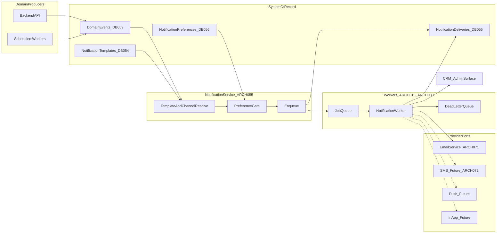
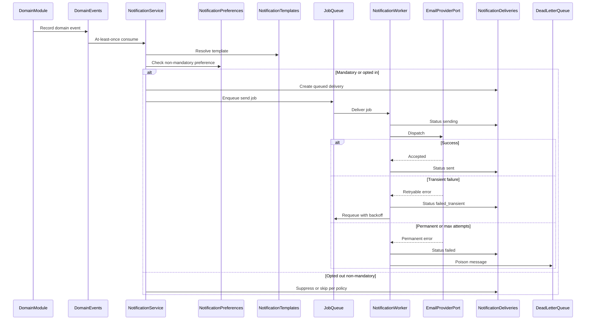
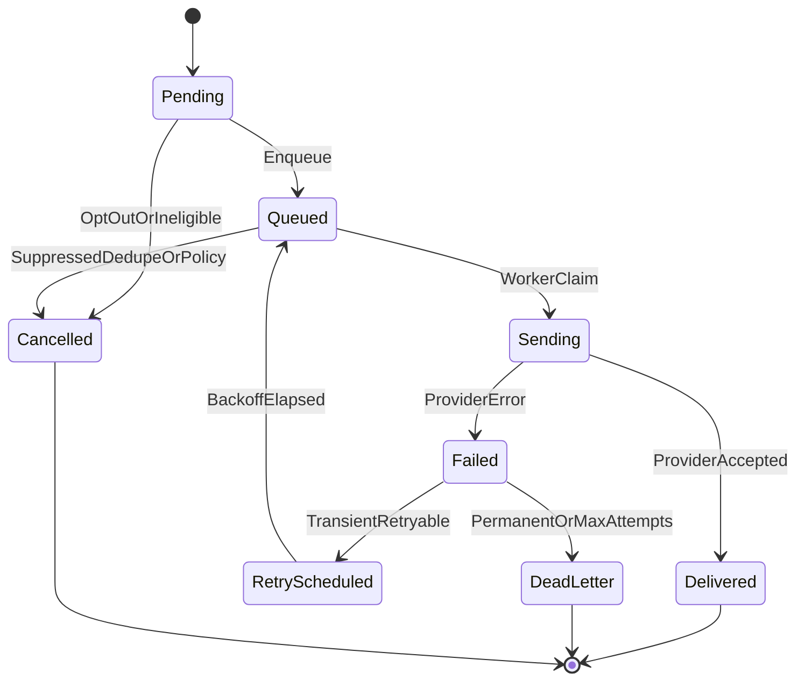
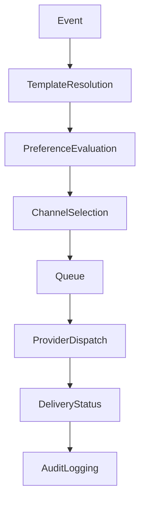

# 14 — Notifications

| Field | Value |
| --- | --- |
| Document | Notifications |
| Product | Clinexa |
| Version | 1.0 |
| Status | Approved — Implementation Ready |
| Primary market | United States |
| Audience | Solution Architecture, Enterprise Messaging Architecture, Healthcare SaaS Architecture, Backend Engineering, Product, Operations, Clinical Ops, Support, Security, QA |
| Source of truth | [00 — Product Requirements Document](00-product-requirements-document.md) |
| Related docs | [01 — Project overview](01-project-overview.md), [02 — Business requirements](02-business-requirements.md), [03 — Functional requirements](03-functional-requirements.md), [04 — Non-functional requirements](04-non-functional-requirements.md), [05 — System architecture](05-system-architecture.md), [06 — User personas](06-user-personas.md), [07 — User journeys](07-user-journeys.md), [08 — Role permissions](08-role-permissions.md), [09 — Feature roadmap](09-feature-roadmap.md), [10 — Database design](10-database-design.md), [11 — API design](11-api-design.md), [12 — Authentication flow](12-authentication-flow.md), [13 — Security](13-security.md), [15 — Payment flow](15-payment-flow.md) |

This document is the **authoritative notifications architecture** for Clinexa Version 1. It defines the event-driven notification model, channels, event catalog, template governance, delivery lifecycle, preference rules, reliability expectations, and privacy constraints—without prescribing email providers, SMTP settings, SDKs, queue products, or source code.

It expands [PRD §8.13](00-product-requirements-document.md) (Notifications), [03](03-functional-requirements.md) `FR-NTF-001`–`004` / `FR-SET-001`, [04](04-non-functional-requirements.md) delivery and queue NFRs, [05](05-system-architecture.md) `ARCH-022` / `ARCH-055` / `ARCH-071` / `ARCH-072` / `ARCH-080`, [07](07-user-journeys.md) §7 notification map, [10](10-database-design.md) `DB-054`–`056` / `DB-059`, and [11](11-api-design.md) `API-133`–`136`.

It does **not** redefine functional module behavior ([03](03-functional-requirements.md)), journey steps ([07](07-user-journeys.md)), API path catalogs ([11](11-api-design.md)), database schemas ([10](10-database-design.md)), authentication flows ([12](12-authentication-flow.md)), or security control catalogs ([13](13-security.md)). Those documents remain authoritative for their topics; this document owns notification architecture and the `NTF-*` control and event catalog.

> **Compliance posture:** Notification content and delivery logs are **HIPAA-aware** (PHI minimization, access control, auditability). This document does **not** claim HIPAA, HITRUST, or SOC 2 Type II certification as V1 delivery gates (PRD §1.5; `NFR-065`).

> **Implementation independence:** `NTF-*` IDs are logical controls and catalog entries. Provider selection, SMTP, SDK usage, and broker products are out of scope. No provider configuration or code examples appear here.

---

## Table of contents

1. [Introduction](#1-introduction)
2. [Notification Architecture](#2-notification-architecture)
3. [Notification Channels](#3-notification-channels)
4. [Notification Events](#4-notification-events)
5. [Notification Templates](#5-notification-templates)
6. [Delivery Lifecycle](#6-delivery-lifecycle)
7. [User Notification Preferences](#7-user-notification-preferences)
8. [Reliability & Delivery](#8-reliability--delivery)
9. [Security & Privacy](#9-security--privacy)
10. [Notification Traceability Matrix](#10-notification-traceability-matrix)
    - [10.5 Notification Ownership Matrix](#105-notification-ownership-matrix)
    - [10.6 Notification Delivery State Machine](#106-notification-delivery-state-machine)
    - [10.7 Channel Capability Matrix](#107-channel-capability-matrix)
    - [10.8 Template Ownership Matrix](#108-template-ownership-matrix)
    - [10.9 Notification Lifecycle Summary](#109-notification-lifecycle-summary)
11. [Revision History](#11-revision-history)

---

## 1. Introduction

### 1.1 Purpose

Define a production-grade, event-driven notifications architecture for Clinexa so that:

- Patients and relevant staff receive timely, templated communications for core account, order, prescription status, subscription, appointment, and support events ([PRD §8.13](00-product-requirements-document.md); `FR-NTF-001`).
- Notifications are triggered from Backend API domain events—not from client-side “send email” calls (`FR-NTF-002`; `ARCH-055`).
- Delivery is reliable under transient provider failure (`FR-NTF-003`; `NFR-031`; `NFR-038`; `NFR-039`) without blocking core domain commits.
- Patients can manage non-mandatory preferences in Portal (`FR-NTF-004`) while mandatory transactional and security notices remain enforceable.
- Channel expansion (SMS, push, in-app center) is architecturally prepared without inventing V1 product scope (`ARCH-072`; FRS NTF Future Enhancements).
- PHI/PII handling stays consistent with [13 — Security](13-security.md) and [12 — Authentication flow](12-authentication-flow.md).

### 1.2 Scope

#### In scope (V1)

| Area | Coverage |
| --- | --- |
| Primary channel | Transactional email via abstracted email provider (`ARCH-071`) |
| Administrative / system notices | Staff and operations alerts (email and/or CRM surface as documented) |
| Trigger model | Domain-event driven enqueue from Backend API / workers |
| Templates | Identifiers, versioning, admin-configurable hooks (`FR-SET-001`; `DB-054`) |
| Preferences | Patient non-mandatory preference management (`FR-NTF-004`; `DB-056`) |
| Reliability | Retry/backoff, dedupe, DLQ, delivery status (`DB-055`; `ARCH-080`) |
| Privacy | PHI minimization in bodies and logs; preference and access boundaries |
| Traceability | Business → Functional → Events → Templates → Channels → Database |

#### Out of scope

| Area | Deferred to / note |
| --- | --- |
| SMS channel | Future (`ARCH-072`) |
| Push notifications | Future (FRS NTF Future Enhancements) |
| In-app notification center | Future (FRS NTF Future Enhancements; roadmap deferred) |
| Promotional / marketing campaign email | Not a V1 notification product feature |
| Real-time clinician chat | Out of product scope (PRD §11); tickets + notifications suffice |
| Omnichannel phone/SMS support integrations | Out of V1 |
| Scheduled emailed reports | Out of V1 (`FR` Reports future notes) |
| Provider SMTP / SDK / vendor configuration | Implementation |
| Template marketing copy and creative content | Owned at implementation/content ops; not defined here |
| Journey step detail | [07](07-user-journeys.md) |
| API path contracts | [11](11-api-design.md) |
| Physical DB DDL | [10](10-database-design.md) / implementation |

### 1.3 Audience

| Audience | Use of this document |
| --- | --- |
| Solution / messaging architects | End-to-end notification design and review |
| Healthcare SaaS architects | PHI-minimized messaging and channel posture |
| Backend engineers | Event → enqueue → dispatch expectations |
| Product | Scope discipline vs future channels and preference polish |
| Operations / Support | Delivery failure visibility, DLQ, low-stock and ops alerts |
| Clinical ops | Staff appointment and clinical-outcome patient notices |
| Security / Compliance | Content limits, audit boundaries, preference vs mandatory |
| QA | Event coverage, dedupe, retry, preference, and PHI-in-log tests |

### 1.4 References

| Document | Relevance |
| --- | --- |
| [00 — PRD](00-product-requirements-document.md) | Single source of truth; §8.13 Notifications; V1 email assumption |
| [02 — Business requirements](02-business-requirements.md) | `BO-3`, `BP-*` journey notifications, `OR-10`/`OR-12`, `KPI-04`/`KPI-05` |
| [03 — Functional requirements](03-functional-requirements.md) | `FR-NTF-001`–`004`, related AUTH/PAY/SUB/ORD/APT/SUP/INV/SET FRs |
| [04 — Non-functional requirements](04-non-functional-requirements.md) | `NFR-013`, `NFR-021`, `NFR-027`, `NFR-031`, `NFR-038`, `NFR-039`, `NFR-059`–`061`, `NFR-075`, `NFR-080`, `NFR-136` |
| [05 — System architecture](05-system-architecture.md) | `ARCH-015`, `ARCH-022`, `ARCH-055`, `ARCH-071`, `ARCH-072`, `ARCH-080` |
| [07 — User journeys](07-user-journeys.md) | §7 Notifications Throughout Journeys (authoritative trigger map) |
| [08 — Role permissions](08-role-permissions.md) | `PERM-NTF-001`–`003` |
| [09 — Feature roadmap](09-feature-roadmap.md) | `ROAD-017`; preference polish later; SMS/push/in-app deferred |
| [10 — Database design](10-database-design.md) | `DB-054`–`056`, `DB-057`–`059`, delivery statuses |
| [11 — API design](11-api-design.md) | `API-133`–`136`; worker-only dispatch |
| [12 — Authentication flow](12-authentication-flow.md) | Password-reset and account security notices |
| [13 — Security](13-security.md) | PHI/PII, minimization, audit, email egress evaluation |

---

## 2. Notification Architecture

### 2.1 Event-driven model

| ID | Principle | Statement | Anchors |
| --- | --- | --- | --- |
| **NTF-001** | Domain-event authority | Notifications are produced from Backend API domain events (and scheduled workers that emit equivalent events), never from Store/Portal/CRM clients inventing sends. | `FR-NTF-002`; `ARCH-055`; PRD §8.13 |
| **NTF-002** | Durable event source | Eligible domain events are recorded in the durable outbox/event log and consumed at-least-once by notification workers. | `DB-059`; `ARCH-080`; `NFR-038` |
| **NTF-003** | Non-blocking domain commits | Notification enqueue or provider latency must not block order create, clinical decision persistence, or other core transactions; delivery degrades gracefully. | FRS NTF postconditions; [07](07-user-journeys.md) §7 |
| **NTF-004** | Template binding | Each sendable event type resolves to a configured template identifier before channel dispatch. | `FR-NTF-002`; `DB-054`; `FR-SET-001` |
| **NTF-005** | Email-primary V1 | Transactional email is the V1 primary patient/staff notification channel; additional channels are ports on the same model. | `FR-NTF-001`; `ARCH-071`; PRD assumption |
| **NTF-006** | Preference gate | Non-mandatory sends consult recipient preferences before dispatch; mandatory transactional/security notices bypass opt-out. | `FR-NTF-004`; FRS NTF alternative flows |
| **NTF-007** | Dedupe by event key | Duplicate notification jobs for the same domain event key must not produce duplicate patient emails under replay. | `NFR-039`; `DB-055` |
| **NTF-008** | Retry then DLQ | Transient provider failures retry with exponential backoff and jitter; permanent/exhausted failures enter dead-letter handling with ops visibility. | `FR-NTF-003`; `NFR-031`; `NFR-038` |

### 2.2 Notification service responsibilities

The Notification Service (`ARCH-022` capability within `ARCH-055`) owns:

| Responsibility | Description |
| --- | --- |
| Event subscription | Consume domain events relevant to the NTF catalog |
| Eligibility | Validate recipient, event type, template binding, and preference/mandatory rules |
| Template resolution | Select active template version for event + channel |
| Channel selection | V1: email (and administrative CRM surface where documented); future: SMS/push/in-app ports |
| Enqueue | Persist delivery intent and hand off to background workers |
| Provider dispatch | Call the abstracted email provider; rate-aware sending |
| Status tracking | Update delivery attempt outcomes on `DB-055` |
| Dedupe / idempotency | Suppress duplicate sends for the same domain event key |
| Failure orchestration | Retry, DLQ, and ops-visible failure states |

Interactive API routes do **not** expose a patient “send email” endpoint; dispatch is worker-only (`API-133`–`136` notes; `FR-NTF-001`–`003`).

### 2.3 Provider abstraction

| ID | Control | Statement | Anchors |
| --- | --- | --- | --- |
| **NTF-009** | Email provider port | Outbound transactional email goes through a logical Email Service port with sandbox/test mode for demos; vendor choice is implementation. | `ARCH-071`; `NFR-136` |
| **NTF-010** | Future SMS port | SMS, when introduced, reuses the same template, dedupe, preference, and retry model as email. | `ARCH-072` |
| **NTF-011** | Provider disablement | If email provider is disabled, core journeys degrade with visible Operations warning; security-critical emails may fail closed per settings policy. | `FR-SET` edge cases |
| **NTF-012** | No provider lock-in in design | Architecture must not require a specific ESP, SMTP relay, or SDK in planning artifacts. | Implementation independence |

### 2.4 Channel abstraction

| ID | Control | Statement |
| --- | --- | --- |
| **NTF-013** | Channel as dispatch target | A notification request resolves to one or more logical channels (email, future SMS/push/in-app, administrative CRM surface). |
| **NTF-014** | Shared catalog | Event catalog entries declare target channel(s); adding a channel does not invent new domain events. |
| **NTF-015** | Future-ready without V1 delivery | In-app center, SMS, and push are designed as ports only; V1 does not deliver an in-app notification inbox. |

Portal and CRM **status views** remain product UI and are not a substitute for inventing a V1 in-app notification center.

### 2.5 Retry orchestration

| Stage | Behavior |
| --- | --- |
| Transient failure | Exponential backoff with jitter; capped attempts (`FR-NTF-003`; `NFR-031`) |
| Permanent failure | Mark failed; route to DLQ / ops visibility (`NFR-038`) |
| Duplicate job | Mark `deduplicated`; do not re-send (`NFR-039`) |
| Start lag | Eligible notification jobs start within ≤ 60 seconds under nominal load (`NFR-013`) |
| Isolation | Notification workers are isolatable from interactive API latency (`NFR-021`; `ARCH-015`) |

### 2.6 Architecture diagram

**Notes:** Solid edges are V1 paths. Dashed edges are future channel ports on the same enqueue/dedupe/retry model. CRM administrative surface covers ops alerts (e.g., low stock) alongside or instead of email where journeys specify Email/CRM.

---

## 3. Notification Channels

### 3.1 Channel summary

| ID | Channel | Posture | Primary audience | Anchors |
| --- | --- | --- | --- | --- |
| **NTF-016** | Transactional Email | V1 primary | Patients; relevant staff | `FR-NTF-001`; `ARCH-071` |
| **NTF-017** | In-App Notifications | Future-ready | Patients; staff (when introduced) | FRS NTF Future Enhancements |
| **NTF-018** | Administrative Notifications | V1 | Operations, clinical staff, Admin as configured | `FR-INV-004`; appointment staff notices; `PERM-NTF-001` |
| **NTF-019** | System Notifications | V1 | Operations / platform operators | `NFR-027`; `NFR-080`; email-provider disable warning |
| **NTF-020** | SMS | Future-ready | Patients; staff (when introduced) | `ARCH-072` |
| **NTF-021** | Push Notifications | Future-ready | Mobile clients (post native mobile) | FRS NTF Future Enhancements; `ARCH-027` |

### 3.2 Transactional Email

| Dimension | Detail |
| --- | --- |
| Purpose | Deliver templated, event-driven messages for core account, order, Rx status, subscription, appointment, payment/refund, and support journeys. |
| Audience | Patients (primary); relevant staff for appointment and selected ops emails. |
| Trigger types | Domain events listed in §4 (Must and optional-as-configured). |
| Delivery expectations | Asynchronous via workers; ≤ 60 s nominal start lag; retry on transient failure; dedupe by domain event key; PHI-minimized bodies; recorded on `DB-055`. |
| Preference | Mandatory security/receipt notices always eligible; non-mandatory categories honor Portal prefs (`FR-NTF-004`). |

### 3.3 In-App Notifications

| Dimension | Detail |
| --- | --- |
| Purpose | Future in-product notification center for unread/read domain notices. |
| Audience | Authenticated patients and staff when the feature is approved. |
| Trigger types | Same event catalog as email; channel selection becomes multi-target. |
| Delivery expectations | **Not delivered in V1.** Architecture reserves the channel port and preference keys. Portal/CRM status pages remain the V1 in-product awareness mechanism—not an inbox. |
| Note | `PERM-NTF-001` “in-product as configured” does not authorize inventing a V1 notification center. |

### 3.4 Administrative Notifications

| Dimension | Detail |
| --- | --- |
| Purpose | Inform staff and operations of actionable operational or scheduling events (e.g., appointment confirmed for relevant staff; low-stock alerts). |
| Audience | Doctor/Pharmacist/Support/Operations/Admin/Marketing/Content as role-appropriate (`PERM-NTF-001`). |
| Trigger types | Appointment staff notices; low-stock / insufficient-stock ops alerts; optional publish/config notices. |
| Delivery expectations | Email and/or CRM surface per event; retry/CRM visibility for low stock; must not expose Marketing/Content to clinical free text by default (`NFR-060`; `FR-CRM-006`). |

### 3.5 System Notifications

| Dimension | Detail |
| --- | --- |
| Purpose | Platform and reliability communications: planned maintenance advance notice, email-provider disablement warnings, monitoring alerts for elevated 5xx / webhook-processing failure spikes. |
| Audience | Operations and administrators; maintenance notices to affected users when practical. |
| Trigger types | Planned maintenance (`NFR-027`); provider disablement; monitoring thresholds (`NFR-080`). |
| Delivery expectations | Ops-visible warnings are mandatory for platform safety; user-facing maintenance notice when practical (≥ 24 h advance when practical). Distinct from patient transactional journey emails. |

### 3.6 SMS (future-ready)

| Dimension | Detail |
| --- | --- |
| Purpose | Optional SMS delivery for selected high-urgency transactional events after product approval. |
| Audience | Patients (and staff if configured) with verified mobile endpoints. |
| Trigger types | Subset of §4 catalog; not a new event ontology. |
| Delivery expectations | Same template/dedupe/retry model as email (`ARCH-072`). **Not V1.** |

### 3.7 Push Notifications (future-ready)

| Dimension | Detail |
| --- | --- |
| Purpose | Device push for native/mobile clients after mobile delivery exists. |
| Audience | Patients (and staff apps if introduced). |
| Trigger types | Subset of §4 catalog. |
| Delivery expectations | Channel port only in this architecture. **Not V1**; depends on future mobile (`ARCH-027`). |

---

## 4. Notification Events

### 4.1 Catalog rules

| ID | Rule | Statement |
| --- | --- | --- |
| **NTF-022** | Journey map authority | The V1 event catalog is derived from [07 §7](07-user-journeys.md) and `FR-NTF-001` categories; it does not invent unaffiliated marketing events. |
| **NTF-023** | Mandatory vs optional | Rows marked **Must** are V1 obligations where the domain event occurs; **Should/Optional** are allowed when configured and must not be treated as GA blockers unless separately mandated (e.g., KPI-05 renewal failure). |
| **NTF-024** | Preference class | **Mandatory** notices ignore opt-out; **Preference-eligible** honor `DB-056` / `API-134` constraints. |
| **NTF-025** | Out-of-catalog examples | Example names without an approved trigger (e.g., standalone Role Assigned email) are **not** V1 Must obligations (§4.11). |

**Legend — Priority:** Must / Should / Optional (configured). **Channels:** Email = transactional email; Admin = administrative email/CRM; System = platform/ops.

### 4.2 Account and security

| ID | Event | Related FR | Trigger source | Channel(s) | Preference | Priority |
| --- | --- | --- | --- | --- | --- | --- |
| **NTF-026** | Account Registration Welcome / Confirmation | `FR-NTF-001`, `FR-AUTH-001` | User registered (JRN-002); if configured | Email | Preference-eligible | Optional |
| **NTF-027** | Password Reset | `FR-AUTH-003`, `FR-NTF-001` | Password reset requested (JRN-002/003; BP-08) | Email | Mandatory | Must |
| **NTF-028** | Security-Sensitive Login Notice | `FR-NTF-001`, AUTH security posture | Login / security signal if configured (JRN-003) | Email | Mandatory when enabled | Optional |

### 4.3 Clinical intake

| ID | Event | Related FR | Trigger source | Channel(s) | Preference | Priority |
| --- | --- | --- | --- | --- | --- | --- |
| **NTF-029** | Questionnaire Reminder | `FR-NTF-001`, `FR-QST-*` | Incomplete / expired intake path (JRN-008, JRN-014) | Email | Preference-eligible | Should |
| **NTF-030** | Additional Information Requested | `FR-CRM-002`, `FR-NTF-001` | Doctor requests more information (JRN-014) | Email | Preference-eligible | Must |

### 4.4 Orders and prescription status

| ID | Event | Related FR | Trigger source | Channel(s) | Preference | Priority |
| --- | --- | --- | --- | --- | --- | --- |
| **NTF-031** | Order Created / Confirmation (Clinically Pending) | `FR-ORD-*`, `FR-NTF-001`, `FR-CHK-005` | Order enters awaiting clinical review / confirmation (JRN-005, JRN-010); AC-NTF-001 | Email | Preference-eligible (receipt may remain required) | Must |
| **NTF-032** | Prescription / Clinical Approved | `FR-CRM-002`, `FR-NTF-001` | Doctor approved consultation / Rx status update (JRN-012) | Email | Preference-eligible | Must |
| **NTF-033** | Prescription / Clinical Rejected | `FR-CRM-002`, `FR-NTF-001` | Doctor declined (JRN-013) | Email | Preference-eligible | Must |
| **NTF-034** | Prescription Ready / Awaiting Fulfillment | `FR-NTF-001`, `FR-ORD-*`, `FR-CRM-004` | Optional status when ready for fulfillment / Rx ready (JRN-016 path) | Email | Preference-eligible | Optional |
| **NTF-035** | Order Shipped / Fulfilled | `FR-ORD-*`, `FR-NTF-001` | Shipment / fulfillment complete (JRN-016, JRN-017); US-NTF-001 | Email | Preference-eligible | Must |

### 4.5 Payments and refunds

| ID | Event | Related FR | Trigger source | Channel(s) | Preference | Priority |
| --- | --- | --- | --- | --- | --- | --- |
| **NTF-036** | Payment Success (Authorized/Captured Outcome) | `FR-PAY-005` | Payment success outcome (JRN-009); maps architecture Payment Authorized / captured success to patient-visible payment outcome | Email | Mandatory (receipt) | Must |
| **NTF-037** | Payment Failure | `FR-PAY-005` | Payment decline/error (JRN-009) | Email | Mandatory (receipt) | Must |
| **NTF-038** | Refund Processed | `FR-PAY-005`, `FR-NTF-001` | Refund succeeded (JRN-026, JRN-013) | Email | Mandatory (receipt) | Must |
| **NTF-039** | Refund Failed / Delayed | `FR-PAY-003`, `FR-NTF-001` | Refund exception path (JRN-026) | Email | Mandatory (receipt) | Must |

> Payment Authorized vs Captured are domain/payment-lifecycle concepts ([05](05-system-architecture.md); future [15](15-payment-flow.md)). Patient notifications follow **payment outcome** language per `FR-PAY-005` and journeys—not separate authorize/capture marketing emails.

### 4.6 Subscriptions

| ID | Event | Related FR | Trigger source | Channel(s) | Preference | Priority |
| --- | --- | --- | --- | --- | --- | --- |
| **NTF-040** | Subscription Started | `FR-SUB-*`, `FR-NTF-001` | Subscription activated with order confirmation (JRN-019) | Email | Preference-eligible | Must |
| **NTF-041** | Subscription Renewal Success | `FR-SUB-002`, `FR-NTF-001` | Renewal charge succeeded (JRN-020) | Email | Preference-eligible (receipt may remain required) | Must |
| **NTF-042** | Subscription Renewal Failure / Past-Due | `FR-SUB-003`, `FR-NTF-001` | Renewal fails → grace/past-due (JRN-020); KPI-05; AC-NTF-002 | Email | Mandatory | Must |
| **NTF-043** | Subscription Cancelled | `FR-SUB-004`, `FR-NTF-001` | Patient/staff cancellation completes (JRN-021) | Email | Preference-eligible | Must |
| **NTF-044** | Reassessment Required | `FR-SUB-005`, `FR-NTF-001` | Renewal path requires clinical reassessment (JRN-020) | Email | Preference-eligible | Must |

### 4.7 Appointments

| ID | Event | Related FR | Trigger source | Channel(s) | Preference | Priority |
| --- | --- | --- | --- | --- | --- | --- |
| **NTF-045** | Appointment Scheduled / Confirmed (Patient) | `FR-APT-001`–`003`, `FR-NTF-001` | Booking confirmed (JRN-022) | Email | Preference-eligible | Must |
| **NTF-046** | Appointment Confirmed (Staff) | `FR-APT-*`, `FR-NTF-001` | Same confirmation; relevant staff recipients | Email / Admin | N/A (staff) | Must |
| **NTF-047** | Appointment Reminder | `FR-NTF-001`, `FR-APT-*` | Reminder schedule if configured (JRN-022) | Email | Preference-eligible | Should |
| **NTF-048** | Appointment Cancelled / Reschedule Path | `FR-APT-*`, `FR-NTF-001` | Cancellation or slot deleted after booking (JRN-023) | Email (+ staff notice) | Preference-eligible | Must |

### 4.8 Documents

| ID | Event | Related FR | Trigger source | Channel(s) | Preference | Priority |
| --- | --- | --- | --- | --- | --- | --- |
| **NTF-049** | Document Available | `FR-DOC-*`, `FR-NTF-001` | Document ready for patient (JRN-024) | Email | Preference-eligible | Optional |

### 4.9 Support

| ID | Event | Related FR | Trigger source | Channel(s) | Preference | Priority |
| --- | --- | --- | --- | --- | --- | --- |
| **NTF-050** | Support Ticket Created | `FR-SUP-001`, `FR-NTF-001` | Ticket created (JRN-025) | Email | Preference-eligible | Must |
| **NTF-051** | Support Ticket Updated / Response | `FR-SUP-002`–`005`, `FR-NTF-001` | Staff response or key status update / resolution (JRN-025) | Email | Preference-eligible | Must |

### 4.10 Operations, content, and platform

| ID | Event | Related FR | Trigger source | Channel(s) | Preference | Priority |
| --- | --- | --- | --- | --- | --- | --- |
| **NTF-052** | Low Stock Alert | `FR-INV-004`, `FR-NTF-001` | Stock below threshold / insufficient at fulfill (JRN-016) | Admin (Email/CRM) | N/A | Must |
| **NTF-053** | Review Moderation Outcome | `FR-REV-*`, `FR-NTF-001` | Moderated review decision (JRN-028) | Email | Preference-eligible | Optional |
| **NTF-054** | Publish / Config Notice | `FR-NTF-001`, CMS/Blog/Settings | Optional admin/ops/content publish notices (JRN-031–033) | Admin | N/A | Optional |
| **NTF-055** | System Maintenance Notice | `NFR-027` | Planned maintenance window | System (+ Email when practical) | N/A / policy | Should |
| **NTF-056** | Email Provider Disabled Warning | `FR-SET-001` edge | Platform setting disables email provider | System / Admin | N/A | Must |
| **NTF-057** | Elevated Error / Webhook Failure Alert | `NFR-080` | Monitoring threshold breach | System | N/A | Must |

### 4.11 Explicitly not V1 Must notification obligations

| Example name | Disposition | Rationale |
| --- | --- | --- |
| Role Assigned | **Not a V1 Must notification event** | Role/assignment changes are audited (`DB-057`; Admin FRs); no approved journey requires a Role Assigned email. |
| Standalone Payment Authorized / Payment Captured marketing emails | Covered by **NTF-036** / **NTF-037** outcomes | Do not invent separate authorize vs capture patient emails beyond payment outcome notices. |
| Promotional / marketing campaign blasts | Out of scope | No V1 promotional email product feature. |
| Clinician chat messages | Out of scope | PRD excludes real-time clinician chat. |

---

## 5. Notification Templates

### 5.1 Template model

| ID | Control | Statement | Anchors |
| --- | --- | --- | --- |
| **NTF-058** | Template identifiers | Each sendable event type binds to a stable template identifier (logical key) used by workers for resolution. | `DB-054`; `FR-NTF-002` |
| **NTF-059** | Versioning | Templates support version/archive lifecycle; active version is used at send time; historical versions retained for auditability of changes. | `DB-054` retention |
| **NTF-060** | Localization readiness | Template model must allow locale-qualified variants without redesigning the event catalog; V1 may ship a single default locale. | Future-ready; no invented multi-language Must |
| **NTF-061** | Dynamic placeholders | Templates accept bounded placeholders (e.g., recipient name, order reference, appointment time, Portal deep link). Placeholder sets must not require embedding questionnaire answer bodies or clinical free text. | PHI minimization |
| **NTF-062** | Branding consistency | Templates share platform branding tokens (product name, support contact patterns) configurable via settings/hooks—not hard-coded per vendor. | `FR-SET-001` |
| **NTF-063** | Preview capability | Administrators can preview template rendering with sample (non-PHI) placeholder data before activation. | Admin template management |
| **NTF-064** | Approval workflow | Template create/update is restricted to Administrator (`PERM-NTF-003`; `API-135`/`136`), audited (`FR-ADM-004`), and governed by platform settings hooks (`FR-SET-001`). This is admin-controlled change control—not a separate multi-stage editorial product. |
| **NTF-065** | Binding integrity | Sends require an existing template for the event type; missing bindings fail closed for that notification without corrupting domain state. | FRS NTF validations |

### 5.2 Template governance rules

| Rule | Detail |
| --- | --- |
| No content in this document | Subject lines, body copy, and creative are **not** defined here (planning constraint). |
| Event binding | Template keys map 1:1 (or versioned many:1) to §4 event IDs / domain event names. |
| Channel variants | Future SMS/push/in-app may share event keys with channel-specific template variants. |
| Settings hooks | Admin-configurable notification template/trigger hooks without code deploy for ordinary messaging evolution (`FR-SET-001`; US-SET-002). |
| Audit | Template upserts are auditable administrative actions (`API-136`; `DB-057`). |

---

## 6. Delivery Lifecycle

### 6.1 Pipeline

| Step | Description | Artifacts |
| --- | --- | --- |
| 1. Event | Domain event occurs and is durably recorded. | `DB-059` |
| 2. Notification Request | NTF service accepts an eligible event and creates a delivery intent. | Logical request; `DB-055` row |
| 3. Template Resolution | Active template version selected for event + channel. | `DB-054` |
| 4. Channel Selection | V1 email (and Admin/System surfaces as catalogued). | `NTF-013`–`021` |
| 5. Provider Dispatch | Worker invokes email provider port (or CRM/ops surface). | `ARCH-071` |
| 6. Delivery Status | Outcome recorded: `queued`, `sending`, `sent`, `failed`, or `deduplicated`. | `DB-055` |
| 7. Retry | Transient failures re-enter queue with backoff/jitter. | `FR-NTF-003`; `NFR-031` |
| 8. Failure Handling | Exhausted/permanent failures → DLQ + ops visibility; domain state unchanged. | `NFR-038` |
| 9. Audit | Clinical/admin/security acts remain on `DB-057`; delivery evidence stays operational on `DB-055` (not a substitute for clinical audit). | `DB-055`/`057` |

| ID | Control | Statement |
| --- | --- | --- |
| **NTF-066** | Status vocabulary | Canonical delivery statuses are `queued`, `sending`, `sent`, `failed`, `deduplicated` ([10](10-database-design.md) §16.10). |
| **NTF-067** | Polymorphic subject | Deliveries may reference Order, Subscription, Appointment, Ticket, Prescription, or User subjects. |
| **NTF-068** | Correlation | Delivery records should retain linkage to domain event key for dedupe and ops triage. |

### 6.2 Sequence diagram

### 6.3 Lifecycle notes

- Password-reset emails: if undelivered, token remains unusable to the user until re-request ([07](07-user-journeys.md) §7).
- Renewal failure (**NTF-042**): **Must attempt** delivery per KPI-05; ops visibility on persistent failure.
- Core order/clinical transactions commit even when email fails (graceful degradation).

---

## 7. User Notification Preferences

### 7.1 Preference controls

| ID | Control | Statement | Anchors |
| --- | --- | --- | --- |
| **NTF-069** | Portal management | Patients manage non-mandatory notification preferences in Patient Portal. | `FR-NTF-004`; `API-133`/`134`; `PERM-NTF-002` |
| **NTF-070** | Opt-out honored | Preference opt-out is honored for non-mandatory categories. | FRS NTF alternative flows |
| **NTF-071** | Mandatory notices | Security emails, payment/refund receipts, and other policy-required transactional notices may remain required and cannot be disabled via preferences. | `API-134`; FRS NTF |
| **NTF-072** | Default settings | Email channel is enabled by default in V1 platform settings. | `FR-SET` V1 defaults |
| **NTF-073** | Preference storage | Preferences persist per user as 1:1 or 1:N by channel/event family. | `DB-056` |
| **NTF-074** | Preference inheritance | Unset preference keys inherit platform defaults (email on for V1 families); explicit user values override defaults for that key only. | `DB-056` model |
| **NTF-075** | Staff prefs | Staff recipients of administrative appointment/ops emails are role-routed; V1 does not require a staff preference center. | `PERM-NTF-001` |

### 7.2 Preference classes

| Class | Examples | Opt-out allowed? |
| --- | --- | --- |
| Mandatory transactional / security | Password reset (**NTF-027**); payment/refund receipts (**NTF-036**–**039**); renewal failure (**NTF-042**); security notices when enabled (**NTF-028**) | No |
| Clinical journey (preference-eligible) | Questionnaire reminder, additional info, clinical approve/decline, Rx-ready optional, appointments (non-staff), document available | Yes (non-mandatory) |
| Administrative | Low stock, staff appointment, publish notices | N/A (staff/ops routing) |
| System | Maintenance, provider disable, monitoring alerts | N/A |
| Marketing promotional | Campaign blasts | **Not a V1 feature** — do not invent promotional opt-in as a Must |

### 7.3 Marketing vs clinical vs privacy

| Topic | Rule |
| --- | --- |
| Marketing preferences | No V1 promotional email campaign product. Preference APIs cover non-mandatory **transactional** families only (`API-133`/`134`). |
| Marketing analytics boundary | Marketing/Content roles are denied clinical notes and full questionnaire answers by default (`NFR-060`; `FR-CRM-006`)—independent of patient email prefs. |
| Clinical notifications | Clinical-outcome emails minimize PHI in body content; detailed clinical content remains in Portal/CRM under AuthZ. |
| Consent / notice | Capture consent/notice flags where product flows require them (`NFR-061`); do not conflate with inventing a marketing subscription center. |
| Privacy references | [13 — Security](13-security.md); `NFR-059`–`061`; §9 of this document. |

### 7.4 Roadmap note

Rich preference centers by event category and `FR-NTF-004` polish are sequenced after core email GA ([09](09-feature-roadmap.md) v1.1 / MS-09). Architecture and `DB-056` already anticipate per-family keys.

---

## 8. Reliability & Delivery

| ID | Control | Statement | Anchors |
| --- | --- | --- | --- |
| **NTF-076** | Retry policy | Transient email/provider failures use exponential backoff with jitter and capped attempts. | `FR-NTF-003`; `NFR-031` |
| **NTF-077** | Dead-letter handling | After max attempts, jobs enter DLQ with Operations visibility; do not silently drop renewal-failure attempts without ops signal. | `NFR-038`; KPI-05 |
| **NTF-078** | Duplicate prevention | Deduplicate notification sends for the same domain event key; mark `deduplicated` when suppressed. | `NFR-039`; `DB-055` |
| **NTF-079** | Idempotency | Worker processing is idempotent with respect to domain event key: replay does not spam recipients. | `NFR-039`; `ARCH-007` spirit |
| **NTF-080** | Provider failure | Provider throttle or outage → retry/backoff and graceful degradation; domain commits remain valid. | FRS NTF alternatives |
| **NTF-081** | Queue behavior | At-least-once queue with visibility timeout; notification workers isolated from interactive API; eligible jobs start ≤ 60 s nominally. | `ARCH-080`; `NFR-013`; `NFR-021` |
| **NTF-082** | Delivery status tracking | Persist attempt outcomes on `NotificationDeliveries` for ops triage; statuses per **NTF-066**. | `DB-055` |
| **NTF-083** | Bounce / complaint | Basic bounce/complaint handling is expected at edge-case level; detailed ESP feedback loops are implementation. | FRS NTF edge cases |
| **NTF-084** | Rate awareness | Email sending is rate-aware to respect provider and free-tier caps without inventing new V1 channels via settings. | `ARCH-071`; `FR-SET` notes |
| **NTF-085** | Critical path: renewal failure | Subscription renewal failure notification **Must attempt** (KPI-05 / AC-NTF-002 / AC-BR-11). | `FR-SUB-003` |

Implementation remains broker- and provider-agnostic: Redis-compatible queue is the architectural intent (`ARCH-080`), not a mandatory vendor SKU in this document.

---

## 9. Security & Privacy

| ID | Control | Statement | Anchors |
| --- | --- | --- | --- |
| **NTF-086** | PHI considerations | Email bodies minimize PHI; prefer status references and Portal deep links over clinical free text or questionnaire answers. | FRS NTF business rules; `SEC-026` spirit |
| **NTF-087** | PII protection | Recipient email addresses and names are PII; protect in transit via provider TLS expectations and restrict delivery-log access. | [13](13-security.md); [10](10-database-design.md) classification |
| **NTF-088** | Email content limitations | Do not include raw PAN, secrets, full questionnaire answer bodies, or unnecessary clinical note text in notification content or debug logs. | `NFR-075`; `FR-PAY-001`; SEC logging |
| **NTF-089** | Sensitive notification handling | Password-reset messages carry time-limited tokens; treat as security-sensitive; fail closed when email provider is disabled if policy requires. | [12](12-authentication-flow.md); `FR-AUTH-003`; `FR-SET` |
| **NTF-090** | Audit logging | Template and settings changes, clinical decisions, and PHI document access remain on `DB-057`. Delivery rows are operational evidence—not a substitute for clinical-action audit. | `DB-055`/`057` |
| **NTF-091** | Notification access control | Receive: `PERM-NTF-001`. Manage own prefs: `PERM-NTF-002` (Patient). Manage templates: `PERM-NTF-003` (Admin). | [08](08-role-permissions.md) |
| **NTF-092** | Data minimization | Collect and render only data necessary for the notification purpose; marketing-safe analytics exclude clinical free text (`NFR-059`). | [13](13-security.md) |
| **NTF-093** | Provider egress evaluation | Email (and future SMS) providers require data-handling evaluation before new PHI egress paths. | `SEC-017` / `SEC-114` spirit |
| **NTF-094** | Preference privacy | Preference records are confidential to the owning patient; Admin access limited to support/ops need under RBAC. | `DB-056` classification |
| **NTF-095** | No client-side send authority | Clients cannot mint arbitrary emails; only server domain events enqueue notifications. | `NTF-001`; API design |

Cross-references: [12 — Authentication flow](12-authentication-flow.md) for reset/security emails; [13 — Security](13-security.md) for PHI/PII, redaction, and audit posture.

---

## 10. Notification Traceability Matrix

### 10.1 End-to-end mapping

| Business | Functional | Notification event(s) | Template | Channel(s) | Database |
| --- | --- | --- | --- | --- | --- |
| `BO-3` retention via notifications | `FR-NTF-001`–`003` | Catalog §4 | `DB-054` bindings | Email | `DB-054`–`056`, `DB-059` |
| `BP-01` order confirmation / pending clinical | `FR-ORD-*`, `FR-NTF-001` | **NTF-031** | Order pending template | Email | `DB-055` + Order subject |
| `BP-03`/`BP-04` clinical approve / ready | `FR-CRM-002`, `FR-NTF-001` | **NTF-032**, **NTF-034** | Clinical status templates | Email | `DB-055` |
| `BP-05` decline / refund | `FR-CRM-002`, `FR-PAY-005` | **NTF-033**, **NTF-038** | Decline / refund templates | Email | `DB-055` |
| `BP-06` / `OR-10` / `KPI-05` renewal failure | `FR-SUB-003`, `FR-NTF-001` | **NTF-042** | Renewal failure template | Email | `DB-055`, Subscription subject |
| `BP-07` appointments | `FR-APT-*`, `FR-NTF-001` | **NTF-045**–**048** | Appointment templates | Email / Admin | `DB-055` |
| `BP-08` password reset | `FR-AUTH-003`, `FR-NTF-001` | **NTF-027** | Reset template | Email | `DB-055`, Auth token flow |
| `BP-09` refund confirmation | `FR-PAY-005` | **NTF-038**, **NTF-039** | Refund templates | Email | `DB-055` |
| `OR-12` low stock | `FR-INV-004` | **NTF-052** | Ops alert template | Admin (Email/CRM) | `DB-055` |
| `AC-BR-09`/`AC-BR-11` renewal notify | `FR-SUB-003`, AC-NTF-002 | **NTF-042** | Renewal failure | Email | `DB-055` |
| Portal prefs self-service | `FR-NTF-004` | Preference APIs (not an event) | N/A | Portal | `DB-056` |
| Template/trigger hooks | `FR-SET-001`, `FR-ADM-004` | Admin config | Template versions | Admin API | `DB-054`, `DB-058`, `DB-057` |
| Planned maintenance | `NFR-027` | **NTF-055** | System notice | System / Email | Ops process + optional `DB-055` |
| Monitoring alerts | `NFR-080` | **NTF-057** | System alert | System | Monitoring (not clinical DB) |

### 10.2 Functional → architecture → API → RBAC

| Functional | Architecture | API / runtime | RBAC |
| --- | --- | --- | --- |
| `FR-NTF-001` | `ARCH-055`, `ARCH-071` | Workers (no patient send API) | `PERM-NTF-001` |
| `FR-NTF-002` | `ARCH-022`, `DB-059` | Worker consume + `API-135`/`136` | `PERM-NTF-003` |
| `FR-NTF-003` | `ARCH-080` | Queue retry / DLQ | Ops visibility |
| `FR-NTF-004` | Preferences capability | `API-133`, `API-134` | `PERM-NTF-002` |
| `FR-SET-001` | `ARCH-058` settings | Template/trigger hooks | Admin |
| `FR-PAY-005` | Payments + NTF | Worker on payment outcomes | Patient receive |
| `FR-SUB-003` | Subscriptions + NTF | Worker on renewal failure | Patient receive |
| `FR-INV-004` | Inventory + NTF | Worker / CRM alert | Operations |

### 10.3 Event → template → channel → DB (summary)

| Event ID | Logical template key (illustrative) | Channel | DB entities |
| --- | --- | --- | --- |
| **NTF-026** | `account.registration_welcome` | Email | `DB-054`, `DB-055`, User |
| **NTF-027** | `account.password_reset` | Email | `DB-054`, `DB-055` |
| **NTF-028** | `account.security_login` | Email | `DB-054`, `DB-055` |
| **NTF-029** | `intake.questionnaire_reminder` | Email | `DB-054`, `DB-055` |
| **NTF-030** | `intake.additional_info_requested` | Email | `DB-054`, `DB-055` |
| **NTF-031** | `order.confirmation_pending_clinical` | Email | `DB-054`, `DB-055`, Order |
| **NTF-032** | `rx.clinical_approved` | Email | `DB-054`, `DB-055` |
| **NTF-033** | `rx.clinical_rejected` | Email | `DB-054`, `DB-055` |
| **NTF-034** | `rx.ready_for_fulfillment` | Email | `DB-054`, `DB-055` |
| **NTF-035** | `order.shipped_fulfilled` | Email | `DB-054`, `DB-055` |
| **NTF-036** | `payment.success` | Email | `DB-054`, `DB-055` |
| **NTF-037** | `payment.failure` | Email | `DB-054`, `DB-055` |
| **NTF-038** | `refund.processed` | Email | `DB-054`, `DB-055` |
| **NTF-039** | `refund.failed_delayed` | Email | `DB-054`, `DB-055` |
| **NTF-040** | `subscription.started` | Email | `DB-054`, `DB-055` |
| **NTF-041** | `subscription.renewal_success` | Email | `DB-054`, `DB-055` |
| **NTF-042** | `subscription.renewal_failure` | Email | `DB-054`, `DB-055` |
| **NTF-043** | `subscription.cancelled` | Email | `DB-054`, `DB-055` |
| **NTF-044** | `subscription.reassessment_required` | Email | `DB-054`, `DB-055` |
| **NTF-045**–**048** | `appointment.*` | Email / Admin | `DB-054`, `DB-055` |
| **NTF-049** | `document.available` | Email | `DB-054`, `DB-055` |
| **NTF-050**–**051** | `support.ticket_*` | Email | `DB-054`, `DB-055` |
| **NTF-052** | `ops.low_stock` | Admin | `DB-054`, `DB-055` |
| **NTF-053** | `review.moderation_outcome` | Email | `DB-054`, `DB-055` |
| **NTF-054** | `ops.publish_config_notice` | Admin | `DB-054`, `DB-055` |
| **NTF-055**–**057** | `system.*` | System / Admin | Ops + optional `DB-055` |

> Illustrative template keys are logical identifiers only—not copy and not DDL.

### 10.4 Roadmap alignment

| Roadmap | Notification implication |
| --- | --- |
| `ROAD-017` Email notifications (Must) | Implements **NTF-016**, **NTF-026**–**052** Must rows, lifecycle, reliability |
| Closed Beta / GA | Core journey emails are blockers; workers + provider sandbox + redaction readiness |
| v1.1 / MS-09 preference polish | Deepens **NTF-069**–**074** / `FR-NTF-004` |
| Future | SMS (**NTF-020**), Push (**NTF-021**), In-app center (**NTF-017**), rich preference taxonomy |

### 10.5 Notification Ownership Matrix

| Notification Area | Primary Owner | Supporting Teams |
| --- | --- | --- |
| Notification Service | Backend Architecture / Notifications | Product, Domain module owners (Orders, Payments, Subscriptions, Appointments, Support, Auth), QA |
| Templates | Administrator / Platform Settings | Product, Content (branding consistency), Clinical Ops (clinical-outcome wording review), Security |
| User Preferences | Patient Portal (Product + Backend) | Security, Compliance, QA |
| Delivery Workers | Backend Platform / Workers | Operations, Site Reliability / Monitoring, Notifications Architecture |
| Provider Integration | Backend Platform (Email Service port) | Security (egress evaluation), Operations, Compliance |
| Monitoring | Operations / Site Reliability | Backend Platform, Security |
| Operations | Operations | Support, Inventory/Fulfillment, Backend Platform |
| Security | Security Architecture | Backend, Compliance, Operations |
| Compliance | Compliance / Privacy | Security, Product, Legal advisors (as engaged) |

### 10.6 Notification Delivery State Machine

Logical delivery states for orchestration and ops visibility. Canonical persisted statuses on `DB-055` remain `queued`, `sending`, `sent`, `failed`, and `deduplicated` (§6); this diagram adds orchestration states (Pending, Retry Scheduled, Dead Letter, Cancelled) without changing catalog behavior or `NTF-*` controls.

| State | Meaning |
| --- | --- |
| Pending | Notification request accepted; eligibility/template/preference evaluation in progress |
| Queued | Delivery job accepted by the queue (`queued` on `DB-055`) |
| Sending | Worker dispatch in progress (`sending`) |
| Delivered | Provider accepted / sent (`sent`) |
| Failed | Attempt failed; may retry or escalate |
| Retry Scheduled | Transient failure; waiting for backoff before re-queue |
| Dead Letter | Exhausted or permanent failure; ops-visible DLQ |
| Cancelled | Suppressed (opt-out, ineligible, or dedupe/policy skip)—no further dispatch |

### 10.7 Channel Capability Matrix

| Event Family | Email | SMS | Push | In-App |
| --- | --- | --- | --- | --- |
| Authentication | Supported | Future | Future | Future |
| Orders | Supported | Future | Future | Future |
| Payments | Supported | Future | Future | Future |
| Subscriptions | Supported | Future | Future | Future |
| Appointments | Supported | Future | Future | Future |
| Support | Supported | Future | Future | Future |
| Documents | Supported | Future | Future | Future |
| System | Supported | Not Applicable | Not Applicable | Future |
| Operations | Supported | Not Applicable | Not Applicable | Future |

**Legend:** Supported = V1 channel path as documented in §3–§4. Future = channel port reserved; not V1 delivery. Not Applicable = not a planned channel for that family under current architecture.

### 10.8 Template Ownership Matrix

| Template Family | Primary Owner | Supporting Teams |
| --- | --- | --- |
| Authentication | Security + Backend (Auth) | Product, Administrator (template activation), Compliance |
| Orders | Product + Orders domain | Clinical Ops, Support, Administrator |
| Payments | Product + Payments domain | Finance/Ops (as engaged), Support, Administrator |
| Prescriptions | Clinical Ops + Doctors/CRM domain | Product, Pharmacist stakeholders, Security (PHI minimization), Administrator |
| Appointments | Product + Appointments domain | Clinical Ops / relevant staff recipients, Administrator |
| Subscriptions | Product + Subscriptions domain | Support, Payments, Administrator |
| Support | Support + Product | Operations, Administrator |
| System | Operations + Platform | Security, Administrator |
| Operations | Operations | Inventory/Fulfillment, Backend Platform, Administrator |

### 10.9 Notification Lifecycle Summary

The following flow summarizes the end-to-end notification architecture at a glance. It does **not** replace the detailed delivery lifecycle in §6 (including retry, failure handling, status vocabulary, and sequence diagram).

| Stage | Summary |
| --- | --- |
| Event | Domain event recorded and consumed by the Notification Service |
| Template Resolution | Active template bound for event and channel |
| Preference Evaluation | Mandatory vs non-mandatory preference gate |
| Channel Selection | V1 email (and Admin/System surfaces); future ports reserved |
| Queue | Asynchronous worker enqueue |
| Provider Dispatch | Email Service port (or Admin/System surface) |
| Delivery Status | Outcome recorded for ops triage |
| Audit Logging | Operational delivery evidence plus administrative/clinical audit where applicable |

---

## 11. Revision History

| Version | Date | Author | Reviewer | Changes | Approval Status |
| --- | --- | --- | --- | --- | --- |
| 1.0 | 2026-07-23 | Principal Solution / Enterprise Messaging / Healthcare SaaS / Backend Architect (planning) | Pending | Initial notifications architecture: event-driven model, channels (V1 email + admin/system; future SMS/push/in-app), event catalog from journeys/FRs, templates, lifecycle, preferences, reliability, security/privacy, traceability (`NTF-001`–`095`) | Draft for review |
| 1.0 | 2026-07-23 | Principal Solution / Enterprise Messaging / Healthcare SaaS / Backend Architect (planning) | Pending | Architectural appendices: §10.5 Notification Ownership Matrix, §10.6 Notification Delivery State Machine, §10.7 Channel Capability Matrix, §10.8 Template Ownership Matrix, §10.9 Notification Lifecycle Summary; status set to Approved — Implementation Ready | Approved — Implementation Ready |

---

## Related reading

- [00 — Product requirements document](00-product-requirements-document.md)
- [03 — Functional requirements](03-functional-requirements.md)
- [04 — Non-functional requirements](04-non-functional-requirements.md)
- [05 — System architecture](05-system-architecture.md)
- [07 — User journeys](07-user-journeys.md)
- [08 — Role permissions](08-role-permissions.md)
- [10 — Database design](10-database-design.md)
- [11 — API design](11-api-design.md)
- [12 — Authentication flow](12-authentication-flow.md)
- [13 — Security](13-security.md)

---

## Document control

| Item | Value |
| --- | --- |
| Classification | Internal planning |
| Owner | Notifications Architecture (planning) |
| Change rule | Do not invent notification product features beyond the PRD; keep aligned with docs 03, 04, 05, 07, 08, 10, 11, 12, 13 |
| Implementation gate | Do not implement provider SMTP, SDK, or vendor-specific configuration from this document until it is approved |
| Next review | After stakeholder review of event catalog Must/Optional split, channel posture, and preference mandatory set |

*End of 14 — Notifications.*
