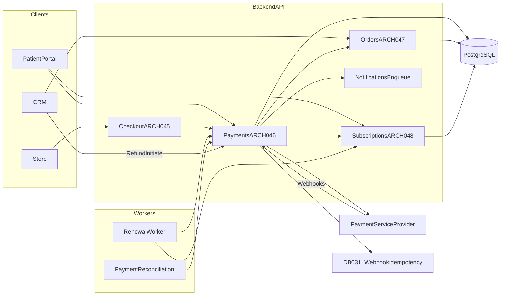
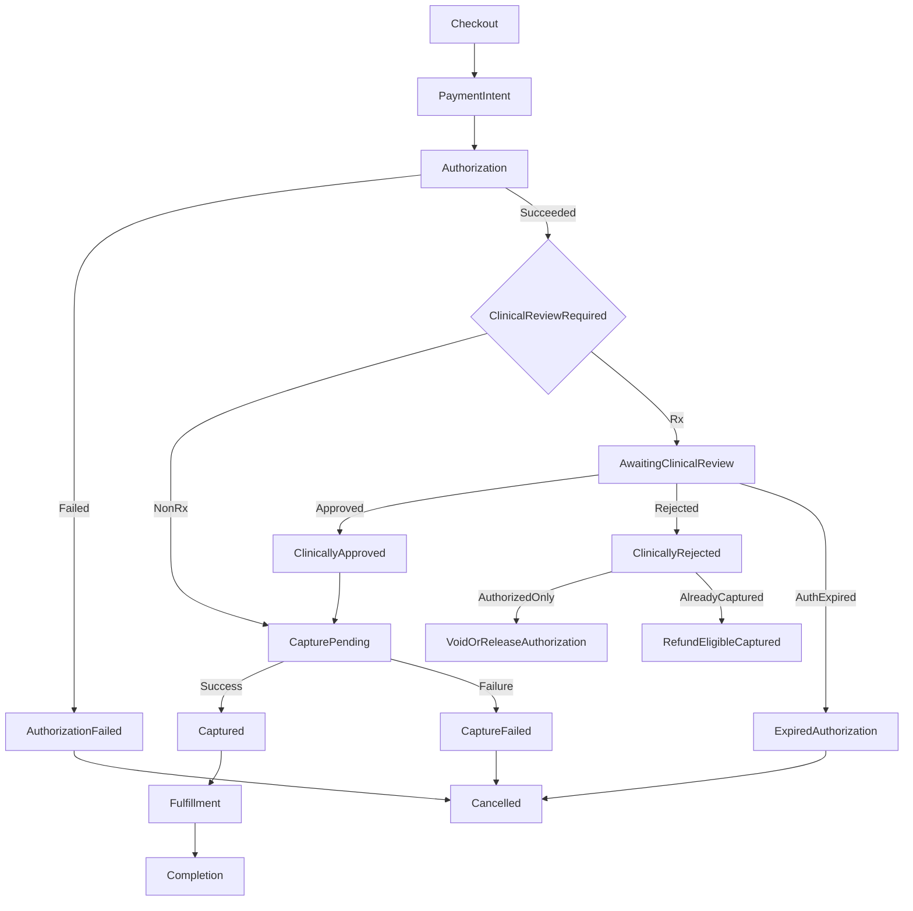
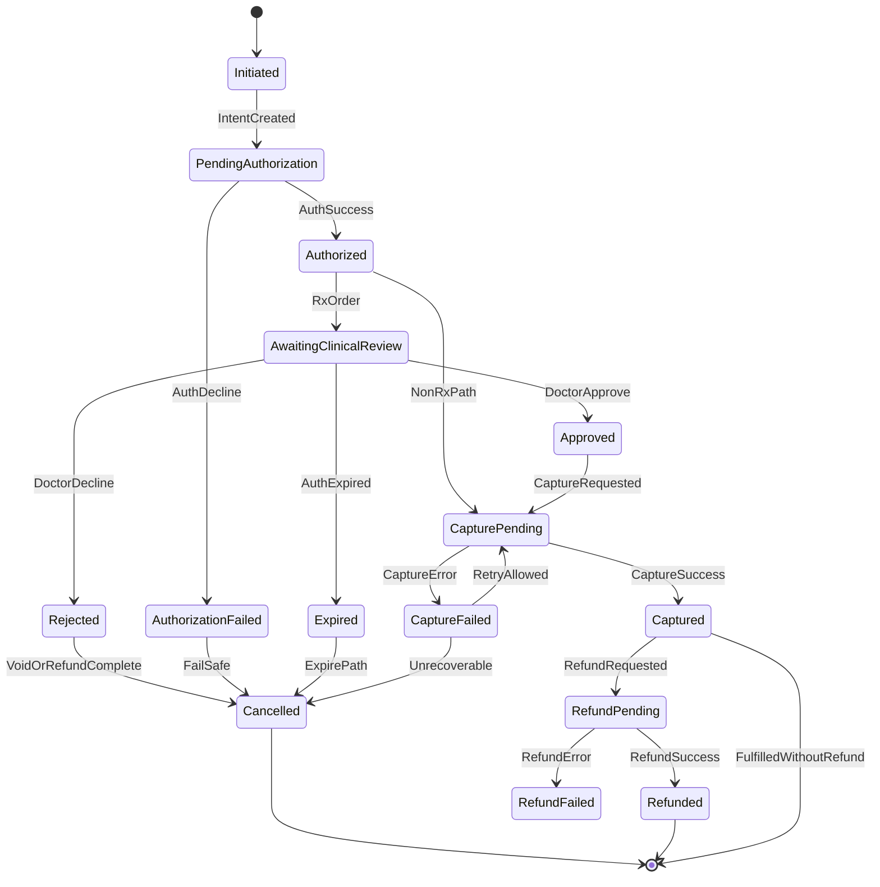
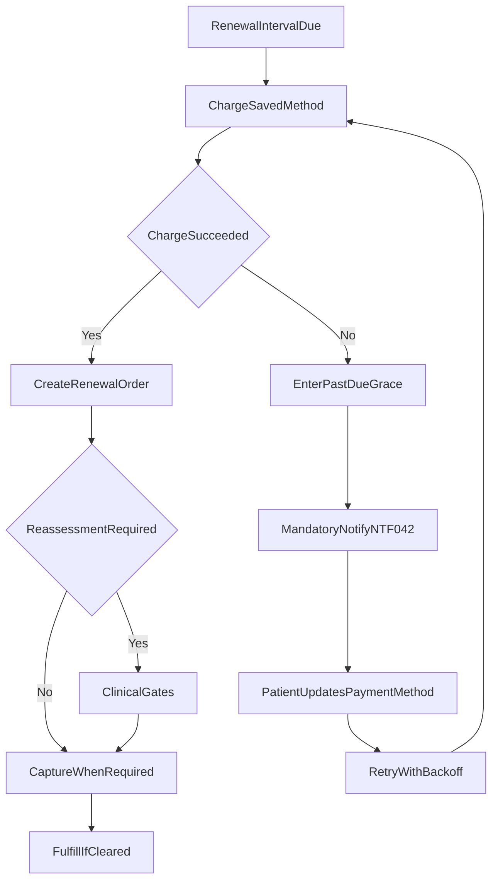
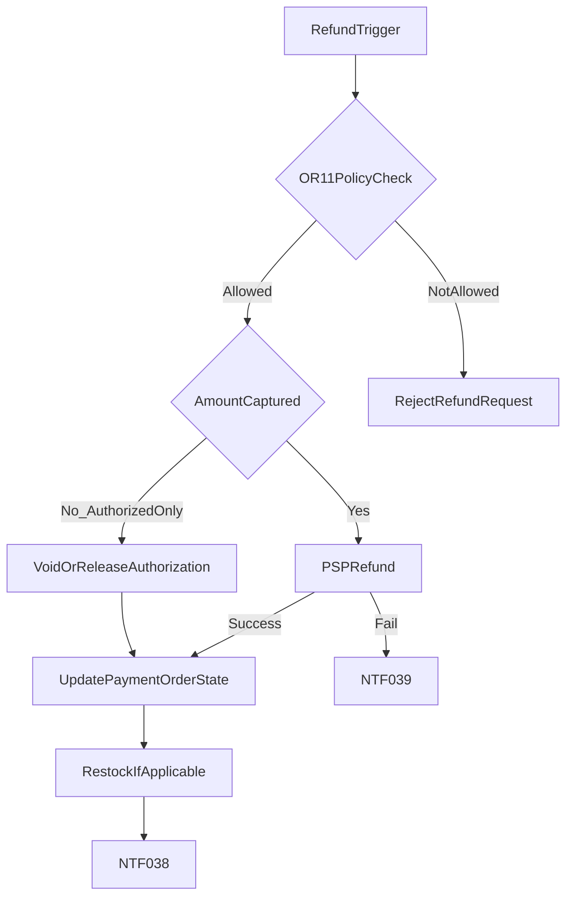
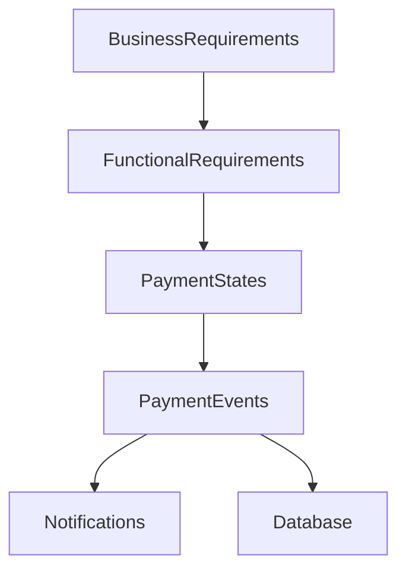
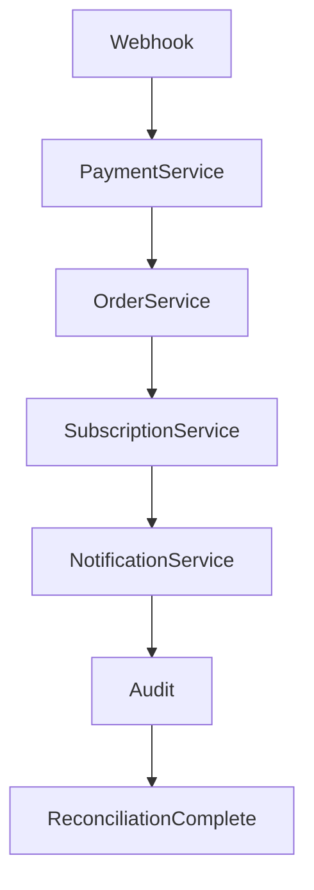

# 15 — Payment Flow

| Field | Value |
| --- | --- |
| Document | Payment Flow |
| Product | Clinexa |
| Version | 1.0 |
| Status | Approved — Implementation Ready |
| Primary market | United States |
| Audience | Payments Architecture, Enterprise Solution Architecture, Healthcare SaaS Architecture, Backend Engineering, Product, Operations, Support, Security, QA |
| Source of truth | [00 — Product Requirements Document](00-product-requirements-document.md) |
| Related docs | [01 — Project overview](01-project-overview.md), [02 — Business requirements](02-business-requirements.md), [03 — Functional requirements](03-functional-requirements.md), [04 — Non-functional requirements](04-non-functional-requirements.md), [05 — System architecture](05-system-architecture.md), [06 — User personas](06-user-personas.md), [07 — User journeys](07-user-journeys.md), [08 — Role permissions](08-role-permissions.md), [09 — Feature roadmap](09-feature-roadmap.md), [10 — Database design](10-database-design.md), [11 — API design](11-api-design.md), [12 — Authentication flow](12-authentication-flow.md), [13 — Security](13-security.md), [14 — Notifications](14-notifications.md) |

This document is the **authoritative payment architecture** for Clinexa Version 1. It defines payment service responsibilities, the authorize-before-clinical / capture-before-fulfillment merchant timing, payment lifecycle and states, subscription payment behavior, refund architecture, reliability controls, and PCI-aware security posture—without prescribing payment service provider (PSP) vendors, SDKs, merchant dashboards, webhook handler code, or source code.

It expands [PRD §8.14](00-product-requirements-document.md) (Payments), [PRD §9.6](00-product-requirements-document.md)–[§9.10](00-product-requirements-document.md) (renewal, fulfillment, refund journeys), [PRD §12.3](00-product-requirements-document.md)/[§12.6](00-product-requirements-document.md)/[§12.10](00-product-requirements-document.md) (payment reliability and tokenization), [PRD §13.2](00-product-requirements-document.md)/[§13.5](00-product-requirements-document.md)–[§13.7](00-product-requirements-document.md) (payment ≠ dispensing, subscriptions, order states, refund tiers), [03](03-functional-requirements.md) `FR-PAY-001`–`005` / `FR-CHK-001`–`005` / `FR-SUB-001`–`005` / `FR-ORD-001`–`006`, [04](04-non-functional-requirements.md) payment NFRs, [05](05-system-architecture.md) `ARCH-046` / `ARCH-047` / `ARCH-048` / `ARCH-070`, [10](10-database-design.md) `DB-028`–`034`, [11](11-api-design.md) `API-060`–`068`, and [14](14-notifications.md) `NTF-036`–`044`.

It does **not** redefine functional module behavior ([03](03-functional-requirements.md)), journey steps ([07](07-user-journeys.md)), API path catalogs ([11](11-api-design.md)), database schemas ([10](10-database-design.md)), authentication flows ([12](12-authentication-flow.md)), security control catalogs ([13](13-security.md)), or notification event catalogs ([14](14-notifications.md)). Those documents remain authoritative for their topics; this document owns payment lifecycle architecture, merchant authorize/capture timing, and the `PAY-*` control and state catalog.

> **Compliance posture:** Payment handling is **PCI-aware** (tokenization via PSP; no raw card PAN on the platform) and **HIPAA-aware** where payment events intersect patient identity and order context. This document does **not** claim PCI DSS, HIPAA, HITRUST, or SOC 2 Type II certification as V1 delivery gates (PRD §1.5; `NFR-065`).

> **Implementation independence:** `PAY-*` IDs are logical controls and catalog entries. PSP vendor selection, merchant console settings, SDK usage, and broker products are out of scope. No provider-specific configuration or code examples appear here.

> **Merchant timing decision (owned by this document):** Prior planning docs deferred authorize-vs-capture nuance here. V1 adopts **Authorize → Clinical Review → Capture → Fulfillment**. Order state `awaiting_clinical_review` means paid/authorized (PRD §13.6). Fulfillment requires payment captured and clinical gates cleared (PRD §9.7; `BP-05`). Payment success never authorizes Rx dispensing (`OR-03`).

---

## Table of contents

1. [Introduction](#1-introduction)
2. [Payment Architecture](#2-payment-architecture)
3. [Payment Lifecycle](#3-payment-lifecycle)
4. [Payment States](#4-payment-states)
5. [Subscription Payments](#5-subscription-payments)
6. [Refund Architecture](#6-refund-architecture)
7. [Payment Reliability](#7-payment-reliability)
8. [Security & Compliance](#8-security--compliance)
9. [Payment Traceability Matrix](#9-payment-traceability-matrix)
    - [9.6 Payment Responsibility Matrix](#96-payment-responsibility-matrix)
    - [9.7 Payment Event Matrix](#97-payment-event-matrix)
    - [9.8 Authorization vs Capture Matrix](#98-authorization-vs-capture-matrix)
    - [9.9 Payment Reconciliation Flow](#99-payment-reconciliation-flow)
    - [9.10 Payment Ownership Matrix](#910-payment-ownership-matrix)
10. [Revision History](#10-revision-history)

---

## 1. Introduction

### 1.1 Purpose

Define a production-grade payment architecture for Clinexa so that:

- Patients can pay for treatment plans and renewals through a third-party PSP without the platform storing raw card PAN ([PRD §8.14](00-product-requirements-document.md); `FR-PAY-001`).
- Checkout and renewal money handling fail safe: unpaid, inconsistent “completed” orders are not created (`FR-CHK-004`; `NFR-010`; `NFR-037`; `ARCH-007`).
- Rx-eligible orders authorize payment before clinical review and capture only after clinical approval, then fulfill only when payment is captured and clinical gates are cleared (`FR-CHK-005`; `BP-05`; `OR-03`).
- Refunds follow product policy tiers (`OR-11`; `FR-PAY-003`), including the default clinical-decline path for eligible captured amounts (`AC-BR-10`).
- Subscription renewals charge saved methods on schedule, enter grace/past-due with mandatory patient notification on failure, and never bypass clinical reassessment gates (`OR-10`; `FR-SUB-002`–`005`; `AC-BR-11`).
- Webhooks and critical payment mutations are idempotent and reconcilable (`FR-PAY-002`; `NFR-028`; `NFR-032`; `NFR-033`; `NFR-118`).
- Payment outcomes notify patients at the outcome level (`FR-PAY-005`; `NTF-036`–`039`) without inventing separate authorize/capture marketing emails ([14](14-notifications.md)).

### 1.2 Scope

#### In scope (V1)

| Area | Coverage |
| --- | --- |
| Payment service | Backend API Payments domain (`ARCH-046`): intent, authorize, capture, refund, saved methods |
| Merchant timing | Authorize → Clinical Review → Capture → Fulfillment (this document) |
| Lifecycle & states | Fine-grained `PAY-*` lifecycle mapped to durable DB semantics (`DB-028`) |
| Checkout money path | Auth + questionnaire gates, fail-safe order create (`FR-CHK-001`–`005`) |
| Subscriptions | Initial pay, renewal charge, grace, retry, reassessment, cancel, resubscribe (`OR-10`) |
| Refunds | Full/partial; automatic clinical decline; manual post-fulfillment; duplicate handling (`OR-11`) |
| Reliability | Idempotency, webhooks, retries, timeouts, replay, reconciliation |
| Security posture | Tokenization, no PAN storage, audit, permissions, fraud awareness, reconciliation |
| Traceability | Business → Functional → States/Events → Notifications → Database |
| Currency | USD V1 (`FR-PAY` validations) |

#### Out of scope

| Area | Deferred to / note |
| --- | --- |
| Insurance eligibility, claims, and billing | Out of V1 (PRD §10 / §11); V1 is patient-pay via PSP |
| Named PSP vendors, SDKs, merchant console configuration | Implementation |
| Automated dispute / chargeback productization | Future (FR-PAY Future Enhancements) |
| Alternative payment methods beyond PSP cards/tokenized methods | Future |
| Tax/shipping calculation engines beyond modeled order fields | Not invented here |
| Physical DB DDL / SQL | [10](10-database-design.md) / implementation |
| API path contract detail | [11](11-api-design.md) |
| Journey step narrative detail | [07](07-user-journeys.md) |
| Notification template copy | [14](14-notifications.md) / content ops |
| Separate authorize vs capture patient emails | Explicitly not invented (`NTF-036` outcome language) |

### 1.3 Audience

| Audience | Use of this document |
| --- | --- |
| Payments / enterprise architects | End-to-end payment design and authorize/capture timing review |
| Healthcare SaaS architects | Clinical gate vs money gate separation (`OR-03`) |
| Backend engineers | Lifecycle, state mapping, idempotency, reconciliation expectations |
| Product | Scope discipline vs insurance, disputes, and vendor specifics |
| Operations / Support | Refund tiers, renewal grace, capture-before-fulfill rules |
| Clinical ops | Understanding that payment authorization is not dispensing authority |
| Security / Compliance | PCI-aware / HIPAA-aware posture without certification claims |
| QA | Sandbox acceptance: capture, renewal failure + notify, staff refund (`AC-BR-09`) |

### 1.4 References

| Document | Relevance |
| --- | --- |
| [00 — PRD](00-product-requirements-document.md) | Single source of truth; §8.14 Payments; §9.6–9.10; §12–13 money and clinical rules |
| [02 — Business requirements](02-business-requirements.md) | `BO-1`/`BO-3`/`BO-4`, `BP-01`/`05`/`06`/`09`, `OR-03`/`09`–`11`, `AC-BR-09`–`11`, `KPI-03`–`05`/`10` |
| [03 — Functional requirements](03-functional-requirements.md) | `FR-PAY-001`–`005`, `FR-CHK-*`, `FR-SUB-*`, `FR-ORD-*`, `FR-SUP-005`, `FR-INV-005` |
| [04 — Non-functional requirements](04-non-functional-requirements.md) | `NFR-010`, `NFR-028`, `NFR-031`–`034`, `NFR-037`, `NFR-050`, `NFR-075`, `NFR-078`, `NFR-080`, `NFR-118`, `NFR-137` |
| [05 — System architecture](05-system-architecture.md) | `ARCH-004`/`007`/`020`/`046`–`048`/`070`; checkout and renewal sequences |
| [07 — User journeys](07-user-journeys.md) | `JRN-007`, `JRN-009`, `JRN-010`, `JRN-013`, `JRN-019`–`021`, `JRN-026` |
| [08 — Role permissions](08-role-permissions.md) | `PERM-CHK-*`, `PERM-PAY-001`–`003`, `PERM-SUB-*`, `RBAC-027`/`054`/`065` |
| [09 — Feature roadmap](09-feature-roadmap.md) | `ROAD-008`, `ROAD-009`, `ROAD-019`; `MS-02` / `MS-06` |
| [10 — Database design](10-database-design.md) | `DB-028`–`034`; payment/order/subscription state semantics |
| [11 — API design](11-api-design.md) | `API-060`–`068`, `API-082`, `API-091`; `ERR-PAY-*`; idempotency matrix |
| [12 — Authentication flow](12-authentication-flow.md) | `AUTH-016` Payment Webhook Identity |
| [13 — Security](13-security.md) | Tokenization, webhook integrity, no PAN, incident posture |
| [14 — Notifications](14-notifications.md) | `NTF-036`–`044` payment and subscription notices |

---

## 2. Payment Architecture

### 2.1 Architectural principles

| ID | Principle | Trace |
| --- | --- | --- |
| **PAY-001** | Backend API owns payment gates and money state; clients are thin | `ARCH-004`, `ARCH-046` |
| **PAY-002** | Clinical gates are first-class and independent of payment success | `OR-03`, `ARCH-002`, `FR-STO-006`, `RBAC-027` |
| **PAY-003** | Prefer fail-safe checkout over inconsistent unpaid “completed” orders | `FR-CHK-004`, `NFR-010`, `NFR-037`, `ARCH-007` |
| **PAY-004** | Platform never stores raw card PAN; PSP tokenization only | `FR-PAY-001`, `NFR-050`, `ARCH-142` |
| **PAY-005** | Payment outcomes drive order and subscription transitions idempotently | `FR-PAY-002`, `PRD §8.14` |
| **PAY-006** | V1 merchant timing: Authorize → Clinical Review → Capture → Fulfillment | PRD §13.6 / §9.7; this document |
| **PAY-007** | Provider abstraction: domain rules do not depend on a named PSP | `NFR-137`, `ARCH-070` |

### 2.2 Payment service responsibilities

The Payments domain (`ARCH-046`) within the Backend API is responsible for:

| Responsibility | Description | Trace |
| --- | --- | --- |
| Payment intent | Create PSP payment intent/session for an order context without accepting raw PAN | `API-062`, `FR-PAY-001` |
| Tokenization handoff | Patient completes PSP-hosted / tokenized collection; Clinexa stores tokens and display metadata only | `FR-PAY-001`, `DB-030` |
| Authorization | Place authorization hold (or equivalent PSP authorize semantics) after checkout gates succeed | `FR-CHK-004`, **PAY-006** |
| Capture | Capture authorized funds after clinical approval (Rx) or after payment success path for non-Rx when capture is required before fulfillment | `BP-05`, **PAY-006** |
| Refunds | Initiate policy-checked refunds; record amounts actually refunded | `FR-PAY-003`, `OR-11`, `DB-029` |
| Saved methods | Attach/list/delete patient-owned tokenized methods for renewals | `FR-PAY-004`, `FR-PRT-004`, `API-064`–`066` |
| Webhook ingest | Verify provider signature; apply durable outcomes idempotently | `API-068`, `AUTH-016`, `DB-031` |
| State projection | Update payment, order, and subscription records from confirmed outcomes | `FR-PAY-002`, `ARCH-047`, `ARCH-048` |
| Outcome notifications | Emit domain events that trigger payment/refund notices | `FR-PAY-005`, `NTF-036`–`039` |

Checkout orchestration (`ARCH-045`), Orders (`ARCH-047`), and Subscriptions (`ARCH-048`) consume Payments outcomes; they do not call the PSP directly from clients.

### 2.3 Payment lifecycle (conceptual)

At the architecture level, every money movement follows:

1. **Context** — Checkout finalize or subscription renewal attempt creates a payment context tied to an order and/or subscription (`DB-028`).
2. **Intent** — Platform creates a PSP payment intent; client never sends PAN to Clinexa APIs.
3. **Authorization** — PSP authorizes funds; platform records success or failure.
4. **Clinical gate (Rx)** — Authorized Rx orders enter clinical review; payment does not dispense.
5. **Capture** — On clinical approval (Rx) or non-Rx path rules, platform captures; fulfillment requires captured payment.
6. **Fulfillment / completion** — Ops fulfills only when payment captured and clinical clearance rules pass; terminal money states may later refund or reconcile.
7. **Refund / void** — Per `OR-11` and capture state: release authorization or refund captured amounts.

### 2.4 Authorization

| ID | Rule |
| --- | --- |
| **PAY-008** | Authorization occurs after checkout authentication, Rx questionnaire (when required), coupon/price revalidation, and intent creation succeed (`FR-CHK-001`–`004`). |
| **PAY-009** | Successful authorization allows the order to leave `payment_pending` and, for Rx, enter `awaiting_clinical_review` as “Paid/authorized” (PRD §13.6; `FR-CHK-005`). |
| **PAY-010** | Failed authorization leaves no inconsistent paid/clinical/fulfilled order (`FR-CHK-004`; `NFR-037`). |
| **PAY-011** | Authorization is not dispensing authority and is not clinical approval (`OR-03`). |

### 2.5 Capture

| ID | Rule |
| --- | --- |
| **PAY-012** | Capture occurs after clinical approval for Rx-eligible orders (and after pharmacist review requirements are satisfied before fulfillment per `OR-05` / `FR-ORD-003`). Capture is a money event; clinical gates remain independent. |
| **PAY-013** | Non-Rx orders may skip clinical states after payment success and proceed toward fulfillment (`OR-09`; `FR-ORD-004`); capture must still complete before fulfillment treats the order as payment-cleared (`BP-05`). |
| **PAY-014** | Operations fulfillment requires **payment captured** and clinical gates cleared (PRD §9.7; `BP-05`). |
| **PAY-015** | Capture failure blocks fulfillment; the platform must not silently ship or dispense (`OR-08`). |
| **PAY-016** | Order/payment amounts are immutable after capture success ([10](10-database-design.md) money immutability); refunds record separate refund amounts (`DB-029`). |

### 2.6 Refunds

Refund architecture is detailed in [§6](#6-refund-architecture). At the architecture layer:

| ID | Rule |
| --- | --- |
| **PAY-017** | Refunds are PSP-mediated; platform records refund outcomes and drives order/payment state (`FR-PAY-003`). |
| **PAY-018** | Refund amount cannot exceed captured amount (`FR-PAY` validations; [10](10-database-design.md)). |
| **PAY-019** | Pre-fulfillment clinical decline defaults to refunding eligible **captured** amounts; if only authorized and not yet captured, release/void the authorization as the money reversal path (`OR-11`; **PAY-006**). |

### 2.7 Subscription payments

Subscription money handling is detailed in [§5](#5-subscription-payments). Architecture summary:

| ID | Rule |
| --- | --- |
| **PAY-020** | Initial subscription purchase uses the same Payments path as checkout (intent → authorize → clinical as required → capture). |
| **PAY-021** | Renewals charge the default saved PSP method on schedule via workers—not a public patient “charge now” endpoint (`FR-SUB-002`; `FR-PAY-004`; `ARCH-048`). |
| **PAY-022** | Renewal failure enters past-due/grace with mandatory patient notification and CRM surface (`OR-10`; `FR-SUB-003`; `NTF-042`). |

### 2.8 Renewal handling

| ID | Rule |
| --- | --- |
| **PAY-023** | Renewal worker creates a renewal charge attempt (`DB-034` RenewalAttempts), records success/failure, and creates a renewal order on success (`ARCH` renewal sequence). |
| **PAY-024** | Successful renewal money does not bypass Rx clinical reassessment or pharmacy gates when configured (`FR-SUB-005`; `OR-10`). |
| **PAY-025** | Patient updates payment method in Portal; Support may assist renewal without gate bypass (`FR-PRT-004`; `PERM-SUB-003`). |

### 2.9 Payment provider abstraction

| ID | Rule |
| --- | --- |
| **PAY-026** | Domain model speaks in generic PSP capabilities: tokenize, authorize, capture, refund, webhook event, saved method reference. |
| **PAY-027** | Physical PSP statuses map into platform semantics (`pending`, `authorized_or_captured`, `failed`, `refunded` on `DB-028`) and the fine-grained lifecycle in [§4](#4-payment-states). |
| **PAY-028** | Swapping PSP implementations must not change `OR-03`, `OR-10`, `OR-11`, or clinical gate ownership. |
| **PAY-029** | Sandbox/test mode is required for V1 demo acceptance (`NFR-137`; `AC-BR-09`). |

### 2.10 Architecture diagram

---

## 3. Payment Lifecycle

### 3.1 Happy path (Rx-eligible)

| Step | ID | Description | Trace |
| --- | --- | --- | --- |
| Checkout | **PAY-030** | Authenticated patient finalizes cart; Rx questionnaire and coupon/price gates pass | `FR-CHK-001`–`003`; `JRN-007` |
| Payment Intent | **PAY-031** | API creates payment intent for order totals; no PAN in Clinexa payload | `API-062`; `FR-PAY-001` |
| Authorization | **PAY-032** | PSP authorizes; webhook/confirm updates payment; order leaves `payment_pending` | `FR-PAY-002`; `FR-CHK-004` |
| Clinical Review | **PAY-033** | Rx order enters `awaiting_clinical_review` (Paid/authorized); doctor reviews | PRD §13.6; `FR-CHK-005`; `JRN-010` |
| Capture | **PAY-034** | After clinical approval (and pharmacy readiness before fulfill), platform captures authorized funds | **PAY-006**; `BP-05` |
| Fulfillment | **PAY-035** | Ops fulfills only when payment captured and clinical gates cleared | PRD §9.7; `FR-ORD-003` |
| Completion | **PAY-036** | Order reaches fulfilled terminal path; payment remains captured unless later refunded | `FR-ORD-002` |

### 3.2 Happy path (Non-Rx)

| Step | ID | Description | Trace |
| --- | --- | --- | --- |
| Checkout → Intent → Authorization | **PAY-037** | Same money path; clinical review states skipped | `OR-09`; `FR-ORD-004`; `FR-CHK-005` |
| Capture → Fulfillment → Completion | **PAY-038** | After payment success/capture, order moves to awaiting fulfillment | `BP-05`; `AC-BR-07` |

### 3.3 Failure and exception paths

| Path | ID | Behavior | Trace |
| --- | --- | --- | --- |
| Authorization Failed | **PAY-039** | Decline/error recorded; no paid clinical/fulfilled order; cart may persist; patient notified of payment failure | `FR-CHK-004`; `NTF-037`; `ERR-PAY-001` |
| Clinical Rejected | **PAY-040** | Order → `clinical_declined`; if captured → default refund eligible captured amount; if authorized only → void/release authorization; notify | `OR-11`; `AC-BR-10`; `API-091`; `NTF-033`/`038` |
| Capture Failed | **PAY-041** | Capture pending/failed recorded; fulfillment blocked; reconciliation/retry; no silent fulfill | `BP-05`; `OR-08`; `NFR-078` |
| Refund | **PAY-042** | Policy-checked full/partial refund via PSP; order/payment states update; restock when applicable | `OR-11`; `FR-PAY-003`; `FR-INV-005`; `JRN-026` |
| Cancellation | **PAY-043** | Cancel before/instead of fulfill may void authorization or refund captured amount per state; existing open orders follow order rules | `FR-ORD-006` |
| Expired Authorization | **PAY-044** | Authorization expires before capture; payment/order marked expired/cancelled path; no fulfillment; patient may re-checkout | **PAY-006**; fail-safe posture |

### 3.4 Lifecycle flowchart

### 3.5 Domain events on the lifecycle

| Event | When | Downstream |
| --- | --- | --- |
| Payment Authorized | Authorization succeeds | Order/payment state; may contribute to payment-success outcome notice (`NTF-036`) |
| Payment Failed | Authorization or critical money failure | `NTF-037`; fail-safe order posture |
| Payment Refunded | Refund succeeds | `NTF-038`; order/payment `refunded` |
| Order Created / Cancelled | Checkout success path / cancel | Order visibility; related notices |
| Subscription Created / Renewed / Cancelled | Sub money lifecycle | `NTF-040`–`043` |

Patient-facing notices use **outcome** language for authorized/captured success—not separate authorize vs capture emails ([14](14-notifications.md)).

---

## 4. Payment States

### 4.1 State catalog

Fine-grained lifecycle states are owned by this document. Durable persistence collapses physical PSP outcomes into `DB-028` semantics: `pending`, `authorized_or_captured`, `failed`, `refunded` ([10](10-database-design.md); FR §14).

| ID | State | Meaning | Typical DB-028 mapping |
| --- | --- | --- | --- |
| **PAY-045** | Initiated | Payment context created for checkout or renewal; intent not yet confirmed | `pending` |
| **PAY-046** | Pending Authorization | Intent submitted; awaiting PSP authorization confirmation | `pending` |
| **PAY-047** | Authorized | PSP authorization succeeded; funds held / authorize-equivalent | `authorized_or_captured` |
| **PAY-048** | Authorization Failed | PSP declined or authorize error | `failed` |
| **PAY-049** | Awaiting Clinical Review | Authorized Rx order waiting on doctor review | `authorized_or_captured` + order `awaiting_clinical_review` |
| **PAY-050** | Approved | Clinical approval recorded; capture may proceed | `authorized_or_captured` |
| **PAY-051** | Rejected | Clinical decline; money reversal path required | `authorized_or_captured` → void/refund path |
| **PAY-052** | Capture Pending | Capture request in flight | `pending` or `authorized_or_captured` (in-flight) |
| **PAY-053** | Captured | Funds captured; fulfillment money gate cleared | `authorized_or_captured` |
| **PAY-054** | Capture Failed | Capture attempt failed; fulfillment blocked | `failed` or retained authorized pending retry/recon |
| **PAY-055** | Refund Pending | Refund requested; awaiting PSP confirmation | transitional; payment not yet terminal `refunded` |
| **PAY-056** | Refunded | Full or partial refund recorded (order may show refunded outcome) | `refunded` |
| **PAY-057** | Refund Failed | Refund attempt failed or delayed; ops/support visibility | remains prior money state + exception |
| **PAY-058** | Cancelled | Payment/order cancelled without completed fulfillment path | `failed` or terminal cancel alongside order cancel |
| **PAY-059** | Expired | Authorization expired before capture | `failed` / cancelled money path |
| **PAY-060** | Reconciled | Exception path aligned by reconciliation (charge/order mismatch resolved) | durable outcome after recon job |

### 4.2 Transition rules

| From | To | Trigger | Guard |
| --- | --- | --- | --- |
| Initiated | Pending Authorization | Intent created | Checkout/renewal context valid |
| Pending Authorization | Authorized | PSP authorize success / webhook | Idempotent event apply |
| Pending Authorization | Authorization Failed | PSP decline/error | Fail-safe; no paid clinical order |
| Authorized | Awaiting Clinical Review | Rx order | `FR-CHK-005` |
| Authorized | Capture Pending | Non-Rx path (clinical skip) | `OR-09` |
| Awaiting Clinical Review | Approved | Doctor approval | Clinical gate only |
| Awaiting Clinical Review | Rejected | Doctor decline | Triggers void/refund path |
| Awaiting Clinical Review | Expired | Auth TTL elapsed | No fulfillment |
| Approved | Capture Pending | Capture initiated | Clinical clearance for money capture timing |
| Capture Pending | Captured | PSP capture success | Record actual captured amount |
| Capture Pending | Capture Failed | PSP capture failure | Block fulfillment |
| Captured | Refund Pending | Auto or manual refund initiate | `OR-11`; amount ≤ captured |
| Refund Pending | Refunded | PSP refund success | `DB-029` recorded |
| Refund Pending | Refund Failed | PSP refund failure/delay | `NTF-039` |
| Any pre-capture | Cancelled | Cancel/abandon policy | Void auth if authorized |
| Exception mismatch | Reconciled | Reconciliation worker | Ops-aligned durable outcome |

### 4.3 Illegal transitions

| ID | Illegal transition | Reason |
| --- | --- | --- |
| **PAY-061** | Captured → Authorization Failed | Success cannot become failure; use refund for reversal ([10](10-database-design.md)) |
| **PAY-062** | Refunded → Captured / Authorized | Terminal financial state; issue a new payment if needed |
| **PAY-063** | Initiated / Pending Authorization → Refunded | Refund requires prior authorization or capture |
| **PAY-064** | Authorization Failed → Captured | Failed authorize cannot capture |
| **PAY-065** | Capture Failed → Fulfillment money-cleared | Fulfillment requires captured payment (`BP-05`) |

### 4.4 State diagram

### 4.5 Relationship to order states

| Order state (PRD §13.6) | Payment relationship |
| --- | --- |
| `draft` | No durable payment / not finalized |
| `payment_pending` | Pending Authorization |
| `awaiting_clinical_review` | Authorized (Paid/authorized) |
| `clinical_declined` | Rejected + void/refund path |
| `awaiting_fulfillment` | Captured (or non-Rx after payment success/capture) |
| `fulfilled` | Captured (unless later refunded) |
| `refunded` | Refunded outcome |
| `cancelled` | Cancelled / expired / voided money path as applicable |

---

## 5. Subscription Payments

### 5.1 Requirements anchor

Subscription payment behavior derives from `OR-10`, `FR-SUB-001`–`005`, `FR-PAY-004`, `FR-PRT-004`, `BP-06`, `JRN-019`–`021`, and `ARCH-048`. Plans are configurable (`FR-SUB-001`; `PERM-SUB-002`).

### 5.2 Initial payment

| ID | Rule |
| --- | --- |
| **PAY-066** | Initial subscription purchase uses checkout Payments: intent → authorize → clinical review when Rx-eligible → capture before fulfillment. |
| **PAY-067** | Successful initial pay may save the tokenized payment method for future renewals (`DB-030`; `FR-PAY-004`). |
| **PAY-068** | Subscription Created domain event / notice may fire (`NTF-040`); payment success outcome uses `NTF-036` language. |

### 5.3 Renewal

| ID | Rule |
| --- | --- |
| **PAY-069** | On plan interval, renewal worker charges the default saved PSP method (`FR-SUB-002`; `FR-PAY-004`). |
| **PAY-070** | Successful renewal creates a renewal order and records a renewal attempt (`DB-034`); subscription remains active/renewing per [10](10-database-design.md) semantics. |
| **PAY-071** | Renewal Success notifies per `NTF-041`; money still respects capture/clinical rules for Rx renewal fulfillment. |

### 5.4 Failed renewal

| ID | Rule |
| --- | --- |
| **PAY-072** | Failed renewal charge enters grace/past-due; must notify patient; surface in CRM (`OR-10`; `FR-SUB-003`; `NTF-042`; `AC-BR-11`). |
| **PAY-073** | Failed renewal must not silently fulfill Rx without clinical gates (`OR-03`; `FR-SUB-005`). |
| **PAY-074** | Patient can update payment method in Portal (`FR-PRT-004`; `API-082`; `PERM-PAY-002`). |

### 5.5 Grace period

| ID | Rule |
| --- | --- |
| **PAY-075** | Past-due/grace is the recoverable failure path after renewal charge failure (`OR-10`). |
| **PAY-076** | During grace, Support may assist renewal recovery without bypassing clinical or payment integrity gates (`PERM-SUB-003`). |

### 5.6 Retry policy

| ID | Rule |
| --- | --- |
| **PAY-077** | Transient PSP failures use retries with exponential backoff and jitter (`NFR-031`). |
| **PAY-078** | Retry attempts are recorded (`DB-034`); duplicate charge prevention uses idempotency keys (`NFR-033`; `NFR-118`). |
| **PAY-079** | Exhausted or permanent failures remain past-due until method update/success or cancellation—never a silent “paid and fulfilled” Rx path. |

### 5.7 Clinical reassessment

| ID | Rule |
| --- | --- |
| **PAY-080** | When reassessment is configured, Rx renewal fulfillment remains gated on clinical requirements (`OR-10`; `FR-SUB-005`). |
| **PAY-081** | Charge success plus later clinical decline follows decline/refund rules—not silent fulfill (`OR-11`; `AC-BR-11`). |
| **PAY-082** | Reassessment Required notice may fire (`NTF-044`). |

### 5.8 Cancellation

| ID | Rule |
| --- | --- |
| **PAY-083** | Patient (or authorized assist) cancel stops future renewals (`FR-SUB-004`; `OR-10`). |
| **PAY-084** | Already-created orders continue under order/payment rules; cancel does not invent new refund tiers beyond `OR-11`. |
| **PAY-085** | Subscription Cancelled notice may fire (`NTF-043`). |

### 5.9 Resubscribe

| ID | Rule |
| --- | --- |
| **PAY-086** | Resubscribe is a new subscription purchase path (new plan binding + initial payment)—not a silent reactivation that bypasses checkout/clinical gates. |
| **PAY-087** | Prior cancelled subscription history remains auditable; new money movement creates new payment/order records. |

### 5.10 Subscription payment flow

---

## 6. Refund Architecture

Refund policy is a **product policy**, not legal advice (PRD §13.7; [02](02-business-requirements.md) §4.10).

### 6.1 Principles

| ID | Rule |
| --- | --- |
| **PAY-088** | All refunds are PSP-mediated and recorded on `DB-029` with linkage to payment and order. |
| **PAY-089** | Refund amount ≤ captured amount; coupon-adjusted refunds refund the amount actually captured, subject to PSP capabilities (`OR-11`). |
| **PAY-090** | Staff refund initiation requires policy checks (`FR-SUP-005`; `PERM-PAY-003`; `RBAC-065`). |
| **PAY-091** | Inventory restock occurs when refunds tie to unfulfilled/returned stock per operations rules (`FR-INV-005`; `OR-11`). |

### 6.2 Full refund

| ID | Rule |
| --- | --- |
| **PAY-092** | Full refund returns the entire eligible captured amount for the payment/order context. |
| **PAY-093** | On success: payment/order move to refunded outcome; patient receives `NTF-038`. |

### 6.3 Partial refund

| ID | Rule |
| --- | --- |
| **PAY-094** | Partial refund records the amount actually refunded; remaining captured balance stays captured. |
| **PAY-095** | Partial capture/refund edge cases record actual amounts (`FR-PAY` alternative flows)—no invented over-refund. |

### 6.4 Automatic refund

| ID | Rule |
| --- | --- |
| **PAY-096** | Pre-fulfillment clinical decline defaults to automatic refund of eligible **captured** amounts (`OR-11`; `AC-BR-10`). |
| **PAY-097** | If decline occurs after authorization but before capture, automatic money path is void/release of authorization (**PAY-019**), achieving the same business outcome: patient is not charged for a declined pre-fulfillment Rx order. |

### 6.5 Manual refund

| ID | Rule |
| --- | --- |
| **PAY-098** | Post-fulfillment refunds are manual and exceptional: staff approval + reason codes (`OR-11`). |
| **PAY-099** | Support/Ops (and Admin scoped) initiate via `API-067` when policy allows; Patient may request (scoped), not unilaterally force refund. |

### 6.6 Clinical rejection refund

| ID | Rule |
| --- | --- |
| **PAY-100** | Doctor decline (`API-091`) transitions order to `clinical_declined` and triggers the money reversal path (`JRN-013`; `BP-09`). |
| **PAY-101** | Default V1: refund eligible captured amounts pre-fulfillment; void authorization if not yet captured (**PAY-040**). |
| **PAY-102** | KPI-10 measures clinical decline refund correctness. |

### 6.7 Duplicate payment handling

| ID | Rule |
| --- | --- |
| **PAY-103** | Duplicate webhooks or client retries must not create duplicate captures/refunds (`FR-PAY-002`; `DB-031`; `AC-PAY-002`). |
| **PAY-104** | Charge-succeeded / order-create-failed mismatches are handled by payment reconciliation (`ARCH` payment reconciliation worker)—not by inventing a chargeback product. |
| **PAY-105** | Suspected duplicate successful charges are ops-visible via reconciliation; remediation is void/refund per policy and audit, not silent double-fulfill. |

### 6.8 Refund flow

---

## 7. Payment Reliability

### 7.1 Idempotency

| ID | Control | Trace |
| --- | --- | --- |
| **PAY-106** | Critical payment mutations require client `Idempotency-Key` (checkout finalize, payment intent, refund initiate) | `NFR-033`, `NFR-118`, [11](11-api-design.md) §13.7 |
| **PAY-107** | Webhooks are idempotent by provider event ID stored in `DB-031` | `FR-PAY-002`, `NFR-032`, `API-068` |
| **PAY-108** | Duplicate delivery yields no-op with the same durable outcome (`AC-PAY-002`) | `SEC-057`/`058` |

### 7.2 Retry handling

| ID | Control | Trace |
| --- | --- | --- |
| **PAY-109** | Transient PSP and related outbound failures retry with exponential backoff and jitter | `NFR-031` |
| **PAY-110** | At-least-once processing is assumed for payment/webhook paths; handlers must be safe under redelivery | `NFR-028`, PRD §12.3 |

### 7.3 Webhook reconciliation

| ID | Control | Trace |
| --- | --- | --- |
| **PAY-111** | Inbound webhooks verify provider signature before any state mutation | `AUTH-016`, `ERR-PAY-003`, `SEC-059` |
| **PAY-112** | Webhook lag may leave order in `payment_pending` until confirmed; clients must not invent paid state | `FR-CHK` alternative flows |
| **PAY-113** | Webhook processing failures are alertable | `NFR-080` |

### 7.4 Duplicate prevention

| ID | Control | Trace |
| --- | --- | --- |
| **PAY-114** | Idempotency conflict surfaces as controlled error (`ERR-PAY-002`) rather than double charge | [11](11-api-design.md) |
| **PAY-115** | Renewal attempts and refund initiates are keyed so concurrent retries cannot double-apply money side effects | `FR-PAY-002`/`004`, **PAY-078** |

### 7.5 Provider timeout handling

| ID | Control | Trace |
| --- | --- | --- |
| **PAY-116** | Outbound PSP calls honor timeout budgets (≤ 10 s class per `NFR-034`) | `NFR-034` |
| **PAY-117** | PSP timeout on checkout → fail-safe; no unpaid order marked completed/paid (`NFR-010`; `ERR-PAY-006`) | `FR-CHK-004` |
| **PAY-118** | Ambiguous timeout outcomes are resolved by webhook confirmation and/or reconciliation—not by optimistic paid state | `ARCH-007` |

### 7.6 Event replay

| ID | Control | Trace |
| --- | --- | --- |
| **PAY-119** | Provider event replay is safe: verified signature + `DB-031` key → apply once | `FR-PAY-002` |
| **PAY-120** | Replay after successful apply returns success/no-op without mutating again | `AUTH` webhook flow; `AC-PAY-002` |

### 7.7 Queue behavior

| ID | Control | Trace |
| --- | --- | --- |
| **PAY-121** | Subscription renewals and payment reconciliation run on workers isolatable from request latency | `ARCH-104`, `NFR-021` |
| **PAY-122** | Queue depth and payment/renewal failure metrics are observed | `NFR-078`, PRD §12.9 |
| **PAY-123** | Feature flags must not bypass payment gates | `NFR-123` |

### 7.8 Recovery

| ID | Control | Trace |
| --- | --- | --- |
| **PAY-124** | Charge succeeded / order create failed → reconciliation job/report aligns state or drives refund | `FR-PAY` edge cases; `ARCH` failure handling |
| **PAY-125** | Capture failed after clinical approval → block fulfill; retry/recon; escalate via ops visibility | **PAY-041** |
| **PAY-126** | Refund failed/delayed → `NTF-039` + staff follow-up; do not mark refunded until PSP confirms | `FR-PAY-003` |
| **PAY-127** | Sandbox acceptance proves capture, renewal failure + notify, and staff-initiated refund (`AC-BR-09`) | PRD §18.1 |

---

## 8. Security & Compliance

### 8.1 PCI awareness

| ID | Control | Trace |
| --- | --- | --- |
| **PAY-128** | Platform is designed to avoid storing raw card PAN by using PSP tokenization | `FR-PAY-001`, `NFR-050` |
| **PAY-129** | This document does **not** claim PCI DSS certification, SAQ type, or a completed cardholder-data-environment attestation | Compliance posture callout |
| **PAY-130** | Vendor PSP must provide tokenization; vendor risk evaluation applies (`SEC-114`) | [13](13-security.md) |

### 8.2 Tokenization

| ID | Control | Trace |
| --- | --- | --- |
| **PAY-131** | Card data is collected/tokenized via PSP; Clinexa APIs accept tokens/references only | `API-062`, `API-065` |
| **PAY-132** | Saved methods store token + display metadata (e.g., last4/brand)—never PAN | `DB-030` |

### 8.3 No PAN storage

| ID | Control | Trace |
| --- | --- | --- |
| **PAY-133** | No raw PAN in database, API payloads, logs, notifications, or incident scratch space | `NFR-050`, `NFR-075`, `SEC-023`/`064`, `NTF-088` |
| **PAY-134** | Payment integrity incidents coordinate with PSP; never store captured PAN during investigation (`SEC-104`) | [13](13-security.md) |

### 8.4 Audit logging

| ID | Control | Trace |
| --- | --- | --- |
| **PAY-135** | Refund initiation logs actor, order, amount, reason (`RBAC-065`) | `FR-PAY-003` |
| **PAY-136** | Payment state transitions from webhooks are auditable with provider event correlation | `FR-PAY-002`, `DB-031` |
| **PAY-137** | Logs redact full PAN and other prohibited secrets | `NFR-075` |

### 8.5 Sensitive data handling

| ID | Control | Trace |
| --- | --- | --- |
| **PAY-138** | Billing address and payment identity context are PII; handled under patient isolation and least privilege | [10](10-database-design.md), `OR-06` |
| **PAY-139** | Notification content uses payment outcome language without PAN or unnecessary clinical detail | `FR-PAY-005`, [14](14-notifications.md) |
| **PAY-140** | Payments data class is restricted per `RBAC-054` | [08](08-role-permissions.md) |

### 8.6 Payment permissions

| ID | Permission / rule | Trace |
| --- | --- | --- |
| **PAY-141** | Patient may pay and manage own saved methods | `PERM-PAY-001`, `PERM-PAY-002` |
| **PAY-142** | Support/Ops initiate refunds when policy allows; Patient request scoped; Admin scoped | `PERM-PAY-003` |
| **PAY-143** | Doctors/Pharmacists own clinical gates; decline triggers refund path but they are not a finance admin role | `OR-03`, `OR-04`, `OR-05` |
| **PAY-144** | PSP webhook identity is signature-verified system identity—not a user JWT (`AUTH-016`) | [12](12-authentication-flow.md) |
| **PAY-145** | Guest may start checkout but cannot finalize pay without authentication | `PERM-CHK-001`/`002`, `FR-CHK-001` |

### 8.7 Fraud awareness

| ID | Control | Trace |
| --- | --- | --- |
| **PAY-146** | Fail-safe checkout and idempotent webhooks reduce inconsistent paid-state fraud/abuse windows | `ARCH-007`, **PAY-003** |
| **PAY-147** | Post-fulfillment refunds require staff approval and reason codes to limit abuse (`OR-11`) | **PAY-098** |
| **PAY-148** | Coupon redemption binds to successful payment; checkout revalidates price/publish at submit | `FR-CPN-002`/`003`, `FR-CHK-003` |
| **PAY-149** | Automated dispute management is out of V1 scope (FR-PAY Future Enhancements)—not invented here | PRD / FRS future |

### 8.8 Reconciliation

| ID | Control | Trace |
| --- | --- | --- |
| **PAY-150** | Reconciliation detects charge-without-order, webhook lag, and capture/refund mismatches | `ARCH` payment reconciliation |
| **PAY-151** | Metrics include payment failures and renewal failures; alerts cover webhook processing failures | `NFR-078`, `NFR-080` |
| **PAY-152** | KPI-03 / KPI-04 / KPI-05 / KPI-10 provide business observability over payment→fulfill, renewal success, recovery notifies, and decline refund correctness | [02](02-business-requirements.md) |

---

## 9. Payment Traceability Matrix

### 9.1 End-to-end mapping

| Business | Functional | Payment states / controls | Payment events | Notifications | Database |
| --- | --- | --- | --- | --- | --- |
| `BO-1` Convert; `BP-01` Guest/Rx purchase | `FR-CHK-001`–`005`, `FR-PAY-001`/`002`/`005`, `FR-ORD-001` | **PAY-030**–**039**, Initiated→Authorized→Awaiting Clinical Review | Payment Authorized / Failed; Order Created | `NTF-036`, `NTF-037` | `DB-028`, order states |
| `OR-03` Pay ≠ dispense; `AC-BR-02` | `FR-STO-006`, `FR-ORD-003`, `FR-PAY-002` | **PAY-002**, **PAY-011**, **PAY-033** | Clinical events (non-money) + Payment Authorized | Clinical notices (doc 14); not pay-as-approve | Order clinical states; `DB-028` |
| `OR-09`; `AC-BR-07` Non-Rx | `FR-ORD-004`, `FR-CHK-005` | **PAY-037**–**038** | Payment Authorized / Captured outcome | `NTF-036` | `DB-028`; skip clinical order states |
| `BP-05` Fulfillment; `KPI-03` | `FR-ORD-002`/`003`, `FR-CRM-005` | **PAY-012**–**015**, Captured → Fulfillment | Capture success | Fulfillment notices (doc 14) | Order awaiting_fulfillment/fulfilled |
| `BP-09`; `OR-11`; `AC-BR-10`; `KPI-10` | `FR-PAY-003`, `FR-ORD-006`, `FR-SUP-005`, `FR-INV-005` | **PAY-040**, **PAY-088**–**102**, Refund Pending→Refunded | Payment Refunded | `NTF-038`, `NTF-039` | `DB-028`, `DB-029` |
| `BO-3`; `BP-06`; `OR-10`; `AC-BR-11`; `KPI-04`/`05` | `FR-SUB-001`–`005`, `FR-PAY-004`, `FR-PRT-004` | **PAY-066**–**087** | Subscription Created/Renewed/Cancelled; Payment Failed on renew | `NTF-040`–`044` | `DB-030`–`034` |
| `BO-4` Operate; `AC-BR-09` | `FR-PAY-001`–`005` | **PAY-106**–**127**, Captured/Refunded/Reconciled | Webhook apply; recon | `NTF-036`–`039`, `NTF-042` | `DB-031` + payments/refunds |
| Reliability / sandbox | `NFR-028`/`031`–`034`/`037`/`118` | **PAY-106**–**127** | Replay-safe webhook events | Failure notices as applicable | `DB-031` |
| Security posture | `FR-PAY-001`, `NFR-050`/`075` | **PAY-128**–**152** | Signature-verified webhook identity | No PAN in notices | Tokens only on `DB-028`/`030` |

### 9.2 API ↔ payment control map

| API | Role in payment flow | Primary `PAY-*` / FR |
| --- | --- | --- |
| `API-060` Checkout preview | Price preview; no order/payment commit | **PAY-030** (pre-intent) |
| `API-061` Checkout finalize | Creates `payment_pending` path; Idempotency-Key | **PAY-030**, **PAY-106** |
| `API-062` Payment intents | Create intent; no PAN | **PAY-031**, **PAY-131** |
| `API-063` Get payment | Scoped status read | **PAY-045**–**060** visibility |
| `API-064`–`066` Payment methods | List/attach/delete tokens | **PAY-067**, **PAY-074**, **PAY-132** |
| `API-067` Refunds | Staff/policy refund initiate | **PAY-098**–**099**, **PAY-106** |
| `API-068` Payment webhooks | Signature + idempotent apply | **PAY-107**, **PAY-111**, **PAY-119** |
| `API-082` Update sub payment method | Renewal PM recovery | **PAY-074** |
| `API-091` Clinical decline | Triggers decline + money reversal | **PAY-100**–**101** |

### 9.3 ERR-PAY alignment

| Error | Meaning | Lifecycle impact |
| --- | --- | --- |
| `ERR-PAY-001` | Authorization failed | **PAY-039** / Authorization Failed |
| `ERR-PAY-002` | Idempotency conflict | **PAY-114** |
| `ERR-PAY-003` | Webhook signature invalid | **PAY-111**; reject |
| `ERR-PAY-004` | Refund ineligible | **PAY-090** policy deny |
| `ERR-PAY-005` | Payment method missing | Renewal/checkout cannot charge |
| `ERR-PAY-006` | PSP timeout | **PAY-117** fail-safe |

### 9.4 Ownership matrix

| Concern | Owner | Supporting |
| --- | --- | --- |
| Merchant authorize/capture timing | This document (`PAY-*`) | Product, Backend, Clinical Ops |
| Order clinical states | Orders / CRM domains ([03](03-functional-requirements.md), [10](10-database-design.md)) | Payments outcomes |
| Refund policy tiers | BRD `OR-11` / PRD §13.7 | Support, Ops, Payments |
| Webhook AuthN | [12](12-authentication-flow.md) `AUTH-016` | Payments, Security |
| Notification catalog | [14](14-notifications.md) | Payments events |
| PCI/HIPAA program certification | Out of V1 gates | Security advisors (post-MVP path) |

### 9.5 Lifecycle summary

### 9.6 Payment Responsibility Matrix

Governance accountability for payment-adjacent areas. Human/system RACI detail remains in [02](02-business-requirements.md); this matrix names primary planning owners for V1 delivery.

| Payment Area | Primary Owner | Supporting Teams |
| --- | --- | --- |
| Checkout | Product + Checkout domain (Backend) | Store, Payments, Security, QA |
| Payments | Payments domain (Backend / `ARCH-046`) | Product, Security, Operations, Finance (as engaged) |
| Orders | Orders domain (Backend / `ARCH-047`) | Clinical Ops, Payments, Operations, Support |
| Refunds | Support + Payments domain | Operations, Finance (as engaged), Product, Clinical Ops (decline path) |
| Subscriptions | Subscriptions domain (Backend / `ARCH-048`) | Payments, Product, Support, Clinical Ops (reassessment) |
| Security | Security Architecture | Backend, Payments, Compliance advisors |
| Notifications | Notifications Architecture ([14](14-notifications.md)) | Payments, Product, Support, Operations |
| Finance | Finance (as engaged) + Product policy owners | Payments, Operations, Support, Reports |
| Operations | Operations | Payments, Orders, Inventory, Support, Pharmacist (Rx fulfill clearance) |

### 9.7 Payment Event Matrix

Centralized payment-domain event catalog for audit, notification, and control traceability. Patient notifications remain outcome-level per [14](14-notifications.md) (`NTF-036`–`039`); authorize vs capture are not separate patient marketing emails.

| Event | Source | Payment State | Audit Required | Notification | Related PAY Controls |
| --- | --- | --- | --- | --- | --- |
| Payment Intent Created | Checkout / Payments (`API-062`) | Initiated / Pending Authorization | Yes | None (pre-outcome) | **PAY-031**, **PAY-045**, **PAY-046**, **PAY-106** |
| Authorization Success | PSP confirm / webhook (`API-068`) | Authorized | Yes | `NTF-036` (payment success outcome) | **PAY-008**–**PAY-011**, **PAY-032**, **PAY-047** |
| Authorization Failure | PSP decline/error / timeout | Authorization Failed | Yes | `NTF-037` | **PAY-039**, **PAY-048**, **PAY-117** |
| Capture Success | Payments after clinical/non-Rx path | Captured | Yes | Covered by payment success outcome language (`NTF-036`); no separate capture email | **PAY-012**–**PAY-016**, **PAY-034**, **PAY-053** |
| Capture Failure | PSP capture error / recon | Capture Failed | Yes | Ops-visible; patient notice only if payment failure outcome applies | **PAY-041**, **PAY-054**, **PAY-125** |
| Refund Requested | Support/Ops/auto decline path (`API-067` / `API-091`) | Refund Pending | Yes (`RBAC-065`) | None until outcome (request may be ticket-scoped) | **PAY-055**, **PAY-088**–**PAY-101**, **PAY-135** |
| Refund Completed | PSP refund confirm / webhook | Refunded | Yes | `NTF-038` | **PAY-056**, **PAY-092**–**PAY-093**, **PAY-107** |
| Refund Failed | PSP refund failure/delay | Refund Failed | Yes | `NTF-039` | **PAY-057**, **PAY-126** |
| Subscription Renewal | Renewal worker + Payments | Authorized / Captured per renewal money path | Yes | `NTF-041` (success) | **PAY-069**–**PAY-071**, **PAY-021** |
| Renewal Failure | Renewal worker + PSP | Failed / past-due context | Yes | `NTF-042` (mandatory) | **PAY-072**–**PAY-079**, **PAY-022** |
| Webhook Received | PSP → `API-068` | Unchanged until verified apply | Yes (signature + event id) | None on raw receipt | **PAY-107**, **PAY-111**, **PAY-119**, **PAY-144** |
| Reconciliation Complete | Payment reconciliation worker | Reconciled (durable aligned outcome) | Yes | Ops/report as configured; patient notices only if money outcome changes | **PAY-060**, **PAY-104**, **PAY-124**, **PAY-150** |

### 9.8 Authorization vs Capture Matrix

V1 merchant timing comparison (**PAY-006**). Authorization holds funds; capture clears the fulfillment money gate; void/release applies when authorized but not captured; refund applies to captured amounts (`OR-11`).

| Scenario | Authorization | Capture | Void | Refund |
| --- | --- | --- | --- | --- |
| Rx Orders | Required after checkout gates; enables `awaiting_clinical_review` (Paid/authorized) | After clinical approval; before Ops fulfillment | If declined or cancelled/expired before capture | Eligible captured amount if decline/cancel after capture (`OR-11`) |
| Non-Rx Orders | Required on payment success path | Required before fulfillment money clearance (`OR-09`; `BP-05`) | If cancelled before capture | Per `OR-11` when captured amount exists |
| Subscription Renewal | Renewal charge authorizes (or authorize-equivalent) via saved method | Capture before Rx renewal fulfillment when clinical/pharmacy gates apply | On failed/cancelled pre-capture renewal money path | If charged/captured then clinically declined or policy refund |
| Clinical Rejection | Already authorized at review entry | Typically not yet captured under **PAY-006** | Default: void/release authorization | Default if already captured: refund eligible captured amount (`AC-BR-10`) |
| Cancellation | May be authorized or captured depending on timing | Stop further capture if not captured | Void/release when authorized only (`FR-ORD-006`) | Refund captured amount when policy allows (`OR-11`) |
| Expired Authorization | Prior authorization no longer valid | Must not capture expired authorization | Release/expire path; no fulfillment | Not applicable unless a capture already recorded (then refund path) |

### 9.9 Payment Reconciliation Flow

Reconciliation aligns Payments, Orders, Subscriptions, and Notifications to one durable business outcome after webhook (or recovery) processing. It **guarantees consistent business state without duplicating money movements**: idempotent event application (`DB-031`) and reconciliation resolve mismatches (for example charge-without-order) by projecting the correct state or a single policy-compliant void/refund—never by re-charging or double-capturing the same logical payment.

| Stage | Responsibility |
| --- | --- |
| Webhook | Signature-verified PSP event ingest (`API-068`; `AUTH-016`) |
| Payment Service | Idempotent money-state apply (`ARCH-046`; **PAY-107**) |
| Order Service | Project order lifecycle from payment outcome (`ARCH-047`) |
| Subscription Service | Project renewal/past-due/cancel outcomes when applicable (`ARCH-048`) |
| Notification Service | Enqueue outcome notices only (`FR-PAY-005`; [14](14-notifications.md)) |
| Audit | Record actor/system, event correlation, and money transitions |
| Reconciliation Complete | Durable aligned state; no duplicate authorize/capture/refund for the same logical event (**PAY-060**, **PAY-150**) |

### 9.10 Payment Ownership Matrix

Component-level ownership for implementation and operations handoff. Complements §9.4 (concern-level ownership) and §9.6 (area responsibility).

| Component | Primary Owner | Supporting Teams |
| --- | --- | --- |
| Checkout | Checkout domain (Backend) + Product | Store, Payments, Security, QA |
| Payments | Payments domain (Backend / `ARCH-046`) | Product, Security, Operations, Finance (as engaged) |
| Orders | Orders domain (Backend / `ARCH-047`) | Clinical Ops, Payments, Operations, Support |
| Subscriptions | Subscriptions domain (Backend / `ARCH-048`) | Payments, Product, Support, Clinical Ops |
| Notifications | Notifications Architecture ([14](14-notifications.md)) | Payments, Product, Support, Operations |
| Security | Security Architecture ([13](13-security.md)) | Backend, Payments, Compliance advisors |
| Operations | Operations | Payments, Orders, Inventory, Support, Pharmacy |
| Finance | Finance (as engaged) + Product policy owners | Payments, Operations, Support, Reports |

---

## 10. Revision History

| Version | Date | Author | Reviewer | Changes | Approval Status |
| --- | --- | --- | --- | --- | --- |
| 1.0 | 2026-07-24 | Principal Payments / Enterprise Solution / Healthcare SaaS / Backend Architect (planning) | Pending | Initial payment flow architecture: provider abstraction, Authorize→Clinical Review→Capture timing, lifecycle and state catalog (`PAY-001`–`PAY-152`), subscriptions, refunds (`OR-11`), reliability, PCI-aware security posture, traceability | Draft — Pending Review |
| 1.0 | 2026-07-24 | Principal Payments / Enterprise Solution / Healthcare SaaS / Backend Architect (planning) | Pending | Architectural appendices: §9.6 Payment Responsibility Matrix, §9.7 Payment Event Matrix, §9.8 Authorization vs Capture Matrix, §9.9 Payment Reconciliation Flow, §9.10 Payment Ownership Matrix; status set to Approved — Implementation Ready | Approved — Implementation Ready |

---

## Related reading

- [00 — Product requirements document](00-product-requirements-document.md)
- [02 — Business requirements](02-business-requirements.md)
- [03 — Functional requirements](03-functional-requirements.md)
- [04 — Non-functional requirements](04-non-functional-requirements.md)
- [05 — System architecture](05-system-architecture.md)
- [07 — User journeys](07-user-journeys.md)
- [08 — Role permissions](08-role-permissions.md)
- [10 — Database design](10-database-design.md)
- [11 — API design](11-api-design.md)
- [12 — Authentication flow](12-authentication-flow.md)
- [13 — Security](13-security.md)
- [14 — Notifications](14-notifications.md)

---

## Document control

| Item | Value |
| --- | --- |
| Classification | Internal planning |
| Owner | Payments Architecture (planning) |
| Change rule | Do not invent payment product features beyond the PRD; keep aligned with docs 02, 03, 04, 05, 07, 08, 10, 11, 12, 13, 14 |
| Implementation gate | Do not implement PSP SDKs, merchant console settings, webhook handler code, or provider-specific configuration from this document until it is approved |
| Next review | After stakeholder review of authorize→capture timing, state catalog mapping to `DB-028`, and `OR-11` void-vs-refund pre-capture decline path |

*End of 15 — Payment Flow.*
