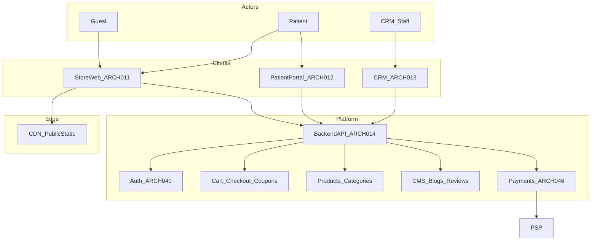
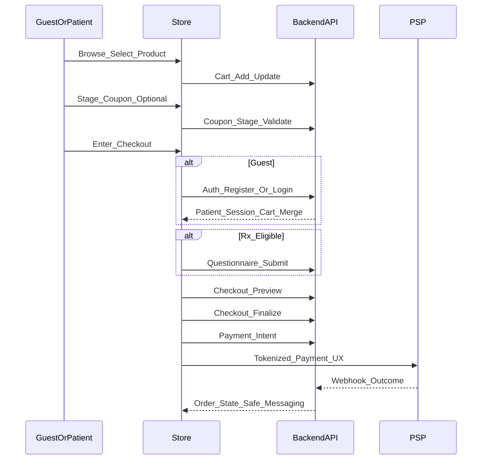
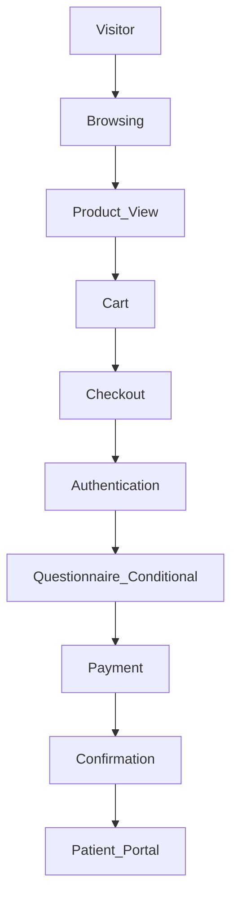

# 16 — Store Architecture

| Field | Value |
| --- | --- |
| Document | Store Architecture |
| Product | Clinexa |
| Version | 1.0 |
| Status | Approved — Implementation Ready |
| Primary market | United States |
| Audience | Principal Frontend Architecture, Enterprise E-Commerce Architecture, React Application Architecture, Healthcare SaaS Architecture, Frontend Engineering, Product, QA, Security |
| Source of truth | [00 — Product Requirements Document](00-product-requirements-document.md) |
| Related docs | [01 — Project overview](01-project-overview.md), [02 — Business requirements](02-business-requirements.md), [03 — Functional requirements](03-functional-requirements.md), [04 — Non-functional requirements](04-non-functional-requirements.md), [05 — System architecture](05-system-architecture.md), [06 — User personas](06-user-personas.md), [07 — User journeys](07-user-journeys.md), [08 — Role permissions](08-role-permissions.md), [09 — Feature roadmap](09-feature-roadmap.md), [10 — Database design](10-database-design.md), [11 — API design](11-api-design.md), [12 — Authentication flow](12-authentication-flow.md), [13 — Security](13-security.md), [14 — Notifications](14-notifications.md), [15 — Payment flow](15-payment-flow.md) |

This document is the **authoritative Store (public commerce client) architecture** for Clinexa Version 1. It defines public storefront responsibilities, module boundaries, navigation and discovery architecture, shopping experience, logical frontend state ownership, API integration surfaces, and storefront performance, SEO, accessibility, and security posture—without prescribing frameworks, component libraries, styling systems, or application source code.

It expands [PRD §7.2](00-product-requirements-document.md) (Store Web Application), [PRD §8](00-product-requirements-document.md) store-facing capabilities, [PRD §9](00-product-requirements-document.md) guest and purchase journeys, [PRD §12.1](00-product-requirements-document.md)/[§12.4](00-product-requirements-document.md)/[§12.5](00-product-requirements-document.md)/[§12.10](00-product-requirements-document.md), [03](03-functional-requirements.md) `FR-STO-*` / `FR-PRD-*` / `FR-CAT-*` / `FR-CART-*` / `FR-CHK-*` / `FR-SRCH-001` / `FR-BLG-*` / `FR-CMS-*` / `FR-REV-*` / `FR-CPN-*` / `FR-QST-*` / `FR-AUTH-*`, [05](05-system-architecture.md) `ARCH-011` / `ARCH-004`, [11](11-api-design.md) Store consumer APIs, [12](12-authentication-flow.md), [13](13-security.md), and [15](15-payment-flow.md) payment handoff.

It does **not** redefine functional module behavior ([03](03-functional-requirements.md)), journey step narrative ([07](07-user-journeys.md)), API path catalogs ([11](11-api-design.md)), database schemas ([10](10-database-design.md)), authentication sequences ([12](12-authentication-flow.md)), security control catalogs ([13](13-security.md)), notification event catalogs ([14](14-notifications.md)), or payment lifecycle and merchant timing ([15](15-payment-flow.md)). Those documents remain authoritative for their topics; this document owns Store client architecture and the `STORE-*` control catalog.

> **Compliance posture:** Store handles **published** catalog and content (CDN-safe when designated) and auth/commerce entry into patient journeys. Clinical PHI and payment card PAN are not owned by Store clients. Patterns are **HIPAA-aware** and **PCI-aware** without claiming certification as V1 delivery gates (PRD §1.5; `NFR-065`).

> **Implementation independence:** `STORE-*` IDs are logical architecture controls. Framework choice, rendering runtime, component structure, styling, state libraries, and SDK selection are out of scope. No React, TypeScript, CSS, Tailwind, or framework-specific examples appear here.

---

## Table of contents

1. [Introduction](#1-introduction)
2. [Store Architecture Overview](#2-store-architecture-overview)
3. [Store Modules](#3-store-modules)
4. [Navigation Architecture](#4-navigation-architecture)
5. [Product Discovery](#5-product-discovery)
6. [Shopping Experience](#6-shopping-experience)
7. [Store State Management](#7-store-state-management)
8. [API Integration](#8-api-integration)
9. [Performance Strategy](#9-performance-strategy)
10. [SEO Strategy](#10-seo-strategy)
11. [Accessibility](#11-accessibility)
12. [Store Security](#12-store-security)
13. [Store Traceability Matrix](#13-store-traceability-matrix)
14. [Revision History](#14-revision-history)

---

## 1. Introduction

### 1.1 Purpose

Define a production-grade public Store architecture for Clinexa so that:

- Guests and patients can discover published treatments, categories, and content and enter the care-commerce loop (`BO-1`; `FR-STO-001`; `ARCH-011`).
- Catalog, content, cart, checkout gates, coupons, reviews display, and auth entry behave as thin clients of one Backend API (`ARCH-003`, `ARCH-004`).
- Authentication is required before checkout finalize; guests may browse and cart but cannot finalize payment (`FR-CHK-001`; `PERM-CHK-002`; `PAY-145`).
- Rx-eligible purchase paths surface questionnaires before finalize (`FR-QST-003`; `OR-01`).
- Payment handoff remains PCI-aware and fail-safe; Store messaging never equates payment success with clinical approval or dispensing (`FR-STO-006`; `OR-03`; [15](15-payment-flow.md)).
- SEO, accessibility, and performance targets for Store browse, intake, and checkout are architecturally accountable (`NFR-001`, `NFR-005`, `NFR-091`, `NFR-103`–`111`).
- Module boundaries prevent Store from owning CRM clinical ops, Portal self-service, inventory truth, or coupon/CMS authoring.

### 1.2 Scope

#### In scope (V1)

| Area | Coverage |
| --- | --- |
| Store Web client | Public discovery, SEO rendering, commerce entry (`ARCH-011`) |
| Modules | Home, catalog, product details, categories, search, reviews display, cart, checkout, coupons, auth entry, blog, FAQ/CMS pages, Contact/Legal as CMS pages |
| Purchase-path intake | Questionnaire UX on Store for Rx-eligible finalize (`FR-QST-*`) |
| Payment handoff UX | Intent initiation via API; no PAN on platform (`FR-PAY-001`; `PAY-031`) |
| Logical FE state | Catalog, cart, user, session, search, coupons, checkout, temporary UI |
| API consumption | Published catalog/content, cart, checkout, auth, reviews, coupons, QST, payment intents |
| Qualities | Performance, SEO, accessibility, storefront security posture |
| Traceability | Business → Functional → Store modules → API → Auth → Database |

#### Out of scope

| Area | Deferred to / note |
| --- | --- |
| Patient Portal self-service | Orders history, subscriptions manage/cancel, documents, appointments, tickets (`ARCH-012`) |
| CRM authoring / clinical ops | Catalog publish, CMS/blog authoring, coupon create, review moderation, consult queues (`ARCH-013`) |
| Native mobile Store app | Out of V1 (PRD §11; `NFR-102`) |
| Guest checkout finalize without account | Future only if PRD revised (FR-CHK Future Enhancements) |
| Wishlists / saved carts | Future (FR-CART Future Enhancements) |
| Personalization, advanced merchandising, filter/sort facet engines, recommendations | Future (FR-STO / FR-CAT / FR-SRCH Future Enhancements)—not invented as V1 Store FRs |
| Dedicated Contact form / ticket APIs on Store | Not in PRD; Contact/Legal are CMS content pages only |
| Named frameworks, SDKs, component libraries, styling systems | Implementation |
| Physical DB DDL / API path invention | [10](10-database-design.md) / [11](11-api-design.md) |

### 1.3 Audience

| Audience | Use of this document |
| --- | --- |
| Principal frontend / e-commerce architects | Store module and navigation boundaries |
| Healthcare SaaS architects | Clinical gate vs commerce UX separation (`OR-03`) |
| Frontend engineers | Client responsibilities, state ownership, API consumption |
| Product | Scope discipline vs Portal/CRM and future merchandising |
| QA | Journey coverage for browse, cart, checkout, SEO, a11y |
| Security | Route protection, XSS/CSRF, session, checkout finalize gates |
| Content / Marketing (planning) | How published CMS/blogs/SEO appear on Store |

### 1.4 References

| Document | Relevance |
| --- | --- |
| [00 — PRD](00-product-requirements-document.md) | Single source of truth; §7.2 Store; §8 store-facing; §9 journeys; §11 OOS; §12 NFRs |
| [01 — Project overview](01-project-overview.md) | Care-commerce loop; surface separation rationale |
| [02 — Business requirements](02-business-requirements.md) | `BO-1`, `BP-01`, `OR-01`/`03`/`09`/`13`/`14`, `AC-BR-*` |
| [03 — Functional requirements](03-functional-requirements.md) | `FR-STO-*`, catalog, cart, checkout, search, CMS, blogs, reviews, coupons, QST, auth |
| [04 — Non-functional requirements](04-non-functional-requirements.md) | Performance, a11y, SEO, reliability for Store |
| [05 — System architecture](05-system-architecture.md) | `ARCH-011`, thin clients, domain modules |
| [06 — User personas](06-user-personas.md) | `USER-001` Guest, `USER-002` Patient, Content/Marketing |
| [07 — User journeys](07-user-journeys.md) | `JRN-001`–`009`, `019`, `027`–`030` |
| [08 — Role permissions](08-role-permissions.md) | Guest vs Patient Store permissions |
| [09 — Feature roadmap](09-feature-roadmap.md) | `ROAD-004`–`009`, `022`–`024`; `MS-02` / `MS-08` |
| [10 — Database design](10-database-design.md) | Catalog, cart, order, CMS, review entities |
| [11 — API design](11-api-design.md) | Store consumer endpoint groups |
| [12 — Authentication flow](12-authentication-flow.md) | Store auth entry; guest vs patient |
| [13 — Security](13-security.md) | Store zone, XSS, CSRF, headers, CDN |
| [14 — Notifications](14-notifications.md) | Outcomes after Store journeys (worker-sent) |
| [15 — Payment flow](15-payment-flow.md) | Checkout money path; `PAY-030`–`039` |

### 1.5 Store Architecture Principles

| ID | Principle | Implication |
| --- | --- | --- |
| STORE-001 | Thin commerce client | Store must not embed divergent catalog, coupon, clinical, or payment business rules (`ARCH-004`) |
| STORE-002 | Published-only discovery | Guests and patients see only published catalog and content (`FR-PRD-003`, `FR-CAT-003`, `FR-CMS-002`) |
| STORE-003 | Auth before finalize | Guests may browse and cart; Patient authentication is required to finalize checkout (`FR-CHK-001`) |
| STORE-004 | Clinical honesty in UX | Payment success is never presented as clinical approval or dispensing (`FR-STO-006`, `OR-03`) |
| STORE-005 | Fail-safe commerce | Prefer failed checkout over unpaid inconsistent “completed” orders (`FR-CHK-004`, `NFR-037`) |
| STORE-006 | Graceful browse degradation | Non-critical failures (e.g., reviews) must not block catalog browse (`NFR-036`) |
| STORE-007 | SEO-first public pages | Category, product, and blog pages are indexable with editable metadata (`FR-STO-002`, `NFR-103`–`107`) |
| STORE-008 | Accessibility for core journeys | Browse, intake, and checkout align to WCAG 2.2 AA (`NFR-091`) |
| STORE-009 | One API, three clients | Store shares Backend API with Portal and CRM; surface-specific AuthZ (`ARCH-003`) |
| STORE-010 | No invented V1 merchandising | Filter/sort engines, recommendations, related/featured product systems are not V1 Store FRs |

---

## 2. Store Architecture Overview

### 2.1 Public storefront responsibilities

The Store Web Application (`ARCH-011`) is the public-facing **discovery and commerce entry point** for Clinexa. It serves guests (`USER-001` / `ROLE-001`) and registered patients (`USER-002` / `ROLE-002`).

| Responsibility | Store owns (UX) | Server owns (truth) |
| --- | --- | --- |
| Catalog browse / product detail | Rendering, navigation | Publish state, pricing, Rx flags (`FR-PRD-*`) |
| Categories / SEO landings | Page composition | Category config + SEO fields (`FR-CAT-*`, `FR-STO-002`) |
| Search | Query UI, results presentation | Published-only search (`FR-SRCH-001`) |
| CMS / blogs / FAQ | Render published pages and blocks | Authoring + publish in CRM (`FR-CMS-*`, `FR-BLG-*`) |
| Cart | Line UX, coupon stage UX | Validation, merge, publish checks (`FR-CART-*`) |
| Checkout | Address/shipping UX, gates UX | Auth, QST, coupon/price revalidation, order create (`FR-CHK-*`) |
| Auth entry | Register / sign-in / reset forms | Identity, sessions, lockout (`FR-AUTH-*`) |
| Questionnaire (purchase path) | Capture and submit answers | Definition versioning, validity (`FR-QST-*`) |
| Payment handoff | PSP tokenization UX entry | Intents, webhooks, states ([15](15-payment-flow.md)) |
| Reviews | Display approved; optional submit path | Moderation (`FR-REV-*`, `FR-STO-005`) |

**STORE-011** — Store is a presentation and journey orchestration client. All durable commerce and clinical decisions are enforced by the Backend API.

### 2.2 Relationship with Backend API

| Aspect | Architecture rule |
| --- | --- |
| Protocol | HTTPS to Backend API only (`ARCH-014`; `SEC-019`) |
| Domain authority | Catalog, cart, checkout, auth, QST, payments, orders, coupons, reviews |
| Forbidden | Direct DB access; PSP merchant secrets in Store; client-side clinical mutation |
| Messaging | API error and state responses drive UX; Store must not invent clinical outcomes |

**STORE-012** — Store communicates exclusively with the Backend API for domain operations. CDN may serve static assets and designated public cacheable content only (`ARCH-019`; `SEC-020`).

### 2.3 Relationship with Patient Portal

| Aspect | Store | Patient Portal |
| --- | --- | --- |
| Purpose | Public discovery and purchase entry | Authenticated self-service after purchase |
| Identity | Shared Patient identity (`AUTH-012`) | Same Patient; Guest has no Portal |
| Post-purchase | Confirmation + guidance; deep-link to Portal where appropriate | Orders, subscriptions, documents, tickets, prefs |
| Non-ownership | Store does not own order history management UI | Portal does not own public SEO catalog |

**STORE-013** — After successful payment initiation outcomes, ongoing self-service belongs to Patient Portal (`ARCH-012`), not Store.

### 2.4 Relationship with CRM

| Aspect | CRM | Store |
| --- | --- | --- |
| Catalog / CMS / blogs / coupons | Author, configure, publish | Consume published only |
| Reviews | Moderate approve/reject | Display approved |
| Clinical / inventory / ops | Own truth and queues | Never mutate |
| Access | Staff roles only | Guest/Patient denied CRM (`PERM-CRM-020`) |

**STORE-014** — Store never exposes CRM capabilities. Content and catalog changes appear only after publish (`OR-14`; `FR-CMS-002`).

### 2.5 Relationship with Authentication

| Aspect | Rule |
| --- | --- |
| Entry points | Register, sign-in, password reset on Store (`FR-STO-003`) |
| Registration | Creates Patient only; never staff (`FR-AUTH-001`) |
| Guest | Public browse/cart; no finalize (`AUTH-011`; `PERM-CHK-002`) |
| Cart continuity | Preserve/merge across auth (`FR-CART-004`; `API-059`) |
| Session | API-issued session/token; Store does not invent AuthZ |

**STORE-015** — Authentication entry on Store does not grant CRM access and does not bypass checkout finalize AuthZ.

### 2.6 Architecture diagram

### 2.7 Explicit non-ownership summary

| ID | Store must not |
| --- | --- |
| STORE-016 | Perform clinical approval or imply dispensing authority |
| STORE-017 | Mutate inventory truth from UI alone |
| STORE-018 | Author coupons, CMS, blogs, or catalog publish state |
| STORE-019 | Store or transmit raw card PAN |
| STORE-020 | Send notification emails from the client (`NTF-001`) |
| STORE-021 | Cache or CDN-serve PHI or authenticated private pages as public |

---

## 3. Store Modules

### 3.1 Module map

| ID | Module | MoSCoW | Primary FRs | Primary journeys |
| --- | --- | --- | --- | --- |
| STORE-030 | Home | Must | `FR-STO-001`, `FR-CMS-001`/`002` | `JRN-001`, `JRN-030` |
| STORE-031 | Product Catalog | Must | `FR-PRD-001`–`005`, `FR-STO-001` | `JRN-001` |
| STORE-032 | Product Details | Must | `FR-PRD-001`/`003`/`004`, `FR-STO-005` | `JRN-001`, `JRN-005` |
| STORE-033 | Categories | Must | `FR-CAT-001`–`004` | `JRN-001` |
| STORE-034 | Search | Must | `FR-SRCH-001`, `FR-SRCH-003` | `JRN-004` |
| STORE-035 | Reviews | Should | `FR-STO-005`, `FR-REV-001`–`003` | `JRN-001`, `JRN-028` |
| STORE-036 | Cart | Must | `FR-CART-001`–`004` | `JRN-006` |
| STORE-037 | Checkout | Must | `FR-CHK-001`–`005`, `FR-QST-003` | `JRN-007`, `JRN-008`, `JRN-009` |
| STORE-038 | Coupons | Should | `FR-CPN-001`–`003`, `FR-CART-003` | `JRN-027` |
| STORE-039 | Authentication Entry Points | Must | `FR-STO-003`, `FR-AUTH-001`–`006` | `JRN-002`, `JRN-003` |
| STORE-040 | Blog | Should | `FR-BLG-001`–`004` | `JRN-029` |
| STORE-041 | FAQ | Should | `FR-CMS-001`/`002` | `JRN-030` |
| STORE-042 | Contact | Should (CMS page) | `FR-CMS-001`/`002` | `JRN-030` |
| STORE-043 | Legal Pages | Should (CMS page) | `FR-CMS-001`/`002` | `JRN-030` |
| STORE-044 | Questionnaire (purchase path) | Must | `FR-QST-001`–`005` | `JRN-008` |

### 3.2 Home

**Responsibilities:** Landing composition for discovery; surface published CMS banners and content blocks; navigate into categories, featured CMS promotions, search, and auth.

**Boundaries:** Home does not hard-code demo clinical verticals as product identity (`FR-CAT-004`; `FR-PRD-005` seed data only). Merchandising beyond CMS blocks is not a V1 personalized engine (`STORE-010`).

### 3.3 Product Catalog

**Responsibilities:** List published products for guests and patients; present pricing, media, and Rx-eligibility indicators as returned by API; support pagination for catalog reads.

**Boundaries:** Unpublished products are not discoverable or purchasable (`FR-PRD-003`). Catalog configuration is CRM-owned (`FR-PRD-002`).

### 3.4 Product Details

**Responsibilities:** Render product/variant detail, media, SEO metadata, Rx indicators, moderated reviews (when available), and entry to cart / purchase path.

**Boundaries:** Does not compute clinical eligibility beyond API fields; does not display unmoderated reviews (`FR-STO-005`).

### 3.5 Categories

**Responsibilities:** Render published category taxonomy and SEO category landing pages (`FR-CAT-003`).

**Boundaries:** Demo categories (Weight Management, Hair Loss, Men's Health, Skincare) are seed data, not irreversible architecture (`FR-CAT-004`; PRD §17.6).

### 3.6 Search

**Responsibilities:** Store search over published products and content; present paginated results; empty results without leaking internal IDs (`FR-SRCH-001`).

**Boundaries:** CRM search (`FR-SRCH-002`) is out of Store. No patient PHI in patient-facing search (`FR-SRCH-003`).

### 3.7 Reviews

**Responsibilities:** Display approved public reviews on product surfaces; allow eligible patients to submit reviews via API when product rules permit.

**Boundaries:** Moderation is CRM-owned (`FR-REV-002`/`003`). Review outage must not block browse (`NFR-036`; `STORE-006`).

### 3.8 Cart

**Responsibilities:** Add/update/remove lines for guests and patients; stage coupon for later validation; preserve/merge across auth.

**Boundaries:** Cart is not an order (`FR-CART-*`). Stale unpublished SKUs are blocked/removed by API validation (`FR-CART-002`). Empty cart cannot checkout.

### 3.9 Checkout

**Responsibilities:** Collect shipping/address fields as modeled; enforce auth and questionnaire gates in UX aligned to API; preview totals; finalize; hand off payment; show confirmation with clinical-honesty messaging.

**Boundaries:** Finalize is Patient-only (`PERM-CHK-002`). Order create follows payment success rules and fail-safe (`FR-CHK-004`). Rx → `awaiting_clinical_review`; non-Rx → `awaiting_fulfillment` after payment success rules (`FR-CHK-005`).

### 3.10 Coupons

**Responsibilities:** Coupon code entry and staged application UX; surface validation errors from server.

**Boundaries:** Server-side validation at checkout (`FR-CPN-002`). Authoring and redemption recording are not Store-owned. V1 single coupon unless configured otherwise (FRS).

### 3.11 Authentication Entry Points

**Responsibilities:** Registration, sign-in, password reset request/confirm entry; session awareness; cart merge prompts/flows after auth.

**Boundaries:** No staff account creation; no CRM access (`FR-STO-003`). Lockout and abuse protections are API-enforced (`FR-AUTH-006`).

### 3.12 Blog

**Responsibilities:** List and detail published blog posts with SEO metadata (`FR-BLG-002`).

**Boundaries:** Drafts are non-public (`FR-BLG-003`). Authoring is CRM Content/Admin (`FR-BLG-001`).

### 3.13 FAQ

**Responsibilities:** Render published FAQ pages/blocks managed via CMS (`FR-CMS-001`).

**Boundaries:** FAQ content is configuration, not hard-coded product features. No separate FAQ authoring module on Store.

### 3.14 Contact

**Responsibilities:** Render a published CMS **Contact** content page when configured (`FR-CMS-002`).

**Boundaries:** **STORE-045** — V1 does not invent a Store contact-form submission API, support-ticket creation from Store, or chat widget product feature. Support tickets remain Portal/CRM capabilities per PRD. Contact is a content surface only unless the PRD is revised.

### 3.15 Legal Pages

**Responsibilities:** Render published CMS pages for legal/informational content (e.g., terms, privacy) when configured via CRM CMS.

**Boundaries:** **STORE-046** — Legal pages are CMS content pages, not a separate legal-engine module. This document does not prescribe legal copy or compliance attestations.

### 3.16 Purchase-path Questionnaire (cross-cutting)

**Responsibilities:** Present bound questionnaire definitions; capture answers; submit before Rx-eligible finalize (`FR-QST-003`; `OR-01`).

**Boundaries:** Definitions and versioning are server/CRM-configured. Clinician consumption is CRM; patient status visibility spans Store path and Portal as defined in FRS—not unconstrained clinical edit on Store.

---

## 4. Navigation Architecture

### 4.1 Navigation principles

| ID | Principle |
| --- | --- |
| STORE-050 | Primary navigation emphasizes discovery: categories, search, and key CMS destinations |
| STORE-051 | Guest vs Patient user navigation differs by auth state (sign-in vs account/Portal entry) |
| STORE-052 | Cart is globally reachable from header without implying checkout finalize |
| STORE-053 | Breadcrumbs support category → product and content hierarchy for orientation and SEO |
| STORE-054 | Mobile navigation preserves the same destinations with operable keyboard and focus order (`NFR-095`, `NFR-101`) |
| STORE-055 | Navigation never links guests into CRM or private Portal routes without AuthZ |

### 4.2 Header

Contains brand/home entry, primary navigation, search entry, cart access, and user navigation (sign-in/register or authenticated account affordances). Must remain usable at ≥ 375 px width (`NFR-101`).

### 4.3 Footer

Contains secondary destinations: blog, FAQ, Contact/Legal CMS pages (when published), and other configured CMS links. Footer must not expose staff tools.

### 4.4 Primary Navigation

Category-oriented discovery into published taxonomy (`FR-CAT-003`), plus search and commerce entry. Demo category names are data-driven, not hard-wired navigation architecture (`FR-CAT-004`).

### 4.5 Mobile Navigation

Same information architecture as desktop; focus-visible and keyboard operable (`NFR-095`). Avoid pointer-only traps on core journeys (`NFR-091`).

### 4.6 Breadcrumbs

Used on category, product, and content detail surfaces to reinforce hierarchy and support crawlable structure aligned with SEO landings (`STORE-007`).

### 4.7 Search

Global search entry routes to Store search results for published products and content (`FR-SRCH-001`). Search is not CRM search.

### 4.8 Product Navigation

From category listings and search results into product details; variant selection remains within product detail / cart flows without inventing a separate configurator product.

### 4.9 User Navigation

| State | Affordances |
| --- | --- |
| Guest | Register, sign-in, password reset entry; cart |
| Patient | Session-aware account entry; cart; deep-link to Patient Portal for self-service (Portal-owned features) |
| Staff via Store login | Must not receive CRM UI on Store; CRM is a separate surface (`FR-STO-003`) |

---

## 5. Product Discovery

### 5.1 V1 discovery model

**STORE-060** — V1 product discovery is composed of browsing published categories and products, Store search, SEO landing pages, CMS promotional blocks, and moderated reviews as trust signals. It does not include a personalization or facet-merchandising engine.

| Capability | V1 status | References |
| --- | --- | --- |
| Browsing | Must | `FR-STO-001`, `FR-PRD-003`, `FR-CAT-003`, `JRN-001` |
| Search | Must | `FR-SRCH-001`, `JRN-004`, `NFR-007` |
| SEO landings | Must | `FR-STO-002`, `NFR-103`–`107` |
| CMS banners/blocks | Should | `FR-CMS-001`/`002`, `JRN-030` |
| Moderated reviews | Should | `FR-STO-005`, `FR-REV-*` |

### 5.2 Browsing

Guests and patients navigate published categories and product lists. Unpublished items are absent from listings and detail for unauthenticated/public consumers. Pagination applies to list endpoints (API allowlists; `NFR-115` at API layer).

### 5.3 Filtering

**STORE-061** — Dedicated Store merchandising filters (price facets, Rx-only toggles, multi-facet engines) are **not** V1 functional requirements. API list endpoints may apply server allowlisted query parameters for safe listing; that is not a Store facet UX product. Future: FR-STO / FR-CAT Future Enhancements (personalized/advanced merchandising).

### 5.4 Sorting

**STORE-062** — Dedicated Store sort merchandising controls (price, popularity, newest) are **not** V1 Store FRs. Any sort parameters accepted by APIs must be allowlisted (`NFR-115`) and must not invent a Store sort product beyond published list behavior.

### 5.5 Search

Query → published-only filter → paginated results for products and content (`FR-SRCH-001`). Misses return empty results without internal ID leakage. Search must meet latency budgets (`NFR-001`, `NFR-007`).

### 5.6 Product Recommendations

**STORE-063** — Personalized or algorithmic product recommendations are **not** V1 requirements (FR-STO Future Enhancements: personalization and advanced merchandising).

### 5.7 Related Products

**STORE-064** — Related-product carousels as a distinct merchandising system are **not** V1 requirements. Category co-listing and CMS editorial blocks may juxtapose products without inventing a relatedness engine.

### 5.8 Featured Products

**STORE-065** — Featured products as an automated ranking system are **not** V1 requirements. Home/category CMS banners and content blocks may editorially highlight offerings when published (`FR-CMS-001`).

---

## 6. Shopping Experience

### 6.1 End-to-end flow

### 6.2 Product Selection

**STORE-070** — Selection adds published variants/SKUs to cart (`FR-CART-001`/`002`). Rx-eligible lines may sit in cart; questionnaire is enforced at finalize (`FR-CHK-002`).

### 6.3 Cart Management

**STORE-071** — Guests and patients manage lines; coupons may be staged (`FR-CART-003`); cart merge on auth (`FR-CART-004`). Cart ≠ order.

### 6.4 Coupon Flow

**STORE-072** — Stage on cart; revalidate server-side at checkout (`FR-CPN-002`); redemption recorded on successful payment (`FR-CPN-003`). Invalid/expired/limit/out-of-scope fail closed.

### 6.5 Checkout Entry

**STORE-073** — Guests or patients may start checkout (`PERM-CHK-001`). Preview revalidates without creating an order (`API-060`). Empty cart cannot proceed.

### 6.6 Authentication Requirements

**STORE-074** — Finalize requires authenticated Patient (`FR-CHK-001`; `PERM-CHK-002`; `PAY-145`). Mid-flow register/login merges cart. Staff accounts are not created via Store registration.

### 6.7 Payment Handoff

**STORE-075** — After finalize gates, Store initiates payment intent UX via API (`API-062`; `PAY-031`). No raw PAN on platform (`FR-PAY-001`). Merchant timing and states are owned by [15](15-payment-flow.md) (Authorize → Clinical Review → Capture → Fulfillment). Store UX reflects outcome messaging only.

| Payment path refs | Meaning for Store |
| --- | --- |
| `PAY-030` | Authenticated finalize with gates |
| `PAY-031` | Intent created; tokenization |
| `PAY-032` | Authorize; leave payment pending as modeled |
| `PAY-037`–`038` | Non-Rx money path; skip clinical states |
| `PAY-039` | Auth failed; no paid completed order; fail-safe |

### 6.8 Order Confirmation

**STORE-076** — Confirmation communicates order created / payment outcome without claiming clinical approval or dispensed medication (`FR-STO-006`; `OR-03`). Rx orders enter clinical review messaging; non-Rx enter fulfillment messaging (`FR-CHK-005`). Further status detail is Portal/CRM as applicable. Notifications are worker-sent (`NTF-031`, `NTF-036`–`039`), not client-sent.

---

## 7. Store State Management

### 7.1 Logical state domains

Implementation-agnostic ownership. No framework or library is prescribed.

| ID | Domain | Source of truth | Lifecycle |
| --- | --- | --- | --- |
| STORE-080 | Catalog | Backend published catalog APIs | Cacheable reads; invalidate on navigation/refetch; never treat client cache as publish authority |
| STORE-081 | Cart | Backend cart APIs; guest cart token/cookie as modeled | Create/update on line changes; merge on auth; discard stale unpublished lines per API |
| STORE-082 | User | Auth session/profile summary from API | Established on login/register; cleared on logout/expiry |
| STORE-083 | Session | API-issued session/token | Timeouts and revocation per Auth/Security docs |
| STORE-084 | Search | Ephemeral query + results | Request-scoped; no PHI retention in client stores |
| STORE-085 | Filters | Ephemeral UI/query params only | No V1 facet engine; do not invent durable filter profiles |
| STORE-086 | Coupons | Staged code + server validation result | Cleared on remove/invalid; revalidated at checkout |
| STORE-087 | Checkout | Preview totals, gate status, finalize result | Short-lived; fail-safe on errors; Idempotency-Key for finalize |
| STORE-088 | Temporary UI | Modals, toasts, focus, form dirty flags | Client-local; never substitute for server validation |

### 7.2 Ownership rules

| Rule | ID |
| --- | --- |
| Prices, publish state, coupon validity, and clinical gates are never trusted from client-only state | STORE-089 |
| Guest cart identity is opaque and bound per Auth/API policy | STORE-090 |
| Checkout finalize and payment intent mutations are authenticated Patient operations | STORE-091 |
| Temporary UI state must not persist PHI beyond session needs for intake forms in flight | STORE-092 |

---

## 8. API Integration

### 8.1 Integration principles

| ID | Principle |
| --- | --- |
| STORE-100 | Consume only documented Store-facing APIs from [11](11-api-design.md) |
| STORE-101 | Public reads for published catalog/content; authenticated writes for finalize, pay, QST, review submit |
| STORE-102 | Surface stable `ERR-*` codes to UX; do not invent clinical meanings |
| STORE-103 | Use Idempotency-Key on checkout finalize / payment intent as required (`PAY-106`; `NFR-033`/`118`) |

### 8.2 Product APIs

| APIs | Use on Store |
| --- | --- |
| `API-018` GET `/products` | Catalog listings (published) |
| `API-019` GET `/products/{slug}` | Product detail + SEO |
| `API-020` GET `/products/{id}` | Published-only for unauth as specified |
| `API-031`–`032` Categories | Category list and slug detail |
| `API-038` GET `/search` | Store search published products/content |
| `API-077`–`078` Subscription plans | Published plan reads on commerce path |

Admin product/category mutations remain CRM (`API-021`–`037` not Store).

### 8.3 Cart APIs

| APIs | Use |
| --- | --- |
| `API-053` GET `/cart` | Load cart (guest token or patient) |
| `API-054` POST `/cart/items` | Add line |
| `API-055` PATCH `/cart/items/{itemId}` | Update line |
| `API-056` DELETE `/cart/items/{itemId}` | Remove line |
| `API-057` / `API-058` Coupon stage/remove | Cart coupon staging |
| `API-059` POST `/cart/merge` | Post-auth merge (Patient) |

### 8.4 Checkout APIs

| APIs | Use |
| --- | --- |
| `API-060` POST `/checkout/preview` | Revalidate totals; no order |
| `API-061` POST `/checkout` | Patient finalize; gates; fail-safe; Idempotency-Key |

### 8.5 Review APIs

| APIs | Use |
| --- | --- |
| `API-137` GET `/products/{slug}/reviews` | Approved reviews for guests/patients |
| `API-138` POST `/reviews` | Patient submit (moderation pending) |

### 8.6 Coupon APIs

| APIs | Use |
| --- | --- |
| `API-142` POST `/coupons/validate` | Validate staged coupon |
| Cart coupon endpoints | Stage/remove as above |

### 8.7 Authentication APIs

| APIs | Use |
| --- | --- |
| `API-003` Register | Guest → Patient; optional cart merge |
| `API-004` Login | Session; cart merge for patients |
| `API-005` Logout | End session |
| `API-006`/`007` Password reset | Request/confirm |
| `API-008` Session | Current session |

### 8.8 Content APIs

| APIs | Use |
| --- | --- |
| `API-148`–`149` CMS pages | FAQ, Contact, Legal, other published pages |
| `API-155`–`156` Blog posts | Published blog list/detail |

### 8.9 Purchase-path Questionnaire APIs

Store consumes the purchase-path subset: bindings and patient intake submit endpoints as defined in [11](11-api-design.md) §6.8 (`API-040`–`045` as applicable). Required before Rx finalize (`FR-QST-003`).

### 8.10 Payments APIs (handoff)

| APIs | Use |
| --- | --- |
| `API-062` Payment intents | Create intent after finalize gates |
| `API-063` Payment status | Patient-scoped read |
| `API-064`–`066` Payment methods | Saved methods as Patient-scoped |

Webhook handling is Backend-owned, not Store.

---

## 9. Performance Strategy

Implementation-independent. Targets from [04](04-non-functional-requirements.md).

| ID | Strategy | NFR / note |
| --- | --- | --- |
| STORE-110 | Prioritize browse/search read latency and perceived LCP on catalog pages | `NFR-001`, `NFR-005`, `NFR-007` |
| STORE-111 | Lazy load non-critical below-fold media and non-blocking modules (e.g., reviews) | Supports `NFR-005`, `NFR-036` |
| STORE-112 | Image optimization via appropriately sized media refs and CDN delivery | `NFR-023`, `NFR-133`, `NFR-022` |
| STORE-113 | Search optimization: debounce/throttle UX only; server owns query performance | `NFR-007` |
| STORE-114 | Pagination for catalog and search lists; no unbounded client dumps | Align with API pagination |
| STORE-115 | Cache published catalog/content responses and static assets per cache policy; never cache PHI | `SEC-020`, `SEC-025` |
| STORE-116 | Rendering strategy must yield indexable HTML for category/product/blog primary content | `NFR-103`, `NFR-111` |
| STORE-117 | Asset optimization: minimize critical path weight without sacrificing a11y/SEO budgets | `NFR-005`, `NFR-111` |
| STORE-118 | Checkout finalize platform path p95 &lt; 2 s excluding PSP | `NFR-009` |
| STORE-119 | Reviews failure degrades; checkout fails safe | `NFR-036`, `NFR-037` |

---

## 10. SEO Strategy

| ID | Control | References |
| --- | --- | --- |
| STORE-120 | Metadata | Editable title, description from CRM/CMS fields on category/product/blog (`FR-STO-002`, `NFR-104`) |
| STORE-121 | Canonical URLs | Self-referencing or preferred canonicals (`NFR-107`) |
| STORE-122 | Structured Data readiness | JSON-LD for products/articles when content model supports (`NFR-109` Should) |
| STORE-123 | Sitemap | Published Store URLs in sitemap (`NFR-105`) |
| STORE-124 | Robots | Intentional `robots.txt`; no accidental prod block of indexable paths (`NFR-106`) |
| STORE-125 | Open Graph readiness | `og:title`, `og:description`, `og:url` (image when available) (`NFR-108` Should) |
| STORE-126 | Product indexing | Category, product, blog pages crawlable; published-only (`NFR-103`, `FR-PRD-003`) |
| STORE-127 | No cloaking / doorway tactics | Same primary content for users and bots (`NFR-110`) |
| STORE-128 | SEO must not break performance budgets | Joint check vs `NFR-005` (`NFR-111`) |

**STORE-129** — Slugs and SEO fields are configuration-driven, not hard-coded per demo vertical.

---

## 11. Accessibility

Reference [04](04-non-functional-requirements.md) §11 and PRD §12.4.

| ID | Area | Requirement |
| --- | --- | --- |
| STORE-130 | Keyboard support | Core journeys operable without pointer-only traps; logical focus order (`NFR-091`, `NFR-095`) |
| STORE-131 | Screen readers | Labels, errors, and status for intake/checkout (`NFR-096` Should) |
| STORE-132 | Form accessibility | Visible labels, associated errors, accessible auth/QST/checkout forms |
| STORE-133 | Product accessibility | Product name, price, Rx indicators, and media alternatives convey meaning without color alone |
| STORE-134 | Error messaging | Field and gate errors from API presented accessibly; no silent finalize failures |
| STORE-135 | Responsive behavior | Usable at ≥ 375 px; mobile web browsers per `NFR-098`/`101` |
| STORE-136 | Contrast and focus | AA contrast; visible focus (`NFR-094`, `NFR-095`) |

**STORE-137** — Accessibility applies to browse, questionnaire intake, and checkout as first-class Store quality attributes—not post-launch polish only.

---

## 12. Store Security

Cross-reference [12](12-authentication-flow.md) and [13](13-security.md).

| ID | Area | Control |
| --- | --- | --- |
| STORE-140 | Route protection | Public routes for published browse/content; authenticated routes for finalize, pay, QST submit, review submit |
| STORE-141 | Checkout protection | Patient-only finalize; server revalidation; fail-safe (`FR-CHK-001`–`004`; `PERM-CHK-002`) |
| STORE-142 | Input validation | Client assists UX; server validation is authoritative (`SEC-040`) |
| STORE-143 | XSS awareness | Output encoding on Store-rendered catalog/CMS/user-influenced content (`SEC-041`; `NFR-051`) |
| STORE-144 | CSRF considerations | If cookie-based sessions, CSRF protections per `SEC-044` / `AUTH-039` |
| STORE-145 | Session handling | Secure session/token handling; logout; expiry denies finalize; lockout honored |
| STORE-146 | File upload considerations | V1 Store does not invent a general file-upload product surface; media is catalog/CMS-published via CRM/object storage |
| STORE-147 | Secure API communication | HTTPS only to `/v1`; no secrets in CDN/public bundles (`SEC-019`, `SEC-035`) |
| STORE-148 | Security headers | CSP and security headers on Store (`SEC-045`/`048`; `NFR-053`) |
| STORE-149 | Rate limits | Respect API rate limits on public writes (auth, reviews) (`SEC-052`; `NFR-052`) |
| STORE-150 | PCI-aware handoff | Tokenization via PSP; never handle raw PAN (`SEC-064`; `FR-PAY-001`) |
| STORE-151 | Isolation | Patient cannot access other patients' data; Guest has no PHI Portal (`FR-AUTH-005`; `OR-06`) |

---

## 13. Store Traceability Matrix

### 13.1 Business → Functional → Store → API → Auth → Database

| Business | Functional | Store module / control | API | Auth / PERM | Database |
| --- | --- | --- | --- | --- | --- |
| `BO-1`, `BP-01`, `AC-BR-01` | `FR-STO-001`–`004`, `FR-PRD-*`, `FR-CAT-*` | STORE-030–033, STORE-060 | `API-018`–`020`, `031`–`032` | Guest/Patient view published | `DB-010`–`014` |
| `BO-1`, `JRN-004` | `FR-SRCH-001`/`003` | STORE-034, STORE-060 | `API-038` | Public search; no PHI | Published catalog/content indexes |
| `BP-01`, `OR-01`, `AC-BR-01` | `FR-QST-003`, `FR-CHK-002` | STORE-044, STORE-074 | `API-040`–`045`, `API-061` | `PERM-QST-001`, Patient | `DB-017`–`020`, `DB-035`–`036` |
| `BP-01`, `AC-BR-08` | `FR-AUTH-001`–`006`, `FR-STO-003` | STORE-039, STORE-015 | `API-003`–`008` | `PERM-AUTH-*` | `DB-001`, `DB-005`–`008` |
| `BP-01`, `JRN-006` | `FR-CART-001`–`004` | STORE-036, STORE-071 | `API-053`–`059` | `PERM-CART-001`/`002` | `DB-022`–`023` |
| `BP-01`, `OR-03`, `AC-BR-09` | `FR-CHK-001`–`005`, `FR-PAY-001` | STORE-037, STORE-075–076 | `API-060`–`062` | `PERM-CHK-002`, `PERM-PAY-001` | `DB-026`–`028` |
| `OR-09`, `AC-BR-07` | `FR-CHK-005`, `FR-PRD-004` | STORE-076 | `API-061` | Patient | `DB-026`–`027` |
| `OR-13`, `AC-BR-12` | `FR-REV-001`–`003`, `FR-STO-005` | STORE-035 | `API-137`–`138` | `PERM-REV-001` (submit) | `DB-053` |
| Coupons Should | `FR-CPN-001`–`003` | STORE-038, STORE-072 | `API-057`/`058`, `API-142` | `PERM-CPN-002` redeem | `DB-024`–`025` |
| `BP-11`, `AC-BR-13` | `FR-CMS-001`–`003`, `FR-BLG-*` | STORE-040–043 | `API-148`–`149`, `155`–`156` | Public read published | `DB-050`–`052` |
| `OR-14`, `AC-BR-05` | `FR-PRD-002`, `FR-CAT-002` | STORE-014 (consume only) | CRM admin APIs | Staff CRM | Catalog entities |
| `OR-06` | `FR-AUTH-005`, `FR-SRCH-003` | STORE-151 | All patient APIs | Isolation | Patient-scoped rows |
| SEO / a11y / perf | `FR-STO-002` + NFRs | STORE-110–137 | Read APIs | Public | SEO fields on catalog/content |

### 13.2 Roadmap alignment

| ROAD | Store relevance | Milestone |
| --- | --- | --- |
| `ROAD-004` | Catalog / categories | MS-02 |
| `ROAD-005` | Questionnaires on purchase path | MS-02 |
| `ROAD-006` | Discovery, search, SEO | MS-02 |
| `ROAD-007` | Cart | MS-02 |
| `ROAD-008` | Checkout | MS-02 |
| `ROAD-009` | Payments handoff | MS-02 |
| `ROAD-022` | Coupons | May trail; polish |
| `ROAD-023` | Reviews | MS-08 |
| `ROAD-024` | CMS + blogs | MS-08 |

### 13.3 Journey → Store module map

| Journey | Store modules |
| --- | --- |
| `JRN-001` Guest discovers | Home, Categories, Catalog, Product Details, Reviews display |
| `JRN-002` Registration | Auth entry |
| `JRN-003` Login | Auth entry |
| `JRN-004` Search | Search |
| `JRN-005` Purchase | Product Details → Cart → Checkout |
| `JRN-006` Cart | Cart |
| `JRN-007` Checkout | Checkout, Auth, Coupons |
| `JRN-008` Questionnaire | Questionnaire |
| `JRN-009` Payment | Checkout payment handoff |
| `JRN-019` Subscription purchase | Catalog + Checkout |
| `JRN-027` Coupon | Coupons + Cart/Checkout |
| `JRN-028` Review | Reviews (+ Portal path as defined) |
| `JRN-029` Blog | Blog |
| `JRN-030` CMS browse | FAQ, Contact, Legal, Home blocks |

### 13.4 Responsibility matrix

| Concern | Store | Portal | CRM | Backend API |
| --- | --- | --- | --- | --- |
| Public SEO catalog | Render | — | Configure/publish | Enforce publish |
| Cart / checkout UX | Yes | — | — | Validate/finalize |
| Clinical approval | No | Status view | Yes | Enforce |
| CMS/blog authoring | No | — | Yes | Persist |
| Payment secrets / webhooks | No | — | Limited ops | Yes + PSP |
| Notification send | No | Prefs | — | Workers |

### 13.5 Store Ownership Matrix

Governance accountability for Store-adjacent delivery areas. Human/system RACI detail remains in [02](02-business-requirements.md); this matrix names primary planning owners for V1 storefront delivery.

| Store Area | Primary Owner | Supporting Teams |
| --- | --- | --- |
| Catalog Experience | Product + Store Frontend | Backend Catalog (`ARCH-042`/`043`), Content, QA |
| Product Pages | Store Frontend + Product | Backend Catalog, Content/SEO, QA |
| Search | Store Frontend + Backend Search | Product, QA |
| Cart | Store Frontend + Checkout domain (Backend) | Product, Security, QA |
| Checkout | Product + Checkout domain (Backend) | Store Frontend, Payments, Security, QA |
| CMS Rendering | Store Frontend + Content | Backend CMS (`ARCH-061`), Marketing, QA |
| SEO | Content + Store Frontend | Product, Backend, QA |
| Accessibility | Store Frontend + QA | Product, Security |
| Security | Security Architecture ([13](13-security.md)) | Store Frontend, Backend, Auth ([12](12-authentication-flow.md)), Compliance advisors |
| Analytics | Product + Analytics (as engaged) | Store Frontend, Marketing, Backend |

### 13.6 Store Journey State Diagram

This diagram summarizes the **public commerce lifecycle** on Store: discovery through payment confirmation, then handoff to Patient Portal for authenticated self-service. Authentication is required before checkout finalize (`FR-CHK-001`); the questionnaire step applies when the cart contains Rx-eligible lines (`FR-QST-003`; `OR-01`). Payment success is never clinical approval (`FR-STO-006`; `OR-03`).

### 13.7 Module Dependency Matrix

Logical Store module dependencies for V1. “Depends On” means the module requires those capabilities or APIs to fulfill its responsibilities; it does not invent new product features.

| Module | Depends On |
| --- | --- |
| Home | CMS Rendering, Catalog, Categories, Navigation, Search entry |
| Catalog | Categories, Product APIs (`API-018`–`020`), SEO metadata |
| Product Details | Catalog, Product APIs, Reviews display, Cart entry |
| Search | Product Catalog, CMS/Blog published content, Search API (`API-038`) |
| Cart | Product Details / Catalog variants, Cart APIs, Coupons (optional stage) |
| Checkout | Cart, Authentication, Coupons (revalidation), Questionnaire (Rx-conditional), Payment handoff |
| Authentication | Auth APIs (`API-003`–`008`), Cart merge (`API-059`) |
| Payment | Checkout finalize, Payments APIs (`API-062`+), PSP tokenization UX ([15](15-payment-flow.md)) |
| CMS | CMS page/block APIs (`API-148`–`149`), published-only rules |
| Blog | Blog APIs (`API-155`–`156`), SEO metadata |
| Reviews | Product Details, Reviews APIs (`API-137`–`138`); submit requires Authentication |
| Coupons | Cart staging and/or Checkout validation APIs (`API-057`/`058`, `API-142`) |

### 13.8 Rendering Responsibility Matrix

Page-level rendering, SEO, auth, and public-cache eligibility for Store. Public cache eligibility applies only to **published**, non-PHI, designated-public responses (`SEC-020`, `SEC-025`); authenticated or cart/checkout state must never be treated as anonymously CDN-cacheable.

| Store Page | SEO Critical | Authentication Required | Public Cache Eligible |
| --- | --- | --- | --- |
| Home | Yes | No | Yes (published CMS/catalog composition) |
| Category | Yes | No | Yes (published) |
| Product | Yes | No | Yes (published) |
| Search | No | No | No (query-specific dynamic results) |
| Blog | Yes | No | Yes (published) |
| FAQ | Yes | No | Yes (published CMS) |
| Contact | Yes | No | Yes (published CMS page) |
| Legal | Yes | No | Yes (published CMS page) |
| Cart | No | No | No |
| Checkout | No | Yes (finalize; Patient) | No |
| Authentication Pages | No | No (entry for unauthenticated users) | No |

### 13.9 Store Governance Matrix

Capability-level ownership across surfaces. Complements §13.4 (concern-level) and §13.5 (delivery-area owners).

| Capability | Store | Backend API | CRM | Patient Portal |
| --- | --- | --- | --- | --- |
| Catalog | Render published catalog/UX | Enforce publish, pricing, Rx flags | Configure / publish | — |
| Search | Store search UX | Execute published product/content search | CRM search (separate; RBAC) | — |
| Cart | Cart UX | Cart truth, validation, merge | — | — |
| Checkout | Checkout UX / gates UX | Auth + QST + revalidation + fail-safe finalize | — | — |
| Payments | Payment handoff UX | Intents, webhooks, states, no PAN | Refunds / ops as permitted | Saved methods / renewal visibility |
| Reviews | Display approved; submit entry | Persist; enforce moderation rules | Moderate approve/reject | Submit path as defined |
| CMS | Render published pages/blocks | Persist and serve published content | Author / publish | — |
| Coupons | Stage / apply UX | Validate and record redemptions | Author / configure | — |
| Questionnaires | Purchase-path capture UX | Validate, version, store responses | Configure definitions; clinical read | Status / related self-service views |

---

## 14. Revision History

| Version | Date | Author | Reviewer | Changes | Approval Status |
| --- | --- | --- | --- | --- | --- |
| 1.0 | 2026-07-24 | Principal Frontend / Enterprise E-Commerce / React Application / Healthcare SaaS Architect (planning) | Pending | Initial Store architecture: overview, modules (`STORE-030`–`046`), navigation, discovery (explicit non-V1 merchandising), shopping, state, API integration, performance/SEO/a11y/security, traceability (`STORE-001`–`STORE-151`) | Draft for review |
| 1.0 | 2026-07-24 | Principal Frontend / Enterprise E-Commerce / React Application / Healthcare SaaS Architect (planning) | Pending | Architectural appendices: §13.5 Store Ownership Matrix, §13.6 Store Journey State Diagram, §13.7 Module Dependency Matrix, §13.8 Rendering Responsibility Matrix, §13.9 Store Governance Matrix; status set to Approved — Implementation Ready | Approved — Implementation Ready |

---

## Related reading

- [00 — Product requirements document](00-product-requirements-document.md)
- [01 — Project overview](01-project-overview.md)
- [02 — Business requirements](02-business-requirements.md)
- [03 — Functional requirements](03-functional-requirements.md)
- [04 — Non-functional requirements](04-non-functional-requirements.md)
- [05 — System architecture](05-system-architecture.md)
- [07 — User journeys](07-user-journeys.md)
- [08 — Role permissions](08-role-permissions.md)
- [10 — Database design](10-database-design.md)
- [11 — API design](11-api-design.md)
- [12 — Authentication flow](12-authentication-flow.md)
- [13 — Security](13-security.md)
- [14 — Notifications](14-notifications.md)
- [15 — Payment flow](15-payment-flow.md)

---

## Document control

| Item | Value |
| --- | --- |
| Classification | Internal planning |
| Owner | Store / Frontend Architecture (planning) |
| Change rule | Do not invent Store product features beyond the PRD; keep aligned with docs 00–15; Contact/Legal remain CMS pages unless PRD revised |
| Implementation gate | Do not implement frameworks, components, styling, or SDKs from this document until it is approved |
| Next review | After stakeholder review of module boundaries, non-V1 merchandising exclusions, and CMS treatment of Contact/Legal |

*End of 16 — Store Architecture.*
