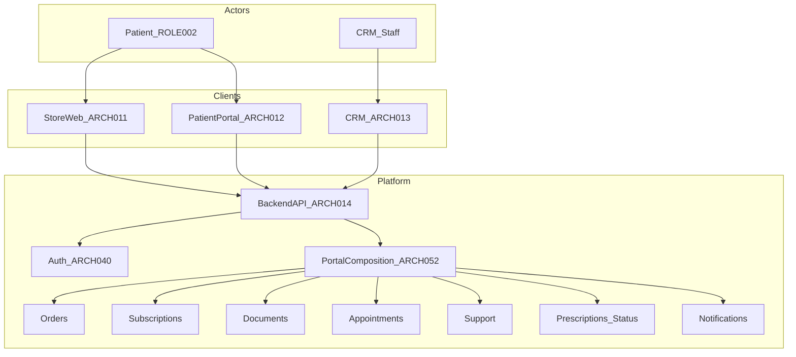
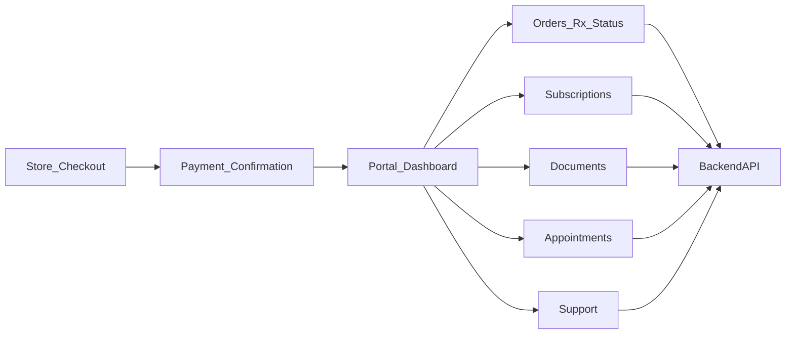
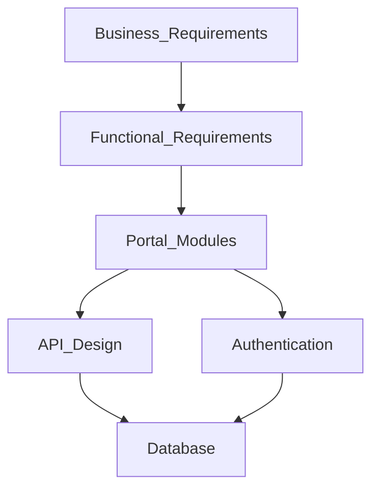
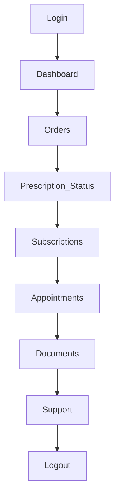

# 17 — Patient Portal

| Field | Value |
| --- | --- |
| Document | Patient Portal Architecture |
| Product | Clinexa |
| Version | 1.0 |
| Status | Approved — Implementation Ready |
| Primary market | United States |
| Audience | Principal Healthcare Solution Architecture, Enterprise Portal Architecture, Patient Experience Architecture, Enterprise Frontend Architecture, Frontend Engineering, Product, QA, Security |
| Source of truth | [00 — Product Requirements Document](00-product-requirements-document.md) |
| Related docs | [01 — Project overview](01-project-overview.md), [02 — Business requirements](02-business-requirements.md), [03 — Functional requirements](03-functional-requirements.md), [04 — Non-functional requirements](04-non-functional-requirements.md), [05 — System architecture](05-system-architecture.md), [06 — User personas](06-user-personas.md), [07 — User journeys](07-user-journeys.md), [08 — Role permissions](08-role-permissions.md), [09 — Feature roadmap](09-feature-roadmap.md), [10 — Database design](10-database-design.md), [11 — API design](11-api-design.md), [12 — Authentication flow](12-authentication-flow.md), [13 — Security](13-security.md), [14 — Notifications](14-notifications.md), [15 — Payment flow](15-payment-flow.md), [16 — Store architecture](16-store-architecture.md) |

This document is the **authoritative Patient Portal (authenticated self-service client) architecture** for Clinexa Version 1. It defines Portal responsibilities, module boundaries, navigation architecture, patient self-service capabilities, logical frontend state ownership, API integration surfaces, and Portal performance, accessibility, and security posture—without prescribing frameworks, component libraries, styling systems, or application source code.

It expands [PRD §7.3](00-product-requirements-document.md) (Patient Portal), [PRD §8](00-product-requirements-document.md) portal-facing capabilities, [PRD §9](00-product-requirements-document.md) continuity and self-service journeys, [PRD §12.1](00-product-requirements-document.md)/[§12.4](00-product-requirements-document.md)/[§12.10](00-product-requirements-document.md), [03](03-functional-requirements.md) `FR-PRT-*` and related `FR-ORD-*` / `FR-SUB-*` / `FR-DOC-*` / `FR-APT-*` / `FR-SUP-*` / `FR-QST-*` / `FR-NTF-*` / `FR-AUTH-*` / `FR-PAY-004`, [05](05-system-architecture.md) `ARCH-012` / `ARCH-052`, [11](11-api-design.md) Patient Portal consumer APIs, [12](12-authentication-flow.md), [13](13-security.md), [14](14-notifications.md), [15](15-payment-flow.md) Portal payment-method surfaces, and [16](16-store-architecture.md) Store↔Portal handoff (`STORE-013`).

It does **not** redefine functional module behavior ([03](03-functional-requirements.md)), journey step narrative ([07](07-user-journeys.md)), API path catalogs ([11](11-api-design.md)), database schemas ([10](10-database-design.md)), authentication sequences ([12](12-authentication-flow.md)), security control catalogs ([13](13-security.md)), notification event catalogs ([14](14-notifications.md)), payment lifecycle ([15](15-payment-flow.md)), or Store public commerce architecture ([16](16-store-architecture.md)). Those documents remain authoritative for their topics; this document owns Patient Portal client architecture and the `PORTAL-*` control catalog.

> **Compliance posture:** Portal handles **authenticated, patient-scoped** care-commerce self-service. Clinical PHI and payment card PAN are not owned as durable truths by Portal clients. Patterns are **HIPAA-aware** and **PCI-aware** without claiming certification as V1 delivery gates (PRD §1.5; `NFR-065`).

> **Implementation independence:** `PORTAL-*` IDs are logical architecture controls. Framework choice, rendering runtime, component structure, styling, state libraries, and SDK selection are out of scope. No React, TypeScript, CSS, Tailwind, or framework-specific examples appear here.

---

## Table of contents

1. [Introduction](#1-introduction)
2. [Patient Portal Overview](#2-patient-portal-overview)
3. [Portal Modules](#3-portal-modules)
4. [Navigation Architecture](#4-navigation-architecture)
5. [Patient Self-Service](#5-patient-self-service)
6. [Portal State Management](#6-portal-state-management)
7. [API Integration](#7-api-integration)
8. [Performance Strategy](#8-performance-strategy)
9. [Accessibility](#9-accessibility)
10. [Portal Security](#10-portal-security)
11. [Portal Traceability Matrix](#11-portal-traceability-matrix)
12. [Revision History](#12-revision-history)

---

## 1. Introduction

### 1.1 Purpose

Define a production-grade Patient Portal architecture for Clinexa so that:

- Authenticated patients (`USER-002` / `ROLE-002`) can self-serve profile, orders, subscriptions, prescription status, documents, appointments, support tickets, and notification preferences (`BO-3`; `FR-PRT-001`; `ARCH-012`).
- Portal modules behave as thin clients of one Backend API (`ARCH-003`, `ARCH-004`, `ARCH-052`).
- Patients access only their own records (`FR-PRT-002`; `OR-06`; `FR-AUTH-005`).
- Clinically pending and decline states are shown clearly for orders and prescription status (`FR-PRT-003`; `OR-08`; `AC-BR-01`).
- Subscription manage/cancel and payment-method update are available without implying clinical or inventory authority (`FR-PRT-004`; `FR-SUB-004`; `FR-PAY-004`).
- Staff CRM workflows and catalog configuration are never exposed in Portal (`FR-PRT-006`).
- Accessibility and performance targets for Portal self-service are architecturally accountable (`NFR-002`, `NFR-091`, `NFR-098`, `NFR-101`).
- Module boundaries prevent Portal from owning Store discovery/SEO commerce, CRM clinical ops, inventory truth, or payment merchant secrets.

### 1.2 Scope

#### In scope (V1)

| Area | Coverage |
| --- | --- |
| Patient Portal Web client | Authenticated self-service (`ARCH-012`) |
| Modules | Dashboard, profile, address/shipping context as modeled, orders, order details, prescriptions (status), questionnaires (status / reassessment paths), appointments, subscriptions, documents, notifications prefs, support tickets, account settings, security settings |
| Self-service capabilities | Order tracking, subscription management, appointment management, questionnaire completion/status, Rx visibility, profile updates, shipping-context updates, support tickets, document download |
| Logical FE state | Auth/session, profile, orders, prescriptions, appointments, subscriptions, documents, notifications prefs, support, temporary UI |
| API consumption | Patient-scoped APIs per [11](11-api-design.md) Portal consumer map |
| Qualities | Performance, accessibility, Portal security posture |
| Traceability | Business → Functional → Portal modules → API → Auth → Database |

#### Out of scope

| Area | Deferred to / note |
| --- | --- |
| Public Store discovery / SEO catalog / cart / checkout finalize | [16](16-store-architecture.md) (`ARCH-011`) |
| CRM clinical queues, pharmacy, fulfillment, catalog/CMS authoring | [05](05-system-architecture.md) (`ARCH-013`); `FR-PRT-006` |
| Standalone multi-address Address Book aggregate / `/addresses` API | Post-V1 recommendation ([10](10-database-design.md) §14); V1 uses shipping fields as modeled |
| Native mobile Portal app | Out of V1 (PRD §11; `NFR-102`; future [19](19-mobile-app.md)) |
| Integrated video telemedicine | Out of V1 (`FR-APT-004`) |
| Real-time clinician chat | Out of V1 (PRD §11; FR-PRT Future Enhancements) |
| Guest access to Portal | Guests have no Portal (`AUTH-011`) |
| Wearables dashboards / unconstrained clinical edit | Future / never for clinical notes (`FR-PRT` Future; PRD §8.8) |
| Named frameworks, SDKs, component libraries, styling systems | Implementation |
| Physical DB DDL / API path invention | [10](10-database-design.md) / [11](11-api-design.md) |

### 1.3 Audience

| Audience | Use of this document |
| --- | --- |
| Principal healthcare / portal architects | Module and navigation boundaries; PHI-aware self-service |
| Patient experience architects | Continuity after Store purchase; status clarity; empty states |
| Enterprise frontend architects | Client responsibilities, state ownership, API consumption |
| Frontend engineers | Portal shell, route protection, domain module composition |
| Product | Scope discipline vs Store/CRM and future enhancements |
| QA | Journey coverage for `JRN-017`–`026`, a11y, isolation |
| Security | Session, route protection, PHI isolation, document downloads, XSS/CSRF |

### 1.4 References

| Document | Relevance |
| --- | --- |
| [00 — PRD](00-product-requirements-document.md) | Single source of truth; §7.3 Portal; §8 portal-facing; §9 journeys; §11 OOS; §12 NFRs |
| [01 — Project overview](01-project-overview.md) | Care-commerce loop; surface separation |
| [02 — Business requirements](02-business-requirements.md) | `BO-3`, `BP-02`/`06`/`07`/`09`, `OR-06`/`08`/`10`, `AC-BR-01`/`04`/`08`, `KPI-06` |
| [03 — Functional requirements](03-functional-requirements.md) | `FR-PRT-*` and domain FRs consumed by Portal |
| [04 — Non-functional requirements](04-non-functional-requirements.md) | Performance, a11y, session, browser/device for Portal |
| [05 — System architecture](05-system-architecture.md) | `ARCH-012`, `ARCH-052`, thin clients |
| [06 — User personas](06-user-personas.md) | `USER-002` Patient |
| [07 — User journeys](07-user-journeys.md) | `JRN-003`, `JRN-017`–`026`, related continuity |
| [08 — Role permissions](08-role-permissions.md) | `ROLE-002`, `PERM-PRT-*`, own-scoped domain perms |
| [09 — Feature roadmap](09-feature-roadmap.md) | `ROAD-015`–`018`, `ROAD-019`, `ROAD-025`; `MS-04` |
| [10 — Database design](10-database-design.md) | Patient-scoped entities; Address Future §14 |
| [11 — API design](11-api-design.md) | Portal consumer endpoint groups |
| [12 — Authentication flow](12-authentication-flow.md) | Patient auth; Portal shell |
| [13 — Security](13-security.md) | AuthenticatedPortal zone; PHI; XSS/CSRF |
| [14 — Notifications](14-notifications.md) | Worker-sent outcomes; prefs in Portal |
| [15 — Payment flow](15-payment-flow.md) | Saved methods; subscription PM update |
| [16 — Store architecture](16-store-architecture.md) | Handoff `STORE-013`; Store vs Portal |

### 1.5 Patient Portal Architecture Principles

| ID | Principle | Implication |
| --- | --- | --- |
| PORTAL-001 | Thin self-service client | Portal must not embed divergent clinical, inventory, or payment business rules (`ARCH-004`) |
| PORTAL-002 | Authenticated patients only | All Portal routes require Patient authentication; Guest has no Portal (`AUTH-011`; `FR-PRT-001`) |
| PORTAL-003 | Own-records isolation | Patients access only their own artifacts (`FR-PRT-002`; `OR-06`; `FR-AUTH-005`) |
| PORTAL-004 | Clinical honesty in UX | Payment success is never clinical approval; pending/decline states are explicit (`FR-PRT-003`; `OR-03`; `OR-08`) |
| PORTAL-005 | Status-appropriate Rx | Prescription visibility is status-appropriate—not unconstrained clinical edit (PRD §8.8; `API-100`/`101`) |
| PORTAL-006 | No CRM or catalog config | Portal never exposes staff workflows or catalog/clinical configuration (`FR-PRT-006`) |
| PORTAL-007 | One API, three clients | Portal shares Backend API with Store and CRM; surface-specific AuthZ (`ARCH-003`) |
| PORTAL-008 | Accessibility for self-service | Portal self-service aligns to WCAG 2.2 AA (`NFR-091`) |
| PORTAL-009 | Server truth over cache | Stale client views refresh to server state after status changes (`FR-PRT` Edge Cases) |
| PORTAL-010 | No invented V1 address book aggregate | Multi-address CRUD Address Book is Future ([10](10-database-design.md) §14); V1 uses shipping fields as modeled |

---

## 2. Patient Portal Overview

### 2.1 Portal responsibilities

The Patient Portal Web Application (`ARCH-012`) is the authenticated **self-service surface** for ongoing care and account management after Store discovery and purchase. It serves registered patients only (`USER-002` / `ROLE-002`). Backend composition of authorized views is described as `ARCH-052`.

| Responsibility | Portal owns (UX) | Server owns (truth) |
| --- | --- | --- |
| Dashboard | Aggregate summaries, empty-state CTAs to Store | Patient-scoped aggregates (`PERM-PRT-010`) |
| Profile | View/update allowlisted fields | Profile persistence and AuthZ (`API-016`/`017`) |
| Shipping / address context | Present and update fields as modeled | Order/profile field validation; no standalone Address entity in V1 |
| Orders / order details | List, detail, clinical-pending/decline clarity, cancel UX per policy | Order lifecycle and AuthZ (`FR-ORD-005`, `API-069`–`071`) |
| Prescriptions | Status-appropriate presentation | Rx status APIs; no staff notes (`API-100`/`101`) |
| Questionnaires | Status / reassessment completion UX | Definitions, versioning, responses (`FR-QST-*`) |
| Appointments | Book / view / cancel within configured types | Slots, conflicts; no video (`FR-APT-001`/`003`/`004`) |
| Subscriptions | Manage / cancel; payment-method update UX | Subscription and renewal rules (`FR-PRT-004`, `FR-SUB-004`) |
| Documents | List / download own artifacts | ACL, object storage, audit (`FR-DOC-*`, `API-112`) |
| Notifications | Preference management UX | Prefs persistence; workers send messages (`FR-NTF-004`; `NTF-001`) |
| Support | Create / view / reply on own tickets | Ticket lifecycle; CRM triage (`FR-SUP-001`) |
| Account / security settings | Profile, prefs, password/session UX | Auth and security policies (`FR-AUTH-*`) |

**PORTAL-011** — Portal is a presentation and self-service orchestration client. All durable clinical, commerce, and identity decisions are enforced by the Backend API.

### 2.2 Relationship with Store

| Aspect | Store | Patient Portal |
| --- | --- | --- |
| Purpose | Public discovery and purchase entry | Authenticated self-service after purchase |
| Identity | Shared Patient identity (`AUTH-012`) | Same Patient; Guest has no Portal |
| Post-purchase | Confirmation + guidance; deep-link to Portal | Orders, subscriptions, documents, tickets, prefs |
| Non-ownership | Store does not own order-history management UI | Portal does not own public SEO catalog / cart / checkout finalize |

**PORTAL-012** — Ongoing self-service after payment initiation outcomes belongs to Patient Portal (`ARCH-012`), consistent with `STORE-013`. Patients may reorder or manage therapy from Store or Portal per `BP-02`, without Portal absorbing Store commerce UX.

### 2.3 Relationship with CRM

| Aspect | CRM | Patient Portal |
| --- | --- | --- |
| Clinical / pharmacy / fulfillment | Own queues and truth | Status visibility only |
| Support | Triage and resolve staff tickets | Patient create/view/reply on own tickets |
| Documents | Staff upload/attach | Patient list/download own |
| Catalog / CMS / coupons / admin | Configure and publish | Never exposed (`FR-PRT-006`) |
| Access | Staff roles only | Patient denied CRM shell (`PERM-CRM-020`) |

**PORTAL-013** — Portal never exposes CRM capabilities. Clinical decisions appear only as authorized patient-visible status and documents.

### 2.4 Relationship with Backend API

| Aspect | Architecture rule |
| --- | --- |
| Protocol | HTTPS to Backend API only (`ARCH-014`; `SEC-019`) |
| Domain authority | Auth, profile, orders, subscriptions, Rx status, QST, documents, appointments, support, notification prefs, payment methods |
| Forbidden | Direct DB access; PSP merchant secrets in Portal; client-side clinical mutation; inventing clinical outcomes |
| Messaging | API error and state responses drive UX; Portal must not invent approval, decline, or dispense outcomes |

**PORTAL-014** — Portal communicates exclusively with the Backend API for domain operations. Private/PHI routes must not be CDN-cached as public content (`SEC-020`).

### 2.5 Relationship with Authentication

| Aspect | Rule |
| --- | --- |
| Identity | Patient (`AUTH-012`); login for Store and/or Portal (`AUTH-026`) |
| Shell | Portal shell requires Patient role (`PERM-PRT-010`) |
| Guest | No Portal routes (`AUTH-011`) |
| Session | API-issued session/token; idle ≤ 30 min (PHI); absolute ≤ 12 h (`NFR-044`) |
| Isolation | Own records only; opaque deny for cross-patient (`FR-AUTH-005`; `FR-PRT-002`) |
| CRM | Patient login never grants CRM (`FR-PRT-006`; `PERM-CRM-020`) |

**PORTAL-015** — Authentication into Portal does not grant staff capabilities and does not bypass patient isolation.

### 2.6 Architecture diagram

### 2.7 Explicit non-ownership summary

| ID | Portal must not |
| --- | --- |
| PORTAL-016 | Perform clinical approval, pharmacist review, or imply dispensing authority |
| PORTAL-017 | Expose CRM queues, catalog configuration, CMS authoring, or coupon create |
| PORTAL-018 | Own public SEO catalog, cart, or checkout finalize UX (Store) |
| PORTAL-019 | Invent clinical outcomes, refund authority beyond policy-scoped patient actions, or notification dispatch |
| PORTAL-020 | Allow Guest access or cross-patient data access |
| PORTAL-021 | Introduce standalone multi-address Address Book APIs/entities in V1 |

---

## 3. Portal Modules

### 3.1 Module map

| ID | Module | MoSCoW | Primary FRs | Primary journeys |
| --- | --- | --- | --- | --- |
| PORTAL-030 | Dashboard | Must | `FR-PRT-001`, `PERM-PRT-010` | `JRN-018` |
| PORTAL-031 | Profile Management | Must | `FR-PRT-001`/`002`, `PERM-PRT-001`/`002` | `JRN-018` |
| PORTAL-032 | Address Book (shipping context) | Must (as-modeled fields) | PRD Patient shipping-current; checkout/order fields | Checkout continuity; order detail |
| PORTAL-033 | Orders | Must | `FR-ORD-005`, `FR-PRT-001`/`003` | `JRN-017`, `JRN-018` |
| PORTAL-034 | Order Details | Must | `FR-ORD-005`/`006`, `FR-PRT-003` | `JRN-017`, `JRN-026` |
| PORTAL-035 | Prescriptions | Must | `FR-PRT-001`/`003`, `FR-QST-005` | `JRN-018`, clinical continuity |
| PORTAL-036 | Questionnaires | Must (status/reassessment) | `FR-QST-003`–`005` | `JRN-008`, `JRN-014`, `BP-02` |
| PORTAL-037 | Appointments | Should | `FR-APT-001`/`003`/`004` | `JRN-022`, `JRN-023` |
| PORTAL-038 | Subscriptions | Must | `FR-PRT-004`, `FR-SUB-004`, `FR-PAY-004` | `JRN-019`–`021` |
| PORTAL-039 | Documents | Must | `FR-DOC-001`/`002`/`004` | `JRN-024` |
| PORTAL-040 | Notifications | Should (prefs) | `FR-NTF-004` | Prefs; worker outcomes |
| PORTAL-041 | Support Tickets | Must | `FR-PRT-005`, `FR-SUP-001` | `JRN-025`, `JRN-026` |
| PORTAL-042 | Account Settings | Must | `FR-PRT-001`, `FR-NTF-004` | `JRN-018` |
| PORTAL-043 | Security Settings | Must | `FR-AUTH-002`/`003`/`006` | `JRN-003`, `BP-08` |

### 3.2 Dashboard

**Responsibilities:** Authenticated landing aggregate of own orders, Rx status, subscriptions, appointments, and tickets; empty-state CTAs to Store when no artifacts exist (`FR-PRT` Main Workflow; `PERM-PRT-010`).

**Ownership:** Portal UX composition; Backend API aggregation and AuthZ (`ARCH-052`).

**Boundaries:** Does not embed CRM operational dashboards, analytics, or catalog merchandising. Does not invent clinical state.

### 3.3 Profile Management

**Responsibilities:** View and update own allowlisted profile fields (`PERM-PRT-001`/`002`; `API-016`/`017`).

**Ownership:** Portal forms UX; API persistence and validation.

**Boundaries:** No role self-escalation; no staff profile fields; no cross-patient edit.

### 3.4 Address Book

**Responsibilities:** Enable patients to keep **shipping details current** as required by the Patient persona (PRD), by viewing and updating **shipping/address fields as already modeled** on profile and/or order/checkout context.

**Ownership:** Portal UX for as-modeled fields; server validation via existing profile/order surfaces.

**Boundaries:**

| Rule | Detail |
| --- | --- |
| V1 | No standalone Address aggregate, no `DB-*` Address entity, no `/addresses` API ([10](10-database-design.md) §14) |
| V1 shipping | Embedded on orders (e.g., `DB-026` shipping fields) and related checkout/profile fields as designed |
| Future | Multi-address book with defaults/labels is a post-V1 recommendation only |
| Control | **PORTAL-032** / **PORTAL-010** — do not invent V1 multi-address CRUD |

### 3.5 Orders

**Responsibilities:** List own orders with lifecycle status appropriate for patients (`FR-ORD-005`; `API-069`).

**Ownership:** Portal list UX; API pagination and AuthZ.

**Boundaries:** No staff order queues; no inventory mutation; no fulfillment actions reserved to Operations CRM.

### 3.6 Order Details

**Responsibilities:** Own order detail including clinical-pending and decline clarity (`FR-PRT-003`; `API-070`); policy-scoped cancel (`API-071`; `FR-ORD-006`); shipment tracking visibility where provided (`JRN-017`).

**Ownership:** Portal detail UX; API order truth and cancel policy.

**Boundaries:** Payment success messaging must not claim clinical approval (`OR-03`). Refund execution remains policy/staff/PSP path; patient may request via ticket or eligible Portal action (`JRN-026`; `BP-09`).

### 3.7 Prescriptions

**Responsibilities:** Status-appropriate prescription visibility for the owning patient (`API-100`/`101`; `FR-PRT-003`).

**Ownership:** Portal status presentation; API patient Rx status endpoints.

**Boundaries:** No staff clinical notes; no create/update prescription; no pharmacy review substitution. Prescriptions are not a standalone top-level product module—behavior spans QST, Orders, CRM, Documents, and Portal status (FRS / ARCH note).

### 3.8 Questionnaires

**Responsibilities:** Patient-facing questionnaire status and completion/reassessment paths when required (`FR-QST-003`–`005`; `API-040`–`045`). Purchase-path intake also exists on Store; Portal supports continuity and additional-info / reassessment flows as journeys define (`JRN-008`, `JRN-014`, `BP-02`).

**Ownership:** Portal capture/status UX; CRM/Admin own definitions; API owns versioning and submit gates.

**Boundaries:** Patients see status/summary appropriate to them—not clinician-only notes (`API-045` vs CRM `API-046`). Portal does not author questionnaire definitions.

### 3.9 Appointments

**Responsibilities:** Book, view, and cancel own appointments within configured types and slots (`FR-APT-001`/`003`; `API-115`–`119`).

**Ownership:** Portal scheduling UX; API conflict validation and soft-cancel.

**Boundaries:** Scheduling only—**no integrated video** (`FR-APT-004`). Staff manage via CRM APIs, not Portal.

### 3.10 Subscriptions

**Responsibilities:** List/view own subscriptions; cancel (stop future renewals); update renewal payment method (`FR-PRT-004`; `FR-SUB-004`; `API-079`–`082`).

**Ownership:** Portal manage UX; API subscription and payment-method rules; workers own renewal charging ([15](15-payment-flow.md)).

**Boundaries:** Cancel preserves open orders per subscription rules. No clinical gate bypass. No raw PAN handling (`FR-PAY-001`).

### 3.11 Documents

**Responsibilities:** List own documents; view metadata; download/view content (`FR-DOC-001`/`002`; `API-110`–`112`). Optional patient upload session if allowed (`API-114`).

**Ownership:** Portal list/download UX; API ACL + object storage; audit on PHI-sensitive access (`FR-DOC-004`).

**Boundaries:** Own ACL only. No staff document admin beyond what patient is authorized to receive.

### 3.12 Notifications

**Responsibilities:** Manage non-mandatory notification preferences (`FR-NTF-004`; `API-133`/`134`). Surface in-app awareness of notification-related account settings as designed—not client-side email send.

**Ownership:** Portal prefs UX; workers send notifications (`NTF-001`).

**Boundaries:** Cannot disable mandatory transactional notifications where policy requires. Portal does not dispatch notifications.

### 3.13 Support Tickets

**Responsibilities:** Create, list, view, and reply on own support tickets; optional link to owned order (`FR-PRT-005`; `FR-SUP-001`; `API-125`–`128`).

**Ownership:** Portal ticket UX; CRM Support owns triage/resolve (`FR-SUP-002`); Support never approves Rx (`FR-SUP-004`).

**Boundaries:** Own tickets only. No staff queue. No clinical approval via tickets.

### 3.14 Account Settings

**Responsibilities:** Compose account-level settings: profile entry points, notification preferences, and navigation to security settings (PRD major features: password/account security; `FR-PRT-001`).

**Ownership:** Portal settings shell UX; domain APIs for each sub-area.

**Boundaries:** No platform Admin/Settings CRM modules; no catalog or workflow configuration.

### 3.15 Security Settings

**Responsibilities:** Password change/reset entry consistent with Auth APIs; session awareness aligned to logout and expiry (`FR-AUTH-002`/`003`; `API-005`–`008`); honor lockout and rate limits (`FR-AUTH-006`; `AUTH-035`).

**Ownership:** Portal security UX; Auth service session and credential truth (`DB-006`, `DB-008`).

**Boundaries:** MFA is not a V1 Must (`AUTH-037`). No staff user-admin capabilities.

### 3.16 Module boundary summary

| ID | Boundary rule |
| --- | --- |
| PORTAL-044 | Every module is patient-scoped; resource IDs must belong to the authenticated patient |
| PORTAL-045 | Empty states prefer clear CTAs to Store for discovery/purchase—not CRM deep links |

---

## 4. Navigation Architecture

### 4.1 Dashboard navigation

| ID | Rule |
| --- | --- |
| PORTAL-050 | Post-login default is Dashboard (`PERM-PRT-010`) unless a validated deep link targets an authorized Portal resource |
| PORTAL-051 | Dashboard cards/sections deep-link only to own-scoped modules (orders, Rx, subscriptions, documents, appointments, tickets) |

### 4.2 Sidebar

| ID | Rule |
| --- | --- |
| PORTAL-052 | Primary navigation exposes Portal modules in §3; labels reflect patient self-service—not staff ops terminology |
| PORTAL-053 | Navigation never links patients into CRM routes (`FR-PRT-006`; `PERM-CRM-020`) |

### 4.3 User menu

| ID | Rule |
| --- | --- |
| PORTAL-054 | User menu provides Account Settings, Security Settings, and Logout (`AUTH-022`); may deep-link to Store for shopping without granting Guest Portal access on Store |

### 4.4 Notifications

| ID | Rule |
| --- | --- |
| PORTAL-055 | Notification preferences are reached from Account Settings / Notifications module; transactional email content is worker-sent ([14](14-notifications.md))—Portal does not implement a separate notification-dispatch product |

In-app notification centers beyond preference management are not invented as V1 Portal FRs; email remains the V1 delivery channel per approved notification design.

### 4.5 Breadcrumbs

| Aspect | Rule |
| --- | --- |
| Purpose | Orient within Portal hierarchy (e.g., Orders → Order Detail) |
| Constraint | Breadcrumb targets must remain authorized patient routes; no CRM crumbs |

### 4.6 Mobile navigation

| Aspect | Rule |
| --- | --- |
| Device | Mobile and tablet web supported for Portal (`NFR-098`, `NFR-099` Should) |
| Viewport | Usable at ≥ 375 px (`NFR-101`) |
| Pattern | Collapsible/primary nav equivalent that preserves module reachability without pointer-only traps (`NFR-091`, `NFR-095`) |
| Native apps | Out of V1 (`NFR-102`) |

---

## 5. Patient Self-Service

Reference [03](03-functional-requirements.md). Capability controls:

| ID | Capability | Functional requirements | Portal behavior |
| --- | --- | --- | --- |
| PORTAL-060 | Order Tracking | `FR-ORD-005`, `FR-PRT-003`, `FR-ORD-003`/`004` (status visibility) | List/detail with clinical-pending, decline, fulfillment/shipment clarity as authorized (`JRN-017`) |
| PORTAL-061 | Subscription Management | `FR-PRT-004`, `FR-SUB-004`, `FR-PAY-004` | View, cancel, update payment method; renewal failure recovery UX (`JRN-020`/`021`) |
| PORTAL-062 | Appointment Management | `FR-APT-001`, `FR-APT-003`, `FR-APT-004` | Book/view/cancel; scheduling only; no video (`JRN-022`/`023`) |
| PORTAL-063 | Questionnaire Completion | `FR-QST-003`–`005` | Complete/submit when required; view own status; reassessment/additional-info paths (`JRN-008`/`014`) |
| PORTAL-064 | Prescription Visibility | `FR-PRT-001`/`003`, `FR-QST-005` | Status-appropriate Rx; no clinical edit |
| PORTAL-065 | Profile Updates | `FR-PRT-001`/`002`, `PERM-PRT-002` | Allowlisted profile updates |
| PORTAL-066 | Address Management | PRD shipping-current; order/checkout field model | Update shipping/address **as modeled**; not multi-address book (`PORTAL-010`) |
| PORTAL-067 | Support Ticket Tracking | `FR-PRT-005`, `FR-SUP-001` | Create/view/reply; optional owned-order link (`JRN-025`) |
| PORTAL-068 | Document Download | `FR-DOC-001`/`002`/`004` | List and audited download/view (`JRN-024`) |

**PORTAL-069** — Self-service never bypasses clinical gates, inventory truth, or payment safety rules enforced by the Backend API.

Acceptance anchors: `AC-BR-04` / `AC-PRT-001`–`003`.

---

## 6. Portal State Management

Logical frontend state ownership only—no library prescriptions.

| ID | State domain | Ownership | Lifecycle |
| --- | --- | --- | --- |
| PORTAL-080 | Authentication | Session/token from Auth APIs; Portal shell gated by Patient | Create on login/register; revoke on logout/reset/expiry/lockout (`NFR-044`) |
| PORTAL-081 | Patient Profile | Client cache of `GET /profile`; mutations via `PATCH` | Invalidate on successful update; never trust client for AuthZ |
| PORTAL-082 | Orders | List/detail caches of own orders | Refresh after cancel and on focus/navigation; server status is authoritative |
| PORTAL-083 | Prescriptions | Status list/detail caches | Refresh after clinical status changes; no local clinical mutation |
| PORTAL-084 | Appointments | List + booking draft UI | Clear draft after book/cancel; conflict errors from API |
| PORTAL-085 | Subscriptions | List/detail + PM update UI | Refresh after cancel/PM update; renewal outcomes from server/worker |
| PORTAL-086 | Documents | Metadata list; download is request/response | Do not persist PHI document bytes in durable client storage beyond session need |
| PORTAL-087 | Notifications | Preference model | Load/update via prefs APIs; no local send queue |
| PORTAL-088 | Support | Ticket list/detail/message drafts | Idempotent create recommended (`API-126`); refresh after reply |
| PORTAL-089 | UI State | Nav, modals, forms, toasts, breadcrumbs | Ephemeral; must not encode clinical truth |

**PORTAL-090** — After any status-changing mutation or deep-link entry, Portal revalidates from the Backend API so stale caches do not misrepresent pending/decline/fulfillment states.

**PORTAL-091** — Cross-patient IDs in client state must fail closed via API AuthZ; Portal must not “fix” missing PHI.

**PORTAL-092** — Payment method UI may hold PSP-safe tokens/last4 presentation only—never raw PAN ([15](15-payment-flow.md); `SEC-023`).

---

## 7. API Integration

Reference [11](11-api-design.md). Portal consumer map: `API-016`–`017`, `API-069`–`082`, `API-100`, `API-110`–`134`, plus shared Auth and payment-method APIs as required for Portal journeys. Questionnaire patient APIs `API-040`–`045` support Portal status/completion paths.

### 7.1 Integration principles

| ID | Principle |
| --- | --- |
| PORTAL-100 | Consume only documented Stable `/v1` APIs; do not invent Portal-only domain endpoints |
| PORTAL-101 | All Portal calls are authenticated Patient scope except public auth entry as designed |
| PORTAL-102 | Prefer pagination on list endpoints; respect API error contracts without leaking PHI |
| PORTAL-103 | Use recommended idempotency keys where specified (e.g., ticket create, appointment book, upload session) |

### 7.2 Patient / Profile APIs

| APIs | Paths | Portal use |
| --- | --- | --- |
| `API-003`–`008` | `/auth/*`, `/auth/session` | Register/login/logout/reset/session |
| `API-016`–`017` | `GET/PATCH /profile` | Profile Management / Account Settings |

### 7.3 Orders APIs

| APIs | Paths | Portal use |
| --- | --- | --- |
| `API-069` | `GET /orders` | Orders list |
| `API-070` | `GET /orders/{id}` | Order Details; clinical status clarity |
| `API-071` | `POST /orders/{id}/cancel` | Policy-scoped cancel |

Staff CRM order APIs (`API-072`–`076`) are **not** Portal consumers.

### 7.4 Appointment APIs

| APIs | Paths | Portal use |
| --- | --- | --- |
| `API-115` | `GET /appointment-types` | Bookable types |
| `API-116` | `GET /appointment-slots` | Available slots |
| `API-117` | `GET /appointments` | Own list |
| `API-118` | `POST /appointments` | Book |
| `API-119` | `POST /appointments/{id}/cancel` | Cancel own |

### 7.5 Subscription APIs

| APIs | Paths | Portal use |
| --- | --- | --- |
| `API-077`–`078` | `/subscription-plans` | Plan context as needed |
| `API-079`–`080` | `/subscriptions` | Own list/detail |
| `API-081` | `POST .../cancel` | Cancel |
| `API-082` | `PATCH .../payment-method` | Renewal PM update |

### 7.6 Questionnaire APIs

| APIs | Paths | Portal use |
| --- | --- | --- |
| `API-040`–`041` | bindings / definitions | Resolve intake definition |
| `API-042`–`044` | responses create/update/submit | Completion |
| `API-045` | `GET .../questionnaire-responses/{id}` | Own status/summary |

### 7.7 Documents APIs

| APIs | Paths | Portal use |
| --- | --- | --- |
| `API-110`–`111` | `/documents`, `/{id}` | List/metadata |
| `API-112` | `/{id}/content` | Secure download/view (**audit**) |
| `API-114` | `/documents/upload-sessions` | Patient upload session if allowed |

### 7.8 Notification APIs

| APIs | Paths | Portal use |
| --- | --- | --- |
| `API-133`–`134` | `/notification-preferences` | Get/update prefs |

### 7.9 Support APIs

| APIs | Paths | Portal use |
| --- | --- | --- |
| `API-125`–`128` | `/support-tickets` (+ messages) | Create/list/detail/reply |

### 7.10 Related payment & Rx APIs (Portal-adjacent)

| APIs | Paths | Portal use |
| --- | --- | --- |
| `API-063`–`066` | payments status; `/payment-methods` | Status visibility; saved methods for `FR-PRT-004` |
| `API-100`–`101` | `/prescriptions` | Rx status list/detail |

**PORTAL-104** — Checkout payment intents (`API-060`–`062`) remain Store commerce path; Portal manages methods/status/renewal PM, not Store checkout finalize.

**PORTAL-105** — No V1 `/addresses` resource; Address Book module uses as-modeled fields via profile/order surfaces only.

**PORTAL-106** — Reviews submit (`API-138`) may be reached from Portal/Store paths as defined; moderation remains CRM—Portal does not publish unmoderated reviews.

**PORTAL-107** — Portal must not call CRM-prefixed admin/clinical mutation APIs.

**PORTAL-108** — Error handling presents API-safe messages; no stack traces, secrets, or other patients’ PHI (`SEC-050`).

---

## 8. Performance Strategy

Reference [04](04-non-functional-requirements.md) §2 and Portal latency `NFR-002`.

| ID | Area | Strategy |
| --- | --- | --- |
| PORTAL-110 | Lazy loading | Load module data and heavy routes on navigation rather than eagerly fetching all Portal domains on every shell paint |
| PORTAL-111 | Data caching | Short-lived client caches for lists/summaries; always revalidate after mutations and when entering clinical-status views (`PORTAL-090`) |
| PORTAL-112 | Request optimization | Prefer summary endpoints for Dashboard; avoid N+1 client waterfalls; parallelize independent module fetches where AuthZ allows |
| PORTAL-113 | Pagination | Use paginated order, document, ticket, and appointment lists; no unbounded full dumps (`NFR-020` pattern applied to patient lists) |
| PORTAL-114 | Background refresh | Soft refresh on focus/visibility for status-sensitive modules (orders, Rx, subscriptions) without starving interactive APIs (`NFR-013`/`014` awareness) |
| PORTAL-115 | File download optimization | Downloads via `API-112` with streaming/content disposition as designed; do not prefetch all PHI document bytes into Portal memory |
| PORTAL-116 | Latency budget | Authenticated Portal reads (orders, subscriptions, profile summaries) target p95 server processing &lt; 700 ms (`NFR-002`) |
| PORTAL-117 | Questionnaire path | Save/submit remain within `NFR-004` when Portal hosts intake |
| PORTAL-118 | CDN boundary | Static shell assets may use CDN; authenticated PHI JSON/document content must not be treated as public cacheable Store content (`SEC-020`) |
| PORTAL-119 | Degradation | Non-critical prefs failures must not block order/Rx status viewing; critical AuthZ failures fail closed |

---

## 9. Accessibility

Reference [04](04-non-functional-requirements.md) §11 and PRD §12.4.

| ID | Area | Requirement |
| --- | --- | --- |
| PORTAL-130 | WCAG compliance | Portal self-service aligns to WCAG 2.2 Level AA; 0 critical automated a11y blockers on core journeys (`NFR-091`) |
| PORTAL-131 | Keyboard navigation | All primary Portal journeys operable without pointer-only traps; logical focus order (`NFR-095`) |
| PORTAL-132 | Screen readers | Labels, errors, and live regions for portal status and critical forms (`NFR-096` Should) |
| PORTAL-133 | Accessible forms | Profile, security, questionnaire, appointment, support, and subscription PM forms: visible labels, associated errors |
| PORTAL-134 | Accessible tables | Orders, documents, tickets, appointments tables expose headers and sortable/readable structure without color-only meaning |
| PORTAL-135 | Error messaging | Field and AuthZ/clinical-status errors presented accessibly; no silent failures on cancel/book/submit |
| PORTAL-136 | Contrast and focus | AA contrast; visible focus (`NFR-094`, `NFR-095`) |
| PORTAL-137 | Responsive a11y | Usable at ≥ 375 px with reachable nav (`NFR-101`); mobile web browsers per `NFR-098` |

---

## 10. Portal Security

Cross-reference [12](12-authentication-flow.md) and [13](13-security.md).

| ID | Area | Control |
| --- | --- | --- |
| PORTAL-140 | Session handling | Validate session on PHI-adjacent calls; idle ≤ 30 min; absolute ≤ 12 h; logout revokes current session; password reset invalidates all sessions (`NFR-044`; `AUTH-022`/`024`) |
| PORTAL-141 | Route protection | All Portal application routes require authenticated Patient (`PERM-PRT-010`); unauthenticated users redirected to auth entry; deep links re-checked after login |
| PORTAL-142 | PHI protection | Own-scope only; minimize PHI in client logs and error toasts; no CDN of private routes (`SEC-021`/`022`/`053`; `NFR-046`) |
| PORTAL-143 | Document security | ACL + AuthZ on metadata and content; PHI downloads audited (`API-112`; `FR-DOC-004`; `SEC-008`) |
| PORTAL-144 | Secure downloads | Content retrieved through API over HTTPS; do not expose long-lived unauthenticated object URLs as a Portal product pattern |
| PORTAL-145 | Token handling | Store session/token securely per transport design; never place secrets in public bundles; honor lockout (`AUTH-035`) |
| PORTAL-146 | XSS awareness | Output encoding for patient- and staff-influenced strings rendered in Portal (`SEC-041`); CSP (`SEC-045`) |
| PORTAL-147 | CSRF considerations | Cookie-bound sessions require anti-CSRF per `SEC-044` / `AUTH-039`; bearer-in-header patterns follow Auth design |
| PORTAL-148 | Secure API communication | HTTPS only to `/v1` (`SEC-019`); security headers on Portal (`SEC-048`; `NFR-053`) |
| PORTAL-149 | Upload safety | If `API-114` used: MIME allowlist; ≤ 10 MB default (`SEC-042`) |
| PORTAL-150 | PCI-aware payment UX | Saved methods and PM update via tokens/last4 only; no raw PAN (`FR-PAY-001`; `SEC-023`) |
| PORTAL-151 | Isolation | Patient cannot access other patients’ data; Guest has no Portal (`FR-AUTH-005`; `OR-06`; `AUTH-011`) |

---

## 11. Portal Traceability Matrix

### 11.1 Business → Functional → Portal → API → Auth → Database

| Business | Functional | Portal module / control | API | Auth / PERM | Database |
| --- | --- | --- | --- | --- | --- |
| `BO-3`, `AC-BR-04` | `FR-PRT-001`, `FR-PRT-002` | PORTAL-030–031, PORTAL-050 | `API-016`–`017`, shell | `PERM-PRT-010`, `ROLE-002` | `DB-001`, `DB-006` |
| `OR-06`, `AC-BR-08` | `FR-AUTH-005`, `FR-PRT-002` | PORTAL-003, PORTAL-151 | All patient APIs | Isolation AuthZ | Patient-scoped FKs |
| `AC-BR-01`, `OR-08` | `FR-PRT-003`, `FR-ORD-005` | PORTAL-033–035, PORTAL-060 | `API-069`–`070`, `API-100`–`101` | Own orders/Rx | `DB-026`–`027`, `DB-040` |
| `BO-3`, `BP-06`, `OR-10` | `FR-PRT-004`, `FR-SUB-004`, `FR-PAY-004` | PORTAL-038, PORTAL-061 | `API-079`–`082`, `API-064`–`066` | Patient | `DB-033`, `DB-030` |
| `AC-BR-04`, `KPI-06` | `FR-PRT-005`, `FR-SUP-001` | PORTAL-041, PORTAL-067 | `API-125`–`128` | `PERM-SUP-001` | `DB-048`–`049` |
| `AC-BR-04` | `FR-DOC-002`/`004` | PORTAL-039, PORTAL-068 | `API-110`–`112` | Own ACL | `DB-047` |
| `BP-07` | `FR-APT-001`/`003`/`004` | PORTAL-037, PORTAL-062 | `API-115`–`119` | Patient | `DB-044`–`046` |
| `BP-02`, `OR-01` | `FR-QST-003`–`005` | PORTAL-036, PORTAL-063 | `API-040`–`045` | Patient | `DB-035`–`036` |
| Prefs Should | `FR-NTF-004` | PORTAL-040, PORTAL-087 | `API-133`–`134` | Patient | `DB-056` |
| `BP-08` | `FR-AUTH-002`/`003`/`006` | PORTAL-043, PORTAL-080 | `API-003`–`008` | `PERM-AUTH-*` | `DB-001`, `DB-006`–`008` |
| Shipping-current (persona) | As-modeled fields; no Address FR | PORTAL-032, PORTAL-066 | Profile/order surfaces | Patient | Order/profile fields; **no** V1 Address entity |
| `FR-PRT-006` | No CRM/config | PORTAL-006, PORTAL-013, PORTAL-053 | Deny CRM APIs | `PERM-CRM-020` denied | — |
| Perf / a11y | `NFR-002`, `NFR-091`–`096` | PORTAL-110–137 | Read APIs | Patient session | — |

### 11.2 Roadmap alignment

| ROAD | Portal relevance | Milestone |
| --- | --- | --- |
| `ROAD-015` | Patient Portal self-service | MS-04 |
| `ROAD-016` | Documents | MS-04 |
| `ROAD-017` | Email notifications (prefs + worker outcomes) | MS-04 |
| `ROAD-018` | Support ticketing Portal↔CRM | MS-04 |
| `ROAD-019` | Subscriptions manage/cancel | MS-06 |
| `ROAD-025` | Appointments scheduling (Should) | Appointments track |

### 11.3 Journey → Portal module map

| Journey | Portal modules |
| --- | --- |
| `JRN-003` Login | Security / Auth entry → Dashboard |
| `JRN-008` Questionnaire | Questionnaires |
| `JRN-014` Request additional information | Questionnaires / Orders status |
| `JRN-017` Shipment tracking | Orders / Order Details |
| `JRN-018` Patient Portal usage | Dashboard + all self-service modules |
| `JRN-019` Subscription purchase | Subscriptions (post-Store) |
| `JRN-020` Subscription renewal | Subscriptions + payment method |
| `JRN-021` Subscription cancellation | Subscriptions |
| `JRN-022` Appointment booking | Appointments |
| `JRN-023` Appointment cancellation | Appointments |
| `JRN-024` Document download | Documents |
| `JRN-025` Support ticket creation | Support Tickets |
| `JRN-026` Refund request | Support Tickets / Order Details (eligible actions) |
| `JRN-028` Review | Optional Portal submit path as defined |

### 11.4 Responsibility matrix

| Concern | Store | Portal | CRM | Backend API |
| --- | --- | --- | --- | --- |
| Public SEO catalog | Render | — | Configure/publish | Enforce publish |
| Cart / checkout finalize | Yes | — | — | Validate/finalize |
| Order history self-service | — | Yes | Staff views | Enforce |
| Clinical approval | No | Status view | Yes | Enforce |
| Subscription manage/cancel | Entry possible | Yes | Assist | Enforce |
| Documents download | — | Yes | Upload/attach | ACL + audit |
| Appointments | — | Book/view/cancel | Staff manage | Conflicts |
| Support tickets | Contact CMS only | Create/view | Triage | Persist |
| Notification send | No | Prefs only | Templates/admin | Workers |
| Payment secrets / webhooks | No | Methods UX only | Limited ops | Yes + PSP |

### 11.5 Care continuity diagram

This diagram summarizes authenticated continuity after Store commerce: payment confirmation hands off to Portal self-service; clinical and fulfillment states remain API-enforced and surface as patient-visible status.

### 11.6 Traceability flow

### 11.7 Portal Ownership Matrix

Governance accountability for Portal-adjacent delivery areas. Human/system RACI detail remains in [02](02-business-requirements.md); this matrix names primary planning owners for V1 Patient Portal delivery.

| Portal Area | Primary Owner | Supporting Teams |
| --- | --- | --- |
| Dashboard | Product + Portal Frontend | Backend Portal composition (`ARCH-052`), QA, Patient Experience |
| Profile | Portal Frontend + Product | Backend Profile (`API-016`/`017`), Auth ([12](12-authentication-flow.md)), Security, QA |
| Orders | Portal Frontend + Orders domain (Backend) | Clinical Operations, Operations/Fulfillment, Product, QA |
| Prescriptions | Portal Frontend + Clinical domain (Backend) | Doctors/Pharmacy (CRM status producers), Security, QA |
| Appointments | Portal Frontend + Appointments domain (Backend) | Product, CRM staff scheduling visibility, QA |
| Subscriptions | Product + Subscriptions domain (Backend) | Portal Frontend, Payments ([15](15-payment-flow.md)), Support, QA |
| Documents | Portal Frontend + Documents domain (Backend) | Security, Clinical Operations (upload), QA |
| Notifications | Product + Notifications ([14](14-notifications.md)) | Portal Frontend (prefs UX), Backend prefs APIs, QA |
| Support | Support Operations + Portal Frontend | Backend Support APIs, CRM Support triage, Product, QA |
| Security | Security Architecture ([13](13-security.md)) | Portal Frontend, Auth ([12](12-authentication-flow.md)), Backend, Compliance advisors |

### 11.8 Patient Journey State Diagram

This diagram summarizes the **authenticated patient lifecycle** on Patient Portal: login through core self-service domains, then logout. Module order illustrates continuity of care-commerce self-service; patients may enter any authorized module via Dashboard or deep link without inventing new product paths. Clinical and fulfillment truth remain API-enforced (`ARCH-012`; `FR-PRT-001`; `JRN-018`).

### 11.9 Portal Module Dependency Matrix

Logical Portal module dependencies for V1. “Depends On” means the module requires those capabilities or APIs to fulfill its responsibilities; it does not invent new product features.

| Module | Depends On |
| --- | --- |
| Dashboard | Authentication (`PERM-PRT-010`), Orders summary, Prescription status summary, Subscriptions summary, Appointments summary, Support summary, empty-state Store entry |
| Profile | Authentication, Profile APIs (`API-016`/`017`) |
| Orders | Authentication, Orders APIs (`API-069`–`071`), Prescription status clarity (`FR-PRT-003`) |
| Prescriptions | Authentication, Prescription status APIs (`API-100`/`101`), Orders context |
| Appointments | Authentication, Appointment APIs (`API-115`–`119`) |
| Subscriptions | Authentication, Subscription APIs (`API-079`–`082`), Payment methods (`API-064`–`066`; `FR-PRT-004`) |
| Documents | Authentication, Documents APIs (`API-110`–`112`; optional `API-114`), audit on PHI download |
| Notifications | Authentication, Notification preference APIs (`API-133`/`134`); workers send messages (`NTF-001`) |
| Support | Authentication, Support APIs (`API-125`–`128`); optional owned Order link |
| Security | Authentication APIs (`API-003`–`008`), Session policy (`NFR-044`), Account security state |

### 11.10 PHI Visibility Matrix

Healthcare governance for patient-visible Portal modules. Classification aligns with [13](13-security.md) (`SEC-021`/`022`/`024`) and own-scope isolation (`FR-PRT-002`; `OR-06`). “Displays PHI” includes high PHI and moderate operational patient context as applicable. Downloads require API AuthZ and audit where PHI-sensitive (`API-112`; `FR-DOC-004`).

| Module | Displays PHI | Downloads PHI | Patient Editable |
| --- | --- | --- | --- |
| Profile | Yes (identity / PII; care-account fields) | No | Yes (allowlisted fields; `API-017`) |
| Orders | Yes (order / clinical-status context) | No | No (view; policy-scoped cancel is an action, not field edit) |
| Prescriptions | Yes (status-appropriate Rx) | No | No (status view only; no clinical edit) |
| Documents | Yes (metadata and content as authorized) | Yes (audited via `API-112`) | Limited (upload session if allowed; `API-114`) |
| Appointments | Yes (scheduling context) | No | Yes (book / cancel own) |
| Support | Yes (ticket context as authorized) | No | Yes (create / reply on own tickets) |
| Notifications | No (preference settings only) | No | Yes (non-mandatory prefs; `FR-NTF-004`) |

### 11.11 Portal Governance Matrix

Capability-level ownership across surfaces. Complements §11.4 (concern-level) and §11.7 (delivery-area owners).

| Capability | Patient Portal | Store | CRM | Backend API |
| --- | --- | --- | --- | --- |
| Orders | Own history / detail / status clarity; policy-scoped cancel UX | Checkout creates orders; confirmation handoff | Staff views; fulfill / cancel / ops | Enforce lifecycle, AuthZ, inventory gates |
| Subscriptions | View / manage / cancel; payment-method update UX | Plan discovery / purchase entry | Assist / admin as permitted | Enforce renewals, cancel, PM rules |
| Appointments | Book / view / cancel (scheduling only) | — | Staff visibility / manage | Types, slots, conflicts; no video |
| Documents | List / download own; optional upload session | — | Upload / attach case-scoped | ACL, object storage, audit |
| Notifications | Preference management UX | — | Templates / admin as designed | Prefs persistence; workers dispatch |
| Support | Create / view / reply on own tickets | Contact CMS content only (no ticket API) | Triage / resolve | Persist tickets; enforce scope |
| Questionnaires | Status / reassessment / additional-info paths | Purchase-path capture UX | Configure definitions; clinical read | Validate, version, store responses |
| Profile | View / update own allowlisted profile | Auth entry may establish identity | Staff patient record views (RBAC) | Persist profile; enforce AuthZ |

---

## 12. Revision History

| Version | Date | Author | Reviewer | Changes | Approval Status |
| --- | --- | --- | --- | --- | --- |
| 1.0 | 2026-07-24 | Principal Healthcare Solution / Enterprise Portal / Patient Experience / Enterprise Frontend Architect (planning) | Pending | Initial Patient Portal architecture: overview, modules (`PORTAL-030`–`045`), navigation, self-service, state, API integration, performance/a11y/security, traceability (`PORTAL-001`–`PORTAL-151`); Address Book documented as V1 shipping-context only (no standalone Address aggregate) | Draft for review |
| 1.0 | 2026-07-24 | Principal Healthcare Solution / Enterprise Portal / Patient Experience / Enterprise Frontend Architect (planning) | Pending | Architectural appendices: §11.7 Portal Ownership Matrix, §11.8 Patient Journey State Diagram, §11.9 Portal Module Dependency Matrix, §11.10 PHI Visibility Matrix, §11.11 Portal Governance Matrix; status set to Approved — Implementation Ready | Approved — Implementation Ready |

---

## Related reading

- [00 — Product requirements document](00-product-requirements-document.md)
- [01 — Project overview](01-project-overview.md)
- [02 — Business requirements](02-business-requirements.md)
- [03 — Functional requirements](03-functional-requirements.md)
- [04 — Non-functional requirements](04-non-functional-requirements.md)
- [05 — System architecture](05-system-architecture.md)
- [07 — User journeys](07-user-journeys.md)
- [08 — Role permissions](08-role-permissions.md)
- [10 — Database design](10-database-design.md)
- [11 — API design](11-api-design.md)
- [12 — Authentication flow](12-authentication-flow.md)
- [13 — Security](13-security.md)
- [14 — Notifications](14-notifications.md)
- [15 — Payment flow](15-payment-flow.md)
- [16 — Store architecture](16-store-architecture.md)

---

## Document control

| Item | Value |
| --- | --- |
| Classification | Internal planning |
| Owner | Patient Portal / Frontend Architecture (planning) |
| Change rule | Do not invent Portal product features beyond the PRD; keep aligned with docs 00–16; Address Book remains as-modeled shipping context unless PRD/DB revised |
| Implementation gate | Do not implement frameworks, components, styling, or SDKs from this document until it is approved |
| Next review | After stakeholder review of module boundaries, Address Book V1 framing, and Store/CRM non-ownership |

*End of 17 — Patient Portal.*
