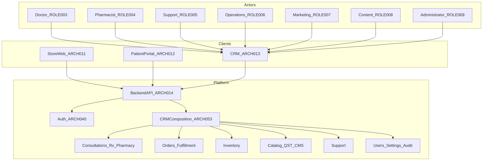
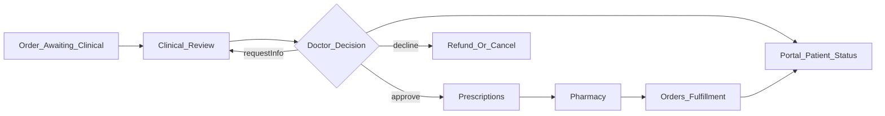
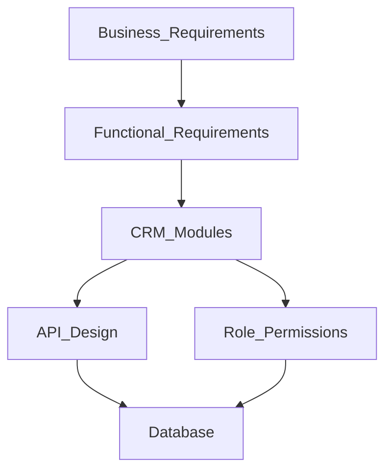
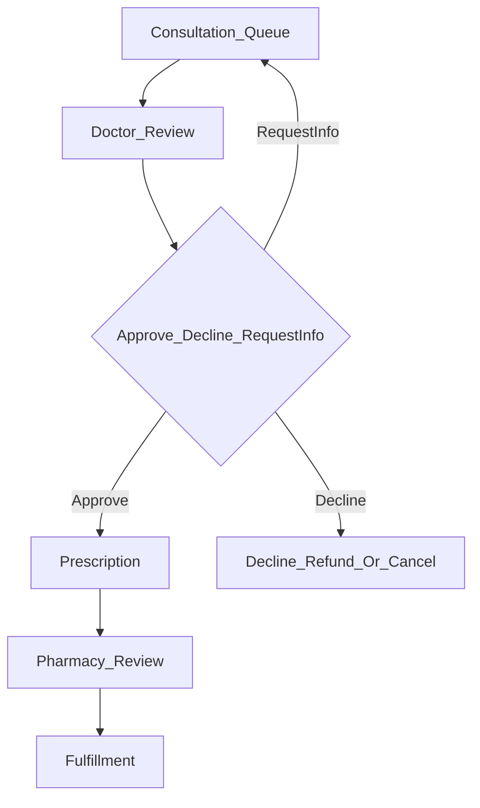

# 18 — CRM

| Field | Value |
| --- | --- |
| Document | CRM Architecture |
| Product | Clinexa |
| Version | 1.0 |
| Status | Approved — Implementation Ready |
| Primary market | United States |
| Audience | Principal Enterprise Solution Architecture, Healthcare CRM Architecture, Enterprise Operations Architecture, Principal Frontend Architecture, Frontend Engineering, Product, QA, Security |
| Source of truth | [00 — Product Requirements Document](00-product-requirements-document.md) |
| Related docs | [01 — Project overview](01-project-overview.md), [02 — Business requirements](02-business-requirements.md), [03 — Functional requirements](03-functional-requirements.md), [04 — Non-functional requirements](04-non-functional-requirements.md), [05 — System architecture](05-system-architecture.md), [06 — User personas](06-user-personas.md), [07 — User journeys](07-user-journeys.md), [08 — Role permissions](08-role-permissions.md), [09 — Feature roadmap](09-feature-roadmap.md), [10 — Database design](10-database-design.md), [11 — API design](11-api-design.md), [12 — Authentication flow](12-authentication-flow.md), [13 — Security](13-security.md), [14 — Notifications](14-notifications.md), [15 — Payment flow](15-payment-flow.md), [16 — Store architecture](16-store-architecture.md), [17 — Patient portal](17-patient-portal.md) |

This document is the **authoritative CRM (staff clinical and operational control plane) architecture** for Clinexa Version 1. It defines CRM responsibilities, module boundaries, role-based navigation, operational workflows, logical frontend state ownership, API integration surfaces, and CRM performance, accessibility, and security posture—without prescribing frameworks, component libraries, styling systems, or application source code.

It expands [PRD §7.4](00-product-requirements-document.md) (CRM), [PRD §8](00-product-requirements-document.md) CRM-facing capabilities and §8.12, [PRD §9](00-product-requirements-document.md) staff journeys, [PRD §12.1](00-product-requirements-document.md)/[§12.4](00-product-requirements-document.md)/[§12.6](00-product-requirements-document.md), [03](03-functional-requirements.md) `FR-CRM-*` and related clinical/ops/admin FRs, [05](05-system-architecture.md) `ARCH-013` / `ARCH-053`, [08](08-role-permissions.md) staff roles and `PERM-CRM-*`, [11](11-api-design.md) CRM/admin consumer APIs, [12](12-authentication-flow.md) `AUTH-027`, [13](13-security.md), [14](14-notifications.md) admin templates and clinical triggers, [16](16-store-architecture.md) Store↔CRM publish boundary (`STORE-014`), and [17](17-patient-portal.md) Portal↔CRM status boundary (`PORTAL-013`).

It does **not** redefine functional module behavior ([03](03-functional-requirements.md)), journey step narrative ([07](07-user-journeys.md)), API path catalogs ([11](11-api-design.md)), database schemas ([10](10-database-design.md)), authentication sequences ([12](12-authentication-flow.md)), security control catalogs ([13](13-security.md)), notification event catalogs ([14](14-notifications.md)), payment lifecycle ([15](15-payment-flow.md)), Store public commerce ([16](16-store-architecture.md)), or Patient Portal self-service ([17](17-patient-portal.md)). Those documents remain authoritative for their topics; this document owns CRM client architecture and the `CRM-*` control catalog.

> **Compliance posture:** CRM handles **authenticated, staff-scoped** clinical and operational work. Clinical PHI and payment card PAN are not owned as durable truths by CRM clients. Patterns are **HIPAA-aware** and **PCI-aware** without claiming certification as V1 delivery gates (PRD §1.5; `NFR-065`).

> **Implementation independence:** `CRM-*` IDs are logical architecture controls. Framework choice, rendering runtime, component structure, styling, state libraries, and SDK selection are out of scope. No React, TypeScript, CSS, Tailwind, or framework-specific examples appear here.

> **Role naming:** V1 product roles are Doctor, Pharmacist, Support, Operations, Marketing, Content, and Administrator (`ROLE-003`–`ROLE-009`). There is **no Super Admin** persona and **no Finance** product role. Finance-adjacent work (refunds, operational reports) is performed under Support, Operations, and Administrator within existing separation of duties ([08](08-role-permissions.md)).

---

## Table of contents

1. [Introduction](#1-introduction)
2. [CRM Overview](#2-crm-overview)
3. [CRM Modules](#3-crm-modules)
4. [Role-Based Navigation](#4-role-based-navigation)
5. [Operational Workflows](#5-operational-workflows)
6. [CRM State Management](#6-crm-state-management)
7. [API Integration](#7-api-integration)
8. [Performance Strategy](#8-performance-strategy)
9. [Accessibility](#9-accessibility)
10. [CRM Security](#10-crm-security)
11. [CRM Traceability Matrix](#11-crm-traceability-matrix)
12. [Revision History](#12-revision-history)

---

## 1. Introduction

### 1.1 Purpose

Define a production-grade CRM architecture for Clinexa so that:

- Clinical and operational staff (`ROLE-003`–`ROLE-009`) work in one role-scoped control plane (`BO-2`, `BO-4`, `BO-5`; `FR-CRM-001`; `ARCH-013`).
- CRM modules behave as thin clients of one Backend API (`ARCH-003`, `ARCH-004`, `ARCH-053`).
- Doctor consultation, prescription creation after approval, and pharmacist review enforce clinical gates (`FR-CRM-002`–`004`; `OR-03`–`05`).
- Operations manage orders, inventory, and fulfillment within RBAC (`FR-CRM-005`).
- Marketing and Content are denied default access to clinical notes and full questionnaire answers (`FR-CRM-006`; `OR-07`).
- Catalog, questionnaires, treatment plans, subscriptions, and consultation workflows are configurable without code deploy for ordinary expansion (`FR-CRM-007`; `OR-14`).
- Accessibility and performance targets for dense clinical/ops screens are architecturally accountable (`NFR-003`, `NFR-006`, `NFR-008`, `NFR-092`, `NFR-093`, `NFR-100`).
- Module boundaries prevent CRM from owning public SEO storefront rendering or Patient Portal self-service UX.

### 1.2 Scope

#### In scope (V1)

| Area | Coverage |
| --- | --- |
| CRM Web client | Staff clinical and operational control plane (`ARCH-013`) |
| Modules | Dashboard, user management, patient management, orders, clinical review, prescriptions, pharmacy, inventory, products, categories, questionnaires, appointments, subscriptions, documents, support, coupons, CMS (including blogs and review moderation), notifications (admin templates), reports (including analytics surfaces), audit logs, system settings |
| Navigation | Permission-driven, role-scoped shell; route protection; dynamic navigation |
| Operational workflows | Order review, clinical approval, prescription processing, pharmacy fulfillment readiness, inventory updates, subscription assist, appointment management, support resolution, document management |
| Logical FE state | Auth/session, users, patients, orders, clinical queue, prescriptions, inventory, products, CMS, support, reports, notification templates, UI state |
| API consumption | Staff/admin APIs per [11](11-api-design.md) CRM consumer map |
| Qualities | Performance, accessibility, CRM security posture |
| Traceability | Business → Functional → CRM modules → API → Auth → Database |

#### Out of scope

| Area | Deferred to / note |
| --- | --- |
| Public Store discovery / SEO catalog / cart / checkout finalize | [16](16-store-architecture.md) (`ARCH-011`) |
| Patient Portal self-service UX | [17](17-patient-portal.md) (`ARCH-012`); `FR-PRT-006` |
| Backend clinical/payment gate ownership | [05](05-system-architecture.md); API Domain/Business layers (`ARCH-004`) |
| Native mobile CRM as primary clinical workstation | Out of V1 (`NFR-100`; future [19](19-mobile-app.md)) |
| Live video telemedicine / in-CRM video visits | Out of V1 (PRD §11; `FR-APT-004`) |
| Real-time clinician chat | Out of V1 (PRD §11) |
| Full ambulatory EHR / EHR replacement | Out of V1 (PRD §11) |
| Guest or Patient CRM access | Hard deny (`RBAC-023`; `PERM-CRM-020`) |
| Super Admin or Finance product roles | Not V1 product roles ([08](08-role-permissions.md)) |
| Named frameworks, SDKs, component libraries, styling systems | Implementation |
| Physical DB DDL / API path invention | [10](10-database-design.md) / [11](11-api-design.md) |

### 1.3 Audience

| Audience | Use of this document |
| --- | --- |
| Principal enterprise / healthcare CRM architects | Module and navigation boundaries; clinical–ops SoD |
| Enterprise operations architects | Fulfillment, inventory, support, reports, config velocity |
| Principal frontend architects | Client responsibilities, state ownership, API consumption |
| Frontend engineers | CRM shell, route protection, domain module composition |
| Product | Scope discipline vs Store/Portal and future enhancements |
| QA | Journey coverage for `JRN-011`–`016`, `JRN-031`–`033`, a11y, RBAC |
| Security | Session, route protection, PHI least privilege, audit, XSS/CSRF |

### 1.4 References

| Document | Relevance |
| --- | --- |
| [00 — PRD](00-product-requirements-document.md) | Single source of truth; §7.4 CRM; §8 CRM-facing; §8.12; §9 journeys; §11 OOS; §12 NFRs |
| [01 — Project overview](01-project-overview.md) | Care-commerce loop; surface separation |
| [02 — Business requirements](02-business-requirements.md) | `BO-2`/`4`/`5`, `BP-03`–`05`/`09`–`11`, `OR-03`–`08`/`10`–`14`, `AC-BR-02`/`03`/`05`/`13` |
| [03 — Functional requirements](03-functional-requirements.md) | `FR-CRM-*` and domain FRs consumed by CRM |
| [04 — Non-functional requirements](04-non-functional-requirements.md) | Performance, a11y, session, desktop for CRM |
| [05 — System architecture](05-system-architecture.md) | `ARCH-013`, `ARCH-053`, thin clients |
| [06 — User personas](06-user-personas.md) | `USER-003`–`USER-009` staff personas |
| [07 — User journeys](07-user-journeys.md) | `JRN-011`–`016`, `JRN-020`, `JRN-022`, `JRN-025`–`026`, `JRN-031`–`033` |
| [08 — Role permissions](08-role-permissions.md) | `ROLE-003`–`009`, `PERM-CRM-*`, screen matrix |
| [09 — Feature roadmap](09-feature-roadmap.md) | `ROAD-011`–`014`, `ROAD-018`, `ROAD-020`–`026`; `MS-05` |
| [10 — Database design](10-database-design.md) | Staff/clinical/ops entities |
| [11 — API design](11-api-design.md) | CRM/admin consumer endpoint groups |
| [12 — Authentication flow](12-authentication-flow.md) | Staff auth; `AUTH-027` |
| [13 — Security](13-security.md) | Staff zone; PHI; SoD; XSS/CSRF |
| [14 — Notifications](14-notifications.md) | Worker-sent outcomes; admin templates |
| [15 — Payment flow](15-payment-flow.md) | Refunds; payment ≠ dispensing |
| [16 — Store architecture](16-store-architecture.md) | Publish boundary `STORE-014` |
| [17 — Patient portal](17-patient-portal.md) | Status boundary `PORTAL-013` |

### 1.5 CRM Architecture Principles

| ID | Principle | Implication |
| --- | --- | --- |
| CRM-001 | Thin staff client | CRM must not embed divergent clinical, inventory, or payment business rules (`ARCH-004`) |
| CRM-002 | Staff-only shell | CRM shell requires `PERM-CRM-020`; Guest and Patient are hard-denied (`RBAC-023`) |
| CRM-003 | Server-side AuthZ truth | Every privileged and PHI-adjacent action is re-checked by the Backend API (`FR-AUTH-004`; `NFR-045`) |
| CRM-004 | Separation of duties | Doctor ≠ fulfill; Pharmacist ≠ prescribe; Support ≠ Rx approve; Marketing/Content ≠ clinical charts by default (`FR-CRM-006`; `FR-SUP-004`; `RBAC-020`–`028`) |
| CRM-005 | Clinical honesty | Payment success is never clinical approval or dispensing (`OR-03`; `RBAC-027`) |
| CRM-006 | Config without deploy | Ordinary catalog, questionnaire, plan, and workflow expansion is CRM-configurable (`FR-CRM-007`; `OR-14`) |
| CRM-007 | Need-to-know PHI | Staff see patient data only as required for assigned case, ticket, order, or pharmacy context (`OR-06`; `RBAC-003`) |
| CRM-008 | Attributable staff | No shared anonymous clinical accounts; actions carry actor identity (`OR-06`; `NFR-047`) |
| CRM-009 | One API, three clients | CRM shares Backend API with Store and Portal; surface-specific AuthZ (`ARCH-003`) |
| CRM-010 | Accessibility for clinical density | Primary clinical workflows are keyboard-operable; AA goal for queue and decision paths (`NFR-092`, `NFR-093`) |

---

## 2. CRM Overview

### 2.1 CRM responsibilities

The CRM Web Application (`ARCH-013`) is the authenticated **clinical and operational control plane** for internal staff. It serves Doctor, Pharmacist, Support, Operations, Marketing, Content, and Administrator personas (`USER-003`–`USER-009` / `ROLE-003`–`ROLE-009`). Backend composition of authorized staff views is described as `ARCH-053`.

| Responsibility | CRM owns (UX) | Server owns (truth) |
| --- | --- | --- |
| Dashboard | Role-scoped summaries and queues entry | Aggregates and AuthZ (`PERM-CRM-020`) |
| User management | Provision/deactivate staff; role assignment UX | Users/RBAC persistence and audit (`FR-ADM-001`) |
| Patient management | Staff-scoped search and case-context views | Isolation and field redaction (`PERM-CRM-010`; `SEC-061`) |
| Clinical review | Consult queue; approve / decline / request info; notes | Decisions, audit, order clinical states (`FR-CRM-002`) |
| Prescriptions | Create/update after approval; status for pharmacy/ops | Rx after doctor approval only (`FR-CRM-003`) |
| Pharmacy | Pharmacy queue; ready / flag | Pharmacist review before Rx fulfillment (`FR-CRM-004`) |
| Orders / fulfillment | Staff lists, fulfill, cancel within policy | Lifecycle gates and inventory side effects (`FR-CRM-005`; `FR-ORD-003`) |
| Inventory | Balances, adjustments, low-stock | Ledger and oversell policy (`FR-INV-*`) |
| Catalog / QST / plans / workflows | Admin configure and publish | Publish safety validation (`FR-CRM-007`; `OR-14`) |
| Coupons / CMS / blogs / reviews | Author, publish, moderate | Published-only Store consume; moderation (`FR-CPN-*`, `FR-CMS-*`, `FR-BLG-*`, `FR-REV-*`) |
| Support | Triage, reply, resolve; refund assist | Ticket lifecycle; never Rx approve (`FR-SUP-002`/`004`) |
| Reports / analytics | Role-scoped dashboards and exports | Query/export AuthZ and PHI minimization (`FR-RPT-*`, `FR-ANL-*`) |
| Notifications | Admin template management UX | Workers send; clients never invent sends (`NTF-001`) |
| Audit / settings | Admin query and platform policy UX | Append-only audit; server-applied settings |

**CRM-011** — CRM is a presentation and staff-orchestration client. All durable clinical, commerce, inventory, and identity decisions are enforced by the Backend API.

### 2.2 Relationship with Store

| Aspect | CRM | Store |
| --- | --- | --- |
| Catalog / CMS / blogs / coupons | Author, configure, publish | Consume published only |
| Reviews | Moderate approve/reject | Display approved |
| Clinical / inventory / ops | Own queues and truth | Never mutate |
| SEO metadata | Editable via CRM config | Render indexable pages |
| Access | Staff roles only | Guest/Patient denied CRM (`PERM-CRM-020`) |

**CRM-012** — CRM never exposes public Store commerce UX (browse, cart, checkout finalize). Content and catalog changes appear on Store only after publish (`OR-14`; `FR-CMS-002`; `STORE-014`).

### 2.3 Relationship with Patient Portal

| Aspect | CRM | Patient Portal |
| --- | --- | --- |
| Clinical / pharmacy / fulfillment | Own queues and truth | Status visibility only |
| Support | Triage and resolve staff tickets | Patient create/view/reply on own tickets |
| Documents | Staff upload/attach | Patient list/download own |
| Catalog / CMS / coupons / admin | Configure and publish | Never exposed (`FR-PRT-006`) |
| Access | Staff roles only | Patient denied CRM shell (`PERM-CRM-020`) |

**CRM-013** — CRM never exposes patient self-service as a substitute for Portal. Clinical decisions appear to patients only as authorized status and documents (`PORTAL-013`).

### 2.4 Relationship with Backend API

| Aspect | Architecture rule |
| --- | --- |
| Protocol | HTTPS to Backend API only (`ARCH-014`; `SEC-019`) |
| Domain authority | Auth, clinical decisions, Rx, pharmacy, orders, inventory, catalog, QST, appointments, documents, support, coupons, CMS, blogs, reports, analytics, admin, settings |
| Forbidden | Direct DB access; PSP merchant secrets in CRM; client-side clinical gate bypass; inventing approve/decline/dispense outcomes |
| Messaging | API error and state responses drive UX; CRM must not invent clearance or fulfillment eligibility |

**CRM-014** — CRM communicates exclusively with the Backend API for domain operations. Private/PHI routes must not be CDN-cached as public content (`SEC-020`).

### 2.5 Relationship with Authentication

| Aspect | Rule |
| --- | --- |
| Identity | Staff Admin-provisioned (`FR-ADM-001`); never Store self-register into staff roles |
| Flow | CRM Staff Login `AUTH-027`: CRM entry → `API-004` → session → shell needs `PERM-CRM-020` → each action re-checks `PERM-*` + object scope |
| Principals | `ROLE-003`–`ROLE-008` staff; `ROLE-009` Administrator |
| Denials | Patient/Guest on CRM → `ERR-AUTHZ-003`; Marketing/Content clinical → `ERR-AUTHZ-004` |
| Session | Idle ≤ 30 min (staff/PHI); absolute ≤ 12 h; password reset invalidates all sessions (`NFR-044`) |
| MFA | Not required V1 (`AUTH-037`); must not preclude future MFA |
| Attributable accounts | No shared anonymous clinical staff accounts (`NFR-047`) |

**CRM-015** — Authentication into CRM does not grant clinical powers beyond assigned role permissions, and does not bypass object-scope or clinical-gate checks.

### 2.6 Architecture diagram

### 2.7 Explicit non-ownership summary

| ID | CRM must not |
| --- | --- |
| CRM-016 | Render public SEO storefront, cart, or checkout finalize (Store) |
| CRM-017 | Host patient self-service as primary UX (Portal) |
| CRM-018 | Allow Guest or Patient into the CRM shell |
| CRM-019 | Invent clinical outcomes, pharmacy readiness, or fulfillment clearance client-side |
| CRM-020 | Grant Marketing/Content default clinical notes or full questionnaire answers |
| CRM-021 | Allow Support to approve prescriptions or Operations to fulfill Rx before doctor + pharmacist gates |

---

## 3. CRM Modules

### 3.1 Module map

| ID | Module | MoSCoW | Primary FRs | Primary journeys / processes |
| --- | --- | --- | --- | --- |
| CRM-030 | Dashboard | Must | `FR-CRM-001`, `FR-ANL-*` | Staff home; `NFR-006` |
| CRM-031 | User Management | Must | `FR-ADM-001` | `JRN-031` |
| CRM-032 | Patient Management | Must | `FR-CRM-001`, `FR-SRCH-002`, `PERM-CRM-010` | Clinical/ops context |
| CRM-033 | Orders | Must | `FR-CRM-005`, `FR-ORD-003`–`006` | `JRN-016`; `BP-05` |
| CRM-034 | Clinical Review | Must | `FR-CRM-002` | `JRN-011`–`014`; `BP-03` |
| CRM-035 | Prescriptions | Must | `FR-CRM-003` | `JRN-012`; `BP-04`; cross-module |
| CRM-036 | Pharmacy | Must | `FR-CRM-004` | `JRN-015`; `BP-04`/`05` |
| CRM-037 | Inventory | Must | `FR-INV-001`–`005`, `FR-CRM-005` | `JRN-016`; `OR-12` |
| CRM-038 | Products | Must | `FR-PRD-002`, `FR-CRM-007` | `JRN-031`; `BP-10` |
| CRM-039 | Categories | Must | `FR-CAT-002`, `FR-CRM-007` | `JRN-031`; `BP-10` |
| CRM-040 | Questionnaires | Must | `FR-QST-001`/`002`/`005`, `FR-CRM-007` | Admin config; doctor case view |
| CRM-041 | Appointments | Should | `FR-APT-002`/`003` | `JRN-022` |
| CRM-042 | Subscriptions | Must | `FR-SUB-003`/`004`, `OR-10` | `JRN-020` assist |
| CRM-043 | Documents | Must | `FR-DOC-003`/`004` | Clinical/ops attach |
| CRM-044 | Support | Must | `FR-SUP-002`–`005` | `JRN-025`/`026` |
| CRM-045 | Coupons | Should | `FR-CPN-001`/`003` | `JRN-032` |
| CRM-046 | CMS | Should | `FR-CMS-*`, `FR-BLG-*`, `FR-REV-003` | `JRN-033`; moderation |
| CRM-047 | Notifications | Must | `FR-NTF-002` | Admin templates |
| CRM-048 | Reports | Should | `FR-RPT-*`, `FR-ANL-*` | Ops/clinical-ops/marketing-safe |
| CRM-049 | Audit Logs | Must | `FR-ADM-004` | Admin accountability |
| CRM-050 | System Settings | Must | `FR-SET-001`–`004` | `JRN-031`; publish/oversell policy |

### 3.2 Dashboard (`CRM-030`)

| Aspect | Detail |
| --- | --- |
| Responsibilities | Role-scoped landing: queue counts, ops alerts, marketing-safe summaries, config shortcuts |
| Ownership | CRM shell UX; Backend aggregates (`ARCH-053`, analytics/report APIs) |
| Boundaries | Metrics are permission-filtered; Marketing never receives clinical chart dumps (`FR-CRM-006`) |

### 3.3 User Management (`CRM-031`)

| Aspect | Detail |
| --- | --- |
| Responsibilities | Create/update/deactivate staff users; assign roles; view permission dictionary |
| Ownership | Administrator (`ROLE-009`); `FR-ADM-001` |
| Boundaries | Admin config ≠ default clinical prescribe (`RBAC-028`); role changes audited; no Super Admin role |

### 3.4 Patient Management (`CRM-032`)

| Aspect | Detail |
| --- | --- |
| Responsibilities | Staff search and view patient records within need-to-know / case-ticket-order scope |
| Ownership | Doctor, Pharmacist, Support, Operations, Admin (scoped); `PERM-CRM-010` |
| Boundaries | Not an EHR replacement (PRD §11); Marketing/Content denied clinical charts; CRM search RBAC-filtered (`FR-SRCH-002`) |

### 3.5 Orders (`CRM-033`)

| Aspect | Detail |
| --- | --- |
| Responsibilities | Staff order list/detail; cancel within policy; fulfill/ship when gates clear; refund coordination with Support |
| Ownership | Operations primary for fulfill (`PERM-ORD-003`); Doctor/Pharmacist/Support/Admin scoped views |
| Boundaries | Payment ≠ dispensing (`OR-03`); Rx fulfill requires doctor approve + pharmacist review (`FR-ORD-003`); Marketing/Content denied order lists |

### 3.6 Clinical Review (`CRM-034`)

| Aspect | Detail |
| --- | --- |
| Responsibilities | Doctor consultation queue; case open with intake context; approve, decline, or request additional information; clinical notes |
| Ownership | Doctor only (`PERM-CRM-001`–`005`); `FR-CRM-002` |
| Boundaries | Decisions attributable with actor and timestamp; Pharmacist/Support/Ops/Admin cannot clinically approve |

### 3.7 Prescriptions (`CRM-035`)

| Aspect | Detail |
| --- | --- |
| Responsibilities | Create/update prescriptions after clinical approval; staff Rx detail for pharmacy and scoped status for Support/Ops |
| Ownership | Doctor create/update (`FR-CRM-003`); Pharmacist review context; cross-module with QST, Orders, Documents, Notifications, Portal |
| Boundaries | Prescriptions are **not** a standalone FR module ([03](03-functional-requirements.md) intro); cannot precede doctor approval (`OR-04`) |

### 3.8 Pharmacy (`CRM-036`)

| Aspect | Detail |
| --- | --- |
| Responsibilities | Pharmacy review queue; mark ready or flag issues to doctor/operations |
| Ownership | Pharmacist (`PERM-CRM-006`/`007`); `FR-CRM-004` |
| Boundaries | Pharmacy readiness ≠ medical judgment; cannot replace doctor approve (`RBAC-021`) |

### 3.9 Inventory (`CRM-037`)

| Aspect | Detail |
| --- | --- |
| Responsibilities | Balances, manual adjustments, movement ledger, low-stock visibility |
| Ownership | Operations full; Pharmacist/Admin limited; `FR-INV-*`, `FR-CRM-005` |
| Boundaries | No separate Inventory Manager role (`USER-006` owns inventory); oversell policy from settings (`OR-12`) |

### 3.10 Products (`CRM-038`)

| Aspect | Detail |
| --- | --- |
| Responsibilities | Create/update/publish/unpublish products and variants; media metadata; Rx-eligibility and bindings awareness |
| Ownership | Administrator; `FR-PRD-002` |
| Boundaries | Unsafe Rx setups blocked at publish (`OR-14`); Store shows published only |

### 3.11 Categories (`CRM-039`)

| Aspect | Detail |
| --- | --- |
| Responsibilities | Create/update/publish/unpublish categories for Store navigation and SEO landings |
| Ownership | Administrator; `FR-CAT-002` |
| Boundaries | Demo categories are seed data only; publish safety applies |

### 3.12 Questionnaires (`CRM-040`)

| Aspect | Detail |
| --- | --- |
| Responsibilities | Admin: definitions, versions, bindings, consultation workflow config. Clinician: full answers in case context |
| Ownership | Admin config (`FR-QST-001`/`002`, `FR-CRM-007`); Doctor (and Pharmacist scoped) case view (`FR-QST-005`) |
| Boundaries | Marketing/Content denied full answers by default (`FR-CRM-006`); prior versions with answers immutable |

### 3.13 Appointments (`CRM-041`)

| Aspect | Detail |
| --- | --- |
| Responsibilities | Staff list/manage appointments; Admin configure types and slots |
| Ownership | Doctor, Pharmacist, Support, Operations, Admin scoped; `FR-APT-002` |
| Boundaries | Scheduling only—no integrated video telemedicine (`FR-APT-004`) |

### 3.14 Subscriptions (`CRM-042`)

| Aspect | Detail |
| --- | --- |
| Responsibilities | Staff visibility of past-due/grace; Admin plan configuration/publish; assist without gate bypass |
| Ownership | Support assist; Admin plans; `OR-10`; `FR-SUB-*` |
| Boundaries | CRM assist does not invent clinical clearance or payment success |

### 3.15 Documents (`CRM-043`)

| Aspect | Detail |
| --- | --- |
| Responsibilities | Staff upload/attach case-scoped documents; metadata visibility within ACL |
| Ownership | Doctor, Pharmacist, Support, Operations, Admin as permitted; `FR-DOC-003` |
| Boundaries | PHI downloads audited (`FR-DOC-004`); patients download via Portal, not CRM self-service |

### 3.16 Support (`CRM-044`)

| Aspect | Detail |
| --- | --- |
| Responsibilities | Ticket triage queue; reply; resolve; refund initiation per `OR-11` tiers with order context |
| Ownership | Support primary; Admin limited; `FR-SUP-002`/`005` |
| Boundaries | Support **cannot** approve prescriptions (`FR-SUP-004`; `RBAC-024`) |

### 3.17 Coupons (`CRM-045`)

| Aspect | Detail |
| --- | --- |
| Responsibilities | Create/update/deactivate coupons; view redemptions |
| Ownership | Marketing, Administrator; `FR-CPN-001` |
| Boundaries | Not a paid-ads platform (`JRN-032` scope); Store redeems only |

### 3.18 CMS (`CRM-046`)

| Aspect | Detail |
| --- | --- |
| Responsibilities | CMS pages/blocks publish; blog authoring/publish; review moderation approve/reject; SEO metadata fields |
| Ownership | Content/Admin primary; Marketing limited CMS/analytics; `FR-CMS-*`, `FR-BLG-*`, `FR-REV-003` |
| Boundaries | Drafts never public until publish; Content has no clinical queues; moderation before public display (V1 default) |

### 3.19 Notifications (`CRM-047`)

| Aspect | Detail |
| --- | --- |
| Responsibilities | Admin manage notification templates |
| Ownership | Administrator; `FR-NTF-002`; `API-135`/`136` |
| Boundaries | No V1 staff in-app notification center (`NTF-015`/`017`); CRM decisions trigger worker-sent patient/ops messages; clients never invent sends (`NTF-001`) |

### 3.20 Reports (`CRM-048`)

| Aspect | Detail |
| --- | --- |
| Responsibilities | Operational/clinical-ops tabular reports; sync run and async export; role-scoped analytics (ops metrics vs marketing-safe funnel) |
| Ownership | Operations/Admin full; Doctor/Pharmacist/Support limited; Marketing marketing-safe only; `FR-RPT-*`, `FR-ANL-*` |
| Boundaries | PHI-minimized; exports audited; large exports async (`NFR-012`) |

### 3.21 Audit Logs (`CRM-049`)

| Aspect | Detail |
| --- | --- |
| Responsibilities | Query append-only audit of privileged clinical/admin and PHI-sensitive document access |
| Ownership | Administrator; `FR-ADM-004` |
| Boundaries | Audit retention ≥ 1 year (`SEC-036`); CRM UI cannot rewrite audit history |

### 3.22 System Settings (`CRM-050`)

| Aspect | Detail |
| --- | --- |
| Responsibilities | Platform settings: oversell policy, review moderation policy, publish-related controls |
| Ownership | Administrator; `FR-SET-001`–`004` |
| Boundaries | Settings are server-applied and audited; cannot globally disable clinical gates |

---

## 4. Role-Based Navigation

### 4.1 Navigation principles

| ID | Control | Rule |
| --- | --- | --- |
| CRM-051 | Module visibility | Nav items appear only when the authenticated staff principal holds the corresponding `PERM-*` (advisory claims may hint UI; server re-resolves) |
| CRM-052 | Permission-driven navigation | Navigation is an affordance guide; Backend API remains authoritative (`FR-AUTH-004`; `RBAC-086`) |
| CRM-053 | Route protection | All CRM application routes require `PERM-CRM-020`; deep links re-checked after login (`AUTH-027`) |
| CRM-054 | Dynamic navigation | Role change or privilege revocation invalidates prior sessions/token version; next shell load reflects current grants |
| CRM-055 | Guest/Patient deny | Guest and Patient have no CRM Dashboard or modules (`RBAC-023`) |
| CRM-056 | No Super Admin / Finance nav | V1 nav catalogs only `ROLE-003`–`ROLE-009`; finance-adjacent refunds/reports appear under Support/Operations/Admin modules |

### 4.2 Module visibility by role

Legend: **Full** = primary functions; **Limited** = scoped / status-appropriate / marketing-safe; **—** = no access. Derived from [08](08-role-permissions.md) Screen-to-Role Access Matrix.

| Module | Doctor | Pharmacist | Support | Operations | Marketing | Content | Admin |
| --- | --- | --- | --- | --- | --- | --- | --- |
| Dashboard | Full | Full | Full | Full | Full | Full | Full |
| Clinical Review | Full | — | — | — | — | — | — |
| Pharmacy | — | Full | — | — | — | — | — |
| Prescriptions | Full | Limited | Limited | Limited | — | — | Limited |
| Patient Management | Limited | Limited | Limited | Limited | — | — | Limited |
| Orders | Limited | Limited | Limited | Limited | — | — | Limited |
| Inventory | — | Limited | — | Full | — | — | Limited |
| Documents | Limited | Limited | Limited | Limited | — | — | Limited |
| Appointments | Limited | Limited | Limited | Limited | — | — | Full |
| Subscriptions | — | — | Limited | — | — | — | Full |
| Support | — | — | Full | — | — | — | Limited |
| Coupons | — | — | — | — | Full | — | Full |
| CMS / Blogs / Reviews | — | — | Limited reviews | — | Limited | Full | Full |
| Products / Categories / QST config | — | — | — | — | — | — | Full |
| Notifications (templates) | — | — | — | — | — | — | Full |
| Reports / Analytics | Limited | Limited | Limited | Full | Limited (mkt-safe) | — | Full |
| User Management | — | — | — | — | — | — | Full |
| Audit Logs | — | — | — | — | — | — | Full |
| System Settings | — | — | — | — | — | — | Full |

### 4.3 Role navigation summaries

| Role | Primary nav destinations |
| --- | --- |
| Doctor (`ROLE-003`) | Dashboard → Clinical Review → Prescriptions → scoped Patients/Orders/Documents/Appointments → limited Reports |
| Pharmacist (`ROLE-004`) | Dashboard → Pharmacy → Prescriptions → limited Inventory/Orders/Documents → limited Reports |
| Support (`ROLE-005`) | Dashboard → Support → scoped Orders/Patients/Subscriptions/Documents/Appointments → refunds → limited Reports |
| Operations (`ROLE-006`) | Dashboard → Orders → Inventory → Documents/Appointments → Reports/Analytics |
| Marketing (`ROLE-007`) | Dashboard → Coupons → limited CMS → marketing-safe Analytics |
| Content (`ROLE-008`) | Dashboard → CMS / Blogs → review moderation |
| Administrator (`ROLE-009`) | Dashboard → User Management → catalog/QST/plans/workflows → Settings → Audit → Reports; **not** default Clinical Review approve |

**CRM-057** — Dual-role assignments, if granted, union permissions still subject to hard denies (e.g., Support never gains Rx approve via configuration that would violate `FR-SUP-004`).

### 4.4 Route protection and dynamic navigation

| ID | Topic | Rule |
| --- | --- | --- |
| CRM-058 | Unauthenticated | Redirect to CRM auth entry; no privileged shell paint |
| CRM-059 | Wrong surface token | Patient session on CRM route denied (`ERR-AUTHZ-003`) |
| CRM-060 | Missing module perm | Hide nav and deny route; API returns AuthZ error if called directly |
| CRM-061 | Clinical gate UI | Approve/decline/fulfill controls disabled or omitted when server state forbids; client never overrides |
| CRM-062 | Field redaction | Responses may omit clinical notes / full QST for Marketing/Content; UI must not assume fields exist (`SEC-061`) |
| CRM-063 | Search nav | Global CRM search (`API-039`) filters by RBAC; unauthorized hits excluded without leakage |
| CRM-064 | Publish nav | Admin/Content publish actions require publish safety validation outcomes from API |
| CRM-065 | Refund nav | Support/Ops refund UX follows `OR-11`; does not imply clinical authority |
| CRM-066 | Desktop shell | CRM optimized ≥ 1024 px (prefer ≥ 1280); not primary mobile clinical workstation (`NFR-100`) |
| CRM-067 | Advisory permissions | Token `permissions` claims are UI hints only; fresh policy loaded server-side |
| CRM-068 | Session expiry | Idle/absolute expiry clears shell state and requires re-auth (`NFR-044`) |
| CRM-069 | Privilege change | Role change bumps token/session version; prior CRM sessions invalid |
| CRM-070 | Fail closed | AuthZ or clinical-gate uncertainty fails closed—no optimistic clearance |

---

## 5. Operational Workflows

High-level staff workflows. Step narrative remains authoritative in [07](07-user-journeys.md); business process ownership in [02](02-business-requirements.md).

### 5.1 Clinical–ops chain

### 5.2 Workflow catalog

| ID | Workflow | Primary actors | References | CRM modules |
| --- | --- | --- | --- | --- |
| CRM-071 | Order Review | Ops, Support, Doctor/Pharm (scoped) | `FR-ORD-005`; `JRN-016`; `OR-08` | Orders, Dashboard |
| CRM-072 | Clinical Approval | Doctor | `BP-03`; `JRN-011`/`012`; `FR-CRM-002`/`003`; `AC-BR-02` | Clinical Review, Prescriptions |
| CRM-073 | Prescription Processing | Doctor → Pharmacist | `BP-04`; `FR-CRM-003`; `ROAD-012` | Prescriptions, Documents |
| CRM-074 | Pharmacy Fulfillment readiness | Pharmacist → Operations | `JRN-015`/`016`; `FR-CRM-004`; `OR-05`; `FR-ORD-003` | Pharmacy, Orders, Inventory |
| CRM-075 | Inventory Updates | Operations | `FR-INV-*`; `OR-12`; low-stock `NTF-052` | Inventory, Reports |
| CRM-076 | Subscription Management | Support assist; Admin plans | `BP-06`; `OR-10`; `JRN-020` | Subscriptions, Support |
| CRM-077 | Appointment Management | Staff; Admin types/slots | `BP-07`; `FR-APT-002`; `JRN-022` | Appointments |
| CRM-078 | Support Resolution | Support | `BP-09`; `JRN-025`/`026`; `FR-SUP-002`/`004`/`005` | Support, Orders |
| CRM-079 | Document Management | Clinical/ops staff | `FR-DOC-003`/`004` | Documents, Clinical Review, Pharmacy |

### 5.3 Workflow notes

| Workflow | High-level outcome |
| --- | --- |
| Order Review | Staff see lifecycle states; no fulfill until clearance (`OR-08`) |
| Clinical Approval | Approve → enables Rx path; Decline → refund/cancel path; Request info → patient supplemental intake then re-queue (`JRN-014`) |
| Prescription Processing | Rx created/updated only after doctor approval (`OR-04`) |
| Pharmacy Fulfillment | Pharmacist ready/flag; Ops fulfill decrements inventory when gates pass |
| Inventory Updates | Adjustments audited; reserve/decrement/restock via order lifecycle |
| Subscription Management | Past-due surfaced; assist recovery; no gate bypass |
| Appointment Management | Staff visibility/manage; no video visits |
| Support Resolution | Triage/resolve tickets; refunds per tier; never Rx approve |
| Document Management | Attach to case/order; PHI access audited; Portal remains patient download surface |

---

## 6. CRM State Management

Logical frontend state domains only. Library choice is out of scope.

| ID | Domain | Ownership | Lifecycle |
| --- | --- | --- | --- |
| CRM-080 | Authentication | Session/token, role, advisory permissions, idle timers | Created on `AUTH-027` login; cleared on logout, expiry, or privilege revocation |
| CRM-081 | Users | Admin user list/detail and role assignment drafts | Loaded on User Management routes; invalidated after create/update/deactivate/role change |
| CRM-082 | Patients | Search results and scoped patient context | Short-lived; need-to-know; never cache cross-patient dumps |
| CRM-083 | Orders | Staff lists, detail, fulfill/cancel pending UX | Revalidate after mutations and when entering fulfillment views |
| CRM-084 | Clinical Queue | Queue page, filters, open case, notes draft | Paginated; refresh after approve/decline/request-info; drafts discarded on navigate-away per UX policy |
| CRM-085 | Prescriptions | Rx detail and pharmacy-related views | Valid only post-approval path; refresh after create/update/pharmacy review |
| CRM-086 | Inventory | Balances, adjustments, low-stock | Revalidate after adjust and fulfillment side effects |
| CRM-087 | Products | Admin catalog drafts/lists (products, categories, bindings as composed) | Invalidate on publish/unpublish; drafts distinct from published Store view |
| CRM-088 | CMS | Pages, blogs, review moderation queue | Draft vs published; refresh after publish/moderate |
| CRM-089 | Support | Ticket queue, detail, messages | Refresh after reply/resolve/refund linkage |
| CRM-090 | Reports | Report params, sync results, export job ids | Sync results ephemeral; export jobs polled until complete |
| CRM-091 | Notifications | Admin template list/editors | Loaded on template routes; workers own send state |
| CRM-092 | UI State | Nav expansion, filters, table sort, toasts, focus restore | Ephemeral; must not store PHI in durable client storage as a product pattern |

**State rules**

- Server truth over cache after clinical or fulfillment mutations.
- AuthZ never trusted from client state alone (`CRM-003`).
- Marketing/Content client state must not retain clinical notes or full QST answers if API redacts them.

---

## 7. API Integration

CRM consumes documented APIs only ([11](11-api-design.md)). CRM must not invent endpoints or clinical outcomes.

### 7.1 Integration principles

| ID | Rule |
| --- | --- |
| CRM-100 | Consume-only documented `/v1` staff and admin APIs over HTTPS |
| CRM-101 | Every mutation carries attributable staff identity via session; privileged actions re-authorized |
| CRM-102 | Paginate list endpoints; honor RBAC-filtered search |
| CRM-103 | Present API-safe errors; no stack traces, secrets, or other patients’ PHI (`SEC-050`) |

### 7.2 Domain API map

| Domain | API IDs | CRM use |
| --- | --- | --- |
| Auth | `API-004`–`008` | Staff login/logout/reset/session (`AUTH-027`) |
| Users | `API-009`–`015`, `API-168`–`171` | User management, roles, permissions, audit |
| Patients / search | `API-039` | CRM search; patient linkage via case/order/ticket/document context |
| Orders | `API-072`–`076`, refunds `API-067`, subscriptions `API-083` | Staff orders; fulfill; cancel; assist subscriptions |
| Clinical review | `API-088`–`094` | Consult queue, approve/decline/request-info, notes |
| Prescriptions | `API-097`–`099` | Create/update/view after approval |
| Pharmacy | `API-102`–`104` | Pharmacy queue and reviews |
| Inventory | `API-105`–`109` | Balances, adjust, movements, low-stock |
| Products | `API-021`–`030` | Admin products/variants/media/publish |
| Categories | `API-033`–`037` | Admin categories publish |
| Questionnaires / workflows | `API-046`–`052`, `API-095`–`096` | Clinician answers view; Admin definitions/bindings/workflows |
| Appointments | `API-120`–`124` | Staff manage; Admin types/slots |
| Documents | `API-113` | Staff upload/attach |
| Support | `API-129`–`132` | Triage, reply, resolve |
| Notifications | `API-135`–`136` | Admin templates only |
| Coupons | `API-143`–`147` | Marketing/Admin coupons |
| CMS / Blogs / Reviews | `API-150`–`154`, `API-157`–`160`, `API-139`–`141` | Author/publish; moderation |
| Reports / Analytics | `API-161`–`167` | Sync reports, async exports, funnel/ops analytics |
| Treatment plans | `API-172`–`174` | Admin plan config (`FR-CRM-007`) |
| Settings | `API-175`–`176` | Platform settings |

| ID | Integration control |
| --- | --- |
| CRM-104 | CRM must not call patient-only Portal self-service mutation paths as a substitute for staff APIs |
| CRM-105 | Store public catalog reads are not the CRM authoring surface; use `/admin/*` for drafts |
| CRM-106 | Notification send is worker-owned; CRM does not POST ad-hoc patient messages outside domain events |
| CRM-107 | Report exports use async job pattern; do not block shell on unbounded queries |
| CRM-108 | Idempotency keys required where API design mandates (e.g., refunds `API-067`) |

---

## 8. Performance Strategy

Reference [04](04-non-functional-requirements.md) §2 and CRM latency targets. Remain implementation-independent.

| ID | Area | Strategy |
| --- | --- | --- |
| CRM-110 | Large datasets | Bounded page sizes for queues, orders, patients, tickets, audit; no unbounded full-table dumps to UI (`NFR-020`) |
| CRM-111 | Pagination | Default oldest-first or ops-appropriate sort with explicit page cursors/offsets per API contract |
| CRM-112 | Filtering | Server-side filters for status, date, assignee/queue; client filters must not bypass AuthZ |
| CRM-113 | Background refresh | Soft refresh on focus for clinical queue and fulfillment lists without starving interactive APIs (`NFR-014`) |
| CRM-114 | Search optimization | CRM search p95 &lt; 1 s with RBAC filtering (`NFR-008`); debounce user input at UX layer without inventing search APIs |
| CRM-115 | Lazy loading | Load module data on navigation; defer heavy report/analytics panels until entered |
| CRM-116 | Data synchronization | After approve/decline/pharmacy/fulfill/adjust/publish, invalidate related domains and re-fetch server truth |
| CRM-117 | Queue/case latency | Consultation queue list and case open p95 &lt; 1 s (`NFR-003`) |
| CRM-118 | Dashboards / reports | Default dashboards TTI ≤ 3 s Should (`NFR-006`); sync reports &lt; 5 s Should (`NFR-011`); large exports async (`NFR-012`) |
| CRM-119 | Concurrency / device | Design for ≤ 10 concurrent CRM staff nominal; desktop ≥ 1024 px (`NFR-100`) |

---

## 9. Accessibility

Reference [04](04-non-functional-requirements.md) §11 and PRD §12.4.

| ID | Area | Requirement |
| --- | --- | --- |
| CRM-130 | WCAG goals | Primary clinical workflows aim for WCAG 2.2 Level AA (`NFR-093` Should); Store/Portal AA Must does not replace CRM keyboard Must |
| CRM-131 | Keyboard navigation | Dense operational screens operable without pointer-only traps; logical focus order (`NFR-092`, `NFR-095`) |
| CRM-132 | Tables | Queue, order, inventory, ticket, and report tables expose headers; status not conveyed by color alone |
| CRM-133 | Forms | Clinical decision, pharmacy review, inventory adjust, publish, and support reply forms: visible labels, associated errors |
| CRM-134 | Error handling | AuthZ, validation, and gate failures announced accessibly; no silent approve/fulfill failures |
| CRM-135 | High-density interfaces | Focus remains visible in multi-column clinical layouts; skip mechanisms to main queue/case content |
| CRM-136 | Contrast and focus | AA contrast; visible focus (`NFR-094`, `NFR-095`) |
| CRM-137 | Desktop a11y priority | Usable at ≥ 1024 px; CRM is not optimized as primary mobile clinical workstation in V1 (`NFR-100`) |

---

## 10. CRM Security

Cross-reference [12](12-authentication-flow.md), [13](13-security.md), and [08](08-role-permissions.md).

| ID | Area | Control |
| --- | --- | --- |
| CRM-140 | Role isolation | Staff zones separated: Clinical, Ops/Support, Growth (coupons/CMS), Admin; Guest/Patient hard-denied |
| CRM-141 | Least privilege | Permissions granted minimally for duty; Marketing/Content default-deny clinical notes/full QST (`FR-CRM-006`; `NFR-060`; `SEC-002`/`006`) |
| CRM-142 | PHI handling | Need-to-know case/ticket/order scope; field-level redaction (`SEC-061`); minimize PHI in client logs and toasts |
| CRM-143 | Audit logging | Clinical/admin actions and PHI document access audited; retention ≥ 1 year (`SEC-008`/`036`; `FR-ADM-004`) |
| CRM-144 | Sensitive operations | Approve/decline/request-info, pharmacy review, fulfill, inventory adjust, publish, role change, refund, settings update—all server-authorized and audited |
| CRM-145 | Session handling | Validate session on PHI-adjacent calls; idle ≤ 30 min; absolute ≤ 12 h; logout revokes; password reset invalidates all (`NFR-044`) |
| CRM-146 | XSS awareness | Output encoding for patient- and staff-influenced strings rendered in CRM (`SEC-041`); CSP (`SEC-045`) |
| CRM-147 | CSRF considerations | Cookie-bound sessions require anti-CSRF per `SEC-044` / `AUTH-039`; bearer-in-header patterns follow Auth design |
| CRM-148 | Secure API communication | HTTPS only to `/v1` (`SEC-019`); patient tokens must not access CRM; CDN never caches private/PHI |
| CRM-149 | Clinical fail-closed | Gates fail closed (`SEC-005`); payment success ≠ dispensing |
| CRM-150 | Document ACLs | CRM document resources honor case/ticket/document ACLs (`SEC-053`) |
| CRM-151 | Attributable identity | No shared anonymous clinical accounts (`NFR-047`; `OR-06`; `RBAC-029`) |

---

## 11. CRM Traceability Matrix

### 11.1 Business → Functional → CRM → API → Auth → Database

| Business | Functional | CRM module / control | API | Auth / PERM | Database |
| --- | --- | --- | --- | --- | --- |
| `BO-2`, `BP-03`, `AC-BR-02` | `FR-CRM-002`/`003` | CRM-034, CRM-035, CRM-072 | `API-088`–`094`, `API-097`–`099` | `PERM-CRM-001`–`005`, `ROLE-003` | `DB-037`–`040` |
| `BP-04`, `OR-05`, `AC-BR-03` | `FR-CRM-004`, `FR-ORD-003` | CRM-036, CRM-074 | `API-102`–`104`, `API-075` | `PERM-CRM-006`/`007`, `ROLE-004` | `DB-040`–`041` |
| `BO-4`, `BP-05`, `OR-12` | `FR-CRM-005`, `FR-INV-*` | CRM-033, CRM-037, CRM-071/`075` | `API-072`–`076`, `API-105`–`109` | Ops perms; `ROLE-006` | `DB-026`–`027`, `DB-042`–`043` |
| `OR-07`, `AC-BR-13` | `FR-CRM-006` | CRM-004, CRM-020, CRM-141 | Redacted clinical APIs | Mk/Ct deny; `ERR-AUTHZ-004` | `DB-039`, `DB-036` |
| `BO-5`, `BP-10`, `AC-BR-05`, `OR-14` | `FR-CRM-007`, `FR-PRD-002`, `FR-CAT-002`, `FR-QST-001` | CRM-038–`040`, CRM-050 | `API-021`–`037`, `API-047`–`052`, `API-095`–`096` | Admin; publish perms | `DB-010`–`021` |
| `OR-06`, `NFR-047` | `FR-CRM-001`, `FR-ADM-001` | CRM-002, CRM-031, CRM-151 | `API-004`, `API-009`–`015` | `PERM-CRM-020`, `ROLE-003`–`009` | `DB-001`–`009` |
| `BP-09`, `OR-11` | `FR-SUP-002`–`005`, `FR-PAY-003` | CRM-044, CRM-078 | `API-129`–`132`, `API-067` | Support; never Rx approve | `DB-048`–`049`, `DB-029` |
| `BP-11`, `OR-13` | `FR-CMS-*`, `FR-BLG-*`, `FR-REV-003` | CRM-046, CRM-045 | `API-150`–`160`, `API-139`–`141`, `API-143`–`147` | Content/Marketing/Admin | `DB-024`–`025`, `DB-050`–`053` |
| `BP-06`, `OR-10` | `FR-SUB-003`/`004` | CRM-042, CRM-076 | `API-083`–`087` | Support/Admin | `DB-032`–`034` |
| `BP-07` | `FR-APT-002`/`003` | CRM-041, CRM-077 | `API-120`–`124` | Staff/Admin | `DB-044`–`046` |
| Docs / audit | `FR-DOC-003`/`004`, `FR-ADM-004` | CRM-043, CRM-049, CRM-079 | `API-113`, `API-171` | Staff scoped; Admin audit | `DB-047`, `DB-057` |
| Reports / observability | `FR-RPT-*`, `FR-ANL-*`, `AC-BR-14` | CRM-048, CRM-030 | `API-161`–`167` | Role-scoped | `DB-060`–`061` |
| Notifications | `FR-NTF-002`; `NTF-001` | CRM-047 | `API-135`–`136` | Admin | `DB-054` |
| Settings | `FR-SET-001`–`004` | CRM-050 | `API-175`–`176` | Admin | `DB-058` |
| Perf / a11y | `NFR-003`/`006`/`008`/`020`/`092`/`093`/`100` | CRM-110–137 | Queue/search/report APIs | Staff session | — |

### 11.2 Roadmap alignment

| ROAD | CRM relevance | Milestone |
| --- | --- | --- |
| `ROAD-011` | Doctor consultation / clinical review | MS-03 |
| `ROAD-012` | Prescriptions (cross-module) | MS-03 |
| `ROAD-013` | Pharmacist review | MS-03 |
| `ROAD-014` | Inventory and fulfillment | MS-03 |
| `ROAD-018` | Support ticketing Portal↔CRM | MS-04 |
| `ROAD-020` | Administration and publish safety | MS-07 |
| `ROAD-021` | CRM staff control plane | MS-05 |
| `ROAD-022` | Coupons | Growth |
| `ROAD-023` | Reviews and moderation | Growth |
| `ROAD-024` | CMS and blogs | MS-08 |
| `ROAD-025` | Appointments | Appointments track |
| `ROAD-026` | Analytics and reports | MS-09 |

### 11.3 Journey → CRM module map

| Journey | CRM modules |
| --- | --- |
| `JRN-011` Doctor review | Clinical Review, Patient Management, Questionnaires (case) |
| `JRN-012` Doctor approval | Clinical Review, Prescriptions |
| `JRN-013` Doctor rejection | Clinical Review, Orders, Support/refunds path |
| `JRN-014` Request additional information | Clinical Review; Portal intake continuity |
| `JRN-015` Pharmacist review | Pharmacy, Prescriptions, Orders |
| `JRN-016` Order fulfillment | Orders, Inventory, Pharmacy readiness |
| `JRN-020` Subscription renewal | Subscriptions, Support (assist) |
| `JRN-022` Appointment booking | Appointments (staff visibility) |
| `JRN-025` Support ticket | Support |
| `JRN-026` Refund request | Support, Orders |
| `JRN-028` Review moderation | CMS (reviews) |
| `JRN-031` Administrator configuration | User Management, Products, Categories, Questionnaires, Settings |
| `JRN-032` Marketing campaign | Coupons, Reports (marketing-safe) |
| `JRN-033` Content publishing | CMS / Blogs |

### 11.4 Responsibility matrix

| Concern | Store | Portal | CRM | Backend API |
| --- | --- | --- | --- | --- |
| Public SEO catalog | Render | — | Configure/publish | Enforce publish |
| Clinical approval | No | Status view | Yes (Doctor) | Enforce |
| Pharmacist review | No | Status view | Yes (Pharmacist) | Enforce |
| Fulfillment / inventory | No | Status view | Yes (Ops) | Enforce ledger/gates |
| Support tickets | Contact CMS only | Create/view | Triage | Persist |
| Coupons | Redeem | — | Configure | Validate |
| CMS / blogs | Consume published | Consume | Author/publish | Enforce draft/publish |
| Catalog / QST config | — | Forbidden | Admin | Validate bindings |
| Analytics / reports | — | — | Role-scoped | Query AuthZ |
| Notification send | No | Prefs only | Templates/admin | Workers |

### 11.5 Traceability flow

### 11.6 CRM ownership matrix

| CRM area | Primary owner | Supporting teams |
| --- | --- | --- |
| Clinical Review / Prescriptions | Clinical Operations + CRM Frontend | Backend clinical domain, Doctors, Security, QA |
| Pharmacy | Pharmacy Operations + CRM Frontend | Backend Rx/pharmacy APIs, Ops fulfillment, QA |
| Orders / Inventory | Operations + Backend Orders/Inventory | CRM Frontend, Pharmacist gates, QA |
| Support | Support Operations + CRM Frontend | Backend Support/Payments, Product, QA |
| Coupons / Marketing analytics | Marketing + Product | CRM Frontend, Backend coupons/analytics, QA |
| CMS / Blogs / Reviews | Content + Product | CRM Frontend, Store rendering, QA |
| Admin / Settings / Audit | Administrator + Security | Backend ADM/SET, CRM Frontend, Compliance advisors |
| Shell / navigation / a11y | CRM Frontend Architecture | Security, QA, Product |

### 11.7 CRM Dashboard Widget Matrix

Role-scoped Dashboard widget visibility. Complements §4 Role-Based Navigation and §3.2 Dashboard (`CRM-030`). Widgets are navigation affordances only; Backend API remains the AuthZ enforcement point (`FR-AUTH-004`; `RBAC-086`).

Legend: **Full** = primary widget functions; **Limited** = scoped / status-appropriate / marketing-safe summary; **—** = not shown.

| Dashboard Widget | Doctor | Pharmacist | Support | Operations | Marketing | Content | Administrator |
| --- | --- | --- | --- | --- | --- | --- | --- |
| Clinical Queue | Full | — | — | — | — | — | — |
| Pharmacy Queue | — | Full | — | — | — | — | — |
| Order Queue | Limited | Limited | Limited | Full | — | — | Limited |
| Inventory Alerts | — | Limited | — | Full | — | — | Limited |
| Support Tickets | — | — | Full | — | — | — | Limited |
| CMS Drafts | — | — | — | — | Limited | Full | Full |
| Marketing Analytics | — | — | — | — | Full | — | Full |
| System Health | — | — | — | Limited | — | — | Full |
| Audit Summary | — | — | — | — | — | — | Full |

Notes:

- Clinical Queue and Pharmacy Queue widgets align to `PERM-CRM-001` and `PERM-CRM-006` respectively; Admin does not receive default clinical-approve widgets (`RBAC-028`).
- Marketing Analytics is PHI-minimized (`PERM-ANL-001`; `FR-CRM-006`). Operations clinical-ops metrics use separate report/analytics surfaces (`PERM-ANL-002`), not this marketing widget.
- System Health reflects platform/ops readiness signals for authorized staff (`NFR-077`); it is not a public status page.
- Audit Summary is Administrator-primary (`PERM-ADM-010`); append-only audit truth remains server-side (`FR-ADM-004`).

### 11.8 Cross-Module Interaction Matrix

Logical dependencies among CRM modules and peer surfaces. Does not invent APIs; interactions are realized through Backend API domain events and documented endpoints ([11](11-api-design.md)).

| Source Module | Target Module | Purpose |
| --- | --- | --- |
| Clinical Review | Prescriptions | Doctor approval enables prescription create/update (`FR-CRM-002`/`003`; `OR-04`) |
| Prescriptions | Pharmacy | Approved Rx enters pharmacist review queue (`FR-CRM-004`; `OR-05`) |
| Pharmacy | Orders | Pharmacy ready/flag clears or blocks Rx fulfillment readiness (`FR-ORD-003`; `JRN-015`/`016`) |
| Orders | Inventory | Fulfillment reserve/decrement/restock and ops adjustments (`FR-INV-002`; `OR-12`) |
| Inventory | Reports | Stock, low-stock, and fulfillment metrics feed operational reports (`FR-RPT-*`; `FR-INV-004`) |
| CMS | Store | Published pages/blogs/SEO metadata consumed by Store; drafts never public (`FR-CMS-002`; `STORE-014`) |
| Documents | Patient Portal | Staff-attached artifacts become patient-visible downloads under ACL (`FR-DOC-002`/`003`; `PORTAL-013`) |
| Support | Orders | Ticket triage links order context; refunds and cancel assist per policy (`FR-SUP-002`/`005`; `OR-11`) |
| Notifications | All Modules | Domain events from clinical, orders, inventory, support, content, and admin paths trigger worker-sent messages; clients never invent sends (`NTF-001`; `FR-NTF-002` templates) |

### 11.9 Clinical Decision Lifecycle

This diagram summarizes the **end-to-end clinical workflow** on CRM: consultation queue through doctor decision, prescription, pharmacy review, and fulfillment. Clinical gates and order states remain API-enforced (`ARCH-013`; `FR-CRM-002`–`004`; `OR-03`–`05`; `JRN-011`–`016`). Decline and request-information alternate paths remain as defined in §5 and [07](07-user-journeys.md); the happy-path sequence below is the primary care-commerce clinical chain.

### 11.10 CRM Capability Ownership Matrix

Capability-level ownership across surfaces. Complements §11.4 (concern-level) and §11.6 (delivery-area owners).

| Capability | CRM | Store | Patient Portal | Backend API |
| --- | --- | --- | --- | --- |
| Clinical Review | Own consult queue; approve / decline / request info; clinical notes | No | Status visibility only | Enforce decisions, audit, order clinical states |
| Orders | Staff list/detail; fulfill / cancel within RBAC | Checkout creates orders; confirmation handoff | Own history / status / policy-scoped cancel | Enforce lifecycle, AuthZ, clinical and inventory gates |
| Inventory | Ops balances, adjustments, low-stock | No | No (status via order only) | Enforce ledger, reserve/decrement, oversell policy |
| Reports | Role-scoped reports and analytics dashboards | No | No | Query AuthZ; sync/async export; PHI minimization |
| Documents | Staff upload/attach case-scoped | No | List / download own | ACL, object storage, PHI access audit |
| CMS | Author / publish pages, blogs; review moderation | Render published content / SEO | Consume published where applicable | Enforce draft/publish; moderation before public display |
| Support | Triage / reply / resolve; refund assist; never Rx approve | Contact CMS content only | Create / view / reply on own tickets | Persist tickets; enforce scope and refund policy |
| Notifications | Admin templates; decision-triggered staff context | No client send | Preference management UX | Prefs persistence; workers dispatch (`NTF-001`) |
| Products | Admin configure / publish catalog | Browse published catalog / SEO | No catalog config (`FR-PRT-006`) | Validate bindings; publish safety |
| Questionnaires | Admin definitions/bindings; clinician full answers in case | Purchase-path capture UX | Status / reassessment / additional-info paths | Validate, version, store responses; deny Mk/Ct full answers by default |

### 11.11 Module Criticality Matrix

Governance criticality for CRM modules relative to V1 availability intent (`NFR-026` **99.5%** monthly excluding planned maintenance; `KPI-09`) and single-region restore posture (`NFR-090`). Recovery Priority **1** = restore first for care-commerce clinical/ops continuity.

| Module | Business Criticality | Availability Target | Recovery Priority |
| --- | --- | --- | --- |
| Clinical Review | Critical — clinical gate for Rx care-commerce (`BO-2`; `AC-BR-02`) | 99.5% (`NFR-026`); queue/case p95 &lt; 1 s (`NFR-003`) | 1 |
| Pharmacy | Critical — required before Rx fulfillment (`OR-05`; `AC-BR-03`) | 99.5% (`NFR-026`) | 1 |
| Orders | Critical — fulfillment and lifecycle visibility (`BO-4`; `FR-CRM-005`) | 99.5% (`NFR-026`) | 1 |
| Inventory | Critical — stock truth for fulfillment (`OR-12`; `FR-INV-*`) | 99.5% (`NFR-026`) | 1 |
| Audit Logs | High — accountability and PHI-access evidence (`FR-ADM-004`; `SEC-036`) | 99.5% for write path; query may degrade after Priority 1 | 2 |
| System Settings | High — publish safety, oversell, moderation policies (`FR-SET-*`; `OR-14`) | 99.5% read; changes are infrequent Admin ops | 2 |
| Reports | Medium — ops visibility; async exports acceptable (`FR-RPT-*`; `NFR-011`/`012`) | Best-effort within platform uptime; exports off request path | 3 |
| CMS | Medium — Store content/SEO; drafts may wait (`FR-CMS-*`; Should) | Degrade gracefully; published Store cache may bridge short CRM CMS outage | 3 |
| Coupons | Medium — growth; checkout redeem is Store-side (`FR-CPN-*`; Should) | Degrade gracefully; existing redemptions remain API-enforced | 4 |

---

## 12. Revision History

| Version | Date | Author | Reviewer | Changes | Status |
| --- | --- | --- | --- | --- | --- |
| 1.0 | 2026-07-24 | Principal Enterprise / Healthcare CRM / Operations / Frontend Architect (planning) | Pending | Initial CRM architecture: overview, modules (`CRM-030`–`050`), role navigation, operational workflows, state, API integration, performance/a11y/security, traceability (`CRM-001`–`CRM-151`) | Draft for review |
| 1.0 | 2026-07-24 | Principal Enterprise / Healthcare CRM / Operations / Frontend Architect (planning) | Pending | Architectural appendices: §11.7 CRM Dashboard Widget Matrix, §11.8 Cross-Module Interaction Matrix, §11.9 Clinical Decision Lifecycle, §11.10 CRM Capability Ownership Matrix, §11.11 Module Criticality Matrix; status set to Approved — Implementation Ready | Approved — Implementation Ready |

---

## Related reading

| Document | Why |
| --- | --- |
| [00 — PRD](00-product-requirements-document.md) | Source of truth for CRM scope and rules |
| [03 — Functional requirements](03-functional-requirements.md) | `FR-CRM-*` and related domain FRs |
| [05 — System architecture](05-system-architecture.md) | `ARCH-013` / `ARCH-053` |
| [08 — Role permissions](08-role-permissions.md) | Staff roles, `PERM-CRM-*`, screen matrix |
| [11 — API design](11-api-design.md) | CRM/admin API contracts |
| [12 — Authentication flow](12-authentication-flow.md) | `AUTH-027` staff login |
| [13 — Security](13-security.md) | SoD, PHI, session, XSS/CSRF |
| [16 — Store architecture](16-store-architecture.md) | Publish boundary |
| [17 — Patient portal](17-patient-portal.md) | Status boundary; no CRM in Portal |

---

## Document control

| Item | Value |
| --- | --- |
| Classification | Internal planning |
| Source of truth | [00 — Product Requirements Document](00-product-requirements-document.md) |
| Control catalog | `CRM-001` – `CRM-151` |
| Next review | After stakeholder approval of Draft for review |
| Implementation repos | Out of scope for this document |
