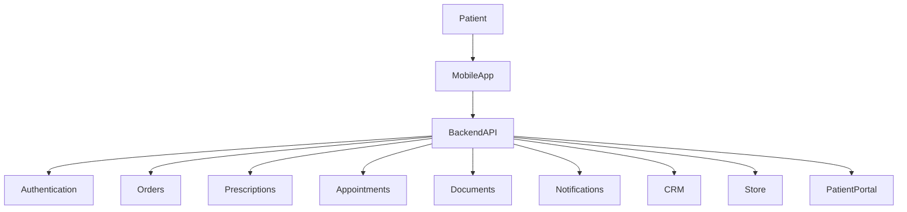
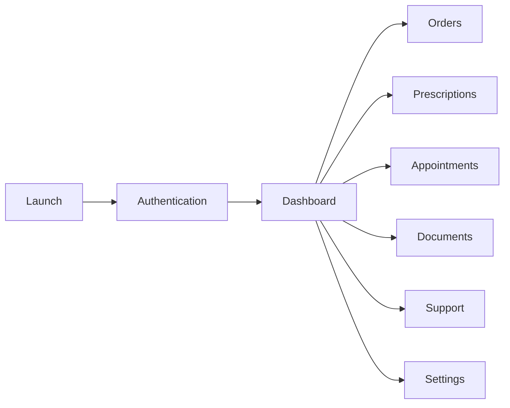
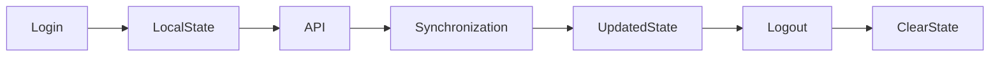
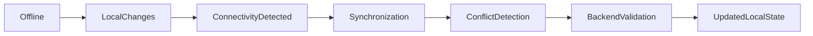
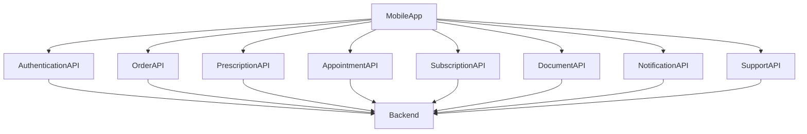
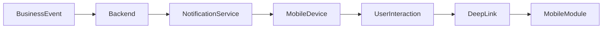
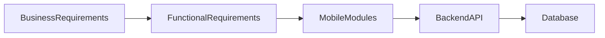

# 19 — Mobile App Architecture

| Field | Value |
|-------|-------|
| Document | Mobile App Architecture |
| Product | Clinexa |
| Version | 1.0 |
| Status | Draft for Review |
| Primary Market | United States |
| Audience | Enterprise Solution Architects, Mobile Architects, Backend Engineers, Frontend Engineers, Product, QA, Security |
| Source of Truth | 00 — Product Requirements Document |
| Related Documents | 01 Project Overview, 02 Business Requirements, 03 Functional Requirements, 04 Non-Functional Requirements, 05 System Architecture, 07 User Journeys, 08 Role Permissions, 11 API Design, 12 Authentication Flow, 13 Security, 14 Notifications, 17 Patient Portal |

---

# Table of Contents

1. Introduction
2. Mobile Architecture Principles
3. Mobile Application Overview
4. Supported Platforms
5. Mobile Modules
6. Navigation Architecture
7. Mobile State Management
8. Offline & Synchronization Strategy
9. API Integration
10. Push Notification Architecture
11. Performance Strategy
12. Accessibility
13. Mobile Security
14. Traceability Matrix
15. Future Roadmap Alignment
16. Revision History

---

# 1. Introduction

## 1.1 Purpose

This document defines the enterprise architecture of the Clinexa Mobile Application.

It establishes:

- mobile responsibilities
- architectural boundaries
- application modules
- security principles
- synchronization strategy
- API interactions
- notification architecture
- performance expectations
- accessibility goals

without defining implementation technologies or programming frameworks.

The Mobile Application is a **future platform** that extends the Patient Portal experience onto native mobile devices while maintaining the Backend API as the single source of truth.

---

## 1.2 Scope

### In Scope

- Mobile application architecture
- Patient-facing capabilities
- Authentication
- Orders
- Prescriptions
- Appointments
- Subscriptions
- Documents
- Notifications
- Profile management
- Offline architecture
- Synchronization
- Mobile security
- Push notifications

### Out of Scope

- CRM mobile application
- Store administration
- Native implementation details
- React Native
- Flutter
- Swift
- Kotlin
- UI implementation
- Database schema
- Backend APIs
- Payment provider SDK integration

---

## 1.3 Audience

| Audience | Purpose |
|------------|-------------|
| Enterprise Architects | Mobile platform architecture |
| Mobile Developers | Application responsibilities |
| Backend Engineers | Integration boundaries |
| Product Team | Feature ownership |
| QA Engineers | Mobile testing scope |
| Security Team | Mobile security controls |
| DevOps | Deployment awareness |

---

## 1.4 Related Documents

This document complements:

- Product Requirements
- Functional Requirements
- System Architecture
- Patient Portal
- API Design
- Authentication Flow
- Security
- Notifications
- Payment Flow

These documents remain authoritative for their respective domains.

---

# 2. Mobile Architecture Principles

| ID | Principle | Description |
|----|------------|-------------|
| MOB-001 | API First | All business operations occur through Backend APIs. |
| MOB-002 | Thin Client | Mobile contains presentation logic only. |
| MOB-003 | Server Source of Truth | Backend owns business state. |
| MOB-004 | Secure by Default | Every authenticated request follows enterprise security controls. |
| MOB-005 | Offline Ready | Temporary offline usage without changing business truth. |
| MOB-006 | Event Driven | Updates originate from backend events and synchronization. |
| MOB-007 | Accessibility First | Mobile follows enterprise accessibility standards. |
| MOB-008 | Platform Consistency | iOS and Android provide equivalent capabilities. |
| MOB-009 | Performance First | Optimize startup, battery, and network usage. |
| MOB-010 | Future Extensible | Architecture supports future modules without redesign. |

---

# 3. Mobile Application Overview

The Clinexa Mobile Application provides patients with secure mobile access to healthcare services.

It is **not** intended to replace:

- Storefront
- CRM
- Backend Services

Instead, it extends the Patient Portal experience using native mobile capabilities.

---

## Primary Responsibilities

The Mobile App provides:

- Secure authentication
- Dashboard
- Order tracking
- Prescription visibility
- Appointment management
- Subscription management
- Document access
- Push notifications
- Profile management
- Support interactions

Business rules remain enforced by the Backend API.

---

## Relationship with Platform Components

---

## Architectural Responsibilities

| Component | Responsibility |
|--------------|----------------|
| Mobile App | User experience |
| Backend API | Business rules |
| Authentication | Identity |
| CRM | Internal operations |
| Store | Public commerce |
| Patient Portal | Web patient experience |
| Notification Service | Message delivery |
| Payment Service | Payment processing |

---

## Architectural Boundaries

The Mobile App **must not**:

- process payments internally
- contain business rules
- approve prescriptions
- perform clinical reviews
- modify inventory
- bypass authentication
- access databases directly
- communicate with third-party services independently

All business operations must pass through the Backend API.

---

## Mobile Application Goals

The platform is designed to provide:

- Fast access to healthcare information
- Secure patient experience
- Reliable synchronization
- Cross-platform consistency
- Offline resilience
- Enterprise-grade security
- High availability
- Future scalability

while remaining fully aligned with the overall Clinexa architecture.

# 4. Supported Platforms

The Clinexa Mobile Application is intended to provide a consistent patient experience across supported mobile operating systems while respecting platform-specific user expectations and accessibility standards.

The architecture remains implementation-independent and does not prescribe any specific mobile framework.

---

## 4.1 Platform Support

| Platform | Status | Primary Users | Notes |
|-----------|--------|---------------|------|
| iOS | Supported | Patients | Native mobile experience |
| Android | Supported | Patients | Native mobile experience |

---

## 4.2 Platform Principles

| ID | Principle | Description |
|----|-----------|-------------|
| MOB-011 | Feature Parity | Core healthcare capabilities must remain consistent across supported platforms. |
| MOB-012 | Native Experience | Platform-specific interaction patterns may differ while preserving business behavior. |
| MOB-013 | Shared Business Logic | Business rules remain enforced by Backend APIs rather than device logic. |
| MOB-014 | Consistent Security | Authentication, authorization, and privacy controls remain identical across platforms. |
| MOB-015 | Platform Independence | Architecture must not depend on any specific mobile framework. |

---

## 4.3 Future Expansion

The architecture allows future support for:

- Tablets
- Foldable devices
- Wearables
- Smart health devices
- Companion healthcare applications

These remain outside Version 1 scope.

---

# 5. Mobile Modules

The Mobile Application is organized into logical modules.

Each module owns presentation responsibilities while business validation remains within Backend APIs.

---

## 5.1 Module Overview

| Module ID | Module | Priority |
|------------|---------|----------|
| MOB-020 | Authentication | Must |
| MOB-021 | Dashboard | Must |
| MOB-022 | Orders | Must |
| MOB-023 | Prescriptions | Must |
| MOB-024 | Appointments | Should |
| MOB-025 | Subscriptions | Must |
| MOB-026 | Documents | Must |
| MOB-027 | Notifications | Must |
| MOB-028 | Profile | Must |
| MOB-029 | Support | Must |
| MOB-030 | Settings | Must |

---

## 5.2 Authentication

### Responsibilities

- User Login
- Session Validation
- Password Reset
- Session Expiration
- Logout

### Ownership

Authentication Service

### Boundaries

Authentication does not:

- assign permissions
- validate prescriptions
- manage business workflows

---

## 5.3 Dashboard

Responsibilities

- Overview of patient activity
- Upcoming appointments
- Active prescriptions
- Current orders
- Subscription summary
- Recent notifications

Dashboard displays information only.

Backend determines all business state.

---

## 5.4 Orders

Responsibilities

- View Orders
- Track Status
- View Timeline
- View Order Details

Orders cannot:

- bypass fulfillment
- modify inventory
- override clinical approval

---

## 5.5 Prescriptions

Responsibilities

- View prescriptions
- View approval status
- Download prescription
- View history

The mobile application never:

- creates prescriptions
- edits prescriptions
- approves prescriptions

---

## 5.6 Appointments

Responsibilities

- View appointments
- Schedule (future roadmap)
- Reschedule (future roadmap)
- Cancel according to business policy

Backend remains authoritative.

---

## 5.7 Subscriptions

Responsibilities

- View subscription
- Renewal status
- Billing status
- Plan information

Subscription lifecycle is managed by backend services.

---

## 5.8 Documents

Responsibilities

- Secure download
- Secure viewing
- Upload where permitted
- Document history

Documents follow enterprise security policies.

---

## 5.9 Notifications

Responsibilities

- Display notifications
- Deep link handling
- Notification preferences
- Badge synchronization

Notification delivery remains server-controlled.

---

## 5.10 Profile

Responsibilities

- Personal information
- Contact information
- Communication preferences
- Password management

Clinical information remains backend owned.

---

## 5.11 Support

Responsibilities

- View support tickets
- Create ticket
- Reply
- View resolution

Support workflow is synchronized with CRM.

---

## 5.12 Settings

Responsibilities

- Theme
- Language
- Notification preferences
- Privacy settings
- Security preferences

Settings never override enterprise security policies.

---

# 6. Navigation Architecture

Navigation follows a role-aware patient experience.

Only authenticated patients may access protected areas.

---

## Navigation Flow

---

## Navigation Principles

| ID | Principle | Description |
|----|-----------|-------------|
| MOB-031 | Authentication First | Protected modules require authentication. |
| MOB-032 | Session Awareness | Expired sessions redirect to login. |
| MOB-033 | Deep Link Ready | Notifications may open directly into supported screens. |
| MOB-034 | Permission Safe | Navigation never bypasses backend authorization. |
| MOB-035 | State Restoration | Navigation restores valid session state after interruptions where permitted. |

---

# 7. Mobile State Management

The mobile application maintains temporary application state while treating Backend APIs as the source of truth.

---

## State Domains

| State | Purpose |
|---------|---------|
| Authentication | Login session |
| User | Patient profile |
| Orders | Current order information |
| Prescriptions | Prescription visibility |
| Appointments | Appointment information |
| Notifications | Notification history |
| Documents | Downloaded document metadata |
| Settings | User preferences |
| UI State | Temporary interface state |

---

## State Principles

| ID | Principle |
|----|-----------|
| MOB-040 | Server owns business truth |
| MOB-041 | Local cache is temporary |
| MOB-042 | Synchronize after reconnect |
| MOB-043 | Secure sensitive information |
| MOB-044 | Prevent stale business state |
| MOB-045 | Clear sensitive state after logout |

---

## State Lifecycle

---

# 8. Offline & Synchronization Strategy

The Clinexa Mobile Application is designed to provide a resilient user experience during temporary network interruptions while maintaining the Backend API as the single source of truth.

Offline capabilities improve usability but never replace backend validation or business processing.

---

## 8.1 Offline Principles

| ID | Principle | Description |
|----|-----------|-------------|
| MOB-050 | Server Authority | Backend remains the authoritative source for all business data. |
| MOB-051 | Offline Read Support | Previously synchronized information may remain available when offline. |
| MOB-052 | Controlled Synchronization | Local changes synchronize only after successful authentication and network availability. |
| MOB-053 | Eventual Consistency | Mobile and backend eventually converge to the same state after synchronization. |
| MOB-054 | Secure Offline Storage | Sensitive information stored offline follows enterprise security requirements. |

---

## 8.2 Offline Supported Areas

| Module | Offline Support |
|----------|----------------|
| Dashboard | Last synchronized summary |
| Orders | Previously viewed orders |
| Prescriptions | Previously synchronized prescriptions |
| Documents | Previously downloaded documents |
| Notifications | Cached notifications |
| Profile | Cached profile information |
| Settings | Local preferences |

---

## 8.3 Online Required Operations

The following operations always require backend communication:

- Authentication
- Session validation
- Password reset
- Order placement
- Payment processing
- Appointment creation
- Prescription approval
- Clinical review
- Document upload
- Subscription changes

---

## 8.4 Synchronization Lifecycle

---

## 8.5 Conflict Resolution

Whenever local information differs from backend information:

- Backend data takes precedence.
- Mobile refreshes the affected data.
- Users receive updated information after synchronization.
- Business conflicts are never resolved on the device.

---

## 8.6 Background Synchronization

Background synchronization may refresh:

- Orders
- Prescriptions
- Appointments
- Notifications
- Subscription status

Synchronization frequency should balance freshness, battery consumption, and network efficiency.

---

# 9. API Integration

The Mobile Application communicates exclusively with the Backend API.

No direct communication with databases or internal services is permitted.

---

## 9.1 Integration Principles

| ID | Principle |
|----|-----------|
| MOB-060 | HTTPS Only |
| MOB-061 | Backend API is the only communication layer |
| MOB-062 | No direct database access |
| MOB-063 | Authentication required for protected endpoints |
| MOB-064 | Business validation occurs on the server |
| MOB-065 | Standardized API error handling |

---

## 9.2 API Domains

| Domain | Purpose |
|----------|---------|
| Authentication APIs | Login, Logout, Session |
| User APIs | Patient profile |
| Order APIs | Order management |
| Prescription APIs | Prescription information |
| Appointment APIs | Appointment management |
| Subscription APIs | Subscription lifecycle |
| Document APIs | Secure document access |
| Notification APIs | Notification synchronization |
| Support APIs | Support ticket management |

---

## 9.3 API Communication

---

## 9.4 Error Handling

API failures should provide:

- User-friendly messages
- Retry guidance
- Offline fallback where applicable
- Session expiration handling
- Validation feedback

Technical implementation details remain outside this document.

---

# 10. Push Notification Architecture

Push notifications provide timely communication while respecting patient privacy and notification preferences.

Notification delivery is initiated by backend services.

---

## 10.1 Notification Principles

| ID | Principle |
|----|-----------|
| MOB-070 | Backend Controlled Delivery |
| MOB-071 | Secure Device Registration |
| MOB-072 | User Notification Preferences |
| MOB-073 | Deep Link Support |
| MOB-074 | Badge Synchronization |
| MOB-075 | Privacy Protection |

---

## 10.2 Notification Types

| Type | Example |
|------|---------|
| Order Updates | Order shipped |
| Prescription Updates | Prescription approved |
| Appointment Reminder | Upcoming consultation |
| Subscription Reminder | Renewal reminder |
| Support Updates | Ticket response |
| Document Availability | New medical document |

---

## 10.3 Notification Flow

---

## 10.4 Device Registration

The architecture supports:

- Device registration
- Device deregistration
- Token updates
- Multiple devices per patient
- Notification preference synchronization

Device registration remains backend-managed.

---

## 10.5 Deep Linking

Supported notification destinations include:

- Dashboard
- Orders
- Prescription Details
- Appointment Details
- Support Ticket
- Documents
- Notifications Center

Deep links must validate authentication before displaying protected information.

---

## 10.6 Privacy Considerations

Notifications should:

- Avoid exposing sensitive healthcare information on the lock screen.
- Respect patient notification preferences.
- Support secure opening into authenticated application screens.
- Prevent unauthorized access to protected content through notifications.

---

# 11. Performance Strategy

The Clinexa Mobile Application is designed to provide a responsive, reliable, and scalable patient experience while minimizing network usage, device resource consumption, and perceived latency.

Performance optimizations must not compromise security, data integrity, or healthcare workflows.

---

## 11.1 Performance Principles

| ID | Principle | Description |
|----|-----------|-------------|
| MOB-080 | Fast Startup | Application startup should minimize unnecessary initialization work. |
| MOB-081 | Efficient Networking | Only required data should be transferred between client and backend. |
| MOB-082 | Incremental Loading | Large datasets should be loaded progressively rather than all at once. |
| MOB-083 | Background Refresh | Non-critical updates may occur in the background when permitted. |
| MOB-084 | Battery Awareness | Synchronization and background work should avoid excessive battery usage. |
| MOB-085 | Memory Efficiency | Temporary resources should be released when no longer required. |
| MOB-086 | Image Optimization | Images should be appropriately sized and efficiently delivered. |
| MOB-087 | Graceful Degradation | Limited connectivity should reduce functionality gracefully without application failure. |

---

## 11.2 Performance Goals

| Area | Goal |
|------|------|
| Application Startup | Fast and responsive |
| Dashboard Loading | Optimized for patient overview |
| Navigation | Smooth transitions |
| API Requests | Minimized network overhead |
| Background Sync | Efficient scheduling |
| Document Loading | Progressive where applicable |
| Battery Consumption | Minimized |
| Memory Usage | Controlled and predictable |

---

## 11.3 Resource Management

The application should:

- avoid unnecessary background processing
- release inactive resources
- synchronize only when appropriate
- avoid duplicate network requests
- prioritize visible user interactions

---

# 12. Accessibility

The Clinexa Mobile Application shall support inclusive healthcare access by following modern accessibility principles.

Accessibility is considered a core architectural requirement rather than an optional enhancement.

---

## 12.1 Accessibility Principles

| ID | Principle |
|----|-----------|
| MOB-090 | Screen Reader Support |
| MOB-091 | Keyboard Accessibility (where applicable) |
| MOB-092 | Dynamic Text Support |
| MOB-093 | High Contrast Compatibility |
| MOB-094 | Clear Focus Indicators |
| MOB-095 | Accessible Forms |
| MOB-096 | Meaningful Error Messages |
| MOB-097 | Adequate Touch Targets |
| MOB-098 | Orientation Support |
| MOB-099 | Consistent Navigation |

---

## 12.2 Accessibility Requirements

The application should support:

- Screen readers
- Dynamic font sizing
- Accessible buttons
- Accessible forms
- High contrast interfaces
- Proper heading hierarchy
- Meaningful labels
- Error announcements
- Color-independent status indicators

---

## 12.3 Accessibility Boundaries

Accessibility requirements apply to:

- Authentication
- Dashboard
- Orders
- Prescriptions
- Documents
- Support
- Notifications
- Settings

---

# 13. Mobile Security

Mobile security extends the enterprise security architecture into native mobile environments.

The Backend API remains the authority for authentication, authorization, and business validation.

---

## 13.1 Security Principles

| ID | Principle |
|----|-----------|
| MOB-100 | Secure Authentication |
| MOB-101 | Secure Session Management |
| MOB-102 | Backend Authorization |
| MOB-103 | Secure API Communication |
| MOB-104 | Protected Sensitive Data |
| MOB-105 | Secure Document Access |
| MOB-106 | Device Integrity Awareness |
| MOB-107 | Secure Notification Handling |
| MOB-108 | Future Biometric Readiness |
| MOB-109 | Privacy by Design |

---

## 13.2 Authentication

The application supports:

- Secure login
- Session validation
- Secure logout
- Session expiration
- Password reset

Authentication follows the enterprise Authentication Architecture.

---

## 13.3 Sensitive Information

Sensitive healthcare information must:

- remain protected during transmission
- respect enterprise privacy policies
- follow authentication requirements
- never bypass backend authorization

---

## 13.4 Session Management

Sessions must support:

- expiration
- renewal
- invalidation
- logout
- device synchronization

---

## 13.5 Secure Documents

Medical documents require:

- authenticated access
- authorization validation
- secure download
- protected viewing

Document permissions remain controlled by backend services.

---

## 13.6 Device Security

The architecture is designed to support future capabilities including:

- biometric authentication
- trusted device registration
- secure credential storage
- compromised device awareness

without requiring architectural redesign.

---

# 14. Mobile Traceability Matrix

| Business Requirement | Functional Requirement | Mobile Module | API Domain |
|----------------------|-----------------------|--------------|-----------|
| Patient Authentication | Authentication | Authentication | Authentication API |
| Order Visibility | Orders | Orders | Orders API |
| Prescription Access | Prescriptions | Prescriptions | Prescription API |
| Appointment Management | Appointments | Appointments | Appointment API |
| Subscription Management | Subscriptions | Subscriptions | Subscription API |
| Secure Documents | Documents | Documents | Document API |
| Support Communication | Support | Support | Support API |
| Notifications | Notifications | Notifications | Notification API |

---

## Traceability Flow

---

# 15. Future Roadmap Alignment

The Mobile Application architecture supports long-term platform evolution.

---

## Version 1

Version 1 focuses on:

- Authentication
- Dashboard
- Orders
- Prescriptions
- Documents
- Notifications
- Support
- Profile
- Settings

---

## Post Version 1

Potential enhancements include:

- Appointment scheduling
- Subscription improvements
- Richer notification experiences
- Enhanced document workflows
- Offline enhancements

---

## Long-Term Vision

The architecture supports future capabilities including:

- Wearable device integration
- Health monitoring integrations
- Telemedicine expansion
- AI-assisted patient experiences
- Personalized healthcare recommendations

These capabilities remain outside the current planning scope.

---

# 16. Revision History

| Version | Date | Author | Reviewer | Status |
|----------|------|---------|-----------|--------|
| 1.0 | 2026-07-24 | Enterprise Mobile Architecture Planning | Pending | Draft for Review |

---

# Related Reading

- 00 Product Requirements Document
- 03 Functional Requirements
- 04 Non-Functional Requirements
- 05 System Architecture
- 11 API Design
- 12 Authentication Flow
- 13 Security
- 14 Notifications
- 17 Patient Portal
- 18 CRM

---

# Document Control

| Item | Value |
|------|-------|
| Classification | Internal Planning |
| Source of Truth | Product Requirements Document |
| Architecture Scope | Mobile Application |
| Status | Draft for Review |
| Version | 1.0 |
| Next Review | After Architecture Approval |