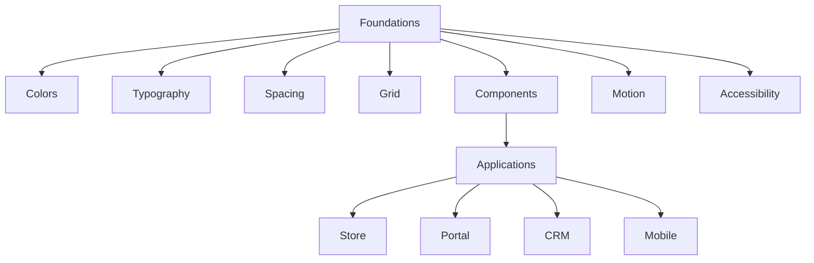
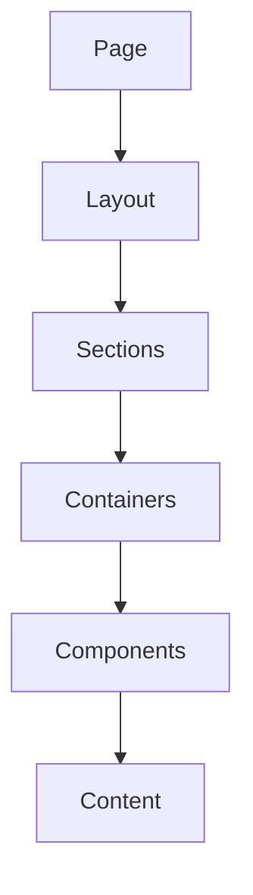
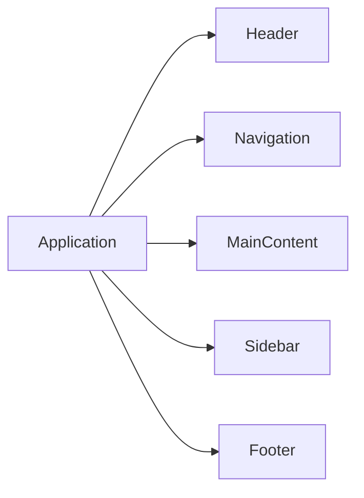
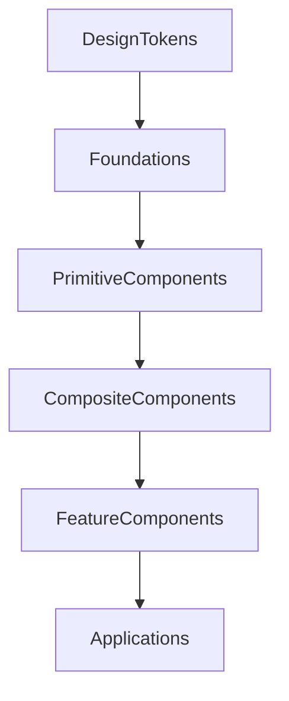
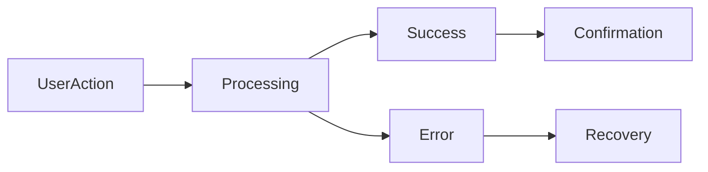
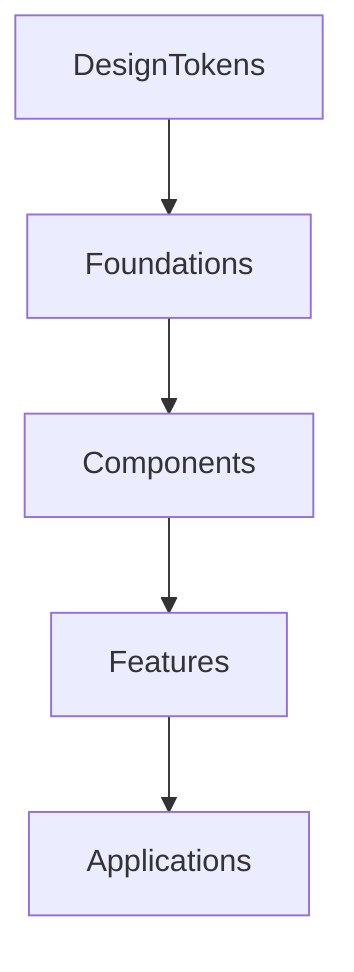
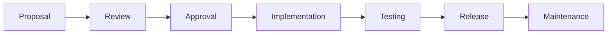

# 20 — UI Design System

| Field | Value |
|-------|-------|
| Document | UI Design System |
| Product | Clinexa |
| Version | 1.0 |
| Status | Draft for Review |
| Primary Market | United States |
| Audience | UX Architects, UI Designers, Frontend Architects, Frontend Engineers, Product, QA, Accessibility Specialists |
| Source of Truth | 00 — Product Requirements Document |
| Related Documents | 01 Project Overview, 03 Functional Requirements, 04 Non-Functional Requirements, 05 System Architecture, 16 Store Architecture, 17 Patient Portal, 18 CRM, 19 Mobile App |

---

# Table of Contents

1. Introduction
2. Design Principles
3. Design Foundations
4. Color System
5. Typography
6. Spacing System
7. Grid System
8. Responsive Breakpoints
9. Layout Principles
10. Elevation
11. Shadows
12. Border Radius
13. Iconography
14. Imagery
15. Motion Principles
16. Component Architecture
17. Forms
18. Tables
19. Navigation Components
20. Feedback Components
21. Empty States
22. Loading States
23. Error States
24. Accessibility
25. Dark Mode
26. Design Tokens
27. Design Governance
28. Design Traceability Matrix
29. Revision History

---

# 1. Introduction

## 1.1 Purpose

This document defines the enterprise UI Design System for the Clinexa platform.

It establishes a unified visual language used across:

- Store
- Patient Portal
- CRM
- Mobile Application

while remaining independent from any frontend framework, component library, or design tool.

The Design System ensures consistency, accessibility, scalability, and maintainability across all product surfaces.

---

## 1.2 Scope

### In Scope

- Visual language
- Layout principles
- Typography
- Color system
- Components
- Design tokens
- Responsive behavior
- Accessibility
- Motion
- Design governance

### Out of Scope

- Business logic
- Backend implementation
- Database design
- API contracts
- Framework-specific components
- React implementation
- Tailwind classes
- CSS implementation
- Figma-specific files

---

## 1.3 Audience

| Audience | Purpose |
|-----------|---------|
| UX Architects | Design standards |
| UI Designers | Interface consistency |
| Frontend Architects | Component architecture |
| Frontend Engineers | UI implementation guidance |
| QA | Visual validation |
| Product | Experience consistency |
| Accessibility Specialists | Inclusive design |

---

## 1.4 Related Documents

This document complements:

- Functional Requirements
- Non-Functional Requirements
- Store Architecture
- Patient Portal
- CRM
- Mobile Architecture

Business requirements remain outside the scope of this document.

---

# 2. Design Principles

The Clinexa Design System is based on enterprise healthcare software principles.

---

## 2.1 Principles

| ID | Principle | Description |
|----|-----------|-------------|
| UI-001 | Consistency | Similar problems receive similar UI solutions. |
| UI-002 | Simplicity | Reduce unnecessary complexity. |
| UI-003 | Accessibility | Design for all users. |
| UI-004 | Predictability | Interfaces behave consistently. |
| UI-005 | Feedback | Every action provides meaningful feedback. |
| UI-006 | Scalability | Components support future expansion. |
| UI-007 | Reusability | Components should be reusable across applications. |
| UI-008 | Performance | UI should remain lightweight and responsive. |
| UI-009 | Clarity | Important actions remain visually distinguishable. |
| UI-010 | Platform Consistency | Store, Portal, CRM, and Mobile share one visual language. |

---

## 2.2 Design Goals

The Design System aims to achieve:

- Visual consistency
- Reduced implementation effort
- Better accessibility
- Predictable interactions
- Easier maintenance
- Faster onboarding
- Lower design debt

---

# 3. Design Foundations

Design Foundations define the reusable visual building blocks used throughout Clinexa.

---

## Foundation Areas

| Area | Purpose |
|------|----------|
| Colors | Visual hierarchy |
| Typography | Readability |
| Spacing | Consistent layouts |
| Grid | Responsive alignment |
| Icons | Visual communication |
| Motion | Interaction feedback |
| Components | Reusable UI |
| Accessibility | Inclusive experience |

---

## Design Foundation Relationship

---

# 4. Color System

The color system communicates hierarchy, actions, states, and healthcare trust while maintaining accessibility.

Colors are semantic rather than implementation-specific.

---

## 4.1 Color Categories

| Category | Purpose |
|-----------|---------|
| Primary | Brand identity |
| Secondary | Supporting emphasis |
| Surface | Backgrounds |
| Text | Typography |
| Border | Separation |
| Success | Positive outcomes |
| Warning | Caution |
| Error | Critical issues |
| Information | Neutral communication |

---

## 4.2 Color Principles

| ID | Principle |
|----|-----------|
| UI-020 | Semantic colors only |
| UI-021 | Avoid meaning by color alone |
| UI-022 | Meet accessibility contrast requirements |
| UI-023 | Consistent status colors |
| UI-024 | Support future theming |

---

## 4.3 Status Colors

| State | Usage |
|---------|-------|
| Success | Completed actions |
| Warning | User attention required |
| Error | Failed operations |
| Information | General information |
| Disabled | Non-interactive controls |

---

# 5. Typography

Typography establishes hierarchy, readability, and consistency.

---

## Typography Principles

| ID | Principle |
|----|-----------|
| UI-030 | Clear hierarchy |
| UI-031 | Consistent scale |
| UI-032 | Readability first |
| UI-033 | Responsive sizing |
| UI-034 | Accessible contrast |

---

## Typography Levels

| Level | Purpose |
|--------|---------|
| Display | Marketing pages |
| Heading 1 | Primary page titles |
| Heading 2 | Major sections |
| Heading 3 | Subsections |
| Body | Standard content |
| Caption | Secondary information |
| Label | Form labels |

---

## Typography Rules

Typography should:

- maintain consistent spacing
- avoid excessive font variations
- prioritize readability
- support responsive layouts
- remain accessible

---

# 6. Spacing System

Spacing creates rhythm and consistency throughout the platform.

---

## Spacing Principles

| ID | Principle |
|----|-----------|
| UI-040 | Consistent spacing scale |
| UI-041 | Predictable layouts |
| UI-042 | Adequate whitespace |
| UI-043 | Visual grouping |
| UI-044 | Responsive spacing |

---

## Spacing Categories

| Category | Purpose |
|----------|---------|
| Component Padding | Internal spacing |
| Section Margin | Separation between sections |
| Layout Gap | Grid spacing |
| Form Spacing | Field separation |
| Card Spacing | Content organization |

---

## Spacing Goals

The spacing system should:

- improve readability
- reduce clutter
- create visual hierarchy
- support responsive layouts
- improve usability

---

# 7. Grid System

The Clinexa Design System uses a responsive grid architecture to create consistent layouts across all platform surfaces while maintaining flexibility for future expansion.

The grid system provides alignment, predictable spacing, and scalable content organization.

---

## 7.1 Grid Principles

| ID | Principle | Description |
|----|-----------|-------------|
| UI-050 | Consistent Alignment | UI elements align to a shared grid. |
| UI-051 | Responsive Layout | Layout adapts across supported screen sizes. |
| UI-052 | Predictable Structure | Similar pages follow similar layouts. |
| UI-053 | Flexible Composition | Components expand without breaking layout. |
| UI-054 | Maintainable Design | Grid supports future modules without redesign. |

---

## 7.2 Grid Hierarchy

---

## 7.3 Layout Containers

| Container | Purpose |
|------------|---------|
| Page Container | Overall page width |
| Section Container | Logical grouping |
| Content Container | Main content alignment |
| Card Container | Individual information blocks |
| Form Container | User input organization |
| Modal Container | Temporary interactions |

---

## 7.4 Grid Objectives

The grid system should:

- maintain alignment
- reduce visual clutter
- improve scanning
- simplify responsiveness
- improve consistency

---

# 8. Responsive Breakpoints

The platform supports responsive experiences across desktop, tablet, and mobile devices.

Specific implementation values are intentionally omitted from this architecture document.

---

## 8.1 Supported Device Categories

| Device | Purpose |
|----------|---------|
| Mobile | Small touch devices |
| Tablet | Medium screens |
| Desktop | Standard workstations |
| Large Desktop | Wide displays |

---

## 8.2 Responsive Principles

| ID | Principle |
|----|-----------|
| UI-060 | Mobile-first mindset |
| UI-061 | Flexible layouts |
| UI-062 | Consistent navigation |
| UI-063 | Readable typography |
| UI-064 | Touch-friendly controls |
| UI-065 | Adaptive spacing |

---

## 8.3 Responsive Behavior

The interface should adapt through:

- layout changes
- navigation changes
- spacing adjustments
- typography scaling
- content prioritization

without changing business functionality.

---

# 9. Layout Principles

Layout establishes predictable information hierarchy across every Clinexa application.

---

## 9.1 Layout Hierarchy

---

## 9.2 Layout Principles

| ID | Principle |
|----|-----------|
| UI-070 | Clear hierarchy |
| UI-071 | Logical grouping |
| UI-072 | Minimal visual noise |
| UI-073 | Consistent navigation |
| UI-074 | Balanced whitespace |
| UI-075 | Focus on primary actions |

---

## 9.3 Common Layout Regions

| Region | Responsibility |
|----------|---------------|
| Header | Branding and global actions |
| Navigation | Movement between modules |
| Sidebar | Contextual navigation |
| Main Content | Primary workflows |
| Footer | Supplemental information |

---

## 9.4 Content Organization

Pages should prioritize:

- Primary actions
- Frequently accessed information
- Important healthcare status
- Secondary actions
- Administrative information

---

# 10. Elevation

Elevation communicates visual hierarchy rather than physical depth.

Higher elevation indicates increased user focus.

---

## Elevation Levels

| Level | Usage |
|--------|------|
| Base | Standard page surface |
| Raised | Cards |
| Overlay | Dropdowns |
| Modal | Dialog windows |
| Critical | Alerts requiring immediate attention |

---

## Elevation Principles

| ID | Principle |
|----|-----------|
| UI-080 | Consistent hierarchy |
| UI-081 | Minimal visual distraction |
| UI-082 | Functional emphasis |
| UI-083 | Accessible contrast |

---

# 11. Shadows

Shadows reinforce elevation and component separation.

They should remain subtle and never become decorative.

---

## Shadow Usage

| Component | Purpose |
|-----------|----------|
| Card | Surface distinction |
| Dropdown | Floating content |
| Modal | Focus indication |
| Tooltip | Temporary information |

---

## Shadow Principles

- Consistent usage
- Minimal intensity
- Functional hierarchy
- Accessibility support

---

# 12. Border Radius

Border radius contributes to visual consistency while maintaining a professional healthcare appearance.

---

## Border Radius Principles

| ID | Principle |
|----|-----------|
| UI-090 | Consistent rounding |
| UI-091 | Professional appearance |
| UI-092 | Reusable across components |
| UI-093 | Accessible focus visibility |

---

## Border Radius Usage

| Component | Usage |
|-----------|-------|
| Buttons | Consistent rounding |
| Cards | Unified appearance |
| Inputs | Predictable interaction |
| Modals | Visual consistency |
| Badges | Semantic grouping |

---

# 13. Iconography

Icons provide fast visual recognition while supporting text labels.

Icons supplement information and never replace critical text.

---

## Icon Principles

| ID | Principle |
|----|-----------|
| UI-100 | Simple |
| UI-101 | Recognizable |
| UI-102 | Consistent style |
| UI-103 | Accessible labeling |
| UI-104 | Supportive, not primary communication |

---

## Icon Categories

| Category | Examples |
|----------|----------|
| Navigation | Home, Back, Menu |
| Healthcare | Prescription, Appointment |
| Commerce | Cart, Payment |
| Status | Success, Warning, Error |
| User | Profile, Settings |
| Communication | Notifications, Messages |

---

## Icon Guidelines

Icons should:

- remain visually consistent
- accompany important actions
- support accessibility
- scale across devices

---

# 14. Imagery

Imagery reinforces trust and professionalism throughout the Clinexa platform.

Images must support content rather than distract from it.

---

## Image Types

| Type | Usage |
|------|-------|
| Product Images | Store |
| Healthcare Illustrations | Education |
| Empty State Illustrations | Guidance |
| User Avatars | Profile |
| Marketing Images | Public pages |

---

## Imagery Principles

| ID | Principle |
|----|-----------|
| UI-110 | Relevant |
| UI-111 | Professional |
| UI-112 | High quality |
| UI-113 | Accessible |
| UI-114 | Performance optimized |

---

## Imagery Guidelines

Images should:

- load efficiently
- include alternative text
- maintain consistent style
- support responsive layouts
- avoid conveying critical information alone

---

# 15. Motion Principles

Motion enhances usability by communicating transitions, hierarchy, and system feedback.

Animations should support user understanding rather than provide decorative effects.

---

## 15.1 Motion Objectives

The motion system aims to:

- Improve navigation clarity
- Reinforce hierarchy
- Provide interaction feedback
- Reduce perceived latency
- Maintain interface consistency

---

## 15.2 Motion Principles

| ID | Principle | Description |
|----|-----------|-------------|
| UI-120 | Purposeful Motion | Every animation serves a functional purpose. |
| UI-121 | Fast Interactions | Motion should feel responsive. |
| UI-122 | Consistent Timing | Similar interactions use similar timing. |
| UI-123 | Non-Blocking | Animations must never delay user workflows. |
| UI-124 | Accessibility Aware | Motion respects reduced-motion preferences. |

---

## 15.3 Motion Categories

| Category | Purpose |
|-----------|---------|
| Page Transition | Navigation between screens |
| Component Transition | Show or hide components |
| Feedback Animation | Confirm completed actions |
| Loading Animation | Indicate background work |
| Expansion Animation | Reveal additional information |

---

## 15.4 Motion Guidelines

Motion should:

- remain subtle
- avoid excessive movement
- reinforce user expectations
- preserve accessibility
- perform efficiently

---

# 16. Component Architecture

The Clinexa Design System is built upon reusable, composable components shared across all applications.

Components provide visual consistency while allowing application-specific functionality.

---

## 16.1 Component Hierarchy

---

## 16.2 Component Layers

| Layer | Purpose |
|--------|---------|
| Design Tokens | Shared visual values |
| Foundations | Colors, spacing, typography |
| Primitive Components | Buttons, Inputs, Icons |
| Composite Components | Cards, Forms, Tables |
| Feature Components | Checkout, Dashboard Widgets, Patient Cards |
| Applications | Store, Portal, CRM, Mobile |

---

## 16.3 Component Principles

| ID | Principle |
|----|-----------|
| UI-130 | Reusable |
| UI-131 | Modular |
| UI-132 | Configurable |
| UI-133 | Accessible |
| UI-134 | Testable |
| UI-135 | Framework Independent |

---

## 16.4 Component Ownership

| Component Type | Owner |
|----------------|------|
| Foundations | Design System |
| Shared Components | Frontend Platform |
| Feature Components | Product Teams |
| Business Logic | Application Layer |

---

# 17. Forms

Forms enable structured data collection while minimizing user effort and reducing validation errors.

---

## 17.1 Form Principles

| ID | Principle |
|----|-----------|
| UI-140 | Clear Labels |
| UI-141 | Inline Validation |
| UI-142 | Consistent Layout |
| UI-143 | Accessible Controls |
| UI-144 | Helpful Error Messages |
| UI-145 | Minimize Required Input |

---

## 17.2 Form Elements

| Element | Purpose |
|----------|---------|
| Text Input | General text |
| Password | Secure authentication |
| Dropdown | Controlled selection |
| Checkbox | Multiple selections |
| Radio Button | Single selection |
| Toggle | Binary setting |
| Date Picker | Date selection |
| File Upload | Document submission |
| Text Area | Long-form content |

---

## 17.3 Validation States

| State | Meaning |
|--------|---------|
| Default | Awaiting input |
| Focus | Active field |
| Valid | Accepted input |
| Warning | User attention recommended |
| Error | Invalid input |
| Disabled | Non-editable |

---

## 17.4 Form Guidelines

Forms should:

- group related fields
- minimize scrolling
- display validation immediately when appropriate
- preserve entered information where possible
- clearly identify required fields

---

# 18. Tables

Tables present structured information consistently across administrative and patient interfaces.

---

## Table Principles

| ID | Principle |
|----|-----------|
| UI-150 | Readability |
| UI-151 | Sortability |
| UI-152 | Responsive Adaptation |
| UI-153 | Accessible Headers |
| UI-154 | Predictable Actions |

---

## Table Features

| Feature | Purpose |
|----------|---------|
| Sorting | Data organization |
| Filtering | Information discovery |
| Pagination | Large datasets |
| Row Actions | Contextual operations |
| Bulk Selection | Administrative workflows |

---

## Table Guidelines

Tables should:

- prioritize readability
- avoid unnecessary columns
- maintain consistent spacing
- support keyboard navigation
- remain responsive

---

# 19. Navigation Components

Navigation enables users to move efficiently throughout the Clinexa platform.

---

## Navigation Types

| Component | Purpose |
|-----------|---------|
| Top Navigation | Global actions |
| Sidebar | Primary application navigation |
| Tabs | Context switching |
| Breadcrumbs | Hierarchical navigation |
| Pagination | Multi-page datasets |
| Footer Navigation | Secondary links |

---

## Navigation Principles

| ID | Principle |
|----|-----------|
| UI-160 | Consistent placement |
| UI-161 | Clear hierarchy |
| UI-162 | Predictable behavior |
| UI-163 | Responsive adaptation |
| UI-164 | Accessible interaction |

---

## Navigation Flow

---

# 20. Feedback Components

Feedback components communicate system status and user outcomes.

---

## Feedback Types

| Component | Purpose |
|-----------|---------|
| Toast | Temporary feedback |
| Banner | Persistent information |
| Alert | Critical notification |
| Modal | Important confirmation |
| Progress Indicator | Long-running operations |
| Badge | Status indication |

---

## Feedback Principles

| ID | Principle |
|----|-----------|
| UI-170 | Immediate |
| UI-171 | Understandable |
| UI-172 | Actionable |
| UI-173 | Non-Intrusive |
| UI-174 | Accessible |

---

## Feedback Lifecycle

---

## Feedback Guidelines

Feedback should:

- appear immediately
- clearly explain outcomes
- guide recovery when errors occur
- disappear appropriately when temporary
- remain accessible to assistive technologies

---

# 21. Empty States

Empty states guide users when content is unavailable or an action has not yet been performed.

They should educate users, reduce uncertainty, and encourage the next meaningful action.

---

## 21.1 Empty State Principles

| ID | Principle | Description |
|----|-----------|-------------|
| UI-180 | Informative | Explain why no content is shown. |
| UI-181 | Actionable | Offer a meaningful next step whenever possible. |
| UI-182 | Positive Tone | Encourage users without creating frustration. |
| UI-183 | Consistent Design | Empty states follow shared component patterns. |

---

## 21.2 Empty State Examples

| Scenario | Recommended Message |
|-----------|--------------------|
| No Orders | Start your first order. |
| No Prescriptions | Your prescriptions will appear here. |
| No Notifications | You're all caught up. |
| No Support Tickets | Create a support request if you need assistance. |
| No Appointments | Schedule your first appointment. |

---

## 21.3 Empty State Components

An empty state may include:

- Illustration
- Title
- Supporting description
- Primary action
- Secondary action (optional)

---

# 22. Loading States

Loading states communicate that the system is processing information.

Loading indicators should reduce perceived waiting time while preventing unnecessary user actions.

---

## 22.1 Loading Principles

| ID | Principle |
|----|-----------|
| UI-190 | Immediate feedback |
| UI-191 | Consistent indicators |
| UI-192 | Avoid layout shifts |
| UI-193 | Minimize perceived delay |
| UI-194 | Accessible announcements |

---

## 22.2 Loading Types

| Type | Usage |
|------|-------|
| Skeleton Loading | Page content |
| Spinner | Short operations |
| Progress Indicator | Long-running processes |
| Inline Loader | Component updates |
| Button Loader | Form submissions |

---

## 22.3 Loading Guidelines

Loading indicators should:

- appear immediately
- disappear automatically after completion
- avoid blocking unrelated actions
- maintain page layout stability

---

# 23. Error States

Error states provide users with understandable information and clear recovery options.

Errors should never expose technical implementation details.

---

## 23.1 Error Principles

| ID | Principle |
|----|-----------|
| UI-200 | Clear language |
| UI-201 | Explain recovery |
| UI-202 | Preserve user input |
| UI-203 | Consistent appearance |
| UI-204 | Avoid technical jargon |

---

## 23.2 Error Categories

| Category | Example |
|-----------|---------|
| Validation | Required field missing |
| Authentication | Session expired |
| Authorization | Access denied |
| Network | Connection unavailable |
| System | Unexpected server issue |

---

## 23.3 Error Recovery

Whenever possible the interface should provide:

- Retry
- Refresh
- Contact Support
- Return to previous page
- Continue where appropriate

---

# 24. Accessibility

Accessibility is a mandatory requirement for every Clinexa interface.

The Design System supports inclusive healthcare experiences for all users.

---

## 24.1 Accessibility Principles

| ID | Principle |
|----|-----------|
| UI-210 | WCAG Alignment |
| UI-211 | Keyboard Accessibility |
| UI-212 | Screen Reader Support |
| UI-213 | Color Contrast Compliance |
| UI-214 | Semantic Structure |
| UI-215 | Accessible Forms |
| UI-216 | Focus Visibility |
| UI-217 | Alternative Text Support |

---

## 24.2 Accessibility Requirements

The design system should support:

- keyboard navigation
- screen readers
- dynamic text sizing
- reduced motion preferences
- high contrast interfaces
- accessible color usage
- accessible error messaging
- logical heading hierarchy

---

## 24.3 Accessibility Scope

Accessibility applies to:

- Store
- Patient Portal
- CRM
- Mobile Application

---

# 25. Dark Mode

The design system supports future theming capabilities including dark mode.

Dark mode must preserve usability, accessibility, and visual hierarchy.

---

## Dark Mode Principles

| ID | Principle |
|----|-----------|
| UI-220 | Semantic colors |
| UI-221 | Accessible contrast |
| UI-222 | Consistent component behavior |
| UI-223 | Shared design tokens |
| UI-224 | Theme independence |

---

## Dark Mode Scope

Dark mode applies consistently across:

- Navigation
- Forms
- Cards
- Tables
- Dialogs
- Notifications
- Dashboards

---

# 26. Design Tokens

Design Tokens provide reusable visual values shared across every Clinexa application.

They form the lowest level of the Design System.

---

## Token Categories

| Category | Purpose |
|-----------|---------|
| Colors | Visual identity |
| Typography | Text hierarchy |
| Spacing | Layout rhythm |
| Radius | Corner styling |
| Shadows | Elevation |
| Motion | Animation timing |
| Borders | Component separation |
| Opacity | Visual emphasis |

---

## Token Hierarchy

---

## Token Principles

| ID | Principle |
|----|-----------|
| UI-230 | Single source of truth |
| UI-231 | Reusable |
| UI-232 | Platform independent |
| UI-233 | Theme aware |
| UI-234 | Scalable |

---

# 27. Design Governance

Design Governance ensures long-term consistency across the Clinexa ecosystem.

---

## Governance Responsibilities

| Role | Responsibility |
|------|----------------|
| Design System Team | Foundations and shared components |
| Product Teams | Feature-specific components |
| UX Team | User experience standards |
| Frontend Team | Component implementation |
| QA Team | Visual regression validation |

---

## Governance Principles

| ID | Principle |
|----|-----------|
| UI-240 | Shared ownership |
| UI-241 | Version controlled |
| UI-242 | Backward compatibility |
| UI-243 | Documentation first |
| UI-244 | Continuous improvement |

---

## Component Lifecycle

---

# 28. Design Traceability Matrix

| Business Goal | Design Foundation | Component Layer | Applications |
|---------------|------------------|-----------------|--------------|
| Consistency | Design Tokens | Shared Components | Store, Portal, CRM, Mobile |
| Accessibility | Accessibility Standards | Forms | All Applications |
| Scalability | Foundations | Component Library | All Applications |
| Usability | Navigation Principles | Navigation Components | All Applications |
| Maintainability | Governance | Shared Library | Entire Platform |

---

## Design Traceability Flow

---

# 29. Revision History

| Version | Date | Author | Reviewer | Status |
|----------|------|---------|-----------|--------|
| 1.0 | 2026-07-24 | Enterprise UI Design Planning | Pending | Draft for Review |

---

# Related Reading

- 00 Product Requirements Document
- 03 Functional Requirements
- 04 Non-Functional Requirements
- 05 System Architecture
- 16 Store Architecture
- 17 Patient Portal
- 18 CRM
- 19 Mobile App

---

# Document Control

| Item | Value |
|------|-------|
| Classification | Internal Planning |
| Source of Truth | Product Requirements Document |
| Architecture Scope | Platform UI Design System |
| Status | Draft for Review |
| Version | 1.0 |
| Next Review | After Design System Approval |