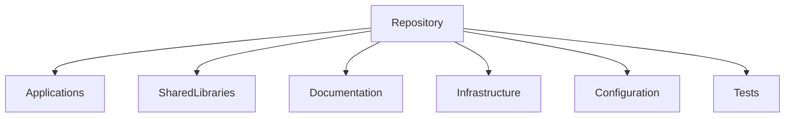
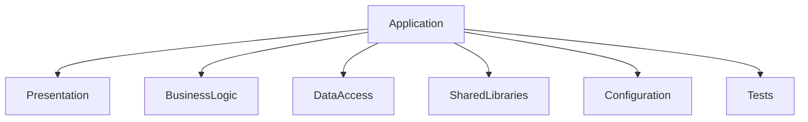
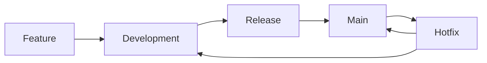
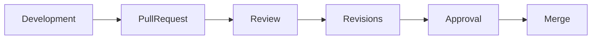
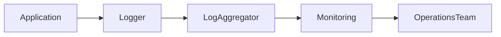
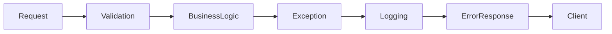
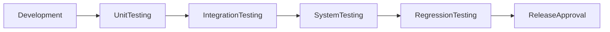
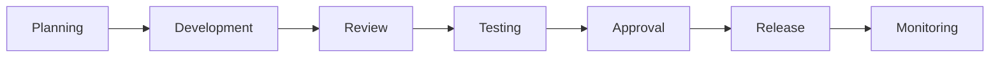
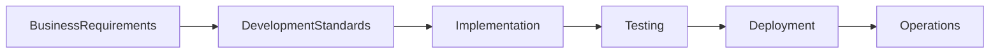

# 21 — Development Guidelines

| Field | Value |
|-------|-------|
| Document | Development Guidelines |
| Product | Clinexa |
| Version | 1.0 |
| Status | Draft for Review |
| Primary Market | United States |
| Audience | Software Architects, Frontend Engineers, Backend Engineers, QA Engineers, DevOps Engineers, Product Team |
| Source of Truth | 00 — Product Requirements Document |
| Related Documents | 04 Non-Functional Requirements, 05 System Architecture, 10 Database Design, 11 API Design, 12 Authentication Flow, 13 Security, 20 UI Design System |

---

# Table of Contents

1. Introduction
2. Development Principles
3. Repository Organization
4. Coding Standards
5. Naming Conventions
6. Project Structure
7. Branching Strategy
8. Git Commit Standards
9. Pull Request Guidelines
10. Code Review Process
11. Documentation Standards
12. Configuration Management
13. Dependency Management
14. Logging Standards
15. Error Handling
16. Security Guidelines
17. Performance Guidelines
18. Testing Responsibilities
19. CI/CD Expectations
20. Development Governance
21. Traceability Matrix
22. Revision History

---

# 1. Introduction

## 1.1 Purpose

This document defines the enterprise development standards for the Clinexa platform.

It establishes common engineering practices to ensure:

- maintainability
- consistency
- scalability
- security
- code quality
- collaboration

across all teams and repositories.

These guidelines apply to every software component regardless of programming language or implementation framework.

---

## 1.2 Scope

### In Scope

- Source code standards
- Repository organization
- Branch management
- Code reviews
- Documentation
- Logging
- Error handling
- Security practices
- Performance expectations
- Development workflows

### Out of Scope

- Product requirements
- UI design specifications
- Database schema
- API contracts
- Deployment infrastructure
- Business workflows

---

## 1.3 Audience

| Audience | Purpose |
|-----------|---------|
| Frontend Engineers | UI implementation standards |
| Backend Engineers | Service development standards |
| QA Engineers | Development quality expectations |
| DevOps Engineers | Build and release alignment |
| Architects | Technical governance |
| Product Team | Development visibility |

---

## 1.4 Related Documents

This document complements:

- System Architecture
- API Design
- Security
- Database Design
- UI Design System

These documents remain authoritative for their respective domains.

---

# 2. Development Principles

Development across Clinexa follows a shared set of engineering principles.

---

## 2.1 Engineering Principles

| ID | Principle | Description |
|----|-----------|-------------|
| DEV-001 | Readability First | Code should prioritize clarity over cleverness. |
| DEV-002 | Consistency | Similar problems receive similar solutions. |
| DEV-003 | Maintainability | Code should be easy to modify and extend. |
| DEV-004 | Security by Default | Secure practices are mandatory. |
| DEV-005 | Testability | Components should support effective testing. |
| DEV-006 | Modularity | Systems should be organized into reusable modules. |
| DEV-007 | Documentation | Significant architectural decisions should be documented. |
| DEV-008 | Performance | Efficiency should be considered during development. |
| DEV-009 | Simplicity | Avoid unnecessary complexity. |
| DEV-010 | Scalability | Solutions should support future growth. |

---

## 2.2 Development Goals

The engineering process aims to provide:

- predictable releases
- high-quality software
- reduced technical debt
- simplified onboarding
- reliable collaboration
- long-term maintainability

---

# 3. Repository Organization

Repositories should follow a predictable structure to improve discoverability and maintenance.

---

## Repository Principles

| ID | Principle |
|----|-----------|
| DEV-020 | Clear separation of concerns |
| DEV-021 | Consistent directory structure |
| DEV-022 | Shared documentation |
| DEV-023 | Modular organization |
| DEV-024 | Version-controlled configuration |

---

## Repository Hierarchy

---

## Repository Areas

| Area | Purpose |
|------|---------|
| Applications | Product applications |
| Shared Libraries | Reusable code |
| Documentation | Technical documentation |
| Infrastructure | Infrastructure configuration |
| Configuration | Shared settings |
| Tests | Automated testing assets |

---

# 4. Coding Standards

Coding standards ensure consistent implementation across teams.

---

## Coding Principles

| ID | Principle |
|----|-----------|
| DEV-030 | Self-explanatory code |
| DEV-031 | Small reusable functions |
| DEV-032 | Single responsibility |
| DEV-033 | Consistent formatting |
| DEV-034 | Avoid duplicated logic |
| DEV-035 | Prefer composition over duplication |

---

## General Guidelines

Code should:

- be readable
- be modular
- avoid unnecessary nesting
- use meaningful names
- minimize side effects
- separate business logic from presentation
- avoid dead code
- remove unused dependencies

---

# 5. Naming Conventions

Consistent naming improves readability and maintainability.

---

## Naming Principles

| ID | Principle |
|----|-----------|
| DEV-040 | Descriptive names |
| DEV-041 | Consistent terminology |
| DEV-042 | Avoid abbreviations unless widely accepted |
| DEV-043 | Domain-driven naming |
| DEV-044 | Predictable structure |

---

## Naming Guidelines

| Item | Recommendation |
|------|----------------|
| Variables | Meaningful nouns |
| Functions | Verb-based names |
| Classes | Domain concepts |
| Components | Feature-oriented names |
| Files | Consistent project conventions |
| APIs | Resource-oriented naming |

---

## Naming Goals

Names should:

- describe intent
- avoid ambiguity
- remain consistent across modules
- align with business terminology

---

# 6. Project Structure

The Clinexa platform should maintain a consistent project structure across all applications and services to improve maintainability, onboarding, and scalability.

---

## 6.1 Structure Principles

| ID | Principle | Description |
|----|-----------|-------------|
| DEV-050 | Separation of Concerns | Business logic, presentation, and infrastructure remain separated. |
| DEV-051 | Feature Organization | Related functionality is grouped together. |
| DEV-052 | Reusability | Shared functionality resides in reusable modules. |
| DEV-053 | Predictability | Similar projects follow similar structures. |
| DEV-054 | Scalability | New features integrate without restructuring the project. |

---

## 6.2 Logical Architecture

---

## 6.3 Project Layers

| Layer | Responsibility |
|---------|---------------|
| Presentation | User interface and request handling |
| Business Logic | Business rules and workflows |
| Data Access | Database and external service communication |
| Shared Libraries | Reusable utilities and common modules |
| Configuration | Environment-specific settings |
| Tests | Automated validation |

---

## 6.4 Structure Goals

Project organization should:

- simplify navigation
- isolate responsibilities
- encourage reuse
- support testing
- minimize coupling

---

# 7. Branching Strategy

Source control follows a predictable branching strategy that supports parallel development and stable releases.

---

## 7.1 Branch Types

| Branch | Purpose |
|---------|---------|
| Main | Production-ready code |
| Development | Integration branch |
| Feature | Individual feature work |
| Release | Release preparation |
| Hotfix | Production fixes |

---

## 7.2 Branch Principles

| ID | Principle |
|----|-----------|
| DEV-060 | Small focused branches |
| DEV-061 | Frequent synchronization |
| DEV-062 | Pull Request required |
| DEV-063 | Protected production branch |
| DEV-064 | Clear branch naming |

---

## 7.3 Branch Lifecycle

---

## 7.4 Branch Naming Examples

| Branch Type | Example |
|--------------|---------|
| Feature | feature/patient-dashboard |
| Bug Fix | bugfix/login-validation |
| Release | release/v1.0 |
| Hotfix | hotfix/payment-timeout |

---

# 8. Git Commit Standards

Meaningful commit history improves traceability and simplifies debugging.

---

## 8.1 Commit Principles

| ID | Principle |
|----|-----------|
| DEV-070 | One logical change per commit |
| DEV-071 | Clear commit messages |
| DEV-072 | Atomic commits |
| DEV-073 | Avoid unrelated changes |
| DEV-074 | Maintain readable history |

---

## 8.2 Recommended Commit Types

| Type | Purpose |
|------|---------|
| feat | New functionality |
| fix | Bug fix |
| refactor | Code improvement |
| docs | Documentation |
| test | Testing changes |
| style | Formatting |
| chore | Maintenance |

---

## 8.3 Commit Message Guidelines

Commit messages should:

- describe intent
- remain concise
- use present tense
- avoid vague wording
- reference related work when appropriate

---

# 9. Pull Request Guidelines

Every change should be reviewed before merging into a shared branch.

---

## 9.1 Pull Request Objectives

- Improve code quality
- Share knowledge
- Detect defects early
- Maintain architectural consistency
- Ensure documentation remains current

---

## 9.2 Pull Request Requirements

| Requirement | Description |
|-------------|-------------|
| Clear Summary | Explain purpose of the change |
| Scope | Describe affected modules |
| Testing | Describe validation performed |
| Documentation | Update documentation if required |
| Screenshots | Include UI evidence where applicable |

---

## 9.3 Pull Request Checklist

Before requesting review:

- Code builds successfully
- Tests pass
- Documentation updated
- Security considerations reviewed
- No debugging code remains
- No unused dependencies introduced

---

## 9.4 Pull Request Workflow

---

# 10. Code Review Process

Code review is a mandatory quality assurance activity.

Reviews verify correctness, maintainability, security, and consistency.

---

## 10.1 Review Principles

| ID | Principle |
|----|-----------|
| DEV-080 | Respectful collaboration |
| DEV-081 | Architecture compliance |
| DEV-082 | Security awareness |
| DEV-083 | Knowledge sharing |
| DEV-084 | Continuous improvement |

---

## 10.2 Review Areas

| Area | Validation |
|------|------------|
| Architecture | Follows platform standards |
| Readability | Easy to understand |
| Security | No obvious vulnerabilities |
| Performance | Efficient implementation |
| Testing | Appropriate automated coverage |
| Documentation | Updated where necessary |

---

## 10.3 Reviewer Responsibilities

Reviewers should:

- understand the business context
- verify architectural alignment
- identify potential defects
- recommend improvements
- approve only production-ready changes

---

## 10.4 Author Responsibilities

Authors should:

- keep pull requests focused
- respond constructively to feedback
- update documentation when required
- resolve review comments before merge
- ensure code remains maintainable

---

# 11. Documentation Standards

Documentation is a core engineering responsibility and should evolve alongside the codebase.

Every significant architectural or functional change should be reflected in the appropriate documentation.

---

## 11.1 Documentation Principles

| ID | Principle | Description |
|----|-----------|-------------|
| DEV-090 | Documentation First | Significant decisions should be documented before implementation. |
| DEV-091 | Keep Documentation Current | Documentation should evolve with the codebase. |
| DEV-092 | Single Source of Truth | Avoid duplicated documentation. |
| DEV-093 | Clear Language | Documentation should be understandable by technical and non-technical stakeholders. |
| DEV-094 | Version Controlled | Documentation changes should be tracked through source control. |

---

## 11.2 Documentation Categories

| Category | Purpose |
|----------|---------|
| Architecture | System design |
| API | Service contracts |
| Database | Data model |
| Deployment | Operational guidance |
| User Documentation | Product usage |
| Developer Documentation | Engineering guidance |

---

## 11.3 Documentation Guidelines

Documentation should:

- explain intent rather than implementation details
- remain concise
- include diagrams where appropriate
- avoid duplicated information
- reference related documents

---

# 12. Configuration Management

Configuration should remain external to application logic and support multiple deployment environments.

---

## 12.1 Configuration Principles

| ID | Principle |
|----|-----------|
| DEV-100 | Environment-specific configuration |
| DEV-101 | Secure secret management |
| DEV-102 | Version-controlled defaults |
| DEV-103 | Immutable production configuration |
| DEV-104 | Principle of least privilege |

---

## 12.2 Configuration Categories

| Category | Examples |
|----------|----------|
| Application | Feature flags, runtime settings |
| Infrastructure | Service endpoints |
| Database | Connection settings |
| Authentication | Identity providers |
| Notifications | Messaging providers |
| Logging | Log levels |

---

## 12.3 Configuration Guidelines

Configuration should:

- avoid hardcoded values
- separate secrets from source code
- support environment isolation
- be validated during startup
- remain auditable

---

# 13. Dependency Management

External dependencies should be selected carefully to reduce operational risk and long-term maintenance costs.

---

## 13.1 Dependency Principles

| ID | Principle |
|----|-----------|
| DEV-110 | Prefer stable dependencies |
| DEV-111 | Minimize dependency count |
| DEV-112 | Keep dependencies updated |
| DEV-113 | Review security advisories |
| DEV-114 | Remove unused dependencies |

---

## 13.2 Dependency Categories

| Category | Purpose |
|----------|---------|
| Runtime | Production functionality |
| Development | Local development |
| Testing | Automated testing |
| Build | Build pipeline |
| Tooling | Development productivity |

---

## 13.3 Dependency Review

Dependencies should be periodically reviewed for:

- security vulnerabilities
- maintenance status
- licensing compatibility
- community support
- version compatibility

---

# 14. Logging Standards

Logging provides operational visibility while protecting sensitive healthcare information.

---

## 14.1 Logging Principles

| ID | Principle |
|----|-----------|
| DEV-120 | Structured logging |
| DEV-121 | Consistent log levels |
| DEV-122 | No sensitive patient data |
| DEV-123 | Actionable information |
| DEV-124 | Traceable requests |

---

## 14.2 Log Levels

| Level | Purpose |
|--------|---------|
| Debug | Development diagnostics |
| Information | Normal operations |
| Warning | Recoverable issues |
| Error | Failed operations |
| Critical | System instability |

---

## 14.3 Logging Guidelines

Logs should include:

- timestamp
- request identifier
- service identifier
- operation name
- severity level

Logs should never contain:

- passwords
- authentication tokens
- payment information
- protected health information
- encryption keys

---

## 14.4 Logging Flow

---

# 15. Error Handling

Error handling should provide predictable system behavior while protecting internal implementation details.

---

## 15.1 Error Handling Principles

| ID | Principle |
|----|-----------|
| DEV-130 | Consistent responses |
| DEV-131 | Fail gracefully |
| DEV-132 | Protect sensitive information |
| DEV-133 | Meaningful logging |
| DEV-134 | User-friendly messaging |

---

## 15.2 Error Categories

| Category | Description |
|----------|-------------|
| Validation | Invalid user input |
| Authentication | Identity verification failure |
| Authorization | Permission denied |
| Business Rule | Domain constraint violation |
| Infrastructure | External dependency failure |
| Unexpected | Unhandled system failure |

---

## 15.3 Error Handling Lifecycle

---

## 15.4 Error Handling Guidelines

Applications should:

- validate input early
- return standardized error responses
- avoid exposing stack traces
- log unexpected failures
- support troubleshooting through correlation identifiers

---

# 16. Security Guidelines

Security is a shared responsibility across every stage of the software development lifecycle.

All development activities must align with the enterprise Security Architecture defined in Document 13.

---

## 16.1 Security Principles

| ID | Principle | Description |
|----|-----------|-------------|
| DEV-140 | Secure by Default | New features should adopt secure defaults. |
| DEV-141 | Least Privilege | Components receive only required permissions. |
| DEV-142 | Defense in Depth | Multiple security layers reduce overall risk. |
| DEV-143 | Validate All Inputs | External input is never trusted implicitly. |
| DEV-144 | Protect Sensitive Data | Sensitive information is encrypted and access-controlled. |
| DEV-145 | Security Reviews | Significant architectural changes include security review. |

---

## 16.2 Secure Development Practices

Development should include:

- Input validation
- Output encoding
- Authentication enforcement
- Authorization verification
- Secure secret management
- Dependency vulnerability monitoring
- Secure session handling
- Encryption where appropriate

---

## 16.3 Sensitive Data Handling

Applications must never expose:

- Passwords
- Authentication tokens
- API secrets
- Encryption keys
- Payment credentials
- Protected Health Information (PHI)

All sensitive information must follow enterprise security policies.

---

## 16.4 Security Validation

Security validation should include:

- Static analysis
- Dependency scanning
- Authentication testing
- Authorization verification
- API security testing
- Secure configuration review

---

# 17. Performance Guidelines

Performance is considered throughout development rather than after implementation.

---

## 17.1 Performance Principles

| ID | Principle |
|----|-----------|
| DEV-150 | Efficient algorithms |
| DEV-151 | Minimize unnecessary processing |
| DEV-152 | Optimize network communication |
| DEV-153 | Reduce database overhead |
| DEV-154 | Measure before optimizing |

---

## 17.2 Performance Areas

| Area | Focus |
|------|-------|
| Frontend | Rendering efficiency |
| Backend | Request processing |
| Database | Query optimization |
| APIs | Response efficiency |
| Network | Payload optimization |

---

## 17.3 Performance Guidelines

Applications should:

- avoid redundant operations
- optimize resource usage
- cache where appropriate
- reduce unnecessary API calls
- monitor critical operations

---

# 18. Testing Responsibilities

Quality is a shared responsibility across engineering teams.

Testing should occur throughout the development lifecycle.

---

## 18.1 Testing Principles

| ID | Principle |
|----|-----------|
| DEV-160 | Shift Left Testing |
| DEV-161 | Automated First |
| DEV-162 | Repeatable Validation |
| DEV-163 | Risk-Based Testing |
| DEV-164 | Continuous Quality |

---

## 18.2 Testing Responsibilities

| Team | Responsibility |
|------|----------------|
| Developers | Unit and integration testing |
| QA Engineers | Functional and regression testing |
| Product Team | Business acceptance |
| Security Team | Security validation |
| DevOps | Pipeline verification |

---

## 18.3 Testing Categories

| Category | Purpose |
|----------|---------|
| Unit Testing | Individual components |
| Integration Testing | Service interaction |
| API Testing | Contract validation |
| End-to-End Testing | Business workflows |
| Performance Testing | Scalability validation |
| Security Testing | Vulnerability assessment |

---

## 18.4 Testing Lifecycle

---

# 19. CI/CD Expectations

Continuous Integration and Continuous Delivery support reliable software releases.

Automation reduces manual effort and improves consistency.

---

## 19.1 CI/CD Principles

| ID | Principle |
|----|-----------|
| DEV-170 | Automated builds |
| DEV-171 | Automated testing |
| DEV-172 | Repeatable deployments |
| DEV-173 | Version traceability |
| DEV-174 | Fast feedback |

---

## 19.2 Pipeline Stages

| Stage | Purpose |
|--------|---------|
| Source Control | Version management |
| Build | Compile and package |
| Static Analysis | Code quality checks |
| Testing | Automated validation |
| Security Scanning | Vulnerability detection |
| Deployment | Environment release |

---

## 19.3 Release Expectations

Every release should:

- pass automated validation
- satisfy quality gates
- include release documentation
- remain traceable
- support rollback where required

---

# 20. Development Governance

Development Governance ensures engineering practices remain consistent across all Clinexa applications.

---

## Governance Responsibilities

| Role | Responsibility |
|------|----------------|
| Architecture Team | Technical standards |
| Engineering Leads | Implementation oversight |
| Developers | Coding compliance |
| QA Team | Quality validation |
| DevOps | Delivery process |
| Product Team | Business alignment |

---

## Governance Principles

| ID | Principle |
|----|-----------|
| DEV-180 | Shared ownership |
| DEV-181 | Continuous improvement |
| DEV-182 | Documentation-driven development |
| DEV-183 | Architecture compliance |
| DEV-184 | Quality before delivery |

---

## Governance Workflow

---

# 21. Development Traceability Matrix

| Business Goal | Development Principle | Quality Practice | Outcome |
|---------------|----------------------|-----------------|---------|
| Maintainability | Readability | Code Review | Sustainable codebase |
| Scalability | Modularity | Architecture Review | Future growth |
| Security | Secure by Default | Security Testing | Protected platform |
| Reliability | Automated Testing | CI/CD | Stable releases |
| Consistency | Shared Standards | Documentation | Unified engineering practices |

---

## Development Traceability Flow

---

# 22. Revision History

| Version | Date | Author | Reviewer | Status |
|----------|------|---------|-----------|--------|
| 1.0 | 2026-07-24 | Enterprise Development Planning | Pending | Draft for Review |

---

# Related Reading

- 04 Non-Functional Requirements
- 05 System Architecture
- 10 Database Design
- 11 API Design
- 12 Authentication Flow
- 13 Security
- 20 UI Design System

---

# Document Control

| Item | Value |
|------|-------|
| Classification | Internal Planning |
| Source of Truth | Product Requirements Document |
| Architecture Scope | Development Standards |
| Status | Draft for Review |
| Version | 1.0 |
| Next Review | Before Implementation Phase |