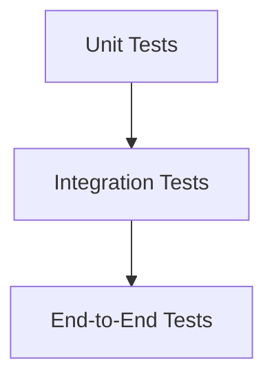
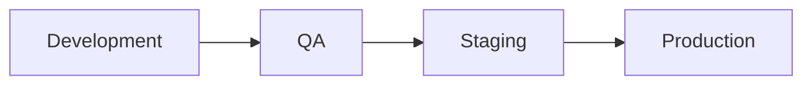
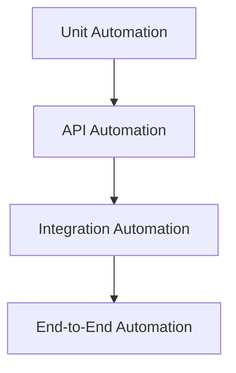
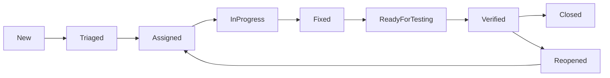
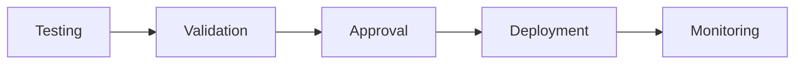
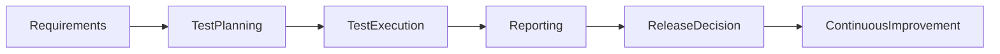
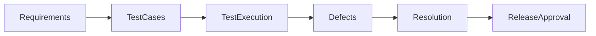

# 22 — Testing Strategy

| Field | Value |
|-------|-------|
| Document | Testing Strategy |
| Product | Clinexa |
| Version | 1.0 |
| Status | Draft for Review |
| Primary Market | United States |
| Audience | QA Engineers, Software Engineers, Test Automation Engineers, DevOps Engineers, Product Managers, Security Team |
| Source of Truth | 00 — Product Requirements Document |
| Related Documents | 03 Functional Requirements, 04 Non-Functional Requirements, 05 System Architecture, 11 API Design, 13 Security, 21 Development Guidelines |

---

# Table of Contents

1. Introduction
2. Testing Principles
3. Quality Objectives
4. Testing Levels
5. Test Types
6. Test Environment Strategy
7. Test Data Management
8. Automation Strategy
9. Defect Management
10. Entry & Exit Criteria
11. Release Validation
12. Quality Metrics
13. Testing Governance
14. Traceability Matrix
15. Revision History

---

# 1. Introduction

## 1.1 Purpose

This document defines the enterprise testing strategy for the Clinexa platform.

It establishes a consistent quality assurance approach across all applications, services, and environments while supporting reliable software delivery.

The strategy applies to every software component regardless of implementation technology.

---

## 1.2 Objectives

The testing strategy aims to:

- improve software quality
- reduce production defects
- increase release confidence
- automate repeatable validation
- detect issues early
- support continuous delivery

---

## 1.3 Scope

### In Scope

- Functional testing
- API testing
- Integration testing
- UI testing
- Automation
- Performance testing
- Security testing
- Regression testing
- User Acceptance Testing
- Release validation

### Out of Scope

- Product planning
- Architecture decisions
- Development standards
- Deployment infrastructure
- Business process ownership

---

## 1.4 Audience

| Audience | Purpose |
|-----------|---------|
| QA Engineers | Testing execution |
| Developers | Unit & integration testing |
| Automation Engineers | Automated validation |
| DevOps | CI/CD quality gates |
| Product Team | Acceptance validation |
| Security Team | Security verification |

---

# 2. Testing Principles

Testing is a shared engineering responsibility.

Quality is built throughout the software lifecycle rather than added at the end.

---

## 2.1 Testing Principles

| ID | Principle | Description |
|----|-----------|-------------|
| TEST-001 | Shift Left | Begin testing early in development. |
| TEST-002 | Risk Based | Prioritize testing by business impact and technical risk. |
| TEST-003 | Automation First | Automate repeatable validation where practical. |
| TEST-004 | Continuous Testing | Validate throughout development. |
| TEST-005 | Traceability | Every requirement should be testable. |
| TEST-006 | Repeatability | Test execution should produce consistent results. |
| TEST-007 | Independent Verification | QA provides unbiased validation. |
| TEST-008 | Security Awareness | Security validation is part of quality. |
| TEST-009 | Performance Awareness | Performance expectations are validated continuously. |
| TEST-010 | Continuous Improvement | Testing practices evolve over time. |

---

# 3. Quality Objectives

The Clinexa platform seeks to deliver reliable, secure, and maintainable healthcare software.

---

## Quality Goals

| Goal | Description |
|------|-------------|
| Reliability | Stable production releases |
| Accuracy | Correct business behavior |
| Security | Protection of sensitive information |
| Performance | Responsive user experience |
| Accessibility | Inclusive healthcare experience |
| Maintainability | Sustainable engineering quality |

---

## Quality Success Indicators

- Reduced production incidents
- High automated test coverage
- Predictable release quality
- Faster regression execution
- Lower defect escape rate
- Improved customer confidence

---

# 4. Testing Levels

Testing is performed at multiple levels to validate the system progressively.

---

## 4.1 Testing Pyramid

---

## 4.2 Testing Levels

| Level | Purpose |
|--------|---------|
| Unit | Validate individual components |
| Integration | Validate service interaction |
| System | Validate complete applications |
| End-to-End | Validate business workflows |
| Acceptance | Validate business expectations |

---

## 4.3 Responsibilities

| Testing Level | Primary Owner |
|--------------|---------------|
| Unit | Developers |
| Integration | Developers |
| API | Developers + QA |
| System | QA |
| End-to-End | QA + Automation |
| Acceptance | Product Team |

---

# 5. Test Types

Different testing types validate different aspects of the Clinexa platform.

Collectively they ensure business correctness, system reliability, performance, and security.

---

## 5.1 Functional Testing

Functional testing verifies that software behaves according to business and functional requirements.

### Scope

- User authentication
- Product catalog
- Patient Portal
- CRM
- Orders
- Prescriptions
- Appointments
- Notifications
- Payments
- Subscriptions

---

## 5.2 API Testing

API testing validates communication between frontend applications and backend services.

### Validation Areas

| Area | Purpose |
|------|---------|
| Request Validation | Input correctness |
| Response Validation | Expected output |
| Authentication | Secure access |
| Authorization | Permission verification |
| Error Handling | Consistent failures |
| Performance | Response efficiency |

---

## 5.3 Integration Testing

Integration testing verifies interactions between independent components.

Examples include:

- Frontend ↔ Backend
- Backend ↔ Database
- Backend ↔ Payment Provider
- Backend ↔ Notification Service
- CRM ↔ Patient Portal

---

## 5.4 System Testing

System testing validates complete application behavior in an environment that closely resembles production.

Validation includes:

- Complete user journeys
- Business workflows
- Cross-module interaction
- End-to-end data flow
- Regression validation

---

## 5.5 End-to-End Testing

End-to-End testing validates complete business scenarios from the user's perspective.

Typical workflows include:

- User Registration
- Login
- Product Purchase
- Questionnaire Completion
- Order Processing
- Prescription Approval
- Notification Delivery
- Subscription Renewal

---

## 5.6 Regression Testing

Regression testing ensures previously working functionality remains unaffected after changes.

Regression suites should prioritize:

- Critical business workflows
- Authentication
- Checkout
- Patient Portal
- CRM operations
- Payment processing

---

## 5.7 Performance Testing

Performance testing validates responsiveness and scalability.

Areas include:

- Response time
- Throughput
- Concurrent users
- Resource utilization
- Database performance

---

## 5.8 Security Testing

Security testing validates compliance with enterprise security requirements.

Validation areas include:

- Authentication
- Authorization
- Session management
- Input validation
- Secure communication
- Access control

---

## 5.9 Accessibility Testing

Accessibility testing verifies compliance with accessibility requirements.

Validation includes:

- Keyboard navigation
- Screen reader compatibility
- Color contrast
- Focus management
- Form accessibility
- Responsive behavior

---

## 5.10 Compatibility Testing

Compatibility testing validates application behavior across supported environments.

Examples include:

- Browsers
- Mobile devices
- Tablets
- Operating systems
- Screen resolutions

---

# 6. Test Environment Strategy

Testing should occur in controlled environments that closely resemble production.

---

## 6.1 Environment Principles

| ID | Principle |
|----|-----------|
| TEST-020 | Environment isolation |
| TEST-021 | Production similarity |
| TEST-022 | Stable configuration |
| TEST-023 | Controlled deployments |
| TEST-024 | Independent validation |

---

## 6.2 Environment Types

| Environment | Purpose |
|------------|---------|
| Local | Developer validation |
| Development | Shared development |
| QA | Functional testing |
| Staging | Pre-production validation |
| Production | Live environment |

---

## 6.3 Environment Responsibilities

| Environment | Primary Users |
|-------------|---------------|
| Local | Developers |
| Development | Developers |
| QA | QA Engineers |
| Staging | QA, Product, Stakeholders |
| Production | End Users |

---

## 6.4 Environment Lifecycle

---

## 6.5 Environment Requirements

Each environment should provide:

- Stable configuration
- Isolated databases
- Representative test data
- Controlled deployments
- Monitoring capabilities

---

# 7. Test Data Management

Reliable testing depends upon controlled, repeatable, and secure test data.

---

## 7.1 Test Data Principles

| ID | Principle |
|----|-----------|
| TEST-030 | Representative datasets |
| TEST-031 | Repeatable testing |
| TEST-032 | Secure handling |
| TEST-033 | Environment isolation |
| TEST-034 | Controlled refresh |

---

## 7.2 Test Data Categories

| Category | Purpose |
|----------|---------|
| Patient Accounts | User validation |
| Orders | Workflow testing |
| Prescriptions | Clinical workflows |
| Appointments | Scheduling validation |
| Products | Store testing |
| Payments | Transaction validation |
| Notifications | Messaging validation |

---

## 7.3 Test Data Guidelines

Test data should:

- represent realistic business scenarios
- avoid production personal information
- remain reusable
- support automated execution
- be refreshable when required

---

## 7.4 Sensitive Data

Production healthcare information must never be used directly for testing.

Testing environments should use:

- synthetic data
- anonymized datasets
- masked information

to maintain compliance with security and privacy requirements.

---

# 8. Automation Strategy

Automation is a key component of the Clinexa quality strategy.

Automated validation increases release confidence, reduces manual effort, and enables continuous delivery.

---

## 8.1 Automation Principles

| ID | Principle | Description |
|----|-----------|-------------|
| TEST-040 | Automate Repetitive Tasks | Frequently executed tests should be automated. |
| TEST-041 | Risk-Based Automation | Prioritize high-value business workflows. |
| TEST-042 | Maintainable Tests | Automation should remain easy to update. |
| TEST-043 | Independent Execution | Automated tests should execute independently whenever possible. |
| TEST-044 | Continuous Execution | Automation integrates into the CI/CD pipeline. |

---

## 8.2 Automation Scope

The following areas should be prioritized for automation:

- Authentication
- User Registration
- Login
- Orders
- Checkout
- Payments
- Patient Portal
- CRM workflows
- Notifications
- Subscription management
- API validation
- Regression testing

---

## 8.3 Automation Pyramid

---

## 8.4 Automation Responsibilities

| Test Type | Primary Owner |
|------------|---------------|
| Unit Tests | Developers |
| Integration Tests | Developers |
| API Automation | QA + Developers |
| UI Automation | QA Automation Engineers |
| End-to-End Automation | QA Automation Team |
| Performance Automation | QA Performance Team |

---

## 8.5 Automation Guidelines

Automation should:

- execute consistently
- avoid unnecessary dependencies
- support parallel execution
- generate readable reports
- remain version controlled
- be reviewed like production code

---

# 9. Defect Management

Defect management provides a structured process for identifying, tracking, prioritizing, and resolving software issues.

---

## 9.1 Defect Principles

| ID | Principle |
|----|-----------|
| TEST-050 | Reproducible defects |
| TEST-051 | Clear reporting |
| TEST-052 | Risk-based prioritization |
| TEST-053 | Full lifecycle tracking |
| TEST-054 | Root cause analysis |

---

## 9.2 Defect Lifecycle

---

## 9.3 Defect Severity

| Severity | Description |
|----------|-------------|
| Critical | Business cannot continue |
| High | Major functionality affected |
| Medium | Partial functionality affected |
| Low | Minor issue with workaround |
| Cosmetic | Visual or presentation issue |

---

## 9.4 Defect Priority

| Priority | Purpose |
|----------|---------|
| P1 | Immediate resolution |
| P2 | High business importance |
| P3 | Standard resolution |
| P4 | Low urgency |

---

## 9.5 Defect Report Contents

Every defect report should include:

- Summary
- Environment
- Preconditions
- Reproduction steps
- Expected result
- Actual result
- Supporting evidence
- Severity
- Priority

---

# 10. Entry & Exit Criteria

Quality gates determine when testing may begin and when software is ready to progress to the next stage.

---

## 10.1 Entry Criteria

Testing may begin when:

- Requirements are approved
- Test environment is available
- Test data is prepared
- Required builds are deployed
- Critical dependencies are available
- Test cases are reviewed

---

## 10.2 Exit Criteria

Testing may conclude when:

- Planned test cases are executed
- Critical defects are resolved
- High-priority defects are addressed or formally accepted
- Regression testing is completed
- Acceptance criteria are satisfied
- Test summary report is completed

---

## 10.3 Quality Gates

| Stage | Required Validation |
|--------|---------------------|
| Development | Unit testing completed |
| Integration | Integration testing completed |
| QA | Functional and regression testing completed |
| Staging | User acceptance validation completed |
| Production | Release approval granted |

---

## 10.4 Release Readiness Checklist

Before approving a release:

- Functional testing completed
- Regression testing passed
- Security validation completed
- Performance validation completed
- Critical defects resolved
- Documentation updated
- Stakeholder approval obtained

---

# 11. Release Validation

Release validation confirms that the software is ready for deployment into the next environment.

It ensures that functional, technical, security, and business quality expectations have been satisfied.

---

## 11.1 Release Validation Objectives

Release validation aims to:

- Verify business-critical workflows
- Confirm production readiness
- Reduce deployment risk
- Ensure stakeholder confidence
- Validate overall system stability

---

## 11.2 Validation Areas

| Area | Validation |
|------|------------|
| Functional | Business requirements satisfied |
| Regression | Existing functionality remains unaffected |
| Performance | Response expectations achieved |
| Security | Security requirements validated |
| Accessibility | Accessibility standards maintained |
| Compatibility | Supported platforms verified |

---

## 11.3 Production Readiness Checklist

Before release approval:

- All planned testing completed
- Critical defects resolved
- High-priority defects reviewed
- Regression suite passed
- Security validation completed
- Performance validation completed
- Documentation updated
- Stakeholder approval obtained

---

## 11.4 Release Validation Workflow

---

# 12. Quality Metrics

Quality metrics provide objective indicators of software quality and testing effectiveness.

These metrics support continuous improvement and release decision-making.

---

## 12.1 Metric Principles

| ID | Principle |
|----|-----------|
| TEST-060 | Objective measurement |
| TEST-061 | Continuous monitoring |
| TEST-062 | Actionable reporting |
| TEST-063 | Trend analysis |
| TEST-064 | Data-driven improvement |

---

## 12.2 Recommended Metrics

| Metric | Purpose |
|---------|---------|
| Test Execution Progress | Measure completed testing |
| Test Pass Rate | Assess quality level |
| Defect Density | Evaluate software stability |
| Defect Escape Rate | Measure production quality |
| Automation Coverage | Evaluate automation maturity |
| Regression Duration | Measure release efficiency |
| Mean Time to Resolution | Track defect resolution efficiency |
| Build Success Rate | Monitor CI/CD reliability |

---

## 12.3 Quality Dashboard

Quality reporting should provide visibility into:

- Test execution status
- Open defects
- Defect trends
- Automation results
- Release readiness
- Overall quality health

---

# 13. Testing Governance

Testing Governance ensures quality practices remain consistent across the Clinexa platform.

---

## 13.1 Governance Responsibilities

| Role | Responsibility |
|------|----------------|
| QA Engineers | Functional validation |
| Automation Engineers | Automated testing |
| Developers | Unit & integration testing |
| Product Team | Acceptance validation |
| Security Team | Security verification |
| DevOps | Pipeline quality gates |

---

## 13.2 Governance Principles

| ID | Principle |
|----|-----------|
| TEST-070 | Shared quality ownership |
| TEST-071 | Risk-based validation |
| TEST-072 | Continuous improvement |
| TEST-073 | Traceable requirements |
| TEST-074 | Consistent standards |

---

## 13.3 Governance Workflow

---

# 14. Testing Traceability Matrix

| Business Goal | Testing Activity | Validation Method | Expected Outcome |
|---------------|------------------|-------------------|------------------|
| Reliability | Regression Testing | Automated & Manual | Stable releases |
| Security | Security Testing | Vulnerability Validation | Protected platform |
| Performance | Performance Testing | Load & Response Analysis | Responsive application |
| Maintainability | Automation | Continuous Execution | Sustainable quality |
| Compliance | Acceptance Testing | Business Validation | Regulatory alignment |

---

## Testing Traceability Flow

---

# 15. Revision History

| Version | Date | Author | Reviewer | Status |
|----------|------|---------|-----------|--------|
| 1.0 | 2026-07-24 | Enterprise QA Planning | Pending | Draft for Review |

---

# Related Reading

- 03 Functional Requirements
- 04 Non-Functional Requirements
- 05 System Architecture
- 11 API Design
- 13 Security
- 21 Development Guidelines
- 23 Deployment

---

# Document Control

| Item | Value |
|------|-------|
| Classification | Internal Planning |
| Source of Truth | Product Requirements Document |
| Architecture Scope | Enterprise Testing Strategy |
| Status | Draft for Review |
| Version | 1.0 |
| Next Review | Before Implementation Phase |