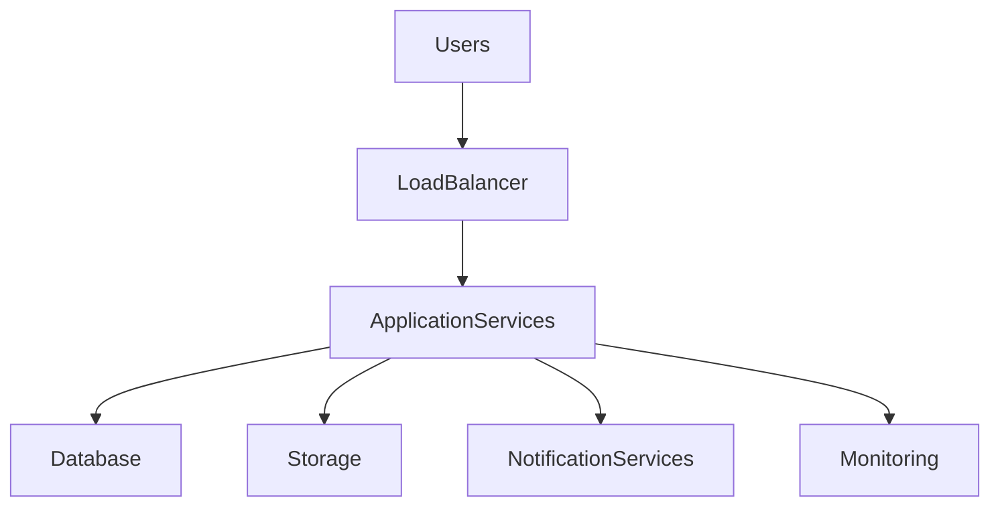

# 23 — Deployment

| Field | Value |
|-------|-------|
| Document | Deployment |
| Product | Clinexa |
| Version | 1.0 |
| Status | Draft for Review |
| Primary Market | United States |
| Audience | DevOps Engineers, Software Engineers, QA Engineers, Product Managers, System Administrators, Operations Team |
| Source of Truth | 00 — Product Requirements Document |
| Related Documents | 04 Non-Functional Requirements, 05 System Architecture, 13 Security, 21 Development Guidelines, 22 Testing Strategy |

---

# Table of Contents

1. Introduction
2. Deployment Principles
3. Deployment Environments
4. Environment Configuration
5. Release Strategy
6. Deployment Pipeline
7. Infrastructure Management
8. Monitoring & Observability
9. Rollback Strategy
10. Disaster Recovery
11. Operational Governance
12. Traceability Matrix
13. Revision History

---

# 1. Introduction

## 1.1 Purpose

This document defines the enterprise deployment strategy for the Clinexa platform.

It establishes standardized practices for deploying, releasing, monitoring, and maintaining applications across all supported environments while ensuring reliability, security, and operational consistency.

---

## 1.2 Objectives

The deployment strategy aims to:

- Deliver reliable software releases
- Minimize deployment risk
- Support continuous delivery
- Ensure operational stability
- Enable rapid recovery
- Maintain service availability

---

## 1.3 Scope

### In Scope

- Deployment environments
- Release process
- CI/CD pipeline
- Infrastructure management
- Monitoring
- Rollback procedures
- Disaster recovery
- Operational governance

### Out of Scope

- Software development
- Business requirements
- Testing implementation
- Product roadmap
- Feature planning

---

## 1.4 Audience

| Audience | Purpose |
|-----------|---------|
| DevOps Engineers | Deployment automation |
| Developers | Release preparation |
| QA Engineers | Deployment validation |
| Operations Team | Production operations |
| Product Managers | Release coordination |
| Security Team | Infrastructure compliance |

---

# 2. Deployment Principles

Reliable deployments are achieved through automation, standardization, and controlled release practices.

---

## 2.1 Deployment Principles

| ID | Principle | Description |
|----|-----------|-------------|
| DEP-001 | Automation First | Deployment activities should be automated whenever practical. |
| DEP-002 | Repeatability | Deployments should produce consistent results. |
| DEP-003 | Minimal Downtime | Releases should minimize user disruption. |
| DEP-004 | Security by Default | Deployment processes must enforce security controls. |
| DEP-005 | Observability | Deployments should be fully monitored. |
| DEP-006 | Rollback Readiness | Every deployment should support recovery. |
| DEP-007 | Version Traceability | Every deployment should be traceable to a specific release. |
| DEP-008 | Environment Consistency | Environments should remain predictable. |
| DEP-009 | Continuous Improvement | Deployment processes evolve based on operational feedback. |
| DEP-010 | Operational Ownership | Operations and engineering share deployment responsibility. |

---

# 3. Deployment Environments

The Clinexa platform progresses through multiple controlled environments before reaching production.

---

## 3.1 Environment Overview

---

## 3.2 Environment Types

| Environment | Purpose |
|-------------|---------|
| Local | Developer validation |
| Development | Shared engineering environment |
| QA | Functional and regression testing |
| Staging | Production-like validation |
| Production | Live customer environment |

---

## 3.3 Environment Responsibilities

| Environment | Primary Users |
|-------------|---------------|
| Local | Developers |
| Development | Developers |
| QA | QA Engineers |
| Staging | QA, Product Team |
| Production | End Users |

---

## 3.4 Environment Objectives

Each environment should provide:

- Predictable behavior
- Controlled access
- Stable configuration
- Environment isolation
- Reliable deployments

---

# 4. Environment Configuration

Configuration management ensures consistent application behavior across environments.

---

## 4.1 Configuration Principles

| ID | Principle |
|----|-----------|
| DEP-020 | Environment isolation |
| DEP-021 | Externalized configuration |
| DEP-022 | Secure secret management |
| DEP-023 | Version-controlled configuration |
| DEP-024 | Environment validation |

---

## 4.2 Configuration Categories

| Category | Examples |
|----------|----------|
| Application | Feature flags, runtime settings |
| Database | Connection configuration |
| Authentication | Identity providers |
| Notifications | Email and messaging services |
| Storage | Object storage configuration |
| Logging | Log destinations and levels |

---

## 4.3 Configuration Guidelines

Configuration should:

- remain outside application code
- support multiple environments
- separate secrets from configuration
- validate required values during startup
- remain auditable

---

# 5. Release Strategy

The Clinexa platform follows a controlled release strategy that prioritizes reliability, traceability, and minimal disruption to end users.

---

## 5.1 Release Principles

| ID | Principle | Description |
|----|-----------|-------------|
| DEP-030 | Planned Releases | Releases should follow an approved schedule whenever practical. |
| DEP-031 | Small Incremental Changes | Smaller deployments reduce operational risk. |
| DEP-032 | Quality Gates | Every release must satisfy predefined quality criteria. |
| DEP-033 | Version Traceability | Every release is uniquely identifiable. |
| DEP-034 | Controlled Rollout | Production releases follow approved deployment procedures. |

---

## 5.2 Release Types

| Release Type | Purpose |
|--------------|---------|
| Major Release | Significant platform enhancements |
| Minor Release | Feature additions and improvements |
| Patch Release | Bug fixes and small improvements |
| Hotfix Release | Urgent production issue resolution |

---

## 5.3 Release Lifecycle

---

## 5.4 Release Readiness

A release should only proceed when:

- Development is complete
- Testing is approved
- Security validation is complete
- Required documentation is updated
- Deployment approval has been granted
- Rollback procedures are available

---

# 6. Deployment Pipeline

The deployment pipeline automates software delivery while enforcing quality and security controls.

---

## 6.1 Pipeline Principles

| ID | Principle |
|----|-----------|
| DEP-040 | Automated execution |
| DEP-041 | Consistent deployments |
| DEP-042 | Early validation |
| DEP-043 | Security verification |
| DEP-044 | Deployment traceability |

---

## 6.2 Pipeline Stages

| Stage | Purpose |
|--------|---------|
| Source Control | Version management |
| Build | Compile and package applications |
| Static Analysis | Code quality validation |
| Automated Testing | Functional verification |
| Security Scanning | Vulnerability detection |
| Artifact Storage | Store release artifacts |
| Deployment | Environment deployment |
| Post-Deployment Validation | Verify successful release |

---

## 6.3 Deployment Pipeline

---

## 6.4 Pipeline Expectations

The deployment pipeline should:

- execute automatically where appropriate
- prevent failed builds from progressing
- maintain complete deployment history
- support rollback preparation
- generate deployment reports

---

# 7. Infrastructure Management

Infrastructure management ensures reliable platform operation across all deployment environments.

---

## 7.1 Infrastructure Principles

| ID | Principle |
|----|-----------|
| DEP-050 | Infrastructure consistency |
| DEP-051 | High availability |
| DEP-052 | Scalability |
| DEP-053 | Security compliance |
| DEP-054 | Operational visibility |

---

## 7.2 Infrastructure Components

| Component | Purpose |
|-----------|---------|
| Application Services | Host platform applications |
| Database Services | Persistent data storage |
| Storage Services | File and object storage |
| Networking | Secure communication |
| Identity Services | Authentication and authorization |
| Monitoring Services | Operational visibility |

---

## 7.3 Infrastructure Responsibilities

| Team | Responsibility |
|------|----------------|
| DevOps | Infrastructure provisioning |
| Engineering | Application deployment |
| Security | Infrastructure compliance |
| Operations | Platform monitoring |
| Product Team | Release coordination |

---

## 7.4 Infrastructure Architecture

---

## 7.5 Infrastructure Objectives

Infrastructure should provide:

- High availability
- Fault tolerance
- Horizontal scalability
- Secure communication
- Operational observability
- Reliable backup support

---

# 8. Monitoring & Observability

Continuous monitoring provides visibility into application health, system performance, and operational stability.

Observability enables engineering teams to rapidly detect, diagnose, and resolve issues.

---

## 8.1 Monitoring Principles

| ID | Principle | Description |
|----|-----------|-------------|
| DEP-060 | Continuous Visibility | Monitor all production services continuously. |
| DEP-061 | Proactive Detection | Detect issues before users report them. |
| DEP-062 | Actionable Alerts | Alerts should require meaningful action. |
| DEP-063 | Centralized Monitoring | Operational data should be consolidated. |
| DEP-064 | Performance Awareness | Monitor application performance continuously. |

---

## 8.2 Monitoring Categories

| Category | Purpose |
|----------|---------|
| Infrastructure | Resource utilization |
| Application | Service health |
| Database | Performance and availability |
| Network | Connectivity and latency |
| Security | Suspicious activity |
| Business | Critical business workflows |

---

## 8.3 Operational Metrics

Monitoring should provide visibility into:

- Service availability
- Response times
- Error rates
- Resource utilization
- Request throughput
- Database performance
- Queue processing
- Background jobs

---

## 8.4 Alert Lifecycle

---

## 8.5 Monitoring Guidelines

Monitoring should:

- minimize false positives
- support rapid investigation
- retain historical trends
- provide operational dashboards
- integrate with incident management

---

# 9. Rollback Strategy

Rollback procedures reduce operational risk by allowing rapid recovery from unsuccessful deployments.

---

## 9.1 Rollback Principles

| ID | Principle |
|----|-----------|
| DEP-070 | Rollback readiness |
| DEP-071 | Minimal service disruption |
| DEP-072 | Version traceability |
| DEP-073 | Controlled execution |
| DEP-074 | Post-rollback verification |

---

## 9.2 Rollback Triggers

Rollback may be initiated when:

- Critical production failures occur
- Security issues are identified
- Performance degradation exceeds acceptable limits
- Deployment validation fails
- Business-critical workflows are impacted

---

## 9.3 Rollback Workflow

---

## 9.4 Rollback Validation

Following rollback:

- Service availability should be verified
- Business workflows should be validated
- Monitoring should confirm system stability
- Stakeholders should be informed
- Incident documentation should be completed

---

# 10. Disaster Recovery

Disaster Recovery defines the operational approach for restoring critical services following significant outages or infrastructure failures.

---

## 10.1 Disaster Recovery Principles

| ID | Principle |
|----|-----------|
| DEP-080 | Business continuity |
| DEP-081 | Service restoration |
| DEP-082 | Data protection |
| DEP-083 | Recovery validation |
| DEP-084 | Continuous improvement |

---

## 10.2 Recovery Objectives

| Objective | Purpose |
|-----------|---------|
| Service Restoration | Resume critical operations |
| Data Recovery | Restore required information |
| Business Continuity | Maintain essential services |
| Operational Communication | Inform stakeholders |
| Incident Review | Improve future resilience |

---

## 10.3 Recovery Process

---

## 10.4 Disaster Recovery Activities

Recovery activities may include:

- Infrastructure restoration
- Database recovery
- Application deployment
- Configuration validation
- Connectivity verification
- Operational monitoring

---

## 10.5 Post-Incident Review

Following recovery:

- Root cause should be documented
- Recovery effectiveness evaluated
- Lessons learned recorded
- Improvement actions identified
- Operational procedures updated

---

# 11. Operational Governance

Operational Governance ensures that deployment, monitoring, maintenance, and incident management activities remain consistent across the Clinexa platform throughout its lifecycle.

---

## 11.1 Governance Objectives

Operational governance aims to:

- Maintain platform reliability
- Ensure operational consistency
- Improve deployment quality
- Support regulatory compliance
- Enable continuous operational improvement

---

## 11.2 Governance Responsibilities

| Role | Responsibility |
|------|----------------|
| DevOps Engineers | Deployment automation, infrastructure management |
| Operations Team | Production monitoring and incident response |
| Software Engineers | Application support and issue resolution |
| QA Engineers | Production validation and release verification |
| Security Team | Operational security oversight |
| Product Managers | Release coordination and business communication |

---

## 11.3 Operational Principles

| ID | Principle | Description |
|----|-----------|-------------|
| DEP-090 | Shared Ownership | Engineering and Operations jointly own production quality. |
| DEP-091 | Continuous Monitoring | Production systems remain continuously monitored. |
| DEP-092 | Standardized Procedures | Operational activities follow documented processes. |
| DEP-093 | Incident Learning | Every major incident contributes to process improvement. |
| DEP-094 | Controlled Change | Production changes follow approved release procedures. |

---

## 11.4 Operational Activities

Daily operational activities include:

- Infrastructure monitoring
- Service health verification
- Deployment validation
- Incident management
- Capacity observation
- Backup verification
- Security monitoring
- Operational reporting

---

## 11.5 Operational Workflow

---

# 12. Deployment Traceability Matrix

| Business Goal | Deployment Activity | Validation Method | Expected Outcome |
|---------------|---------------------|-------------------|------------------|
| Reliability | Controlled Releases | Deployment Validation | Stable production |
| Availability | Monitoring | Health Verification | High service uptime |
| Recoverability | Rollback Procedures | Recovery Validation | Rapid restoration |
| Security | Secure Deployment | Security Verification | Protected infrastructure |
| Maintainability | Operational Governance | Operational Reviews | Sustainable operations |

---

## Deployment Traceability Flow

---

# 13. Revision History

| Version | Date | Author | Reviewer | Status |
|----------|------|---------|-----------|--------|
| 1.0 | 2026-07-24 | Enterprise Deployment Planning | Pending | Draft for Review |

---

# Related Reading

- 04 Non-Functional Requirements
- 05 System Architecture
- 13 Security
- 21 Development Guidelines
- 22 Testing Strategy
- 24 Future Features

---

# Document Control

| Item | Value |
|------|-------|
| Classification | Internal Planning |
| Source of Truth | Product Requirements Document |
| Architecture Scope | Enterprise Deployment Strategy |
| Status | Draft for Review |
| Version | 1.0 |
| Next Review | Before Production Deployment |