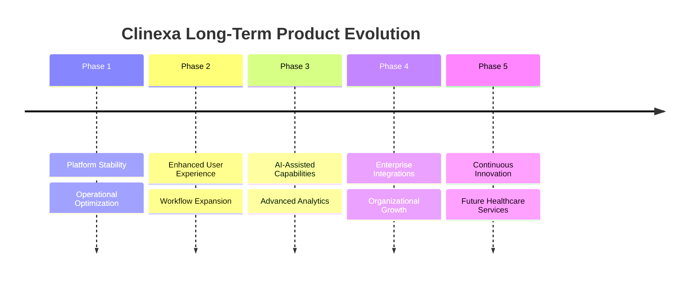

# 24 — Future Features

| Field | Value |
|-------|-------|
| Document | Future Features |
| Product | Clinexa |
| Version | 1.0 |
| Status | Draft for Review |
| Primary Market | United States |
| Audience | Product Managers, Engineering Leadership, Architects, Stakeholders, UX Team |
| Source of Truth | 00 — Product Requirements Document |
| Related Documents | 01 Project Overview, 03 Functional Requirements, 05 System Architecture, 09 Feature Roadmap, 17 Patient Portal, 18 CRM |

---

# Table of Contents

1. Introduction
2. Product Vision
3. Strategic Product Goals
4. Platform Evolution Principles
5. Patient Experience Roadmap
6. Provider Experience Roadmap
7. Administrative Enhancements
8. Artificial Intelligence Roadmap
9. Integration Roadmap
10. Analytics & Business Intelligence
11. Innovation Opportunities
12. Long-Term Roadmap
13. Traceability Matrix
14. Revision History

---

# 1. Introduction

## 1.1 Purpose

This document defines the long-term product evolution strategy for the Clinexa platform.

It identifies future capabilities that may enhance patient experience, provider efficiency, operational scalability, and business value while maintaining alignment with the platform vision.

---

## 1.2 Objectives

The Future Features document aims to:

- Define long-term platform direction
- Support strategic planning
- Encourage scalable architecture
- Guide future investment decisions
- Identify innovation opportunities
- Maintain alignment across engineering and product teams

---

## 1.3 Scope

### In Scope

- Future platform capabilities
- Product evolution
- AI opportunities
- Integrations
- Analytics
- User experience improvements
- Scalability initiatives

### Out of Scope

- Current release implementation
- Detailed technical design
- Sprint planning
- Architecture implementation
- Project scheduling

---

## 1.4 Audience

| Audience | Purpose |
|-----------|---------|
| Product Managers | Product planning |
| Engineering Leadership | Technical direction |
| Solution Architects | Platform evolution |
| UX Designers | Experience planning |
| Executive Stakeholders | Strategic planning |

---

# 2. Product Vision

The long-term vision for Clinexa is to become a comprehensive digital healthcare platform that simplifies patient care, empowers providers, and enables scalable healthcare operations.

The platform should evolve through continuous innovation while maintaining reliability, security, accessibility, and regulatory compliance.

---

## 2.1 Vision Principles

| ID | Principle | Description |
|----|-----------|-------------|
| FUT-001 | Patient-Centered | Every enhancement should improve patient outcomes or experience. |
| FUT-002 | Provider Efficiency | Reduce administrative effort for healthcare providers. |
| FUT-003 | Scalable Platform | Support organizational growth without architectural redesign. |
| FUT-004 | Intelligent Automation | Automate repetitive operational tasks where appropriate. |
| FUT-005 | Data-Driven Decisions | Use platform insights to improve care and operations. |
| FUT-006 | Secure Innovation | Innovation should never compromise security or privacy. |
| FUT-007 | Modular Growth | New capabilities should integrate cleanly with existing services. |
| FUT-008 | Continuous Improvement | Product evolution should be guided by measurable outcomes. |

---

# 3. Strategic Product Goals

Future product evolution should support both business objectives and user needs.

---

## Strategic Goals

| Goal | Description |
|------|-------------|
| Improve patient engagement | Increase patient participation throughout the care journey |
| Expand provider capabilities | Simplify clinical and operational workflows |
| Increase operational efficiency | Reduce manual administrative work |
| Support organizational growth | Enable expansion without major redesign |
| Strengthen interoperability | Improve communication with external healthcare systems |
| Enhance platform intelligence | Deliver meaningful insights through data |

---

# 4. Platform Evolution Principles

Future enhancements should follow consistent architectural and product principles.

---

## Evolution Principles

| ID | Principle |
|----|-----------|
| FUT-020 | Backward compatibility where practical |
| FUT-021 | Modular feature expansion |
| FUT-022 | User-focused design |
| FUT-023 | Incremental delivery |
| FUT-024 | Operational sustainability |
| FUT-025 | Measurable business value |

---

## Platform Evolution Goals

Future platform growth should:

- maintain architectural consistency
- minimize operational complexity
- improve maintainability
- enhance user satisfaction
- support long-term scalability

---

# 5. Patient Experience Roadmap

Future enhancements should continue improving the patient journey through greater convenience, personalization, and engagement.

---

## 5.1 Future Patient Capabilities

| Capability | Description |
|------------|-------------|
| Personalized Dashboard | Customized health information and recommendations |
| Intelligent Appointment Management | Improved scheduling and reminders |
| Medication Tracking | Enhanced medication history and adherence support |
| Wellness Programs | Preventive care and wellness initiatives |
| Health Goal Tracking | Patient-defined healthcare objectives |
| Family Account Support | Shared management for dependents where appropriate |

---

## 5.2 Future Patient Services

Potential future services include:

- Digital health records access
- Expanded communication options
- Personalized educational resources
- Health milestone tracking
- Improved notification preferences
- Simplified onboarding experience

---

## 5.3 Patient Experience Objectives

Future improvements should:

- reduce patient effort
- improve engagement
- simplify healthcare interactions
- increase accessibility
- encourage long-term platform usage

---

# 6. Provider Experience Roadmap

Healthcare providers should receive additional capabilities that improve efficiency while maintaining high standards of patient care.

---

## 6.1 Future Provider Capabilities

| Capability | Description |
|------------|-------------|
| Advanced Patient Overview | Consolidated patient information |
| Intelligent Work Queues | Prioritized clinical tasks |
| Enhanced Prescription Workflows | Improved medication management |
| Clinical Decision Support | Additional guidance during care delivery |
| Provider Collaboration | Secure coordination between healthcare professionals |
| Workflow Personalization | Configurable provider workspace |

---

## 6.2 Provider Productivity Goals

Future enhancements should:

- reduce administrative burden
- improve clinical efficiency
- support informed decision-making
- streamline daily workflows
- enhance collaboration

---

## 6.3 Provider Experience Principles

| ID | Principle |
|----|-----------|
| FUT-030 | Simplicity |
| FUT-031 | Clinical efficiency |
| FUT-032 | Reduced manual work |
| FUT-033 | Intelligent prioritization |
| FUT-034 | Secure collaboration |

---

# 7. Administrative Enhancements

Administrative capabilities should continue evolving to support organizational growth and operational excellence.

---

## 7.1 Future Administrative Capabilities

| Capability | Description |
|------------|-------------|
| Advanced User Administration | Expanded identity and access management |
| Workflow Automation | Automated operational processes |
| Enterprise Configuration | Greater platform customization |
| Operational Dashboards | Improved business visibility |
| Compliance Reporting | Enhanced regulatory reporting |
| Multi-Organization Support | Scalable administration across organizations |

---

## 7.2 Operational Improvements

Potential improvements include:

- configurable approval workflows
- centralized operational reporting
- improved audit capabilities
- enhanced role administration
- organization-wide configuration management

---

## 7.3 Administrative Objectives

Administrative enhancements should:

- simplify operations
- reduce manual administration
- improve governance
- support scalability
- increase operational visibility

---

# 8. Artificial Intelligence Roadmap

Artificial Intelligence has the potential to enhance operational efficiency, improve user experiences, and support better decision-making across the Clinexa platform.

Future AI capabilities should be introduced responsibly while maintaining transparency, privacy, and regulatory compliance.

---

## 8.1 AI Evolution Principles

| ID | Principle | Description |
|----|-----------|-------------|
| FUT-040 | Human-Centered AI | AI should assist users rather than replace critical decision-making. |
| FUT-041 | Responsible Innovation | AI features should be ethical, explainable, and trustworthy. |
| FUT-042 | Privacy First | AI capabilities must protect sensitive healthcare information. |
| FUT-043 | Incremental Adoption | AI features should evolve through controlled improvements. |
| FUT-044 | Measurable Value | AI should provide clear operational or clinical benefits. |

---

## 8.2 Potential AI Capabilities

| Capability | Description |
|------------|-------------|
| Intelligent Search | Faster discovery of patient, product, or operational information |
| Smart Recommendations | Context-aware suggestions for users |
| Workflow Assistance | Support repetitive administrative activities |
| Document Summarization | Concise summaries of lengthy information |
| Predictive Insights | Trend identification using historical platform data |
| Intelligent Notifications | Prioritized and personalized communication |

---

## 8.3 AI Governance Considerations

Future AI initiatives should include:

- human oversight
- transparent decision support
- continuous performance evaluation
- security and privacy reviews
- regulatory compliance assessments

---

# 9. Integration Roadmap

Future platform growth should enable seamless integration with external healthcare and business systems.

---

## 9.1 Integration Objectives

Future integrations should:

- reduce manual data entry
- improve interoperability
- simplify operational workflows
- enhance patient experience
- support enterprise scalability

---

## 9.2 Potential Integration Categories

| Category | Purpose |
|----------|---------|
| Electronic Health Records | Clinical information exchange |
| Identity Providers | Enterprise authentication |
| Payment Services | Expanded payment capabilities |
| Messaging Platforms | Multi-channel communication |
| Analytics Platforms | Business reporting and insights |
| Third-Party Healthcare Services | Extended healthcare functionality |

---

## 9.3 Integration Principles

| ID | Principle |
|----|-----------|
| FUT-050 | Secure communication |
| FUT-051 | Standardized interfaces |
| FUT-052 | Loose coupling |
| FUT-053 | Reliable synchronization |
| FUT-054 | Extensible architecture |

---

# 10. Analytics & Business Intelligence

Analytics capabilities should continue evolving to support better operational visibility and strategic decision-making.

---

## 10.1 Analytics Objectives

Future analytics should help organizations:

- monitor operational performance
- improve patient engagement
- identify business trends
- support informed decision-making
- optimize organizational efficiency

---

## 10.2 Future Analytics Capabilities

| Capability | Description |
|------------|-------------|
| Executive Dashboards | High-level operational visibility |
| Operational Reporting | Day-to-day business monitoring |
| Patient Insights | Engagement and usage analysis |
| Provider Performance | Operational workflow visibility |
| Trend Analysis | Long-term business trends |
| Custom Reporting | Organization-specific reporting needs |

---

## 10.3 Business Intelligence Principles

| ID | Principle |
|----|-----------|
| FUT-060 | Data accuracy |
| FUT-061 | Actionable insights |
| FUT-062 | Role-based visibility |
| FUT-063 | Scalable reporting |
| FUT-064 | Continuous measurement |

---

## 10.4 Analytics Evolution

---

# 11. Innovation Opportunities

The Clinexa platform should continuously evaluate emerging technologies and evolving healthcare practices to identify opportunities that improve patient outcomes, operational efficiency, and long-term business value.

Innovation initiatives should be evaluated based on measurable benefits, technical feasibility, regulatory compliance, and alignment with the product vision.

---

## 11.1 Innovation Principles

| ID | Principle | Description |
|----|-----------|-------------|
| FUT-070 | User Value First | Innovation should solve meaningful user problems. |
| FUT-071 | Evidence-Based Decisions | New capabilities should be supported by measurable outcomes. |
| FUT-072 | Sustainable Growth | Innovation should support long-term platform evolution. |
| FUT-073 | Regulatory Awareness | Future capabilities should align with healthcare regulations. |
| FUT-074 | Continuous Learning | Product direction should evolve based on user feedback and operational insights. |

---

## 11.2 Potential Innovation Areas

| Opportunity | Purpose |
|-------------|---------|
| Personalized Healthcare Experiences | Improve patient engagement through tailored interactions |
| Intelligent Workflow Automation | Reduce repetitive operational tasks |
| Advanced Collaboration Tools | Improve communication across care teams |
| Population Health Insights | Support large-scale healthcare analysis |
| Predictive Operational Planning | Improve organizational resource planning |
| Digital Care Expansion | Extend healthcare services beyond traditional interactions |

---

## 11.3 Innovation Evaluation Criteria

Future opportunities should be evaluated using:

- Business value
- User impact
- Technical feasibility
- Security implications
- Regulatory considerations
- Operational complexity
- Long-term maintainability

---

# 12. Long-Term Roadmap

The long-term roadmap provides strategic direction for future platform evolution without committing to fixed implementation schedules.

Future priorities should remain adaptable based on business objectives, customer feedback, regulatory requirements, and technological advancements.

---

## 12.1 Roadmap Phases

| Phase | Strategic Focus |
|--------|-----------------|
| Phase 1 | Platform maturity and operational optimization |
| Phase 2 | Expanded patient and provider capabilities |
| Phase 3 | Intelligent automation and advanced analytics |
| Phase 4 | Enterprise scalability and ecosystem integrations |
| Phase 5 | Continuous innovation and healthcare transformation |

---

## 12.2 Product Evolution Timeline

---

## 12.3 Long-Term Success Objectives

Future platform evolution should:

- improve patient satisfaction
- increase provider productivity
- strengthen operational efficiency
- support organizational scalability
- maintain security and compliance
- encourage continuous innovation

---

# 13. Future Features Traceability Matrix

| Strategic Goal | Future Initiative | Expected Benefit | Business Outcome |
|----------------|-------------------|------------------|------------------|
| Patient Engagement | Personalized Experiences | Improved usability | Higher patient retention |
| Clinical Efficiency | Provider Enhancements | Faster workflows | Increased productivity |
| Operational Excellence | Administrative Automation | Reduced manual effort | Lower operational costs |
| Intelligent Platform | AI Capabilities | Better decision support | Improved organizational efficiency |
| Business Growth | Enterprise Integrations | Expanded ecosystem | Scalable healthcare platform |

---

## Future Vision Flow

---

# 14. Revision History

| Version | Date | Author | Reviewer | Status |
|----------|------|---------|-----------|--------|
| 1.0 | 2026-07-24 | Enterprise Product Planning | Pending | Draft for Review |

---

# Related Reading

- 01 Project Overview
- 03 Functional Requirements
- 05 System Architecture
- 09 Feature Roadmap
- 17 Patient Portal
- 18 CRM
- 21 Development Guidelines
- 22 Testing Strategy
- 23 Deployment

---

# Document Control

| Item | Value |
|------|-------|
| Classification | Internal Planning |
| Source of Truth | Product Requirements Document |
| Architecture Scope | Long-Term Product Evolution |
| Status | Draft for Review |
| Version | 1.0 |
| Next Review | During Annual Product Strategy Review |